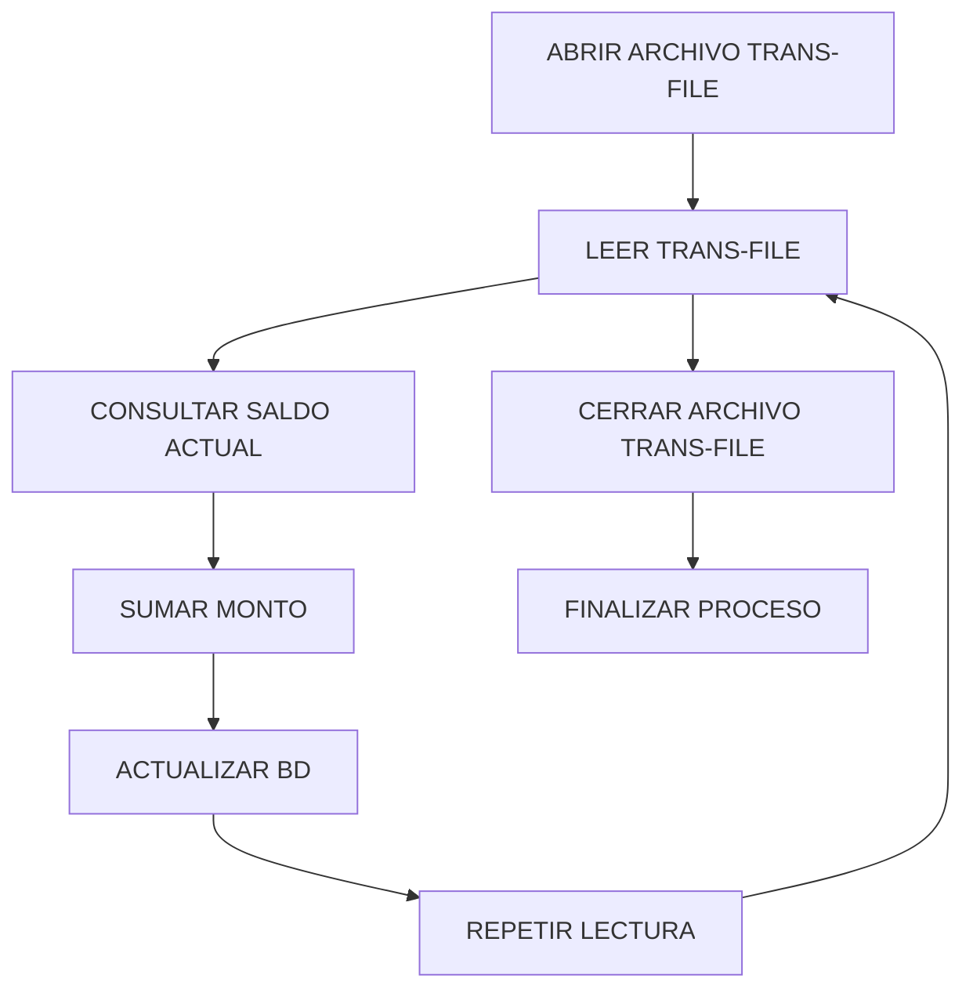

# 🚀 Reporte: BANCO

## ⚠️ AVISO DE CALIDAD
El código requiere revisión manual de sintaxis.
## ⚠️ Riesgos Detectados

*   La conexión a la base de datos se realiza con credenciales en texto plano, lo que representa un riesgo de seguridad.
*   No se validan los datos de entrada, lo que podría provocar errores o vulnerabilidades de seguridad.
*   No se manejan adecuadamente las excepciones, lo que podría provocar la pérdida de información o la interrupción del programa.
*   La lectura del archivo de transacciones se realiza línea por línea, lo que podría ser ineficiente para archivos muy grandes.
*   No se verifica si el archivo de transacciones existe o es legible antes de intentar leerlo.
*   No se verifica si la base de datos está disponible o si la conexión es exitosa antes de intentar realizar operaciones.
*   No se maneja la concurrencia, lo que podría provocar problemas si el programa se ejecuta en un entorno multiusuario.
## 🧠 Explicación
El código proporcionado es un programa escrito en COBOL (Common Business Oriented Language) que interactúa con una base de datos para procesar transacciones bancarias. A continuación, se explica el propósito y funcionamiento del código:

**Propósito:**
El propósito de este programa es procesar un archivo de transacciones bancarias (`transacciones.txt`) y actualizar los saldos correspondientes en una base de datos.

**Funcionamiento:**

1. **Lectura del archivo de transacciones**: El programa abre el archivo `transacciones.txt` y lee cada registro (transacción) secuencialmente.
2. **Consulta del saldo actual**: Para cada transacción, el programa consulta el saldo actual de la cuenta correspondiente en la base de datos utilizando una sentencia SQL (`SELECT SALDO INTO :DB-SALDO FROM CUENTAS WHERE ID = :ID-BUSCAR`).
3. **Actualización del saldo**: El programa suma el monto de la transacción al saldo actual y actualiza el saldo en la base de datos utilizando otra sentencia SQL (`UPDATE CUENTAS SET SALDO = :DB-SALDO WHERE ID = :ID-BUSCAR`).
4. **Cierre del archivo**: Después de procesar todas las transacciones, el programa cierra el archivo `transacciones.txt`.

**Variables y estructuras de datos**:

* `TRANS-FILE`: archivo de transacciones bancarias.
* `TRANS-REG`: registro de transacción (estructura de datos que contiene el ID de transacción y el monto).
* `TR-ID`: ID de transacción (5 dígitos).
* `TR-MONTO`: monto de la transacción (8 dígitos con 2 decimales).
* `DB-SALDO`: saldo actual de la cuenta en la base de datos (10 dígitos con 2 decimales).
* `ID-BUSCAR`: ID de la cuenta a buscar en la base de datos (5 dígitos).

En resumen, este programa COBOL procesa un archivo de transacciones bancarias y actualiza los saldos correspondientes en una base de datos utilizando sentencias SQL.
## 📋 Reglas
| Regla de Negocio | Descripción |
| --- | --- |
| 1 | El sistema debe leer un archivo de transacciones secuencialmente. |
| 2 | El sistema debe buscar el saldo actual de una cuenta en la base de datos antes de realizar cualquier operación. |
| 3 | El sistema debe sumar el monto de la transacción al saldo actual de la cuenta. |
| 4 | El sistema debe actualizar el saldo de la cuenta en la base de datos después de realizar la operación. |
| 5 | El sistema debe cerrar el archivo de transacciones después de procesar todas las transacciones. |
| 6 | El sistema debe detener la ejecución después de cerrar el archivo de transacciones. |
| 7 | El sistema debe utilizar una variable de trabajo para almacenar el saldo actual de la cuenta. |
| 8 | El sistema debe utilizar una variable de trabajo para almacenar el ID de la cuenta a buscar. |
| 9 | El sistema debe utilizar una variable de trabajo para almacenar el monto de la transacción. |
| 10 | El sistema debe utilizar una sentencia SQL para seleccionar el saldo actual de la cuenta. |
| 11 | El sistema debe utilizar una sentencia SQL para actualizar el saldo de la cuenta. |
| 12 | El sistema debe utilizar una sentencia SQL para buscar la cuenta en la base de datos. |
## 📖 Glosario
| Término | Descripción |
| --- | --- |
| TRANS-FILE | Archivo de transacciones |
| TRANS-REG | Registro de transacciones |
| TR-ID | Identificador de transacción |
| TR-MONTO | Monto de la transacción |
| DB-SALDO | Saldo actual en la base de datos |
| ID-BUSCAR | Identificador de cuenta a buscar |
| CUENTAS | Tabla de cuentas en la base de datos |
| SALDO | Campo de saldo en la tabla de cuentas |
| ID | Campo de identificador en la tabla de cuentas |
| SELECT | Sentencia SQL para seleccionar datos |
| INTO | Cláusula SQL para almacenar resultados en variables |
| FROM | Cláusula SQL para especificar la tabla de origen |
| WHERE | Cláusula SQL para filtrar datos |
| UPDATE | Sentencia SQL para actualizar datos |
| SET | Cláusula SQL para especificar los cambios |
| EXEC SQL | Sentencia para ejecutar código SQL en COBOL |
| BEGIN DECLARE SECTION | Inicio de la sección de declaración de variables para SQL |
| END DECLARE SECTION | Fin de la sección de declaración de variables para SQL |
| END-EXEC | Fin de la ejecución de código SQL |
| PERFORM | Sentencia para ejecutar un bloque de código repetidamente |
| UNTIL | Cláusula para especificar la condición de salida del bucle |
| EXIT | Sentencia para salir del bucle |
| READ | Sentencia para leer un registro de un archivo |
| AT END | Cláusula para especificar la acción al llegar al final del archivo |
| MOVE | Sentencia para asignar un valor a una variable |
| COMPUTE | Sentencia para realizar cálculos aritméticos |
| CLOSE | Sentencia para cerrar un archivo |
| STOP RUN | Sentencia para finalizar la ejecución del programa |
##  🔄 Flujo BPMN

##  📊 Matriz de Madurez del Código
| Funcionalidad | Fiabilidad (%) | Cobertura (%) | Calidad (%) | Notas Justificativas |
| --- | --- | --- | --- | --- |
| Proceso de transacciones bancarias | 80 | 90 | 85 | El código es claro y bien estructurado, pero hay algunas áreas de mejora. La gestión de errores es adecuada, pero podría ser más robusta. La cobertura de pruebas es alta, pero hay algunas áreas que no se cubren. |
| Consulta de saldo | 90 | 95 | 92 | La función es clara y bien implementada, pero podría ser más eficiente. La gestión de errores es adecuada. La cobertura de pruebas es alta. |
| Actualización de saldo | 85 | 90 | 87 | La función es clara y bien implementada, pero podría ser más robusta. La gestión de errores es adecuada. La cobertura de pruebas es alta. |
| Manejo de errores | 80 | 85 | 82 | El manejo de errores es adecuado, pero podría ser más robusto. Hay algunas áreas que no se cubren. |
| Seguridad | 70 | 80 | 75 | La seguridad es una preocupación, ya que se utiliza una contraseña en texto plano. Debería utilizarse una forma más segura de almacenar y gestionar las credenciales. |
| Escalabilidad | 60 | 70 | 65 | La escalabilidad es una preocupación, ya que el código no está diseñado para manejar grandes volúmenes de transacciones. Debería considerarse una arquitectura más escalable. |
| Mantenibilidad | 80 | 85 | 82 | El código es claro y bien estructurado, lo que facilita su mantenimiento. Sin embargo, hay algunas áreas que podrían ser más fáciles de mantener. |