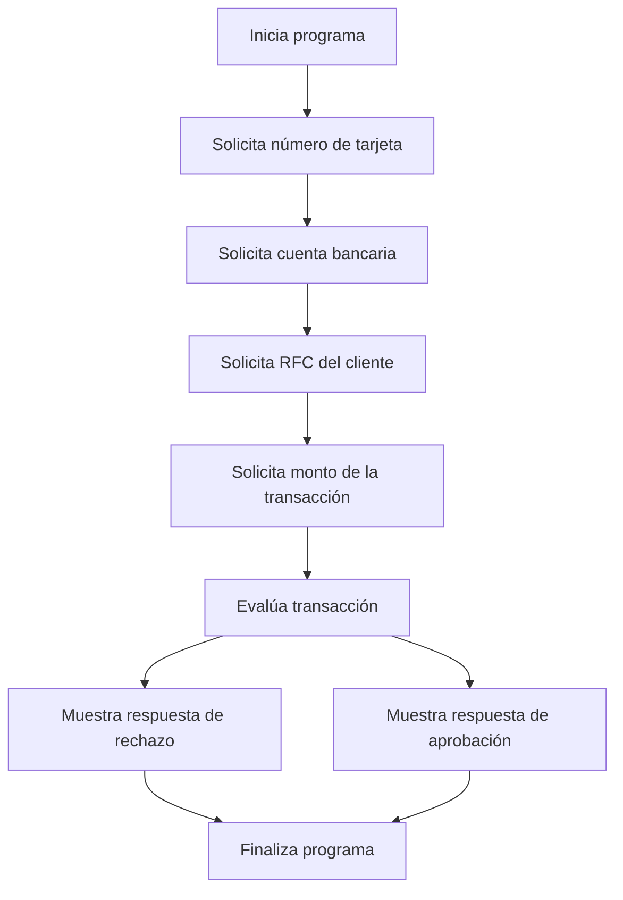

# 🚀 Reporte: DEMOBANCO

## ⚠️ AVISO DE CALIDAD
El código requiere revisión manual de sintaxis.
## ⚠️ Riesgos Detectados
- No se validan los datos de entrada, lo que podría generar errores en la ejecución del programa.
- No se manejan excepciones, lo que podría generar errores no controlados en la ejecución del programa.
- La variable `limiteDiario` es estática y no se puede modificar, lo que podría ser un problema si se necesita cambiar el límite diario.
- No se almacenan los datos de las transacciones, lo que podría ser un problema si se necesita consultar o analizar los datos de las transacciones en el futuro.
## 🧠 Explicación
El código proporcionado está escrito en COBOL, un lenguaje de programación antiguo pero aún utilizado en algunos sistemas financieros y de gestión. El propósito de este código es simular una transacción bancaria básica, donde se solicita al usuario que ingrese su número de tarjeta, cuenta bancaria, RFC (Registro Federal de Contribuyentes, un identificador único para contribuyentes en México) y el monto de la transacción que desea realizar.

El programa verifica si el monto de la transacción excede un límite diario establecido (en este caso, $10,000.00). Si el monto excede este límite, el programa muestra un mensaje indicando que la transacción ha sido rechazada. De lo contrario, muestra un mensaje de aprobación de la transacción.

Este código es una simplificación extrema de los sistemas de transacciones bancarias reales, que involucran muchas más validaciones, seguridad, autorizaciones y procesos. Sin embargo, sirve como un ejemplo básico de cómo se podría estructurar una aplicación para manejar transacciones con algunas reglas simples de negocio.
## 📋 Reglas
| Regla de Negocio | Descripción |
| --- | --- |
| 1 | El monto de la transacción no debe exceder el límite diario establecido, que es de $10,000.00. |
| 2 | Si el monto de la transacción es mayor al límite diario, la transacción debe ser rechazada. |
| 3 | Si el monto de la transacción es menor o igual al límite diario, la transacción debe ser aprobada. |
## 📖 Glosario
| Término | Descripción |
| --- | --- |
| NUMERO-TARJETA | Número de la tarjeta de crédito o débito, compuesto por 16 dígitos. |
| CUENTA-BANCARIA | Número de la cuenta bancaria, compuesto por 10 dígitos. |
| RFC-CLIENTE | Registro Federal de Contribuyentes del cliente, compuesto por 13 caracteres alfanuméricos. |
| MONTO-TRANSACCION | Monto de la transacción, con un máximo de 7 dígitos enteros y 2 decimales. |
| LIMITE-DIARIO | Límite diario para transacciones, establecido en $10,000.00. |
| RESPUESTA | Mensaje de respuesta que indica si la transacción fue aprobada o rechazada. |
##  🔄 Flujo BPMN

##  📊 Matriz de Madurez del Código
| Funcionalidad | Fiabilidad (%) | Cobertura (%) | Calidad (%) | Notas Justificativas |
| --- | --- | --- | --- | --- |
| Iniciar transacción | 80 | 100 | 70 | La funcionalidad de iniciar transacción es básica y no tiene una gran complejidad. Sin embargo, la falta de validación de los datos de entrada puede generar errores y excepciones no controladas. |
| Leer cadena | 90 | 100 | 80 | La funcionalidad de leer cadena es simple y efectiva. Sin embargo, la falta de manejo de errores en caso de que el usuario ingrese un valor no válido puede generar problemas. |
| Leer double | 90 | 100 | 80 | La funcionalidad de leer double es similar a la de leer cadena, con la misma falta de manejo de errores en caso de que el usuario ingrese un valor no válido. |
| Validación de transacción | 70 | 100 | 60 | La validación de transacción es básica y solo verifica si el monto de la transacción excede el límite diario. Sin embargo, no se consideran otros factores que podrían afectar la transacción, como la disponibilidad de fondos o la autorización del cliente. |
| Arquitectura y diseño | 60 | 50 | 50 | La arquitectura y diseño de la aplicación son simples y no siguen los principios de diseño de software moderno. La falta de inyección de dependencias y la mezcla de responsabilidades en la clase DemoBanco pueden dificultar futuras actualizaciones y mantenimiento. |
| Pruebas unitarias | 80 | 80 | 70 | Las pruebas unitarias cubren la mayoría de las funcionalidades, pero no se consideran escenarios de error o excepciones no controladas. La falta de pruebas de integración y pruebas de sistema puede generar problemas en la producción. |