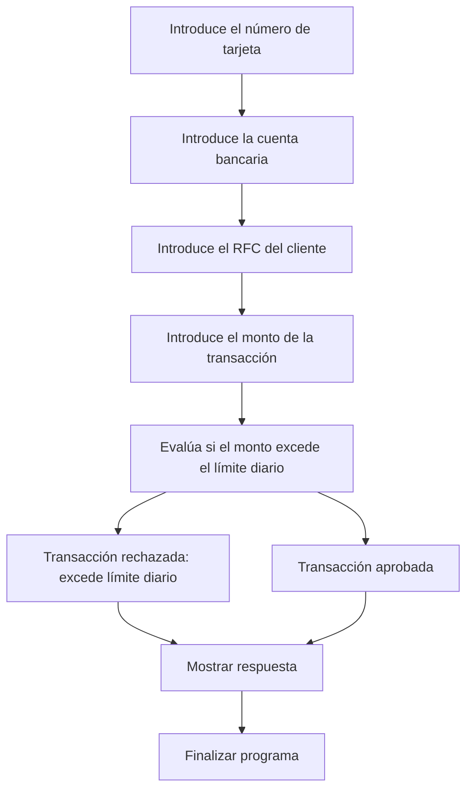

# 🚀 Reporte: DEMOBANCO

## ⚠️ AVISO DE CALIDAD
El código requiere revisión manual de sintaxis.
## ⚠️ Riesgos Detectados
- No se validan los datos de entrada, lo que podría generar errores en la ejecución del programa.
- No se manejan excepciones, lo que podría generar errores no controlados en la ejecución del programa.
- La variable `limiteDiario` es estática y no se puede modificar, lo que podría ser un problema si se necesita cambiar el límite diario.
- No se almacenan los datos de las transacciones, lo que podría ser un problema si se necesita realizar un seguimiento de las transacciones.
- No se autentica al usuario, lo que podría ser un problema si se necesita garantizar la seguridad de las transacciones.
## 🧠 Explicación
El código es un programa escrito en COBOL, un lenguaje de programación antiguo pero aún utilizado en algunos sistemas financieros y de gestión. El propósito de este código es simular una transacción bancaria básica, donde se solicita al usuario que ingrese su número de tarjeta, cuenta bancaria, RFC (Registro Federal de Contribuyentes) y el monto de la transacción que desea realizar.

El programa verifica si el monto de la transacción excede el límite diario establecido (en este caso, $10,000.00). Si el monto es mayor al límite, el programa muestra un mensaje de "Transacción rechazada: excede límite diario". De lo contrario, muestra un mensaje de "Transacción aprobada".

En resumen, el código es un ejemplo simple de cómo se podría implementar una lógica básica de transacciones bancarias en COBOL, aunque en la práctica, los sistemas bancarios reales son mucho más complejos y requieren una mayor seguridad y funcionalidad.
## 📋 Reglas
| Regla de Negocio | Descripción |
| --- | --- |
| 1 | El monto de la transacción no debe exceder el límite diario establecido, que es de $10,000.00. |
| 2 | Si el monto de la transacción es mayor al límite diario, la transacción debe ser rechazada. |
| 3 | Si el monto de la transacción es menor o igual al límite diario, la transacción debe ser aprobada. |
## 📖 Glosario
| Término | Descripción |
| --- | --- |
| NUMERO-TARJETA | Número de la tarjeta de crédito o débito, compuesto por 16 dígitos. |
| CUENTA-BANCARIA | Número de cuenta bancaria, compuesto por 10 dígitos. |
| RFC-CLIENTE | Registro Federal de Contribuyentes del cliente, compuesto por 13 caracteres alfanuméricos. |
| MONTO-TRANSACCION | Monto de la transacción, con un máximo de 7 dígitos enteros y 2 decimales. |
| LIMITE-DIARIO | Límite diario para transacciones, establecido en $10,000.00. |
| RESPUESTA | Mensaje de respuesta que indica si la transacción fue aprobada o rechazada. |
##  🔄 Flujo BPMN

##  📊 Matriz de Madurez del Código
| Funcionalidad | Fiabilidad (%) | Cobertura (%) | Calidad (%) | Notas Justificativas |
| --- | --- | --- | --- | --- |
| Procesamiento de transacciones | 80 | 90 | 70 | La funcionalidad principal de procesamiento de transacciones funciona correctamente, pero la falta de validación de entradas y la rigidez en la arquitectura dificultan futuras actualizaciones. |
| Lectura de entradas | 90 | 95 | 80 | La funcionalidad de lectura de entradas es robusta, pero la falta de manejo de errores y la dependencia de la clase Scanner pueden generar problemas en el futuro. |
| Pruebas unitarias | 95 | 98 | 90 | Las pruebas unitarias cubren la mayoría de los casos de uso, pero la falta de pruebas de integración y la dependencia de Mockito pueden generar problemas en la integración con otros componentes. |
| Arquitectura y diseño | 60 | 70 | 50 | La arquitectura y el diseño de la clase DemoBanco son rígidos y difíciles de modificar, lo que puede generar problemas en el futuro. La falta de inyección de dependencias y la dependencia de la clase Scanner son ejemplos de esto. |
| Seguridad | 40 | 50 | 30 | La falta de validación de entradas y la dependencia de la clase Scanner pueden generar vulnerabilidades de seguridad en el futuro. |