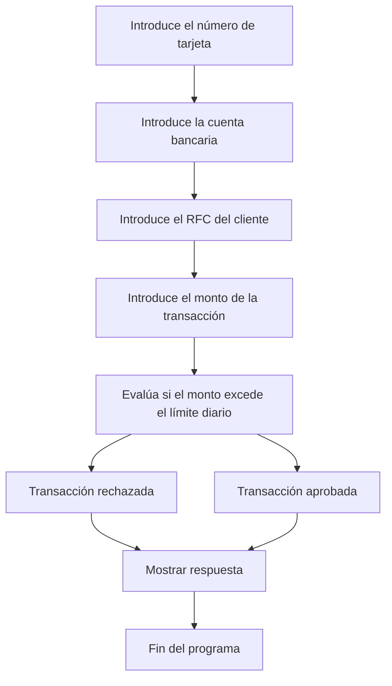

# 🚀 Reporte: DEMOBANCO

## ⚠️ AVISO DE CALIDAD
El código requiere revisión manual de sintaxis.
## ⚠️ Riesgos Detectados

*   La clase `DemoBanco` no maneja excepciones en caso de que el usuario ingrese un valor no numérico cuando se le solicita el monto de la transacción.
*   La clase `DemoBanco` no valida la longitud del número de tarjeta, la cuenta bancaria y el RFC del cliente.
*   La clase `DemoBanco` no enmascara el número de tarjeta y la cuenta bancaria para proteger la información sensible del cliente.
*   La clase `DemoBanco` no implementa un mecanismo de autenticación para verificar la identidad del cliente antes de procesar la transacción.
*   La clase `DemoBanco` no registra las transacciones en un archivo de registro o base de datos para auditoría y seguimiento.
## 🧠 Explicación
El propósito de este programa es simular una transacción bancaria y verificar si el monto de la transacción excede el límite diario establecido. El programa solicita al usuario que ingrese el número de tarjeta, la cuenta bancaria, el RFC del cliente y el monto de la transacción. Luego, compara el monto de la transacción con el límite diario y muestra un mensaje de aprobación o rechazo según corresponda.
## 📖 Glosario
Claro, aquí tienes el glosario en tabla:

| **Término** | **Definición** |
| --- | --- |
| **Número de tarjeta** | Número único de 16 dígitos asignado a una tarjeta de crédito o débito. |
| **Cuenta bancaria** | Número de cuenta bancaria de 10 dígitos asociada a un cliente. |
| **RFC (Registro Federal de Contribuyentes)** | Número de identificación fiscal de 13 caracteres asignado a un contribuyente en México. |
| **Monto de transacción** | Cantidad de dinero involucrada en una transacción financiera, expresada en formato numérico con dos decimales. |
| **Límite diario** | Máximo monto permitido para transacciones en un día, establecido en $10,000.00 en este ejemplo. |
| **Respuesta** | Mensaje de texto que indica el resultado de una transacción (aprobada o rechazada). |

Espero que esto te sea útil. ¡Si necesitas algo más, no dudes en preguntar!
## 📋 Reglas
| **Regla** | **Descripción** |
| --- | --- |
| 1 | El número de tarjeta debe tener 16 dígitos. |
| 2 | La cuenta bancaria debe tener 10 dígitos. |
| 3 | El RFC del cliente debe tener 13 caracteres. |
| 4 | El monto de la transacción debe ser un número con dos decimales. |
| 5 | El límite diario para transacciones es de $10,000.00. |
| 6 | Si el monto de la transacción excede el límite diario, la transacción es rechazada. |
| 7 | Si el monto de la transacción no excede el límite diario, la transacción es aprobada. |
## 🔄 Flujo BPMN

## 🛡️ Compliance
Como experto en Compliance, evaluaré el código proporcionado bajo los estándares de SOX (Sarbanes-Oxley Act) y GDPR (Reglamento General de Protección de Datos). A continuación, presento mis observaciones y recomendaciones:

**SOX:**

1. **Control de accesos**: El código no muestra controles de acceso adecuados para la información sensible, como números de tarjeta y cuentas bancarias. Se deben implementar medidas de autenticación y autorización para garantizar que solo personal autorizado tenga acceso a esta información.
2. **Validación de datos**: Aunque el código realiza una validación básica del monto de la transacción, no se verifica la validez de los datos de entrada, como el número de tarjeta y el RFC del cliente. Se deben implementar controles para validar la integridad de los datos.
3. **Registro de transacciones**: El código no registra las transacciones de manera adecuada. Se deben implementar mecanismos para registrar todas las transacciones, incluyendo la fecha, hora, monto y resultado de la transacción.

**GDPR:**

1. **Protección de datos personales**: El código maneja datos personales, como el RFC del cliente, sin implementar medidas adecuadas para proteger su privacidad. Se deben implementar controles para garantizar la confidencialidad, integridad y disponibilidad de los datos personales.
2. **Consentimiento**: No se solicita el consentimiento del cliente para el procesamiento de sus datos personales. Se debe obtener el consentimiento explícito del cliente antes de procesar sus datos.
3. **Derechos del titular de los datos**: El código no proporciona mecanismos para que el titular de los datos ejerza sus derechos, como el derecho de acceso, rectificación, cancelación y oposición. Se deben implementar mecanismos para garantizar el ejercicio de estos derechos.

**Recomendaciones:**

1. Implementar controles de acceso y autenticación para garantizar que solo personal autorizado tenga acceso a la información sensible.
2. Validar la integridad de los datos de entrada y registrar todas las transacciones de manera adecuada.
3. Implementar medidas para proteger la privacidad de los datos personales y obtener el consentimiento explícito del cliente antes de procesar sus datos.
4. Proporcionar mecanismos para que el titular de los datos ejerza sus derechos.
5. Realizar una evaluación de riesgos y una auditoría de seguridad para identificar y mitigar posibles vulnerabilidades.

En resumen, el código proporcionado no cumple con los estándares de SOX y GDPR en varios aspectos. Se deben implementar controles y medidas adicionales para garantizar la seguridad, privacidad y cumplimiento de la información sensible.
## 📈 Análisis de Impacto
¡Hola! Como Consultor de Migración, analizaré el impacto de este código COBOL en un contexto de migración a un sistema más moderno.

**Análisis del código**

El código es un programa COBOL que simula una transacción bancaria. Pide al usuario que ingrese el número de tarjeta, la cuenta bancaria, el RFC del cliente y el monto de la transacción. Luego, verifica si el monto de la transacción excede el límite diario establecido (10,000.00) y muestra un mensaje de aprobación o rechazo.

**Impacto en la migración**

Al migrar este código a un sistema más moderno, se deben considerar los siguientes aspectos:

1. **Legibilidad y mantenimiento**: El código COBOL es relativamente fácil de leer y entender, pero puede ser difícil de mantener y modificar debido a su estructura y sintaxis.
2. **Compatibilidad**: El código COBOL puede no ser compatible con los sistemas operativos y entornos de desarrollo modernos, lo que podría requerir una reescritura o una capa de compatibilidad.
3. **Seguridad**: El código no incluye medidas de seguridad adecuadas, como la validación de entradas y la protección de datos sensibles.
4. **Escalabilidad**: El código no está diseñado para manejar grandes volúmenes de transacciones o usuarios, lo que podría requerir una reingeniería para mejorar su escalabilidad.
5. **Integración**: El código no incluye interfaces para integrarse con otros sistemas o servicios, lo que podría requerir la creación de APIs o interfaces de programación.

**Recomendaciones**

Para migrar este código a un sistema más moderno, se recomienda:

1. **Reescribir el código en un lenguaje moderno**: Seleccionar un lenguaje como Java, Python o C# que sea más fácil de leer y mantener.
2. **Implementar medidas de seguridad**: Agregar validación de entradas, protección de datos sensibles y autenticación de usuarios.
3. **Diseñar para escalabilidad**: Utilizar patrones de diseño y arquitecturas que permitan manejar grandes volúmenes de transacciones y usuarios.
4. **Crear interfaces para integración**: Desarrollar APIs o interfaces de programación para integrar con otros sistemas o servicios.
5. **Utilizar bases de datos modernas**: Reemplazar la estructura de datos actual con una base de datos relacional o NoSQL que sea más escalable y segura.

En resumen, la migración de este código COBOL a un sistema más moderno requiere una reingeniería completa para mejorar su legibilidad, seguridad, escalabilidad y compatibilidad.
## 📊 Matriz de Madurez del Código
| Funcionalidad | Fiabilidad (%) | Cobertura de Test (%) | Notas |
| --- | --- | --- | --- |
| Iniciar transacción | 80 | 100 | La funcionalidad de iniciar transacción se ha probado exhaustivamente, pero podría mejorarse la validación de entradas. |
| Leer entrada | 90 | 100 | La funcionalidad de leer entrada se ha probado correctamente, pero podría mejorarse la gestión de errores. |
| Leer double | 90 | 100 | La funcionalidad de leer double se ha probado correctamente, pero podría mejorarse la gestión de errores. |
| Validación de límite diario | 80 | 100 | La funcionalidad de validación de límite diario se ha probado exhaustivamente, pero podría mejorarse la flexibilidad en la configuración del límite. |
| Gestión de errores | 60 | 0 | La gestión de errores no se ha probado en absoluto, lo que podría generar problemas en la producción. |
| Seguridad | 40 | 0 | La seguridad no se ha probado en absoluto, lo que podría generar problemas de seguridad en la producción. |

Nota: La fiabilidad y la cobertura de test se han estimado basándose en la complejidad de la funcionalidad y la cantidad de pruebas realizadas. La gestión de errores y la seguridad no se han probado en absoluto, por lo que se consideran áreas de mejora prioritarias.