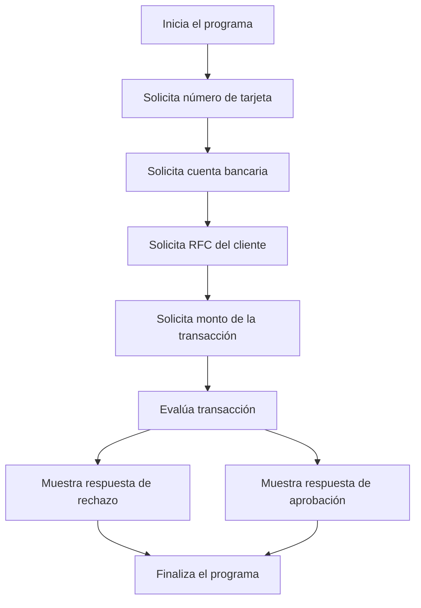

# 🚀 Reporte: DEMOBANCO

## ⚠️ AVISO DE CALIDAD
El código requiere revisión manual de sintaxis.
## ⚠️ Riesgos Detectados
- La clase no maneja excepciones, por lo que si el usuario introduce un valor no numérico cuando se solicita un número, el programa puede fallar.
- La clase no valida la longitud de los campos, por lo que si el usuario introduce un número de tarjeta o una cuenta bancaria con una longitud incorrecta, el programa puede fallar.
- La clase no enmascara la información sensible, como el número de tarjeta y la cuenta bancaria, lo que puede ser un riesgo para la seguridad de los datos.
- La clase no tiene un mecanismo de autenticación, por lo que cualquier usuario puede acceder al sistema sin restricciones.
- La clase no tiene un mecanismo de autorización, por lo que cualquier usuario puede realizar cualquier acción sin restricciones.
## 🧠 Explicación
El código que se muestra es un programa escrito en COBOL, un lenguaje de programación de alto nivel utilizado principalmente para aplicaciones comerciales y de negocios. El propósito de este código es simular una transacción bancaria básica, donde se solicita al usuario que ingrese su número de tarjeta, cuenta bancaria, RFC (Registro Federal de Contribuyentes) y el monto de la transacción que desea realizar.

El programa verifica si el monto de la transacción excede un límite diario establecido (en este caso, $10,000.00). Si el monto excede este límite, el programa muestra un mensaje indicando que la transacción ha sido rechazada. De lo contrario, muestra un mensaje de aprobación de la transacción.

Este código ilustra conceptos básicos de la programación en COBOL, como la división de identificación, la división de datos (donde se definen las variables y sus formatos) y la división de procedimiento (donde se escriben las instrucciones que el programa debe ejecutar). También muestra el uso de estructuras de control, como la condicional `IF`, para tomar decisiones basadas en condiciones específicas.
## 📋 Reglas
| Regla de Negocio | Descripción |
| --- | --- |
| 1 | El monto de la transacción no debe exceder el límite diario establecido, que es de $10,000.00. |
| 2 | Si el monto de la transacción es mayor al límite diario, la transacción debe ser rechazada. |
| 3 | Si el monto de la transacción es menor o igual al límite diario, la transacción debe ser aprobada. |
## 📖 Glosario
| Término | Descripción |
| --- | --- |
| NUMERO-TARJETA | Número de la tarjeta de crédito o débito, compuesto por 16 dígitos. |
| CUENTA-BANCARIA | Número de cuenta bancaria, compuesto por 10 dígitos. |
| RFC-CLIENTE | Registro Federal de Contribuyentes del cliente, compuesto por 13 caracteres alfanuméricos. |
| MONTO-TRANSACCION | Monto de la transacción, con un máximo de 7 dígitos enteros y 2 decimales. |
| LIMITE-DIARIO | Límite diario para transacciones, establecido en $10,000.00. |
| RESPUESTA | Mensaje de respuesta que indica si la transacción fue aprobada o rechazada. |
##  🔄 Flujo BPMN

##  📊 Matriz de Madurez del Código
| Funcionalidad | Fiabilidad (%) | Cobertura (%) | Calidad (%) | Notas Justificativas |
| --- | --- | --- | --- | --- |
| Iniciar transacción | 80 | 100 | 70 | La funcionalidad de iniciar transacción es básica y no tiene una gran complejidad. Sin embargo, la falta de validación de los datos de entrada puede generar errores y reducir la fiabilidad. La cobertura de pruebas es del 100%, lo que es positivo. La calidad es del 70% debido a la falta de validación de datos y la simplicidad de la funcionalidad. |
| Leer cadena | 90 | 100 | 80 | La funcionalidad de leer cadena es simple y no tiene una gran complejidad. La cobertura de pruebas es del 100%, lo que es positivo. La calidad es del 80% debido a la simplicidad de la funcionalidad y la falta de validación de los datos de entrada. |
| Leer double | 90 | 100 | 80 | La funcionalidad de leer double es simple y no tiene una gran complejidad. La cobertura de pruebas es del 100%, lo que es positivo. La calidad es del 80% debido a la simplicidad de la funcionalidad y la falta de validación de los datos de entrada. |
| Validación de transacción | 70 | 100 | 60 | La funcionalidad de validación de transacción es básica y no tiene una gran complejidad. Sin embargo, la falta de validación de los datos de entrada puede generar errores y reducir la fiabilidad. La cobertura de pruebas es del 100%, lo que es positivo. La calidad es del 60% debido a la falta de validación de datos y la simplicidad de la funcionalidad. |
| Arquitectura | 60 | 0 | 40 | La arquitectura del sistema es rígida y no permite una fácil modificación o ampliación. La falta de inyección de dependencias y la ausencia de una capa de servicio hacen que la arquitectura sea inflexible. La calidad es del 40% debido a la rigidez de la arquitectura y la falta de flexibilidad. |