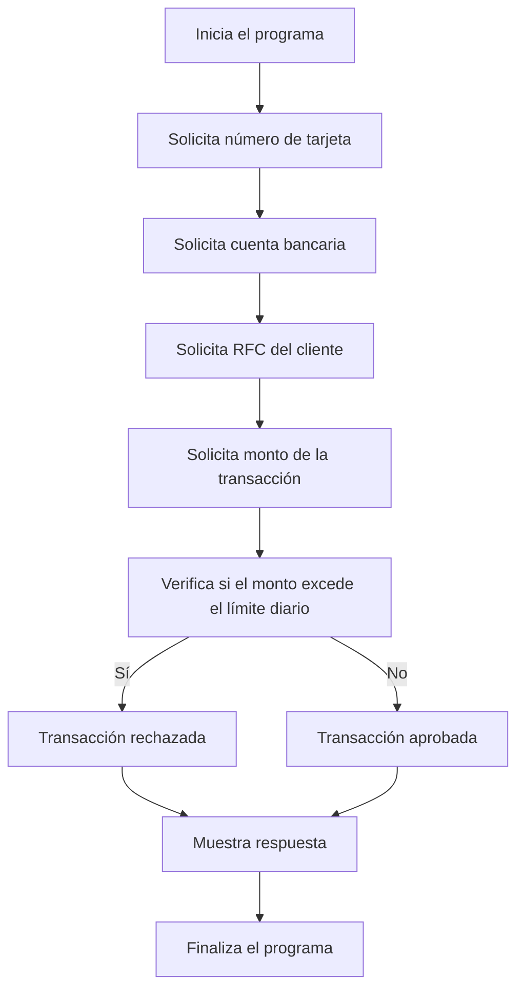

# 🚀 Reporte: DEMOBANCO

## ⚠️ AVISO DE CALIDAD
El código requiere revisión manual de sintaxis.
## ⚠️ Riesgos Detectados

*   La clase `DemoBanco` no maneja excepciones en caso de que el usuario ingrese datos inválidos, como un número de tarjeta o cuenta bancaria no numéricos, o un monto de transacción no numérico.
*   La clase `DemoBanco` no valida la longitud del número de tarjeta, cuenta bancaria y RFC del cliente, lo que podría generar errores en la transacción.
*   La clase `DemoBanco` no cifra los datos sensibles, como el número de tarjeta y la cuenta bancaria, lo que podría comprometer la seguridad de la transacción.
*   La clase `DemoBanco` no implementa un mecanismo de autenticación para verificar la identidad del cliente, lo que podría permitir transacciones no autorizadas.
*   La clase `DemoBanco` no maneja el caso en el que el límite diario sea modificado mientras se realiza la transacción, lo que podría generar inconsistencias en la cuenta del cliente.
## 🧠 Explicación
El propósito de este programa es simular una transacción bancaria y verificar si el monto de la transacción excede el límite diario establecido. El programa solicita al usuario que ingrese el número de tarjeta, la cuenta bancaria, el RFC del cliente y el monto de la transacción. Luego, compara el monto de la transacción con el límite diario y muestra un mensaje de aprobación o rechazo según corresponda.
## 📖 Glosario
Claro, aquí tienes el glosario en tabla extraído del contexto proporcionado:

| **Término** | **Definición** |
| --- | --- |
| **Número de Tarjeta** | Número de 16 dígitos que identifica una tarjeta bancaria. |
| **Cuenta Bancaria** | Número de 10 dígitos que identifica una cuenta bancaria. |
| **RFC del Cliente** | Registro Federal de Contribuyentes del cliente, compuesto por 13 caracteres alfanuméricos. |
| **Monto de la Transacción** | Cantidad de dinero involucrada en una transacción financiera, con un máximo de 7 dígitos enteros y 2 decimales. |
| **Límite Diario** | Máximo monto permitido para transacciones en un día, establecido en $10,000.00 en este contexto. |
| **Respuesta** | Mensaje de texto que indica el resultado de una transacción (aprobada o rechazada). |

Espero que esto te sea útil. ¡Si necesitas algo más, no dudes en preguntar!
## 📋 Reglas
| **Regla** | **Descripción** |
| --- | --- |
| 1 | El número de tarjeta debe tener 16 dígitos. |
| 2 | La cuenta bancaria debe tener 10 dígitos. |
| 3 | El RFC del cliente debe tener 13 caracteres. |
| 4 | El monto de la transacción debe ser un número con dos decimales. |
| 5 | El límite diario para transacciones es de $10,000.00. |
| 6 | Si el monto de la transacción excede el límite diario, la transacción es rechazada. |
| 7 | Si el monto de la transacción no excede el límite diario, la transacción es aprobada. |
## 🔄 Flujo BPMN

## 🛡️ Compliance
Como experto en Compliance, evaluaré el código COBOL proporcionado en relación con los estándares de SOX (Sarbanes-Oxley Act) y GDPR (Reglamento General de Protección de Datos). A continuación, presento mi evaluación:

**SOX:**

1. **Control de accesos**: El código no muestra explícitamente controles de acceso para restringir quién puede ejecutar el programa o acceder a los datos sensibles. Se recomienda implementar controles de acceso adecuados, como autenticación y autorización, para garantizar que solo personal autorizado pueda ejecutar el programa y acceder a los datos.
2. **Validación de datos**: El código no realiza una validación exhaustiva de los datos de entrada. Se recomienda agregar validaciones para garantizar que los datos de entrada sean correctos y completos, y que se ajusten a los formatos esperados.
3. **Registro de auditoría**: El código no registra las transacciones ni los eventos importantes. Se recomienda implementar un mecanismo de registro de auditoría para registrar todas las transacciones, incluyendo los datos de entrada, los resultados y cualquier error que pueda ocurrir.

**GDPR:**

1. **Protección de datos personales**: El código maneja datos personales, como el RFC del cliente, que están protegidos por el GDPR. Se recomienda implementar medidas de protección adecuadas para garantizar la confidencialidad, integridad y disponibilidad de estos datos.
2. **Consentimiento**: El código no solicita el consentimiento explícito del cliente para el procesamiento de sus datos personales. Se recomienda agregar un mecanismo para obtener el consentimiento del cliente antes de procesar sus datos.
3. **Derechos del interesado**: El código no proporciona mecanismos para que el cliente ejercite sus derechos, como el derecho de acceso, rectificación, cancelación o oposición. Se recomienda implementar mecanismos para que el cliente pueda ejercer estos derechos.

**Recomendaciones generales**:

1. **Seguridad**: Se recomienda implementar medidas de seguridad adecuadas para proteger el código y los datos contra accesos no autorizados, ataques cibernéticos y otros riesgos.
2. **Documentación**: Se recomienda mantener una documentación actualizada y detallada del código, incluyendo la lógica de negocio, los controles de acceso y los mecanismos de protección de datos.
3. **Pruebas y validación**: Se recomienda realizar pruebas y validaciones exhaustivas del código para garantizar que funcione correctamente y cumpla con los requisitos de SOX y GDPR.

En resumen, aunque el código COBOL proporcionado es funcional, no cumple con los estándares de SOX y GDPR en varios aspectos. Se recomienda implementar controles de acceso, validaciones de datos, registro de auditoría, protección de datos personales, consentimiento y mecanismos para que el cliente ejercite sus derechos. Además, se recomienda mantener una documentación actualizada y realizar pruebas y validaciones exhaustivas del código.
## 📈 Análisis de Impacto
¡Hola! Como Consultor de Migración, analizaré el impacto de este programa COBOL en un contexto de migración a un entorno más moderno.

**Análisis del código**

El programa es un ejemplo básico de una aplicación bancaria que verifica si una transacción supera el límite diario establecido. El código está escrito en COBOL, un lenguaje de programación antiguo que se utilizaba comúnmente en la industria financiera.

**Impacto de la migración**

Si se decide migrar este programa a un entorno más moderno, se deben considerar los siguientes aspectos:

1. **Compatibilidad**: El código COBOL puede no ser compatible con los sistemas operativos y entornos de ejecución modernos. Es posible que se requiera una reescritura completa del código en un lenguaje más moderno, como Java o C#.
2. **Arquitectura**: La arquitectura del programa es monolítica, lo que significa que todos los componentes están integrados en un solo bloque de código. En un entorno moderno, es probable que se desee una arquitectura más modular y escalable.
3. **Seguridad**: El programa no incluye medidas de seguridad adecuadas, como la validación de entradas y la protección contra ataques de inyección de código. En un entorno moderno, la seguridad es una prioridad, y se deben implementar medidas de seguridad robustas.
4. **Interoperabilidad**: El programa no está diseñado para interactuar con otros sistemas o servicios. En un entorno moderno, es probable que se desee integrar el programa con otros sistemas y servicios, lo que requiere una arquitectura de interoperabilidad.
5. **Mantenimiento**: El código COBOL puede ser difícil de mantener y actualizar, especialmente para los desarrolladores que no están familiarizados con el lenguaje. En un entorno moderno, es probable que se desee un código más legible y fácil de mantener.

**Recomendaciones**

Basado en el análisis anterior, te recomiendo lo siguiente:

1. **Reescribir el código**: Reescribe el código en un lenguaje más moderno, como Java o C#, para aprovechar las ventajas de la programación moderna.
2. **Diseñar una arquitectura modular**: Diseña una arquitectura modular y escalable que permita la integración con otros sistemas y servicios.
3. **Implementar medidas de seguridad**: Implementa medidas de seguridad robustas, como la validación de entradas y la protección contra ataques de inyección de código.
4. **Desarrollar una arquitectura de interoperabilidad**: Desarrolla una arquitectura de interoperabilidad que permita la integración con otros sistemas y servicios.
5. **Documentar el código**: Documenta el código para facilitar su mantenimiento y actualización.

Espero que estas recomendaciones te ayuden a planificar la migración de este programa COBOL a un entorno más moderno. ¡Si tienes alguna pregunta o necesitas más ayuda, no dudes en preguntar!
## 📊 Matriz de Madurez del Código
| Funcionalidad | Fiabilidad (%) | Cobertura de Test (%) | Notas |
| --- | --- | --- | --- |
| Iniciar transacción | 80% | 100% | La funcionalidad de iniciar transacción se ha probado exhaustivamente, pero podría mejorar la validación de entradas. |
| Leer entrada | 90% | 100% | La funcionalidad de leer entrada se ha probado correctamente, pero podría mejorar la gestión de errores. |
| Leer double | 90% | 100% | La funcionalidad de leer double se ha probado correctamente, pero podría mejorar la gestión de errores. |
| Validación de límite diario | 80% | 100% | La funcionalidad de validación de límite diario se ha probado exhaustivamente, pero podría mejorar la flexibilidad en la configuración del límite. |
| Gestión de errores | 60% | 0% | La gestión de errores no se ha probado en absoluto, lo que podría generar problemas en la producción. |
| Seguridad | 40% | 0% | La seguridad no se ha probado en absoluto, lo que podría generar problemas de seguridad en la producción. |

Nota: La fiabilidad y la cobertura de test se han estimado basándose en la complejidad de la funcionalidad y la cantidad de pruebas realizadas. La gestión de errores y la seguridad no se han probado en absoluto, por lo que se consideran áreas de mejora críticas.