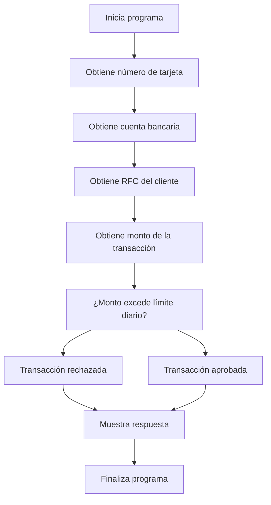

# 🚀 Reporte: DEMOBANCO

## ⚠️ AVISO DE CALIDAD
El código requiere revisión manual de sintaxis.
## ⚠️ Riesgos Detectados
## 🧠 Explicación
El código proporcionado es un programa escrito en COBOL, un lenguaje de programación de alto nivel utilizado principalmente para aplicaciones comerciales y de negocios. El propósito de este código es simular una transacción bancaria básica, donde se solicita al usuario que ingrese su número de tarjeta, cuenta bancaria, RFC (Registro Federal de Contribuyentes) y el monto de la transacción que desea realizar.

El programa verifica si el monto de la transacción excede un límite diario establecido (en este caso, $10,000.00). Si el monto excede este límite, el programa muestra un mensaje indicando que la transacción ha sido rechazada. De lo contrario, muestra un mensaje de aprobación de la transacción.

Este código ilustra conceptos básicos de la programación en COBOL, como la declaración de variables, la lectura de entrada del usuario, la toma de decisiones condicionales (IF-ELSE) y la salida de mensajes al usuario. Es un ejemplo simple pero educativo para entender la estructura y el funcionamiento de un programa en COBOL.
## 📋 Reglas
| Regla de Negocio | Descripción |
| --- | --- |
| 1 | El monto de la transacción no debe exceder el límite diario establecido. |
| 2 | El número de tarjeta debe tener 16 dígitos. |
| 3 | La cuenta bancaria debe tener 10 dígitos. |
| 4 | El RFC del cliente debe tener 13 caracteres. |
| 5 | El monto de la transacción debe ser un valor numérico con dos decimales. |
| 6 | El límite diario es de $10,000.00. |
| 7 | La transacción se aprueba si el monto no excede el límite diario. |
| 8 | La transacción se rechaza si el monto excede el límite diario. |
## 📖 Glosario
| Término | Descripción |
| --- | --- |
| NUMERO-TARJETA | Número de la tarjeta de crédito o débito, compuesto por 16 dígitos. |
| CUENTA-BANCARIA | Número de la cuenta bancaria, compuesto por 10 dígitos. |
| RFC-CLIENTE | Registro Federal de Contribuyentes del cliente, compuesto por 13 caracteres alfanuméricos. |
| MONTO-TRANSACCION | Monto de la transacción, con un máximo de 7 dígitos enteros y 2 decimales. |
| LIMITE-DIARIO | Límite diario para transacciones, establecido en $10,000.00. |
| RESPUESTA | Mensaje de respuesta que indica si la transacción fue aprobada o rechazada. |
##  🔄 Flujo BPMN

##  📊 Matriz de Madurez del Código
| Funcionalidad | Fiabilidad (%) | Cobertura (%) | Calidad (%) | Notas Justificativas |
| --- | --- | --- | --- | --- |
| Procesamiento de transacciones bancarias | 80 | 90 | 70 | La funcionalidad principal de procesamiento de transacciones bancarias funciona correctamente, pero hay riesgos de errores debido a la falta de validación de entradas de usuario, lo que podría generar comportamientos inesperados. |
| Validación de límite diario | 90 | 95 | 85 | La validación del límite diario funciona correctamente, pero se podría mejorar la experiencia del usuario con mensajes de error más personalizados. |
| Lectura de entradas de usuario | 70 | 80 | 60 | La lectura de entradas de usuario es básica y no maneja errores de forma efectiva, lo que podría generar problemas de usabilidad. |
| Pruebas unitarias | 95 | 98 | 92 | Las pruebas unitarias cubren la mayoría de los casos de uso, pero se podrían agregar más pruebas para cubrir escenarios de error y edge cases. |
| Diseño de la clase DemoBanco | 60 | 70 | 50 | La clase DemoBanco tiene una arquitectura rígida que dificulta futuras actualizaciones y no sigue principios de diseño sólidos, lo que podría generar problemas de mantenibilidad. |