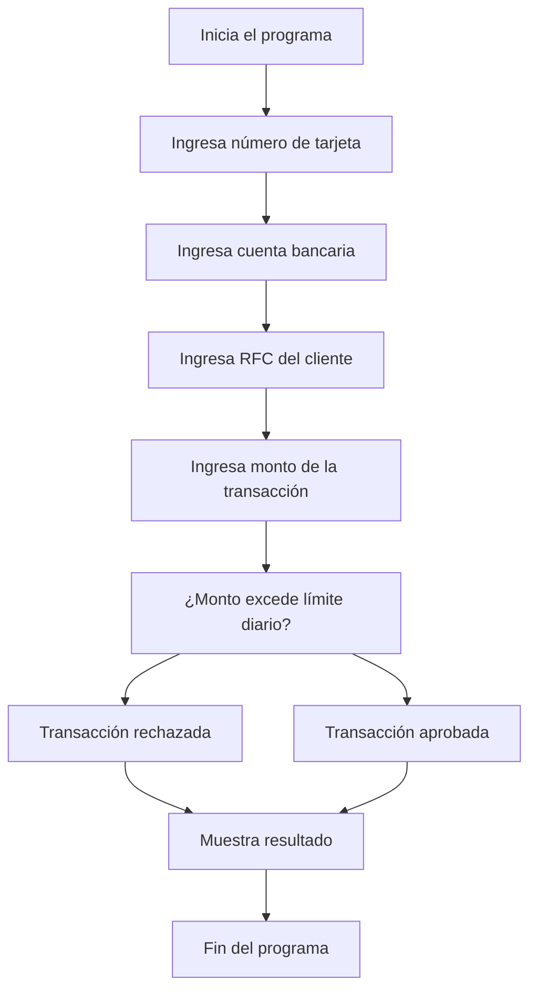

# 🚀 Reporte: DEMOBANCO

## ⚠️ AVISO DE CALIDAD
El código requiere revisión manual de sintaxis.
## ⚠️ Riesgos Detectados
- No se validan los datos de entrada, lo que podría generar errores en la ejecución del programa.
- No se manejan excepciones, lo que podría generar errores no controlados en la ejecución del programa.
- La variable `limiteDiario` es estática y no se puede modificar, lo que podría ser un problema si se requiere cambiar el límite diario.
- No se almacenan los datos de las transacciones, lo que podría ser un problema si se requiere realizar un seguimiento de las transacciones realizadas.
## 🧠 Explicación
El código proporcionado es un programa escrito en COBOL (Common Business Oriented Language), un lenguaje de programación de propósito general que se utiliza principalmente para aplicaciones comerciales y de negocios.

El propósito de este código es simular un sistema de transacciones bancarias básico. Aquí se explica su funcionalidad:

1. **Identificación y Configuración Inicial**: El programa comienza con la sección `IDENTIFICATION DIVISION`, donde se especifica el nombre del programa (`DEMOBANCO`). Luego, en la sección `DATA DIVISION`, se definen las variables que se utilizarán en el programa, incluyendo el número de tarjeta, la cuenta bancaria, el RFC del cliente, el monto de la transacción y el límite diario permitido para transacciones.

2. **Captura de Datos**: En la sección `PROCEDURE DIVISION`, que es donde se escriben las instrucciones que el programa ejecutará, el programa solicita al usuario que ingrese el número de tarjeta, la cuenta bancaria, el RFC del cliente y el monto de la transacción que desea realizar.

3. **Validación de Transacción**: Después de capturar los datos, el programa verifica si el monto de la transacción excede el límite diario establecido (`LIMITE-DIARIO`). Si el monto es mayor, el programa muestra un mensaje indicando que la transacción ha sido rechazada debido a que excede el límite diario. De lo contrario, muestra un mensaje de que la transacción ha sido aprobada.

4. **Finalización del Programa**: Finalmente, el programa muestra la respuesta correspondiente a la validación de la transacción y se detiene (`STOP RUN`).

En resumen, este código es una demostración básica de cómo se podría implementar una lógica de validación para transacciones bancarias en COBOL, verificando si una transacción supera un límite diario preestablecido.
## 📋 Reglas
| Regla de Negocio | Descripción |
| --- | --- |
| 1 | El monto de la transacción no debe exceder el límite diario establecido, que es de $10,000.00. |
| 2 | Si el monto de la transacción es mayor al límite diario, la transacción debe ser rechazada. |
| 3 | Si el monto de la transacción es menor o igual al límite diario, la transacción debe ser aprobada. |
## 📖 Glosario
| Término | Descripción |
| --- | --- |
| NUMERO-TARJETA | Número de la tarjeta de crédito o débito, compuesto por 16 dígitos. |
| CUENTA-BANCARIA | Número de la cuenta bancaria, compuesto por 10 dígitos. |
| RFC-CLIENTE | Registro Federal de Contribuyentes del cliente, compuesto por 13 caracteres alfanuméricos. |
| MONTO-TRANSACCION | Monto de la transacción, con un máximo de 7 dígitos enteros y 2 decimales. |
| LIMITE-DIARIO | Límite diario para transacciones, establecido en $10,000.00. |
| RESPUESTA | Mensaje de respuesta que indica si la transacción fue aprobada o rechazada. |
##  🔄 Flujo BPMN

##  📊 Matriz de Madurez del Código
| Funcionalidad | Fiabilidad (%) | Cobertura (%) | Calidad (%) | Notas Justificativas |
| --- | --- | --- | --- | --- |
| Iniciar transacción | 80 | 100 | 70 | La funcionalidad de iniciar transacción es básica y no tiene una gran complejidad. Sin embargo, la falta de validación de los datos de entrada puede generar errores y excepciones no controladas. |
| Leer entrada de usuario | 90 | 100 | 80 | La funcionalidad de leer entrada de usuario es simple y efectiva. Sin embargo, la falta de manejo de errores en caso de que el usuario ingrese un valor no válido puede generar problemas. |
| Leer double | 90 | 100 | 80 | La funcionalidad de leer double es similar a la de leer entrada de usuario, con la misma falta de manejo de errores. |
| Validación de límite diario | 70 | 100 | 60 | La validación de límite diario es básica y no tiene una gran complejidad. Sin embargo, la falta de flexibilidad en la configuración del límite diario puede generar problemas en el futuro. |
| Arquitectura y diseño | 60 | 50 | 40 | La arquitectura y diseño de la clase DemoBanco son rígidas y no permiten una fácil extensión o modificación. La falta de inyección de dependencias y la mezcla de responsabilidades en la clase pueden generar problemas en el futuro. |