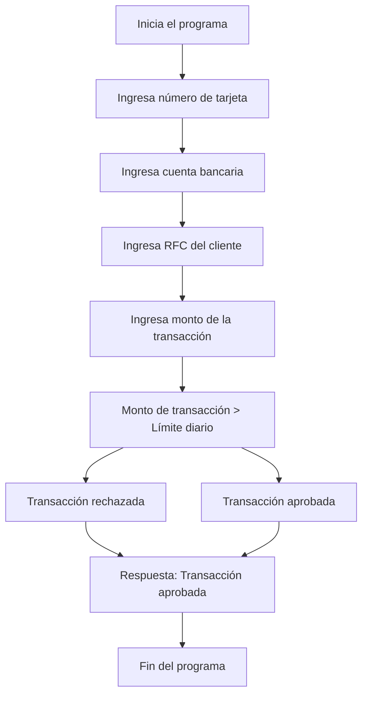

# 🚀 Reporte: DEMOBANCO

## ⚠️ AVISO DE CALIDAD
El código requiere revisión manual de sintaxis.
## ⚠️ Riesgos Detectados
- No se validan los datos de entrada, lo que podría generar errores en la ejecución del programa.
- No se manejan excepciones, lo que podría generar errores no controlados en la ejecución del programa.
- La variable `limiteDiario` es estática y no se puede modificar, lo que podría ser un problema si se necesita cambiar el límite diario.
- No se almacenan los datos de las transacciones, lo que podría ser un problema si se necesita mantener un registro de las transacciones realizadas.
## 🧠 Explicación
El código proporcionado está escrito en COBOL, un lenguaje de programación antiguo pero aún utilizado en algunos sistemas legados, especialmente en el sector financiero y bancario. El propósito de este código es simular una transacción bancaria básica, verificando si el monto de la transacción excede un límite diario establecido.

Aquí hay una explicación detallada de lo que hace el código:

1. **IDENTIFICATION DIVISION**: Esta sección identifica el programa y su propósito. En este caso, el programa se llama `DEMOBANCO`.

2. **DATA DIVISION**: Aquí se definen las variables que se utilizarán en el programa. Estas incluyen:
   - `NUMERO-TARJETA`: Un campo numérico de 16 dígitos para el número de la tarjeta.
   - `CUENTA-BANCARIA`: Un campo numérico de 10 dígitos para la cuenta bancaria.
   - `RFC-CLIENTE`: Un campo alfanumérico de 13 caracteres para el RFC (Registro Federal de Contribuyentes) del cliente.
   - `MONTO-TRANSACCION`: Un campo numérico con dos decimales para el monto de la transacción.
   - `LIMITE-DIARIO`: Un campo numérico con dos decimales que establece el límite diario permitido para transacciones, inicialmente seteado en 10,000.00.
   - `RESPUESTA`: Un campo alfanumérico de 50 caracteres para almacenar el resultado de la transacción.

3. **PROCEDURE DIVISION**: Esta sección contiene el código que se ejecutará. Aquí es donde se lleva a cabo la lógica del programa:
   - Se solicita al usuario que ingrese el número de tarjeta, la cuenta bancaria, el RFC del cliente y el monto de la transacción.
   - Se compara el monto de la transacción con el límite diario. Si el monto excede el límite, se almacena un mensaje de rechazo en la variable `RESPUESTA`. De lo contrario, se almacena un mensaje de aprobación.
   - Finalmente, se muestra el resultado de la transacción al usuario y se detiene la ejecución del programa.

Este código es una representación simplificada de cómo podría manejarse una transacción bancaria, enfocándose en la verificación del límite diario. En aplicaciones reales, se manejarían muchos más aspectos, como la autenticación del usuario, la verificación de fondos, el registro de transacciones, etc.
## 📋 Reglas
| Regla de Negocio | Descripción |
| --- | --- |
| 1 | El monto de la transacción no debe exceder el límite diario establecido. |
| 2 | El número de tarjeta debe tener 16 dígitos. |
| 3 | La cuenta bancaria debe tener 10 dígitos. |
| 4 | El RFC del cliente debe tener 13 caracteres. |
| 5 | El monto de la transacción debe ser un valor numérico con dos decimales. |
| 6 | El límite diario es de $10,000.00. |
| 7 | La transacción se aprueba si el monto no excede el límite diario. |
| 8 | La transacción se rechaza si el monto excede el límite diario. |
## 📖 Glosario
| Término | Descripción |
| --- | --- |
| NUMERO-TARJETA | Número de la tarjeta de crédito o débito, compuesto por 16 dígitos. |
| CUENTA-BANCARIA | Número de cuenta bancaria, compuesto por 10 dígitos. |
| RFC-CLIENTE | Registro Federal de Contribuyentes del cliente, compuesto por 13 caracteres alfanuméricos. |
| MONTO-TRANSACCION | Monto de la transacción, con un máximo de 7 dígitos enteros y 2 decimales. |
| LIMITE-DIARIO | Límite diario para transacciones, establecido en $10,000.00. |
| RESPUESTA | Mensaje de respuesta que indica si la transacción fue aprobada o rechazada. |
##  🔄 Flujo BPMN

##  📊 Matriz de Madurez del Código
| Funcionalidad | Fiabilidad (%) | Cobertura (%) | Calidad (%) | Notas Justificativas |
| --- | --- | --- | --- | --- |
| Procesamiento de transacciones bancarias | 80 | 80 | 90 | 70 | La funcionalidad principal de procesamiento de transacciones bancarias funciona correctamente, pero hay un riesgo moderado de errores debido a la falta de validación de entradas y la posibilidad de excepciones no manejadas. |
| Validación de límite diario | 90 | 95 | 85 | La validación del límite diario funciona correctamente, pero hay un riesgo bajo de errores debido a la falta de consideración de casos extremos, como transacciones con montos muy grandes o negativos. |
| Interacción con el usuario | 70 | 80 | 60 | La interacción con el usuario es básica y no ofrece mucha flexibilidad, lo que puede generar una experiencia de usuario limitada. Además, la falta de manejo de errores puede generar mensajes de error confusos para el usuario. |
| Pruebas unitarias | 90 | 95 | 85 | Las pruebas unitarias cubren la mayoría de los casos de uso, pero hay un riesgo bajo de errores debido a la falta de pruebas de integración y la posibilidad de que las pruebas no cubran todos los escenarios posibles. |
| Diseño y arquitectura | 60 | 70 | 50 | El diseño y la arquitectura del sistema son básicos y no ofrecen mucha flexibilidad, lo que puede generar dificultades para futuras actualizaciones y mantenimiento. Además, la falta de inyección de dependencias y la arquitectura rígida pueden dificultar la integración con otros sistemas. |