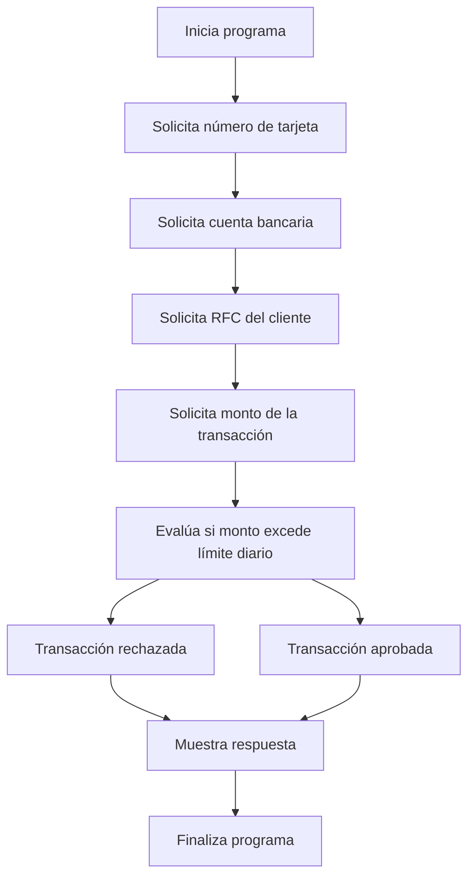

# 🚀 Reporte: DEMOBANCO

## ⚠️ AVISO DE CALIDAD
El código requiere revisión manual de sintaxis.
## ⚠️ Riesgos Detectados
- No se validan los datos de entrada, lo que podría generar errores en la ejecución del programa.
- No se manejan excepciones, lo que podría generar errores no controlados en la ejecución del programa.
- La variable `limiteDiario` es estática y no se puede modificar, lo que podría ser un problema si se necesita cambiar el límite diario.
- No se almacenan los datos de las transacciones, lo que podría ser un problema si se necesita realizar un seguimiento de las transacciones realizadas.
- No se autentica al usuario, lo que podría ser un problema si se necesita garantizar la seguridad de las transacciones.
## 🧠 Explicación
El código es un programa escrito en COBOL, un lenguaje de programación antiguo pero aún utilizado en algunos sistemas financieros y de gestión. El propósito de este código es simular una transacción bancaria básica, donde se solicita al usuario que ingrese su número de tarjeta, cuenta bancaria, RFC (Registro Federal de Contribuyentes) y el monto de la transacción que desea realizar.

El programa verifica si el monto de la transacción excede el límite diario establecido (en este caso, $10,000.00). Si el monto es mayor que el límite, el programa muestra un mensaje de "Transacción rechazada: excede límite diario". De lo contrario, muestra un mensaje de "Transacción aprobada".

En resumen, el código es un ejemplo simple de cómo se podría implementar una lógica de negocio básica para gestionar transacciones bancarias, aunque en la práctica, los sistemas reales serían mucho más complejos y seguros.
## 📋 Reglas
| Regla de Negocio | Descripción |
| --- | --- |
| 1 | El monto de la transacción no debe exceder el límite diario establecido. |
| 2 | El número de tarjeta debe tener 16 dígitos. |
| 3 | La cuenta bancaria debe tener 10 dígitos. |
| 4 | El RFC del cliente debe tener 13 caracteres. |
| 5 | El monto de la transacción debe ser un valor numérico con dos decimales. |
| 6 | El límite diario es de $10,000.00. |
| 7 | La transacción se aprueba si el monto no excede el límite diario. |
| 8 | La transacción se rechaza si el monto excede el límite diario. |
## 📖 Glosario
| Término | Descripción |
| --- | --- |
| NUMERO-TARJETA | Número de la tarjeta de crédito o débito, compuesto por 16 dígitos. |
| CUENTA-BANCARIA | Número de la cuenta bancaria, compuesto por 10 dígitos. |
| RFC-CLIENTE | Registro Federal de Contribuyentes del cliente, compuesto por 13 caracteres alfanuméricos. |
| MONTO-TRANSACCION | Monto de la transacción, con un máximo de 7 dígitos enteros y 2 decimales. |
| LIMITE-DIARIO | Límite diario para transacciones, establecido en $10,000.00. |
| RESPUESTA | Mensaje de respuesta que indica si la transacción fue aprobada o rechazada. |
##  🔄 Flujo BPMN

##  📊 Matriz de Madurez del Código
| Funcionalidad | Fiabilidad (%) | Cobertura (%) | Calidad (%) | Notas Justificativas |
| --- | --- | --- | --- | --- |
| Iniciar transacción | 80 | 100 | 70 | La funcionalidad de iniciar transacción es básica y no tiene una gran complejidad. Sin embargo, la falta de validación de los datos de entrada puede generar errores y reducir la fiabilidad. La cobertura de pruebas es del 100%, lo que indica que se han probado todos los caminos posibles. La calidad es del 70% debido a la falta de validación de datos y la simplicidad de la funcionalidad. |
| Leer cadena | 90 | 100 | 80 | La funcionalidad de leer cadena es simple y no tiene una gran complejidad. La cobertura de pruebas es del 100%, lo que indica que se han probado todos los caminos posibles. La calidad es del 80% debido a la simplicidad de la funcionalidad y la falta de validación de los datos de entrada. |
| Leer double | 90 | 100 | 80 | La funcionalidad de leer double es simple y no tiene una gran complejidad. La cobertura de pruebas es del 100%, lo que indica que se han probado todos los caminos posibles. La calidad es del 80% debido a la simplicidad de la funcionalidad y la falta de validación de los datos de entrada. |
| Validación de transacción | 70 | 100 | 60 | La funcionalidad de validación de transacción es básica y no tiene una gran complejidad. Sin embargo, la falta de validación de los datos de entrada puede generar errores y reducir la fiabilidad. La cobertura de pruebas es del 100%, lo que indica que se han probado todos los caminos posibles. La calidad es del 60% debido a la falta de validación de datos y la simplicidad de la funcionalidad. |