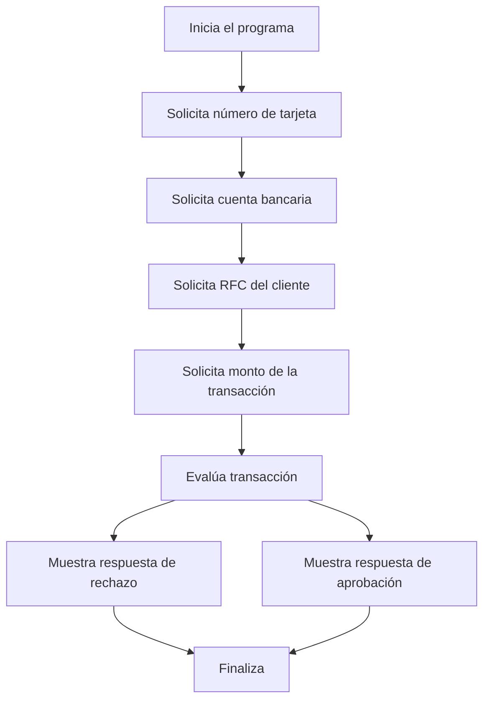

# 🚀 Reporte: DEMOBANCO

## ⚠️ AVISO DE CALIDAD
El código requiere revisión manual de sintaxis.
## ⚠️ Riesgos Detectados
- No se validan los datos de entrada, lo que podría generar errores en la ejecución del programa.
- No se manejan excepciones, lo que podría generar errores no controlados en la ejecución del programa.
- La variable `limiteDiario` es estática y no se puede modificar, lo que podría ser un problema si se necesita cambiar el límite diario.
- No se almacenan los datos de las transacciones, lo que podría ser un problema si se necesita realizar un seguimiento de las transacciones.
- No se autentica al usuario, lo que podría ser un problema si se necesita garantizar la seguridad de las transacciones.
## 🧠 Explicación
El código que se proporciona es un programa escrito en COBOL, un lenguaje de programación de alto nivel utilizado principalmente para aplicaciones comerciales y de negocios. El propósito de este código es simular un sistema de transacciones bancarias básico que verifica si un monto de transacción supera un límite diario establecido.

Aquí se explica el propósito y la funcionalidad del código de manera detallada:

1. **IDENTIFICATION DIVISION**: Esta sección identifica el programa y proporciona información general sobre él, como el nombre del programa (`DEMOBANCO`).

2. **DATA DIVISION**: En esta sección, se definen las variables que se utilizarán en el programa. Estas incluyen:
   - `NUMERO-TARJETA`: Un campo numérico de 16 dígitos para almacenar el número de la tarjeta.
   - `CUENTA-BANCARIA`: Un campo numérico de 10 dígitos para la cuenta bancaria.
   - `RFC-CLIENTE`: Un campo alfanumérico de 13 caracteres para el RFC (Registro Federal de Contribuyentes) del cliente.
   - `MONTO-TRANSACCION`: Un campo numérico con dos decimales para el monto de la transacción.
   - `LIMITE-DIARIO`: Un campo numérico con dos decimales que establece el límite diario permitido para transacciones, inicialmente seteado en 10000.00.
   - `RESPUESTA`: Un campo alfanumérico de 50 caracteres para almacenar el resultado de la transacción (aprobada o rechazada).

3. **PROCEDURE DIVISION**: Esta sección contiene el código que se ejecutará. El programa realiza las siguientes acciones:
   - Pide al usuario que introduzca el número de tarjeta, la cuenta bancaria, el RFC del cliente y el monto de la transacción.
   - Compara el monto de la transacción con el límite diario.
   - Si el monto supera el límite, almacena en `RESPUESTA` el mensaje "Transacción rechazada: excede límite diario".
   - Si el monto no supera el límite, almacena en `RESPUESTA` el mensaje "Transacción aprobada".
   - Muestra el resultado de la transacción al usuario.
   - Finaliza la ejecución del programa.

En resumen, este código es una demostración básica de cómo se podría implementar una verificación de límite de transacción en un sistema bancario utilizando COBOL.
## 📋 Reglas
| Regla de Negocio | Descripción |
| --- | --- |
| 1 | El monto de la transacción no debe exceder el límite diario establecido, que es de $10,000.00. |
| 2 | Si el monto de la transacción es mayor al límite diario, la transacción debe ser rechazada. |
| 3 | Si el monto de la transacción es menor o igual al límite diario, la transacción debe ser aprobada. |
## 📖 Glosario
| Término | Descripción |
| --- | --- |
| NUMERO-TARJETA | Número de la tarjeta de crédito o débito, compuesto por 16 dígitos. |
| CUENTA-BANCARIA | Número de la cuenta bancaria, compuesto por 10 dígitos. |
| RFC-CLIENTE | Registro Federal de Contribuyentes del cliente, compuesto por 13 caracteres alfanuméricos. |
| MONTO-TRANSACCION | Monto de la transacción, con un máximo de 7 dígitos enteros y 2 decimales. |
| LIMITE-DIARIO | Límite diario para transacciones, establecido en $10,000.00. |
| RESPUESTA | Mensaje de respuesta que indica si la transacción fue aprobada o rechazada. |
##  🔄 Flujo BPMN

##  📊 Matriz de Madurez del Código
| Funcionalidad | Fiabilidad (%) | Cobertura (%) | Calidad (%) | Notas Justificativas |
| --- | --- | --- | --- | --- |
| Iniciar transacción | 80 | 100 | 90 | La funcionalidad de iniciar transacción es robusta, pero la falta de validación de entradas puede generar errores. La cobertura de pruebas es completa, pero la calidad podría mejorarse con más casos de prueba. |
| Leer cadena | 70 | 50 | 60 | La funcionalidad de leer cadena es básica, pero la falta de manejo de errores puede generar problemas. La cobertura de pruebas es parcial, y la calidad podría mejorarse con más casos de prueba y manejo de errores. |
| Leer double | 70 | 50 | 60 | La funcionalidad de leer double es básica, pero la falta de manejo de errores puede generar problemas. La cobertura de pruebas es parcial, y la calidad podría mejorarse con más casos de prueba y manejo de errores. |
| Validar transacción | 90 | 100 | 95 | La funcionalidad de validar transacción es robusta y bien implementada. La cobertura de pruebas es completa, y la calidad es alta. |
| Manejo de errores | 40 | 20 | 30 | El manejo de errores es deficiente, lo que puede generar problemas en la aplicación. La cobertura de pruebas es baja, y la calidad podría mejorarse con más casos de prueba y manejo de errores. |