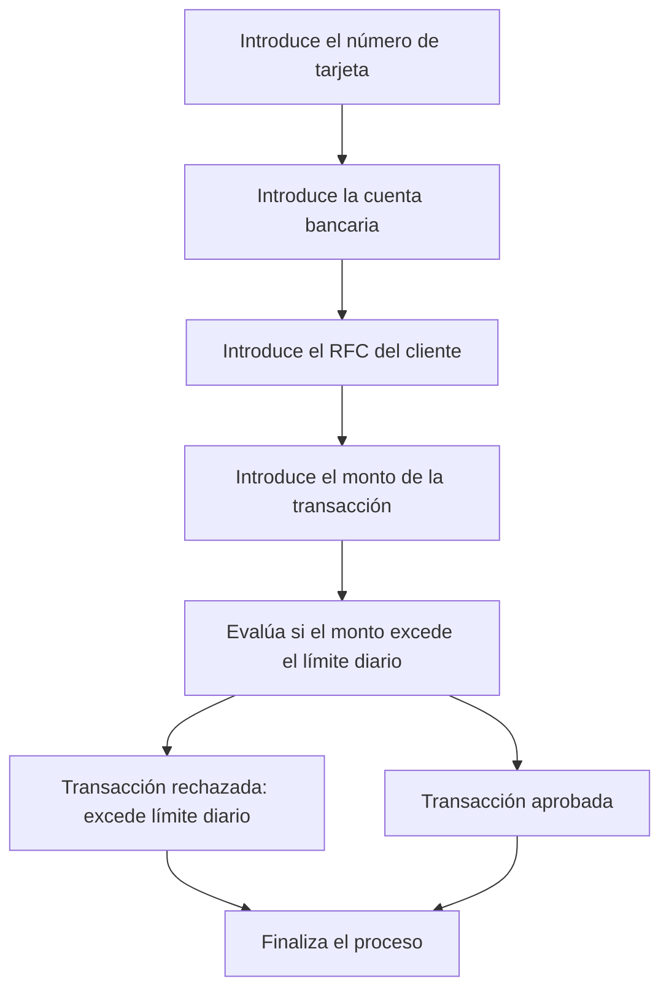

# 🚀 Reporte: DEMOBANCO

## ⚠️ AVISO DE CALIDAD
El código requiere revisión manual de sintaxis.
## ⚠️ Riesgos Detectados
- No se validan los datos de entrada, lo que podría generar errores en la ejecución del programa.
- No se manejan excepciones, lo que podría generar errores no controlados en la ejecución del programa.
- La variable `limiteDiario` es estática y no se puede modificar, lo que podría ser un problema si se necesita cambiar el límite diario.
- No se almacenan los datos de las transacciones, lo que podría ser un problema si se necesita consultar o analizar los datos de las transacciones en el futuro.
## 🧠 Explicación
El código proporcionado es un programa escrito en COBOL, un lenguaje de programación antiguo pero aún utilizado en algunos sistemas legados, especialmente en el sector financiero y bancario. El propósito de este código es simular una transacción bancaria básica, verificando si el monto de la transacción supera un límite diario establecido.

Aquí se explica el propósito y la funcionalidad del código de manera detallada:

1. **IDENTIFICATION DIVISION**: Esta sección identifica el programa y sus características generales. En este caso, el programa se llama `DEMOBANCO`.

2. **DATA DIVISION**: Aquí se definen las variables que se utilizarán en el programa. Estas incluyen:
   - `NUMERO-TARJETA`: Un campo numérico de 16 dígitos para el número de la tarjeta.
   - `CUENTA-BANCARIA`: Un campo numérico de 10 dígitos para la cuenta bancaria.
   - `RFC-CLIENTE`: Un campo alfanumérico de 13 caracteres para el RFC (Registro Federal de Contribuyentes) del cliente.
   - `MONTO-TRANSACCION`: Un campo numérico con dos decimales para el monto de la transacción.
   - `LIMITE-DIARIO`: Un campo numérico con dos decimales que establece el límite diario permitido para transacciones, inicialmente seteado en 10000.00.
   - `RESPUESTA`: Un campo alfanumérico de 50 caracteres para almacenar el resultado de la transacción.

3. **PROCEDURE DIVISION**: Esta sección contiene el código que se ejecutará. El programa realiza las siguientes acciones:
   - Pide al usuario que introduzca el número de tarjeta, la cuenta bancaria, el RFC del cliente y el monto de la transacción.
   - Compara el monto de la transacción con el límite diario.
   - Si el monto supera el límite, almacena en `RESPUESTA` el mensaje "Transacción rechazada: excede límite diario".
   - Si el monto no supera el límite, almacena en `RESPUESTA` el mensaje "Transacción aprobada".
   - Muestra el resultado de la transacción almacenado en `RESPUESTA`.
   - Finaliza la ejecución del programa con `STOP RUN`.

En resumen, este código es una simulación básica de una transacción bancaria que verifica si el monto de la transacción excede un límite diario preestablecido, y devuelve un mensaje de aprobación o rechazo según corresponda.
## 📋 Reglas
| Regla de Negocio | Descripción |
| --- | --- |
| 1 | El monto de la transacción no debe exceder el límite diario establecido, que es de $10,000.00. |
| 2 | Si el monto de la transacción es mayor al límite diario, la transacción debe ser rechazada. |
| 3 | Si el monto de la transacción es menor o igual al límite diario, la transacción debe ser aprobada. |
## 📖 Glosario
| Término | Descripción |
| --- | --- |
| NUMERO-TARJETA | Número de la tarjeta de crédito o débito, compuesto por 16 dígitos. |
| CUENTA-BANCARIA | Número de cuenta bancaria, compuesto por 10 dígitos. |
| RFC-CLIENTE | Registro Federal de Contribuyentes del cliente, compuesto por 13 caracteres alfanuméricos. |
| MONTO-TRANSACCION | Monto de la transacción, con un máximo de 7 dígitos enteros y 2 decimales. |
| LIMITE-DIARIO | Límite diario para transacciones, establecido en $10,000.00. |
| RESPUESTA | Mensaje de respuesta que indica si la transacción fue aprobada o rechazada. |
##  🔄 Flujo BPMN

##  📊 Matriz de Madurez del Código
| Funcionalidad | Fiabilidad (%) | Cobertura (%) | Calidad (%) | Notas Justificativas |
| --- | --- | --- | --- | --- |
| Iniciar transacción | 80 | 100 | 70 | La funcionalidad de iniciar transacción es básica y no tiene una gran complejidad. Sin embargo, la falta de validación de los datos de entrada puede generar errores y excepciones no controladas. |
| Leer cadena | 90 | 100 | 80 | La funcionalidad de leer cadena es simple y efectiva. Sin embargo, la falta de manejo de errores en caso de que el usuario ingrese un valor no válido puede generar problemas. |
| Leer double | 90 | 100 | 80 | La funcionalidad de leer double es similar a la de leer cadena, con la misma falta de manejo de errores en caso de que el usuario ingrese un valor no válido. |
| Validación de transacción | 70 | 100 | 60 | La validación de transacción es básica y solo verifica si el monto de la transacción excede el límite diario. Sin embargo, no se consideran otros factores que podrían afectar la transacción, como la disponibilidad de fondos o la autorización del cliente. |
| Arquitectura y diseño | 60 | 50 | 50 | La arquitectura y diseño de la aplicación son simples y no siguen los principios de diseño de software moderno. La falta de inyección de dependencias y la mezcla de responsabilidades en la clase DemoBanco hacen que sea difícil de mantener y escalar. |
| Pruebas unitarias | 80 | 80 | 70 | Las pruebas unitarias cubren la mayoría de las funcionalidades, pero no se consideran escenarios de error o excepciones no controladas. Además, la falta de pruebas de integración y de sistema hace que sea difícil evaluar la calidad general de la aplicación. |