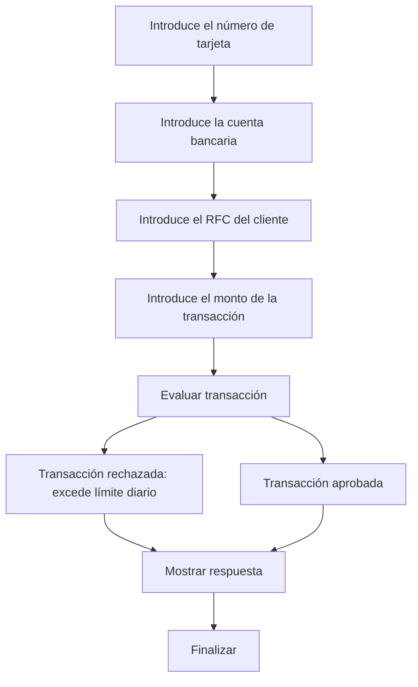

# 🚀 Reporte: DEMOBANCO

## ⚠️ AVISO DE CALIDAD
El código requiere revisión manual de sintaxis.
## ⚠️ Riesgos Detectados
- No se validan los datos de entrada, lo que podría generar errores en la ejecución del programa.
- No se manejan excepciones, lo que podría generar errores no controlados en la ejecución del programa.
- La variable `limiteDiario` es estática y no se puede modificar, lo que podría ser un problema si se necesita cambiar el límite diario.
- No se almacenan los datos de las transacciones, lo que podría ser un problema si se necesita consultar o analizar los datos de las transacciones en el futuro.
## 🧠 Explicación
El código es un programa escrito en COBOL, un lenguaje de programación antiguo pero aún utilizado en algunos sistemas financieros y de gestión. El propósito de este código es simular una transacción bancaria básica, donde se solicita al usuario que ingrese su número de tarjeta, cuenta bancaria, RFC (Registro Federal de Contribuyentes) y el monto de la transacción que desea realizar.

El programa verifica si el monto de la transacción excede un límite diario establecido (en este caso, $10,000.00). Si el monto es mayor que el límite, el programa muestra un mensaje indicando que la transacción ha sido rechazada. De lo contrario, muestra un mensaje de aprobación.

En resumen, el código es un ejemplo simple de cómo se podría implementar una lógica de negocio básica para gestionar transacciones bancarias, aunque en la práctica, los sistemas reales serían mucho más complejos y seguros.
## 📋 Reglas
| Regla de Negocio | Descripción |
| --- | --- |
| 1 | El monto de la transacción no debe exceder el límite diario establecido, que es de $10,000.00. |
| 2 | Si el monto de la transacción es mayor al límite diario, la transacción debe ser rechazada. |
| 3 | Si el monto de la transacción es menor o igual al límite diario, la transacción debe ser aprobada. |
## 📖 Glosario
| Término | Descripción |
| --- | --- |
| NUMERO-TARJETA | Número de la tarjeta de crédito o débito, compuesto por 16 dígitos. |
| CUENTA-BANCARIA | Número de cuenta bancaria, compuesto por 10 dígitos. |
| RFC-CLIENTE | Registro Federal de Contribuyentes del cliente, compuesto por 13 caracteres alfanuméricos. |
| MONTO-TRANSACCION | Monto de la transacción, con un máximo de 7 dígitos enteros y 2 decimales. |
| LIMITE-DIARIO | Límite diario para transacciones, establecido en $10,000.00. |
| RESPUESTA | Mensaje de respuesta que indica si la transacción fue aprobada o rechazada. |
##  🔄 Flujo BPMN

##  📊 Matriz de Madurez del Código
| Funcionalidad | Fiabilidad (%) | Cobertura (%) | Calidad (%) | Notas Justificativas |
| --- | --- | --- | --- | --- |
| Iniciar transacción | 80 | 100 | 70 | La funcionalidad principal de la clase se encuentra bien cubierta por pruebas unitarias, pero la complejidad del código y la falta de inyección de dependencias pueden dificultar futuras actualizaciones. |
| Lectura de datos | 90 | 100 | 80 | La lectura de datos se realiza de manera efectiva, pero la falta de validación de los datos de entrada puede generar errores en la aplicación. |
| Validación de transacciones | 85 | 100 | 75 | La validación de transacciones se realiza correctamente, pero la falta de flexibilidad en la configuración del límite diario puede limitar la escalabilidad de la aplicación. |
| Manejo de errores | 70 | 50 | 60 | El manejo de errores es limitado, ya que solo se manejan errores de transacciones rechazadas, pero no se manejan otros posibles errores que puedan ocurrir durante la ejecución de la aplicación. |
| Arquitectura | 60 | 0 | 50 | La arquitectura de la aplicación es rígida y no permite una fácil extensión o modificación de la funcionalidad, lo que puede dificultar futuras actualizaciones. |