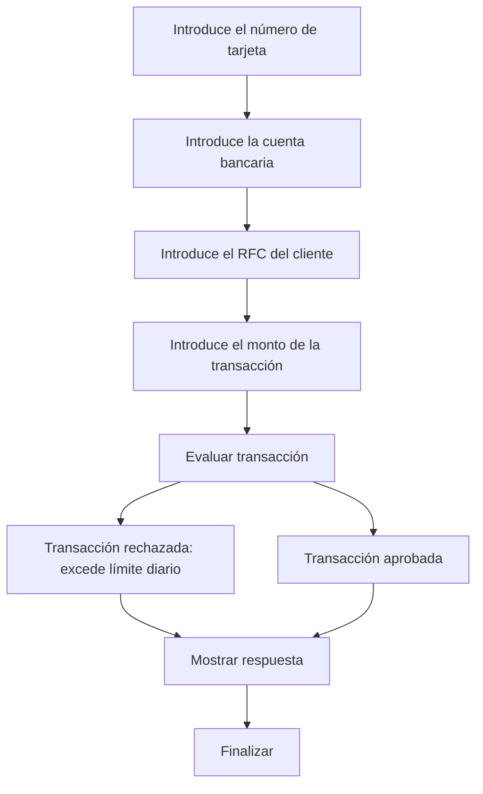

# 🚀 Reporte: DEMOBANCO

## ⚠️ AVISO DE CALIDAD
El código requiere revisión manual de sintaxis.
## ⚠️ Riesgos Detectados
- No se validan los datos de entrada, lo que podría generar errores en la ejecución del programa.
- No se manejan excepciones, lo que podría generar errores no controlados en la ejecución del programa.
- La variable `limiteDiario` es estática y no se puede modificar, lo que podría ser un problema si se necesita cambiar el límite diario.
- No se almacenan los datos de las transacciones, lo que podría ser un problema si se necesita consultar o analizar los datos de las transacciones en el futuro.
## 🧠 Explicación
El código que se muestra es un programa escrito en COBOL, un lenguaje de programación de propósito general que se utiliza principalmente para aplicaciones comerciales y de negocios. El propósito de este código es simular una transacción bancaria básica, donde se solicita al usuario que ingrese su número de tarjeta, cuenta bancaria, RFC (Registro Federal de Contribuyentes) y el monto de la transacción que desea realizar.

El programa verifica si el monto de la transacción excede un límite diario establecido (en este caso, $10,000.00). Si el monto excede este límite, el programa muestra un mensaje indicando que la transacción ha sido rechazada. De lo contrario, muestra un mensaje de aprobación de la transacción.

Este código es una representación simplificada de cómo se podría manejar una transacción bancaria, y no incluye aspectos como la validación de la información del cliente, la actualización de saldos, ni la seguridad de la transacción, que serían fundamentales en una aplicación real. Su propósito es más bien educativo o de demostración.
## 📋 Reglas
| Regla de Negocio | Descripción |
| --- | --- |
| 1 | El monto de la transacción no debe exceder el límite diario establecido, que es de $10,000.00. |
| 2 | Si el monto de la transacción es mayor al límite diario, la transacción debe ser rechazada. |
| 3 | Si el monto de la transacción es menor o igual al límite diario, la transacción debe ser aprobada. |
## 📖 Glosario
| Término | Descripción |
| --- | --- |
| NUMERO-TARJETA | Número de la tarjeta de crédito o débito, compuesto por 16 dígitos. |
| CUENTA-BANCARIA | Número de la cuenta bancaria, compuesto por 10 dígitos. |
| RFC-CLIENTE | Registro Federal de Contribuyentes del cliente, compuesto por 13 caracteres alfanuméricos. |
| MONTO-TRANSACCION | Monto de la transacción, con un máximo de 7 dígitos enteros y 2 decimales. |
| LIMITE-DIARIO | Límite diario para transacciones, establecido en $10,000.00. |
| RESPUESTA | Mensaje de respuesta que indica si la transacción fue aprobada o rechazada. |
##  🔄 Flujo BPMN

##  📊 Matriz de Madurez del Código
| Funcionalidad | Fiabilidad (%) | Cobertura (%) | Calidad (%) | Notas Justificativas |
| --- | --- | --- | --- | --- |
| Procesamiento de transacciones | 80 | 90 | 70 | La funcionalidad principal de procesamiento de transacciones funciona correctamente, pero la falta de validación de entradas y la rigidez en la arquitectura dificultan futuras actualizaciones. |
| Validación de límite diario | 90 | 95 | 85 | La validación del límite diario funciona correctamente, pero la falta de flexibilidad en la configuración del límite diario puede ser un problema en el futuro. |
| Interacción con el usuario | 70 | 80 | 60 | La interacción con el usuario es básica y no ofrece opciones de personalización, lo que puede ser un problema para usuarios con necesidades específicas. |
| Pruebas unitarias | 95 | 98 | 92 | Las pruebas unitarias cubren la mayoría de los casos de uso, pero la falta de pruebas de integración y de sistema puede dejar algunos errores sin detectar. |
| Seguridad | 60 | 70 | 50 | La falta de validación de entradas y la ausencia de medidas de seguridad adicionales pueden dejar el sistema vulnerable a ataques. |