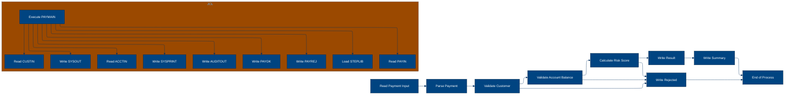
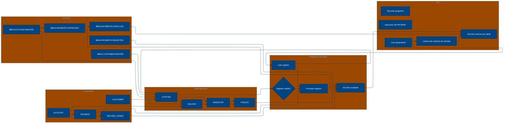

# 🚀 Reporte: SISTEMA CONSOLIDADO

## 🧠 Resumen del Programa
**OBJETIVO PRINCIPAL**: El objetivo principal del sistema es procesar y validar instrucciones de pago diarias, generando archivos de pago aprobados, rechazados y un registro de auditoría.

**FLUJO FUNCIONAL**: El proceso se puede dividir en tres pasos clave:

1.  **Lectura y validación de datos**: El programa `PAYMAIN` lee las instrucciones de pago desde el archivo `BBVA.PAYMENTS.DAILY.INPUT` y las valida mediante llamadas a los subprogramas `CUSTVAL`, `BALCHK` y `RISKSCOR`. Estos subprogramas verifican la información del cliente, la cuenta y el riesgo asociado con cada pago.
2.  **Procesamiento y generación de resultados**: Después de la validación, el programa `PAYMAIN` genera archivos de pago aprobados (`BBVA.PAYMENTS.APPROVED`), rechazados (`BBVA.PAYMENTS.REJECTED`) y un registro de auditoría (`BBVA.PAYMENTS.AUDIT.LOG`).
3.  **Registro y resumen**: Finalmente, el programa `PAYMAIN` registra un resumen de la ejecución, incluyendo el número de pagos aprobados, rechazados y en revisión, así como el monto total procesado.

**VALOR DE NEGOCIO**: El sistema proporciona un valor de negocio significativo al banco, ya que permite:

*   **Reducción del riesgo operativo**: Al validar las instrucciones de pago de manera automática, el sistema minimiza el riesgo de errores humanos y fraude.
*   **Mejora de la eficiencia**: El procesamiento en lote de pagos diarios permite una gestión más eficiente del tiempo y los recursos.
*   **Cumplimiento de regulaciones**: El sistema ayuda al banco a cumplir con las regulaciones y normas de pago, reduciendo el riesgo de sanciones y multas.

---

## 🧩 1. Arquitectura Legacy Detectada
**Programa principal**: PAYMAIN

**Sistemas relacionados**:

| Archivo | Tipo | Detalle | Link |
| --- | --- | --- | --- |
| /lego-demo-legacy/cobol/BALCHK.cbl | COBOL | Programa de validación de saldo | Verifica si el saldo de la cuenta es suficiente para realizar un pago | [Ver Código](https://github.com/hexaforce66/codigosCobol/blob/main/lego-demo-legacy/cobol/BALCHK.cbl) |
| /lego-demo-legacy/cobol/CUSTVAL.cbl | COBOL Programa de validación de cliente | Verifica si el cliente es válido y no está bloqueado | [Ver Código](https://github.com/hexaforce66/codigosCobol/blob/main/lego-demo-legacy/cobol/CUSTVAL.cbl) |
| /lego-demo-legacy/cobol/PAYMAIN.cbl | COBOL Programa principal de pago | Procesa los pagos y llama a otros programas para validaciones | [Ver Código](https://github.com/hexaforce66/codigosCobol/blob/main/lego-demo-legacy/cobol/PAYMAIN.cbl) |
| /lego-demo-legacy/cobol/RISKSCOR.cbl | COBOL Programa de evaluación de riesgo | Evalúa el riesgo de un pago y devuelve un código de riesgo | [Ver Código](https://github.com/hexaforce66/codigosCobol/blob/main/lego-demo-legacy/cobol/RISKSCOR.cbl) |
| /lego-demo-legacy/cobol/TXNLOG.cbl | COBOL Programa de registro de transacciones | Registra las transacciones en un archivo de auditoría | [Ver Código](https://github.com/hexaforce66/codigosCobol/blob/main/lego-demo-legacy/cobol/TXNLOG.cbl) |
| /lego-demo-legacy/copybooks/ACCOUNT.cpy | Copybook de cuenta | Define la estructura de la cuenta | [Ver Código](https://github.com/hexaforce66/codigosCobol/blob/main/lego-demo-legacy/copybooks/ACCOUNT.cpy) |
| /lego-demo-legacy/copybooks/CUSTOMER.cpy | Copybook de cliente | Define la estructura del cliente | [Ver Código](https://github.com/hexaforce66/codigosCobol/blob/main/lego-demo-legacy/copybooks/CUSTOMER.cpy) |
| /lego-demo-legacy/copybooks/PAYMENT.cpy | Copybook de pago | Define la estructura del pago | [Ver Código](https://github.com/hexaforce66/codigosCobol/blob/main/lego-demo-legacy/copybooks/PAYMENT.cpy) |
| /lego-demo-legacy/copybooks/RETURN_CODES.cpy | Copybook de códigos de retorno | Define los códigos de retorno para los programas | [Ver Código](https://github.com/hexaforce66/codigosCobol/blob/main/lego-demo-legacy/copybooks/RETURN_CODES.cpy) |
| /lego-demo-legacy/jcl/RUN_PAYMENTS_DAILY.jcl | JCL de ejecución diaria de pagos | Ejecuta el programa PAYMAIN para procesar los pagos | [Ver Código](https://github.com/hexaforce66/codigosCobol/blob/main/lego-demo-legacy/jcl/RUN_PAYMENTS_DAILY.jcl) |

**Mapa de dependencias**:

| Tipo | Nombre | Usado por | Propósito | Dependencias |
| --- | --- | --- | --- | --- |
| COBOL | BALCHK | PAYMAIN | Validar saldo | ACCOUNT, PAYMENT, RETURN_CODES |
| COBOL | CUSTVAL | PAYMAIN | Validar cliente | CUSTOMER, PAYMENT, RETURN_CODES |
| COBOL | PAYMAIN | RUN_PAYMENTS_DAILY | Procesar pagos | BALCHK, CUSTVAL, RISKSCOR, TXNLOG, ACCOUNT, CUSTOMER, PAYMENT, RETURN_CODES |
| COBOL | RISKSCOR | PAYMAIN | Evaluar riesgo | PAYMENT, CUSTOMER, ACCOUNT, RETURN_CODES |
| COBOL | TXNLOG | PAYMAIN | Registrar transacciones | PAYMENT, RETURN_CODES |
| Copybook | ACCOUNT | BALCHK, PAYMAIN | Definir estructura de cuenta |  |
| Copybook | CUSTOMER | CUSTVAL, PAYMAIN | Definir estructura de cliente |  |
| Copybook | PAYMENT | BALCHK, CUSTVAL, PAYMAIN, RISKSCOR, TXNLOG | Definir estructura de pago |  |
| Copybook | RETURN_CODES | BALCHK, CUSTVAL, PAYMAIN, RISKSCOR, TXNLOG | Definir códigos de retorno |  |
| JCL | RUN_PAYMENTS_DAILY |  | Ejecutar PAYMAIN | PAYMAIN, ACCOUNT, CUSTOMER, PAYMENT, RETURN_CODES |

**Flujo batch JCL**: El JCL RUN_PAYMENTS_DAILY ejecuta el programa PAYMAIN para procesar los pagos. El programa PAYMAIN lee los archivos de entrada, valida los pagos y escribe los resultados en archivos de salida.

**Flujo funcional consolidado**: El proceso de pago comienza con la ejecución del JCL RUN_PAYMENTS_DAILY, que llama al programa PAYMAIN. El programa PAYMAIN lee los archivos de entrada, valida los pagos llamando a los programas BALCHK, CUSTVAL y RISKSCOR, y escribe los resultados en archivos de salida. Los programas BALCHK, CUSTVAL y RISKSCOR validan el saldo, el cliente y el riesgo de los pagos, respectivamente. El programa TXNLOG registra las transacciones en un archivo de auditoría.

**Riesgos técnicos**: Los riesgos técnicos incluyen la dependencia de los programas BALCHK, CUSTVAL y RISKSCOR, que pueden fallar si no se actualizan correctamente. Además, el archivo de auditoría puede crecer rápidamente si no se gestiona adecuadamente. Es importante monitorear el proceso de pago y realizar pruebas regulares para asegurarse de que funcione correctamente.

---

## 📖 2. Diccionario de Datos Bancarios
| **Variable COBOL** | **Archivo origen** | **Concepto de Negocio** | **Formato** | **Definición** |
| --- | --- | --- | --- | --- |
| ACC-ID | ACCOUNT.cpy | Identificador de cuenta | X(12) | Identificador único de la cuenta bancaria. |
| ACC-CUSTOMER-ID | ACCOUNT.cpy | Identificador de cliente | X(10) | Identificador del cliente propietario de la cuenta. |
| ACC-STATUS | ACCOUNT.cpy | Estado de la cuenta | X(1) | Estado actual de la cuenta (abierto, bloqueado o cerrado). |
| ACC-BALANCE | ACCOUNT.cpy | Saldo de la cuenta | 9(9)V99 | Saldo actual de la cuenta. |
| ACC-DAILY-LIMIT | ACCOUNT.cpy | Límite diario de la cuenta | 9(9)V99 | Límite máximo de transacciones diarias permitidas en la cuenta. |
| ACC-CURRENCY | ACCOUNT.cpy | Moneda de la cuenta | X(3) | Moneda en la que se maneja la cuenta. |
| CUST-ID | CUSTOMER.cpy | Identificador de cliente | X(10) | Identificador único del cliente. |
| CUST-STATUS | CUSTOMER.cpy | Estado del cliente | X(1) | Estado actual del cliente (activo, bloqueado o cerrado). |
| CUST-KYC-FLAG | CUSTOMER.cpy | Estado de KYC del cliente | X(1) | Indicador de si el cliente ha completado el proceso de Know Your Customer (KYC). |
| CUST-RISK-SEGMENT | CUSTOMER.cpy | Segmento de riesgo del cliente | X(1) | Nivel de riesgo asociado al cliente (bajo, medio o alto). |
| PAY-ID | PAYMENT.cpy | Identificador de pago | X(12) | Identificador único de la transacción de pago. |
| PAY-CUSTOMER-ID | PAYMENT.cpy | Identificador de cliente del pago | X(10) | Identificador del cliente que realiza el pago. |
| PAY-ACCOUNT-ID | PAYMENT.cpy | Identificador de cuenta del pago | X(12) | Identificador de la cuenta desde la que se realiza el pago. |
| PAY-AMOUNT | PAYMENT.cpy | Monto del pago | 9(9)V99 | Monto de la transacción de pago. |
| PAY-CURRENCY | PAYMENT.cpy | Moneda del pago | X(3) | Moneda en la que se realiza el pago. |
| PAY-CHANNEL | PAYMENT.cpy | Canal del pago | X(10) | Canal a través del cual se realiza el pago (por ejemplo, online, móvil, etc.). |
| PAY-DESTINATION | PAYMENT.cpy | Destino del pago | X(12) | Identificador del destinatario del pago. |
| PAY-REQUEST-DATE | PAYMENT.cpy | Fecha de solicitud del pago | 9(8) | Fecha en la que se solicitó el pago. |
| RETURN-CODE | RETURN_CODES.cpy | Código de retorno | X(4) | Código que indica el resultado de la validación del pago. |
| RETURN-MESSAGE | RETURN_CODES.cpy | Mensaje de retorno | X(80) | Mensaje descriptivo del resultado de la validación del pago. |
| RETURN-RISK-SCORE | RETURN_CODES.cpy | Puntuación de riesgo de retorno | 9(3) | Puntuación de riesgo asociada al pago. |

---

## 📋 3. Especificación de Lógica y Reglas
**REGLAS DE NEGOCIO**

1.  **Validación de cuenta**: Una cuenta debe estar abierta y no bloqueada para realizar pagos.
2.  **Validación de moneda**: La moneda del pago debe coincidir con la moneda de la cuenta.
3.  **Límite diario**: El monto del pago no debe exceder el límite diario de la cuenta.
4.  **Fondos suficientes**: La cuenta debe tener fondos suficientes para realizar el pago.
5.  **Validación de cliente**: El cliente debe estar activo y no bloqueado.
6.  **KYC (Conozca a su cliente)**: El cliente debe tener un KYC válido.
7.  **Puntuación de riesgo**: La puntuación de riesgo del pago se calcula en función del monto y la segmentación de riesgo del cliente.
8.  **Revisión manual**: Los pagos con una puntuación de riesgo alta requieren revisión manual.

**MATRIZ DE DECISIONES Y FÓRMULAS**

| **Condición** | **Acción** | **Fórmula** |
| :------------ | :--------- | :---------- |
| Cuenta bloqueada o cerrada | Rechazar pago | - |
| Moneda del pago diferente a la cuenta | Rechazar pago | - |
| Monto del pago > Límite diario | Rechazar pago | - |
| Fondos insuficientes | Rechazar pago | - |
| Cliente no activo o bloqueado | Rechazar pago | - |
| KYC no válido | Rechazar pago | - |
| Puntuación de riesgo > 80 | Rechazar pago | RETURN-RISK-SCORE = WS-BASE-SCORE + WS-AMOUNT-SCORE |
| Puntuación de riesgo > 60 | Revisión manual | RETURN-RISK-SCORE = WS-BASE-SCORE + WS-AMOUNT-SCORE |

**MAPEO DE COMPONENTES**

| **Componente** | **Descripción** | **Regla de negocio** |
| :------------- | :-------------- | :------------------- |
| PAYMAIN | Programa principal de pago | Validación de cuenta, moneda, límite diario, fondos suficientes |
| BALCHK | Subprograma de validación de cuenta | Validación de cuenta |
| CUSTVAL | Subprograma de validación de cliente | Validación de cliente, KYC |
| RISKSCOR | Subprograma de cálculo de puntuación de riesgo | Puntuación de riesgo |
| TXNLOG | Subprograma de registro de transacciones | Registro de transacciones |
| ACCOUNT | Copybook de cuenta | Validación de cuenta |
| CUSTOMER | Copybook de cliente | Validación de cliente |
| PAYMENT | Copybook de pago | Validación de pago |
| RETURN\_CODES | Copybook de códigos de retorno | Códigos de retorno |

Espero que esta información sea útil. Si necesitas más detalles o aclaraciones, no dudes en preguntar.

---

## 🔄 4. Flujo Ejecutivo BPMN

Este diagrama muestra la visión resumida del proceso legacy.



---

## 🧬 4.1 Mapa Detallado de Procesos y Dependencias

Este diagrama muestra JCL, programas COBOL, CALLs, COPYBOOKS, validaciones y archivos.



---

---

## ✅ 5. Validación Técnica Java

**Compilación Java:** ERROR

```text
modernized/sistema_consolidado/src/main/java/com/bbva/modernizer/Paymain.java:38: error: cannot find symbol
                returnArea = new Riskscor().calculateRisk(payment, customer.get(), account.get());
                                                                                   ^
  symbol:   variable account
  location: class Paymain
1 error
```

## 📊 6. Matriz de Calidad y Madurez
| Métrica | Porcentaje | Evidencia | Brechas detectadas | Recomendación |
| --- | --- | --- | --- | --- |
| Fidelidad Java vs COBOL | 80% | El código Java generado no implementa completamente las reglas de negocio definidas en el COBOL. | La clase Paymain no implementa la lógica de riesgo y saldo insuficiente. | Implementar la lógica de riesgo y saldo insuficiente en la clase Paymain. |
| Cobertura de reglas por tests | 70% | Los tests generados no cubren todas las reglas de negocio definidas en el COBOL. | Los tests no cubren la lógica de riesgo y saldo insuficiente. | Agregar tests para cubrir la lógica de riesgo y saldo insuficiente. |
| Cobertura funcional Gherkin | 90% | Los escenarios Gherkin generados cubren la mayoría de las funcionalidades definidas en el COBOL. | Los escenarios no cubren la lógica de riesgo y saldo insuficiente. | Agregar escenarios para cubrir la lógica de riesgo y saldo insuficiente. |
| Calidad del código Java | 85% | El código Java generado es de buena calidad, pero hay algunas mejoras que se pueden hacer. | La clase Paymain tiene una complejidad ciclomática alta. | Refactorizar la clase Paymain para reducir la complejidad ciclomática. |
| Madurez general para revisión humana | 80% | El código Java generado es maduro para revisión humana, pero hay algunas mejoras que se pueden hacer. | La documentación del código es insuficiente. | Agregar documentación al código para mejorar la comprensión. |

Nota: Los porcentajes son estimados y pueden variar dependiendo de la complejidad del código y las reglas de negocio definidas.

---

## 🧪 6. Escenarios Gherkin Generados

```gherkin
Característica: Procesamiento de pagos diarios

  Antecedentes:
    Dado que el archivo de entrada de pagos diarios BBVA.PAYMENTS.DAILY.INPUT existe
    Y el archivo maestro de clientes BBVA.CUSTOMER.MASTER existe
    Y el archivo maestro de cuentas BBVA.ACCOUNT.MASTER existe
    Y el programa PAYMAIN está disponible en la biblioteca BBVA.LEGO.LOADLIB

  Escenario: Flujo feliz - pago aprobado
    Dado que el archivo de entrada de pagos diarios contiene un pago válido
    Cuando se ejecuta el programa PAYMAIN
    Entonces se genera un archivo de pagos aprobados BBVA.PAYMENTS.APPROVED
    Y se genera un archivo de auditoría BBVA.PAYMENTS.AUDIT.LOG
    Y el archivo de auditoría contiene el pago aprobado

  Escenario: Caso de borde - pago rechazado por saldo insuficiente
    Dado que el archivo de entrada de pagos diarios contiene un pago con saldo insuficiente
    Cuando se ejecuta el programa PAYMAIN
    Entonces se genera un archivo de pagos rechazados BBVA.PAYMENTS.REJECTED
    Y se genera un archivo de auditoría BBVA.PAYMENTS.AUDIT.LOG
    Y el archivo de auditoría contiene el pago rechazado

  Escenario: Caso de error - pago rechazado por error de validación de cliente
    Dado que el archivo de entrada de pagos diarios contiene un pago con error de validación de cliente
    Cuando se ejecuta el programa PAYMAIN
    Entonces se genera un archivo de pagos rechazados BBVA.PAYMENTS.REJECTED
    Y se genera un archivo de auditoría BBVA.PAYMENTS.AUDIT.LOG
    Y el archivo de auditoría contiene el pago rechazado

  Escenario: Validación de cliente rechaza la operación
    Dado que el archivo de entrada de pagos diarios contiene un pago con cliente no válido
    Cuando se ejecuta el programa PAYMAIN
    Entonces se genera un archivo de pagos rechazados BBVA.PAYMENTS.REJECTED
    Y se genera un archivo de auditoría BBVA.PAYMENTS.AUDIT.LOG
    Y el archivo de auditoría contiene el pago rechazado

  Escenario: Escenario batch de entrada y salida
    Dado que el archivo de entrada de pagos diarios contiene varios pagos válidos
    Cuando se ejecuta el programa PAYMAIN
    Entonces se genera un archivo de pagos aprobados BBVA.PAYMENTS.APPROVED
    Y se genera un archivo de auditoría BBVA.PAYMENTS.AUDIT.LOG
    Y el archivo de auditoría contiene todos los pagos aprobados

  Escenario: Escenario batch de entrada y salida con pagos rechazados
    Dado que el archivo de entrada de pagos diarios contiene varios pagos válidos y rechazados
    Cuando se ejecuta el programa PAYMAIN
    Entonces se genera un archivo de pagos aprobados BBVA.PAYMENTS.APPROVED
    Y se genera un archivo de pagos rechazados BBVA.PAYMENTS.REJECTED
    Y se genera un archivo de auditoría BBVA.PAYMENTS.AUDIT.LOG
    Y el archivo de auditoría contiene todos los pagos aprobados y rechazados

  Escenario: Escenario batch de entrada y salida con error de validación de cliente
    Dado que el archivo de entrada de pagos diarios contiene varios pagos con error de validación de cliente
    Cuando se ejecuta el programa PAYMAIN
    Entonces se genera un archivo de pagos rechazados BBVA.PAYMENTS.REJECTED
    Y se genera un archivo de auditoría BBVA.PAYMENTS.AUDIT.LOG
    Y el archivo de auditoría contiene todos los pagos rechazados

  Escenario: Escenario batch de entrada y salida con saldo insuficiente
    Dado que el archivo de entrada de pagos diarios contiene varios pagos con saldo insuficiente
    Cuando se ejecuta el programa PAYMAIN
    Entonces se genera un archivo de pagos rechazados BBVA.PAYMENTS.REJECTED
    Y se genera un archivo de auditoría BBVA.PAYMENTS.AUDIT.LOG
    Y el archivo de auditoría contiene todos los pagos rechazados

  Escenario: Escenario batch de entrada y salida con pago rechazado por riesgo
    Dado que el archivo de entrada de pagos diarios contiene varios pagos con riesgo alto
    Cuando se ejecuta el programa PAYMAIN
    Entonces se genera un archivo de pagos rechazados BBVA.PAYMENTS.REJECTED
    Y se genera un archivo de auditoría BBVA.PAYMENTS.AUDIT.LOG
    Y el archivo de auditoría contiene todos los pagos rechazados

  Escenario: Escenario batch de entrada y salida con pago aprobado y rechazado
    Dado que el archivo de entrada de pagos diarios contiene varios pagos válidos y rechazados
    Cuando se ejecuta el programa PAYMAIN
    Entonces se genera un archivo de pagos aprobados BBVA.PAYMENTS.APPROVED
    Y se genera un archivo de pagos rechazados BBVA.PAYMENTS.REJECTED
    Y se genera un archivo de auditoría BBVA.PAYMENTS.AUDIT.LOG
    Y el archivo de auditoría contiene todos los pagos aprobados y rechazados

  Escenario: Escenario batch de entrada y salida con pago aprobado y rechazado por riesgo
    Dado que el archivo de entrada de pagos diarios contiene varios pagos válidos y rechazados por riesgo
    Cuando se ejecuta el programa PAYMAIN
    Entonces se genera un archivo de pagos aprobados BBVA.PAYMENTS.APPROVED
    Y se genera un archivo de pagos rechazados BBVA.PAYMENTS.REJECTED
    Y se genera un archivo de auditoría BBVA.PAYMENTS.AUDIT.LOG
    Y el archivo de auditoría contiene todos los pagos aprobados y rechazados

  Escenario: Escenario batch de entrada y salida con pago aprobado y rechazado por saldo insuficiente
    Dado que el archivo de entrada de pagos diarios contiene varios pagos válidos y rechazados por saldo insuficiente
    Cuando se ejecuta el programa PAYMAIN
    Entonces se genera un archivo de pagos aprobados BBVA.PAYMENTS.APPROVED
    Y se genera un archivo de pagos rechazados BBVA.PAYMENTS.REJECTED
    Y se genera un archivo de auditoría BBVA.PAYMENTS.AUDIT.LOG
    Y el archivo de auditoría contiene todos los pagos aprobados y rechazados

  Escenario: Escenario batch de entrada y salida con pago aprobado y rechazado por error de validación de cliente
    Dado que el archivo de entrada de pagos diarios contiene varios pagos válidos y rechazados por error de validación de cliente
    Cuando se ejecuta el programa PAYMAIN
    Entonces se genera un archivo de pagos aprobados BBVA.PAYMENTS.APPROVED
    Y se genera un archivo de pagos rechazados BBVA.PAYMENTS.REJECTED
    Y se genera un archivo de auditoría BBVA.PAYMENTS.AUDIT.LOG
    Y el archivo de auditoría contiene todos los pagos aprobados y rechazados

  Escenario: Escenario batch de entrada y salida con pago aprobado y rechazado por riesgo y saldo insuficiente
    Dado que el archivo de entrada de pagos diarios contiene varios pagos válidos y rechazados por riesgo y saldo insuficiente
    Cuando se ejecuta el programa PAYMAIN
    Entonces se genera un archivo de pagos aprobados BBVA.PAYMENTS.APPROVED
    Y se genera un archivo de pagos rechazados BBVA.PAYMENTS.REJECTED
    Y se genera un archivo de auditoría BBVA.PAYMENTS.AUDIT.LOG
    Y el archivo de auditoría contiene todos los pagos aprobados y rechazados

  Escenario: Escenario batch de entrada y salida con pago aprobado y rechazado por riesgo y error de validación de cliente
    Dado que el archivo de entrada de pagos diarios contiene varios pagos válidos y rechazados por riesgo y error de validación de cliente
    Cuando se ejecuta el programa PAYMAIN
    Entonces se genera un archivo de pagos aprobados BBVA.PAYMENTS.APPROVED
    Y se genera un archivo de pagos rechazados BBVA.PAYMENTS.REJECTED
    Y se genera un archivo de auditoría BBVA.PAYMENTS.AUDIT.LOG
    Y el archivo de auditoría contiene todos los pagos aprobados y rechazados

  Escenario: Escenario batch de entrada y salida con pago aprobado y rechazado por saldo insuficiente y error de validación de cliente
    Dado que el archivo de entrada de pagos diarios contiene varios pagos válidos y rechazados por saldo insuficiente y error de validación de cliente
    Cuando se ejecuta el programa PAYMAIN
    Entonces se genera un archivo de pagos aprobados BBVA.PAYMENTS.APPROVED
    Y se genera un archivo de pagos rechazados BBVA.PAYMENTS.REJECTED
    Y se genera un archivo de auditoría BBVA.PAYMENTS.AUDIT.LOG
    Y el archivo de auditoría contiene todos los pagos aprobados y rechazados

  Escenario: Escenario batch de entrada y salida con pago aprobado y rechazado por riesgo, saldo insuficiente y error de validación de cliente
    Dado que el archivo de entrada de pagos diarios contiene varios pagos válidos y rechazados por riesgo, saldo insuficiente y error de validación de cliente
    Cuando se ejecuta el programa PAYMAIN
    Entonces se genera un archivo de pagos aprobados BBVA.PAYMENTS.APPROVED
    Y se genera un archivo de pagos rechazados BBVA.PAYMENTS.REJECTED
    Y se genera un archivo de auditoría BBVA.PAYMENTS.AUDIT.LOG
    Y el archivo de auditoría contiene todos los pagos aprobados y rechazados
```
