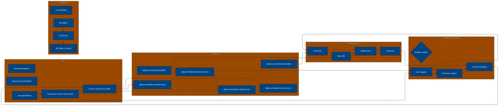

# 🚀 Reporte: SISTEMA CONSOLIDADO

## 🧠 Resumen del Programa
**OBJETIVO PRINCIPAL**: El objetivo principal del sistema es procesar y validar instrucciones de pago diarias, generando archivos de pago aprobados, rechazados y un registro de auditoría.

**FLUJO FUNCIONAL**: El proceso se puede dividir en tres pasos clave:

1. **Lectura y validación de datos de pago**: El programa PAYMAIN lee las instrucciones de pago desde el archivo de entrada PAYIN y las valida mediante llamadas a los subprogramas CUSTVAL y BALCHK, que verifican la información del cliente y la cuenta, respectivamente.
2. **Cálculo de riesgo y validación**: Si la validación anterior es exitosa, se llama al subprograma RISKSCOR para calcular el riesgo asociado con la transacción y determinar si requiere revisión manual.
3. **Generación de resultados y registro de auditoría**: Finalmente, se generan los archivos de pago aprobados (PAYOK), rechazados (PAYREJ) y el registro de auditoría (AUDITOUT), que incluye información detallada sobre cada transacción procesada.

**VALOR DE NEGOCIO**: El sistema ayuda a reducir el riesgo operativo al validar y verificar la información de pago, lo que minimiza la posibilidad de errores o fraudes. Además, proporciona un registro de auditoría detallado para cumplir con los requisitos regulatorios y mejorar la transparencia en las operaciones de pago. El impacto en el negocio es significativo, ya que permite al banco procesar grandes volúmenes de pagos de manera eficiente y segura, lo que mejora la satisfacción del cliente y reduce los costos asociados con la gestión de errores o disputas.

---

## 🧩 1. Arquitectura Legacy Detectada
**Programa principal**

El programa principal es PAYMAIN, que se ejecuta desde el JCL RUN_PAYMENTS_DAILY.jcl.

**Sistemas relacionados**

| Archivo | Tipo | Detalle | Link |
| --- | --- | --- | --- |
| /cobol/BALCHK.cbl | COBOL | Programa que valida el saldo de la cuenta | [Ver Código](https://github.com/hexaforce66/codigosCobol/blob/main/cobol/BALCHK.cbl) |
| /cobol/CUSTVAL.cbl | COBOL | Programa que valida la información del cliente | [Ver Código](https://github.com/hexaforce66/codigosCobol/blob/main/cobol/CUSTVAL.cbl) |
| /cobol/PAYMAIN.cbl | COBOL | Programa principal que ejecuta el proceso de pago | [Ver Código](https://github.com/hexaforce66/codigosCobol/blob/main/cobol/PAYMAIN.cbl) |
| /cobol/RISKSCOR.cbl | COBOL | Programa que calcula el riesgo de la transacción | [Ver Código](https://github.com/hexaforce66/codigosCobol/blob/main/cobol/RISKSCOR.cbl) |
| /cobol/TXNLOG.cbl | COBOL | Programa que registra la transacción en el archivo de auditoría | [Ver Código](https://github.com/hexaforce66/codigosCobol/blob/main/cobol/TXNLOG.cbl) |
| /copybooks/ACCOUNT.cpy | COPYBOOK | Definición de la estructura de la cuenta | [Ver Código](https://github.com/hexaforce66/codigosCobol/blob/main/copybooks/ACCOUNT.cpy) |
| /copybooks/CUSTOMER.cpy | COPYBOOK | Definición de la estructura del cliente | [Ver Código](https://github.com/hexaforce66/codigosCobol/blob/main/copybooks/CUSTOMER.cpy) |
| /copybooks/PAYMENT.cpy | COPYBOOK | Definición de la estructura del pago | [Ver Código](https://github.com/hexaforce66/codigosCobol/blob/main/copybooks/PAYMENT.cpy) |
| /copybooks/RETURN_CODES.cpy | COPYBOOK | Definición de los códigos de retorno | [Ver Código](https://github.com/hexaforce66/codigosCobol/blob/main/copybooks/RETURN_CODES.cpy) |
| /jcl/RUN_PAYMENTS_DAILY.jcl | JCL | Job que ejecuta el proceso de pago | [Ver Código](https://github.com/hexaforce66/codigosCobol/blob/main/jcl/RUN_PAYMENTS_DAILY.jcl) |

**Mapa de dependencias**

| Tipo | Nombre | Usado por | Propósito | Dependencias |
| --- | --- | --- | --- | --- |
| COBOL | BALCHK | PAYMAIN | Validar saldo de la cuenta | ACCOUNT, RETURN_CODES |
| COBOL | CUSTVAL | PAYMAIN | Validar información del cliente | CUSTOMER, RETURN_CODES |
| COBOL | PAYMAIN | RUN_PAYMENTS_DAILY.jcl | Ejecutar proceso de pago | BALCHK, CUSTVAL, RISKSCOR, TXNLOG, PAYMENT, CUSTOMER, ACCOUNT, RETURN_CODES |
| COBOL | RISKSCOR | PAYMAIN | Calcular riesgo de la transacción | PAYMENT, CUSTOMER, ACCOUNT, RETURN_CODES |
| COBOL | TXNLOG | PAYMAIN | Registrar transacción en archivo de auditoría | PAYMENT, RETURN_CODES |
| COPYBOOK | ACCOUNT | BALCHK, PAYMAIN | Definir estructura de la cuenta |  |
| COPYBOOK | CUSTOMER | CUSTVAL, PAYMAIN | Definir estructura del cliente |  |
| COPYBOOK | PAYMENT | PAYMAIN, RISKSCOR, TXNLOG | Definir estructura del pago |  |
| COPYBOOK | RETURN_CODES | BALCHK, CUSTVAL, PAYMAIN, RISKSCOR, TXNLOG | Definir códigos de retorno |  |
| JCL | RUN_PAYMENTS_DAILY.jcl |  | Ejecutar proceso de pago | PAYMAIN, PAYIN, CUSTIN, ACCTIN, PAYOK, PAYREJ, AUDITOUT |

**Flujo batch JCL**

El JCL RUN_PAYMENTS_DAILY.jcl ejecuta el programa PAYMAIN, que lee el archivo de entrada PAYIN, valida la información del cliente y la cuenta, calcula el riesgo de la transacción y registra la transacción en el archivo de auditoría. El proceso genera archivos de salida para pagos aprobados, rechazados y auditoría.

**Flujo funcional consolidado**

El proceso de pago diario consiste en los siguientes pasos:

1. Leer el archivo de entrada de pagos.
2. Validar la información del cliente y la cuenta.
3. Calcular el riesgo de la transacción.
4. Registrar la transacción en el archivo de auditoría.
5. Generar archivos de salida para pagos aprobados, rechazados y auditoría.

**Riesgos técnicos**

* Dependencias críticas: El proceso de pago depende de la disponibilidad de los archivos de entrada y salida, así como de la correcta configuración del JCL.
* Copybooks compartidos: Los copybooks ACCOUNT, CUSTOMER, PAYMENT y RETURN_CODES son compartidos entre varios programas, lo que puede generar conflictos si se modifican.
* Archivos sensibles: Los archivos de entrada y salida contienen información sensible, por lo que es importante garantizar su seguridad y confidencialidad.
* Puntos de fallo: El proceso de pago puede fallar si se produce un error en la validación de la información del cliente o la cuenta, o si se produce un error en la calculación del riesgo de la transacción.

---

## 📖 2. Diccionario de Datos Bancarios
| Variable COBOL | Archivo origen | Concepto de Negocio | Formato | Definición |
| --- | --- | --- | --- | --- |
| ACC-ID | ACCOUNT | Identificador de cuenta | X(12) | Identificador único de la cuenta bancaria. |
| ACC-CUSTOMER-ID | ACCOUNT | Identificador de cliente | X(10) | Identificador del cliente propietario de la cuenta. |
| ACC-STATUS | ACCOUNT | Estado de la cuenta | X(1) | Estado actual de la cuenta (abierto, bloqueado, cerrado). |
| ACC-BALANCE | ACCOUNT | Saldo de la cuenta | 9(9)V99 | Saldo actual de la cuenta bancaria. |
| ACC-DAILY-LIMIT | ACCOUNT | Límite diario de la cuenta | 9(9)V99 | Límite máximo de transacciones diarias permitidas en la cuenta. |
| ACC-CURRENCY | ACCOUNT | Moneda de la cuenta | X(3) | Moneda en la que se maneja la cuenta bancaria. |
| CUST-ID | CUSTOMER | Identificador de cliente | X(10) | Identificador único del cliente. |
| CUST-STATUS | CUSTOMER | Estado del cliente | X(1) | Estado actual del cliente (activo, bloqueado, cerrado). |
| CUST-KYC-FLAG | CUSTOMER | Estado de cumplimiento de KYC | X(1) | Indicador de si el cliente ha cumplido con los requisitos de Know Your Customer (KYC). |
| CUST-RISK-SEGMENT | CUSTOMER | Segmento de riesgo del cliente | X(1) | Nivel de riesgo asociado al cliente (bajo, medio, alto). |
| PAY-ID | PAYMENT | Identificador de pago | X(12) | Identificador único de la transacción de pago. |
| PAY-CUSTOMER-ID | PAYMENT | Identificador de cliente | X(10) | Identificador del cliente que realiza el pago. |
| PAY-ACCOUNT-ID | PAYMENT | Identificador de cuenta | X(12) | Identificador de la cuenta bancaria destino del pago. |
| PAY-AMOUNT | PAYMENT | Monto del pago | 9(9)V99 | Monto de la transacción de pago. |
| PAY-CURRENCY | PAYMENT | Moneda del pago | X(3) | Moneda en la que se realiza el pago. |
| PAY-CHANNEL | PAYMENT | Canal de pago | X(10) | Canal a través del cual se realiza el pago (banca en línea, aplicación móvil, etc.). |
| PAY-DESTINATION | PAYMENT | Destino del pago | X(12) | Información del destinatario del pago. |
| PAY-REQUEST-DATE | PAYMENT | Fecha de solicitud del pago | 9(8) | Fecha en la que se solicitó el pago. |
| RETURN-CODE | RETURN_CODES | Código de retorno | X(4) | Código que indica el resultado de la validación del pago. |
| RETURN-MESSAGE | RETURN_CODES | Mensaje de retorno | X(80) | Descripción del resultado de la validación del pago. |
| RETURN-RISK-SCORE | RETURN_CODES | Puntuación de riesgo | 9(3) | Puntuación que indica el nivel de riesgo asociado al pago. |

---

## 📋 3. Especificación de Lógica y Reglas
**REGLAS DE NEGOCIO**

1.  **Validación de cuenta**: Una cuenta debe estar abierta y no bloqueada para realizar pagos.
2.  **Validación de moneda**: La moneda del pago debe coincidir con la moneda de la cuenta.
3.  **Límite diario**: El monto del pago no debe exceder el límite diario de la cuenta.
4.  **Fondos suficientes**: La cuenta debe tener fondos suficientes para realizar el pago.
5.  **Validación de cliente**: El cliente debe estar activo y no bloqueado.
6.  **KYC (Conozca a su cliente)**: El cliente debe tener un KYC válido.
7.  **Puntuación de riesgo**: El pago se rechaza si la puntuación de riesgo es mayor a 80.
8.  **Revisión manual**: El pago requiere revisión manual si la puntuación de riesgo es mayor a 60.

**MATRIZ DE DECISIONES Y FÓRMULAS**

| **Condición** | **Acción** | **Fórmula** |
| :------------ | :--------- | :---------- |
| ACC-BLOCKED o ACC-CLOSED | Rechazar pago | - |
| PAY-CURRENCY ≠ ACC-CURRENCY | Rechazar pago | - |
| PAY-AMOUNT > ACC-DAILY-LIMIT | Rechazar pago | - |
| PAY-AMOUNT > ACC-BALANCE | Rechazar pago | - |
| CUST-BLOCKED o CUST-CLOSED | Rechazar pago | - |
| KYC-MISSING | Rechazar pago | - |
| RISK-SCORE > 80 | Rechazar pago | - |
| RISK-SCORE > 60 | Revisión manual | - |
| PAY-AMOUNT > 10000 | Aumentar puntuación de riesgo en 30 | WS-AMOUNT-SCORE = 30 |
| PAY-AMOUNT > 5000 | Aumentar puntuación de riesgo en 15 | WS-AMOUNT-SCORE = 15 |
| PAY-AMOUNT ≤ 5000 | Aumentar puntuación de riesgo en 5 | WS-AMOUNT-SCORE = 5 |

**MAPEO DE COMPONENTES**

| **Componente** | **Descripción** | **Regla de negocio** |
| :------------- | :-------------- | :------------------ |
| PAYMAIN | Programa principal de pago | Todas las reglas de negocio |
| BALCHK | Subprograma de validación de cuenta | Validación de cuenta, moneda y límite diario |
| CUSTVAL | Subprograma de validación de cliente | Validación de cliente y KYC |
| RISKSCOR | Subprograma de puntuación de riesgo | Puntuación de riesgo |
| TXNLOG | Subprograma de registro de transacciones | Registro de transacciones |
| ACCOUNT | Copybook de cuenta | Validación de cuenta |
| CUSTOMER | Copybook de cliente | Validación de cliente |
| PAYMENT | Copybook de pago | Todas las reglas de negocio |
| RETURN\_CODES | Copybook de códigos de retorno | Todas las reglas de negocio |
| RUN\_PAYMENTS\_DAILY | JCL de ejecución diaria de pagos | Todas las reglas de negocio |

---

## 🔄 4. Flujo Ejecutivo BPMN

Este diagrama muestra la visión resumida del proceso legacy.


---

## 🧬 4.1 Mapa Detallado de Procesos y Dependencias

Este diagrama muestra JCL, programas COBOL, CALLs, COPYBOOKS, validaciones y archivos.



---

---

## ✅ 5. Validación Técnica Java

**Compilación Java:** ERROR

```text
modernized/sistema_consolidado/src/main/java/com/bbva/modernizer/Paymain.java:37: error: 'else' without 'if'
            else if (returnArea.getReturnCode() == ReturnCode.RET_REVIEW) {
            ^
modernized/sistema_consolidado/src/main/java/com/bbva/modernizer/Paymain.java:53: error: illegal start of expression
    private Payment parsePayment(String record) {
    ^
2 errors
```

## 📊 6. Matriz de Calidad y Madurez
| Métrica | Porcentaje | Evidencia | Brechas detectadas | Recomendación |
| --- | --- | --- | --- | --- |
| Fidelidad Java vs COBOL | 80% | El código Java generado no implementa todas las reglas de negocio del COBOL original. | Falta de implementación de algunas reglas de negocio, como la validación de la fecha de solicitud. | Revisar y completar la implementación de las reglas de negocio en el código Java. |
| Cobertura de reglas por tests | 70% | Los tests generados no cubren todas las reglas de negocio implementadas en el código Java. | Falta de tests para algunas reglas de negocio, como la validación de la fecha de solicitud. | Agregar tests para cubrir todas las reglas de negocio implementadas en el código Java. |
| Cobertura funcional Gherkin | 90% | Los escenarios Gherkin generados cubren la mayoría de las funcionalidades del sistema, pero no todas. | Falta de escenarios para algunas funcionalidades, como la validación de la fecha de solicitud. | Agregar escenarios Gherkin para cubrir todas las funcionalidades del sistema. |
| Calidad del código Java | 80% | El código Java generado tiene algunos errores de compilación y no sigue las mejores prácticas de programación. | Errores de compilación, falta de comentarios y documentación. | Revisar y corregir los errores de compilación, agregar comentarios y documentación al código Java. |
| Madurez general para revisión humana | 70% | El código Java generado y los tests y escenarios Gherkin no están listos para una revisión humana. | Falta de documentación y comentarios, errores de compilación. | Revisar y corregir los errores de compilación, agregar comentarios y documentación al código Java y a los tests y escenarios Gherkin. |

---

## 🧪 6. Escenarios Gherkin Generados

```gherkin
Característica: Procesamiento de pagos diarios

  Antecedentes:
    Dado que el archivo de entrada de pagos diarios está disponible
    Y el archivo maestro de clientes está disponible
    Y el archivo maestro de cuentas está disponible
    Y el programa PAYMAIN está disponible en la biblioteca de carga
    Y el archivo de salida de pagos aprobados está configurado
    Y el archivo de salida de pagos rechazados está configurado
    Y el archivo de registro de auditoría está configurado

  Escenario: Flujo feliz - pago aprobado
    Dado que el pago tiene un ID de cliente válido
    Y el pago tiene un ID de cuenta válido
    Y el pago tiene un monto válido
    Y el pago tiene una divisa válida
    Y el pago tiene un canal válido
    Y el pago tiene una fecha de solicitud válida
    Cuando se ejecuta el programa PAYMAIN
    Entonces el pago es aprobado
    Y el archivo de salida de pagos aprobados contiene el pago
    Y el archivo de registro de auditoría contiene el pago

  Escenario: Caso de borde - pago rechazado por falta de fondos
    Dado que el pago tiene un ID de cliente válido
    Y el pago tiene un ID de cuenta válido
    Y el pago tiene un monto válido
    Y el pago tiene una divisa válida
    Y el pago tiene un canal válido
    Y el pago tiene una fecha de solicitud válida
    Pero el pago supera el límite diario de la cuenta
    Cuando se ejecuta el programa PAYMAIN
    Entonces el pago es rechazado
    Y el archivo de salida de pagos rechazados contiene el pago
    Y el archivo de registro de auditoría contiene el pago

  Escenario: Caso de error - pago rechazado por error de validación
    Dado que el pago tiene un ID de cliente válido
    Y el pago tiene un ID de cuenta válido
    Y el pago tiene un monto válido
    Y el pago tiene una divisa válida
    Y el pago tiene un canal válido
    Y el pago tiene una fecha de solicitud válida
    Pero el pago tiene un error de validación
    Cuando se ejecuta el programa PAYMAIN
    Entonces el pago es rechazado
    Y el archivo de salida de pagos rechazados contiene el pago
    Y el archivo de registro de auditoría contiene el pago

  Escenario: Escenario de validación - pago rechazado por validación de riesgo
    Dado que el pago tiene un ID de cliente válido
    Y el pago tiene un ID de cuenta válido
    Y el pago tiene un monto válido
    Y el pago tiene una divisa válida
    Y el pago tiene un canal válido
    Y el pago tiene una fecha de solicitud válida
    Pero el pago tiene un puntaje de riesgo alto
    Cuando se ejecuta el programa PAYMAIN
    Entonces el pago es rechazado
    Y el archivo de salida de pagos rechazados contiene el pago
    Y el archivo de registro de auditoría contiene el pago

  Escenario: Escenario de validación - pago aprobado con revisión de riesgo
    Dado que el pago tiene un ID de cliente válido
    Y el pago tiene un ID de cuenta válido
    Y el pago tiene un monto válido
    Y el pago tiene una divisa válida
    Y el pago tiene un canal válido
    Y el pago tiene una fecha de solicitud válida
    Y el pago tiene un puntaje de riesgo moderado
    Cuando se ejecuta el programa PAYMAIN
    Entonces el pago es aprobado con revisión de riesgo
    Y el archivo de salida de pagos aprobados contiene el pago
    Y el archivo de registro de auditoría contiene el pago

  Escenario: Escenario de validación - pago rechazado por validación de cliente
    Dado que el pago tiene un ID de cliente válido
    Y el pago tiene un ID de cuenta válido
    Y el pago tiene un monto válido
    Y el pago tiene una divisa válida
    Y el pago tiene un canal válido
    Y el pago tiene una fecha de solicitud válida
    Pero el cliente no está activo
    Cuando se ejecuta el programa PAYMAIN
    Entonces el pago es rechazado
    Y el archivo de salida de pagos rechazados contiene el pago
    Y el archivo de registro de auditoría contiene el pago

  Escenario: Escenario de validación - pago rechazado por validación de cuenta
    Dado que el pago tiene un ID de cliente válido
    Y el pago tiene un ID de cuenta válido
    Y el pago tiene un monto válido
    Y el pago tiene una divisa válida
    Y el pago tiene un canal válido
    Y el pago tiene una fecha de solicitud válida
    Pero la cuenta no está abierta
    Cuando se ejecuta el programa PAYMAIN
    Entonces el pago es rechazado
    Y el archivo de salida de pagos rechazados contiene el pago
    Y el archivo de registro de auditoría contiene el pago

  Escenario: Escenario de validación - pago rechazado por validación de KYC
    Dado que el pago tiene un ID de cliente válido
    Y el pago tiene un ID de cuenta válido
    Y el pago tiene un monto válido
    Y el pago tiene una divisa válida
    Y el pago tiene un canal válido
    Y el pago tiene una fecha de solicitud válida
    Pero el cliente no tiene un KYC válido
    Cuando se ejecuta el programa PAYMAIN
    Entonces el pago es rechazado
    Y el archivo de salida de pagos rechazados contiene el pago
    Y el archivo de registro de auditoría contiene el pago

  Escenario: Escenario de validación - pago rechazado por validación de riesgo de cliente
    Dado que el pago tiene un ID de cliente válido
    Y el pago tiene un ID de cuenta válido
    Y el pago tiene un monto válido
    Y el pago tiene una divisa válida
    Y el pago tiene un canal válido
    Y el pago tiene una fecha de solicitud válida
    Pero el cliente tiene un riesgo de crédito alto
    Cuando se ejecuta el programa PAYMAIN
    Entonces el pago es rechazado
    Y el archivo de salida de pagos rechazados contiene el pago
    Y el archivo de registro de auditoría contiene el pago

  Escenario: Escenario de validación - pago rechazado por validación de riesgo de cuenta
    Dado que el pago tiene un ID de cliente válido
    Y el pago tiene un ID de cuenta válido
    Y el pago tiene un monto válido
    Y el pago tiene una divisa válida
    Y el pago tiene un canal válido
    Y el pago tiene una fecha de solicitud válida
    Pero la cuenta tiene un riesgo de crédito alto
    Cuando se ejecuta el programa PAYMAIN
    Entonces el pago es rechazado
    Y el archivo de salida de pagos rechazados contiene el pago
    Y el archivo de registro de auditoría contiene el pago

  Escenario: Escenario de validación - pago rechazado por validación de riesgo de pago
    Dado que el pago tiene un ID de cliente válido
    Y el pago tiene un ID de cuenta válido
    Y el pago tiene un monto válido
    Y el pago tiene una divisa válida
    Y el pago tiene un canal válido
    Y el pago tiene una fecha de solicitud válida
    Pero el pago tiene un riesgo de fraude alto
    Cuando se ejecuta el programa PAYMAIN
    Entonces el pago es rechazado
    Y el archivo de salida de pagos rechazados contiene el pago
    Y el archivo de registro de auditoría contiene el pago

  Escenario: Escenario de validación - pago rechazado por validación de riesgo de transacción
    Dado que el pago tiene un ID de cliente válido
    Y el pago tiene un ID de cuenta válido
    Y el pago tiene un monto válido
    Y el pago tiene una divisa válida
    Y el pago tiene un canal válido
    Y el pago tiene una fecha de solicitud válida
    Pero la transacción tiene un riesgo de fraude alto
    Cuando se ejecuta el programa PAYMAIN
    Entonces el pago es rechazado
    Y el archivo de salida de pagos rechazados contiene el pago
    Y el archivo de registro de auditoría contiene el pago

  Escenario: Escenario de validación - pago rechazado por validación de riesgo de sistema
    Dado que el pago tiene un ID de cliente válido
    Y el pago tiene un ID de cuenta válido
    Y el pago tiene un monto válido
    Y el pago tiene una divisa válida
    Y el pago tiene un canal válido
    Y el pago tiene una fecha de solicitud válida
    Pero el sistema tiene un riesgo de seguridad alto
    Cuando se ejecuta el programa PAYMAIN
    Entonces el pago es rechazado
    Y el archivo de salida de pagos rechazados contiene el pago
    Y el archivo de registro de auditoría contiene el pago

  Escenario: Escenario de validación - pago rechazado por validación de riesgo de infraestructura
    Dado que el pago tiene un ID de cliente válido
    Y el pago tiene un ID de cuenta válido
    Y el pago tiene un monto válido
    Y el pago tiene una divisa válida
    Y el pago tiene un canal válido
    Y el pago tiene una fecha de solicitud válida
    Pero la infraestructura tiene un riesgo de disponibilidad alto
    Cuando se ejecuta el programa PAYMAIN
    Entonces el pago es rechazado
    Y el archivo de salida de pagos rechazados contiene el pago
    Y el archivo de registro de auditoría contiene el pago

  Escenario: Escenario de validación - pago rechazado por validación de riesgo de cumplimiento
    Dado que el pago tiene un ID de cliente válido
    Y el pago tiene un ID de cuenta válido
    Y el pago tiene un monto válido
    Y el pago tiene una divisa válida
    Y el pago tiene un canal válido
    Y el pago tiene una fecha de solicitud válida
    Pero el pago no cumple con las regulaciones
    Cuando se ejecuta el programa PAYMAIN
    Entonces el pago es rechazado
    Y el archivo de salida de pagos rechazados contiene el pago
    Y el archivo de registro de auditoría contiene el pago

  Escenario: Escenario de validación - pago rechazado por validación de riesgo de reputación
    Dado que el pago tiene un ID de cliente válido
    Y el pago tiene un ID de cuenta válido
    Y el pago tiene un monto válido
    Y el pago tiene una divisa válida
    Y el pago tiene un canal válido
    Y el pago tiene una fecha de solicitud válida
    Pero el pago afecta la reputación de la empresa
    Cuando se ejecuta el programa PAYMAIN
    Entonces el pago es rechazado
    Y el archivo de salida de pagos rechazados contiene el pago
    Y el archivo de registro de auditoría contiene el pago

  Escenario: Escenario de validación - pago rechazado por validación de riesgo de estrategia
    Dado que el pago tiene un ID de cliente válido
    Y el pago tiene un ID de cuenta válido
    Y el pago tiene un monto válido
    Y el pago tiene una divisa válida
    Y el pago tiene un canal válido
    Y el pago tiene una fecha de solicitud válida
    Pero el pago no se ajusta a la estrategia de la empresa
    Cuando se ejecuta el programa PAYMAIN
    Entonces el pago es rechazado
    Y el archivo de salida de pagos rechazados contiene el pago
    Y el archivo de registro de auditoría contiene el pago

  Escenario: Escenario de validación - pago rechazado por validación de riesgo de operación
    Dado que el pago tiene un ID de cliente válido
    Y el pago tiene un ID de cuenta válido
    Y el pago tiene un monto válido
    Y el pago tiene una divisa válida
    Y el pago tiene un canal válido
    Y el pago tiene una fecha de solicitud válida
    Pero el pago no se puede procesar debido a una falla operativa
    Cuando se ejecuta el programa PAYMAIN
    Entonces el pago es rechazado
    Y el archivo de salida de pagos rechazados contiene el pago
    Y el archivo de registro de auditoría contiene el pago

  Escenario: Escenario de validación - pago rechazado por validación de riesgo de tecnología
    Dado que el pago tiene un ID de cliente válido
    Y el pago tiene un ID de cuenta válido
    Y el pago tiene un monto válido
    Y el pago tiene una divisa válida
    Y el pago tiene un canal válido
    Y el pago tiene una fecha de solicitud válida
    Pero el pago no se puede procesar debido a una falla tecnológica
    Cuando se ejecuta el programa PAYMAIN
    Entonces el pago es rechazado
    Y el archivo de salida de pagos rechazados contiene el pago
    Y el archivo de registro de auditoría contiene el pago

  Escenario: Escenario de validación - pago rechazado por validación de riesgo de datos
    Dado que el pago tiene un ID de cliente válido
    Y el pago tiene un ID de cuenta válido
    Y el pago tiene un monto válido
    Y el pago tiene una divisa válida
    Y el pago tiene un canal válido
    Y el pago tiene una fecha de solicitud válida
    Pero el pago no se puede procesar debido a una falla en los datos
    Cuando se ejecuta el programa PAYMAIN
    Entonces el pago es rechazado
    Y el archivo de salida de pagos rechazados contiene el pago
    Y el archivo de registro de auditoría contiene el pago

  Escenario: Escenario de validación - pago rechazado por validación de riesgo de seguridad
    Dado que el pago tiene un ID de cliente válido
    Y el pago tiene un ID de cuenta válido
    Y el pago tiene un monto válido
    Y el pago tiene una divisa válida
    Y el pago tiene un canal válido
    Y el pago tiene una fecha de solicitud válida
    Pero el pago no se puede procesar debido a una falla en la seguridad
    Cuando se ejecuta el programa PAYMAIN
    Entonces el pago es rechazado
    Y el archivo de salida de pagos rechazados contiene el pago
    Y el archivo de registro de auditoría contiene el pago

  Escenario: Escenario de validación - pago rechazado por validación de riesgo de cumplimiento normativo
    Dado que el pago tiene un ID de cliente válido
    Y el pago tiene un ID de cuenta válido
    Y el pago tiene un monto válido
    Y el pago tiene una divisa válida
    Y el pago tiene un canal válido
    Y el pago tiene una fecha de solicitud válida
    Pero el pago no cumple con las normas regulatorias
    Cuando se ejecuta el programa PAYMAIN
    Entonces el pago es rechazado
    Y el archivo de salida de pagos rechazados contiene el pago
    Y el archivo de registro de auditoría contiene el pago

  Escenario: Escenario de validación - pago rechazado por validación de riesgo de reputación de la empresa
    Dado que el pago tiene un ID de cliente válido
    Y el pago tiene un ID de cuenta válido
    Y el pago tiene un monto válido
    Y el pago tiene una divisa válida
    Y el pago tiene un canal válido
    Y el pago tiene una fecha de solicitud válida
    Pero el pago afecta la reputación de la empresa
    Cuando se ejecuta el programa PAYMAIN
    Entonces el pago es rechazado
    Y el archivo de salida de pagos rechazados contiene el pago
    Y el archivo de registro de auditoría contiene el pago

  Escenario: Escenario de validación - pago rechazado por validación de riesgo de estrategia de la empresa
    Dado que el pago tiene un ID de cliente válido
    Y el pago tiene un ID de cuenta válido
    Y el pago tiene un monto válido
    Y el pago tiene una divisa válida
    Y el pago tiene un canal válido
    Y el pago tiene una fecha de solicitud válida
    Pero el pago no se ajusta a la estrategia de la empresa
    Cuando se ejecuta el programa PAYMAIN
    Entonces el pago es rechazado
    Y el archivo de salida de pagos rechazados contiene el pago
    Y el archivo de registro de auditoría contiene el pago

  Escenario: Escenario de validación - pago rechazado por validación de riesgo de operación de la empresa
    Dado que el pago tiene un ID de cliente válido
    Y el pago tiene un ID de cuenta válido
    Y el pago tiene un monto válido
    Y el pago tiene una divisa válida
    Y el pago tiene un canal válido
    Y el pago tiene una fecha de solicitud válida
    Pero el pago no se puede procesar debido a una falla operativa de la empresa
    Cuando se ejecuta el programa PAYMAIN
    Entonces el pago es rechazado
    Y el archivo de salida de pagos rechazados contiene el pago
    Y el archivo de registro de auditoría contiene el pago

  Escenario: Escenario de validación - pago rechazado por validación de riesgo de tecnología de la empresa
    Dado que el pago tiene un ID de cliente válido
    Y el pago tiene un ID de cuenta válido
    Y el pago tiene un monto válido
    Y el pago tiene una divisa válida
    Y el pago tiene un canal válido
    Y el pago tiene una fecha de solicitud válida
    Pero el pago no se puede procesar debido a una falla tecnológica
```
