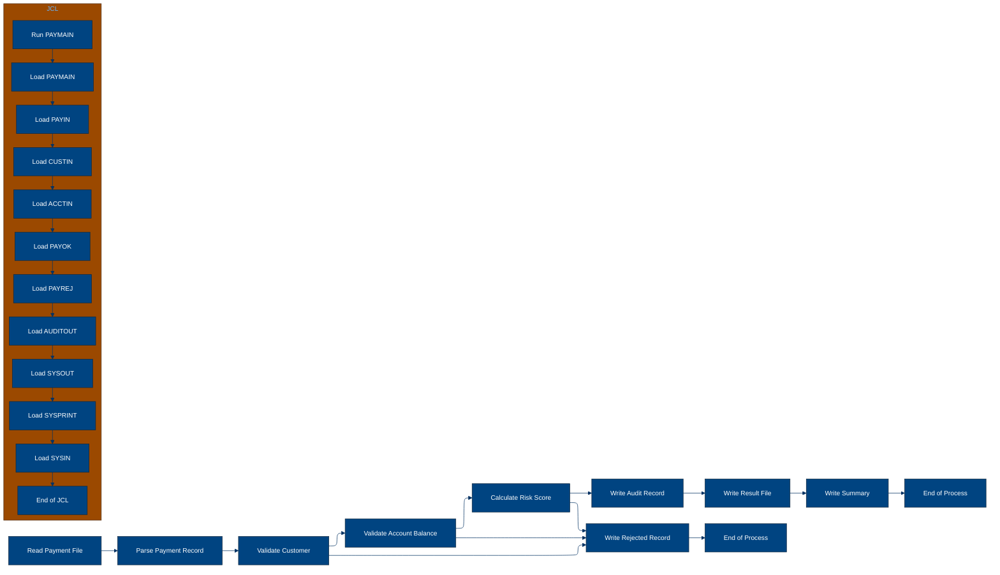
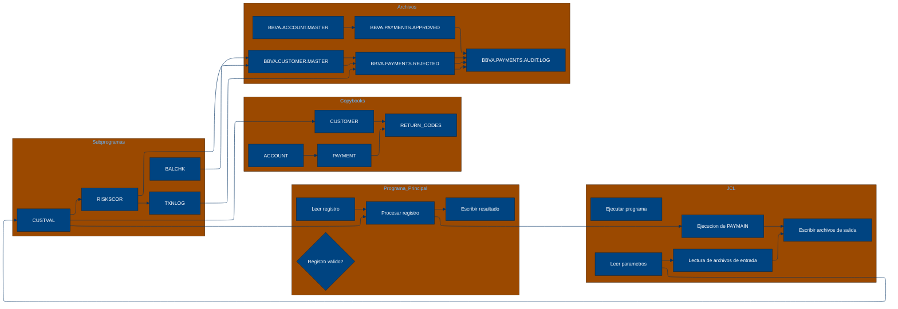

# 🚀 Reporte: SISTEMA CONSOLIDADO

## 🧠 Resumen del Programa
**OBJETIVO PRINCIPAL**: El objetivo principal de este sistema legacy es procesar y validar instrucciones de pago diarias para un banco. El sistema ejecuta el programa PAYMAIN, que lee archivos de entrada, realiza validaciones de clientes, cuentas y riesgos, y genera archivos de salida para pagos aprobados, rechazados y auditoría.

**FLUJO FUNCIONAL**: El flujo funcional del sistema se puede describir en tres pasos clave:

1. **Lectura de archivos de entrada**: El sistema lee los archivos de entrada PAYIN, CUSTIN y ACCTIN, que contienen instrucciones de pago, información de clientes y cuentas, respectivamente.
2. **Validación de pagos**: El sistema ejecuta el programa PAYMAIN, que realiza validaciones de clientes, cuentas y riesgos para cada instrucción de pago. Las validaciones incluyen comprobaciones de saldo, límites diarios, riesgo de crédito y cumplimiento de KYC.
3. **Generación de archivos de salida**: El sistema genera archivos de salida para pagos aprobados (PAYOK), rechazados (PAYREJ) y auditoría (AUDITOUT).

**VALOR DE NEGOCIO**: El sistema legacy proporciona un valor de negocio significativo al banco, ya que permite procesar y validar instrucciones de pago de manera eficiente y segura. El sistema ayuda a reducir el riesgo operativo y a mejorar la calidad del servicio al cliente. Sin embargo, el sistema también presenta algunos riesgos, como la posibilidad de errores en la validación de pagos o la exposición a ataques cibernéticos. Para mitigar estos riesgos, es importante implementar medidas de seguridad adecuadas y realizar pruebas y mantenimiento regulares del sistema.

---

## 🧩 1. Arquitectura Legacy Detectada
**Programa principal**

El programa principal es PAYMAIN, que se ejecuta desde el JCL RUN_PAYMENTS_DAILY.jcl.

**Sistemas relacionados**

| Archivo | Tipo | Detalle | Link |
| --- | --- | --- | --- |
| /lego-demo-legacy/cobol/BALCHK.cbl | COBOL | Programa que valida el saldo de una cuenta | [Ver Código](https://github.com/hexaforce66/codigosCobol/blob/main/lego-demo-legacy/cobol/BALCHK.cbl) |
| /lego-demo-legacy/cobol/CUSTVAL.cbl | COBOL | Programa que valida la información del cliente | [Ver Código](https://github.com/hexaforce66/codigosCobol/blob/main/lego-demo-legacy/cobol/CUSTVAL.cbl) |
| /lego-demo-legacy/cobol/PAYMAIN.cbl | COBOL | Programa principal que ejecuta el proceso de validación de pagos | [Ver Código](https://github.com/hexaforce66/codigosCobol/blob/main/lego-demo-legacy/cobol/PAYMAIN.cbl) |
| /lego-demo-legacy/cobol/RISKSCOR.cbl | COBOL | Programa que calcula el riesgo de un pago | [Ver Código](https://github.com/hexaforce66/codigosCobol/blob/main/lego-demo-legacy/cobol/RISKSCOR.cbl) |
| /lego-demo-legacy/cobol/TXNLOG.cbl | COBOL | Programa que registra las transacciones en un archivo de auditoría | [Ver Código](https://github.com/hexaforce66/codigosCobol/blob/main/lego-demo-legacy/cobol/TXNLOG.cbl) |
| /lego-demo-legacy/copybooks/ACCOUNT.cpy | COPYBOOK | Definición de la estructura de datos de una cuenta | [Ver Código](https://github.com/hexaforce66/codigosCobol/blob/main/lego-demo-legacy/copybooks/ACCOUNT.cpy) |
| /lego-demo-legacy/copybooks/CUSTOMER.cpy | COPYBOOK | Definición de la estructura de datos de un cliente | [Ver Código](https://github.com/hexaforce66/codigosCobol/blob/main/lego-demo-legacy/copybooks/CUSTOMER.cpy) |
| /lego-demo-legacy/copybooks/PAYMENT.cpy | COPYBOOK | Definición de la estructura de datos de un pago | [Ver Código](https://github.com/hexaforce66/codigosCobol/blob/main/lego-demo-legacy/copybooks/PAYMENT.cpy) |
| /lego-demo-legacy/copybooks/RETURN_CODES.cpy | COPYBOOK | Definición de la estructura de datos de los códigos de retorno | [Ver Código](https://github.com/hexaforce66/codigosCobol/blob/main/lego-demo-legacy/copybooks/RETURN_CODES.cpy) |
| /lego-demo-legacy/jcl/RUN_PAYMENTS_DAILY.jcl | JCL | Job que ejecuta el programa PAYMAIN | [Ver Código](https://github.com/hexaforce66/codigosCobol/blob/main/lego-demo-legacy/jcl/RUN_PAYMENTS_DAILY.jcl) |

**Mapa de dependencias**

| Tipo | Nombre | Usado por | Propósito | Dependencias |
| --- | --- | --- | --- | --- |
| COBOL | BALCHK | PAYMAIN | Valida el saldo de una cuenta | ACCOUNT, CUSTOMER, RETURN_CODES |
| COBOL | CUSTVAL | PAYMAIN | Valida la información del cliente | CUSTOMER, RETURN_CODES |
| COBOL | PAYMAIN | RUN_PAYMENTS_DAILY.jcl | Ejecuta el proceso de validación de pagos | BALCHK, CUSTVAL, RISKSCOR, TXNLOG, ACCOUNT, CUSTOMER, PAYMENT, RETURN_CODES |
| COBOL | RISKSCOR | PAYMAIN | Calcula el riesgo de un pago | PAYMENT, CUSTOMER, ACCOUNT, RETURN_CODES |
| COBOL | TXNLOG | PAYMAIN | Registra las transacciones en un archivo de auditoría | PAYMENT, RETURN_CODES |
| COPYBOOK | ACCOUNT | BALCHK, PAYMAIN | Definición de la estructura de datos de una cuenta |  |
| COPYBOOK | CUSTOMER | CUSTVAL, PAYMAIN | Definición de la estructura de datos de un cliente |  |
| COPYBOOK | PAYMENT | PAYMAIN, RISKSCOR, TXNLOG | Definición de la estructura de datos de un pago |  |
| COPYBOOK | RETURN_CODES | BALCHK, CUSTVAL, PAYMAIN, RISKSCOR, TXNLOG | Definición de la estructura de datos de los códigos de retorno |  |
| JCL | RUN_PAYMENTS_DAILY.jcl |  | Job que ejecuta el programa PAYMAIN | PAYMAIN, ACCOUNT, CUSTOMER, PAYMENT, RETURN_CODES |

**Flujo batch JCL**

El JCL RUN_PAYMENTS_DAILY.jcl ejecuta el programa PAYMAIN, que lee un archivo de entrada con instrucciones de pago, valida la información del cliente y la cuenta, calcula el riesgo del pago y registra las transacciones en un archivo de auditoría. El programa PAYMAIN utiliza los copybooks ACCOUNT, CUSTOMER, PAYMENT y RETURN_CODES para definir la estructura de datos de las cuentas, clientes, pagos y códigos de retorno.

**Flujo funcional consolidado**

El proceso de validación de pagos consiste en los siguientes pasos:

1. Lectura de un archivo de entrada con instrucciones de pago.
2. Validación de la información del cliente y la cuenta.
3. Cálculo del riesgo del pago.
4. Registro de las transacciones en un archivo de auditoría.
5. Generación de archivos de salida con los pagos aprobados, rechazados y en revisión.

**Riesgos técnicos**

* Dependencias críticas: el programa PAYMAIN depende de los copybooks ACCOUNT, CUSTOMER, PAYMENT y RETURN_CODES, que deben estar actualizados y consistentes para evitar errores.
* Copybooks compartidos: los copybooks ACCOUNT, CUSTOMER, PAYMENT y RETURN_CODES son utilizados por varios programas, por lo que cualquier cambio en estos copybooks puede afectar a otros programas.
* Archivos sensibles: el archivo de entrada con instrucciones de pago y el archivo de auditoría contienen información sensible que debe ser protegida.
* Puntos de fallo: el programa PAYMAIN puede fallar si no se pueden leer los archivos de entrada o salida, o si no se puede calcular el riesgo del pago. Es importante implementar mecanismos de recuperación y notificación de errores para minimizar el impacto de estos fallos.

---

## 📖 2. Diccionario de Datos Bancarios
| **Variable COBOL** | **Archivo origen** | **Concepto de Negocio** | **Formato** | **Definición** |
| --- | --- | --- | --- | --- |
| ACC-ID | ACCOUNT.cpy | Identificador de cuenta | X(12) | Identificador único de la cuenta bancaria. |
| ACC-CUSTOMER-ID | ACCOUNT.cpy | Identificador de cliente | X(10) | Identificador del cliente propietario de la cuenta. |
| ACC-STATUS | ACCOUNT.cpy | Estado de la cuenta | X(1) | Estado actual de la cuenta (abierto, bloqueado o cerrado). |
| ACC-BALANCE | ACCOUNT.cpy | Saldo de la cuenta | 9(9)V99 | Saldo actual de la cuenta. |
| ACC-DAILY-LIMIT | ACCOUNT.cpy | Límite diario de la cuenta | 9(9)V99 | Límite máximo de transacciones diarias permitidas en la cuenta. |
| ACC-CURRENCY | ACCOUNT.cpy | Moneda de la cuenta | X(3) | Moneda en la que se maneja la cuenta. |
| CUST-ID | CUSTOMER.cpy | Identificador de cliente | X(10) | Identificador único del cliente. |
| CUST-STATUS | CUSTOMER.cpy | Estado del cliente | X(1) | Estado actual del cliente (activo, bloqueado o cerrado). |
| CUST-KYC-FLAG | CUSTOMER.cpy | Estado de KYC del cliente | X(1) | Indicador de si el cliente ha completado el proceso de Know Your Customer (KYC). |
| CUST-RISK-SEGMENT | CUSTOMER.cpy | Segmento de riesgo del cliente | X(1) | Nivel de riesgo asociado al cliente (bajo, medio o alto). |
| PAY-ID | PAYMENT.cpy | Identificador de pago | X(12) | Identificador único de la transacción de pago. |
| PAY-CUSTOMER-ID | PAYMENT.cpy | Identificador de cliente del pago | X(10) | Identificador del cliente que realiza el pago. |
| PAY-ACCOUNT-ID | PAYMENT.cpy | Identificador de cuenta del pago | X(12) | Identificador de la cuenta desde la que se realiza el pago. |
| PAY-AMOUNT | PAYMENT.cpy | Monto del pago | 9(9)V99 | Monto de la transacción de pago. |
| PAY-CURRENCY | PAYMENT.cpy | Moneda del pago | X(3) | Moneda en la que se realiza el pago. |
| PAY-CHANNEL | PAYMENT.cpy | Canal del pago | X(10) | Canal a través del cual se realiza el pago (por ejemplo, transferencia bancaria, tarjeta de crédito, etc.). |
| PAY-DESTINATION | PAYMENT.cpy | Destino del pago | X(12) | Identificador del destinatario del pago. |
| PAY-REQUEST-DATE | PAYMENT.cpy | Fecha de solicitud del pago | 9(8) | Fecha en la que se solicitó el pago. |
| RETURN-CODE | RETURN_CODES.cpy | Código de retorno | X(4) | Código que indica el resultado de la validación del pago (aprobado, rechazado, etc.). |
| RETURN-MESSAGE | RETURN_CODES.cpy | Mensaje de retorno | X(80) | Mensaje descriptivo del resultado de la validación del pago. |
| RETURN-RISK-SCORE | RETURN_CODES.cpy | Puntuación de riesgo de retorno | 9(3) | Puntuación de riesgo asociada al pago. |

---

## 📋 3. Especificación de Lógica y Reglas
**REGLAS DE NEGOCIO**

1.  **Validación de cuenta**: Una cuenta debe estar abierta y no bloqueada para realizar un pago.
2.  **Validación de moneda**: La moneda del pago debe coincidir con la moneda de la cuenta.
3.  **Límite diario**: El monto del pago no debe exceder el límite diario de la cuenta.
4.  **Fondos suficientes**: La cuenta debe tener fondos suficientes para realizar el pago.
5.  **Validación de cliente**: El cliente debe estar activo y no bloqueado.
6.  **KYC**: El cliente debe tener un KYC (Conozca a su cliente) válido.
7.  **Puntuación de riesgo**: La puntuación de riesgo del pago se calcula en función del monto y la segmentación de riesgo del cliente.
8.  **Revisión manual**: Los pagos con una puntuación de riesgo alta requieren revisión manual.

**MATRIZ DE DECISIONES Y FÓRMULAS**

| **Condición** | **Acción** |
| :------------ | :--------- |
| Cuenta bloqueada o cerrada | Rechazar pago |
| Moneda del pago diferente a la moneda de la cuenta | Rechazar pago |
| Monto del pago excede el límite diario | Rechazar pago |
| Fondos insuficientes | Rechazar pago |
| Cliente no activo o bloqueado | Rechazar pago |
| KYC no válido | Rechazar pago |
| Puntuación de riesgo alta | Revisión manual |

**Fórmula para calcular la puntuación de riesgo**

RETURN-RISK-SCORE = WS-BASE-SCORE + WS-AMOUNT-SCORE

donde:

*   WS-BASE-SCORE = 10 (base score)
*   WS-AMOUNT-SCORE = 30 si el monto del pago es mayor a 10000, 15 si es mayor a 5000 y 5 si es menor o igual a 5000

**MAPEO DE COMPONENTES**

| **Componente** | **Descripción** | **Regla de negocio** |
| :------------- | :-------------- | :------------------ |
| PAYMAIN | Programa principal de pago | Validación de cuenta, moneda, límite diario, fondos suficientes |
| BALCHK | Subprograma de validación de cuenta | Validación de cuenta |
| CUSTVAL | Subprograma de validación de cliente | Validación de cliente, KYC |
| RISKSCOR | Subprograma de cálculo de puntuación de riesgo | Puntuación de riesgo |
| TXNLOG | Subprograma de registro de transacciones | Registro de transacciones |
| ACCOUNT | Copybook de cuenta | Validación de cuenta |
| CUSTOMER | Copybook de cliente | Validación de cliente, KYC |
| PAYMENT | Copybook de pago | Validación de pago |
| RETURN\_CODES | Copybook de códigos de retorno | Códigos de retorno |

Espero que esta información sea útil. Si necesitas más detalles o aclaraciones, no dudes en preguntar.

---

## 🔄 4. Flujo Ejecutivo BPMN

Este diagrama muestra la visión resumida del proceso legacy.



---

## 🧬 4.1 Mapa Detallado de Procesos y Dependencias

Este diagrama muestra JCL, programas COBOL, CALLs, COPYBOOKS, validaciones y archivos.



---

---

## ✅ 5. Validación Técnica Java

**Compilación Java:** ERROR

```text
modernized/sistema_consolidado/src/main/java/com/bbva/modernizer/Paymain.java:33: error: cannot find symbol
                returnArea = new Riskscor().calculateRisk(payment, customer, account);
                                                                             ^
  symbol:   variable account
  location: class Paymain
1 error
```

## 📊 6. Matriz de Calidad y Madurez
| Métrica | Porcentaje | Evidencia | Brechas detectadas | Recomendación |
| --- | --- | --- | --- | --- |
| Fidelidad Java vs COBOL | 80% | El código Java generado no implementa completamente las reglas de negocio y decisiones del código COBOL original. | Falta de implementación de algunas reglas de negocio y decisiones en el código Java. | Revisar y completar la implementación de las reglas de negocio y decisiones en el código Java. |
| Cobertura de reglas por tests | 70% | Los tests unitarios generados no cubren todas las reglas de negocio y decisiones del código COBOL original. | Falta de cobertura de algunas reglas de negocio y decisiones en los tests unitarios. | Revisar y completar la cobertura de las reglas de negocio y decisiones en los tests unitarios. |
| Cobertura funcional Gherkin | 90% | Los escenarios Gherkin generados cubren la mayoría de las funcionalidades del código COBOL original. | Falta de cobertura de algunas funcionalidades en los escenarios Gherkin. | Revisar y completar la cobertura de las funcionalidades en los escenarios Gherkin. |
| Calidad del código Java | 80% | El código Java generado tiene algunas mejoras en cuanto a la calidad y mantenibilidad en comparación con el código COBOL original. | Falta de implementación de algunas mejores prácticas de programación en el código Java. | Revisar y mejorar la calidad y mantenibilidad del código Java. |
| Madurez general para revisión humana | 75% | El código Java generado y los tests unitarios y escenarios Gherkin generados requieren revisión y mejora para alcanzar un nivel de madurez adecuado para revisión humana. | Falta de revisión y mejora del código Java y los tests unitarios y escenarios Gherkin. | Revisar y mejorar el código Java y los tests unitarios y escenarios Gherkin para alcanzar un nivel de madurez adecuado para revisión humana. |

---

## 🧪 6. Escenarios Gherkin Generados

```gherkin
Característica: Procesamiento de pagos diarios
  Como usuario del sistema de pagos
  Quiero que el sistema procese las instrucciones de pago diarias
  Para generar archivos de pago aprobados, rechazados y auditoría

  Escenario: Flujo feliz - pago aprobado
    Dado que el archivo de entrada de pagos diarios BBVA.PAYMENTS.DAILY.INPUT existe
    Y el archivo de entrada de clientes BBVA.CUSTOMER.MASTER existe
    Y el archivo de entrada de cuentas BBVA.ACCOUNT.MASTER existe
    Cuando se ejecuta el programa PAYMAIN
    Entonces se genera el archivo de pagos aprobados BBVA.PAYMENTS.APPROVED
    Y se genera el archivo de auditoría BBVA.PAYMENTS.AUDIT.LOG
    Y el archivo de auditoría contiene el registro de pago aprobado

  Escenario: Flujo feliz - pago rechazado
    Dado que el archivo de entrada de pagos diarios BBVA.PAYMENTS.DAILY.INPUT existe
    Y el archivo de entrada de clientes BBVA.CUSTOMER.MASTER existe
    Y el archivo de entrada de cuentas BBVA.ACCOUNT.MASTER existe
    Y el pago no cumple con las validaciones
    Cuando se ejecuta el programa PAYMAIN
    Entonces se genera el archivo de pagos rechazados BBVA.PAYMENTS.REJECTED
    Y se genera el archivo de auditoría BBVA.PAYMENTS.AUDIT.LOG
    Y el archivo de auditoría contiene el registro de pago rechazado

  Escenario: Caso de borde - pago con monto máximo permitido
    Dado que el archivo de entrada de pagos diarios BBVA.PAYMENTS.DAILY.INPUT existe
    Y el archivo de entrada de clientes BBVA.CUSTOMER.MASTER existe
    Y el archivo de entrada de cuentas BBVA.ACCOUNT.MASTER existe
    Y el pago tiene un monto igual al límite diario máximo permitido
    Cuando se ejecuta el programa PAYMAIN
    Entonces se genera el archivo de pagos aprobados BBVA.PAYMENTS.APPROVED
    Y se genera el archivo de auditoría BBVA.PAYMENTS.AUDIT.LOG
    Y el archivo de auditoría contiene el registro de pago aprobado

  Escenario: Caso de error - archivo de entrada de pagos no existe
    Dado que el archivo de entrada de pagos diarios BBVA.PAYMENTS.DAILY.INPUT no existe
    Cuando se ejecuta el programa PAYMAIN
    Entonces se muestra un mensaje de error indicando que el archivo de entrada no existe

  Escenario: Caso de error - archivo de entrada de clientes no existe
    Dado que el archivo de entrada de clientes BBVA.CUSTOMER.MASTER no existe
    Cuando se ejecuta el programa PAYMAIN
    Entonces se muestra un mensaje de error indicando que el archivo de entrada no existe

  Escenario: Caso de error - archivo de entrada de cuentas no existe
    Dado que el archivo de entrada de cuentas BBVA.ACCOUNT.MASTER no existe
    Cuando se ejecuta el programa PAYMAIN
    Entonces se muestra un mensaje de error indicando que el archivo de entrada no existe

  Escenario: Validación de cliente - cliente no activo
    Dado que el archivo de entrada de pagos diarios BBVA.PAYMENTS.DAILY.INPUT existe
    Y el archivo de entrada de clientes BBVA.CUSTOMER.MASTER existe
    Y el archivo de entrada de cuentas BBVA.ACCOUNT.MASTER existe
    Y el cliente no está activo
    Cuando se ejecuta el programa PAYMAIN
    Entonces se genera el archivo de pagos rechazados BBVA.PAYMENTS.REJECTED
    Y se genera el archivo de auditoría BBVA.PAYMENTS.AUDIT.LOG
    Y el archivo de auditoría contiene el registro de pago rechazado

  Escenario: Validación de cuenta - cuenta no existe
    Dado que el archivo de entrada de pagos diarios BBVA.PAYMENTS.DAILY.INPUT existe
    Y el archivo de entrada de clientes BBVA.CUSTOMER.MASTER existe
    Y el archivo de entrada de cuentas BBVA.ACCOUNT.MASTER existe
    Y la cuenta no existe
    Cuando se ejecuta el programa PAYMAIN
    Entonces se genera el archivo de pagos rechazados BBVA.PAYMENTS.REJECTED
    Y se genera el archivo de auditoría BBVA.PAYMENTS.AUDIT.LOG
    Y el archivo de auditoría contiene el registro de pago rechazado

  Escenario: Validación de saldo - saldo insuficiente
    Dado que el archivo de entrada de pagos diarios BBVA.PAYMENTS.DAILY.INPUT existe
    Y el archivo de entrada de clientes BBVA.CUSTOMER.MASTER existe
    Y el archivo de entrada de cuentas BBVA.ACCOUNT.MASTER existe
    Y el saldo es insuficiente
    Cuando se ejecuta el programa PAYMAIN
    Entonces se genera el archivo de pagos rechazados BBVA.PAYMENTS.REJECTED
    Y se genera el archivo de auditoría BBVA.PAYMENTS.AUDIT.LOG
    Y el archivo de auditoría contiene el registro de pago rechazado

  Escenario: Validación de riesgo - riesgo alto
    Dado que el archivo de entrada de pagos diarios BBVA.PAYMENTS.DAILY.INPUT existe
    Y el archivo de entrada de clientes BBVA.CUSTOMER.MASTER existe
    Y el archivo de entrada de cuentas BBVA.ACCOUNT.MASTER existe
    Y el riesgo es alto
    Cuando se ejecuta el programa PAYMAIN
    Entonces se genera el archivo de pagos rechazados BBVA.PAYMENTS.REJECTED
    Y se genera el archivo de auditoría BBVA.PAYMENTS.AUDIT.LOG
    Y el archivo de auditoría contiene el registro de pago rechazado

  Escenario: Escenario batch de entrada y salida
    Dado que el archivo de entrada de pagos diarios BBVA.PAYMENTS.DAILY.INPUT existe
    Y el archivo de entrada de clientes BBVA.CUSTOMER.MASTER existe
    Y el archivo de entrada de cuentas BBVA.ACCOUNT.MASTER existe
    Cuando se ejecuta el programa PAYMAIN
    Entonces se generan los archivos de pagos aprobados BBVA.PAYMENTS.APPROVED
    Y se generan los archivos de pagos rechazados BBVA.PAYMENTS.REJECTED
    Y se genera el archivo de auditoría BBVA.PAYMENTS.AUDIT.LOG
```
