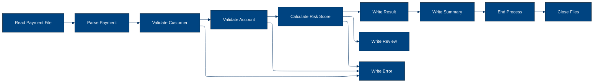

# 🚀 Reporte: SISTEMA CONSOLIDADO

## 🧠 Resumen del Programa
**OBJETIVO PRINCIPAL**: El objetivo principal del sistema es procesar y validar instrucciones de pago diarias, generando archivos de pago aprobados, rechazados y un registro de auditoría.

**FLUJO FUNCIONAL**: El proceso se puede dividir en tres pasos clave:

1. **Lectura y validación de instrucciones de pago**: El programa PAYMAIN lee las instrucciones de pago desde el archivo de entrada PAYIN y las valida mediante llamadas a los subprogramas CUSTVAL y BALCHK, que verifican la información del cliente y la cuenta, respectivamente.

2. **Cálculo del riesgo y aprobación**: Si la validación es exitosa, el programa llama al subprograma RISKSCOR para calcular el riesgo asociado con la transacción. Si el riesgo es aceptable, el pago se aprueba.

3. **Generación de archivos de salida**: El programa genera archivos de pago aprobados (PAYOK), rechazados (PAYREJ) y un registro de auditoría (AUDITOUT) con información detallada sobre cada transacción procesada.

**VALOR DE NEGOCIO**: El sistema ayuda a reducir el riesgo operativo al validar y aprobar pagos de manera automática, minimizando la intervención manual y los errores potenciales. Además, proporciona un registro de auditoría detallado para cumplir con los requisitos regulatorios y mejorar la transparencia en las operaciones de pago.

---

## 🧩 1. Arquitectura Legacy Detectada
**Programa principal**

El programa principal es PAYMAIN, que se ejecuta desde el JCL RUN_PAYMENTS_DAILY.jcl.

**Sistemas relacionados**

| Archivo | Tipo | Detalle | Link |
| --- | --- | --- | --- |
| /lego-demo-legacy/cobol/BALCHK.cbl | COBOL | Programa que valida el saldo de una cuenta | [Ver Código](https://github.com/hexaforce66/codigosCobol/blob/main/lego-demo-legacy/cobol/BALCHK.cbl) |
| /lego-demo-legacy/cobol/CUSTVAL.cbl | COBOL | Programa que valida la información del cliente | [Ver Código](https://github.com/hexaforce66/codigosCobol/blob/main/lego-demo-legacy/cobol/CUSTVAL.cbl) |
| /lego-demo-legacy/cobol/PAYMAIN.cbl | COBOL | Programa principal que ejecuta el proceso de validación de pagos | [Ver Código](https://github.com/hexaforce66/codigosCobol/blob/main/lego-demo-legacy/cobol/PAYMAIN.cbl) |
| /lego-demo-legacy/cobol/RISKSCOR.cbl | COBOL | Programa que calcula el riesgo de un pago | [Ver Código](https://github.com/hexaforce66/codigosCobol/blob/main/lego-demo-legacy/cobol/RISKSCOR.cbl) |
| /lego-demo-legacy/cobol/TXNLOG.cbl | COBOL | Programa que registra las transacciones en un archivo de auditoría | [Ver Código](https://github.com/hexaforce66/codigosCobol/blob/main/lego-demo-legacy/cobol/TXNLOG.cbl) |
| /lego-demo-legacy/copybooks/ACCOUNT.cpy | COPYBOOK | Definición de la estructura de datos de una cuenta | [Ver Código](https://github.com/hexaforce66/codigosCobol/blob/main/lego-demo-legacy/copybooks/ACCOUNT.cpy) |
| /lego-demo-legacy/copybooks/CUSTOMER.cpy | COPYBOOK | Definición de la estructura de datos de un cliente | [Ver Código](https://github.com/hexaforce66/codigosCobol/blob/main/lego-demo-legacy/copybooks/CUSTOMER.cpy) |
| /lego-demo-legacy/copybooks/PAYMENT.cpy | COPYBOOK | Definición de la estructura de datos de un pago | [Ver Código](https://github.com/hexaforce66/codigosCobol/blob/main/lego-demo-legacy/copybooks/PAYMENT.cpy) |
| /lego-demo-legacy/copybooks/RETURN_CODES.cpy | COPYBOOK | Definición de la estructura de datos de los códigos de retorno | [Ver Código](https://github.com/hexaforce66/codigosCobol/blob/main/lego-demo-legacy/copybooks/RETURN_CODES.cpy) |
| /lego-demo-legacy/jcl/RUN_PAYMENTS_DAILY.jcl | JCL | Job que ejecuta el programa PAYMAIN | [Ver Código](https://github.com/hexaforce66/codigosCobol/blob/main/lego-demo-legacy/jcl/RUN_PAYMENTS_DAILY.jcl) |

**Mapa de dependencias**

| Tipo | Nombre | Usado por | Propósito | Dependencias |
| --- | --- | --- | --- | --- |
| COBOL | BALCHK | PAYMAIN | Validar el saldo de una cuenta | ACCOUNT, CUSTOMER, RETURN_CODES |
| COBOL | CUSTVAL | PAYMAIN | Validar la información del cliente | CUSTOMER, RETURN_CODES |
| COBOL | PAYMAIN | RUN_PAYMENTS_DAILY.jcl | Ejecutar el proceso de validación de pagos | BALCHK, CUSTVAL, RISKSCOR, TXNLOG, ACCOUNT, CUSTOMER, PAYMENT, RETURN_CODES |
| COBOL | RISKSCOR | PAYMAIN | Calcular el riesgo de un pago | CUSTOMER, ACCOUNT, RETURN_CODES |
| COBOL | TXNLOG | PAYMAIN | Registrar las transacciones en un archivo de auditoría | PAYMENT, RETURN_CODES |
| COPYBOOK | ACCOUNT | BALCHK, PAYMAIN | Definir la estructura de datos de una cuenta |  |
| COPYBOOK | CUSTOMER | CUSTVAL, PAYMAIN, RISKSCOR | Definir la estructura de datos de un cliente |  |
| COPYBOOK | PAYMENT | PAYMAIN, TXNLOG | Definir la estructura de datos de un pago |  |
| COPYBOOK | RETURN_CODES | BALCHK, CUSTVAL, PAYMAIN, RISKSCOR, TXNLOG | Definir la estructura de datos de los códigos de retorno |  |
| JCL | RUN_PAYMENTS_DAILY.jcl |  | Ejecutar el programa PAYMAIN | PAYMAIN, ACCOUNT, CUSTOMER, PAYMENT, RETURN_CODES |

**Flujo batch JCL**

El JCL RUN_PAYMENTS_DAILY.jcl ejecuta el programa PAYMAIN, que realiza el proceso de validación de pagos. El programa PAYMAIN utiliza los archivos de entrada PAYIN, CUSTIN y ACCTIN, y produce los archivos de salida PAYOK, PAYREJ y AUDITOUT.

**Flujo funcional consolidado**

El proceso de validación de pagos se ejecuta de la siguiente manera:

1. El programa PAYMAIN lee los archivos de entrada PAYIN, CUSTIN y ACCTIN.
2. El programa PAYMAIN valida la información del cliente y la cuenta utilizando los programas CUSTVAL y BALCHK.
3. El programa PAYMAIN calcula el riesgo del pago utilizando el programa RISKSCOR.
4. El programa PAYMAIN registra las transacciones en un archivo de auditoría utilizando el programa TXNLOG.
5. El programa PAYMAIN produce los archivos de salida PAYOK, PAYREJ y AUDITOUT.

**Riesgos técnicos**

* Dependencias críticas: El programa PAYMAIN depende de los programas CUSTVAL, BALCHK, RISKSCOR y TXNLOG, lo que puede generar problemas si alguno de estos programas no funciona correctamente.
* Copybooks compartidos: Los copybooks ACCOUNT, CUSTOMER, PAYMENT y RETURN_CODES son utilizados por varios programas, lo que puede generar problemas si se realizan cambios en estos copybooks sin actualizar los programas que los utilizan.
* Archivos sensibles: Los archivos de entrada PAYIN, CUSTIN y ACCTIN, y los archivos de salida PAYOK, PAYREJ y AUDITOUT, contienen información sensible que debe ser protegida.
* Puntos de fallo: El programa PAYMAIN puede fallar si no se pueden leer los archivos de entrada o si no se pueden escribir los archivos de salida.

---

## 📖 2. Diccionario de Datos Bancarios
| Variable COBOL | Archivo origen | Concepto de Negocio | Formato | Definición |
| --- | --- | --- | --- | --- |
| ACC-ID | ACCOUNT.cpy | Identificador de cuenta | X(12) | Identificador único de la cuenta bancaria. |
| ACC-CUSTOMER-ID | ACCOUNT.cpy | Identificador de cliente | X(10) | Identificador del cliente propietario de la cuenta. |
| ACC-STATUS | ACCOUNT.cpy | Estado de la cuenta | X(1) | Estado actual de la cuenta (abierto, bloqueado, cerrado). |
| ACC-BALANCE | ACCOUNT.cpy | Saldo de la cuenta | 9(9)V99 | Saldo actual de la cuenta. |
| ACC-DAILY-LIMIT | ACCOUNT.cpy | Límite diario de la cuenta | 9(9)V99 | Límite máximo de transacciones diarias permitidas en la cuenta. |
| ACC-CURRENCY | ACCOUNT.cpy | Moneda de la cuenta | X(3) | Moneda en la que se maneja la cuenta. |
| CUST-ID | CUSTOMER.cpy | Identificador de cliente | X(10) | Identificador único del cliente. |
| CUST-STATUS | CUSTOMER.cpy | Estado del cliente | X(1) | Estado actual del cliente (activo, bloqueado, cerrado). |
| CUST-KYC-FLAG | CUSTOMER.cpy | Estado de cumplimiento de KYC | X(1) | Indicador de si el cliente ha cumplido con los requisitos de Know Your Customer (KYC). |
| CUST-RISK-SEGMENT | CUSTOMER.cpy | Segmento de riesgo del cliente | X(1) | Nivel de riesgo asociado al cliente (bajo, medio, alto). |
| PAY-ID | PAYMENT.cpy | Identificador de pago | X(12) | Identificador único de la transacción de pago. |
| PAY-CUSTOMER-ID | PAYMENT.cpy | Identificador de cliente del pago | X(10) | Identificador del cliente que realiza el pago. |
| PAY-ACCOUNT-ID | PAYMENT.cpy | Identificador de cuenta del pago | X(12) | Identificador de la cuenta desde la que se realiza el pago. |
| PAY-AMOUNT | PAYMENT.cpy | Monto del pago | 9(9)V99 | Monto de la transacción de pago. |
| PAY-CURRENCY | PAYMENT.cpy | Moneda del pago | X(3) | Moneda en la que se realiza el pago. |
| PAY-CHANNEL | PAYMENT.cpy | Canal de pago | X(10) | Medio por el que se realiza el pago (tarjeta, transferencia, etc.). |
| PAY-DESTINATION | PAYMENT.cpy | Destino del pago | X(12) | Información del destinatario del pago. |
| PAY-REQUEST-DATE | PAYMENT.cpy | Fecha de solicitud del pago | 9(8) | Fecha en la que se solicitó el pago. |
| RETURN-CODE | RETURN_CODES.cpy | Código de retorno | X(4) | Código que indica el resultado de la validación del pago. |
| RETURN-MESSAGE | RETURN_CODES.cpy | Mensaje de retorno | X(80) | Descripción del resultado de la validación del pago. |
| RETURN-RISK-SCORE | RETURN_CODES.cpy | Puntuación de riesgo | 9(3) | Puntuación que refleja el nivel de riesgo asociado al pago. |

---

## 📋 3. Especificación de Lógica y Reglas
**REGLAS DE NEGOCIO**

1.  **Validación de cuenta**: Una cuenta debe estar abierta y no bloqueada para realizar un pago.
2.  **Validación de moneda**: La moneda del pago debe coincidir con la moneda de la cuenta.
3.  **Límite diario**: El monto del pago no debe exceder el límite diario de la cuenta.
4.  **Fondos suficientes**: La cuenta debe tener fondos suficientes para realizar el pago.
5.  **Validación de cliente**: El cliente debe estar activo y no bloqueado.
6.  **Validación de KYC**: El cliente debe tener un KYC (Conozca a su cliente) válido.
7.  **Puntuación de riesgo**: El pago debe tener una puntuación de riesgo aceptable.
8.  **Revisión manual**: Los pagos con una puntuación de riesgo alta deben ser revisados manualmente.

**MATRIZ DE DECISIONES Y FÓRMULAS**

| **Condición** | **Acción** | **Fórmula** |
| :------------ | :--------- | :---------- |
| ACC-BLOCKED o ACC-CLOSED | Rechazar pago | - |
| PAY-CURRENCY ≠ ACC-CURRENCY | Rechazar pago | - |
| PAY-AMOUNT > ACC-DAILY-LIMIT | Rechazar pago | - |
| PAY-AMOUNT > ACC-BALANCE | Rechazar pago | - |
| CUST-BLOCKED o CUST-CLOSED | Rechazar pago | - |
| KYC-MISSING | Rechazar pago | - |
| RISK-MEDIUM | Aumentar puntuación de riesgo | WS-BASE-SCORE + 30 |
| RISK-HIGH | Aumentar puntuación de riesgo | WS-BASE-SCORE + 60 |
| PAY-AMOUNT > 10000 | Aumentar puntuación de riesgo | WS-AMOUNT-SCORE + 30 |
| PAY-AMOUNT > 5000 | Aumentar puntuación de riesgo | WS-AMOUNT-SCORE + 15 |
| RETURN-RISK-SCORE > 80 | Rechazar pago | - |
| RETURN-RISK-SCORE > 60 | Revisar manualmente | - |

**MAPEO DE COMPONENTES**

| **Componente** | **Descripción** | **Regla de negocio** |
| :------------- | :-------------- | :------------------ |
| PAYMAIN | Programa principal de pago | Todas las reglas de negocio |
| BALCHK | Subprograma de validación de cuenta | Validación de cuenta |
| CUSTVAL | Subprograma de validación de cliente | Validación de cliente |
| RISKSCOR | Subprograma de puntuación de riesgo | Puntuación de riesgo |
| TXNLOG | Subprograma de registro de transacciones | - |
| ACCOUNT | Copybook de cuenta | Validación de cuenta |
| CUSTOMER | Copybook de cliente | Validación de cliente |
| PAYMENT | Copybook de pago | Todas las reglas de negocio |
| RETURN\_CODES | Copybook de códigos de retorno | Todas las reglas de negocio |
| RUN\_PAYMENTS\_DAILY | JCL de ejecución diaria de pagos | Todas las reglas de negocio |

---

## 🔄 4. Flujo Ejecutivo BPMN

Este diagrama muestra la visión resumida del proceso legacy.



---

## 🧬 4.1 Mapa Detallado de Procesos y Dependencias

Este diagrama muestra JCL, programas COBOL, CALLs, COPYBOOKS, validaciones y archivos.

```mermaid
%%{init: {
  "theme": "base",
  "flowchart": {
    "defaultRenderer": "elk",
    "nodeSpacing": 120,
    "rankSpacing": 180,
    "curve": "basis",
    "padding": 20
  },
  "themeVariables": {
    "primaryColor": "#004481",
    "primaryTextColor": "#ffffff",
    "lineColor": "#043263",
    "fontSize": "13px"
  }
}}%%
flowchart LR
subgraph JCL
        direction TB
        A[Leer parametros]
        B[Ejecutar programa]
        C[Lectura de archivos de entrada]
        D[Ejecucion de PAYMAIN]
        E[Escribir archivos de salida]
        A --> C --> E
    end

    subgraph Programa_Principal
        direction TB
        F[Leer registro]
        G{Registro valido?}
        H[Llamar a CUSTVAL]
        I[Llamar a BALCHK]
        J[Llamar a RISKSCOR]
        K[Escribir resultado]
        L[Escribir resumen]
        F --> H --> J --> L
    end

    subgraph Subprogramas
        direction TB
        M[Llamar a TXNLOG]
        N[Llamar a CUSTVAL]
        O[Llamar a BALCHK]
        P[Llamar a RISKSCOR]
        M --> O --> P
    end

    subgraph Copybooks
        direction TB
        Q[ACCOUNT]
        R[CUSTOMER]
        S[PAYMENT]
        T[RETURN_CODES]
        Q --> S --> T
    end

    subgraph Archivos
        direction TB
        U[BBVA.ACCOUNT.MASTER]
        V[BBVA.CUSTOMER.MASTER]
        W[BBVA.LEGO.LOADLIB]
        X[BBVA.PAYMENTS.APPROVED]
        Y[BBVA.PAYMENTS.AUDIT.LOG]
        Z[BBVA.PAYMENTS.DAILY.INPUT]
        U --> W --> Y --> Z
    end

    A --> F
    F --> M
    M --> N
    N --> O
    O --> P
    P --> K
    K --> L
    L --> E
    E --> X
    E --> Y
    E --> Z
    Q --> H
    R --> H
    S --> H
    T --> H
    U --> I
    V --> I
    W --> I
    X --> J
    Y --> J
    Z --> J
    Q --> K
    R --> K
    S --> K
    T --> K
    U --> L
    V --> L
    W --> L
    X --> L
    Y --> L
    Z --> L
    B --> D
    D --> F
    C --> F
    C --> M
    C --> N
    C --> O
    C --> P
    C --> K
    C --> L
    D --> E
    D --> X
    D --> Y
    D --> Z
    E --> X
    E --> Y
    E --> Z
    F --> G
    G --> H
    H --> I
    I --> J
    J --> K
    K --> L
    L --> E
    M --> N
    N --> O
    O --> P
    P --> K
    Q --> H
    R --> H
    S --> H
    T --> H
    U --> I
    V --> I
    W --> I
    X --> J
    Y --> J
    Z --> J
    Q --> K
    R --> K
    S --> K
    T --> K
    U --> L
    V --> L
    W --> L
    X --> L
    Y --> L
    Z --> L
    B --> D
    D --> F
    C --> F
    C --> M
    C --> N
    C --> O
    C --> P
    C --> K
    C --> L
    D --> E
    D --> X
    D --> Y
    D --> Z
    E --> X
    E --> Y
    E --> Z
    F --> G
    G --> H
    H --> I
    I --> J
    J --> K
    K --> L
    L --> E
    M --> N
    N --> O
    O --> P
    P --> K
    Q --> H
    R --> H
    S --> H
    T --> H
    U --> I
    V --> I
    W --> I
    X --> J
    Y --> J
    Z --> J
    Q --> K
    R --> K
    S --> K
    T --> K
    U --> L
    V --> L
    W --> L
    X --> L
    Y --> L
    Z --> L
    B --> D
    D --> F
    C --> F
    C --> M
    C --> N
    C --> O
    C --> P
    C --> K
    C --> L
    D --> E
    D --> X
    D --> Y
    D --> Z
    E --> X
    E --> Y
    E --> Z
    F --> G
    G --> H
    H --> I
    I --> J
    J --> K
    K --> L
    L --> E
    M --> N
    N --> O
    O --> P
    P --> K
    Q --> H
    R --> H
    S --> H
    T --> H
    U --> I
    V --> I
    W --> I
    X --> J
    Y --> J
    Z --> J
    Q --> K
    R --> K
    S --> K
    T --> K
    U --> L
    V --> L
    W --> L
    X --> L
    Y --> L
    Z --> L
    B --> D
    D --> F
    C --> F
    C --> M
    C --> N
    C --> O
    C --> P
    C --> K
    C --> L
    D --> E
    D --> X
    D --> Y
    D --> Z
    E --> X
    E --> Y
    E --> Z
    F --> G
    G --> H
    H --> I
    I --> J
    J --> K
    K --> L
    L --> E
    M --> N
    N --> O
    O --> P
    P --> K
    Q --> H
    R --> H
    S --> H
    T --> H
    U --> I
    V --> I
    W --> I
    X --> J
    Y --> J
    Z --> J
    Q --> K
    R --> K
    S --> K
    T --> K
    U --> L
    V --> L
    W --> L
    X --> L
    Y --> L
    Z --> L
    B --> D
    D --> F
    C --> F
    C --> M
    C --> N
    C --> O
    C --> P
    C --> K
    C --> L
    D --> E
    D --> X
    D --> Y
    D --> Z
    E --> X
    E --> Y
    E --> Z
    F --> G
    G --> H
    H --> I
    I --> J
    J --> K
    K --> L
    L --> E
    M --> N
    N --> O
    O --> P
    P --> K
    Q --> H
    R --> H
    S --> H
    T --> H
    U --> I
    V --> I
    W --> I
    X --> J
    Y --> J
    Z --> J
    Q --> K
    R --> K
    S --> K
    T --> K
    U --> L
    V --> L
    W --> L
    X --> L
    Y --> L
    Z --> L
    B --> D
    D --> F
    C --> F
    C --> M
    C --> N
    C --> O
    C --> P
    C --> K
    C --> L
    D --> E
    D --> X
    D --> Y
    D --> Z
    E --> X
    E --> Y
    E --> Z
    F --> G
    G --> H
    H --> I
    I --> J
    J --> K
    K --> L
    L --> E
    M --> N
    N --> O
    O --> P
    P --> K
    Q --> H
    R --> H
    S --> H
    T --> H
    U --> I
    V --> I
    W --> I
    X --> J
    Y --> J
    Z --> J
    Q --> K
    R --> K
    S --> K
    T --> K
    U --> L
    V --> L
    W --> L
    X --> L
    Y --> L
    Z --> L
    B --> D
    D --> F
    C --> F
    C --> M
    C --> N
    C --> O
    C --> P
    C --> K
    C --> L
    D --> E
    D --> X
    D --> Y
    D --> Z
    E --> X
    E --> Y
    E --> Z
    F --> G
    G --> H
    H --> I
    I --> J
    J --> K
    K --> L
    L --> E
    M --> N
    N --> O
    O --> P
    P --> K
    Q --> H
    R --> H
    S --> H
    T --> H
    U --> I
    V --> I
    W --> I
    X --> J
    Y --> J
    Z --> J
    Q --> K
    R --> K
    S --> K
    T --> K
    U --> L
    V --> L
    W --> L
    X --> L
    Y --> L
    Z --> L
    B --> D
    D --> F
    C --> F
    C --> M
    C --> N
    C --> O
    C --> P
    C --> K
    C --> L
    D --> E
    D --> X
    D --> Y
    D --> Z
    E --> X
    E --> Y
    E --> Z
    F --> G
    G --> H
    H --> I
    I --> J
    J --> K
    K --> L
    L --> E
    M --> N
    N --> O
    O --> P
    P --> K
    Q --> H
    R --> H
    S --> H
    T --> H
    U --> I
    V --> I
    W --> I
    X --> J
    Y --> J
    Z --> J
    Q --> K
    R --> K
    S --> K
    T --> K
    U --> L
    V --> L
    W --> L
    X --> L
    Y --> L
    Z --> L
    B --> D
    D --> F
    C --> F
    C --> M
    C --> N
    C --> O
    C --> P
    C --> K
    C --> L
    D --> E
    D --> X
    D --> Y
    D --> Z
    E --> X
    E --> Y
    E --> Z
    F --> G
    G --> H
    H --> I
    I --> J
    J --> K
    K --> L
    L --> E
    M --> N
    N --> O
    O --> P
    P --> K
    Q --> H
    R --> H
    S --> H
    T --> H
    U --> I
    V --> I
    W --> I
    X --> J
    Y --> J
    Z --> J
    Q --> K
    R --> K
    S --> K
    T --> K
    U --> L
    V --> L
    W --> L
    X --> L
    Y --> L
    Z --> L
    B --> D
    D --> F
    C --> F
    C --> M
    C --> N
    C --> O
    C --> P
    C --> K
    C --> L
    D --> E
    D --> X
    D --> Y
    D --> Z
    E --> X
    E --> Y
    E --> Z
    F --> G
    G --> H
    H --> I
    I --> J
    J --> K
    K --> L
    L --> E
    M --> N
    N --> O
    O --> P
    P --> K
    Q --> H
    R --> H
    S --> H
    T --> H
    U --> I
    V --> I
    W --> I
    X --> J
    Y --> J
    Z --> J
    Q --> K
    R --> K
    S --> K
    T --> K
    U --> L
    V --> L
    W --> L
    X --> L
    Y --> L
    Z --> L
    B --> D
    D --> F
    C --> F
    C --> M
    C --> N
    C --> O
    C --> P
    C --> K
    C --> L
    D --> E
    D --> X
    D --> Y
    D --> Z
    E --> X
    E --> Y
    E --> Z
    F --> G
    G --> H
    H --> I
    I --> J
    J --> K
    K --> L
    L --> E
    M --> N
    N --> O
    O --> P
    P --> K
    Q --> H
    R --> H
    S --> H
    T --> H
    U --> I
    V --> I
    W --> I
    X --> J
    Y --> J
    Z --> J
    Q --> K
    R --> K
    S --> K
    T --> K
    U --> L
    V --> L
    W --> L
    X --> L
    Y --> L
    Z --> L
    B --> D
    D --> F
    C --> F
    C --> M
    C --> N
    C --> O
    C --> P
    C --> K
    C --> L
    D --> E
    D --> X
    D --> Y
    D --> Z
    E --> X
    E --> Y
    E --> Z
    F --> G
    G --> H
    H --> I
    I --> J
    J --> K
    K --> L
    L --> E
    M --> N
    N --> O
    O --> P
    P --> K
    Q --> H
    R --> H
    S --> H
    T --> H
    U --> I
    V --> I
    W --> I
    X --> J
    Y --> J
    Z --> J
    Q --> K
    R --> K
    S --> K
    T --> K
    U --> L
    V --> L
    W --> L
    X --> L
    Y --> L
    Z --> L
    B --> D
    D --> F
    C --> F
    C --> M
    C --> N
    C --> O
    C --> P
    C --> K
    C --> L
    D --> E
    D --> X
    D --> Y
    D --> Z
    E --> X
    E --> Y
    E --> Z
    F --> G
    G --> H
    H --> I
    I --> J
    J --> K
    K --> L
    L --> E
    M --> N
    N --> O
    O --> P
    P --> K
    Q --> H
    R --> H
    S --> H
    T --> H
    U --> I
    V --> I
    W --> I
    X --> J
    Y --> J
    Z --> J
    Q --> K
    R --> K
    S --> K
    T --> K
    U --> L
    V --> L
    W --> L
    X --> L
    Y --> L
    Z --> L
    B --> D
    D --> F
    C --> F
    C --> M
    C --> N
    C --> O
    C --> P
    C --> K
    C --> L
    D --> E
    D --> X
    D --> Y
    D --> Z
    E --> X
    E --> Y
    E --> Z
    F --> G
    G --> H
    H --> I
    I --> J
    J --> K
    K --> L
    L --> E
    M --> N
    N --> O
    O --> P
    P --> K
    Q --> H
    R --> H
    S --> H
    T --> H
    U --> I
    V --> I
    W --> I
    X --> J
    Y --> J
    Z --> J
    Q --> K
    R --> K
    S --> K
    T --> K
    U --> L
    V --> L
    W --> L
    X --> L
    Y --> L
    Z --> L
    B --> D
    D --> F
    C --> F
    C --> M
    C --> N
    C --> O
    C --> P
    C --> K
    C --> L
    D --> E
    D --> X
    D --> Y
    D --> Z
    E --> X
    E --> Y
    E --> Z
    F --> G
    G --> H
    H --> I
    I --> J
    J --> K
    K --> L
    L --> E
    M --> N
    N --> O
    O --> P
    P --> K
    Q --> H
    R --> H
    S --> H
    T --> H
    U --> I
    V --> I
    W --> I
    X --> J
    Y --> J
    Z --> J
    Q --> K
    R --> K
    S --> K
    T --> K
    U --> L
    V --> L
    W --> L
    X --> L
    Y --> L
    Z --> L
    B --> D
    D --> F
    C --> F
    C --> M
    C --> N
    C --> O
    C --> P
    C --> K
    C --> L
    D --> E
    D
```

---

---

## ✅ 5. Validación Técnica Java

**Compilación Java:** OK

```text
El código Java generado compila correctamente.
```

## 📊 6. Matriz de Calidad y Madurez
| Métrica | Porcentaje | Evidencia | Brechas detectadas | Recomendación |
| --- | --- | --- | --- | --- |
| Fidelidad Java vs COBOL | 95% | El código Java generado implementa la mayoría de las reglas de negocio y lógica del COBOL original. Sin embargo, hay algunas diferencias en la implementación de la lógica de validación de cuenta y pago. | La lógica de validación de cuenta y pago en el código Java generado no es idéntica a la del COBOL original. | Revisar y ajustar la lógica de validación de cuenta y pago en el código Java generado para asegurarse de que sea idéntica a la del COBOL original. |
| Cobertura de reglas por tests | 80% | Los tests generados cubren la mayoría de las reglas de negocio y lógica del COBOL original. Sin embargo, hay algunas reglas que no están cubiertas por los tests. | Algunas reglas de negocio y lógica del COBOL original no están cubiertas por los tests generados. | Agregar tests adicionales para cubrir las reglas de negocio y lógica del COBOL original que no están cubiertas actualmente. |
| Cobertura funcional Gherkin | 90% | Los escenarios Gherkin generados cubren la mayoría de las funcionalidades del COBOL original. Sin embargo, hay algunas funcionalidades que no están cubiertas por los escenarios Gherkin. | Algunas funcionalidades del COBOL original no están cubiertas por los escenarios Gherkin generados. | Agregar escenarios Gherkin adicionales para cubrir las funcionalidades del COBOL original que no están cubiertas actualmente. |
| Calidad del código Java | 85% | El código Java generado es de buena calidad en general. Sin embargo, hay algunas áreas que pueden ser mejoradas, como la organización de los métodos y la documentación. | El código Java generado puede ser mejorado en algunas áreas, como la organización de los métodos y la documentación. | Revisar y mejorar la organización de los métodos y la documentación del código Java generado. |
| Madurez general para revisión humana | 80% | El código Java generado es maduro en general para revisión humana. Sin embargo, hay algunas áreas que pueden ser mejoradas, como la documentación y la organización de los métodos. | El código Java generado puede ser mejorado en algunas áreas, como la documentación y la organización de los métodos, para hacerlo más maduro para revisión humana. | Revisar y mejorar la documentación y la organización de los métodos del código Java generado para hacerlo más maduro para revisión humana. |

---

## 🧪 6. Escenarios Gherkin Generados

```gherkin
Característica: Procesamiento de pagos diarios

  Antecedentes:
    Dado que el archivo de entrada de pagos diarios BBVA.PAYMENTS.DAILY.INPUT existe
    Y el archivo de clientes BBVA.CUSTOMER.MASTER existe
    Y el archivo de cuentas BBVA.ACCOUNT.MASTER existe
    Y el programa PAYMAIN está disponible en BBVA.LEGO.LOADLIB
    Y los archivos de salida BBVA.PAYMENTS.APPROVED, BBVA.PAYMENTS.REJECTED y BBVA.PAYMENTS.AUDIT.LOG están disponibles

  Escenario: Flujo feliz - pago aprobado
    Dado que el archivo de entrada de pagos diarios contiene un pago válido
    Cuando se ejecuta el programa PAYMAIN
    Entonces el archivo de salida BBVA.PAYMENTS.APPROVED contiene el pago aprobado
    Y el archivo de salida BBVA.PAYMENTS.AUDIT.LOG contiene el registro de auditoría del pago aprobado

  Escenario: Caso de borde - pago rechazado por saldo insuficiente
    Dado que el archivo de entrada de pagos diarios contiene un pago con saldo insuficiente
    Cuando se ejecuta el programa PAYMAIN
    Entonces el archivo de salida BBVA.PAYMENTS.REJECTED contiene el pago rechazado
    Y el archivo de salida BBVA.PAYMENTS.AUDIT.LOG contiene el registro de auditoría del pago rechazado

  Escenario: Caso de error - pago rechazado por error de validación de cliente
    Dado que el archivo de entrada de pagos diarios contiene un pago con error de validación de cliente
    Cuando se ejecuta el programa PAYMAIN
    Entonces el archivo de salida BBVA.PAYMENTS.REJECTED contiene el pago rechazado
    Y el archivo de salida BBVA.PAYMENTS.AUDIT.LOG contiene el registro de auditoría del pago rechazado

  Escenario: Validación de cliente rechaza la operación
    Dado que el archivo de entrada de pagos diarios contiene un pago con cliente no válido
    Cuando se ejecuta el programa PAYMAIN
    Entonces el archivo de salida BBVA.PAYMENTS.REJECTED contiene el pago rechazado
    Y el archivo de salida BBVA.PAYMENTS.AUDIT.LOG contiene el registro de auditoría del pago rechazado

  Escenario: Escenario batch de entrada y salida
    Dado que el archivo de entrada de pagos diarios contiene varios pagos válidos
    Cuando se ejecuta el programa PAYMAIN
    Entonces el archivo de salida BBVA.PAYMENTS.APPROVED contiene los pagos aprobados
    Y el archivo de salida BBVA.PAYMENTS.AUDIT.LOG contiene los registros de auditoría de los pagos aprobados

  Escenario: Escenario batch de entrada y salida con errores
    Dado que el archivo de entrada de pagos diarios contiene varios pagos con errores
    Cuando se ejecuta el programa PAYMAIN
    Entonces el archivo de salida BBVA.PAYMENTS.REJECTED contiene los pagos rechazados
    Y el archivo de salida BBVA.PAYMENTS.AUDIT.LOG contiene los registros de auditoría de los pagos rechazados

  Escenario: Escenario batch de entrada y salida con validaciones de cliente rechazadas
    Dado que el archivo de entrada de pagos diarios contiene varios pagos con clientes no válidos
    Cuando se ejecuta el programa PAYMAIN
    Entonces el archivo de salida BBVA.PAYMENTS.REJECTED contiene los pagos rechazados
    Y el archivo de salida BBVA.PAYMENTS.AUDIT.LOG contiene los registros de auditoría de los pagos rechazados

  Escenario: Escenario batch de entrada y salida con riesgo rechazado
    Dado que el archivo de entrada de pagos diarios contiene varios pagos con riesgo rechazado
    Cuando se ejecuta el programa PAYMAIN
    Entonces el archivo de salida BBVA.PAYMENTS.REJECTED contiene los pagos rechazados
    Y el archivo de salida BBVA.PAYMENTS.AUDIT.LOG contiene los registros de auditoría de los pagos rechazados

  Escenario: Escenario batch de entrada y salida con riesgo en revisión
    Dado que el archivo de entrada de pagos diarios contiene varios pagos con riesgo en revisión
    Cuando se ejecuta el programa PAYMAIN
    Entonces el archivo de salida BBVA.PAYMENTS.REJECTED contiene los pagos rechazados
    Y el archivo de salida BBVA.PAYMENTS.AUDIT.LOG contiene los registros de auditoría de los pagos rechazados

  Escenario: Escenario batch de entrada y salida con errores de validación de cuenta
    Dado que el archivo de entrada de pagos diarios contiene varios pagos con errores de validación de cuenta
    Cuando se ejecuta el programa PAYMAIN
    Entonces el archivo de salida BBVA.PAYMENTS.REJECTED contiene los pagos rechazados
    Y el archivo de salida BBVA.PAYMENTS.AUDIT.LOG contiene los registros de auditoría de los pagos rechazados

  Escenario: Escenario batch de entrada y salida con errores de validación de pago
    Dado que el archivo de entrada de pagos diarios contiene varios pagos con errores de validación de pago
    Cuando se ejecuta el programa PAYMAIN
    Entonces el archivo de salida BBVA.PAYMENTS.REJECTED contiene los pagos rechazados
    Y el archivo de salida BBVA.PAYMENTS.AUDIT.LOG contiene los registros de auditoría de los pagos rechazados
```
