# 🚀 Reporte: SISTEMA CONSOLIDADO

## 🧠 Resumen del Programa
**Objetivo principal**: El objetivo principal del sistema es procesar y validar instrucciones de pago diarias, generando archivos de pago aprobados, rechazados y un registro de auditoría.

**Flujo funcional**: El proceso se puede dividir en tres pasos clave:

1.  **Lectura y validación de datos**: El programa `PAYMAIN` lee las instrucciones de pago desde el archivo `BBVA.PAYMENTS.DAILY.INPUT` y las valida mediante llamadas a los subprogramas `CUSTVAL` y `BALCHK`. Estos subprogramas verifican la información del cliente y la cuenta, respectivamente.
2.  **Cálculo de riesgo y aprobación**: Si la validación es exitosa, el programa `PAYMAIN` llama al subprograma `RISKSCOR` para calcular el riesgo asociado con la transacción. Si el riesgo es aceptable, la transacción se aprueba.
3.  **Generación de resultados**: El programa `PAYMAIN` genera archivos de pago aprobados (`BBVA.PAYMENTS.APPROVED`), rechazados (`BBVA.PAYMENTS.REJECTED`) y un registro de auditoría (`BBVA.PAYMENTS.AUDIT.LOG`).

**Valor de negocio**: El sistema ayuda a reducir el riesgo operativo al validar las instrucciones de pago y detectar posibles fraudes o errores. También proporciona un registro de auditoría para cumplir con los requisitos regulatorios y mejorar la transparencia en las operaciones de pago. El impacto en el negocio es significativo, ya que ayuda a prevenir pérdidas financieras y a mantener la confianza de los clientes.

---

## 🧩 1. Arquitectura Legacy Detectada
**Programa principal**: PAYMAIN

**Sistemas relacionados**:

| Archivo | Tipo | Detalle | Link |
| --- | --- | --- | --- |
| /lego-demo-legacy/cobol/BALCHK.cbl | COBOL | Programa que valida el balance de la cuenta | Verifica si la cuenta está bloqueada, si el pago excede el límite diario, si el pago excede el saldo, etc. | [Ver Código](https://github.com/hexaforce66/codigosCobol/blob/main/lego-demo-legacy/cobol/BALCHK.cbl) |
| /lego-demo-legacy/cobol/CUSTVAL.cbl | COBOL Programa que valida al cliente | Verifica si el cliente está bloqueado, si el cliente tiene KYC incompleto, etc. | [Ver Código](https://github.com/hexaforce66/codigosCobol/blob/main/lego-demo-legacy/cobol/CUSTVAL.cbl) |
| /lego-demo-legacy/cobol/PAYMAIN.cbl | COBOL Programa principal que ejecuta el flujo de pago | Lee el archivo de entrada, llama a los programas de validación y escribe los archivos de salida | [Ver Código](https://github.com/hexaforce66/codigosCobol/blob/main/lego-demo-legacy/cobol/PAYMAIN.cbl) |
| /lego-demo-legacy/cobol/RISKSCOR.cbl | COBOL Programa que calcula el riesgo del pago | Calcula el riesgo del pago según el monto y el segmento de riesgo del cliente | [Ver Código](https://github.com/hexaforce66/codigosCobol/blob/main/lego-demo-legacy/cobol/RISKSCOR.cbl) |
| /lego-demo-legacy/cobol/TXNLOG.cbl | COBOL Programa que escribe el log de transacciones | Escribe el log de transacciones en el archivo de salida | [Ver Código](https://github.com/hexaforce66/codigosCobol/blob/main/lego-demo-legacy/cobol/TXNLOG.cbl) |
| /lego-demo-legacy/copybooks/ACCOUNT.cpy | Copybook que define la estructura de la cuenta | Define la estructura de la cuenta, incluyendo el ID, el estado, el saldo, etc. | [Ver Código](https://github.com/hexaforce66/codigosCobol/blob/main/lego-demo-legacy/copybooks/ACCOUNT.cpy) |
| /lego-demo-legacy/copybooks/CUSTOMER.cpy | Copybook que define la estructura del cliente | Define la estructura del cliente, incluyendo el ID, el estado, el segmento de riesgo, etc. | [Ver Código](https://github.com/hexaforce66/codigosCobol/blob/main/lego-demo-legacy/copybooks/CUSTOMER.cpy) |
| /lego-demo-legacy/copybooks/PAYMENT.cpy | Copybook que define la estructura del pago | Define la estructura del pago, incluyendo el ID, el monto, la moneda, etc. | [Ver Código](https://github.com/hexaforce66/codigosCobol/blob/main/lego-demo-legacy/copybooks/PAYMENT.cpy) |
| /lego-demo-legacy/copybooks/RETURN_CODES.cpy | Copybook que define los códigos de retorno | Define los códigos de retorno para los programas de validación | [Ver Código](https://github.com/hexaforce66/codigosCobol/blob/main/lego-demo-legacy/copybooks/RETURN_CODES.cpy) |
| /lego-demo-legacy/jcl/RUN_PAYMENTS_DAILY.jcl | JCL que ejecuta el programa PAYMAIN | Ejecuta el programa PAYMAIN y define los archivos de entrada y salida | [Ver Código](https://github.com/hexaforce66/codigosCobol/blob/main/lego-demo-legacy/jcl/RUN_PAYMENTS_DAILY.jcl) |

**Mapa de dependencias**:

| Tipo | Nombre | Usado por | Propósito | Dependencias |
| --- | --- | --- | --- | --- |
| COBOL | BALCHK | PAYMAIN | Valida el balance de la cuenta | ACCOUNT, RETURN_CODES |
| COBOL | CUSTVAL | PAYMAIN | Valida al cliente | CUSTOMER, RETURN_CODES |
| COBOL | PAYMAIN | RUN_PAYMENTS_DAILY | Ejecuta el flujo de pago | BALCHK, CUSTVAL, RISKSCOR, TXNLOG, PAYMENT, CUSTOMER, ACCOUNT |
| COBOL | RISKSCOR | PAYMAIN | Calcula el riesgo del pago | PAYMENT, CUSTOMER, ACCOUNT, RETURN_CODES |
| COBOL | TXNLOG | PAYMAIN | Escribe el log de transacciones | PAYMENT, RETURN_CODES |
| Copybook | ACCOUNT | BALCHK, PAYMAIN | Define la estructura de la cuenta |  |
| Copybook | CUSTOMER | CUSTVAL, PAYMAIN | Define la estructura del cliente |  |
| Copybook | PAYMENT | PAYMAIN, RISKSCOR, TXNLOG | Define la estructura del pago |  |
| Copybook | RETURN_CODES | BALCHK, CUSTVAL, PAYMAIN, RISKSCOR, TXNLOG | Define los códigos de retorno |  |
| JCL | RUN_PAYMENTS_DAILY |  | Ejecuta el programa PAYMAIN | PAYMAIN, PAYIN, CUSTIN, ACCTIN, PAYOK, PAYREJ, AUDITOUT |

**Flujo batch JCL**: El JCL RUN_PAYMENTS_DAILY ejecuta el programa PAYMAIN, que lee el archivo de entrada PAYIN, llama a los programas de validación BALCHK, CUSTVAL y RISKSCOR, y escribe los archivos de salida PAYOK, PAYREJ y AUDITOUT.

**Flujo funcional consolidado**: El proceso de pago consiste en leer el archivo de entrada, validar al cliente y la cuenta, calcular el riesgo del pago, y escribir los archivos de salida. El proceso se ejecuta diariamente y se utiliza para validar y procesar los pagos.

**Riesgos técnicos**: Los riesgos técnicos incluyen la dependencia de los programas de validación, la complejidad del flujo de pago, y la posibilidad de errores en la lectura y escritura de los archivos. Además, la seguridad de los datos es un riesgo importante, ya que se manejan datos sensibles como números de cuenta y montos de pago.

---

## 📖 2. Diccionario de Datos Bancarios
| Variable COBOL | Archivo origen | Concepto de Negocio | Formato | Definición |
| --- | --- | --- | --- | --- |
| ACC-ID | ACCOUNT | Identificador de cuenta | X(12) | Identificador único de la cuenta bancaria. |
| ACC-CUSTOMER-ID | ACCOUNT | Identificador de cliente | X(10) | Identificador del cliente propietario de la cuenta. |
| ACC-STATUS | ACCOUNT | Estado de la cuenta | X(1) | Estado actual de la cuenta (abierta, bloqueada, cerrada). |
| ACC-BALANCE | ACCOUNT | Saldo de la cuenta | 9(9)V99 | Saldo actual de la cuenta bancaria. |
| ACC-DAILY-LIMIT | ACCOUNT | Límite diario de la cuenta | 9(9)V99 | Límite máximo de transacciones diarias permitidas en la cuenta. |
| ACC-CURRENCY | ACCOUNT | Moneda de la cuenta | X(3) | Moneda en la que se maneja la cuenta bancaria. |
| CUST-ID | CUSTOMER | Identificador de cliente | X(10) | Identificador único del cliente. |
| CUST-STATUS | CUSTOMER | Estado del cliente | X(1) | Estado actual del cliente (activo, bloqueado, cerrado). |
| CUST-KYC-FLAG | CUSTOMER | Estado de cumplimiento de KYC | X(1) | Indicador de si el cliente ha cumplido con los requisitos de Know Your Customer (KYC). |
| CUST-RISK-SEGMENT | CUSTOMER | Segmento de riesgo del cliente | X(1) | Nivel de riesgo asociado al cliente (bajo, medio, alto). |
| PAY-ID | PAYMENT | Identificador de pago | X(12) | Identificador único de la transacción de pago. |
| PAY-CUSTOMER-ID | PAYMENT | Identificador de cliente | X(10) | Identificador del cliente que realiza el pago. |
| PAY-ACCOUNT-ID | PAYMENT | Identificador de cuenta | X(12) | Identificador de la cuenta bancaria involucrada en el pago. |
| PAY-AMOUNT | PAYMENT | Monto del pago | 9(9)V99 | Monto de la transacción de pago. |
| PAY-CURRENCY | PAYMENT | Moneda del pago | X(3) | Moneda en la que se realiza el pago. |
| PAY-CHANNEL | PAYMENT | Canal de pago | X(10) | Canal a través del cual se realiza el pago (banca en línea, móvil, etc.). |
| PAY-DESTINATION | PAYMENT | Destino del pago | X(12) | Identificador del destinatario del pago. |
| PAY-REQUEST-DATE | PAYMENT | Fecha de solicitud del pago | 9(8) | Fecha en la que se solicitó el pago. |
| RETURN-CODE | RETURN_CODES | Código de retorno | X(4) | Código que indica el resultado de la validación del pago. |
| RETURN-MESSAGE | RETURN_CODES | Mensaje de retorno | X(80) | Descripción del resultado de la validación del pago. |
| RETURN-RISK-SCORE | RETURN_CODES | Puntuación de riesgo | 9(3) | Puntuación que indica el nivel de riesgo asociado al pago. |

---

## 📋 3. Especificación de Lógica y Reglas
**REGLAS DE NEGOCIO**

1.  **Validación de cuenta**: Una cuenta debe estar abierta y no bloqueada para realizar pagos.
2.  **Validación de moneda**: La moneda del pago debe coincidir con la moneda de la cuenta.
3.  **Límite diario**: El monto del pago no debe exceder el límite diario establecido para la cuenta.
4.  **Fondos suficientes**: La cuenta debe tener fondos suficientes para realizar el pago.
5.  **Validación de cliente**: El cliente debe estar activo y no bloqueado.
6.  **KYC (Conozca a su cliente)**: El cliente debe tener un KYC válido.
7.  **Puntuación de riesgo**: El pago debe tener una puntuación de riesgo aceptable.
8.  **Revisión manual**: Los pagos con una puntuación de riesgo alta deben ser revisados manualmente.

**MATRIZ DE DECISIONES Y FÓRMULAS**

| **Condición** | **Acción** |
| :------------ | :--------- |
| ACC-BLOCKED o ACC-CLOSED | Rechazar pago |
| PAY-CURRENCY ≠ ACC-CURRENCY | Rechazar pago |
| PAY-AMOUNT > ACC-DAILY-LIMIT | Rechazar pago |
| PAY-AMOUNT > ACC-BALANCE | Rechazar pago |
| CUST-BLOCKED o CUST-CLOSED | Rechazar pago |
| KYC-MISSING | Rechazar pago |
| RETURN-RISK-SCORE > 80 | Rechazar pago |
| RETURN-RISK-SCORE > 60 | Revisar manualmente |

**Fórmula para calcular la puntuación de riesgo**

RETURN-RISK-SCORE = WS-BASE-SCORE + WS-AMOUNT-SCORE

Donde:

*   WS-BASE-SCORE = 10 + (30 si RISK-MEDIUM) + (60 si RISK-HIGH)
*   WS-AMOUNT-SCORE = 30 si PAY-AMOUNT > 10000, 15 si PAY-AMOUNT > 5000, 5 si PAY-AMOUNT ≤ 5000

**MAPEO DE COMPONENTES**

| **Componente** | **Descripción** | **Regla de negocio** |
| :-------------- | :-------------- | :------------------- |
| PAYMAIN | Programa principal de pago | Todas las reglas de negocio |
| BALCHK | Subprograma de validación de cuenta | Validación de cuenta, límite diario, fondos suficientes |
| CUSTVAL | Subprograma de validación de cliente | Validación de cliente, KYC |
| RISKSCOR | Subprograma de puntuación de riesgo | Puntuación de riesgo, revisión manual |
| TXNLOG | Subprograma de registro de transacciones | Registro de transacciones |
| ACCOUNT | Copybook de cuenta | Validación de cuenta, límite diario, fondos suficientes |
| CUSTOMER | Copybook de cliente | Validación de cliente, KYC |
| PAYMENT | Copybook de pago | Todas las reglas de negocio |
| RETURN\_CODES | Copybook de códigos de retorno | Todas las reglas de negocio |

---

## 🔄 4. Flujo Ejecutivo BPMN

Este diagrama muestra la visión resumida del proceso legacy.

```mermaid
%%{init: {
  "theme": "base",
  "flowchart": {
    "defaultRenderer": "elk",
    "nodeSpacing": 80,
    "rankSpacing": 120,
    "curve": "basis",
    "padding": 20
  },
  "themeVariables": {
    "primaryColor": "#004481",
    "primaryTextColor": "#ffffff",
    "lineColor": "#043263",
    "fontSize": "14px"
  }
}}%%
flowchart LR
A[Read Payment Input] --> B[Parse Payment]
    B --> C[Validate Customer]
    C --> D[Validate Account Balance]
    D --> E[Calculate Risk Score]
    E --> F[Write Result]
    E --> F
    E --> F
    F --> G[Write Summary]
    G --> H[End Process]
    C --> I[Write Rejected]
    D --> I
    E --> I
    I --> H
    B --> I
    A --> I
    subgraph JCL
        direction TB
        J[Execute PAYMAIN]
        J --> K[Open Files]
        K --> L[Read Input]
        L --> M[Process Payment]
        M --> N[Write Output]
        N --> O[Close Files]
        O --> P[End JCL]
        P --> H
    end
```



---

## 🧬 4.1 Mapa Detallado de Procesos y Dependencias

Este diagrama muestra JCL, programas COBOL, CALLs, COPYBOOKS, validaciones y archivos.

```mermaid
%%{init: {
  "theme": "base",
  "flowchart": {
    "defaultRenderer": "elk",
    "nodeSpacing": 120,
    "rankSpacing": 180,
    "curve": "basis",
    "padding": 20
  },
  "themeVariables": {
    "primaryColor": "#004481",
    "primaryTextColor": "#ffffff",
    "lineColor": "#043263",
    "fontSize": "13px"
  }
}}%%
flowchart LR
subgraph JCL
        direction TB
        A[Leer parametros]
        B[Ejecutar programa]
        C[Lectura de archivos de entrada]
        D[Ejecucion de PAYMAIN]
        E[Escribir archivos de salida]
        A --> C --> E
    end

    subgraph Programa_Principal
        direction TB
        F[Leer registro]
        G{Registro valido?}
        H[Llamar a CUSTVAL]
        I[Llamar a BALCHK]
        J[Llamar a RISKSCOR]
        K[Escribir resultado]
        L[Escribir resumen]
        F --> H --> J --> L
    end

    subgraph Subprogramas
        direction TB
        M[Llamar a TXNLOG]
        N[Llamar a CUSTVAL]
        O[Llamar a BALCHK]
        P[Llamar a RISKSCOR]
        M --> O --> P
    end

    subgraph Copybooks
        direction TB
        Q[ACCOUNT]
        R[CUSTOMER]
        S[PAYMENT]
        T[RETURN_CODES]
        Q --> S --> T
    end

    subgraph Archivos
        direction TB
        U[BBVA.ACCOUNT.MASTER]
        V[BBVA.CUSTOMER.MASTER]
        W[BBVA.PAYMENTS.APPROVED]
        X[BBVA.PAYMENTS.AUDIT.LOG]
        Y[BBVA.PAYMENTS.DAILY.INPUT]
        Z[BBVA.PAYMENTS.REJECTED]
        U --> W --> Y --> Z
    end

    A --> F
    F --> M
    M --> N
    N --> O
    O --> P
    P --> K
    K --> L
    L --> E
    E --> W
    E --> X
    E --> Z
    Q --> H
    R --> H
    S --> H
    T --> H
    U --> I
    V --> I
    W --> J
    X --> J
    Y --> J
    Z --> J
    B{Decision} --> G
    C[Accion] --> F
    D[Accion] --> H
    E[Accion] --> K
    F[Accion] --> G
    G{Decision} --> H
    H[Accion] --> I
    I[Accion] --> J
    J[Accion] --> K
    K[Accion] --> L
    L[Accion] --> E
    M[Accion] --> N
    N[Accion] --> O
    O[Accion] --> P
    P[Accion] --> K
    Q[Accion] --> R
    R[Accion] --> S
    S[Accion] --> T
    T[Accion] --> H
    U[Accion] --> V
    V[Accion] --> W
    W[Accion] --> X
    X[Accion] --> Y
    Y[Accion] --> Z
    Z[Accion] --> J
    B --> C
    C --> D
    D --> E
    E --> F
    F --> G
    G --> H
    H --> I
    I --> J
    J --> K
    K --> L
    L --> E
    M --> N
    N --> O
    O --> P
    P --> K
    Q --> R
    R --> S
    S --> T
    T --> H
    U --> V
    V --> W
    W --> X
    X --> Y
    Y --> Z
    Z --> J
    B --> G
    C --> F
    D --> H
    E --> K
    F --> G
    G --> H
    H --> I
    I --> J
    J --> K
    K --> L
    L --> E
    M --> N
    N --> O
    O --> P
    P --> K
    Q --> R
    R --> S
    S --> T
    T --> H
    U --> V
    V --> W
    W --> X
    X --> Y
    Y --> Z
    Z --> J
    B --> C
    C --> D
    D --> E
    E --> F
    F --> G
    G --> H
    H --> I
    I --> J
    J --> K
    K --> L
    L --> E
    M --> N
    N --> O
    O --> P
    P --> K
    Q --> R
    R --> S
    S --> T
    T --> H
    U --> V
    V --> W
    W --> X
    X --> Y
    Y --> Z
    Z --> J
    B --> G
    C --> F
    D --> H
    E --> K
    F --> G
    G --> H
    H --> I
    I --> J
    J --> K
    K --> L
    L --> E
    M --> N
    N --> O
    O --> P
    P --> K
    Q --> R
    R --> S
    S --> T
    T --> H
    U --> V
    V --> W
    W --> X
    X --> Y
    Y --> Z
    Z --> J
    B --> C
    C --> D
    D --> E
    E --> F
    F --> G
    G --> H
    H --> I
    I --> J
    J --> K
    K --> L
    L --> E
    M --> N
    N --> O
    O --> P
    P --> K
    Q --> R
    R --> S
    S --> T
    T --> H
    U --> V
    V --> W
    W --> X
    X --> Y
    Y --> Z
    Z --> J
    B --> G
    C --> F
    D --> H
    E --> K
    F --> G
    G --> H
    H --> I
    I --> J
    J --> K
    K --> L
    L --> E
    M --> N
    N --> O
    O --> P
    P --> K
    Q --> R
    R --> S
    S --> T
    T --> H
    U --> V
    V --> W
    W --> X
    X --> Y
    Y --> Z
    Z --> J
    B --> C
    C --> D
    D --> E
    E --> F
    F --> G
    G --> H
    H --> I
    I --> J
    J --> K
    K --> L
    L --> E
    M --> N
    N --> O
    O --> P
    P --> K
    Q --> R
    R --> S
    S --> T
    T --> H
    U --> V
    V --> W
    W --> X
    X --> Y
    Y --> Z
    Z --> J
    B --> G
    C --> F
    D --> H
    E --> K
    F --> G
    G --> H
    H --> I
    I --> J
    J --> K
    K --> L
    L --> E
    M --> N
    N --> O
    O --> P
    P --> K
    Q --> R
    R --> S
    S --> T
    T --> H
    U --> V
    V --> W
    W --> X
    X --> Y
    Y --> Z
    Z --> J
    B --> C
    C --> D
    D --> E
    E --> F
    F --> G
    G --> H
    H --> I
    I --> J
    J --> K
    K --> L
    L --> E
    M --> N
    N --> O
    O --> P
    P --> K
    Q --> R
    R --> S
    S --> T
    T --> H
    U --> V
    V --> W
    W --> X
    X --> Y
    Y --> Z
    Z --> J
    B --> G
    C --> F
    D --> H
    E --> K
    F --> G
    G --> H
    H --> I
    I --> J
    J --> K
    K --> L
    L --> E
    M --> N
    N --> O
    O --> P
    P --> K
    Q --> R
    R --> S
    S --> T
    T --> H
    U --> V
    V --> W
    W --> X
    X --> Y
    Y --> Z
    Z --> J
    B --> C
    C --> D
    D --> E
    E --> F
    F --> G
    G --> H
    H --> I
    I --> J
    J --> K
    K --> L
    L --> E
    M --> N
    N --> O
    O --> P
    P --> K
    Q --> R
    R --> S
    S --> T
    T --> H
    U --> V
    V --> W
    W --> X
    X --> Y
    Y --> Z
    Z --> J
    B --> G
    C --> F
    D --> H
    E --> K
    F --> G
    G --> H
    H --> I
    I --> J
    J --> K
    K --> L
    L --> E
    M --> N
    N --> O
    O --> P
    P --> K
    Q --> R
    R --> S
    S --> T
    T --> H
    U --> V
    V --> W
    W --> X
    X --> Y
    Y --> Z
    Z --> J
    B --> C
    C --> D
    D --> E
    E --> F
    F --> G
    G --> H
    H --> I
    I --> J
    J --> K
    K --> L
    L --> E
    M --> N
    N --> O
    O --> P
    P --> K
    Q --> R
    R --> S
    S --> T
    T --> H
    U --> V
    V --> W
    W --> X
    X --> Y
    Y --> Z
    Z --> J
    B --> G
    C --> F
    D --> H
    E --> K
    F --> G
    G --> H
    H --> I
    I --> J
    J --> K
    K --> L
    L --> E
    M --> N
    N --> O
    O --> P
    P --> K
    Q --> R
    R --> S
    S --> T
    T --> H
    U --> V
    V --> W
    W --> X
    X --> Y
    Y --> Z
    Z --> J
    B --> C
    C --> D
    D --> E
    E --> F
    F --> G
    G --> H
    H --> I
    I --> J
    J --> K
    K --> L
    L --> E
    M --> N
    N --> O
    O --> P
    P --> K
    Q --> R
    R --> S
    S --> T
    T --> H
    U --> V
    V --> W
    W --> X
    X --> Y
    Y --> Z
    Z --> J
    B --> G
    C --> F
    D --> H
    E --> K
    F --> G
    G --> H
    H --> I
    I --> J
    J --> K
    K --> L
    L --> E
    M --> N
    N --> O
    O --> P
    P --> K
    Q --> R
    R --> S
    S --> T
    T --> H
    U --> V
    V --> W
    W --> X
    X --> Y
    Y --> Z
    Z --> J
    B --> C
    C --> D
    D --> E
    E --> F
    F --> G
    G --> H
    H --> I
    I --> J
    J --> K
    K --> L
    L --> E
    M --> N
    N --> O
    O --> P
    P --> K
    Q --> R
    R --> S
    S --> T
    T --> H
    U --> V
    V --> W
    W --> X
    X --> Y
    Y --> Z
    Z --> J
    B --> G
    C --> F
    D --> H
    E --> K
    F --> G
    G --> H
    H --> I
    I --> J
    J --> K
    K --> L
    L --> E
    M --> N
    N --> O
    O --> P
    P --> K
    Q --> R
    R --> S
    S --> T
    T --> H
    U --> V
    V --> W
    W --> X
    X --> Y
    Y --> Z
    Z --> J
    B --> C
    C --> D
    D --> E
    E --> F
    F --> G
    G --> H
    H --> I
    I --> J
    J --> K
    K --> L
    L --> E
    M --> N
    N --> O
    O --> P
    P --> K
    Q --> R
    R --> S
    S --> T
    T --> H
    U --> V
    V --> W
    W --> X
    X --> Y
    Y --> Z
    Z --> J
    B --> G
    C --> F
    D --> H
    E --> K
    F --> G
    G --> H
    H --> I
    I --> J
    J --> K
    K --> L
    L --> E
    M --> N
    N --> O
    O --> P
    P --> K
    Q --> R
    R --> S
    S --> T
    T --> H
    U --> V
    V --> W
    W --> X
    X --> Y
    Y --> Z
    Z --> J
    B --> C
    C --> D
    D --> E
    E --> F
    F --> G
    G --> H
    H --> I
    I --> J
    J --> K
    K --> L
    L --> E
    M --> N
    N --> O
    O --> P
    P --> K
    Q --> R
    R --> S
    S --> T
    T --> H
    U --> V
    V --> W
    W --> X
    X --> Y
    Y --> Z
    Z --> J
    B --> G
    C --> F
    D --> H
    E --> K
    F --> G
    G --> H
    H --> I
    I --> J
    J --> K
    K --> L
    L --> E
    M --> N
    N --> O
    O --> P
    P --> K
    Q --> R
    R --> S
    S --> T
    T --> H
    U --> V
    V --> W
    W --> X
    X --> Y
    Y --> Z
    Z --> J
    B --> C
    C --> D
    D --> E
    E --> F
    F --> G
    G --> H
    H --> I
    I --> J
    J --> K
    K --> L
    L --> E
    M --> N
    N --> O
    O --> P
    P --> K
    Q --> R
    R --> S
    S --> T
    T --> H
    U --> V
    V --> W
    W --> X
    X --> Y
    Y --> Z
    Z --> J
    B --> G
    C --> F
    D --> H
    E --> K
    F --> G
    G --> H
    H --> I
    I --> J
    J --> K
    K --> L
    L --> E
    M --> N
    N --> O
    O --> P
    P --> K
    Q --> R
    R --> S
    S --> T
    T --> H
    U --> V
    V --> W
    W --> X
    X --> Y
    Y --> Z
    Z --> J
    B --> C
    C --> D
    D --> E
    E --> F
    F --> G
    G --> H
    H --> I
    I --> J
    J --> K
    K --> L
    L --> E
    M --> N
    N --> O
    O --> P
    P --> K
    Q --> R
    R --> S
    S --> T
    T --> H
    U --> V
    V --> W
    W --> X
    X --> Y
    Y --> Z
    Z --> J
    B --> G
    C --> F
    D --> H
    E --> K
    F --> G
    G --> H
    H --> I
    I --> J
    J --> K
    K --> L
    L --> E
    M --> N
    N --> O
    O --> P
    P --> K
    Q --> R
    R --> S
    S --> T
    T --> H
    U --> V
    V --> W
    W --> X
    X --> Y
    Y --> Z
    Z --> J
    B --> C
    C --> D
    D --> E
    E --> F
    F --> G
    G --> H
    H --> I
    I --> J
    J --> K
    K --> L
    L --> E
    M --> N
    N --> O
    O --> P
    P --> K
    Q --> R
    R --> S
    S --> T
    T --> H
    U --> V
    V --> W
    W --> X
    X --> Y
    Y --> Z
    Z --> J
    B --> G
    C --> F
    D --> H
    E --> K
    F --> G
    G --> H
    H --> I
    I --> J
    J --> K
    K --> L
    L
```

---

---

## ✅ 5. Validación Técnica Java

**Compilación Java:** OK

```text
El código Java generado compila correctamente.
```

## 📊 6. Matriz de Calidad y Madurez
| Métrica | Porcentaje | Evidencia | Brechas detectadas | Recomendación |
| --- | --- | --- | --- | --- |
| Fidelidad Java vs COBOL | 90% | El código Java generado implementa la mayoría de las reglas de negocio y validaciones del código COBOL original. Sin embargo, hay algunas diferencias en la implementación de la lógica de negocio y la gestión de errores. | Diferencias en la implementación de la lógica de negocio y la gestión de errores. | Revisar y ajustar la implementación de la lógica de negocio y la gestión de errores en el código Java generado. |
| Cobertura de reglas por tests | 80% | Los tests generados cubren la mayoría de las reglas de negocio y validaciones del código COBOL original. Sin embargo, hay algunas reglas que no están cubiertas por los tests. | Reglas de negocio y validaciones no cubiertas por los tests. | Agregar tests adicionales para cubrir las reglas de negocio y validaciones no cubiertas. |
| Cobertura funcional Gherkin | 85% | Los escenarios Gherkin generados cubren la mayoría de los flujos de trabajo y casos de uso del código COBOL original. Sin embargo, hay algunos flujos de trabajo y casos de uso que no están cubiertos por los escenarios Gherkin. | Flujos de trabajo y casos de uso no cubiertos por los escenarios Gherkin. | Agregar escenarios Gherkin adicionales para cubrir los flujos de trabajo y casos de uso no cubiertos. |
| Calidad del código Java | 95% | El código Java generado es de alta calidad y sigue las mejores prácticas de programación. Sin embargo, hay algunas áreas de mejora en la gestión de errores y la documentación. | Gestión de errores y documentación. | Revisar y ajustar la gestión de errores y la documentación en el código Java generado. |
| Madurez general para revisión humana | 90% | El código Java generado es maduro y listo para revisión humana. Sin embargo, hay algunas áreas de mejora en la implementación de la lógica de negocio y la gestión de errores. | Implementación de la lógica de negocio y gestión de errores. | Revisar y ajustar la implementación de la lógica de negocio y la gestión de errores en el código Java generado. |

En general, el código Java generado es de alta calidad y sigue las mejores prácticas de programación. Sin embargo, hay algunas áreas de mejora en la implementación de la lógica de negocio, la gestión de errores y la documentación. Se recomienda revisar y ajustar estas áreas para asegurarse de que el código Java generado sea lo más fiel posible al código COBOL original y esté listo para revisión humana.

---

## 🧪 6. Escenarios Gherkin Generados

```gherkin
Característica: Procesamiento de pagos diarios
  Como usuario del sistema de pagos
  Quiero que el sistema procese las instrucciones de pago diarias
  Para generar archivos de pago aprobados, rechazados y auditoría

  Escenario: Flujo feliz - pago aprobado
    Dado que el archivo de entrada de pagos diarios BBVA.PAYMENTS.DAILY.INPUT existe
    Y el archivo de entrada de clientes BBVA.CUSTOMER.MASTER existe
    Y el archivo de entrada de cuentas BBVA.ACCOUNT.MASTER existe
    Cuando se ejecuta el programa PAYMAIN
    Entonces se genera el archivo de pagos aprobados BBVA.PAYMENTS.APPROVED
    Y se genera el archivo de auditoría BBVA.PAYMENTS.AUDIT.LOG
    Y el archivo de auditoría contiene el registro de pago aprobado

  Escenario: Flujo feliz - pago rechazado
    Dado que el archivo de entrada de pagos diarios BBVA.PAYMENTS.DAILY.INPUT existe
    Y el archivo de entrada de clientes BBVA.CUSTOMER.MASTER existe
    Y el archivo de entrada de cuentas BBVA.ACCOUNT.MASTER existe
    Y el pago no cumple con las validaciones de cliente o cuenta
    Cuando se ejecuta el programa PAYMAIN
    Entonces se genera el archivo de pagos rechazados BBVA.PAYMENTS.REJECTED
    Y se genera el archivo de auditoría BBVA.PAYMENTS.AUDIT.LOG
    Y el archivo de auditoría contiene el registro de pago rechazado

  Escenario: Caso de borde - pago con monto máximo permitido
    Dado que el archivo de entrada de pagos diarios BBVA.PAYMENTS.DAILY.INPUT existe
    Y el archivo de entrada de clientes BBVA.CUSTOMER.MASTER existe
    Y el archivo de entrada de cuentas BBVA.ACCOUNT.MASTER existe
    Y el pago tiene un monto máximo permitido
    Cuando se ejecuta el programa PAYMAIN
    Entonces se genera el archivo de pagos aprobados BBVA.PAYMENTS.APPROVED
    Y se genera el archivo de auditoría BBVA.PAYMENTS.AUDIT.LOG
    Y el archivo de auditoría contiene el registro de pago aprobado

  Escenario: Caso de error - archivo de entrada de pagos no existe
    Dado que el archivo de entrada de pagos diarios BBVA.PAYMENTS.DAILY.INPUT no existe
    Cuando se ejecuta el programa PAYMAIN
    Entonces se produce un error de archivo no encontrado
    Y no se generan archivos de pagos aprobados ni rechazados
    Y no se genera archivo de auditoría

  Escenario: Caso de error - archivo de entrada de clientes no existe
    Dado que el archivo de entrada de clientes BBVA.CUSTOMER.MASTER no existe
    Cuando se ejecuta el programa PAYMAIN
    Entonces se produce un error de archivo no encontrado
    Y no se generan archivos de pagos aprobados ni rechazados
    Y no se genera archivo de auditoría

  Escenario: Caso de error - archivo de entrada de cuentas no existe
    Dado que el archivo de entrada de cuentas BBVA.ACCOUNT.MASTER no existe
    Cuando se ejecuta el programa PAYMAIN
    Entonces se produce un error de archivo no encontrado
    Y no se generan archivos de pagos aprobados ni rechazados
    Y no se genera archivo de auditoría

  Escenario: Validación de cliente - cliente no activo
    Dado que el archivo de entrada de pagos diarios BBVA.PAYMENTS.DAILY.INPUT existe
    Y el archivo de entrada de clientes BBVA.CUSTOMER.MASTER existe
    Y el archivo de entrada de cuentas BBVA.ACCOUNT.MASTER existe
    Y el cliente no está activo
    Cuando se ejecuta el programa PAYMAIN
    Entonces se genera el archivo de pagos rechazados BBVA.PAYMENTS.REJECTED
    Y se genera el archivo de auditoría BBVA.PAYMENTS.AUDIT.LOG
    Y el archivo de auditoría contiene el registro de pago rechazado

  Escenario: Validación de cuenta - cuenta no existe
    Dado que el archivo de entrada de pagos diarios BBVA.PAYMENTS.DAILY.INPUT existe
    Y el archivo de entrada de clientes BBVA.CUSTOMER.MASTER existe
    Y el archivo de entrada de cuentas BBVA.ACCOUNT.MASTER existe
    Y la cuenta no existe
    Cuando se ejecuta el programa PAYMAIN
    Entonces se genera el archivo de pagos rechazados BBVA.PAYMENTS.REJECTED
    Y se genera el archivo de auditoría BBVA.PAYMENTS.AUDIT.LOG
    Y el archivo de auditoría contiene el registro de pago rechazado

  Escenario: Validación de saldo - saldo insuficiente
    Dado que el archivo de entrada de pagos diarios BBVA.PAYMENTS.DAILY.INPUT existe
    Y el archivo de entrada de clientes BBVA.CUSTOMER.MASTER existe
    Y el archivo de entrada de cuentas BBVA.ACCOUNT.MASTER existe
    Y el saldo es insuficiente
    Cuando se ejecuta el programa PAYMAIN
    Entonces se genera el archivo de pagos rechazados BBVA.PAYMENTS.REJECTED
    Y se genera el archivo de auditoría BBVA.PAYMENTS.AUDIT.LOG
    Y el archivo de auditoría contiene el registro de pago rechazado

  Escenario: Validación de riesgo - riesgo alto
    Dado que el archivo de entrada de pagos diarios BBVA.PAYMENTS.DAILY.INPUT existe
    Y el archivo de entrada de clientes BBVA.CUSTOMER.MASTER existe
    Y el archivo de entrada de cuentas BBVA.ACCOUNT.MASTER existe
    Y el riesgo es alto
    Cuando se ejecuta el programa PAYMAIN
    Entonces se genera el archivo de pagos rechazados BBVA.PAYMENTS.REJECTED
    Y se genera el archivo de auditoría BBVA.PAYMENTS.AUDIT.LOG
    Y el archivo de auditoría contiene el registro de pago rechazado

  Escenario: Escenario batch de entrada y salida
    Dado que el archivo de entrada de pagos diarios BBVA.PAYMENTS.DAILY.INPUT existe
    Y el archivo de entrada de clientes BBVA.CUSTOMER.MASTER existe
    Y el archivo de entrada de cuentas BBVA.ACCOUNT.MASTER existe
    Cuando se ejecuta el programa PAYMAIN
    Entonces se generan los archivos de pagos aprobados BBVA.PAYMENTS.APPROVED
    Y se generan los archivos de pagos rechazados BBVA.PAYMENTS.REJECTED
    Y se genera el archivo de auditoría BBVA.PAYMENTS.AUDIT.LOG
```
