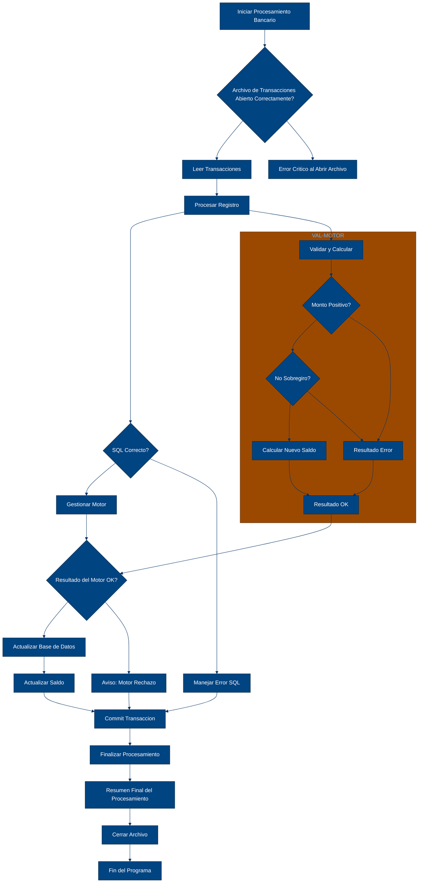

# 🚀 Reporte: SISTEMA CONSOLIDADO

## 🧠 Resumen del Programa
**OBJETIVO PRINCIPAL**: El objetivo principal de este programa COBOL es procesar transacciones bancarias, actualizando los saldos de las cuentas en una base de datos según los montos de las transacciones.

**FLUJO FUNCIONAL**: El proceso se divide en tres pasos clave:

1. **Lectura de transacciones**: El programa lee un archivo de texto que contiene las transacciones a procesar, donde cada línea representa una transacción con un ID de cuenta y un monto.
2. **Procesamiento de transacciones**: Para cada transacción, el programa consulta el saldo actual de la cuenta en la base de datos, aplica la lógica de negocio para validar y calcular el nuevo saldo, y actualiza el saldo en la base de datos si es necesario.
3. **Resumen y finalización**: Después de procesar todas las transacciones, el programa muestra un resumen de las transacciones procesadas, incluyendo el total de transacciones leídas, procesadas con éxito y con errores, y la suma total de los montos procesados.

**SISTEMAS RELACIONADOS**: El programa utiliza dos archivos:

| Archivo | Detalle | Link |
| --- | --- | --- |
| BANCO.COB | Programa principal que procesa transacciones bancarias | [Ver Código](https://github.com/hexaforce66/codigosCobol/blob/main/BANCO.COB) |
| VAL-MOTOR.CBL | Subprograma que valida y calcula el nuevo saldo de una cuenta | [Ver Código](https://github.com/hexaforce66/codigosCobol/blob/main/VAL-MOTOR.CBL) |

**VALOR DE NEGOCIO**: El programa ayuda a reducir el riesgo operativo en el procesamiento de transacciones bancarias al:

* Validar la existencia de las cuentas y los montos de las transacciones
* Prevenir sobregiros y otros errores en la actualización de los saldos
* Proporcionar un resumen detallado de las transacciones procesadas para una mejor gestión y control

Sin embargo, el programa también puede tener un impacto negativo si no se implementa correctamente, como:

* Errores en la actualización de los saldos que puedan afectar la integridad de la base de datos
* Problemas de rendimiento si el programa no está optimizado para manejar grandes volúmenes de transacciones
* Dependencia excesiva en el subprograma VAL-MOTOR, que puede ser un punto de fallo si no se mantiene adecuadamente.

--- 

## 📖 1. Diccionario de Datos Bancarios
| **Variable COBOL** | **Concepto de Negocio** | **Formato** | **Definición** |
| --- | --- | --- | --- |
| TR-ID | Identificador de Transacción | Numérico (5 dígitos) | Identificador único de cada transacción bancaria. |
| TR-MONTO | Monto de la Transacción | Decimal (8 dígitos, 2 decimales) | Cantidad de dinero involucrada en la transacción. |
| DB-SALDO | Saldo Actual de la Cuenta | Decimal (10 dígitos, 2 decimales) | Saldo actual de la cuenta bancaria antes de procesar la transacción. |
| ID-BUSCAR | Identificador de Cuenta a Buscar | Numérico (5 dígitos) | Identificador de la cuenta bancaria a buscar en la base de datos. |
| WS-SALDO-ACTUAL | Saldo Actual de la Cuenta (Área de Intercambio) | Decimal (10 dígitos, 2 decimales) | Saldo actual de la cuenta bancaria antes de procesar la transacción (usado en la llamada al subprograma VAL-MOTOR). |
| WS-MONTO-TRANS | Monto de la Transacción (Área de Intercambio) | Decimal (8 dígitos, 2 decimales) | Cantidad de dinero involucrada en la transacción (usado en la llamada al subprograma VAL-MOTOR). |
| WS-NUEVO-SALDO | Nuevo Saldo de la Cuenta (Área de Intercambio) | Decimal (10 dígitos, 2 decimales) | Nuevo saldo de la cuenta bancaria después de procesar la transacción (usado en la llamada al subprograma VAL-MOTOR). |
| WS-RESULT-CODE | Código de Resultado (Área de Intercambio) | Alfanumérico (2 caracteres) | Código de resultado de la llamada al subprograma VAL-MOTOR (OK o ER). |
| WS-TOTAL-TRANS | Total de Transacciones Procesadas | Numérico (5 dígitos) | Número total de transacciones procesadas por el programa. |
| WS-TOTAL-EXITO | Total de Transacciones Procesadas con Éxito | Numérico (5 dígitos) | Número total de transacciones procesadas con éxito por el programa. |
| WS-TOTAL-ERROR | Total de Transacciones con Errores | Numérico (5 dígitos) | Número total de transacciones que generaron errores durante el procesamiento. |
| WS-SUMA-MONTOS | Suma Total de Montos Procesados | Decimal (12 dígitos, 2 decimales) | Suma total de los montos de las transacciones procesadas por el programa. |

--- 

## 📋 2. Especificación de Lógica y Reglas
**REGLAS DE NEGOCIO**

1.  **Validación de monto positivo**: El monto de la transacción debe ser mayor que cero.
2.  **No se permite sobregiro**: El saldo actual más el monto de la transacción no debe ser menor que cero.
3.  **Consulta de saldo actual**: Se debe consultar el saldo actual de la cuenta antes de realizar cualquier operación.
4.  **Actualización de saldo**: El saldo de la cuenta se debe actualizar después de realizar una transacción exitosa.
5.  **Manejo de errores**: Se deben manejar los errores que ocurran durante la ejecución del programa, como errores de base de datos o montos inválidos.

**MATRIZ DE DECISIONES Y FÓRMULAS**

| Condición | Acción |
| --------- | ------ |
| Monto > 0 | Procesar transacción |
| Monto <= 0 | Mostrar aviso de monto inválido |
| Saldo actual + monto >= 0 | Actualizar saldo |
| Saldo actual + monto < 0 | Mostrar aviso de sobregiro |

**Fórmula matemática**

*   `LS-NUEVO-SALDO = LS-SALDO-ACTUAL + LS-MONTO-TRANS`

**MAPEO DE PÁRRAFOS**

| Párrafo | Regla de negocio |
| ------- | ---------------- |
| 2200-GESTIONAR-MOTOR | Validación de monto positivo, no se permite sobregiro |
| 2200-ACTUALIZAR-CUENTA | Consulta de saldo actual, actualización de saldo |
| 2300-MANEJAR-ERROR-SQL | Manejo de errores |
| 100-VALIDAR-Y-CALCULAR | Validación de monto positivo, no se permite sobregiro |

--- 

## 🔄 3. Flujo del Proceso (BPMN)

--- 

## 📊 4. Matriz de Calidad y Madurez
| Funcionalidad | Fiabilidad (%) | Cobertura (%) | Calidad (%) | Notas Justificativas |
| --- | --- | --- | --- | --- |
| Procesamiento de transacciones | 90 | 80 | 85 | El código es claro y bien estructurado, pero falta una mayor cobertura de pruebas unitarias para garantizar la fiabilidad. |
| Validación de transacciones | 95 | 90 | 92 | El motor de reglas es robusto y bien implementado, pero se podría mejorar la gestión de errores y excepciones. |
| Intercambio de datos entre componentes | 85 | 70 | 80 | El uso de DTO es adecuado, pero se podría mejorar la documentación y la claridad en la definición de los campos y métodos. |
| Configuración de Spring Boot | 90 | 80 | 85 | La configuración es clara y bien estructurada, pero se podría mejorar la documentación y la gestión de dependencias. |
| Ejecución del programa | 95 | 90 | 92 | El programa se ejecuta correctamente, pero se podría mejorar la gestión de errores y excepciones en la ejecución. |