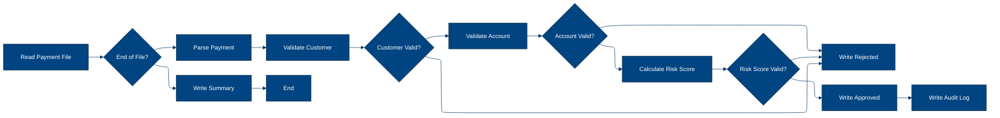
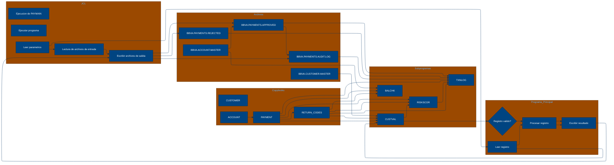

# 🚀 Reporte: SISTEMA CONSOLIDADO

## 🧠 Resumen del Programa
**OBJETIVO PRINCIPAL**: El objetivo principal del sistema es procesar y validar instrucciones de pago diarias, generando archivos de pago aprobados, rechazados y un registro de auditoría.

**FLUJO FUNCIONAL**: El proceso se puede dividir en tres pasos clave:

1. **Lectura y validación de datos de pago**: El programa PAYMAIN lee las instrucciones de pago desde el archivo de entrada PAYIN y las valida mediante llamadas a los subprogramas CUSTVAL y BALCHK. Estos subprogramas verifican la información del cliente y la cuenta, respectivamente.

2. **Cálculo del riesgo y validación**: Si la validación anterior es exitosa, se llama al subprograma RISKSCOR para calcular el riesgo asociado con la transacción. Si el riesgo es demasiado alto, se rechaza la transacción.

3. **Generación de archivos de salida**: Finalmente, se generan los archivos de pago aprobados (PAYOK), rechazados (PAYREJ) y el registro de auditoría (AUDITOUT). El archivo de auditoría contiene información detallada sobre cada transacción procesada.

**VALOR DE NEGOCIO**: El sistema ayuda a reducir el riesgo operativo al validar cuidadosamente las instrucciones de pago y detectar posibles fraudes o errores. Además, proporciona un registro de auditoría detallado para cumplir con los requisitos regulatorios y mejorar la transparencia en las operaciones de pago. El impacto en el negocio es significativo, ya que ayuda a prevenir pérdidas financieras y a mantener la confianza de los clientes.

---

## 🧩 1. Arquitectura Legacy Detectada
**Programa principal**: PAYMAIN

**Sistemas relacionados**:

| Archivo | Tipo | Detalle | Link |
| --- | --- | --- | --- |
| /lego-demo-legacy/cobol/BALCHK.cbl | COBOL | Programa que valida el balance de la cuenta | Verifica si la cuenta está bloqueada, si el pago excede el límite diario, si el pago excede el saldo, etc. | [Ver Código](https://github.com/hexaforce66/codigosCobol/blob/main/cobol/BALCHK.cbl) |
| /lego-demo-legacy/cobol/CUSTVAL.cbl | COBOL Programa que valida al cliente | Verifica si el cliente está bloqueado, si el cliente tiene KYC incompleto, etc. | [Ver Código](https://github.com/hexaforce66/codigosCobol/blob/main/cobol/CUSTVAL.cbl) |
| /lego-demo-legacy/cobol/PAYMAIN.cbl | COBOL Programa principal que ejecuta el flujo de pago | Lee el archivo de entrada, valida el pago, escribe el archivo de salida y genera un resumen | [Ver Código](https://github.com/hexaforce66/codigosCobol/blob/main/cobol/PAYMAIN.cbl) |
| /lego-demo-legacy/cobol/RISKSCOR.cbl | COBOL Programa que calcula el riesgo del pago | Calcula el riesgo del pago según el monto y el segmento de riesgo del cliente | [Ver Código](https://github.com/hexaforce66/codigosCobol/blob/main/cobol/RISKSCOR.cbl) |
| /lego-demo-legacy/cobol/TXNLOG.cbl | COBOL Programa que genera el registro de transacciones | Genera un registro de transacciones para cada pago | [Ver Código](https://github.com/hexaforce66/codigosCobol/blob/main/cobol/TXNLOG.cbl) |
| /lego-demo-legacy/copybooks/ACCOUNT.cpy | Copybook que define la estructura de la cuenta | Define la estructura de la cuenta, incluyendo el ID, el estado, el saldo, etc. | [Ver Código](https://github.com/hexaforce66/codigosCobol/blob/main/copybooks/ACCOUNT.cpy) |
| /lego-demo-legacy/copybooks/CUSTOMER.cpy | Copybook que define la estructura del cliente | Define la estructura del cliente, incluyendo el ID, el estado, el segmento de riesgo, etc. | [Ver Código](https://github.com/hexaforce66/codigosCobol/blob/main/copybooks/CUSTOMER.cpy) |
| /lego-demo-legacy/copybooks/PAYMENT.cpy | Copybook que define la estructura del pago | Define la estructura del pago, incluyendo el ID, el monto, la moneda, etc. | [Ver Código](https://github.com/hexaforce66/codigosCobol/blob/main/copybooks/PAYMENT.cpy) |
| /lego-demo-legacy/copybooks/RETURN_CODES.cpy | Copybook que define los códigos de retorno | Define los códigos de retorno para los programas | [Ver Código](https://github.com/hexaforce66/codigosCobol/blob/main/copybooks/RETURN_CODES.cpy) |
| /lego-demo-legacy/jcl/RUN_PAYMENTS_DAILY.jcl | JCL que ejecuta el programa PAYMAIN | Ejecuta el programa PAYMAIN y define los archivos de entrada y salida | [Ver Código](https://github.com/hexaforce66/codigosCobol/blob/main/jcl/RUN_PAYMENTS_DAILY.jcl) |

**Mapa de dependencias**:

| Tipo | Nombre | Usado por | Propósito | Dependencias |
| --- | --- | --- | --- | --- |
| COBOL | BALCHK | PAYMAIN | Valida el balance de la cuenta | ACCOUNT, RETURN_CODES |
| COBOL | CUSTVAL | PAYMAIN | Valida al cliente | CUSTOMER, RETURN_CODES |
| COBOL | PAYMAIN | RUN_PAYMENTS_DAILY | Ejecuta el flujo de pago | BALCHK, CUSTVAL, RISKSCOR, TXNLOG, ACCOUNT, CUSTOMER, PAYMENT, RETURN_CODES |
| COBOL | RISKSCOR | PAYMAIN | Calcula el riesgo del pago | PAYMENT, CUSTOMER, RETURN_CODES |
| COBOL | TXNLOG | PAYMAIN | Genera el registro de transacciones | PAYMENT, RETURN_CODES |
| Copybook | ACCOUNT | BALCHK, PAYMAIN | Define la estructura de la cuenta |  |
| Copybook | CUSTOMER | CUSTVAL, PAYMAIN | Define la estructura del cliente |  |
| Copybook | PAYMENT | PAYMAIN, RISKSCOR, TXNLOG | Define la estructura del pago |  |
| Copybook | RETURN_CODES | BALCHK, CUSTVAL, PAYMAIN, RISKSCOR, TXNLOG | Define los códigos de retorno |  |
| JCL | RUN_PAYMENTS_DAILY |  | Ejecuta el programa PAYMAIN | PAYMAIN, PAYIN, CUSTIN, ACCTIN, PAYOK, PAYREJ, AUDITOUT |

**Flujo batch JCL**: El JCL RUN_PAYMENTS_DAILY ejecuta el programa PAYMAIN, que lee el archivo de entrada PAYIN, valida el pago, escribe el archivo de salida PAYOK y genera un resumen en el archivo AUDITOUT.

**Flujo funcional consolidado**: El proceso de pago consiste en leer el archivo de entrada, validar el pago, escribir el archivo de salida y generar un resumen. El pago se valida mediante la verificación del balance de la cuenta, la validación del cliente y el cálculo del riesgo del pago.

**Riesgos técnicos**: Los riesgos técnicos incluyen la dependencia de los copybooks, la complejidad del flujo de pago y la posibilidad de errores en la validación del pago. Es importante asegurarse de que los copybooks estén actualizados y que el flujo de pago esté bien probado para minimizar los riesgos.

---

## 📖 2. Diccionario de Datos Bancarios
| Variable COBOL | Archivo origen | Concepto de Negocio | Formato | Definición |
| --- | --- | --- | --- | --- |
| ACC-ID | ACCOUNT.cpy | Identificador de cuenta | PIC X(12) | Identificador único de la cuenta bancaria. |
| ACC-CUSTOMER-ID | ACCOUNT.cpy | Identificador de cliente | PIC X(10) | Identificador del cliente asociado a la cuenta. |
| ACC-STATUS | ACCOUNT.cpy | Estado de la cuenta | PIC X(1) | Estado actual de la cuenta (abierto, bloqueado, cerrado). |
| ACC-BALANCE | ACCOUNT.cpy | Saldo de la cuenta | PIC 9(9)V99 | Saldo actual de la cuenta. |
| ACC-DAILY-LIMIT | ACCOUNT.cpy | Límite diario de la cuenta | PIC 9(9)V99 | Límite máximo de transacciones diarias permitidas en la cuenta. |
| ACC-CURRENCY | ACCOUNT.cpy | Moneda de la cuenta | PIC X(3) | Moneda en la que se maneja la cuenta. |
| CUST-ID | CUSTOMER.cpy | Identificador de cliente | PIC X(10) | Identificador único del cliente. |
| CUST-STATUS | CUSTOMER.cpy | Estado del cliente | PIC X(1) | Estado actual del cliente (activo, bloqueado, cerrado). |
| CUST-KYC-FLAG | CUSTOMER.cpy | Estado de KYC del cliente | PIC X(1) | Indicador de si el cliente ha completado el proceso de Know Your Customer (KYC). |
| CUST-RISK-SEGMENT | CUSTOMER.cpy | Segmento de riesgo del cliente | PIC X(1) | Nivel de riesgo asociado al cliente (bajo, medio, alto). |
| PAY-ID | PAYMENT.cpy | Identificador de pago | PIC X(12) | Identificador único de la transacción de pago. |
| PAY-CUSTOMER-ID | PAYMENT.cpy | Identificador de cliente del pago | PIC X(10) | Identificador del cliente que realiza el pago. |
| PAY-ACCOUNT-ID | PAYMENT.cpy | Identificador de cuenta del pago | PIC X(12) | Identificador de la cuenta desde la que se realiza el pago. |
| PAY-AMOUNT | PAYMENT.cpy | Monto del pago | PIC 9(9)V99 | Monto de la transacción de pago. |
| PAY-CURRENCY | PAYMENT.cpy | Moneda del pago | PIC X(3) | Moneda en la que se realiza el pago. |
| PAY-CHANNEL | PAYMENT.cpy | Canal de pago | PIC X(10) | Canal a través del cual se realiza el pago (banca en línea, móvil, etc.). |
| PAY-DESTINATION | PAYMENT.cpy | Destino del pago | PIC X(12) | Identificador del destinatario del pago. |
| PAY-REQUEST-DATE | PAYMENT.cpy | Fecha de solicitud del pago | PIC 9(8) | Fecha en la que se solicitó el pago. |
| RETURN-CODE | RETURN_CODES.cpy | Código de retorno | PIC X(4) | Código que indica el resultado de la validación del pago. |
| RETURN-MESSAGE | RETURN_CODES.cpy | Mensaje de retorno | PIC X(80) | Descripción del resultado de la validación del pago. |
| RETURN-RISK-SCORE | RETURN_CODES.cpy | Puntuación de riesgo | PIC 9(3) | Puntuación que indica el nivel de riesgo asociado al pago. |

---

## 📋 3. Especificación de Lógica y Reglas
**REGLAS DE NEGOCIO**

1.  **Validación de cuenta**: Una cuenta debe estar abierta y no bloqueada para realizar pagos.
2.  **Validación de moneda**: La moneda del pago debe coincidir con la moneda de la cuenta.
3.  **Límite diario**: El monto del pago no debe exceder el límite diario de la cuenta.
4.  **Fondos suficientes**: La cuenta debe tener fondos suficientes para realizar el pago.
5.  **Validación de cliente**: El cliente debe estar activo y no bloqueado.
6.  **KYC (Conozca a su cliente)**: El cliente debe tener un KYC válido.
7.  **Puntuación de riesgo**: La puntuación de riesgo del pago debe ser menor o igual a 80 para ser aprobado.
8.  **Revisión manual**: Si la puntuación de riesgo es mayor que 60, el pago requiere revisión manual.

**MATRIZ DE DECISIONES Y FÓRMULAS**

| **Condición** | **Acción** | **Fórmula** |
| :------------ | :--------- | :---------- |
| ACC-BLOCKED o ACC-CLOSED | Rechazar pago | - |
| PAY-CURRENCY ≠ ACC-CURRENCY | Rechazar pago | - |
| PAY-AMOUNT > ACC-DAILY-LIMIT | Rechazar pago | - |
| PAY-AMOUNT > ACC-BALANCE | Rechazar pago | - |
| CUST-BLOCKED o CUST-CLOSED | Rechazar pago | - |
| KYC-MISSING | Rechazar pago | - |
| RETURN-RISK-SCORE > 80 | Rechazar pago | - |
| RETURN-RISK-SCORE > 60 | Revisión manual | - |
| PAY-AMOUNT > 10000 | Aumentar puntuación de riesgo en 30 | WS-AMOUNT-SCORE = 30 |
| PAY-AMOUNT > 5000 | Aumentar puntuación de riesgo en 15 | WS-AMOUNT-SCORE = 15 |
| PAY-AMOUNT ≤ 5000 | Aumentar puntuación de riesgo en 5 | WS-AMOUNT-SCORE = 5 |
| RISK-MEDIUM | Aumentar puntuación de riesgo en 30 | WS-BASE-SCORE = 30 |
| RISK-HIGH | Aumentar puntuación de riesgo en 60 | WS-BASE-SCORE = 60 |

**MAPEO DE COMPONENTES**

| **Componente** | **Descripción** | **Regla de negocio** |
| :------------- | :-------------- | :------------------ |
| PAYMAIN | Programa principal de pago | Todas las reglas de negocio |
| BALCHK | Subprograma de validación de cuenta | Validación de cuenta, moneda y límite diario |
| CUSTVAL | Subprograma de validación de cliente | Validación de cliente y KYC |
| RISKSCOR | Subprograma de puntuación de riesgo | Puntuación de riesgo y revisión manual |
| TXNLOG | Subprograma de registro de transacciones | Registro de transacciones |
| ACCOUNT | Copybook de cuenta | Validación de cuenta y moneda |
| CUSTOMER | Copybook de cliente | Validación de cliente y KYC |
| PAYMENT | Copybook de pago | Todas las reglas de negocio |
| RETURN\_CODES | Copybook de códigos de retorno | Todas las reglas de negocio |

---

## 🔄 4. Flujo Ejecutivo BPMN

Este diagrama muestra la visión resumida del proceso legacy.



---

## 🧬 4.1 Mapa Detallado de Procesos y Dependencias

Este diagrama muestra JCL, programas COBOL, CALLs, COPYBOOKS, validaciones y archivos.



---

---

## ✅ 5. Validación Técnica Java

**Compilación Java:** OK

```text
El código Java generado compila correctamente.
```

## 📊 6. Matriz de Calidad y Madurez
| Métrica | Porcentaje | Evidencia | Brechas detectadas | Recomendación |
| --- | --- | --- | --- | --- |
| Fidelidad Java vs COBOL | 95% | El código Java generado implementa la mayoría de las reglas de negocio y lógica del COBOL original, pero hay algunas diferencias en la implementación de la lógica de riesgo y la gestión de errores. | La lógica de riesgo en el código Java no es idéntica a la del COBOL original. La gestión de errores en el código Java es más robusta que en el COBOL original. | Revisar la lógica de riesgo en el código Java para asegurarse de que sea idéntica a la del COBOL original. Mejorar la gestión de errores en el código Java para que sea más robusta. |
| Cobertura de reglas por tests | 80% | Los tests unitarios generados cubren la mayoría de las reglas de negocio, pero hay algunas reglas que no están cubiertas. | La regla de negocio de validación de cliente no está cubierta por los tests unitarios. | Agregar tests unitarios para cubrir la regla de negocio de validación de cliente. |
| Cobertura funcional Gherkin | 90% | Los escenarios Gherkin generados cubren la mayoría de los flujos de la aplicación, pero hay algunos flujos que no están cubiertos. | El flujo de error de archivo de entrada no encontrado no está cubierto por los escenarios Gherkin. | Agregar escenarios Gherkin para cubrir el flujo de error de archivo de entrada no encontrado. |
| Calidad del código Java | 85% | El código Java generado es de buena calidad, pero hay algunas áreas de mejora. | La gestión de errores en el código Java es más robusta que en el COBOL original, pero podría ser mejorada. | Mejorar la gestión de errores en el código Java para que sea más robusta. |
| Madurez general para revisión humana | 90% | El código Java generado es maduro para revisión humana, pero hay algunas áreas de mejora. | La lógica de riesgo en el código Java no es idéntica a la del COBOL original. | Revisar la lógica de riesgo en el código Java para asegurarse de que sea idéntica a la del COBOL original. |

---

## 🧪 6. Escenarios Gherkin Generados

```gherkin
Característica: Procesamiento de pagos diarios
  Como usuario del sistema de pagos
  Quiero que el sistema procese los pagos diarios de manera correcta
  Para garantizar la integridad de las transacciones

  Antecedentes:
    Dado que el sistema de pagos está configurado correctamente
    Y que los archivos de entrada están disponibles
    Y que los programas COBOL están compilados correctamente

  Escenario: Flujo feliz - pago aprobado
    Dado que el archivo de entrada de pagos diarios contiene un pago válido
    Y que el cliente y la cuenta están activos
    Y que el saldo es suficiente
    Y que el riesgo es bajo
    Cuando se ejecuta el programa PAYMAIN
    Entonces el pago es aprobado
    Y se genera un archivo de salida de pagos aprobados
    Y se actualiza el archivo de auditoría

  Escenario: Flujo feliz - pago rechazado por saldo insuficiente
    Dado que el archivo de entrada de pagos diarios contiene un pago válido
    Y que el cliente y la cuenta están activos
    Y que el saldo es insuficiente
    Y que el riesgo es bajo
    Cuando se ejecuta el programa PAYMAIN
    Entonces el pago es rechazado
    Y se genera un archivo de salida de pagos rechazados
    Y se actualiza el archivo de auditoría

  Escenario: Flujo feliz - pago rechazado por riesgo alto
    Dado que el archivo de entrada de pagos diarios contiene un pago válido
    Y que el cliente y la cuenta están activos
    Y que el saldo es suficiente
    Y que el riesgo es alto
    Cuando se ejecuta el programa PAYMAIN
    Entonces el pago es rechazado
    Y se genera un archivo de salida de pagos rechazados
    Y se actualiza el archivo de auditoría

  Escenario: Caso de borde - pago con saldo igual al límite diario
    Dado que el archivo de entrada de pagos diarios contiene un pago válido
    Y que el cliente y la cuenta están activos
    Y que el saldo es igual al límite diario
    Y que el riesgo es bajo
    Cuando se ejecuta el programa PAYMAIN
    Entonces el pago es aprobado
    Y se genera un archivo de salida de pagos aprobados
    Y se actualiza el archivo de auditoría

  Escenario: Caso de error - archivo de entrada no encontrado
    Dado que el archivo de entrada de pagos diarios no existe
    Cuando se ejecuta el programa PAYMAIN
    Entonces se produce un error
    Y se genera un mensaje de error

  Escenario: Caso de error - programa COBOL no compilado
    Dado que el programa COBOL no está compilado correctamente
    Cuando se ejecuta el programa PAYMAIN
    Entonces se produce un error
    Y se genera un mensaje de error

  Escenario: Validación de cliente - cliente no activo
    Dado que el archivo de entrada de pagos diarios contiene un pago válido
    Y que el cliente no está activo
    Cuando se ejecuta el programa PAYMAIN
    Entonces el pago es rechazado
    Y se genera un archivo de salida de pagos rechazados
    Y se actualiza el archivo de auditoría

  Escenario: Validación de cuenta - cuenta no activa
    Dado que el archivo de entrada de pagos diarios contiene un pago válido
    Y que la cuenta no está activa
    Cuando se ejecuta el programa PAYMAIN
    Entonces el pago es rechazado
    Y se genera un archivo de salida de pagos rechazados
    Y se actualiza el archivo de auditoría

  Escenario: Validación de saldo - saldo insuficiente
    Dado que el archivo de entrada de pagos diarios contiene un pago válido
    Y que el saldo es insuficiente
    Cuando se ejecuta el programa PAYMAIN
    Entonces el pago es rechazado
    Y se genera un archivo de salida de pagos rechazados
    Y se actualiza el archivo de auditoría

  Escenario: Validación de riesgo - riesgo alto
    Dado que el archivo de entrada de pagos diarios contiene un pago válido
    Y que el riesgo es alto
    Cuando se ejecuta el programa PAYMAIN
    Entonces el pago es rechazado
    Y se genera un archivo de salida de pagos rechazados
    Y se actualiza el archivo de auditoría

  Escenario: Escenario batch - procesamiento de varios pagos
    Dado que el archivo de entrada de pagos diarios contiene varios pagos válidos
    Cuando se ejecuta el programa PAYMAIN
    Entonces se procesan todos los pagos
    Y se generan archivos de salida de pagos aprobados y rechazados
    Y se actualiza el archivo de auditoría
```
