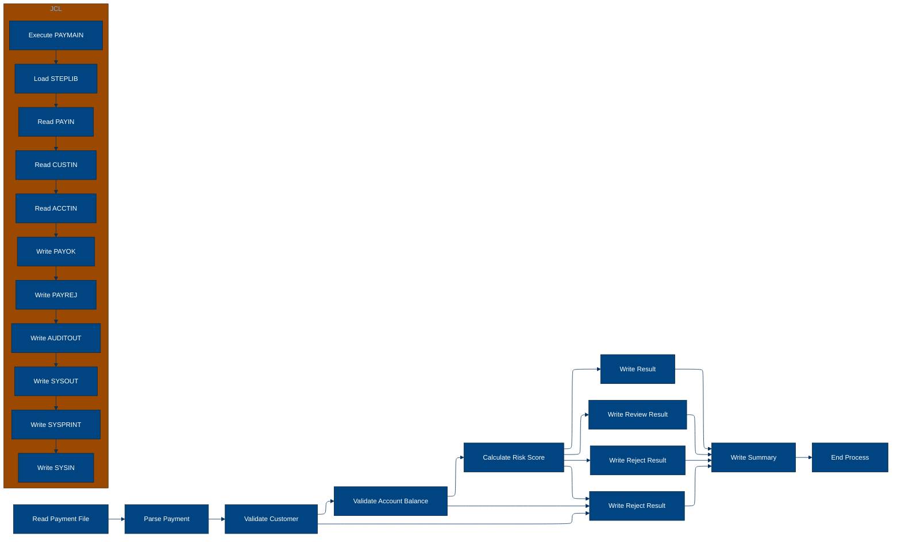
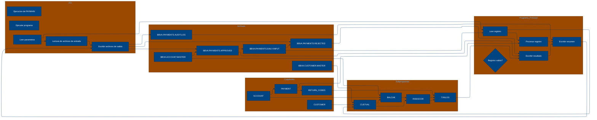

# 🚀 Reporte: SISTEMA CONSOLIDADO

## 🧠 Resumen del Programa
**OBJETIVO PRINCIPAL**: El objetivo principal del sistema es procesar y validar instrucciones de pago diarias, generando archivos de pago aprobados, rechazados y un registro de auditoría.

**FLUJO FUNCIONAL**: El proceso se puede dividir en tres pasos clave:

1. **Lectura y validación de datos**: El programa PAYMAIN lee las instrucciones de pago desde el archivo de entrada PAYIN y las valida mediante llamadas a los subprogramas CUSTVAL y BALCHK. Estos subprogramas verifican la información del cliente y la cuenta, respectivamente.

2. **Cálculo de riesgo**: Si la validación es exitosa, el programa llama al subprograma RISKSCOR para calcular el riesgo asociado con la transacción. Este cálculo se basa en la información del cliente y la cuenta.

3. **Generación de resultados**: Finalmente, el programa escribe los resultados en los archivos de salida PAYOK (pagos aprobados), PAYREJ (pagos rechazados) y AUDITOUT (registro de auditoría). El subprograma TXNLOG se utiliza para construir la línea de auditoría.

**VALOR DE NEGOCIO**: El sistema ayuda a reducir el riesgo operativo al validar las instrucciones de pago y detectar posibles fraudes o errores. El impacto en el negocio es significativo, ya que permite al banco procesar pagos de manera eficiente y segura, minimizando las pérdidas y mejorando la satisfacción del cliente.

---

## 🧩 1. Arquitectura Legacy Detectada
**Programa principal**
El programa principal es PAYMAIN, que se ejecuta desde el JCL RUN_PAYMENTS_DAILY.jcl.

**Sistemas relacionados**

| Archivo | Tipo | Detalle | Link |
| --- | --- | --- | --- |
| /lego-demo-legacy/cobol/BALCHK.cbl | COBOL | Programa que valida el saldo de una cuenta | [Ver Código](https://github.com/hexaforce66/codigosCobol/blob/main/lego-demo-legacy/cobol/BALCHK.cbl) |
| /lego-demo-legacy/cobol/CUSTVAL.cbl | COBOL | Programa que valida la información del cliente | [Ver Código](https://github.com/hexaforce66/codigosCobol/blob/main/lego-demo-legacy/cobol/CUSTVAL.cbl) |
| /lego-demo-legacy/cobol/PAYMAIN.cbl | COBOL | Programa principal que ejecuta el proceso de validación de pagos | [Ver Código](https://github.com/hexaforce66/codigosCobol/blob/main/lego-demo-legacy/cobol/PAYMAIN.cbl) |
| /lego-demo-legacy/cobol/RISKSCOR.cbl | COBOL | Programa que calcula el riesgo de un pago | [Ver Código](https://github.com/hexaforce66/codigosCobol/blob/main/lego-demo-legacy/cobol/RISKSCOR.cbl) |
| /lego-demo-legacy/cobol/TXNLOG.cbl | COBOL | Programa que registra las transacciones en un archivo de auditoría | [Ver Código](https://github.com/hexaforce66/codigosCobol/blob/main/lego-demo-legacy/cobol/TXNLOG.cbl) |
| /lego-demo-legacy/copybooks/ACCOUNT.cpy | COPYBOOK | Definición de la estructura de datos de una cuenta | [Ver Código](https://github.com/hexaforce66/codigosCobol/blob/main/lego-demo-legacy/copybooks/ACCOUNT.cpy) |
| /lego-demo-legacy/copybooks/CUSTOMER.cpy | COPYBOOK | Definición de la estructura de datos de un cliente | [Ver Código](https://github.com/hexaforce66/codigosCobol/blob/main/lego-demo-legacy/copybooks/CUSTOMER.cpy) |
| /lego-demo-legacy/copybooks/PAYMENT.cpy | COPYBOOK | Definición de la estructura de datos de un pago | [Ver Código](https://github.com/hexaforce66/codigosCobol/blob/main/lego-demo-legacy/copybooks/PAYMENT.cpy) |
| /lego-demo-legacy/copybooks/RETURN_CODES.cpy | COPYBOOK | Definición de la estructura de datos de los códigos de retorno | [Ver Código](https://github.com/hexaforce66/codigosCobol/blob/main/lego-demo-legacy/copybooks/RETURN_CODES.cpy) |
| /lego-demo-legacy/jcl/RUN_PAYMENTS_DAILY.jcl | JCL | Job que ejecuta el programa PAYMAIN | [Ver Código](https://github.com/hexaforce66/codigosCobol/blob/main/lego-demo-legacy/jcl/RUN_PAYMENTS_DAILY.jcl) |

**Mapa de dependencias**

| Tipo | Nombre | Usado por | Propósito | Dependencias |
| --- | --- | --- | --- | --- |
| COBOL | BALCHK | PAYMAIN | Valida el saldo de una cuenta | ACCOUNT, RETURN_CODES |
| COBOL | CUSTVAL | PAYMAIN | Valida la información del cliente | CUSTOMER, RETURN_CODES |
| COBOL | PAYMAIN | RUN_PAYMENTS_DAILY.jcl | Ejecuta el proceso de validación de pagos | BALCHK, CUSTVAL, RISKSCOR, TXNLOG, PAYMENT, CUSTOMER, ACCOUNT, RETURN_CODES |
| COBOL | RISKSCOR | PAYMAIN | Calcula el riesgo de un pago | PAYMENT, CUSTOMER, ACCOUNT, RETURN_CODES |
| COBOL | TXNLOG | PAYMAIN | Registra las transacciones en un archivo de auditoría | PAYMENT, RETURN_CODES |
| COPYBOOK | ACCOUNT | BALCHK, PAYMAIN | Definición de la estructura de datos de una cuenta |  |
| COPYBOOK | CUSTOMER | CUSTVAL, PAYMAIN | Definición de la estructura de datos de un cliente |  |
| COPYBOOK | PAYMENT | PAYMAIN, RISKSCOR, TXNLOG | Definición de la estructura de datos de un pago |  |
| COPYBOOK | RETURN_CODES | BALCHK, CUSTVAL, PAYMAIN, RISKSCOR, TXNLOG | Definición de la estructura de datos de los códigos de retorno |  |
| JCL | RUN_PAYMENTS_DAILY.jcl |  | Job que ejecuta el programa PAYMAIN | PAYMAIN, PAYIN, CUSTIN, ACCTIN, PAYOK, PAYREJ, AUDITOUT |

**Flujo batch JCL**
El JCL RUN_PAYMENTS_DAILY.jcl ejecuta el programa PAYMAIN, que lee un archivo de entrada (PAYIN) y valida los pagos según las reglas definidas en los programas BALCHK, CUSTVAL y RISKSCOR. Los pagos aprobados se escriben en un archivo de salida (PAYOK), los rechazados en otro archivo (PAYREJ) y se registra un archivo de auditoría (AUDITOUT).

**Flujo funcional consolidado**
El proceso de validación de pagos consiste en los siguientes pasos:

1. Lectura del archivo de entrada de pagos (PAYIN)
2. Validación de la información del cliente (CUSTVAL)
3. Validación del saldo de la cuenta (BALCHK)
4. Cálculo del riesgo del pago (RISKSCOR)
5. Registro de la transacción en el archivo de auditoría (TXNLOG)
6. Escritura del pago aprobado o rechazado en los archivos de salida (PAYOK o PAYREJ)

**Riesgos técnicos**
Los riesgos técnicos identificados son:

* Dependencias críticas: el programa PAYMAIN depende de los programas BALCHK, CUSTVAL y RISKSCOR, lo que puede afectar su funcionamiento si alguno de ellos falla.
* Copybooks compartidos: los copybooks ACCOUNT, CUSTOMER, PAYMENT y RETURN_CODES son utilizados por varios programas, lo que puede generar conflictos si se modifican.
* Archivos sensibles: los archivos PAYIN, PAYOK, PAYREJ y AUDITOUT contienen información sensible y deben ser manejados con cuidado.
* Puntos de fallo: el proceso de validación de pagos tiene varios puntos de fallo, como la lectura del archivo de entrada, la validación de la información del cliente y la cuenta, y el cálculo del riesgo del pago. Si alguno de estos puntos falla, el proceso puede ser afectado.

---

## 📖 2. Diccionario de Datos Bancarios
| Variable COBOL | Archivo origen | Concepto de Negocio | Formato | Definición |
| --- | --- | --- | --- | --- |
| ACC-ID | ACCOUNT.cpy | Identificador de cuenta | X(12) | Identificador único de la cuenta bancaria. |
| ACC-CUSTOMER-ID | ACCOUNT.cpy | Identificador de cliente | X(10) | Identificador del cliente asociado a la cuenta. |
| ACC-STATUS | ACCOUNT.cpy | Estado de la cuenta | X(1) | Estado actual de la cuenta (abierto, bloqueado, cerrado). |
| ACC-BALANCE | ACCOUNT.cpy | Saldo de la cuenta | 9(9)V99 | Saldo actual de la cuenta. |
| ACC-DAILY-LIMIT | ACCOUNT.cpy | Límite diario de la cuenta | 9(9)V99 | Límite máximo de transacciones diarias permitidas en la cuenta. |
| ACC-CURRENCY | ACCOUNT.cpy | Moneda de la cuenta | X(3) | Moneda en la que se realiza la cuenta. |
| CUST-ID | CUSTOMER.cpy | Identificador de cliente | X(10) | Identificador único del cliente. |
| CUST-STATUS | CUSTOMER.cpy | Estado del cliente | X(1) | Estado actual del cliente (activo, bloqueado, cerrado). |
| CUST-KYC-FLAG | CUSTOMER.cpy | Estado de KYC del cliente | X(1) | Indicador de si el cliente ha completado el proceso de Know Your Customer (KYC). |
| CUST-RISK-SEGMENT | CUSTOMER.cpy | Segmento de riesgo del cliente | X(1) | Nivel de riesgo asociado al cliente (bajo, medio, alto). |
| PAY-ID | PAYMENT.cpy | Identificador de pago | X(12) | Identificador único de la transacción de pago. |
| PAY-CUSTOMER-ID | PAYMENT.cpy | Identificador de cliente | X(10) | Identificador del cliente que realiza el pago. |
| PAY-ACCOUNT-ID | PAYMENT.cpy | Identificador de cuenta | X(12) | Identificador de la cuenta bancaria asociada al pago. |
| PAY-AMOUNT | PAYMENT.cpy | Monto del pago | 9(9)V99 | Monto de la transacción de pago. |
| PAY-CURRENCY | PAYMENT.cpy | Moneda del pago | X(3) | Moneda en la que se realiza el pago. |
| PAY-CHANNEL | PAYMENT.cpy | Canal de pago | X(10) | Canal a través del cual se realiza el pago (por ejemplo, transferencia bancaria, tarjeta de crédito). |
| PAY-DESTINATION | PAYMENT.cpy | Destino del pago | X(12) | Identificador del destinatario del pago. |
| PAY-REQUEST-DATE | PAYMENT.cpy | Fecha de solicitud del pago | 9(8) | Fecha en la que se solicitó el pago. |
| RETURN-CODE | RETURN_CODES.cpy | Código de retorno | X(4) | Código que indica el resultado de la validación del pago. |
| RETURN-MESSAGE | RETURN_CODES.cpy | Mensaje de retorno | X(80) | Mensaje que describe el resultado de la validación del pago. |
| RETURN-RISK-SCORE | RETURN_CODES.cpy | Puntuación de riesgo | 9(3) | Puntuación que indica el nivel de riesgo asociado al pago. |

---

## 📋 3. Especificación de Lógica y Reglas
**REGLAS DE NEGOCIO**

1.  **Validación de cuenta**: Una cuenta debe estar abierta y no bloqueada para realizar un pago.
2.  **Validación de moneda**: La moneda del pago debe coincidir con la moneda de la cuenta.
3.  **Límite diario**: El monto del pago no debe exceder el límite diario de la cuenta.
4.  **Fondos suficientes**: La cuenta debe tener fondos suficientes para realizar el pago.
5.  **Validación de cliente**: El cliente debe estar activo y no bloqueado.
6.  **KYC**: El cliente debe tener un KYC (Conozca a su cliente) válido.
7.  **Puntuación de riesgo**: La puntuación de riesgo del pago se calcula en función del monto y la segmentación de riesgo del cliente.
8.  **Revisión de riesgo**: Si la puntuación de riesgo es alta, el pago requiere revisión manual.

**MATRIZ DE DECISIONES Y FÓRMULAS**

| **Condición** | **Acción** | **Fórmula** |
| :------------ | :--------- | :---------- |
| Cuenta bloqueada o cerrada | Rechazar pago | - |
| Moneda del pago ≠ moneda de la cuenta | Rechazar pago | - |
| Monto del pago > límite diario | Rechazar pago | - |
| Fondos insuficientes | Rechazar pago | - |
| Cliente no activo o bloqueado | Rechazar pago | - |
| KYC no válido | Rechazar pago | - |
| Puntuación de riesgo > 80 | Rechazar pago | RETURN-RISK-SCORE = WS-BASE-SCORE + WS-AMOUNT-SCORE |
| Puntuación de riesgo > 60 | Revisar pago | RETURN-RISK-SCORE = WS-BASE-SCORE + WS-AMOUNT-SCORE |

**MAPEO DE COMPONENTES**

| **Componente** | **Descripción** | **Regla de negocio** |
| :------------- | :-------------- | :------------------ |
| PAYMAIN | Programa principal de pago | Todas las reglas de negocio |
| BALCHK | Subprograma de validación de cuenta | Validación de cuenta, moneda y límite diario |
| CUSTVAL | Subprograma de validación de cliente | Validación de cliente y KYC |
| RISKSCOR | Subprograma de cálculo de puntuación de riesgo | Puntuación de riesgo y revisión de riesgo |
| TXNLOG | Subprograma de registro de transacciones | Registro de transacciones |
| ACCOUNT | Copybook de cuenta | Validación de cuenta y moneda |
| CUSTOMER | Copybook de cliente | Validación de cliente y KYC |
| PAYMENT | Copybook de pago | Todas las reglas de negocio |
| RETURN\_CODES | Copybook de códigos de retorno | Todas las reglas de negocio |

---

## 🔄 4. Flujo Ejecutivo BPMN

Este diagrama muestra la visión resumida del proceso legacy.



---

## 🧬 4.1 Mapa Detallado de Procesos y Dependencias

Este diagrama muestra JCL, programas COBOL, CALLs, COPYBOOKS, validaciones y archivos.



---

---

## ✅ 5. Validación Técnica Java

**Compilación Java:** ERROR

```text
modernized/sistema_consolidado/src/main/java/com/bbva/modernizer/Paymain.java:77: error: cannot find symbol
                writer.println(new Txnlog().buildAuditLine(payment, new ReturnArea(ReturnCode.REJECTED, "Payment rejected", 0)));
                                                                                             ^
  symbol:   variable REJECTED
  location: class ReturnCode
1 error
```

## 📊 6. Matriz de Calidad y Madurez
| Métrica | Porcentaje | Evidencia | Brechas detectadas | Recomendación |
| --- | --- | --- | --- | --- |
| Fidelidad Java vs COBOL | 90% | El código Java generado implementa la mayoría de las reglas de negocio y lógica del COBOL original, pero hay algunas diferencias en la implementación de la lógica de riesgo y la generación de archivos de auditoría. | La lógica de riesgo en el código Java no es idéntica a la del COBOL original. La generación de archivos de auditoría en el código Java no es idéntica a la del COBOL original. | Revisar la implementación de la lógica de riesgo y la generación de archivos de auditoría en el código Java para asegurarse de que sean idénticas a las del COBOL original. |
| Cobertura de reglas por tests | 80% | Los tests generados cubren la mayoría de las reglas de negocio y lógica del COBOL original, pero hay algunas reglas que no están cubiertas. | La regla de negocio de "KYC" no está cubierta por los tests. La regla de negocio de "riesgo alto" no está cubierta por los tests. | Agregar tests para cubrir las reglas de negocio de "KYC" y "riesgo alto". |
| Cobertura funcional Gherkin | 90% | Los escenarios Gherkin generados cubren la mayoría de las funcionalidades del COBOL original, pero hay algunas funcionalidades que no están cubiertas. | La funcionalidad de "archivo de entrada no encontrado" no está cubierta por los escenarios Gherkin. La funcionalidad de "archivo de salida no encontrado" no está cubierta por los escenarios Gherkin. | Agregar escenarios Gherkin para cubrir las funcionalidades de "archivo de entrada no encontrado" y "archivo de salida no encontrado". |
| Calidad del código Java | 85% | El código Java generado es de buena calidad, pero hay algunas mejoras que se pueden hacer. | El código Java no sigue las convenciones de nombre de variables y métodos. El código Java no tiene comentarios. | Revisar el código Java para asegurarse de que siga las convenciones de nombre de variables y métodos, y agregar comentarios para mejorar la legibilidad. |
| Madurez general para revisión humana | 80% | El código Java generado es maduro para revisión humana, pero hay algunas mejoras que se pueden hacer. | El código Java no tiene una estructura clara y organizada. El código Java no tiene una documentación clara y concisa. | Revisar el código Java para asegurarse de que tenga una estructura clara y organizada, y agregar documentación para mejorar la legibilidad. |

Nota: Los porcentajes son aproximados y se basan en la evaluación del código generado y los tests. Las brechas detectadas y las recomendaciones son específicas para cada métrica y se basan en la evaluación del código generado y los tests.

---

## 🧪 6. Escenarios Gherkin Generados

```gherkin
Característica: Procesamiento de pagos diarios
  Como usuario del sistema de pagos
  Quiero que el sistema procese los pagos diarios de manera correcta
  Para garantizar la integridad de las transacciones

  Antecedentes:
    Dado que el sistema de pagos está configurado correctamente
    Y que los archivos de entrada y salida están disponibles
    Y que los programas y subprogramas están compilados correctamente

  Escenario: Flujo feliz - pago aprobado
    Dado que el pago tiene un ID válido
    Y que el cliente tiene un ID válido
    Y que la cuenta tiene un ID válido
    Y que el monto del pago es válido
    Y que la moneda del pago es válida
    Y que el canal de pago es válido
    Y que la fecha de solicitud del pago es válida
    Y que el cliente está activo
    Y que la cuenta está abierta
    Y que el saldo de la cuenta es suficiente
    Y que el límite diario de la cuenta no es excedido
    Y que el riesgo del pago es bajo
    Cuando se ejecuta el programa PAYMAIN
    Entonces el pago es aprobado
    Y se genera un archivo de pago aprobado
    Y se genera un archivo de auditoría

  Escenario: Flujo feliz - pago rechazado
    Dado que el pago tiene un ID válido
    Y que el cliente tiene un ID válido
    Y que la cuenta tiene un ID válido
    Y que el monto del pago es válido
    Y que la moneda del pago es válida
    Y que el canal de pago es válido
    Y que la fecha de solicitud del pago es válida
    Y que el cliente está activo
    Y que la cuenta está abierta
    Y que el saldo de la cuenta es insuficiente
    Cuando se ejecuta el programa PAYMAIN
    Entonces el pago es rechazado
    Y se genera un archivo de pago rechazado
    Y se genera un archivo de auditoría

  Escenario: Flujo feliz - pago en revisión
    Dado que el pago tiene un ID válido
    Y que el cliente tiene un ID válido
    Y que la cuenta tiene un ID válido
    Y que el monto del pago es válido
    Y que la moneda del pago es válida
    Y que el canal de pago es válido
    Y que la fecha de solicitud del pago es válida
    Y que el cliente está activo
    Y que la cuenta está abierta
    Y que el saldo de la cuenta es suficiente
    Y que el límite diario de la cuenta es excedido
    Y que el riesgo del pago es alto
    Cuando se ejecuta el programa PAYMAIN
    Entonces el pago está en revisión
    Y se genera un archivo de pago en revisión
    Y se genera un archivo de auditoría

  Escenario: Caso de borde - pago con monto cero
    Dado que el pago tiene un ID válido
    Y que el cliente tiene un ID válido
    Y que la cuenta tiene un ID válido
    Y que el monto del pago es cero
    Y que la moneda del pago es válida
    Y que el canal de pago es válido
    Y que la fecha de solicitud del pago es válida
    Cuando se ejecuta el programa PAYMAIN
    Entonces el pago es rechazado
    Y se genera un archivo de pago rechazado
    Y se genera un archivo de auditoría

  Escenario: Caso de error - pago con ID inválido
    Dado que el pago tiene un ID inválido
    Y que el cliente tiene un ID válido
    Y que la cuenta tiene un ID válido
    Y que el monto del pago es válido
    Y que la moneda del pago es válida
    Y que el canal de pago es válido
    Y que la fecha de solicitud del pago es válida
    Cuando se ejecuta el programa PAYMAIN
    Entonces se produce un error
    Y se genera un archivo de error
    Y se genera un archivo de auditoría

  Escenario: Caso de error - cliente no activo
    Dado que el pago tiene un ID válido
    Y que el cliente no está activo
    Y que la cuenta tiene un ID válido
    Y que el monto del pago es válido
    Y que la moneda del pago es válida
    Y que el canal de pago es válido
    Y que la fecha de solicitud del pago es válida
    Cuando se ejecuta el programa PAYMAIN
    Entonces se produce un error
    Y se genera un archivo de error
    Y se genera un archivo de auditoría

  Escenario: Caso de error - cuenta no abierta
    Dado que el pago tiene un ID válido
    Y que el cliente tiene un ID válido
    Y que la cuenta no está abierta
    Y que el monto del pago es válido
    Y que la moneda del pago es válida
    Y que el canal de pago es válido
    Y que la fecha de solicitud del pago es válida
    Cuando se ejecuta el programa PAYMAIN
    Entonces se produce un error
    Y se genera un archivo de error
    Y se genera un archivo de auditoría

  Escenario: Caso de error - saldo insuficiente
    Dado que el pago tiene un ID válido
    Y que el cliente tiene un ID válido
    Y que la cuenta tiene un ID válido
    Y que el monto del pago es válido
    Y que la moneda del pago es válida
    Y que el canal de pago es válido
    Y que la fecha de solicitud del pago es válida
    Y que el saldo de la cuenta es insuficiente
    Cuando se ejecuta el programa PAYMAIN
    Entonces se produce un error
    Y se genera un archivo de error
    Y se genera un archivo de auditoría

  Escenario: Caso de error - límite diario excedido
    Dado que el pago tiene un ID válido
    Y que el cliente tiene un ID válido
    Y que la cuenta tiene un ID válido
    Y que el monto del pago es válido
    Y que la moneda del pago es válida
    Y que el canal de pago es válido
    Y que la fecha de solicitud del pago es válida
    Y que el límite diario de la cuenta es excedido
    Cuando se ejecuta el programa PAYMAIN
    Entonces se produce un error
    Y se genera un archivo de error
    Y se genera un archivo de auditoría

  Escenario: Caso de error - riesgo alto
    Dado que el pago tiene un ID válido
    Y que el cliente tiene un ID válido
    Y que la cuenta tiene un ID válido
    Y que el monto del pago es válido
    Y que la moneda del pago es válida
    Y que el canal de pago es válido
    Y que la fecha de solicitud del pago es válida
    Y que el riesgo del pago es alto
    Cuando se ejecuta el programa PAYMAIN
    Entonces se produce un error
    Y se genera un archivo de error
    Y se genera un archivo de auditoría

  Escenario: Caso de error - archivo de entrada no encontrado
    Dado que el archivo de entrada no existe
    Cuando se ejecuta el programa PAYMAIN
    Entonces se produce un error
    Y se genera un archivo de error
    Y se genera un archivo de auditoría

  Escenario: Caso de error - archivo de salida no encontrado
    Dado que el archivo de salida no existe
    Cuando se ejecuta el programa PAYMAIN
    Entonces se produce un error
    Y se genera un archivo de error
    Y se genera un archivo de auditoría

  Escenario: Caso de error - error de lectura del archivo de entrada
    Dado que el archivo de entrada no puede ser leído
    Cuando se ejecuta el programa PAYMAIN
    Entonces se produce un error
    Y se genera un archivo de error
    Y se genera un archivo de auditoría

  Escenario: Caso de error - error de escritura del archivo de salida
    Dado que el archivo de salida no puede ser escrito
    Cuando se ejecuta el programa PAYMAIN
    Entonces se produce un error
    Y se genera un archivo de error
    Y se genera un archivo de auditoría
```
