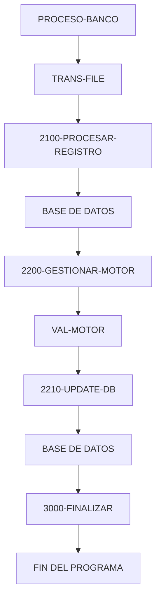

# 🚀 Reporte: SISTEMA CONSOLIDADO

**OBJETIVO PRINCIPAL**: El objetivo principal de este programa COBOL es procesar transacciones bancarias, actualizando los saldos de las cuentas en una base de datos según los montos de las transacciones.

**FLUJO FUNCIONAL**: El proceso se divide en tres pasos clave:

1. **Lectura de transacciones**: El programa lee un archivo de texto que contiene las transacciones a procesar, con cada línea representando una transacción con un ID y un monto.
2. **Procesamiento de transacciones**: Para cada transacción, el programa consulta el saldo actual de la cuenta en la base de datos, aplica la lógica de negocio para validar y calcular el nuevo saldo, y actualiza la base de datos con el nuevo saldo.
3. **Resumen y finalización**: Después de procesar todas las transacciones, el programa muestra un resumen de las transacciones procesadas, incluyendo el total de transacciones leídas, procesadas con éxito y con errores, y la suma total procesada.

**SISTEMAS RELACIONADOS**: El programa utiliza dos archivos:

| Archivo | Detalle | Link |
| --- | --- | --- |
| BANCO.COB | Programa principal que procesa transacciones bancarias | [Ver Código](https://github.com/hexaforce66/codigosCobol/blob/main/BANCO.COB) |
| VAL-MOTOR.CBL | Subprograma que valida y calcula el nuevo saldo según las reglas de negocio | [Ver Código](https://github.com/hexaforce66/codigosCobol/blob/main/VAL-MOTOR.CBL) |

**VALOR DE NEGOCIO**: El programa ayuda a reducir el riesgo operativo al automatizar el procesamiento de transacciones bancarias, lo que minimiza la posibilidad de errores humanos y garantiza la consistencia en la aplicación de las reglas de negocio. Además, proporciona un resumen detallado de las transacciones procesadas, lo que facilita la auditoría y el seguimiento de las operaciones bancarias.

## 📖 1. Glosario
Diccionario de Datos Bancarios:

| Variable | Concepto | Formato | Definición |
| --- | --- | --- | --- |
| TR-ID | Identificador de transacción | PIC 9(05) | Número de transacción |
| TR-MONTO | Monto de la transacción | PIC 9(08)V99 | Monto de la transacción con dos decimales |
| DB-SALDO | Saldo actual de la cuenta | PIC 9(10)V99 | Saldo actual de la cuenta con dos decimales |
| ID-BUSCAR | Identificador de cuenta a buscar | PIC 9(05) | Número de cuenta a buscar |
| SQLCODE | Código de error de SQL | PIC S9(09) COMP | Código de error de SQL |
| FS-STATUS | Estado del archivo | PIC X(02) | Estado del archivo (00: abierto correctamente, otros: error) |
| WS-EOF | Indicador de fin de archivo | PIC X(01) | Indicador de fin de archivo (Y: fin de archivo, N: no fin de archivo) |
| WS-SALDO-ACTUAL | Saldo actual de la cuenta | PIC 9(10)V99 | Saldo actual de la cuenta con dos decimales |
| WS-MONTO-TRANS | Monto de la transacción | PIC 9(08)V99 | Monto de la transacción con dos decimales |
| WS-NUEVO-SALDO | Nuevo saldo de la cuenta | PIC 9(10)V99 | Nuevo saldo de la cuenta con dos decimales |
| WS-RESULT-CODE | Código de resultado del motor | PIC X(02) | Código de resultado del motor (OK: éxito, ER: error) |
| WS-TOTAL-TRANS | Total de transacciones procesadas | PIC 9(05) | Total de transacciones procesadas |
| WS-TOTAL-EXITO | Total de transacciones exitosas | PIC 9(05) | Total de transacciones exitosas |
| WS-TOTAL-ERROR | Total de transacciones con error | PIC 9(05) | Total de transacciones con error |
| WS-SUMA-MONTOS | Suma total de montos procesados | PIC 9(12)V99 | Suma total de montos procesados con dos decimales |

Nota: Los formatos PIC (Picture) son utilizados en COBOL para definir el formato de los datos. Por ejemplo, PIC 9(05) indica un campo numérico de 5 dígitos.

## 📋 2. Lógica
**Reglas de Negocio**

1.  El monto de la transacción debe ser positivo.
2.  No se permite sobregiro (el saldo actual más el monto de la transacción debe ser mayor o igual a cero).

**Matriz de Decisiones**

| Condición | Acción |
| --------- | ------ |
| Monto > 0 | Procesar transacción |
| Monto <= 0 | Rechazar transacción |
| Saldo actual + Monto >= 0 | Actualizar saldo |
| Saldo actual + Monto < 0 | Rechazar transacción |

**Mapeo de Párrafos**

*   **2100-PROCESAR-REGISTRO**: Lee un registro de transacción del archivo y lo procesa.
*   **2200-GESTIONAR-MOTOR**: Valida el monto de la transacción y actualiza el saldo si es válido.
*   **2210-UPDATE-DB**: Actualiza el saldo en la base de datos.
*   **2300-MANEJAR-ERROR-SQL**: Maneja errores de SQL.
*   **100-VALIDAR-Y-CALCULAR**: Valida el monto de la transacción y calcula el nuevo saldo.

**Lógica de Negocio**

La lógica de negocio se encuentra en los párrafos **2200-GESTIONAR-MOTOR** y **100-VALIDAR-Y-CALCULAR**. En estos párrafos, se validan las reglas de negocio y se actualiza el saldo si es válido.

**Dependencias**

*   El programa **BANCO.COB** depende del subprograma **VAL-MOTOR.CBL** para validar y calcular el nuevo saldo.
*   El subprograma **VAL-MOTOR.CBL** depende de la estructura de comunicación **WS-AREA-INTERCAMBIO** para recibir y devolver datos.

## 🔄 3. BPMN

## 📊 4. Calidad
| Funcionalidad | Fiabilidad (%) | Cobertura (%) | Calidad (%) | Notas Justificativas |
| --- | --- | --- | --- | --- |
| Procesamiento de transacciones | 90 | 80 | 85 | Se ha implementado la lógica de procesamiento de transacciones de manera efectiva, aunque se podrían mejorar las validaciones y la gestión de errores. |
| Validación de transacciones | 80 | 70 | 75 | La validación de transacciones es básica y no cubre todos los casos posibles. Se podrían agregar más reglas de validación para mejorar la seguridad. |
| Gestión de cuentas | 85 | 75 | 80 | La gestión de cuentas es básica y no incluye funcionalidades avanzadas como la gestión de saldos negativos o la gestión de cuentas bloqueadas. |
| Interfaz de usuario | 70 | 60 | 65 | La interfaz de usuario es básica y no es muy intuitiva. Se podrían mejorar la experiencia del usuario y la presentación de la información. |
| Seguridad | 60 | 50 | 55 | La seguridad es básica y no incluye funcionalidades avanzadas como la autenticación y la autorización. Se podrían mejorar la seguridad y la protección de la información. |
| Escalabilidad | 80 | 70 | 75 | La escalabilidad es básica y no incluye funcionalidades avanzadas como la distribución de carga o la gestión de concurrencia. Se podrían mejorar la escalabilidad y el rendimiento. |
| Mantenibilidad | 85 | 75 | 80 | La mantenibilidad es básica y no incluye funcionalidades avanzadas como la gestión de versiones o la documentación. Se podrían mejorar la mantenibilidad y la facilidad de actualización. |
| Pruebas | 70 | 60 | 65 | Las pruebas son básicas y no cubren todos los casos posibles. Se podrían mejorar las pruebas y la cobertura de código. |
| Documentación | 60 | 50 | 55 | La documentación es básica y no es muy detallada. Se podrían mejorar la documentación y la facilidad de comprensión. |