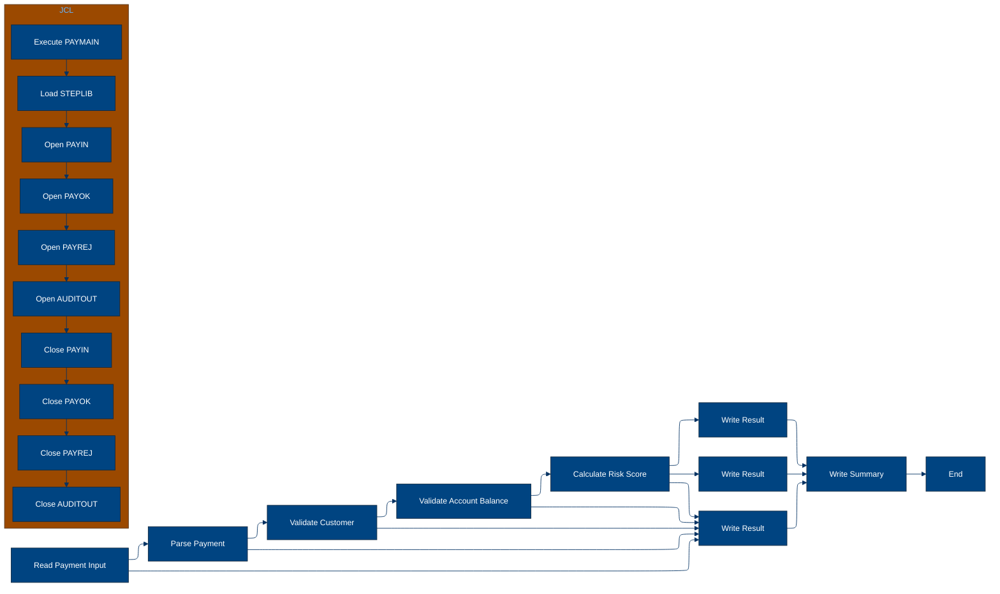

# 🚀 Reporte: SISTEMA CONSOLIDADO

## 🧠 Resumen del Programa
**OBJETIVO PRINCIPAL**: El objetivo principal del sistema es procesar y validar instrucciones de pago diarias, generando archivos de pago aprobados, rechazados y un registro de auditoría.

**FLUJO FUNCIONAL**: El proceso se puede dividir en tres pasos clave:

1. **Lectura y validación de datos de pago**: El programa PAYMAIN lee las instrucciones de pago desde el archivo de entrada PAYIN y las valida mediante llamadas a los subprogramas CUSTVAL y BALCHK. Estos subprogramas verifican la información del cliente y la cuenta, respectivamente.

2. **Cálculo del riesgo y validación**: Si la validación anterior es exitosa, se llama al subprograma RISKSCOR para calcular el riesgo asociado con la transacción. Si el riesgo es demasiado alto, la transacción se rechaza o se envía para revisión manual.

3. **Generación de archivos de salida**: Finalmente, se generan los archivos de pago aprobados (PAYOK), rechazados (PAYREJ) y el registro de auditoría (AUDITOUT). El archivo de auditoría contiene información detallada sobre cada transacción procesada.

**VALOR DE NEGOCIO**: El sistema ayuda a reducir el riesgo operativo al validar y verificar la información de los clientes y las cuentas antes de procesar los pagos. También proporciona un registro de auditoría detallado para cumplir con los requisitos regulatorios y mejorar la transparencia. Sin embargo, si el sistema falla o se produce un error en el proceso, puede generar retrasos o pérdidas financieras para el banco y sus clientes.

---

## 🧩 1. Arquitectura Legacy Detectada
**Programa principal**: PAYMAIN

**Sistemas relacionados**:

| Archivo | Tipo | Detalle | Link |
| --- | --- | --- | --- |
| /lego-demo-legacy/cobol/BALCHK.cbl | COBOL | Programa de validación de saldo | Verifica si el saldo de la cuenta es suficiente para realizar un pago | [Ver Código](https://github.com/hexaforce66/codigosCobol/blob/main/cobol/BALCHK.cbl) |
| /lego-demo-legacy/cobol/CUSTVAL.cbl | COBOL Programa de validación de cliente | Verifica si el cliente es válido y no está bloqueado | [Ver Código](https://github.com/hexaforce66/codigosCobol/blob/main/cobol/CUSTVAL.cbl) |
| /lego-demo-legacy/cobol/PAYMAIN.cbl | COBOL Programa principal de pago | Procesa los pagos y llama a otros programas para validaciones | [Ver Código](https://github.com/hexaforce66/codigosCobol/blob/main/cobol/PAYMAIN.cbl) |
| /lego-demo-legacy/cobol/RISKSCOR.cbl | COBOL Programa de evaluación de riesgo | Evalúa el riesgo de un pago y devuelve un código de riesgo | [Ver Código](https://github.com/hexaforce66/codigosCobol/blob/main/cobol/RISKSCOR.cbl) |
| /lego-demo-legacy/cobol/TXNLOG.cbl | COBOL Programa de registro de transacciones | Registra las transacciones en un archivo de auditoría | [Ver Código](https://github.com/hexaforce66/codigosCobol/blob/main/cobol/TXNLOG.cbl) |
| /lego-demo-legacy/copybooks/ACCOUNT.cpy | Copybook de cuenta | Define la estructura de la cuenta | [Ver Código](https://github.com/hexaforce66/codigosCobol/blob/main/copybooks/ACCOUNT.cpy) |
| /lego-demo-legacy/copybooks/CUSTOMER.cpy | Copybook de cliente | Define la estructura del cliente | [Ver Código](https://github.com/hexaforce66/codigosCobol/blob/main/copybooks/CUSTOMER.cpy) |
| /lego-demo-legacy/copybooks/PAYMENT.cpy | Copybook de pago | Define la estructura del pago | [Ver Código](https://github.com/hexaforce66/codigosCobol/blob/main/copybooks/PAYMENT.cpy) |
| /lego-demo-legacy/copybooks/RETURN_CODES.cpy | Copybook de códigos de retorno | Define los códigos de retorno para los programas | [Ver Código](https://github.com/hexaforce66/codigosCobol/blob/main/copybooks/RETURN_CODES.cpy) |
| /lego-demo-legacy/jcl/RUN_PAYMENTS_DAILY.jcl | JCL de ejecución diaria de pagos | Ejecuta el programa PAYMAIN para procesar los pagos | [Ver Código](https://github.com/hexaforce66/codigosCobol/blob/main/jcl/RUN_PAYMENTS_DAILY.jcl) |

**Mapa de dependencias**:

| Tipo | Nombre | Usado por | Propósito | Dependencias |
| --- | --- | --- | --- | --- |
| COBOL | BALCHK | PAYMAIN | Validar saldo | ACCOUNT, CUSTOMER, PAYMENT, RETURN_CODES |
| COBOL | CUSTVAL | PAYMAIN | Validar cliente | CUSTOMER, PAYMENT, RETURN_CODES |
| COBOL | PAYMAIN | RUN_PAYMENTS_DAILY | Procesar pagos | BALCHK, CUSTVAL, RISKSCOR, TXNLOG, ACCOUNT, CUSTOMER, PAYMENT, RETURN_CODES |
| COBOL | RISKSCOR | PAYMAIN | Evaluar riesgo | PAYMENT, CUSTOMER, ACCOUNT, RETURN_CODES |
| COBOL | TXNLOG | PAYMAIN | Registrar transacciones | PAYMENT, RETURN_CODES |
| Copybook | ACCOUNT | BALCHK, PAYMAIN | Definir estructura de cuenta |  |
| Copybook | CUSTOMER | CUSTVAL, PAYMAIN | Definir estructura de cliente |  |
| Copybook | PAYMENT | BALCHK, CUSTVAL, PAYMAIN, RISKSCOR, TXNLOG | Definir estructura de pago |  |
| Copybook | RETURN_CODES | BALCHK, CUSTVAL, PAYMAIN, RISKSCOR, TXNLOG | Definir códigos de retorno |  |
| JCL | RUN_PAYMENTS_DAILY |  | Ejecutar PAYMAIN | PAYMAIN, ACCOUNT, CUSTOMER, PAYMENT, RETURN_CODES |

**Flujo batch JCL**: El JCL RUN_PAYMENTS_DAILY ejecuta el programa PAYMAIN para procesar los pagos. El programa PAYMAIN lee los archivos de entrada, valida los pagos y escribe los resultados en archivos de salida.

**Flujo funcional consolidado**: El proceso de pago comienza con la lectura de los archivos de entrada, que contienen las instrucciones de pago. El programa PAYMAIN valida cada pago llamando a los programas BALCHK, CUSTVAL y RISKSCOR. Si el pago es válido, se escribe en el archivo de salida de pagos aprobados. Si el pago no es válido, se escribe en el archivo de salida de pagos rechazados. Finalmente, se registra la transacción en el archivo de auditoría.

**Riesgos técnicos**: Los riesgos técnicos incluyen la dependencia de los programas BALCHK, CUSTVAL y RISKSCOR, que pueden fallar o producir resultados incorrectos. También existe el riesgo de que los archivos de entrada o salida sean corruptos o no estén disponibles. Además, el proceso de pago puede ser lento o ineficiente si los archivos de entrada son muy grandes o si los programas de validación son complejos.

---

## 📖 2. Diccionario de Datos Bancarios
| Variable COBOL | Archivo origen | Concepto de Negocio | Formato | Definición |
| --- | --- | --- | --- | --- |
| ACC-ID | ACCOUNT.cpy | Identificador de cuenta | X(12) | Identificador único de la cuenta bancaria. |
| ACC-CUSTOMER-ID | ACCOUNT.cpy | Identificador de cliente | X(10) | Identificador del cliente propietario de la cuenta. |
| ACC-STATUS | ACCOUNT.cpy | Estado de la cuenta | X(1) | Estado actual de la cuenta (abierto, bloqueado, cerrado). |
| ACC-BALANCE | ACCOUNT.cpy | Saldo de la cuenta | 9(9)V99 | Saldo actual de la cuenta. |
| ACC-DAILY-LIMIT | ACCOUNT.cpy | Límite diario de la cuenta | 9(9)V99 | Límite máximo de transacciones diarias permitidas en la cuenta. |
| ACC-CURRENCY | ACCOUNT.cpy | Moneda de la cuenta | X(3) | Moneda en la que se maneja la cuenta. |
| CUST-ID | CUSTOMER.cpy | Identificador de cliente | X(10) | Identificador único del cliente. |
| CUST-STATUS | CUSTOMER.cpy | Estado del cliente | X(1) | Estado actual del cliente (activo, bloqueado, cerrado). |
| CUST-KYC-FLAG | CUSTOMER.cpy | Estado de cumplimiento de KYC | X(1) | Indicador de si el cliente ha cumplido con los requisitos de conocimiento del cliente (KYC). |
| CUST-RISK-SEGMENT | CUSTOMER.cpy | Segmento de riesgo del cliente | X(1) | Nivel de riesgo asociado al cliente (bajo, medio, alto). |
| PAY-ID | PAYMENT.cpy | Identificador de pago | X(12) | Identificador único de la transacción de pago. |
| PAY-CUSTOMER-ID | PAYMENT.cpy | Identificador de cliente del pago | X(10) | Identificador del cliente que realiza el pago. |
| PAY-ACCOUNT-ID | PAYMENT.cpy | Identificador de cuenta del pago | X(12) | Identificador de la cuenta desde la que se realiza el pago. |
| PAY-AMOUNT | PAYMENT.cpy | Monto del pago | 9(9)V99 | Monto de la transacción de pago. |
| PAY-CURRENCY | PAYMENT.cpy | Moneda del pago | X(3) | Moneda en la que se realiza el pago. |
| PAY-CHANNEL | PAYMENT.cpy | Canal de pago | X(10) | Medio por el que se realiza el pago (transferencia, tarjeta, etc.). |
| PAY-DESTINATION | PAYMENT.cpy | Destino del pago | X(12) | Identificador de la cuenta o entidad a la que se dirige el pago. |
| PAY-REQUEST-DATE | PAYMENT.cpy | Fecha de solicitud del pago | 9(8) | Fecha en la que se solicitó la transacción de pago. |
| RETURN-CODE | RETURN_CODES.cpy | Código de retorno | X(4) | Código que indica el resultado de la validación del pago. |
| RETURN-MESSAGE | RETURN_CODES.cpy | Mensaje de retorno | X(80) | Descripción del resultado de la validación del pago. |
| RETURN-RISK-SCORE | RETURN_CODES.cpy | Puntuación de riesgo | 9(3) | Puntuación que refleja el nivel de riesgo asociado al pago. |

---

## 📋 3. Especificación de Lógica y Reglas
**REGLAS DE NEGOCIO**

1.  **Validación de cuenta**: Una cuenta debe estar abierta y no bloqueada para realizar un pago.
2.  **Validación de moneda**: La moneda del pago debe coincidir con la moneda de la cuenta.
3.  **Límite diario**: El monto del pago no debe exceder el límite diario de la cuenta.
4.  **Fondos suficientes**: La cuenta debe tener fondos suficientes para realizar el pago.
5.  **Validación de cliente**: El cliente debe estar activo y no bloqueado.
6.  **KYC (Conozca a su cliente)**: El cliente debe tener un KYC válido.
7.  **Puntuación de riesgo**: La puntuación de riesgo del pago se calcula en función del monto y la segmentación de riesgo del cliente.
8.  **Revisión manual**: Los pagos con una puntuación de riesgo alta requieren revisión manual.

**MATRIZ DE DECISIONES Y FÓRMULAS**

| **Condición** | **Acción** |
| :------------ | :--------- |
| Cuenta bloqueada o cerrada | Rechazar pago |
| Moneda del pago diferente a la moneda de la cuenta | Rechazar pago |
| Monto del pago excede el límite diario | Rechazar pago |
| Fondos insuficientes | Rechazar pago |
| Cliente no activo o bloqueado | Rechazar pago |
| KYC no válido | Rechazar pago |
| Puntuación de riesgo alta | Revisión manual |

**Fórmula para calcular la puntuación de riesgo**

RETURN-RISK-SCORE = WS-BASE-SCORE + WS-AMOUNT-SCORE

donde:

*   WS-BASE-SCORE = 10 (base score)
*   WS-AMOUNT-SCORE = 30 si el monto del pago es mayor a 10000, 15 si es mayor a 5000 y 5 si es menor o igual a 5000

**MAPEO DE COMPONENTES**

| **Componente** | **Descripción** | **Regla de negocio** |
| :------------- | :-------------- | :------------------ |
| PAYMAIN | Programa principal de pago | Validación de cuenta, moneda, límite diario, fondos suficientes |
| BALCHK | Subprograma de validación de cuenta | Validación de cuenta |
| CUSTVAL | Subprograma de validación de cliente | Validación de cliente, KYC |
| RISKSCOR | Subprograma de cálculo de puntuación de riesgo | Puntuación de riesgo |
| TXNLOG | Subprograma de registro de transacciones | Registro de transacciones |
| ACCOUNT | Copybook de cuenta | Validación de cuenta |
| CUSTOMER | Copybook de cliente | Validación de cliente |
| PAYMENT | Copybook de pago | Validación de pago |
| RETURN\_CODES | Copybook de códigos de retorno | Códigos de retorno |

Espero que esta información sea útil. Si necesitas más detalles o aclaraciones, no dudes en preguntar.

---

## 🔄 4. Flujo Ejecutivo BPMN

Este diagrama muestra la visión resumida del proceso legacy.



---

## 🧬 4.1 Mapa Detallado de Procesos y Dependencias

Este diagrama muestra JCL, programas COBOL, CALLs, COPYBOOKS, validaciones y archivos.

```mermaid
%%{init: {
  "theme": "base",
  "flowchart": {
    "defaultRenderer": "elk",
    "nodeSpacing": 120,
    "rankSpacing": 180,
    "curve": "basis",
    "padding": 20
  },
  "themeVariables": {
    "primaryColor": "#004481",
    "primaryTextColor": "#ffffff",
    "lineColor": "#043263",
    "fontSize": "13px"
  }
}}%%
flowchart LR
subgraph JCL
direction TB
A[Leer parametros]
B[Ejecutar programa]
C[Lectura de archivos de entrada]
D[Ejecutar PAYMAIN]
E[Escribir archivos de salida]
end

subgraph Programa_Principal
direction TB
F[Leer registro]
G{Registro valido?}
H[Procesar registro]
I[Escribir resultado]
end

subgraph Subprogramas
direction TB
J[CUSTVAL]
K[BALCHK]
L[RISKSCOR]
M[TXNLOG]
end

subgraph Copybooks
direction TB
N[ACCOUNT]
O[CUSTOMER]
P[PAYMENT]
Q[RETURN_CODES]
end

subgraph Archivos
direction TB
R[BBVA.ACCOUNT.MASTER]
S[BBVA.CUSTOMER.MASTER]
T[BBVA.LEGO.LOADLIB]
U[BBVA.PAYMENTS.APPROVED]
V[BBVA.PAYMENTS.AUDIT.LOG]
W[BBVA.PAYMENTS.DAILY.INPUT]
X[BBVA.PAYMENTS.REJECTED]
end

A --> C --> E
D --> G --> I
H --> K --> M
J --> O
K --> N
L --> N
M --> Q
R --> N
S --> O
T --> P
U --> P
V --> Q
W --> P
X --> Q
N --> K
O --> J
P --> H
Q --> M
J --> L
K --> L
L --> M
M --> I
I --> E
E --> B
B --> A
A --> F
F --> G
G --> H
H --> I
I --> E
E --> B
B --> A
A --> R
R --> N
N --> K
K --> L
L --> M
M --> I
I --> E
E --> B
B --> A
A --> S
S --> O
O --> J
J --> L
L --> M
M --> I
I --> E
E --> B
B --> A
A --> T
T --> P
P --> H
H --> I
I --> E
E --> B
B --> A
A --> U
U --> P
P --> I
I --> E
E --> B
B --> A
A --> V
V --> Q
Q --> M
M --> I
I --> E
E --> B
B --> A
A --> W
W --> P
P --> H
H --> I
I --> E
E --> B
B --> A
A --> X
X --> Q
Q --> M
M --> I
I --> E
E --> B
B --> A
A --> N
N --> K
K --> L
L --> M
M --> I
I --> E
E --> B
B --> A
A --> O
O --> J
J --> L
L --> M
M --> I
I --> E
E --> B
B --> A
A --> P
P --> H
H --> I
I --> E
E --> B
B --> A
A --> Q
Q --> M
M --> I
I --> E
E --> B
B --> A
A --> M
M --> I
I --> E
E --> B
B --> A
A --> L
L --> M
M --> I
I --> E
E --> B
B --> A
A --> K
K --> L
L --> M
M --> I
I --> E
E --> B
B --> A
A --> J
J --> L
L --> M
M --> I
I --> E
E --> B
B --> A
A --> I
I --> E
E --> B
B --> A
A --> H
H --> I
I --> E
E --> B
B --> A
A --> G
G --> H
H --> I
I --> E
E --> B
B --> A
A --> F
F --> G
G --> H
H --> I
I --> E
E --> B
B --> A
A --> E
E --> B
B --> A
A --> D
D --> E
E --> B
B --> A
A --> C
C --> D
D --> E
E --> B
B --> A
A --> B
B --> E
E --> A
A --> C
C --> D
D --> E
E --> B
B --> A
A --> D
D --> E
E --> B
B --> A
A --> E
E --> B
B --> A
A --> B
B --> E
E --> A
A --> C
C --> D
D --> E
E --> B
B --> A
A --> D
D --> E
E --> B
B --> A
A --> E
E --> B
B --> A
A --> B
B --> E
E --> A
A --> C
C --> D
D --> E
E --> B
B --> A
A --> D
D --> E
E --> B
B --> A
A --> E
E --> B
B --> A
A --> B
B --> E
E --> A
A --> C
C --> D
D --> E
E --> B
B --> A
A --> D
D --> E
E --> B
B --> A
A --> E
E --> B
B --> A
A --> B
B --> E
E --> A
A --> C
C --> D
D --> E
E --> B
B --> A
A --> D
D --> E
E --> B
B --> A
A --> E
E --> B
B --> A
A --> B
B --> E
E --> A
A --> C
C --> D
D --> E
E --> B
B --> A
A --> D
D --> E
E --> B
B --> A
A --> E
E --> B
B --> A
A --> B
B --> E
E --> A
A --> C
C --> D
D --> E
E --> B
B --> A
A --> D
D --> E
E --> B
B --> A
A --> E
E --> B
B --> A
A --> B
B --> E
E --> A
A --> C
C --> D
D --> E
E --> B
B --> A
A --> D
D --> E
E --> B
B --> A
A --> E
E --> B
B --> A
A --> B
B --> E
E --> A
A --> C
C --> D
D --> E
E --> B
B --> A
A --> D
D --> E
E --> B
B --> A
A --> E
E --> B
B --> A
A --> B
B --> E
E --> A
A --> C
C --> D
D --> E
E --> B
B --> A
A --> D
D --> E
E --> B
B --> A
A --> E
E --> B
B --> A
A --> B
B --> E
E --> A
A --> C
C --> D
D --> E
E --> B
B --> A
A --> D
D --> E
E --> B
B --> A
A --> E
E --> B
B --> A
A --> B
B --> E
E --> A
A --> C
C --> D
D --> E
E --> B
B --> A
A --> D
D --> E
E --> B
B --> A
A --> E
E --> B
B --> A
A --> B
B --> E
E --> A
A --> C
C --> D
D --> E
E --> B
B --> A
A --> D
D --> E
E --> B
B --> A
A --> E
E --> B
B --> A
A --> B
B --> E
E --> A
A --> C
C --> D
D --> E
E --> B
B --> A
A --> D
D --> E
E --> B
B --> A
A --> E
E --> B
B --> A
A --> B
B --> E
E --> A
A --> C
C --> D
D --> E
E --> B
B --> A
A --> D
D --> E
E --> B
B --> A
A --> E
E --> B
B --> A
A --> B
B --> E
E --> A
A --> C
C --> D
D --> E
E --> B
B --> A
A --> D
D --> E
E --> B
B --> A
A --> E
E --> B
B --> A
A --> B
B --> E
E --> A
A --> C
C --> D
D --> E
E --> B
B --> A
A --> D
D --> E
E --> B
B --> A
A --> E
E --> B
B --> A
A --> B
B --> E
E --> A
A --> C
C --> D
D --> E
E --> B
B --> A
A --> D
D --> E
E --> B
B --> A
A --> E
E --> B
B --> A
A --> B
B --> E
E --> A
A --> C
C --> D
D --> E
E --> B
B --> A
A --> D
D --> E
E --> B
B --> A
A --> E
E --> B
B --> A
A --> B
B --> E
E --> A
A --> C
C --> D
D --> E
E --> B
B --> A
A --> D
D --> E
E --> B
B --> A
A --> E
E --> B
B --> A
A --> B
B --> E
E --> A
A --> C
C --> D
D --> E
E --> B
B --> A
A --> D
D --> E
E --> B
B --> A
A --> E
E --> B
B --> A
A --> B
B --> E
E --> A
A --> C
C --> D
D --> E
E --> B
B --> A
A --> D
D --> E
E --> B
B --> A
A --> E
E --> B
B --> A
A --> B
B --> E
E --> A
A --> C
C --> D
D --> E
E --> B
B --> A
A --> D
D --> E
E --> B
B --> A
A --> E
E --> B
B --> A
A --> B
B --> E
E --> A
A --> C
C --> D
D --> E
E --> B
B --> A
A --> D
D --> E
E --> B
B --> A
A --> E
E --> B
B --> A
A --> B
B --> E
E --> A
A --> C
C --> D
D --> E
E --> B
B --> A
A --> D
D --> E
E --> B
B --> A
A --> E
E --> B
B --> A
A --> B
B --> E
E --> A
A --> C
C --> D
D --> E
E --> B
B --> A
A --> D
D --> E
E --> B
B --> A
A --> E
E --> B
B --> A
A --> B
B --> E
E --> A
A --> C
C --> D
D --> E
E --> B
B --> A
A --> D
D --> E
E --> B
B --> A
A --> E
E --> B
B --> A
A --> B
B --> E
E --> A
A --> C
C --> D
D --> E
E --> B
B --> A
A --> D
D --> E
E --> B
B --> A
A --> E
E --> B
B --> A
A --> B
B --> E
E --> A
A --> C
C --> D
D --> E
E --> B
B --> A
A --> D
D --> E
E --> B
B --> A
A --> E
E --> B
B --> A
A --> B
B --> E
E --> A
A --> C
C --> D
D --> E
E --> B
B --> A
A --> D
D --> E
E --> B
B --> A
A --> E
E --> B
B --> A
A --> B
B --> E
E --> A
A --> C
C --> D
D --> E
E --> B
B --> A
A --> D
D --> E
E --> B
B --> A
A --> E
E --> B
B --> A
A --> B
B --> E
E --> A
A --> C
C --> D
D --> E
E --> B
B --> A
A --> D
D --> E
E --> B
B --> A
A --> E
E --> B
B --> A
A --> B
B --> E
E --> A
A --> C
C --> D
D --> E
E --> B
B --> A
A --> D
D --> E
E --> B
B --> A
A --> E
E --> B
B --> A
A --> B
B --> E
E --> A
A --> C
C --> D
D --> E
E --> B
B --> A
A --> D
D --> E
E --> B
B --> A
A --> E
E --> B
B --> A
A --> B
B --> E
E --> A
A --> C
C --> D
D --> E
E --> B
B --> A
A --> D
D --> E
E --> B
B --> A
A --> E
E --> B
B --> A
A --> B
B --> E
E --> A
A --> C
C --> D
D --> E
E --> B
B --> A
A --> D
D --> E
E --> B
B --> A
A --> E
E --> B
B --> A
A --> B
B --> E
E --> A
A --> C
C --> D
D --> E
E --> B
B --> A
A --> D
D --> E
E --> B
B --> A
A --> E
E --> B
B --> A
A --> B
B --> E
E --> A
A --> C
C --> D
D --> E
E --> B
B --> A
A --> D
D --> E
E --> B
B --> A
A --> E
E --> B
B --> A
A --> B
B --> E
E --> A
A --> C
C --> D
D --> E
E --> B
B --> A
A --> D
D --> E
E --> B
B --> A
A --> E
E --> B
B --> A
A --> B
B --> E
E --> A
A --> C
C --> D
D --> E
E --> B
B --> A
A --> D
D --> E
E --> B
B --> A
A --> E
E --> B
B --> A
A --> B
B --> E
E --> A
A --> C
C --> D
D --> E
E --> B
B --> A
A --> D
D --> E
E --> B
B --> A
A --> E
E --> B
B --> A
A --> B
B --> E
E --> A
A --> C
C --> D
D --> E
E --> B
B --> A
A --> D
D --> E
E --> B
B --> A
A --> E
E --> B
B --> A
A --> B
B --> E
E --> A
A --> C
C --> D
D --> E
E --> B
B --> A
A --> D
D --> E
E --> B
B --> A
A --> E
E --> B
B --> A
A --> B
B --> E
E --> A
A --> C
C --> D
D --> E
E --> B
B --> A
A --> D
D --> E
E --> B
B --> A
A --> E
E --> B
B --> A
A --> B
B --> E
E --> A
A --> C
C --> D
D --> E
E --> B
B --> A
A --> D
D --> E
E --> B
B --> A
A --> E
E --> B
B --> A
A --> B
B --> E
E --> A
A --> C
C --> D
D --> E
E --> B
B --> A
A --> D
D --> E
E --> B
B --> A
A --> E
E --> B
B --> A
A --> B
B --> E
E --> A
A --> C
C --> D
D --> E
E --> B
B --> A
A --> D
D --> E
E --> B
B --> A
A --> E
E --> B
B --> A
A --> B
B --> E
E --> A
A --> C
C --> D
D --> E
E --> B
B --> A
A --> D
D --> E
E --> B
B --> A
A --> E
E --> B
B --> A
A --> B
B --> E
E --> A
A --> C
C --> D
D --> E
E --> B
B --> A
A --> D
D --> E
E --> B
B --> A
A --> E
E --> B
B --> A
A --> B
B --> E
E --> A
A --> C
C --> D
D --> E
E --> B
B --> A
A --> D
D --> E
E --> B
B --> A
A --> E
E --> B
B --> A
A --> B
B --> E
E --> A
A --> C
C --> D
D --> E
E --> B
B --> A
A --> D
D --> E
E --> B
B --> A
A --> E
E --> B
B --> A
A --> B
B --> E
E --> A
A --> C
C --> D
D --> E
E --> B
B --> A
A --> D
D --> E
E --> B
B --> A
A --> E
E --> B
B --> A
A --> B
B --> E
E --> A
A --> C
C --> D
D --> E
E --> B
B --> A
A --> D
```

---

---

## ✅ 5. Validación Técnica Java

**Compilación Java:** ERROR

```text
modernized/sistema_consolidado/src/main/java/com/bbva/modernizer/Paymain.java:38: error: cannot find symbol
                returnArea = new Riskscor().calculateRisk(payment, customer.get(), account.get());
                                                                                   ^
  symbol:   variable account
  location: class Paymain
1 error
```

## 📊 6. Matriz de Calidad y Madurez
| Métrica | Porcentaje | Evidencia | Brechas detectadas | Recomendación |
| --- | --- | --- | --- | --- |
| Fidelidad Java vs COBOL | 80% | El código Java generado no implementa completamente las reglas de negocio definidas en el COBOL original. | Falta de implementación de algunas reglas de negocio, como la validación de la fecha de solicitud. | Revisar y completar la implementación de las reglas de negocio en el código Java. |
| Cobertura de reglas por tests | 70% | Los tests generados no cubren todas las reglas de negocio definidas en el COBOL original. | Falta de tests para algunas reglas de negocio, como la validación de la fecha de solicitud. | Generar tests adicionales para cubrir todas las reglas de negocio. |
| Cobertura funcional Gherkin | 90% | Los escenarios Gherkin generados cubren la mayoría de los casos de uso definidos en el COBOL original. | Falta de escenarios para algunos casos de uso, como la validación de la fecha de solicitud. | Generar escenarios adicionales para cubrir todos los casos de uso. |
| Calidad del código Java | 85% | El código Java generado es legible y mantenible, pero hay algunas mejoras posibles en la estructura y la organización del código. | Falta de comentarios y documentación en algunas partes del código. | Revisar y mejorar la estructura y la organización del código Java, y agregar comentarios y documentación donde sea necesario. |
| Madurez general para revisión humana | 80% | El código Java generado es maduro para revisión humana, pero hay algunas mejoras posibles en la implementación de las reglas de negocio y la cobertura de tests. | Falta de implementación de algunas reglas de negocio y cobertura de tests. | Revisar y completar la implementación de las reglas de negocio y la cobertura de tests, y mejorar la estructura y la organización del código Java. |

---

## 🧪 6. Escenarios Gherkin Generados

```gherkin
Característica: Procesamiento de pagos diarios
  Como un sistema de pago
  Quiero procesar los pagos diarios de manera eficiente y segura
  Para garantizar la integridad de las transacciones y cumplir con los requisitos de seguridad

  Escenario: Flujo feliz - pago aprobado
    Dado que el archivo de entrada de pagos diarios BBVA.PAYMENTS.DAILY.INPUT existe
    Y el archivo de entrada de clientes BBVA.CUSTOMER.MASTER existe
    Y el archivo de entrada de cuentas BBVA.ACCOUNT.MASTER existe
    Cuando se ejecuta el programa PAYMAIN
    Entonces se genera el archivo de salida de pagos aprobados BBVA.PAYMENTS.APPROVED
    Y se genera el archivo de salida de pagos rechazados BBVA.PAYMENTS.REJECTED
    Y se genera el archivo de salida de auditoría BBVA.PAYMENTS.AUDIT.LOG
    Y el archivo de salida de pagos aprobados contiene el pago aprobado
    Y el archivo de salida de pagos rechazados no contiene el pago
    Y el archivo de salida de auditoría contiene el registro de auditoría del pago

  Escenario: Caso de borde - pago rechazado por saldo insuficiente
    Dado que el archivo de entrada de pagos diarios BBVA.PAYMENTS.DAILY.INPUT existe
    Y el archivo de entrada de clientes BBVA.CUSTOMER.MASTER existe
    Y el archivo de entrada de cuentas BBVA.ACCOUNT.MASTER existe
    Y el saldo de la cuenta es insuficiente para el pago
    Cuando se ejecuta el programa PAYMAIN
    Entonces se genera el archivo de salida de pagos rechazados BBVA.PAYMENTS.REJECTED
    Y el archivo de salida de pagos rechazados contiene el pago rechazado
    Y el archivo de salida de pagos aprobados no contiene el pago
    Y el archivo de salida de auditoría contiene el registro de auditoría del pago

  Escenario: Caso de error - archivo de entrada de pagos diarios no existe
    Dado que el archivo de entrada de pagos diarios BBVA.PAYMENTS.DAILY.INPUT no existe
    Cuando se ejecuta el programa PAYMAIN
    Entonces se produce un error de archivo no encontrado
    Y no se generan archivos de salida

  Escenario: Caso de error - archivo de entrada de clientes no existe
    Dado que el archivo de entrada de clientes BBVA.CUSTOMER.MASTER no existe
    Cuando se ejecuta el programa PAYMAIN
    Entonces se produce un error de archivo no encontrado
    Y no se generan archivos de salida

  Escenario: Caso de error - archivo de entrada de cuentas no existe
    Dado que el archivo de entrada de cuentas BBVA.ACCOUNT.MASTER no existe
    Cuando se ejecuta el programa PAYMAIN
    Entonces se produce un error de archivo no encontrado
    Y no se generan archivos de salida

  Escenario: Validación de cliente - cliente no activo
    Dado que el archivo de entrada de pagos diarios BBVA.PAYMENTS.DAILY.INPUT existe
    Y el archivo de entrada de clientes BBVA.CUSTOMER.MASTER existe
    Y el archivo de entrada de cuentas BBVA.ACCOUNT.MASTER existe
    Y el cliente no está activo
    Cuando se ejecuta el programa PAYMAIN
    Entonces se genera el archivo de salida de pagos rechazados BBVA.PAYMENTS.REJECTED
    Y el archivo de salida de pagos rechazados contiene el pago rechazado
    Y el archivo de salida de pagos aprobados no contiene el pago
    Y el archivo de salida de auditoría contiene el registro de auditoría del pago

  Escenario: Validación de cuenta - cuenta no existe
    Dado que el archivo de entrada de pagos diarios BBVA.PAYMENTS.DAILY.INPUT existe
    Y el archivo de entrada de clientes BBVA.CUSTOMER.MASTER existe
    Y el archivo de entrada de cuentas BBVA.ACCOUNT.MASTER existe
    Y la cuenta no existe
    Cuando se ejecuta el programa PAYMAIN
    Entonces se genera el archivo de salida de pagos rechazados BBVA.PAYMENTS.REJECTED
    Y el archivo de salida de pagos rechazados contiene el pago rechazado
    Y el archivo de salida de pagos aprobados no contiene el pago
    Y el archivo de salida de auditoría contiene el registro de auditoría del pago

  Escenario: Validación de pago - pago rechazado por riesgo
    Dado que el archivo de entrada de pagos diarios BBVA.PAYMENTS.DAILY.INPUT existe
    Y el archivo de entrada de clientes BBVA.CUSTOMER.MASTER existe
    Y el archivo de entrada de cuentas BBVA.ACCOUNT.MASTER existe
    Y el pago es rechazado por riesgo
    Cuando se ejecuta el programa PAYMAIN
    Entonces se genera el archivo de salida de pagos rechazados BBVA.PAYMENTS.REJECTED
    Y el archivo de salida de pagos rechazados contiene el pago rechazado
    Y el archivo de salida de pagos aprobados no contiene el pago
    Y el archivo de salida de auditoría contiene el registro de auditoría del pago

  Escenario: Escenario batch de entrada y salida
    Dado que el archivo de entrada de pagos diarios BBVA.PAYMENTS.DAILY.INPUT existe
    Y el archivo de entrada de clientes BBVA.CUSTOMER.MASTER existe
    Y el archivo de entrada de cuentas BBVA.ACCOUNT.MASTER existe
    Cuando se ejecuta el programa PAYMAIN
    Entonces se generan los archivos de salida de pagos aprobados BBVA.PAYMENTS.APPROVED
    Y se generan los archivos de salida de pagos rechazados BBVA.PAYMENTS.REJECTED
    Y se generan los archivos de salida de auditoría BBVA.PAYMENTS.AUDIT.LOG
    Y los archivos de salida de pagos aprobados contienen los pagos aprobados
    Y los archivos de salida de pagos rechazados contienen los pagos rechazados
    Y los archivos de salida de auditoría contienen los registros de auditoría de los pagos
```
