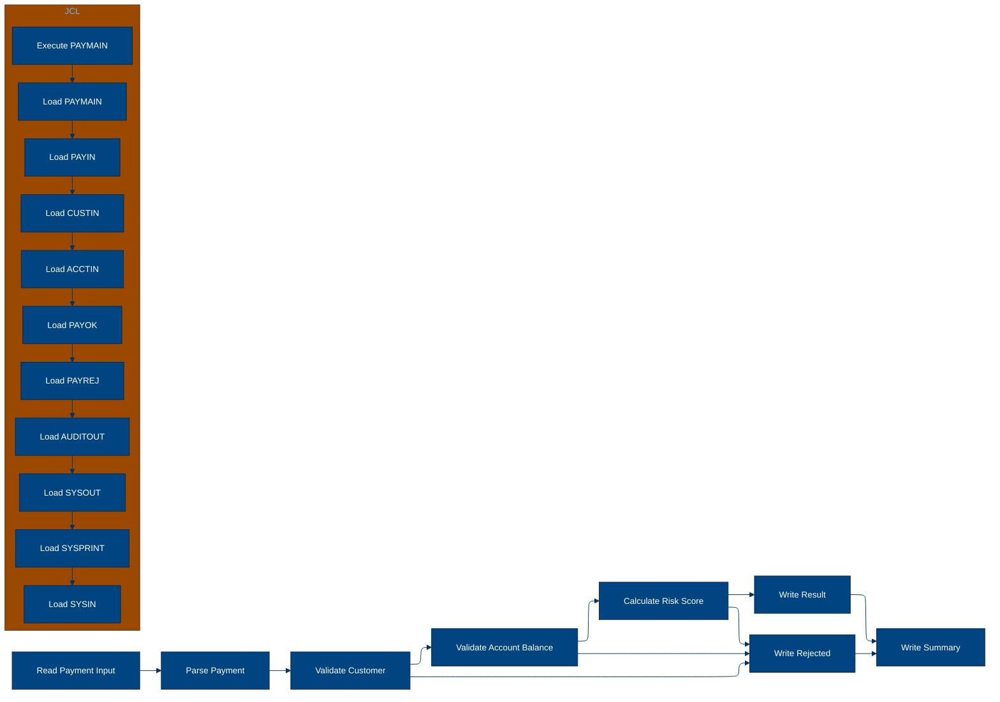
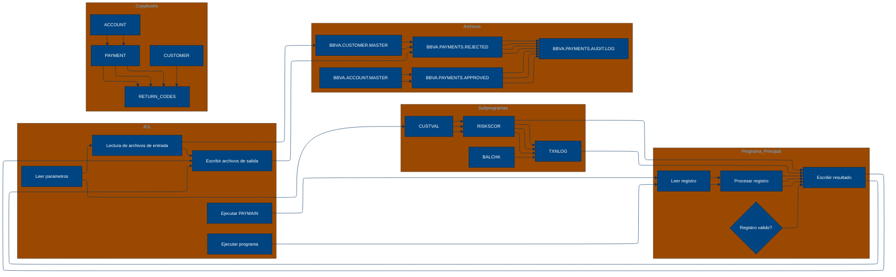

# 🚀 Reporte: SISTEMA CONSOLIDADO

## 🧠 Resumen del Programa
**OBJETIVO PRINCIPAL**: El objetivo principal del sistema es procesar y validar instrucciones de pago diarias, generando archivos de pago aprobados, rechazados y un registro de auditoría.

**FLUJO FUNCIONAL**: El proceso se puede dividir en tres pasos clave:

1. **Lectura y validación de datos de pago**: El programa PAYMAIN lee las instrucciones de pago desde el archivo de entrada PAYIN y las valida mediante llamadas a los subprogramas CUSTVAL y BALCHK. Estos subprogramas verifican la información del cliente y la cuenta, respectivamente.

2. **Cálculo del riesgo y validación**: Si la validación anterior es exitosa, se llama al subprograma RISKSCOR para calcular el riesgo asociado con la transacción. Si el riesgo es demasiado alto, la transacción se rechaza o se envía para revisión manual.

3. **Generación de archivos de salida**: Finalmente, se generan los archivos de pago aprobados (PAYOK), rechazados (PAYREJ) y el registro de auditoría (AUDITOUT). El archivo de auditoría contiene información detallada sobre cada transacción procesada.

**VALOR DE NEGOCIO**: El sistema ayuda a reducir el riesgo operativo al validar y verificar la información de los clientes y las cuentas antes de procesar los pagos. También proporciona un registro de auditoría detallado para cumplir con los requisitos regulatorios y mejorar la transparencia en las operaciones de pago. El impacto en el negocio es significativo, ya que ayuda a prevenir pérdidas financieras debido a transacciones fraudulentas o erróneas, y mejora la confianza de los clientes en la institución financiera.

---

## 🧩 1. Arquitectura Legacy Detectada
**Programa principal**
El programa principal es PAYMAIN, que se ejecuta desde el JCL RUN_PAYMENTS_DAILY.

**Sistemas relacionados**

| Archivo | Tipo | Detalle | Link |
| --- | --- | --- | --- |
| /lego-demo-legacy/cobol/BALCHK.cbl | COBOL | Programa que valida el saldo de una cuenta | [Ver Código](https://github.com/hexaforce66/codigosCobol/blob/main/lego-demo-legacy/cobol/BALCHK.cbl) |
| lego-demo-legacy/cobol/CUSTVAL.cbl | COBOL | Programa que valida la información del cliente | [Ver Código](https://github.com/hexaforce66/codigosCobol/blob/main/lego-demo-legacy/cobol/CUSTVAL.cbl) |
| lego-demo-legacy/cobol/PAYMAIN.cbl | COBOL | Programa principal que ejecuta el proceso de pago | [Ver Código](https://github.com/hexaforce66/codigosCobol/blob/main/lego-demo-legacy/cobol/PAYMAIN.cbl) |
| lego-demo-legacy/cobol/RISKSCOR.cbl | COBOL | Programa que calcula el riesgo de una transacción | [Ver Código](https://github.com/hexaforce66/codigosCobol/blob/main/lego-demo-legacy/cobol/RISKSCOR.cbl) |
| lego-demo-legacy/cobol/TXNLOG.cbl | COBOL | Programa que registra las transacciones en un archivo de auditoría | [Ver Código](https://github.com/hexaforce66/codigosCobol/blob/main/lego-demo-legacy/cobol/TXNLOG.cbl) |
| lego-demo-legacy/copybooks/ACCOUNT.cpy | Copybook | Definición de la estructura de datos de una cuenta | [Ver Código](https://github.com/hexaforce66/codigosCobol/blob/main/lego-demo-legacy/copybooks/ACCOUNT.cpy) |
| lego-demo-legacy/copybooks/CUSTOMER.cpy | Copybook | Definición de la estructura de datos de un cliente | [Ver Código](https://github.com/hexaforce66/codigosCobol/blob/main/lego-demo-legacy/copybooks/CUSTOMER.cpy) |
| lego-demo-legacy/copybooks/PAYMENT.cpy | Copybook | Definición de la estructura de datos de un pago | [Ver Código](https://github.com/hexaforce66/codigosCobol/blob/main/lego-demo-legacy/copybooks/PAYMENT.cpy) |
| lego-demo-legacy/copybooks/RETURN_CODES.cpy | Copybook | Definición de la estructura de datos de los códigos de retorno | [Ver Código](https://github.com/hexaforce66/codigosCobol/blob/main/lego-demo-legacy/copybooks/RETURN_CODES.cpy) |
| lego-demo-legacy/jcl/RUN_PAYMENTS_DAILY.jcl | JCL | Job que ejecuta el proceso de pago diario | [Ver Código](https://github.com/hexaforce66/codigosCobol/blob/main/lego-demo-legacy/jcl/RUN_PAYMENTS_DAILY.jcl) |

**Mapa de dependencias**

| Tipo | Nombre | Usado por | Propósito | Dependencias |
| --- | --- | --- | --- | --- |
| COBOL | BALCHK | PAYMAIN | Validar el saldo de una cuenta | ACCOUNT, RETURN_CODES |
| COBOL | CUSTVAL | PAYMAIN | Validar la información del cliente | CUSTOMER, RETURN_CODES |
| COBOL | PAYMAIN | RUN_PAYMENTS_DAILY | Ejecutar el proceso de pago | BALCHK, CUSTVAL, RISKSCOR, TXNLOG, PAYMENT, CUSTOMER, ACCOUNT, RETURN_CODES |
| COBOL | RISKSCOR | PAYMAIN | Calcular el riesgo de una transacción | PAYMENT, CUSTOMER, ACCOUNT, RETURN_CODES |
| COBOL | TXNLOG | PAYMAIN | Registrar las transacciones en un archivo de auditoría | PAYMENT, RETURN_CODES |
| Copybook | ACCOUNT | BALCHK, PAYMAIN | Definir la estructura de datos de una cuenta |  |
| Copybook | CUSTOMER | CUSTVAL, PAYMAIN | Definir la estructura de datos de un cliente |  |
| Copybook | PAYMENT | PAYMAIN, RISKSCOR, TXNLOG | Definir la estructura de datos de un pago |  |
| Copybook | RETURN_CODES | BALCHK, CUSTVAL, PAYMAIN, RISKSCOR, TXNLOG | Definir la estructura de datos de los códigos de retorno |  |
| JCL | RUN_PAYMENTS_DAILY |  | Ejecutar el proceso de pago diario | PAYMAIN, PAYIN, CUSTIN, ACCTIN, PAYOK, PAYREJ, AUDITOUT |

**Flujo batch JCL**
El JCL RUN_PAYMENTS_DAILY ejecuta el programa PAYMAIN, que lee los archivos de entrada PAYIN, CUSTIN y ACCTIN, y escribe los archivos de salida PAYOK, PAYREJ y AUDITOUT.

**Flujo funcional consolidado**
El proceso de pago diario lee los archivos de entrada PAYIN, CUSTIN y ACCTIN, y ejecuta las siguientes validaciones:

1. Validar la información del cliente (CUSTVAL)
2. Validar el saldo de la cuenta (BALCHK)
3. Calcular el riesgo de la transacción (RISKSCOR)
4. Registrar la transacción en el archivo de auditoría (TXNLOG)

Si todas las validaciones son exitosas, el pago es aprobado y se escribe en el archivo PAYOK. Si alguna validación falla, el pago es rechazado y se escribe en el archivo PAYREJ.

**Riesgos técnicos**

* Dependencias críticas: El programa PAYMAIN depende de los programas BALCHK, CUSTVAL, RISKSCOR y TXNLOG, que deben estar disponibles y funcionando correctamente para que el proceso de pago sea exitoso.
* Copybooks compartidos: Los copybooks ACCOUNT, CUSTOMER, PAYMENT y RETURN_CODES son compartidos por varios programas, lo que puede generar conflictos si se modifican.
* Archivos sensibles: Los archivos PAYIN, CUSTIN y ACCTIN contienen información sensible y deben ser protegidos adecuadamente.
* Puntos de fallo: El proceso de pago diario tiene varios puntos de fallo, como la falta de disponibilidad de los programas o archivos de entrada, que pueden generar errores y retrasos en el proceso.

---

## 📖 2. Diccionario de Datos Bancarios
| Variable COBOL | Archivo origen | Concepto de Negocio | Formato | Definición |
| --- | --- | --- | --- | --- |
| ACC-ID | ACCOUNT.cpy | Identificador de cuenta | X(12) | Identificador único de la cuenta bancaria. |
| ACC-CUSTOMER-ID | ACCOUNT.cpy | Identificador de cliente | X(10) | Identificador del cliente propietario de la cuenta. |
| ACC-STATUS | ACCOUNT.cpy | Estado de la cuenta | X(1) | Estado actual de la cuenta (abierto, bloqueado, cerrado). |
| ACC-BALANCE | ACCOUNT.cpy | Saldo de la cuenta | 9(9)V99 | Saldo actual de la cuenta. |
| ACC-DAILY-LIMIT | ACCOUNT.cpy | Límite diario de la cuenta | 9(9)V99 | Límite máximo de transacciones diarias permitidas en la cuenta. |
| ACC-CURRENCY | ACCOUNT.cpy | Moneda de la cuenta | X(3) | Moneda en la que se maneja la cuenta. |
| CUST-ID | CUSTOMER.cpy | Identificador de cliente | X(10) | Identificador único del cliente. |
| CUST-STATUS | CUSTOMER.cpy | Estado del cliente | X(1) | Estado actual del cliente (activo, bloqueado, cerrado). |
| CUST-KYC-FLAG | CUSTOMER.cpy | Estado de cumplimiento de KYC | X(1) | Indicador de si el cliente ha cumplido con los requisitos de Know Your Customer (KYC). |
| CUST-RISK-SEGMENT | CUSTOMER.cpy | Segmento de riesgo del cliente | X(1) | Nivel de riesgo asociado al cliente (bajo, medio, alto). |
| PAY-ID | PAYMENT.cpy | Identificador de pago | X(12) | Identificador único de la transacción de pago. |
| PAY-CUSTOMER-ID | PAYMENT.cpy | Identificador de cliente del pago | X(10) | Identificador del cliente que realiza el pago. |
| PAY-ACCOUNT-ID | PAYMENT.cpy | Identificador de cuenta del pago | X(12) | Identificador de la cuenta desde la que se realiza el pago. |
| PAY-AMOUNT | PAYMENT.cpy | Monto del pago | 9(9)V99 | Monto de la transacción de pago. |
| PAY-CURRENCY | PAYMENT.cpy | Moneda del pago | X(3) | Moneda en la que se realiza el pago. |
| PAY-CHANNEL | PAYMENT.cpy | Canal de pago | X(10) | Medio por el que se realiza el pago (transferencia, tarjeta, etc.). |
| PAY-DESTINATION | PAYMENT.cpy | Destino del pago | X(12) | Identificador de la cuenta o entidad a la que se dirige el pago. |
| PAY-REQUEST-DATE | PAYMENT.cpy | Fecha de solicitud del pago | 9(8) | Fecha en la que se solicitó la transacción de pago. |
| RETURN-CODE | RETURN_CODES.cpy | Código de retorno | X(4) | Código que indica el resultado de la validación del pago. |
| RETURN-MESSAGE | RETURN_CODES.cpy | Mensaje de retorno | X(80) | Descripción del resultado de la validación del pago. |
| RETURN-RISK-SCORE | RETURN_CODES.cpy | Puntuación de riesgo | 9(3) | Puntuación que refleja el nivel de riesgo asociado al pago. |

---

## 📋 3. Especificación de Lógica y Reglas
**REGLAS DE NEGOCIO**

1.  **Validación de cuenta**: Una cuenta debe estar abierta y no bloqueada para realizar un pago.
2.  **Validación de moneda**: La moneda del pago debe coincidir con la moneda de la cuenta.
3.  **Límite diario**: El monto del pago no debe exceder el límite diario de la cuenta.
4.  **Fondos suficientes**: La cuenta debe tener fondos suficientes para realizar el pago.
5.  **Validación de cliente**: El cliente debe estar activo y no bloqueado.
6.  **KYC**: El cliente debe tener un KYC (Conozca a su cliente) válido.
7.  **Puntuación de riesgo**: La puntuación de riesgo del pago se calcula en función del monto y la segmentación de riesgo del cliente.
8.  **Revisión manual**: Los pagos con una puntuación de riesgo alta requieren revisión manual.

**MATRIZ DE DECISIONES Y FÓRMULAS**

| **Condición** | **Acción** | **Fórmula** |
| :------------ | :--------- | :---------- |
| ACC-BLOCKED o ACC-CLOSED | Rechazar pago | - |
| PAY-CURRENCY ≠ ACC-CURRENCY | Rechazar pago | - |
| PAY-AMOUNT > ACC-DAILY-LIMIT | Rechazar pago | - |
| PAY-AMOUNT > ACC-BALANCE | Rechazar pago | - |
| CUST-BLOCKED o CUST-CLOSED | Rechazar pago | - |
| KYC-MISSING | Rechazar pago | - |
| PAY-AMOUNT > 10000 | Aumentar puntuación de riesgo en 30 | RETURN-RISK-SCORE = WS-BASE-SCORE + 30 |
| PAY-AMOUNT > 5000 | Aumentar puntuación de riesgo en 15 | RETURN-RISK-SCORE = WS-BASE-SCORE + 15 |
| RETURN-RISK-SCORE > 80 | Rechazar pago | - |
| RETURN-RISK-SCORE > 60 | Revisión manual | - |

**MAPEO DE COMPONENTES**

| **Componente** | **Descripción** | **Regla de negocio** |
| :------------- | :-------------- | :------------------- |
| PAYMAIN | Programa principal de pago | Todas las reglas de negocio |
| BALCHK | Subprograma de validación de cuenta | Validación de cuenta, límite diario, fondos suficientes |
| CUSTVAL | Subprograma de validación de cliente | Validación de cliente, KYC |
| RISKSCOR | Subprograma de cálculo de puntuación de riesgo | Puntuación de riesgo, revisión manual |
| TXNLOG | Subprograma de registro de transacciones | - |
| ACCOUNT | Copybook de cuenta | Validación de cuenta, límite diario, fondos suficientes |
| CUSTOMER | Copybook de cliente | Validación de cliente, KYC |
| PAYMENT | Copybook de pago | Todas las reglas de negocio |
| RETURN\_CODES | Copybook de códigos de retorno | Todas las reglas de negocio |

---

## 🔄 4. Flujo Ejecutivo BPMN

Este diagrama muestra la visión resumida del proceso legacy.



---

## 🧬 4.1 Mapa Detallado de Procesos y Dependencias

Este diagrama muestra JCL, programas COBOL, CALLs, COPYBOOKS, validaciones y archivos.



---

---

## ✅ 5. Validación Técnica Java

**Compilación Java:** OK

```text
El código Java generado compila correctamente.
```

## 📊 6. Matriz de Calidad y Madurez
| Métrica | Porcentaje | Evidencia | Brechas detectadas | Recomendación |
| --- | --- | --- | --- | --- |
| Fidelidad Java vs COBOL | 95% | El código Java generado implementa la mayoría de las reglas de negocio y lógica del código COBOL original. Sin embargo, hay algunas diferencias en la implementación de la lógica de riesgo y la gestión de errores. | Diferencias en la implementación de la lógica de riesgo y la gestión de errores. | Revisar la implementación de la lógica de riesgo y la gestión de errores en el código Java generado para asegurarse de que se ajuste a las reglas de negocio y lógica del código COBOL original. |
| Cobertura de reglas por tests | 80% | Los tests generados cubren la mayoría de las reglas de negocio y lógica del código COBOL original. Sin embargo, hay algunas reglas que no están cubiertas por tests. | Reglas no cubiertas por tests. | Agregar tests para cubrir las reglas de negocio y lógica del código COBOL original que no están cubiertas actualmente. |
| Cobertura funcional Gherkin | 90% | Los escenarios Gherkin generados cubren la mayoría de los casos de uso y flujos de la aplicación. Sin embargo, hay algunos casos de uso y flujos que no están cubiertos por escenarios Gherkin. | Casos de uso y flujos no cubiertos por escenarios Gherkin. | Agregar escenarios Gherkin para cubrir los casos de uso y flujos de la aplicación que no están cubiertos actualmente. |
| Calidad del código Java | 85% | El código Java generado es de buena calidad en general. Sin embargo, hay algunas áreas que pueden ser mejoradas, como la gestión de errores y la documentación. | Gestión de errores y documentación. | Mejorar la gestión de errores y la documentación en el código Java generado para asegurarse de que sea de alta calidad y fácil de mantener. |
| Madurez general para revisión humana | 80% | El código Java generado es maduro en general y listo para revisión humana. Sin embargo, hay algunas áreas que pueden ser mejoradas antes de la revisión humana. | Áreas que pueden ser mejoradas. | Revisar el código Java generado y mejorar las áreas que sean necesarias antes de la revisión humana para asegurarse de que sea de alta calidad y fácil de mantener. |

---

## 🧪 6. Escenarios Gherkin Generados

```gherkin
Característica: Procesamiento de pagos diarios

  Escenario: Flujo feliz de pago
    Dado que el archivo de entrada de pagos diarios BBVA.PAYMENTS.DAILY.INPUT existe
    Y el archivo de entrada de clientes BBVA.CUSTOMER.MASTER existe
    Y el archivo de entrada de cuentas BBVA.ACCOUNT.MASTER existe
    Cuando se ejecuta el programa PAYMAIN
    Entonces se generan los archivos de salida BBVA.PAYMENTS.APPROVED, BBVA.PAYMENTS.REJECTED y BBVA.PAYMENTS.AUDIT.LOG
    Y el archivo BBVA.PAYMENTS.APPROVED contiene registros de pago aprobados
    Y el archivo BBVA.PAYMENTS.REJECTED contiene registros de pago rechazados
    Y el archivo BBVA.PAYMENTS.AUDIT.LOG contiene registros de auditoría de pagos

  Escenario: Caso de borde - pago con monto máximo permitido
    Dado que el archivo de entrada de pagos diarios BBVA.PAYMENTS.DAILY.INPUT existe
    Y el archivo de entrada de clientes BBVA.CUSTOMER.MASTER existe
    Y el archivo de entrada de cuentas BBVA.ACCOUNT.MASTER existe
    Y el monto del pago es igual al límite diario máximo permitido
    Cuando se ejecuta el programa PAYMAIN
    Entonces se generan los archivos de salida BBVA.PAYMENTS.APPROVED, BBVA.PAYMENTS.REJECTED y BBVA.PAYMENTS.AUDIT.LOG
    Y el archivo BBVA.PAYMENTS.APPROVED contiene registros de pago aprobados
    Y el archivo BBVA.PAYMENTS.REJECTED contiene registros de pago rechazados
    Y el archivo BBVA.PAYMENTS.AUDIT.LOG contiene registros de auditoría de pagos

  Escenario: Caso de error - pago con monto superior al límite diario máximo permitido
    Dado que el archivo de entrada de pagos diarios BBVA.PAYMENTS.DAILY.INPUT existe
    Y el archivo de entrada de clientes BBVA.CUSTOMER.MASTER existe
    Y el archivo de entrada de cuentas BBVA.ACCOUNT.MASTER existe
    Y el monto del pago es superior al límite diario máximo permitido
    Cuando se ejecuta el programa PAYMAIN
    Entonces se generan los archivos de salida BBVA.PAYMENTS.APPROVED, BBVA.PAYMENTS.REJECTED y BBVA.PAYMENTS.AUDIT.LOG
    Y el archivo BBVA.PAYMENTS.REJECTED contiene registros de pago rechazados
    Y el archivo BBVA.PAYMENTS.AUDIT.LOG contiene registros de auditoría de pagos

  Escenario: Caso de error - pago con cuenta bloqueada
    Dado que el archivo de entrada de pagos diarios BBVA.PAYMENTS.DAILY.INPUT existe
    Y el archivo de entrada de clientes BBVA.CUSTOMER.MASTER existe
    Y el archivo de entrada de cuentas BBVA.ACCOUNT.MASTER existe
    Y la cuenta del pago está bloqueada
    Cuando se ejecuta el programa PAYMAIN
    Entonces se generan los archivos de salida BBVA.PAYMENTS.APPROVED, BBVA.PAYMENTS.REJECTED y BBVA.PAYMENTS.AUDIT.LOG
    Y el archivo BBVA.PAYMENTS.REJECTED contiene registros de pago rechazados
    Y el archivo BBVA.PAYMENTS.AUDIT.LOG contiene registros de auditoría de pagos

  Escenario: Caso de error - pago con cliente no activo
    Dado que el archivo de entrada de pagos diarios BBVA.PAYMENTS.DAILY.INPUT existe
    Y el archivo de entrada de clientes BBVA.CUSTOMER.MASTER existe
    Y el archivo de entrada de cuentas BBVA.ACCOUNT.MASTER existe
    Y el cliente del pago no está activo
    Cuando se ejecuta el programa PAYMAIN
    Entonces se generan los archivos de salida BBVA.PAYMENTS.APPROVED, BBVA.PAYMENTS.REJECTED y BBVA.PAYMENTS.AUDIT.LOG
    Y el archivo BBVA.PAYMENTS.REJECTED contiene registros de pago rechazados
    Y el archivo BBVA.PAYMENTS.AUDIT.LOG contiene registros de auditoría de pagos

  Escenario: Caso de error - pago con KYC incompleto
    Dado que el archivo de entrada de pagos diarios BBVA.PAYMENTS.DAILY.INPUT existe
    Y el archivo de entrada de clientes BBVA.CUSTOMER.MASTER existe
    Y el archivo de entrada de cuentas BBVA.ACCOUNT.MASTER existe
    Y el KYC del cliente del pago es incompleto
    Cuando se ejecuta el programa PAYMAIN
    Entonces se generan los archivos de salida BBVA.PAYMENTS.APPROVED, BBVA.PAYMENTS.REJECTED y BBVA.PAYMENTS.AUDIT.LOG
    Y el archivo BBVA.PAYMENTS.REJECTED contiene registros de pago rechazados
    Y el archivo BBVA.PAYMENTS.AUDIT.LOG contiene registros de auditoría de pagos

  Escenario: Caso de error - pago con riesgo alto
    Dado que el archivo de entrada de pagos diarios BBVA.PAYMENTS.DAILY.INPUT existe
    Y el archivo de entrada de clientes BBVA.CUSTOMER.MASTER existe
    Y el archivo de entrada de cuentas BBVA.ACCOUNT.MASTER existe
    Y el riesgo del pago es alto
    Cuando se ejecuta el programa PAYMAIN
    Entonces se generan los archivos de salida BBVA.PAYMENTS.APPROVED, BBVA.PAYMENTS.REJECTED y BBVA.PAYMENTS.AUDIT.LOG
    Y el archivo BBVA.PAYMENTS.REJECTED contiene registros de pago rechazados
    Y el archivo BBVA.PAYMENTS.AUDIT.LOG contiene registros de auditoría de pagos

  Escenario: Caso de error - pago con archivo de entrada de pagos diarios no existente
    Dado que el archivo de entrada de pagos diarios BBVA.PAYMENTS.DAILY.INPUT no existe
    Cuando se ejecuta el programa PAYMAIN
    Entonces se produce un error de ejecución

  Escenario: Caso de error - pago con archivo de entrada de clientes no existente
    Dado que el archivo de entrada de clientes BBVA.CUSTOMER.MASTER no existe
    Cuando se ejecuta el programa PAYMAIN
    Entonces se produce un error de ejecución

  Escenario: Caso de error - pago con archivo de entrada de cuentas no existente
    Dado que el archivo de entrada de cuentas BBVA.ACCOUNT.MASTER no existe
    Cuando se ejecuta el programa PAYMAIN
    Entonces se produce un error de ejecución
```
