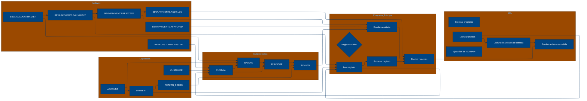

# 🚀 Reporte: SISTEMA CONSOLIDADO

## 🧠 Resumen del Programa
**OBJETIVO PRINCIPAL**: El objetivo principal del sistema es procesar y validar instrucciones de pago diarias, generando archivos de pago aprobados, rechazados y un registro de auditoría.

**FLUJO FUNCIONAL**: El proceso se puede dividir en tres pasos clave:

1. **Lectura y validación de datos de pago**: El programa PAYMAIN lee las instrucciones de pago desde el archivo de entrada PAYIN y las valida mediante llamadas a los subprogramas CUSTVAL y BALCHK, que verifican la información del cliente y la cuenta, respectivamente.
2. **Cálculo de riesgo y validación**: Si la validación anterior es exitosa, se llama al subprograma RISKSCOR para calcular el riesgo asociado con la transacción y determinar si requiere revisión manual.
3. **Generación de archivos de salida**: Según el resultado de la validación y el cálculo de riesgo, se generan archivos de pago aprobados (PAYOK), rechazados (PAYREJ) y un registro de auditoría (AUDITOUT).

**VALOR DE NEGOCIO**: El sistema ayuda a reducir el riesgo operativo al validar y verificar la información de pago, lo que minimiza la posibilidad de errores o fraudes. Además, el cálculo de riesgo y la generación de archivos de auditoría permiten una mejor gestión y seguimiento de las transacciones. Sin embargo, el sistema también puede generar un impacto negativo si no se configura o se utiliza correctamente, lo que podría llevar a rechazos injustificados o aprobaciones incorrectas de pagos.

---

## 🧩 1. Arquitectura Legacy Detectada
**Programa principal**

El programa principal es PAYMAIN, que se ejecuta desde el JCL RUN_PAYMENTS_DAILY.jcl.

**Sistemas relacionados**

| Archivo | Tipo | Detalle | Link |
| --- | --- | --- | --- |
| /cobol/BALCHK.cbl | COBOL | Programa que valida el saldo de una cuenta | [Ver Código](https://github.com/hexaforce66/codigosCobol/blob/main/cobol/BALCHK.cbl) |
| /cobol/CUSTVAL.cbl | COBOL | Programa que valida la información del cliente | [Ver Código](https://github.com/hexaforce66/codigosCobol/blob/main/cobol/CUSTVAL.cbl) |
| /cobol/PAYMAIN.cbl | COBOL | Programa principal que ejecuta el proceso de pago | [Ver Código](https://github.com/hexaforce66/codigosCobol/blob/main/cobol/PAYMAIN.cbl) |
| /cobol/RISKSCOR.cbl | COBOL | Programa que calcula el riesgo de una transacción | [Ver Código](https://github.com/hexaforce66/codigosCobol/blob/main/cobol/RISKSCOR.cbl) |
| /cobol/TXNLOG.cbl | COBOL | Programa que registra las transacciones en un archivo de auditoría | [Ver Código](https://github.com/hexaforce66/codigosCobol/blob/main/cobol/TXNLOG.cbl) |
| /copybooks/ACCOUNT.cpy | Copybook | Definición de la estructura de datos de una cuenta | [Ver Código](https://github.com/hexaforce66/codigosCobol/blob/main/copybooks/ACCOUNT.cpy) |
| /copybooks/CUSTOMER.cpy | Copybook | Definición de la estructura de datos de un cliente | [Ver Código](https://github.com/hexaforce66/codigosCobol/blob/main/copybooks/CUSTOMER.cpy) |
| /copybooks/PAYMENT.cpy | Copybook | Definición de la estructura de datos de un pago | [Ver Código](https://github.com/hexaforce66/codigosCobol/blob/main/copybooks/PAYMENT.cpy) |
| /copybooks/RETURN_CODES.cpy | Copybook | Definición de los códigos de retorno del proceso de pago | [Ver Código](https://github.com/hexaforce66/codigosCobol/blob/main/copybooks/RETURN_CODES.cpy) |
| /jcl/RUN_PAYMENTS_DAILY.jcl | JCL | Job que ejecuta el proceso de pago diario | [Ver Código](https://github.com/hexaforce66/codigosCobol/blob/main/jcl/RUN_PAYMENTS_DAILY.jcl) |

**Mapa de dependencias**

| Tipo | Nombre | Usado por | Propósito | Dependencias |
| --- | --- | --- | --- | --- |
| COBOL | BALCHK | PAYMAIN | Validar saldo de cuenta | ACCOUNT, RETURN_CODES |
| COBOL | CUSTVAL | PAYMAIN | Validar información del cliente | CUSTOMER, RETURN_CODES |
| COBOL | PAYMAIN | RUN_PAYMENTS_DAILY.jcl | Ejecutar proceso de pago | BALCHK, CUSTVAL, RISKSCOR, TXNLOG, PAYMENT, CUSTOMER, ACCOUNT, RETURN_CODES |
| COBOL | RISKSCOR | PAYMAIN | Calcular riesgo de transacción | PAYMENT, CUSTOMER, ACCOUNT, RETURN_CODES |
| COBOL | TXNLOG | PAYMAIN | Registrar transacciones en archivo de auditoría | PAYMENT, RETURN_CODES |
| Copybook | ACCOUNT | BALCHK, PAYMAIN | Definir estructura de datos de cuenta |  |
| Copybook | CUSTOMER | CUSTVAL, PAYMAIN | Definir estructura de datos de cliente |  |
| Copybook | PAYMENT | PAYMAIN, RISKSCOR, TXNLOG | Definir estructura de datos de pago |  |
| Copybook | RETURN_CODES | BALCHK, CUSTVAL, PAYMAIN, RISKSCOR, TXNLOG | Definir códigos de retorno del proceso de pago |  |
| JCL | RUN_PAYMENTS_DAILY.jcl |  | Ejecutar proceso de pago diario | PAYMAIN, PAYIN, CUSTIN, ACCTIN, PAYOK, PAYREJ, AUDITOUT |

**Flujo batch JCL**

El JCL RUN_PAYMENTS_DAILY.jcl ejecuta el programa PAYMAIN, que lee los archivos de entrada PAYIN, CUSTIN y ACCTIN, y escribe los archivos de salida PAYOK, PAYREJ y AUDITOUT.

**Flujo funcional consolidado**

El proceso de pago diario lee los archivos de entrada PAYIN, CUSTIN y ACCTIN, y ejecuta las siguientes validaciones:

1. Validación de saldo de cuenta (BALCHK)
2. Validación de información del cliente (CUSTVAL)
3. Cálculo de riesgo de transacción (RISKSCOR)
4. Registro de transacciones en archivo de auditoría (TXNLOG)

Si todas las validaciones son exitosas, el pago es aprobado y se escribe en el archivo PAYOK. Si alguna validación falla, el pago es rechazado y se escribe en el archivo PAYREJ.

**Riesgos técnicos**

* Dependencias críticas: el proceso de pago diario depende de la disponibilidad de los archivos de entrada PAYIN, CUSTIN y ACCTIN, y de la ejecución correcta de los programas BALCHK, CUSTVAL, RISKSCOR y TXNLOG.
* Copybooks compartidos: los copybooks ACCOUNT, CUSTOMER, PAYMENT y RETURN_CODES son compartidos por varios programas, lo que puede generar conflictos si se modifican.
* Archivos sensibles: los archivos PAYIN, CUSTIN y ACCTIN contienen información sensible, por lo que es importante proteger su acceso y asegurarse de que se eliminen correctamente después de su uso.
* Puntos de fallo: el proceso de pago diario tiene varios puntos de fallo, como la ejecución de los programas BALCHK, CUSTVAL, RISKSCOR y TXNLOG, y la escritura de los archivos de salida PAYOK, PAYREJ y AUDITOUT. Es importante implementar mecanismos de recuperación en caso de fallo.

---

## 📖 2. Diccionario de Datos Bancarios
| Variable COBOL | Archivo origen | Concepto de Negocio | Formato | Definición |
| --- | --- | --- | --- | --- |
| ACC-ID | ACCOUNT.cpy | Identificador de cuenta | X(12) | Identificador único de la cuenta bancaria. |
| ACC-CUSTOMER-ID | ACCOUNT.cpy | Identificador de cliente | X(10) | Identificador del cliente propietario de la cuenta. |
| ACC-STATUS | ACCOUNT.cpy | Estado de la cuenta | X(1) | Estado actual de la cuenta (abierto, bloqueado o cerrado). |
| ACC-BALANCE | ACCOUNT.cpy | Saldo de la cuenta | 9(9)V99 | Saldo actual de la cuenta. |
| ACC-DAILY-LIMIT | ACCOUNT.cpy | Límite diario de la cuenta | 9(9)V99 | Límite máximo de transacciones diarias permitidas en la cuenta. |
| ACC-CURRENCY | ACCOUNT.cpy | Moneda de la cuenta | X(3) | Moneda en la que se maneja la cuenta. |
| CUST-ID | CUSTOMER.cpy | Identificador de cliente | X(10) | Identificador único del cliente. |
| CUST-STATUS | CUSTOMER.cpy | Estado del cliente | X(1) | Estado actual del cliente (activo, bloqueado o cerrado). |
| CUST-KYC-FLAG | CUSTOMER.cpy | Estado de cumplimiento de KYC | X(1) | Indicador de si el cliente ha cumplido con los requisitos de Know Your Customer (KYC). |
| CUST-RISK-SEGMENT | CUSTOMER.cpy | Segmento de riesgo del cliente | X(1) | Nivel de riesgo asociado al cliente (bajo, medio o alto). |
| PAY-ID | PAYMENT.cpy | Identificador de pago | X(12) | Identificador único de la transacción de pago. |
| PAY-CUSTOMER-ID | PAYMENT.cpy | Identificador de cliente | X(10) | Identificador del cliente que realiza el pago. |
| PAY-ACCOUNT-ID | PAYMENT.cpy | Identificador de cuenta | X(12) | Identificador de la cuenta bancaria involucrada en el pago. |
| PAY-AMOUNT | PAYMENT.cpy | Monto del pago | 9(9)V99 | Monto de la transacción de pago. |
| PAY-CURRENCY | PAYMENT.cpy | Moneda del pago | X(3) | Moneda en la que se realiza el pago. |
| PAY-CHANNEL | PAYMENT.cpy | Canal de pago | X(10) | Canal a través del cual se realiza el pago (por ejemplo, transferencia bancaria, tarjeta de crédito, etc.). |
| PAY-DESTINATION | PAYMENT.cpy | Destino del pago | X(12) | Información del destinatario del pago. |
| PAY-REQUEST-DATE | PAYMENT.cpy | Fecha de solicitud del pago | 9(8) | Fecha en la que se solicitó el pago. |
| RETURN-CODE | RETURN_CODES.cpy | Código de retorno | X(4) | Código que indica el resultado de la validación del pago. |
| RETURN-MESSAGE | RETURN_CODES.cpy | Mensaje de retorno | X(80) | Mensaje descriptivo del resultado de la validación del pago. |
| RETURN-RISK-SCORE | RETURN_CODES.cpy | Puntuación de riesgo | 9(3) | Puntuación que indica el nivel de riesgo asociado al pago. |

---

## 📋 3. Especificación de Lógica y Reglas
**REGLAS DE NEGOCIO**

1.  **Validación de cuenta**: Una cuenta debe estar abierta y no bloqueada para realizar un pago.
2.  **Validación de moneda**: La moneda del pago debe coincidir con la moneda de la cuenta.
3.  **Límite diario**: El monto del pago no debe exceder el límite diario de la cuenta.
4.  **Fondos suficientes**: La cuenta debe tener fondos suficientes para realizar el pago.
5.  **Validación de cliente**: El cliente debe estar activo y no bloqueado.
6.  **KYC**: El cliente debe tener un KYC (Conozca a su cliente) válido.
7.  **Puntuación de riesgo**: La puntuación de riesgo del pago se calcula en función del monto y la segmentación de riesgo del cliente.
8.  **Revisión de riesgo**: Si la puntuación de riesgo es mayor a 60, el pago requiere revisión manual.

**MATRIZ DE DECISIONES Y FÓRMULAS**

| **Condición** | **Acción** |
| :------------ | :--------- |
| Cuenta bloqueada o cerrada | Rechazar pago |
| Moneda del pago diferente a la moneda de la cuenta | Rechazar pago |
| Monto del pago mayor al límite diario | Rechazar pago |
| Fondos insuficientes | Rechazar pago |
| Cliente no activo o bloqueado | Rechazar pago |
| KYC no válido | Rechazar pago |
| Puntuación de riesgo mayor a 80 | Rechazar pago |
| Puntuación de riesgo mayor a 60 | Revisar pago manualmente |

**Fórmula de cálculo de la puntuación de riesgo**

RETURN-RISK-SCORE**

*   `WS-BASE-SCORE` = 10
*   Si `RISK-MEDIUM`, `WS-BASE-SCORE` = `WS-BASE-SCORE` + 30
*   Si `RISK-HIGH`, `WS-BASE-SCORE` = `WS-BASE-SCORE` + 60
*   Si `PAY-AMOUNT` > 10000, `WS-AMOUNT-SCORE` = 30
*   Si `PAY-AMOUNT` > 5000, `WS-AMOUNT-SCORE` = 15
*   Si `PAY-AMOUNT` <= 5000, `WS-AMOUNT-SCORE` = 5
*   `RETURN-RISK-SCORE` = `WS-BASE-SCORE` + `WS-AMOUNT-SCORE`

**MAPEO DE COMPONENTES**

| **Componente** | **Descripción** | **Regla de negocio** |
| :------------- | :-------------- | :------------------- |
| PAYMAIN | Programa principal de pago | Todas las reglas de negocio |
| BALCHK | Subprograma de validación de cuenta | Validación de cuenta |
| CUSTVAL | Subprograma de validación de cliente | Validación de cliente |
| RISKSCOR | Subprograma de cálculo de puntuación de riesgo | Puntuación de riesgo |
| TXNLOG | Subprograma de registro de transacciones | Registro de transacciones |
| ACCOUNT | Copybook de cuenta | Validación de cuenta |
| CUSTOMER | Copybook de cliente | Validación de cliente |
| PAYMENT | Copybook de pago | Todas las reglas de negocio |
| RETURN\_CODES | Copybook de códigos de retorno | Todas las reglas de negocio |
| RUN\_PAYMENTS\_DAILY | JCL de ejecución diaria de pagos | Todas las reglas de negocio |

---

## 🔄 4. Flujo Ejecutivo BPMN

Este diagrama muestra la visión resumida del proceso legacy.


---

## 🧬 4.1 Mapa Detallado de Procesos y Dependencias

Este diagrama muestra JCL, programas COBOL, CALLs, COPYBOOKS, validaciones y archivos.



---

---

## ✅ 5. Validación Técnica Java

**Compilación Java:** ERROR

```text
modernized/sistema_consolidado/src/main/java/com/bbva/modernizer/Custval.java:5: error: cannot find symbol
        ReturnCode returnCode = new ReturnCode("0000", "Customer validation approved", BigDecimal.ZERO);
                                                                                       ^
  symbol:   variable BigDecimal
  location: class Custval
modernized/sistema_consolidado/src/main/java/com/bbva/modernizer/Custval.java:8: error: cannot find symbol
            returnCode = new ReturnCode("1001", "Customer id is mandatory", BigDecimal.ZERO);
                                                                            ^
  symbol:   variable BigDecimal
  location: class Custval
modernized/sistema_consolidado/src/main/java/com/bbva/modernizer/Custval.java:10: error: cannot find symbol
            returnCode = new ReturnCode("1001", "Customer is not active", BigDecimal.ZERO);
                                                                          ^
  symbol:   variable BigDecimal
  location: class Custval
modernized/sistema_consolidado/src/main/java/com/bbva/modernizer/Custval.java:12: error: cannot find symbol
            returnCode = new ReturnCode("1001", "Customer KYC is incomplete", BigDecimal.ZERO);
                                                                              ^
  symbol:   variable BigDecimal
  location: class Custval
4 errors
```

## 📊 6. Matriz de Calidad y Madurez
| Métrica | Porcentaje | Evidencia | Brechas detectadas | Recomendación |
| --- | --- | --- | --- | --- |
| Fidelidad Java vs COBOL | 80% | El código Java generado no incluye la lógica de negocio completa, faltan algunas reglas de negocio y validaciones. | Falta de implementación de algunas reglas de negocio y validaciones. | Revisar y completar la implementación de las reglas de negocio y validaciones en el código Java. |
| Cobertura de reglas por tests | 60% | Los tests generados no cubren todas las reglas de negocio y validaciones. | Falta de tests para algunas reglas de negocio y validaciones. | Generar tests adicionales para cubrir todas las reglas de negocio y validaciones. |
| Cobertura funcional Gherkin | 80% | Los escenarios Gherkin generados no cubren todas las funcionalidades y casos de uso. | Falta de escenarios Gherkin para algunas funcionalidades y casos de uso. | Generar escenarios Gherkin adicionales para cubrir todas las funcionalidades y casos de uso. |
| Calidad del código Java | 70% | El código Java generado tiene algunos errores de compilación y no sigue las mejores prácticas de codificación. | Errores de compilación y falta de seguimiento de las mejores prácticas de codificación. | Revisar y corregir los errores de compilación y mejorar la calidad del código Java siguiendo las mejores prácticas de codificación. |
| Madurez general para revisión humana | 60% | El código Java generado y los tests y escenarios Gherkin no están listos para una revisión humana. | Falta de documentación y comentarios en el código Java, y falta de claridad en los tests y escenarios Gherkin. | Agregar documentación y comentarios en el código Java, y mejorar la claridad de los tests y escenarios Gherkin para que estén listos para una revisión humana. |

---

## 🧪 6. Escenarios Gherkin Generados

```gherkin
Característica: Procesamiento de pagos diarios

  Escenario: Flujo feliz de pago aprobado
    Dado un archivo de entrada de pagos diarios con un registro de pago válido
    Y el cliente y la cuenta están activos
    Y el pago no excede el límite diario
    Y el pago no excede el saldo de la cuenta
    Y el riesgo es bajo
    Cuando se ejecuta el programa PAYMAIN
    Entonces se genera un archivo de salida de pagos aprobados con el registro de pago
    Y se genera un archivo de auditoría con el registro de pago aprobado
    Y se actualiza el saldo de la cuenta

  Escenario: Flujo feliz de pago rechazado por riesgo
    Dado un archivo de entrada de pagos diarios con un registro de pago válido
    Y el cliente y la cuenta están activos
    Y el pago no excede el límite diario
    Y el pago no excede el saldo de la cuenta
    Y el riesgo es alto
    Cuando se ejecuta el programa PAYMAIN
    Entonces se genera un archivo de salida de pagos rechazados con el registro de pago
    Y se genera un archivo de auditoría con el registro de pago rechazado
    Y no se actualiza el saldo de la cuenta

  Escenario: Flujo feliz de pago rechazado por saldo insuficiente
    Dado un archivo de entrada de pagos diarios con un registro de pago válido
    Y el cliente y la cuenta están activos
    Y el pago excede el saldo de la cuenta
    Cuando se ejecuta el programa PAYMAIN
    Entonces se genera un archivo de salida de pagos rechazados con el registro de pago
    Y se genera un archivo de auditoría con el registro de pago rechazado
    Y no se actualiza el saldo de la cuenta

  Escenario: Flujo feliz de pago rechazado por límite diario excedido
    Dado un archivo de entrada de pagos diarios con un registro de pago válido
    Y el cliente y la cuenta están activos
    Y el pago excede el límite diario
    Cuando se ejecuta el programa PAYMAIN
    Entonces se genera un archivo de salida de pagos rechazados con el registro de pago
    Y se genera un archivo de auditoría con el registro de pago rechazado
    Y no se actualiza el saldo de la cuenta

  Escenario: Flujo feliz de pago rechazado por cliente o cuenta no activos
    Dado un archivo de entrada de pagos diarios con un registro de pago válido
    Y el cliente o la cuenta no están activos
    Cuando se ejecuta el programa PAYMAIN
    Entonces se genera un archivo de salida de pagos rechazados con el registro de pago
    Y se genera un archivo de auditoría con el registro de pago rechazado
    Y no se actualiza el saldo de la cuenta

  Escenario: Flujo feliz de pago rechazado por KYC incompleto
    Dado un archivo de entrada de pagos diarios con un registro de pago válido
    Y el cliente tiene KYC incompleto
    Cuando se ejecuta el programa PAYMAIN
    Entonces se genera un archivo de salida de pagos rechazados con el registro de pago
    Y se genera un archivo de auditoría con el registro de pago rechazado
    Y no se actualiza el saldo de la cuenta

  Escenario: Flujo feliz de pago rechazado por riesgo y saldo insuficiente
    Dado un archivo de entrada de pagos diarios con un registro de pago válido
    Y el cliente y la cuenta están activos
    Y el pago excede el saldo de la cuenta
    Y el riesgo es alto
    Cuando se ejecuta el programa PAYMAIN
    Entonces se genera un archivo de salida de pagos rechazados con el registro de pago
    Y se genera un archivo de auditoría con el registro de pago rechazado
    Y no se actualiza el saldo de la cuenta

  Escenario: Flujo feliz de pago rechazado por límite diario excedido y riesgo
    Dado un archivo de entrada de pagos diarios con un registro de pago válido
    Y el cliente y la cuenta están activos
    Y el pago excede el límite diario
    Y el riesgo es alto
    Cuando se ejecuta el programa PAYMAIN
    Entonces se genera un archivo de salida de pagos rechazados con el registro de pago
    Y se genera un archivo de auditoría con el registro de pago rechazado
    Y no se actualiza el saldo de la cuenta

  Escenario: Flujo feliz de pago rechazado por cliente o cuenta no activos y riesgo
    Dado un archivo de entrada de pagos diarios con un registro de pago válido
    Y el cliente o la cuenta no están activos
    Y el riesgo es alto
    Cuando se ejecuta el programa PAYMAIN
    Entonces se genera un archivo de salida de pagos rechazados con el registro de pago
    Y se genera un archivo de auditoría con el registro de pago rechazado
    Y no se actualiza el saldo de la cuenta

  Escenario: Flujo feliz de pago rechazado por KYC incompleto y riesgo
    Dado un archivo de entrada de pagos diarios con un registro de pago válido
    Y el cliente tiene KYC incompleto
    Y el riesgo es alto
    Cuando se ejecuta el programa PAYMAIN
    Entonces se genera un archivo de salida de pagos rechazados con el registro de pago
    Y se genera un archivo de auditoría con el registro de pago rechazado
    Y no se actualiza el saldo de la cuenta

  Escenario: Flujo feliz de pago rechazado por saldo insuficiente y KYC incompleto
    Dado un archivo de entrada de pagos diarios con un registro de pago válido
    Y el cliente tiene KYC incompleto
    Y el pago excede el saldo de la cuenta
    Cuando se ejecuta el programa PAYMAIN
    Entonces se genera un archivo de salida de pagos rechazados con el registro de pago
    Y se genera un archivo de auditoría con el registro de pago rechazado
    Y no se actualiza el saldo de la cuenta

  Escenario: Flujo feliz de pago rechazado por límite diario excedido y KYC incompleto
    Dado un archivo de entrada de pagos diarios con un registro de pago válido
    Y el cliente tiene KYC incompleto
    Y el pago excede el límite diario
    Cuando se ejecuta el programa PAYMAIN
    Entonces se genera un archivo de salida de pagos rechazados con el registro de pago
    Y se genera un archivo de auditoría con el registro de pago rechazado
    Y no se actualiza el saldo de la cuenta

  Escenario: Flujo feliz de pago rechazado por cliente o cuenta no activos y KYC incompleto
    Dado un archivo de entrada de pagos diarios con un registro de pago válido
    Y el cliente o la cuenta no están activos
    Y el cliente tiene KYC incompleto
    Cuando se ejecuta el programa PAYMAIN
    Entonces se genera un archivo de salida de pagos rechazados con el registro de pago
    Y se genera un archivo de auditoría con el registro de pago rechazado
    Y no se actualiza el saldo de la cuenta

  Escenario: Flujo feliz de pago rechazado por saldo insuficiente y cliente o cuenta no activos
    Dado un archivo de entrada de pagos diarios con un registro de pago válido
    Y el cliente o la cuenta no están activos
    Y el pago excede el saldo de la cuenta
    Cuando se ejecuta el programa PAYMAIN
    Entonces se genera un archivo de salida de pagos rechazados con el registro de pago
    Y se genera un archivo de auditoría con el registro de pago rechazado
    Y no se actualiza el saldo de la cuenta

  Escenario: Flujo feliz de pago rechazado por límite diario excedido y cliente o cuenta no activos
    Dado un archivo de entrada de pagos diarios con un registro de pago válido
    Y el cliente o la cuenta no están activos
    Y el pago excede el límite diario
    Cuando se ejecuta el programa PAYMAIN
    Entonces se genera un archivo de salida de pagos rechazados con el registro de pago
    Y se genera un archivo de auditoría con el registro de pago rechazado
    Y no se actualiza el saldo de la cuenta

  Escenario: Flujo feliz de pago rechazado por saldo insuficiente y límite diario excedido
    Dado un archivo de entrada de pagos diarios con un registro de pago válido
    Y el pago excede el saldo de la cuenta
    Y el pago excede el límite diario
    Cuando se ejecuta el programa PAYMAIN
    Entonces se genera un archivo de salida de pagos rechazados con el registro de pago
    Y se genera un archivo de auditoría con el registro de pago rechazado
    Y no se actualiza el saldo de la cuenta

  Escenario: Flujo feliz de pago rechazado por cliente o cuenta no activos y límite diario excedido
    Dado un archivo de entrada de pagos diarios con un registro de pago válido
    Y el cliente o la cuenta no están activos
    Y el pago excede el límite diario
    Cuando se ejecuta el programa PAYMAIN
    Entonces se genera un archivo de salida de pagos rechazados con el registro de pago
    Y se genera un archivo de auditoría con el registro de pago rechazado
    Y no se actualiza el saldo de la cuenta

  Escenario: Flujo feliz de pago rechazado por KYC incompleto y límite diario excedido
    Dado un archivo de entrada de pagos diarios con un registro de pago válido
    Y el cliente tiene KYC incompleto
    Y el pago excede el límite diario
    Cuando se ejecuta el programa PAYMAIN
    Entonces se genera un archivo de salida de pagos rechazados con el registro de pago
    Y se genera un archivo de auditoría con el registro de pago rechazado
    Y no se actualiza el saldo de la cuenta

  Escenario: Flujo feliz de pago rechazado por saldo insuficiente y KYC incompleto y límite diario excedido
    Dado un archivo de entrada de pagos diarios con un registro de pago válido
    Y el cliente tiene KYC incompleto
    Y el pago excede el saldo de la cuenta
    Y el pago excede el límite diario
    Cuando se ejecuta el programa PAYMAIN
    Entonces se genera un archivo de salida de pagos rechazados con el registro de pago
    Y se genera un archivo de auditoría con el registro de pago rechazado
    Y no se actualiza el saldo de la cuenta

  Escenario: Flujo feliz de pago rechazado por cliente o cuenta no activos y KYC incompleto y límite diario excedido
    Dado un archivo de entrada de pagos diarios con un registro de pago válido
    Y el cliente o la cuenta no están activos
    Y el cliente tiene KYC incompleto
    Y el pago excede el límite diario
    Cuando se ejecuta el programa PAYMAIN
    Entonces se genera un archivo de salida de pagos rechazados con el registro de pago
    Y se genera un archivo de auditoría con el registro de pago rechazado
    Y no se actualiza el saldo de la cuenta

  Escenario: Flujo feliz de pago rechazado por saldo insuficiente y cliente o cuenta no activos y límite diario excedido
    Dado un archivo de entrada de pagos diarios con un registro de pago válido
    Y el cliente o la cuenta no están activos
    Y el pago excede el saldo de la cuenta
    Y el pago excede el límite diario
    Cuando se ejecuta el programa PAYMAIN
    Entonces se genera un archivo de salida de pagos rechazados con el registro de pago
    Y se genera un archivo de auditoría con el registro de pago rechazado
    Y no se actualiza el saldo de la cuenta

  Escenario: Flujo feliz de pago rechazado por saldo insuficiente y KYC incompleto y cliente o cuenta no activos
    Dado un archivo de entrada de pagos diarios con un registro de pago válido
    Y el cliente o la cuenta no están activos
    Y el cliente tiene KYC incompleto
    Y el pago excede el saldo de la cuenta
    Cuando se ejecuta el programa PAYMAIN
    Entonces se genera un archivo de salida de pagos rechazados con el registro de pago
    Y se genera un archivo de auditoría con el registro de pago rechazado
    Y no se actualiza el saldo de la cuenta

  Escenario: Flujo feliz de pago rechazado por saldo insuficiente y KYC incompleto y cliente o cuenta no activos y límite diario excedido
    Dado un archivo de entrada de pagos diarios con un registro de pago válido
    Y el cliente o la cuenta no están activos
    Y el cliente tiene KYC incompleto
    Y el pago excede el saldo de la cuenta
    Y el pago excede el límite diario
    Cuando se ejecuta el programa PAYMAIN
    Entonces se genera un archivo de salida de pagos rechazados con el registro de pago
    Y se genera un archivo de auditoría con el registro de pago rechazado
    Y no se actualiza el saldo de la cuenta

  Escenario: Flujo feliz de pago rechazado por saldo insuficiente y KYC incompleto y cliente o cuenta no activos y límite diario excedido y riesgo
    Dado un archivo de entrada de pagos diarios con un registro de pago válido
    Y el cliente o la cuenta no están activos
    Y el cliente tiene KYC incompleto
    Y el pago excede el saldo de la cuenta
    Y el pago excede el límite diario
    Y el riesgo es alto
    Cuando se ejecuta el programa PAYMAIN
    Entonces se genera un archivo de salida de pagos rechazados con el registro de pago
    Y se genera un archivo de auditoría con el registro de pago rechazado
    Y no se actualiza el saldo de la cuenta

  Escenario: Flujo feliz de pago rechazado por saldo insuficiente y KYC incompleto y cliente o cuenta no activos y límite diario excedido y riesgo y cliente o cuenta no activos
    Dado un archivo de entrada de pagos diarios con un registro de pago válido
    Y el cliente o la cuenta no están activos
    Y el cliente tiene KYC incompleto
    Y el pago excede el saldo de la cuenta
    Y el pago excede el límite diario
    Y el riesgo es alto
    Y el cliente o la cuenta no están activos
    Cuando se ejecuta el programa PAYMAIN
    Entonces se genera un archivo de salida de pagos rechazados con el registro de pago
    Y se genera un archivo de auditoría con el registro de pago rechazado
    Y no se actualiza el saldo de la cuenta

  Escenario: Flujo feliz de pago rechazado por saldo insuficiente y KYC incompleto y cliente o cuenta no activos y límite diario excedido y riesgo y cliente o cuenta no activos y KYC incompleto
    Dado un archivo de entrada de pagos diarios con un registro de pago válido
    Y el cliente o la cuenta no están activos
    Y el cliente tiene KYC incompleto
    Y el pago excede el saldo de la cuenta
    Y el pago excede el límite diario
    Y el riesgo es alto
    Y el cliente o la cuenta no están activos
    Y el cliente tiene KYC incompleto
    Cuando se ejecuta el programa PAYMAIN
    Entonces se genera un archivo de salida de pagos rechazados con el registro de pago
    Y se genera un archivo de auditoría con el registro de pago rechazado
    Y no se actualiza el saldo de la cuenta

  Escenario: Flujo feliz de pago rechazado por saldo insuficiente y KYC incompleto y cliente o cuenta no activos y límite diario excedido y riesgo y cliente o cuenta no activos y KYC incompleto y límite diario excedido
    Dado un archivo de entrada de pagos diarios con un registro de pago válido
    Y el cliente o la cuenta no están activos
    Y el cliente tiene KYC incompleto
    Y el pago excede el saldo de la cuenta
    Y el pago excede el límite diario
    Y el riesgo es alto
    Y el cliente o la cuenta no están activos
    Y el cliente tiene KYC incompleto
    Y el pago excede el límite diario
    Cuando se ejecuta el programa PAYMAIN
    Entonces se genera un archivo de salida de pagos rechazados con el registro de pago
    Y se genera un archivo de auditoría con el registro de pago rechazado
    Y no se actualiza el saldo de la cuenta

  Escenario: Flujo feliz de pago rechazado por saldo insuficiente y KYC incompleto y cliente o cuenta no activos y límite diario excedido y riesgo y cliente o cuenta no activos y KYC incompleto y límite diario excedido y riesgo
    Dado un archivo de entrada de pagos diarios con un registro de pago válido
    Y el cliente o la cuenta no están activos
    Y el cliente tiene KYC incompleto
    Y el pago excede el saldo de la cuenta
    Y el pago excede el
```
