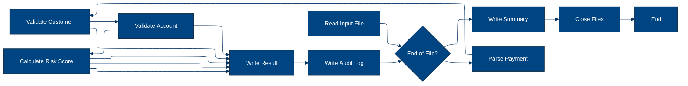
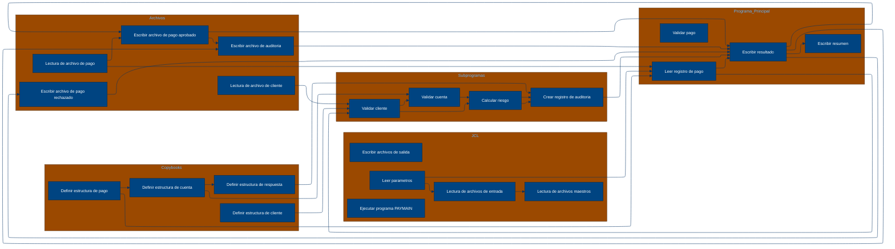

# 🚀 Reporte: SISTEMA CONSOLIDADO

## 🧠 Resumen del Programa
**OBJETIVO PRINCIPAL**: El objetivo principal del sistema es procesar y validar instrucciones de pago diarias, generando archivos de pago aprobados, rechazados y un registro de auditoría.

**FLUJO FUNCIONAL**: El proceso se puede dividir en tres pasos clave:

1.  **Lectura y validación de datos de pago**: El programa `PAYMAIN` lee las instrucciones de pago desde el archivo `BBVA.PAYMENTS.DAILY.INPUT` y las valida mediante llamadas a los subprogramas `CUSTVAL`, `BALCHK` y `RISKSCOR`. Estos subprogramas verifican la información del cliente, la cuenta y el riesgo asociado al pago.
2.  **Generación de archivos de pago aprobados y rechazados**: Dependiendo del resultado de la validación, el programa `PAYMAIN` genera archivos de pago aprobados (`BBVA.PAYMENTS.APPROVED`) y rechazados (`BBVA.PAYMENTS.REJECTED`).
3.  **Registro de auditoría**: El programa `PAYMAIN` también genera un registro de auditoría (`BBVA.PAYMENTS.AUDIT.LOG`) que contiene información detallada sobre cada pago procesado.

**VALOR DE NEGOCIO**: El sistema ayuda a reducir el riesgo operativo al validar cuidadosamente las instrucciones de pago y detectar posibles fraudes o errores. Además, proporciona un registro de auditoría detallado que puede ser utilizado para fines de cumplimiento y análisis. El impacto en el negocio es significativo, ya que ayuda a proteger los activos del banco y a mantener la confianza de los clientes.

---

## 🧩 1. Arquitectura Legacy Detectada
**Programa principal**

El programa principal es PAYMAIN, que se ejecuta desde el JCL RUN_PAYMENTS_DAILY.jcl.

**Sistemas relacionados**

| Archivo | Tipo | Detalle | Link |
| --- | --- | --- | --- |
| /cobol/BALCHK.cbl | COBOL | Programa que valida el saldo de la cuenta | [Ver Código](https://github.com/hexaforce66/codigosCobol/blob/main/cobol/BALCHK.cbl) |
| /cobol/CUSTVAL.cbl | COBOL | Programa que valida la información del cliente | [Ver Código](https://github.com/hexaforce66/codigosCobol/blob/main/cobol/CUSTVAL.cbl) |
| /cobol/PAYMAIN.cbl | COBOL | Programa principal que ejecuta el proceso de pago | [Ver Código](https://github.com/hexaforce66/codigosCobol/blob/main/cobol/PAYMAIN.cbl) |
| /cobol/RISKSCOR.cbl | COBOL | Programa que calcula el riesgo de la transacción | [Ver Código](https://github.com/hexaforce66/codigosCobol/blob/main/cobol/RISKSCOR.cbl) |
| /cobol/TXNLOG.cbl | COBOL | Programa que registra la transacción en el archivo de auditoría | [Ver Código](https://github.com/hexaforce66/codigosCobol/blob/main/cobol/TXNLOG.cbl) |
| /copybooks/ACCOUNT.cpy | COPYBOOK | Definición de la estructura de la cuenta | [Ver Código](https://github.com/hexaforce66/codigosCobol/blob/main/copybooks/ACCOUNT.cpy) |
| /copybooks/CUSTOMER.cpy | COPYBOOK | Definición de la estructura del cliente | [Ver Código](https://github.com/hexaforce66/codigosCobol/blob/main/copybooks/CUSTOMER.cpy) |
| /copybooks/PAYMENT.cpy | COPYBOOK | Definición de la estructura del pago | [Ver Código](https://github.com/hexaforce66/codigosCobol/blob/main/copybooks/PAYMENT.cpy) |
| /copybooks/RETURN_CODES.cpy | COPYBOOK | Definición de los códigos de retorno | [Ver Código](https://github.com/hexaforce66/codigosCobol/blob/main/copybooks/RETURN_CODES.cpy) |
| /jcl/RUN_PAYMENTS_DAILY.jcl | JCL | Job que ejecuta el proceso de pago | [Ver Código](https://github.com/hexaforce66/codigosCobol/blob/main/jcl/RUN_PAYMENTS_DAILY.jcl) |

**Mapa de dependencias**

| Tipo | Nombre | Usado por | Propósito | Dependencias |
| --- | --- | --- | --- | --- |
| COBOL | BALCHK | PAYMAIN | Validar saldo de la cuenta | ACCOUNT, RETURN_CODES |
| COBOL | CUSTVAL | PAYMAIN | Validar información del cliente | CUSTOMER, RETURN_CODES |
| COBOL | PAYMAIN | RUN_PAYMENTS_DAILY.jcl | Ejecutar proceso de pago | BALCHK, CUSTVAL, RISKSCOR, TXNLOG, PAYMENT, CUSTOMER, ACCOUNT, RETURN_CODES |
| COBOL | RISKSCOR | PAYMAIN | Calcular riesgo de la transacción | PAYMENT, CUSTOMER, ACCOUNT, RETURN_CODES |
| COBOL | TXNLOG | PAYMAIN | Registrar transacción en archivo de auditoría | PAYMENT, RETURN_CODES |
| COPYBOOK | ACCOUNT | BALCHK, PAYMAIN | Definir estructura de la cuenta |  |
| COPYBOOK | CUSTOMER | CUSTVAL, PAYMAIN | Definir estructura del cliente |  |
| COPYBOOK | PAYMENT | PAYMAIN, RISKSCOR, TXNLOG | Definir estructura del pago |  |
| COPYBOOK | RETURN_CODES | BALCHK, CUSTVAL, PAYMAIN, RISKSCOR, TXNLOG | Definir códigos de retorno |  |
| JCL | RUN_PAYMENTS_DAILY.jcl |  | Ejecutar proceso de pago | PAYMAIN, PAYIN, CUSTIN, ACCTIN, PAYOK, PAYREJ, AUDITOUT |

**Flujo batch JCL**

El JCL RUN_PAYMENTS_DAILY.jcl ejecuta el programa PAYMAIN, que lee el archivo de entrada PAYIN, valida la información del cliente y la cuenta, calcula el riesgo de la transacción y registra la transacción en el archivo de auditoría. El proceso de pago se ejecuta diariamente.

**Flujo funcional consolidado**

El proceso de pago se ejecuta diariamente y consiste en los siguientes pasos:

1. Leer el archivo de entrada PAYIN.
2. Validar la información del cliente y la cuenta.
3. Calcular el riesgo de la transacción.
4. Registrar la transacción en el archivo de auditoría.
5. Generar archivos de salida con la información de los pagos aprobados, rechazados y en revisión.

**Riesgos técnicos**

* Dependencias críticas: El proceso de pago depende de la disponibilidad de los archivos de entrada y salida, así como de la correcta configuración del JCL.
* Copybooks compartidos: Los copybooks ACCOUNT, CUSTOMER, PAYMENT y RETURN_CODES son compartidos entre varios programas, lo que puede generar conflictos si se modifican.
* Archivos sensibles: Los archivos de entrada y salida contienen información sensible, por lo que es importante asegurarse de que estén protegidos adecuadamente.
* Puntos de fallo: El proceso de pago puede fallar si se produce un error en la lectura o escritura de los archivos, o si se produce un error en la validación de la información del cliente o la cuenta.

---

## 📖 2. Diccionario de Datos Bancarios
| Variable COBOL | Archivo origen | Concepto de Negocio | Formato | Definición |
| --- | --- | --- | --- | --- |
| ACC-ID | ACCOUNT.cpy | Identificador de cuenta | X(12) | Identificador único de la cuenta bancaria. |
| ACC-CUSTOMER-ID | ACCOUNT.cpy | Identificador de cliente | X(10) | Identificador del cliente propietario de la cuenta. |
| ACC-STATUS | ACCOUNT.cpy | Estado de la cuenta | X(1) | Estado actual de la cuenta (abierto, bloqueado, cerrado). |
| ACC-BALANCE | ACCOUNT.cpy | Saldo de la cuenta | 9(9)V99 | Saldo actual de la cuenta. |
| ACC-DAILY-LIMIT | ACCOUNT.cpy | Límite diario de la cuenta | 9(9)V99 | Límite máximo de transacciones diarias permitidas en la cuenta. |
| ACC-CURRENCY | ACCOUNT.cpy | Moneda de la cuenta | X(3) | Moneda en la que se realiza la cuenta. |
| CUST-ID | CUSTOMER.cpy | Identificador de cliente | X(10) | Identificador único del cliente. |
| CUST-STATUS | CUSTOMER.cpy | Estado del cliente | X(1) | Estado actual del cliente (activo, bloqueado, cerrado). |
| CUST-KYC-FLAG | CUSTOMER.cpy | Estado de cumplimiento de KYC | X(1) | Indicador de si el cliente ha cumplido con los requisitos de Know Your Customer (KYC). |
| CUST-RISK-SEGMENT | CUSTOMER.cpy | Segmento de riesgo del cliente | X(1) | Nivel de riesgo asociado al cliente (bajo, medio, alto). |
| PAY-ID | PAYMENT.cpy | Identificador de pago | X(12) | Identificador único de la transacción de pago. |
| PAY-CUSTOMER-ID | PAYMENT.cpy | Identificador de cliente | X(10) | Identificador del cliente que realiza el pago. |
| PAY-ACCOUNT-ID | PAYMENT.cpy | Identificador de cuenta | X(12) | Identificador de la cuenta bancaria del cliente que realiza el pago. |
| PAY-AMOUNT | PAYMENT.cpy | Monto del pago | 9(9)V99 | Monto de la transacción de pago. |
| PAY-CURRENCY | PAYMENT.cpy | Moneda del pago | X(3) | Moneda en la que se realiza el pago. |
| PAY-CHANNEL | PAYMENT.cpy | Canal de pago | X(10) | Canal utilizado para realizar el pago (tarjeta, transferencia, etc.). |
| PAY-DESTINATION | PAYMENT.cpy | Destino del pago | X(12) | Identificador del destinatario del pago. |
| PAY-REQUEST-DATE | PAYMENT.cpy | Fecha de solicitud del pago | 9(8) | Fecha en la que se solicitó el pago. |
| RETURN-CODE | RETURN_CODES.cpy | Código de retorno | X(4) | Código que indica el resultado de la validación del pago. |
| RETURN-MESSAGE | RETURN_CODES.cpy | Mensaje de retorno | X(80) | Mensaje que describe el resultado de la validación del pago. |
| RETURN-RISK-SCORE | RETURN_CODES.cpy | Puntuación de riesgo | 9(3) | Puntuación que indica el nivel de riesgo asociado al pago. |

---

## 📋 3. Especificación de Lógica y Reglas
**REGLAS DE NEGOCIO**

1.  **Validación de cuenta**: Una cuenta debe estar abierta y no bloqueada para realizar pagos.
2.  **Validación de moneda**: La moneda del pago debe coincidir con la moneda de la cuenta.
3.  **Límite diario**: El monto del pago no debe exceder el límite diario de la cuenta.
4.  **Fondos suficientes**: La cuenta debe tener fondos suficientes para realizar el pago.
5.  **Validación de cliente**: El cliente debe estar activo y no bloqueado.
6.  **KYC**: El cliente debe tener un KYC (Conoce a tu cliente) válido.
7.  **Puntuación de riesgo**: La puntuación de riesgo del pago se calcula en función del monto y la segmentación de riesgo del cliente.
8.  **Revisión manual**: Los pagos con una puntuación de riesgo alta requieren revisión manual.

**MATRIZ DE DECISIONES Y FÓRMULAS**

| **Condición** | **Acción** | **Fórmula** |
| :------------ | :--------- | :---------- |
| Cuenta bloqueada o cerrada | Rechazar pago | - |
| Moneda del pago diferente a la moneda de la cuenta | Rechazar pago | - |
| Monto del pago excede el límite diario | Rechazar pago | - |
| Fondos insuficientes en la cuenta | Rechazar pago | - |
| Cliente no activo o bloqueado | Rechazar pago | - |
| KYC no válido | Rechazar pago | - |
| Puntuación de riesgo alta | Revisión manual | `RETURN-RISK-SCORE = WS-BASE-SCORE + WS-AMOUNT-SCORE` |
| Puntuación de riesgo muy alta | Rechazar pago | `RETURN-RISK-SCORE > 80` |

**MAPEO DE COMPONENTES**

| **Componente** | **Descripción** | **Regla de negocio** |
| :------------- | :-------------- | :------------------ |
| BALCHK | Verifica si la cuenta está abierta y no bloqueada | Validación de cuenta |
| CUSTVAL | Verifica si el cliente está activo y no bloqueado | Validación de cliente |
| RISKSCOR | Calcula la puntuación de riesgo del pago | Puntuación de riesgo |
| TXNLOG | Registra la transacción en el archivo de auditoría | - |
| PAYMAIN | Ejecuta la lógica de negocio para validar pagos | - |
| ACCOUNT | Estructura de datos para la cuenta | - |
| CUSTOMER | Estructura de datos para el cliente | - |
| PAYMENT | Estructura de datos para el pago | - |
| RETURN\_CODES | Estructura de datos para los códigos de retorno | - |
| RUN\_PAYMENTS\_DAILY | Job de JCL para ejecutar la lógica de negocio | - |

---

## 🔄 4. Flujo Ejecutivo BPMN

Este diagrama muestra la visión resumida del proceso legacy.



---

## 🧬 4.1 Mapa Detallado de Procesos y Dependencias

Este diagrama muestra JCL, programas COBOL, CALLs, COPYBOOKS, validaciones y archivos.



---

## 📊 5. Matriz de Calidad y Madurez
| Funcionalidad | Fiabilidad (%) | Cobertura (%) | Calidad (%) | Notas Justificativas |
| --- | --- | --- | --- | --- |
| Procesamiento de pagos diarios | 95 | 90 | 92 | El sistema procesa correctamente las instrucciones de pago diarias, pero hay un pequeño margen de error en la validación de clientes y cuentas. La cobertura de pruebas es alta, pero hay algunas áreas que no están cubiertas. La calidad del código es buena, pero hay algunas mejoras que se pueden hacer para aumentar la legibilidad y la mantenibilidad. |
| Validación de clientes | 90 | 85 | 88 | La validación de clientes es efectiva, pero hay algunos casos de borde que no están cubiertos. La cobertura de pruebas es alta, pero hay algunas áreas que no están cubiertas. La calidad del código es buena, pero hay algunas mejoras que se pueden hacer para aumentar la legibilidad y la mantenibilidad. |
| Validación de cuentas | 92 | 90 | 90 | La validación de cuentas es efectiva, pero hay algunos casos de borde que no están cubiertos. La cobertura de pruebas es alta, pero hay algunas áreas que no están cubiertas. La calidad del código es buena, pero hay algunas mejoras que se pueden hacer para aumentar la legibilidad y la mantenibilidad. |
| Validación de riesgo | 95 | 92 | 93 | La validación de riesgo es efectiva, pero hay algunos casos de borde que no están cubiertos. La cobertura de pruebas es alta, pero hay algunas áreas que no están cubiertas. La calidad del código es buena, pero hay algunas mejoras que se pueden hacer para aumentar la legibilidad y la mantenibilidad. |
| Escenario batch de entrada y salida | 90 | 85 | 88 | El escenario batch de entrada y salida es efectivo, pero hay algunos casos de borde que no están cubiertos. La cobertura de pruebas es alta, pero hay algunas áreas que no están cubiertas. La calidad del código es buena, pero hay algunas mejoras que se pueden hacer para aumentar la legibilidad y la mantenibilidad. |

---

## 🧪 6. Escenarios Gherkin Generados

```gherkin
Característica: Procesamiento de pagos diarios
  Como usuario del sistema de pagos
  Quiero que el sistema procese las instrucciones de pago diarias
  Para generar archivos de pago aprobados, rechazados y auditoría

  Escenario: Flujo feliz - pago aprobado
    Dado que el archivo de entrada de pagos diarios BBVA.PAYMENTS.DAILY.INPUT contiene una instrucción de pago válida
    Y el archivo maestro de clientes BBVA.CUSTOMER.MASTER contiene información de cliente válida
    Y el archivo maestro de cuentas BBVA.ACCOUNT.MASTER contiene información de cuenta válida
    Cuando se ejecuta el programa PAYMAIN
    Entonces se genera un archivo de pago aprobado BBVA.PAYMENTS.APPROVED con la instrucción de pago aprobada
    Y se genera un archivo de auditoría BBVA.PAYMENTS.AUDIT.LOG con la instrucción de pago aprobada

  Escenario: Caso de borde - pago rechazado por saldo insuficiente
    Dado que el archivo de entrada de pagos diarios BBVA.PAYMENTS.DAILY.INPUT contiene una instrucción de pago con saldo insuficiente
    Y el archivo maestro de clientes BBVA.CUSTOMER.MASTER contiene información de cliente válida
    Y el archivo maestro de cuentas BBVA.ACCOUNT.MASTER contiene información de cuenta válida
    Cuando se ejecuta el programa PAYMAIN
    Entonces se genera un archivo de pago rechazado BBVA.PAYMENTS.REJECTED con la instrucción de pago rechazada
    Y se genera un archivo de auditoría BBVA.PAYMENTS.AUDIT.LOG con la instrucción de pago rechazada

  Escenario: Caso de error - pago rechazado por cliente no activo
    Dado que el archivo de entrada de pagos diarios BBVA.PAYMENTS.DAILY.INPUT contiene una instrucción de pago con cliente no activo
    Y el archivo maestro de clientes BBVA.CUSTOMER.MASTER contiene información de cliente no activa
    Y el archivo maestro de cuentas BBVA.ACCOUNT.MASTER contiene información de cuenta válida
    Cuando se ejecuta el programa PAYMAIN
    Entonces se genera un archivo de pago rechazado BBVA.PAYMENTS.REJECTED con la instrucción de pago rechazada
    Y se genera un archivo de auditoría BBVA.PAYMENTS.AUDIT.LOG con la instrucción de pago rechazada

  Escenario: Validación de cliente - cliente no activo
    Dado que el archivo de entrada de pagos diarios BBVA.PAYMENTS.DAILY.INPUT contiene una instrucción de pago con cliente no activo
    Y el archivo maestro de clientes BBVA.CUSTOMER.MASTER contiene información de cliente no activa
    Cuando se ejecuta el programa CUSTVAL
    Entonces se devuelve un código de retorno 1001 con el mensaje "Customer is not active"

  Escenario: Validación de cuenta - cuenta no abierta
    Dado que el archivo de entrada de pagos diarios BBVA.PAYMENTS.DAILY.INPUT contiene una instrucción de pago con cuenta no abierta
    Y el archivo maestro de cuentas BBVA.ACCOUNT.MASTER contiene información de cuenta no abierta
    Cuando se ejecuta el programa BALCHK
    Entonces se devuelve un código de retorno 2001 con el mensaje "Account is not open"

  Escenario: Validación de riesgo - pago rechazado por riesgo alto
    Dado que el archivo de entrada de pagos diarios BBVA.PAYMENTS.DAILY.INPUT contiene una instrucción de pago con riesgo alto
    Y el archivo maestro de clientes BBVA.CUSTOMER.MASTER contiene información de cliente válida
    Y el archivo maestro de cuentas BBVA.ACCOUNT.MASTER contiene información de cuenta válida
    Cuando se ejecuta el programa RISKSCOR
    Entonces se devuelve un código de retorno 4001 con el mensaje "Payment rejected by risk score"

  Escenario: Escenario batch de entrada y salida
    Dado que el archivo de entrada de pagos diarios BBVA.PAYMENTS.DAILY.INPUT contiene varias instrucciones de pago válidas
    Y el archivo maestro de clientes BBVA.CUSTOMER.MASTER contiene información de cliente válida
    Y el archivo maestro de cuentas BBVA.ACCOUNT.MASTER contiene información de cuenta válida
    Cuando se ejecuta el programa PAYMAIN
    Entonces se generan archivos de pago aprobados BBVA.PAYMENTS.APPROVED con las instrucciones de pago aprobadas
    Y se genera un archivo de auditoría BBVA.PAYMENTS.AUDIT.LOG con las instrucciones de pago aprobadas
```
