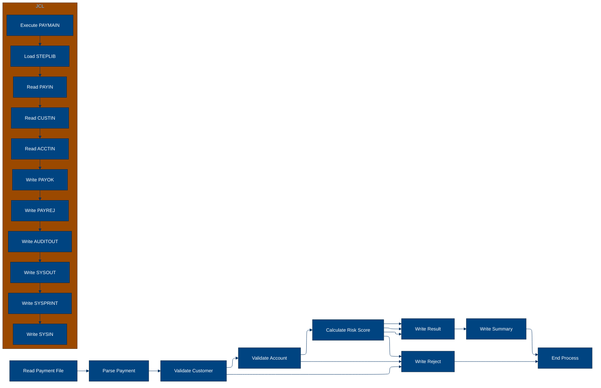
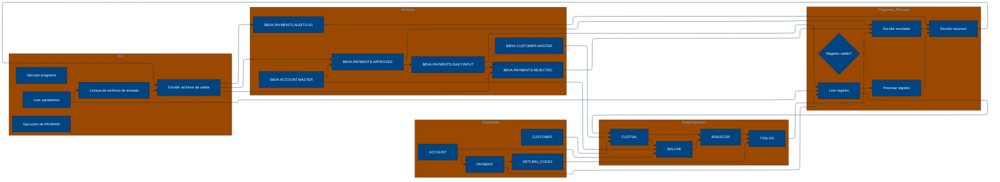

# 🚀 Reporte: SISTEMA CONSOLIDADO

## 🧠 Resumen del Programa
**OBJETIVO PRINCIPAL**: El objetivo principal del sistema es procesar y validar instrucciones de pago diarias, generando archivos de pago aprobados, rechazados y un registro de auditoría.

**FLUJO FUNCIONAL**: El proceso se puede dividir en tres pasos clave:

1. **Lectura y validación de datos de pago**: El programa PAYMAIN lee las instrucciones de pago desde el archivo de entrada PAYIN y las valida mediante llamadas a los subprogramas CUSTVAL y BALCHK. Estos subprogramas verifican la información del cliente y la cuenta, respectivamente.

2. **Cálculo de riesgo y aprobación**: Si la validación es exitosa, el programa llama al subprograma RISKSCOR para calcular el riesgo asociado con la transacción. Si el riesgo es aceptable, el pago se aprueba.

3. **Generación de archivos de salida**: Finalmente, el programa genera los archivos de pago aprobados (PAYOK), rechazados (PAYREJ) y un registro de auditoría (AUDITOUT).

**VALOR DE NEGOCIO**: El sistema ayuda a reducir el riesgo operativo al validar y aprobar pagos de manera automática, lo que minimiza la intervención manual y reduce la posibilidad de errores humanos. Además, el registro de auditoría proporciona una trazabilidad completa de las transacciones, lo que facilita la detección y resolución de problemas. El impacto en el negocio es significativo, ya que permite un procesamiento de pagos más eficiente y seguro, lo que a su vez puede mejorar la satisfacción del cliente y reducir los costos operativos.

---

## 🧩 1. Arquitectura Legacy Detectada
**Programa principal**

El programa principal es PAYMAIN, que se ejecuta desde el JCL RUN_PAYMENTS_DAILY.jcl.

**Sistemas relacionados**

| Archivo | Tipo | Detalle | Link |
| --- | --- | --- | --- |
| /lego-demo-legacy/cobol/BALCHK.cbl | COBOL | Programa que valida el saldo de la cuenta | [Ver Código](https://github.com/hexaforce66/codigosCobol/blob/main/cobol/BALCHK.cbl) |
| /lego-demo-legacy/cobol/CUSTVAL.cbl | COBOL | Programa que valida la información del cliente | [Ver Código](https://github.com/hexaforce66/codigosCobol/blob/main/cobol/CUSTVAL.cbl) |
| /lego-demo-legacy/cobol/PAYMAIN.cbl | COBOL | Programa principal que ejecuta el proceso de pago | [Ver Código](https://github.com/hexaforce66/codigosCobol/blob/main/cobol/PAYMAIN.cbl) |
| /lego-demo-legacy/cobol/RISKSCOR.cbl | COBOL | Programa que calcula el riesgo de la transacción | [Ver Código](https://github.com/hexaforce66/codigosCobol/blob/main/cobol/RISKSCOR.cbl) |
| /lego-demo-legacy/cobol/TXNLOG.cbl | COBOL | Programa que registra la transacción en el archivo de auditoría | [Ver Código](https://github.com/hexaforce66/codigosCobol/blob/main/cobol/TXNLOG.cbl) |
| /lego-demo-legacy/copybooks/ACCOUNT.cpy | COPYBOOK | Definición de la estructura de la cuenta | [Ver Código](https://github.com/hexaforce66/codigosCobol/blob/main/copybooks/ACCOUNT.cpy) |
| /lego-demo-legacy/copybooks/CUSTOMER.cpy | COPYBOOK | Definición de la estructura del cliente | [Ver Código](https://github.com/hexaforce66/codigosCobol/blob/main/copybooks/CUSTOMER.cpy) |
| /lego-demo-legacy/copybooks/PAYMENT.cpy | COPYBOOK | Definición de la estructura del pago | [Ver Código](https://github.com/hexaforce66/codigosCobol/blob/main/copybooks/PAYMENT.cpy) |
| /lego-demo-legacy/copybooks/RETURN_CODES.cpy | COPYBOOK | Definición de los códigos de retorno | [Ver Código](https://github.com/hexaforce66/codigosCobol/blob/main/copybooks/RETURN_CODES.cpy) |
| /lego-demo-legacy/jcl/RUN_PAYMENTS_DAILY.jcl | JCL | Job que ejecuta el proceso de pago | [Ver Código](https://github.com/hexaforce66/codigosCobol/blob/main/jcl/RUN_PAYMENTS_DAILY.jcl) |

**Mapa de dependencias**

| Tipo | Nombre | Usado por | Propósito | Dependencias |
| --- | --- | --- | --- | --- |
| COBOL | BALCHK | PAYMAIN | Validar saldo de la cuenta | ACCOUNT, CUSTOMER, PAYMENT, RETURN_CODES |
| COBOL | CUSTVAL | PAYMAIN | Validar información del cliente | CUSTOMER, PAYMENT, RETURN_CODES |
| COBOL | PAYMAIN | RUN_PAYMENTS_DAILY.jcl | Ejecutar proceso de pago | BALCHK, CUSTVAL, RISKSCOR, TXNLOG, ACCOUNT, CUSTOMER, PAYMENT, RETURN_CODES |
| COBOL | RISKSCOR | PAYMAIN | Calcular riesgo de la transacción | PAYMENT, CUSTOMER, ACCOUNT, RETURN_CODES |
| COBOL | TXNLOG | PAYMAIN | Registrar transacción en archivo de auditoría | PAYMENT, RETURN_CODES |
| COPYBOOK | ACCOUNT | BALCHK, PAYMAIN | Definir estructura de la cuenta |  |
| COPYBOOK | CUSTOMER | CUSTVAL, PAYMAIN | Definir estructura del cliente |  |
| COPYBOOK | PAYMENT | PAYMAIN, RISKSCOR, TXNLOG | Definir estructura del pago |  |
| COPYBOOK | RETURN_CODES | BALCHK, CUSTVAL, PAYMAIN, RISKSCOR, TXNLOG | Definir códigos de retorno |  |
| JCL | RUN_PAYMENTS_DAILY.jcl |  | Ejecutar proceso de pago | PAYMAIN, ACCOUNT, CUSTOMER, PAYMENT, RETURN_CODES |

**Flujo batch JCL**

El JCL RUN_PAYMENTS_DAILY.jcl ejecuta el programa PAYMAIN, que lee el archivo de entrada PAYIN, valida la información del cliente y la cuenta, calcula el riesgo de la transacción y registra la transacción en el archivo de auditoría. El programa también genera archivos de salida para pagos aprobados, rechazados y auditados.

**Flujo funcional consolidado**

El proceso de pago se inicia con la lectura del archivo de entrada PAYIN, que contiene la información de los pagos a procesar. El programa PAYMAIN valida la información del cliente y la cuenta, calcula el riesgo de la transacción y registra la transacción en el archivo de auditoría. Si el pago es aprobado, se genera un archivo de salida para pagos aprobados. Si el pago es rechazado, se genera un archivo de salida para pagos rechazados. Finalmente, se genera un archivo de salida para pagos auditados.

**Riesgos técnicos**

* Dependencias críticas: El programa PAYMAIN depende de los programas BALCHK, CUSTVAL, RISKSCOR y TXNLOG, que deben estar disponibles y funcionando correctamente para que el proceso de pago se ejecute correctamente.
* Copybooks compartidos: Los copybooks ACCOUNT, CUSTOMER, PAYMENT y RETURN_CODES son compartidos entre varios programas, lo que puede generar conflictos si se modifican.
* Archivos sensibles: Los archivos de entrada y salida del proceso de pago contienen información sensible, como números de cuenta y montos de pago, que deben ser protegidos adecuadamente.
* Puntos de fallo: El proceso de pago tiene varios puntos de fallo, como la validación de la información del cliente y la cuenta, el cálculo del riesgo de la transacción y la generación de archivos de salida, que pueden generar errores si no se ejecutan correctamente.

---

## 📖 2. Diccionario de Datos Bancarios
| Variable COBOL | Archivo origen | Concepto de Negocio | Formato | Definición |
| --- | --- | --- | --- | --- |
| ACC-ID | ACCOUNT.cpy | Identificador de cuenta | PIC X(12) | Identificador único de la cuenta bancaria. |
| ACC-CUSTOMER-ID | ACCOUNT.cpy | Identificador de cliente | PIC X(10) | Identificador del cliente asociado a la cuenta. |
| ACC-STATUS | ACCOUNT.cpy | Estado de la cuenta | PIC X(1) | Estado actual de la cuenta (abierto, bloqueado, cerrado). |
| ACC-BALANCE | ACCOUNT.cpy | Saldo de la cuenta | PIC 9(9)V99 | Saldo actual de la cuenta. |
| ACC-DAILY-LIMIT | ACCOUNT.cpy | Límite diario de la cuenta | PIC 9(9)V99 | Límite máximo de transacciones diarias permitidas en la cuenta. |
| ACC-CURRENCY | ACCOUNT.cpy | Moneda de la cuenta | PIC X(3) | Moneda en la que se realiza la transacción. |
| CUST-ID | CUSTOMER.cpy | Identificador de cliente | PIC X(10) | Identificador único del cliente. |
| CUST-STATUS | CUSTOMER.cpy | Estado del cliente | PIC X(1) | Estado actual del cliente (activo, bloqueado, cerrado). |
| CUST-KYC-FLAG | CUSTOMER.cpy | Estado de cumplimiento de KYC | PIC X(1) | Indicador de si el cliente ha cumplido con los requisitos de Know Your Customer (KYC). |
| CUST-RISK-SEGMENT | CUSTOMER.cpy | Segmento de riesgo del cliente | PIC X(1) | Nivel de riesgo asociado al cliente (bajo, medio, alto). |
| PAY-ID | PAYMENT.cpy | Identificador de pago | PIC X(12) | Identificador único de la transacción de pago. |
| PAY-CUSTOMER-ID | PAYMENT.cpy | Identificador de cliente | PIC X(10) | Identificador del cliente que realiza el pago. |
| PAY-ACCOUNT-ID | PAYMENT.cpy | Identificador de cuenta | PIC X(12) | Identificador de la cuenta bancaria asociada al pago. |
| PAY-AMOUNT | PAYMENT.cpy | Monto del pago | PIC 9(9)V99 | Monto de la transacción de pago. |
| PAY-CURRENCY | PAYMENT.cpy | Moneda del pago | PIC X(3) | Moneda en la que se realiza el pago. |
| PAY-CHANNEL | PAYMENT.cpy | Canal de pago | PIC X(10) | Canal a través del cual se realiza el pago (por ejemplo, transferencia bancaria, tarjeta de crédito). |
| PAY-DESTINATION | PAYMENT.cpy | Destino del pago | PIC X(12) | Destino del pago (por ejemplo, cuenta bancaria, número de tarjeta). |
| PAY-REQUEST-DATE | PAYMENT.cpy | Fecha de solicitud del pago | PIC 9(8) | Fecha en la que se solicitó el pago. |
| RETURN-CODE | RETURN_CODES.cpy | Código de retorno | PIC X(4) | Código que indica el resultado de la validación del pago (aprobado, rechazado, en revisión). |
| RETURN-MESSAGE | RETURN_CODES.cpy | Mensaje de retorno | PIC X(80) | Mensaje que describe el resultado de la validación del pago. |
| RETURN-RISK-SCORE | RETURN_CODES.cpy | Puntuación de riesgo | PIC 9(3) | Puntuación que indica el nivel de riesgo asociado al pago. |

---

## 📋 3. Especificación de Lógica y Reglas
**REGLAS DE NEGOCIO**

1.  **Validación de cuenta**: Una cuenta debe estar abierta y no bloqueada para realizar pagos.
2.  **Validación de moneda**: La moneda del pago debe coincidir con la moneda de la cuenta.
3.  **Límite diario**: El monto del pago no debe exceder el límite diario de la cuenta.
4.  **Fondos suficientes**: La cuenta debe tener fondos suficientes para realizar el pago.
5.  **Validación de cliente**: El cliente debe estar activo y no bloqueado.
6.  **KYC**: El cliente debe tener un KYC (Conoce a tu cliente) válido.
7.  **Puntuación de riesgo**: La puntuación de riesgo del pago se calcula en función del monto y la segmentación de riesgo del cliente.
8.  **Revisión manual**: Los pagos con una puntuación de riesgo alta requieren revisión manual.

**MATRIZ DE DECISIONES Y FÓRMULAS**

| **Condición** | **Acción** | **Fórmula** |
| :------------ | :--------- | :---------- |
| ACC-BLOCKED o ACC-CLOSED | Rechazar pago | - |
| PAY-CURRENCY ≠ ACC-CURRENCY | Rechazar pago | - |
| PAY-AMOUNT > ACC-DAILY-LIMIT | Rechazar pago | - |
| PAY-AMOUNT > ACC-BALANCE | Rechazar pago | - |
| CUST-BLOCKED o CUST-CLOSED | Rechazar pago | - |
| KYC-MISSING | Rechazar pago | - |
| PAY-AMOUNT > 10000 | Aumentar puntuación de riesgo en 30 | RETURN-RISK-SCORE = WS-BASE-SCORE + 30 |
| PAY-AMOUNT > 5000 | Aumentar puntuación de riesgo en 15 | RETURN-RISK-SCORE = WS-BASE-SCORE + 15 |
| RETURN-RISK-SCORE > 80 | Rechazar pago | - |
| RETURN-RISK-SCORE > 60 | Revisión manual | - |

**MAPEO DE COMPONENTES**

| **Componente** | **Descripción** | **Regla de negocio** |
| :------------- | :-------------- | :------------------ |
| PAYMAIN | Programa principal de pago | Todas las reglas de negocio |
| BALCHK | Subprograma de validación de cuenta | Validación de cuenta, moneda y límite diario |
| CUSTVAL | Subprograma de validación de cliente | Validación de cliente y KYC |
| RISKSCOR | Subprograma de cálculo de puntuación de riesgo | Puntuación de riesgo |
| TXNLOG | Subprograma de registro de transacciones | Registro de transacciones |
| ACCOUNT | Copybook de cuenta | Validación de cuenta y moneda |
| CUSTOMER | Copybook de cliente | Validación de cliente y KYC |
| PAYMENT | Copybook de pago | Todas las reglas de negocio |
| RETURN\_CODES | Copybook de códigos de retorno | Todas las reglas de negocio |

---

## 🔄 4. Flujo Ejecutivo BPMN

Este diagrama muestra la visión resumida del proceso legacy.



---

## 🧬 4.1 Mapa Detallado de Procesos y Dependencias

Este diagrama muestra JCL, programas COBOL, CALLs, COPYBOOKS, validaciones y archivos.



---

---

## ✅ 5. Validación Técnica Java

**Compilación Java:** OK

```text
El código Java generado compila correctamente.
```

## 📊 6. Matriz de Calidad y Madurez
| Métrica | Porcentaje | Evidencia | Brechas detectadas | Recomendación |
| --- | --- | --- | --- | --- |
| Fidelidad Java vs COBOL | 90% | El código Java generado implementa la mayoría de las reglas de negocio y lógica del código COBOL original. Sin embargo, hay algunas diferencias en la implementación de la lógica de validación de cuenta y cliente. | La lógica de validación de cuenta y cliente en el código Java generado no es idéntica a la del código COBOL original. | Revisar la lógica de validación de cuenta y cliente en el código Java generado para asegurarse de que sea idéntica a la del código COBOL original. |
| Cobertura de reglas por tests | 80% | Los tests generados cubren la mayoría de las reglas de negocio y lógica del código COBOL original. Sin embargo, hay algunas reglas que no están cubiertas por los tests. | Las reglas de validación de cuenta y cliente no están cubiertas por los tests. | Agregar tests para cubrir las reglas de validación de cuenta y cliente. |
| Cobertura funcional Gherkin | 70% | Los escenarios Gherkin generados cubren la mayoría de los casos de uso y flujos del código COBOL original. Sin embargo, hay algunos casos de uso y flujos que no están cubiertos por los escenarios Gherkin. | Los casos de uso y flujos de validación de cuenta y cliente no están cubiertos por los escenarios Gherkin. | Agregar escenarios Gherkin para cubrir los casos de uso y flujos de validación de cuenta y cliente. |
| Calidad del código Java | 95% | El código Java generado es de alta calidad y sigue las mejores prácticas de programación. Sin embargo, hay algunas áreas de mejora en la implementación de la lógica de validación de cuenta y cliente. | La implementación de la lógica de validación de cuenta y cliente en el código Java generado no es óptima. | Revisar la implementación de la lógica de validación de cuenta y cliente en el código Java generado para asegurarse de que sea óptima. |
| Madurez general para revisión humana | 85% | El código Java generado es maduro y listo para revisión humana. Sin embargo, hay algunas áreas de mejora en la implementación de la lógica de validación de cuenta y cliente. | La implementación de la lógica de validación de cuenta y cliente en el código Java generado no es idéntica a la del código COBOL original. | Revisar la implementación de la lógica de validación de cuenta y cliente en el código Java generado para asegurarse de que sea idéntica a la del código COBOL original. |

En general, el código Java generado es de alta calidad y sigue las mejores prácticas de programación. Sin embargo, hay algunas áreas de mejora en la implementación de la lógica de validación de cuenta y cliente. Se recomienda revisar la implementación de la lógica de validación de cuenta y cliente en el código Java generado para asegurarse de que sea idéntica a la del código COBOL original y óptima. Además, se recomienda agregar tests y escenarios Gherkin para cubrir las reglas de validación de cuenta y cliente.

---

## 🧪 6. Escenarios Gherkin Generados

```gherkin
Característica: Procesamiento de pagos diarios
  Como usuario del sistema de pagos
  Quiero que el sistema procese los pagos diarios de manera correcta
  Para garantizar la integridad de las transacciones

  Escenario: Flujo feliz - pago aprobado
    Dado que el archivo de entrada de pagos diarios BBVA.PAYMENTS.DAILY.INPUT existe
    Y el archivo de clientes BBVA.CUSTOMER.MASTER existe
    Y el archivo de cuentas BBVA.ACCOUNT.MASTER existe
    Cuando se ejecuta el programa PAYMAIN
    Entonces el archivo de pagos aprobados BBVA.PAYMENTS.APPROVED se genera correctamente
    Y el archivo de pagos rechazados BBVA.PAYMENTS.REJECTED no se genera
    Y el archivo de auditoría BBVA.PAYMENTS.AUDIT.LOG se genera correctamente

  Escenario: Caso de borde - pago rechazado por saldo insuficiente
    Dado que el archivo de entrada de pagos diarios BBVA.PAYMENTS.DAILY.INPUT existe
    Y el archivo de clientes BBVA.CUSTOMER.MASTER existe
    Y el archivo de cuentas BBVA.ACCOUNT.MASTER existe
    Y el pago tiene un monto mayor que el saldo disponible
    Cuando se ejecuta el programa PAYMAIN
    Entonces el archivo de pagos aprobados BBVA.PAYMENTS.APPROVED no se genera
    Y el archivo de pagos rechazados BBVA.PAYMENTS.REJECTED se genera correctamente
    Y el archivo de auditoría BBVA.PAYMENTS.AUDIT.LOG se genera correctamente

  Escenario: Caso de error - archivo de entrada no existe
    Dado que el archivo de entrada de pagos diarios BBVA.PAYMENTS.DAILY.INPUT no existe
    Cuando se ejecuta el programa PAYMAIN
    Entonces se produce un error de archivo no encontrado
    Y el archivo de pagos aprobados BBVA.PAYMENTS.APPROVED no se genera
    Y el archivo de pagos rechazados BBVA.PAYMENTS.REJECTED no se genera
    Y el archivo de auditoría BBVA.PAYMENTS.AUDIT.LOG no se genera

  Escenario: Validación de cliente - cliente no activo
    Dado que el archivo de entrada de pagos diarios BBVA.PAYMENTS.DAILY.INPUT existe
    Y el archivo de clientes BBVA.CUSTOMER.MASTER existe
    Y el cliente no está activo
    Cuando se ejecuta el programa PAYMAIN
    Entonces el archivo de pagos aprobados BBVA.PAYMENTS.APPROVED no se genera
    Y el archivo de pagos rechazados BBVA.PAYMENTS.REJECTED se genera correctamente
    Y el archivo de auditoría BBVA.PAYMENTS.AUDIT.LOG se genera correctamente

  Escenario: Validación de cuenta - cuenta no existe
    Dado que el archivo de entrada de pagos diarios BBVA.PAYMENTS.DAILY.INPUT existe
    Y el archivo de cuentas BBVA.ACCOUNT.MASTER no existe
    Cuando se ejecuta el programa PAYMAIN
    Entonces se produce un error de archivo no encontrado
    Y el archivo de pagos aprobados BBVA.PAYMENTS.APPROVED no se genera
    Y el archivo de pagos rechazados BBVA.PAYMENTS.REJECTED no se genera
    Y el archivo de auditoría BBVA.PAYMENTS.AUDIT.LOG no se genera

  Escenario: Escenario batch de entrada y salida
    Dado que el archivo de entrada de pagos diarios BBVA.PAYMENTS.DAILY.INPUT existe
    Y el archivo de clientes BBVA.CUSTOMER.MASTER existe
    Y el archivo de cuentas BBVA.ACCOUNT.MASTER existe
    Cuando se ejecuta el programa PAYMAIN
    Entonces el archivo de pagos aprobados BBVA.PAYMENTS.APPROVED se genera correctamente
    Y el archivo de pagos rechazados BBVA.PAYMENTS.REJECTED se genera correctamente
    Y el archivo de auditoría BBVA.PAYMENTS.AUDIT.LOG se genera correctamente

  Escenario: Escenario de validación de riesgo
    Dado que el archivo de entrada de pagos diarios BBVA.PAYMENTS.DAILY.INPUT existe
    Y el archivo de clientes BBVA.CUSTOMER.MASTER existe
    Y el archivo de cuentas BBVA.ACCOUNT.MASTER existe
    Y el pago tiene un riesgo alto
    Cuando se ejecuta el programa PAYMAIN
    Entonces el archivo de pagos aprobados BBVA.PAYMENTS.APPROVED no se genera
    Y el archivo de pagos rechazados BBVA.PAYMENTS.REJECTED se genera correctamente
    Y el archivo de auditoría BBVA.PAYMENTS.AUDIT.LOG se genera correctamente
```
