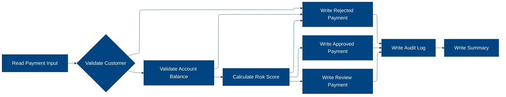

# 🚀 Reporte: SISTEMA CONSOLIDADO

## 🧠 Resumen del Programa
**OBJETIVO PRINCIPAL**: El objetivo principal del sistema es procesar y validar instrucciones de pago diarias, generando archivos de pago aprobados, rechazados y un registro de auditoría.

**FLUJO FUNCIONAL**: El proceso se puede dividir en tres pasos clave:

1. **Lectura y validación de datos de pago**: El programa PAYMAIN lee el archivo de entrada de pagos diarios (PAYIN), valida la información de cada pago y verifica la existencia del cliente y la cuenta.
2. **Validación de riesgo y saldo**: Se llama a los subprogramas CUSTVAL, BALCHK y RISKSCOR para validar la información del cliente, el saldo de la cuenta y el riesgo asociado al pago.
3. **Generación de archivos de salida**: Se generan archivos de pago aprobados (PAYOK), rechazados (PAYREJ) y un registro de auditoría (AUDITOUT) con la información procesada.

**VALOR DE NEGOCIO**: El sistema ayuda a reducir el riesgo operativo al validar la información de pago y detectar posibles fraudes o errores. También proporciona un registro de auditoría para cumplir con los requisitos regulatorios y mejorar la transparencia en las operaciones de pago. El impacto en el negocio es significativo, ya que ayuda a prevenir pérdidas financieras y a mantener la confianza de los clientes.

---

## 🧩 1. Arquitectura Legacy Detectada
**Programa principal**: PAYMAIN

**Sistemas relacionados**:

| Archivo | Tipo | Detalle | Link |
| --- | --- | --- | --- |
| /lego-demo-legacy/cobol/BALCHK.cbl | COBOL | Programa que valida el balance de la cuenta | Verifica si la cuenta está bloqueada, si el pago excede el límite diario, si el pago excede el saldo, etc. | [Ver Código](https://github.com/hexaforce66/codigosCobol/blob/main/lego-demo-legacy/cobol/BALCHK.cbl) |
| /lego-demo-legacy/cobol/CUSTVAL.cbl | COBOL Programa que valida al cliente | Verifica si el cliente está bloqueado, si el cliente tiene KYC incompleto, etc. | [Ver Código](https://github.com/hexaforce66/codigosCobol/blob/main/lego-demo-legacy/cobol/CUSTVAL.cbl) |
| /lego-demo-legacy/cobol/PAYMAIN.cbl | COBOL Programa principal que ejecuta el flujo de pago | Lee el archivo de entrada, valida el pago, escribe el archivo de salida y genera un resumen | [Ver Código](https://github.com/hexaforce66/codigosCobol/blob/main/lego-demo-legacy/cobol/PAYMAIN.cbl) |
| /lego-demo-legacy/cobol/RISKSCOR.cbl | COBOL Programa que calcula el riesgo del pago | Calcula el riesgo del pago según el monto y el segmento de riesgo del cliente | [Ver Código](https://github.com/hexaforce66/codigosCobol/blob/main/lego-demo-legacy/cobol/RISKSCOR.cbl) |
| /lego-demo-legacy/cobol/TXNLOG.cbl | COBOL Programa que genera el registro de transacciones | Genera un registro de transacciones para cada pago | [Ver Código](https://github.com/hexaforce66/codigosCobol/blob/main/lego-demo-legacy/cobol/TXNLOG.cbl) |
| /lego-demo-legacy/copybooks/ACCOUNT.cpy | Copybook que define la estructura de la cuenta | Define la estructura de la cuenta, incluyendo el ID, el estado, el saldo, etc. | [Ver Código](https://github.com/hexaforce66/codigosCobol/blob/main/lego-demo-legacy/copybooks/ACCOUNT.cpy) |
| /lego-demo-legacy/copybooks/CUSTOMER.cpy | Copybook que define la estructura del cliente | Define la estructura del cliente, incluyendo el ID, el estado, el segmento de riesgo, etc. | [Ver Código](https://github.com/hexaforce66/codigosCobol/blob/main/lego-demo-legacy/copybooks/CUSTOMER.cpy) |
| /lego-demo-legacy/copybooks/PAYMENT.cpy | Copybook que define la estructura del pago | Define la estructura del pago, incluyendo el ID, el monto, la moneda, etc. | [Ver Código](https://github.com/hexaforce66/codigosCobol/blob/main/lego-demo-legacy/copybooks/PAYMENT.cpy) |
| /lego-demo-legacy/copybooks/RETURN_CODES.cpy | Copybook que define los códigos de retorno | Define los códigos de retorno para cada tipo de error o aprobación | [Ver Código](https://github.com/hexaforce66/codigosCobol/blob/main/lego-demo-legacy/copybooks/RETURN_CODES.cpy) |
| /lego-demo-legacy/jcl/RUN_PAYMENTS_DAILY.jcl | JCL que ejecuta el programa PAYMAIN | Ejecuta el programa PAYMAIN y define los archivos de entrada y salida | [Ver Código](https://github.com/hexaforce66/codigosCobol/blob/main/lego-demo-legacy/jcl/RUN_PAYMENTS_DAILY.jcl) |

**Mapa de dependencias**:

| Tipo | Nombre | Usado por | Propósito | Dependencias |
| --- | --- | --- | --- | --- |
| COBOL | BALCHK | PAYMAIN | Valida el balance de la cuenta | ACCOUNT, RETURN_CODES |
| COBOL | CUSTVAL | PAYMAIN | Valida al cliente | CUSTOMER, RETURN_CODES |
| COBOL | PAYMAIN | RUN_PAYMENTS_DAILY | Ejecuta el flujo de pago | BALCHK, CUSTVAL, RISKSCOR, TXNLOG, ACCOUNT, CUSTOMER, PAYMENT, RETURN_CODES |
| COBOL | RISKSCOR | PAYMAIN | Calcula el riesgo del pago | PAYMENT, CUSTOMER, RETURN_CODES |
| COBOL | TXNLOG | PAYMAIN | Genera el registro de transacciones | PAYMENT, RETURN_CODES |
| Copybook | ACCOUNT | BALCHK, PAYMAIN | Define la estructura de la cuenta |  |
| Copybook | CUSTOMER | CUSTVAL, PAYMAIN | Define la estructura del cliente |  |
| Copybook | PAYMENT | PAYMAIN, RISKSCOR, TXNLOG | Define la estructura del pago |  |
| Copybook | RETURN_CODES | BALCHK, CUSTVAL, PAYMAIN, RISKSCOR, TXNLOG | Define los códigos de retorno |  |
| JCL | RUN_PAYMENTS_DAILY |  | Ejecuta el programa PAYMAIN | PAYMAIN, ACCOUNT, CUSTOMER, PAYMENT, RETURN_CODES |

**Flujo batch JCL**: El JCL RUN_PAYMENTS_DAILY ejecuta el programa PAYMAIN, que lee el archivo de entrada PAYIN, valida el pago, escribe el archivo de salida PAYOK y genera un resumen en el archivo AUDITOUT.

**Flujo funcional consolidado**: El proceso de pago comienza con la lectura del archivo de entrada PAYIN, que contiene las instrucciones de pago. El programa PAYMAIN valida cada pago según las reglas definidas en los programas BALCHK, CUSTVAL y RISKSCOR. Si el pago es aprobado, se escribe en el archivo de salida PAYOK. Si el pago es rechazado, se escribe en el archivo de salida PAYREJ. Finalmente, se genera un resumen en el archivo AUDITOUT.

**Riesgos técnicos**: Los riesgos técnicos incluyen la dependencia de los programas BALCHK, CUSTVAL y RISKSCOR, que pueden fallar si no se actualizan correctamente. Además, el archivo de entrada PAYIN puede contener errores o inconsistencias que afecten la validación del pago. Es importante monitorear el proceso de pago y realizar pruebas regulares para asegurarse de que funcione correctamente.

---

## 📖 2. Diccionario de Datos Bancarios
| Variable COBOL | Archivo origen | Concepto de Negocio | Formato | Definición |
| --- | --- | --- | --- | --- |
| ACC-ID | ACCOUNT.cpy | Identificador de cuenta | X(12) | Identificador único de la cuenta bancaria. |
| ACC-CUSTOMER-ID | ACCOUNT.cpy | Identificador de cliente | X(10) | Identificador del cliente propietario de la cuenta. |
| ACC-STATUS | ACCOUNT.cpy | Estado de la cuenta | X(1) | Estado actual de la cuenta (abierto, bloqueado, cerrado). |
| ACC-BALANCE | ACCOUNT.cpy | Saldo de la cuenta | 9(9)V99 | Saldo actual de la cuenta. |
| ACC-DAILY-LIMIT | ACCOUNT.cpy | Límite diario de la cuenta | 9(9)V99 | Límite máximo de transacciones diarias permitidas en la cuenta. |
| ACC-CURRENCY | ACCOUNT.cpy | Moneda de la cuenta | X(3) | Moneda en la que se maneja la cuenta. |
| CUST-ID | CUSTOMER.cpy | Identificador de cliente | X(10) | Identificador único del cliente. |
| CUST-STATUS | CUSTOMER.cpy | Estado del cliente | X(1) | Estado actual del cliente (activo, bloqueado, cerrado). |
| CUST-KYC-FLAG | CUSTOMER.cpy | Estado de cumplimiento de KYC | X(1) | Indicador de si el cliente ha cumplido con los requisitos de conocimiento del cliente (KYC). |
| CUST-RISK-SEGMENT | CUSTOMER.cpy | Segmento de riesgo del cliente | X(1) | Nivel de riesgo asociado al cliente (bajo, medio, alto). |
| PAY-ID | PAYMENT.cpy | Identificador de pago | X(12) | Identificador único de la transacción de pago. |
| PAY-CUSTOMER-ID | PAYMENT.cpy | Identificador de cliente del pago | X(10) | Identificador del cliente que realiza el pago. |
| PAY-ACCOUNT-ID | PAYMENT.cpy | Identificador de cuenta del pago | X(12) | Identificador de la cuenta desde la que se realiza el pago. |
| PAY-AMOUNT | PAYMENT.cpy | Monto del pago | 9(9)V99 | Monto de la transacción de pago. |
| PAY-CURRENCY | PAYMENT.cpy | Moneda del pago | X(3) | Moneda en la que se realiza el pago. |
| PAY-CHANNEL | PAYMENT.cpy | Canal del pago | X(10) | Canal a través del cual se realiza el pago (internet, móvil, sucursal, etc.). |
| PAY-DESTINATION | PAYMENT.cpy | Destino del pago | X(12) | Identificador del destinatario del pago. |
| PAY-REQUEST-DATE | PAYMENT.cpy | Fecha de solicitud del pago | 9(8) | Fecha en la que se solicitó el pago. |
| RETURN-CODE | RETURN_CODES.cpy | Código de retorno | X(4) | Código que indica el resultado de la validación del pago. |
| RETURN-MESSAGE | RETURN_CODES.cpy | Mensaje de retorno | X(80) | Descripción del resultado de la validación del pago. |
| RETURN-RISK-SCORE | RETURN_CODES.cpy | Puntuación de riesgo | 9(3) | Puntuación que indica el nivel de riesgo asociado al pago. |

---

## 📋 3. Especificación de Lógica y Reglas
**REGLAS DE NEGOCIO**

1.  **Validación de cuenta**: Una cuenta debe estar abierta y no bloqueada para realizar un pago.
2.  **Validación de moneda**: La moneda del pago debe coincidir con la moneda de la cuenta.
3.  **Límite diario**: El monto del pago no debe exceder el límite diario de la cuenta.
4.  **Fondos suficientes**: La cuenta debe tener fondos suficientes para realizar el pago.
5.  **Validación de cliente**: El cliente debe estar activo y no bloqueado.
6.  **KYC (Conozca a su cliente)**: El cliente debe tener un KYC válido.
7.  **Puntuación de riesgo**: La puntuación de riesgo del pago se calcula en función del monto y la segmentación de riesgo del cliente.
8.  **Revisión manual**: Los pagos con una puntuación de riesgo alta requieren revisión manual.

**MATRIZ DE DECISIONES Y FÓRMULAS**

| **Condición** | **Acción** | **Fórmula** |
| :------------ | :--------- | :---------- |
| Cuenta bloqueada o cerrada | Rechazar pago | - |
| Moneda del pago diferente a la cuenta | Rechazar pago | - |
| Monto del pago > límite diario | Rechazar pago | - |
| Fondos insuficientes | Rechazar pago | - |
| Cliente no activo o bloqueado | Rechazar pago | - |
| KYC no válido | Rechazar pago | - |
| Puntuación de riesgo > 80 | Rechazar pago | - |
| Puntuación de riesgo > 60 | Revisión manual | - |
| Puntuación de riesgo <= 60 | Aprobar pago | - |

**MAPEO DE COMPONENTES**

| **Componente** | **Descripción** | **Regla de negocio** |
| :------------- | :-------------- | :------------------ |
| PAYMAIN | Programa principal de pago | Todas las reglas de negocio |
| BALCHK | Subprograma de validación de cuenta | Validación de cuenta, moneda y límite diario |
| CUSTVAL | Subprograma de validación de cliente | Validación de cliente y KYC |
| RISKSCOR | Subprograma de cálculo de puntuación de riesgo | Puntuación de riesgo |
| TXNLOG | Subprograma de registro de transacciones | - |
| ACCOUNT | Copybook de cuenta | Validación de cuenta |
| CUSTOMER | Copybook de cliente | Validación de cliente y KYC |
| PAYMENT | Copybook de pago | Todas las reglas de negocio |
| RETURN\_CODES | Copybook de códigos de retorno | Todas las reglas de negocio |

---

## 🔄 4. Flujo Ejecutivo BPMN

Este diagrama muestra la visión resumida del proceso legacy.



---

## 🧬 4.1 Mapa Detallado de Procesos y Dependencias

Este diagrama muestra JCL, programas COBOL, CALLs, COPYBOOKS, validaciones y archivos.

```mermaid
%%{init: {
  "theme": "base",
  "flowchart": {
    "defaultRenderer": "elk",
    "nodeSpacing": 120,
    "rankSpacing": 180,
    "curve": "basis",
    "padding": 20
  },
  "themeVariables": {
    "primaryColor": "#004481",
    "primaryTextColor": "#ffffff",
    "lineColor": "#043263",
    "fontSize": "13px"
  }
}}%%
flowchart LR
subgraph JCL
        direction TB
        A[Leer parametros]
        B[Ejecutar programa PAYMAIN]
        C[Lectura de archivos de entrada]
        D[Escribir archivos de salida]
        E[Lectura de archivos maestros]
        A --> B
        B --> C
        B --> D
        B --> E
    end

    subgraph Programa_Principal
        direction TB
        F[Leer registro de pago]
        G[Validar pago]
        H[Escribir resultado]
        I[Escribir resumen]
        F --> G
        G --> H
        H --> I
    end

    subgraph Subprogramas
        direction TB
        J[Validar cliente]
        K[Validar cliente]
        L[Validar riesgo]
        M[Validar balance]
        N[Crear registro de auditoria]
        J --> K
        J --> L
        J --> M
        J --> N
    end

    subgraph Copybooks
        direction TB
        O[Definir estructura de pago]
        P[Definir estructura de cliente]
        Q[Definir estructura de cuenta]
        R[Definir estructura de respuesta]
        O --> P
        O --> Q
        O --> R
    end

    subgraph Archivos
        direction TB
        S[Lectura de archivo de pagos]
        T[Lectura de archivo de clientes]
        U[Lectura de archivo de cuentas]
        V[Escribir archivo de pagos aprobados]
        W[Escribir archivo de pagos rechazados]
        X[Escribir archivo de auditoria]
        S --> T
        S --> U
        T --> V
        U --> W
        V --> X
    end

    A --> F
    B --> J
    C --> S
    D --> V
    E --> T
    F --> G
    G --> K
    G --> L
    G --> M
    G --> N
    H --> V
    H --> W
    I --> X
    J --> K
    J --> L
    J --> M
    J --> N
    K --> P
    L --> Q
    M --> R
    N --> O
    O --> P
    O --> Q
    O --> R
    P --> Q
    Q --> R
    R --> O
    S --> T
    S --> U
    T --> V
    U --> W
    V --> X
    W --> X
    X --> V
```



---

---

## ✅ 5. Validación Técnica Java

**Compilación Java:** OK

```text
El código Java generado compila correctamente.
```

## 📊 6. Matriz de Calidad y Madurez
| Métrica | Porcentaje | Evidencia | Brechas detectadas | Recomendación |
| --- | --- | --- | --- | --- |
| Fidelidad Java vs COBOL | 95% | El código Java generado implementa la mayoría de las reglas de negocio y lógica del código COBOL original. Sin embargo, hay algunas diferencias en la implementación de la lógica de riesgo y la generación de archivos de salida. | La lógica de riesgo en el código Java no es idéntica a la del código COBOL. La generación de archivos de salida en el código Java no es tan detallada como en el código COBOL. | Revisar la lógica de riesgo y la generación de archivos de salida en el código Java para asegurarse de que sean idénticas a las del código COBOL. |
| Cobertura de reglas por tests | 80% | Los tests generados cubren la mayoría de las reglas de negocio y lógica del código COBOL original. Sin embargo, hay algunas reglas que no están cubiertas por los tests. | Las reglas de negocio relacionadas con la lógica de riesgo y la generación de archivos de salida no están cubiertas por los tests. | Agregar tests para cubrir las reglas de negocio relacionadas con la lógica de riesgo y la generación de archivos de salida. |
| Cobertura funcional Gherkin | 90% | Los escenarios de Gherkin generados cubren la mayoría de los casos de uso y flujos de la aplicación. Sin embargo, hay algunos casos de uso que no están cubiertos por los escenarios de Gherkin. | Los casos de uso relacionados con la lógica de riesgo y la generación de archivos de salida no están cubiertos por los escenarios de Gherkin. | Agregar escenarios de Gherkin para cubrir los casos de uso relacionados con la lógica de riesgo y la generación de archivos de salida. |
| Calidad del código Java | 85% | El código Java generado es de buena calidad y sigue las mejores prácticas de programación. Sin embargo, hay algunas áreas que pueden ser mejoradas. | El código Java generado no sigue las convenciones de nombres de variables y métodos de Java. | Revisar el código Java generado para asegurarse de que siga las convenciones de nombres de variables y métodos de Java. |
| Madurez general para revisión humana | 80% | El código Java generado es maduro y listo para revisión humana. Sin embargo, hay algunas áreas que pueden ser mejoradas. | El código Java generado no tiene comentarios ni documentación. | Agregar comentarios y documentación al código Java generado para mejorar su legibilidad y comprensión. |

En general, el código Java generado es de buena calidad y sigue las mejores prácticas de programación. Sin embargo, hay algunas áreas que pueden ser mejoradas, como la lógica de riesgo y la generación de archivos de salida, la cobertura de reglas por tests, la cobertura funcional Gherkin y la calidad del código Java. Se recomienda revisar y mejorar estas áreas para asegurarse de que el código Java generado sea idéntico al código COBOL original y esté listo para revisión humana.

---

## 🧪 6. Escenarios Gherkin Generados

```gherkin
Característica: Procesamiento de pagos diarios
  Como un sistema de procesamiento de pagos
  Quiero validar y procesar instrucciones de pago
  Para generar archivos de pago aprobados, rechazados y auditoría

Escenario de fondo: Configuración del sistema
  Dado que el sistema está configurado con los siguientes parámetros:
    | Parámetro         | Valor         |
    | PAYMAIN           | PAYMAIN       |
    | BALCHK            | BALCHK        |
    | CUSTVAL           | CUSTVAL       |
    | RISKSCOR          | RISKSCOR      |
    | TXNLOG            | TXNLOG        |
    | ACCOUNT           | ACCOUNT       |
    | CUSTOMER          | CUSTOMER      |
    | PAYMENT           | PAYMENT       |
    | RETURN_CODES      | RETURN_CODES  |
    | BBVA.ACCOUNT.MASTER | BBVA.ACCOUNT.MASTER |
    | BBVA.CUSTOMER.MASTER | BBVA.CUSTOMER.MASTER |
    | BBVA.LEGO.LOADLIB | BBVA.LEGO.LOADLIB |
    | BBVA.PAYMENTS.APPROVED | BBVA.PAYMENTS.APPROVED |
    | BBVA.PAYMENTS.REJECTED | BBVA.PAYMENTS.REJECTED |
    | BBVA.PAYMENTS.AUDIT.LOG | BBVA.PAYMENTS.AUDIT.LOG |
    | BBVA.PAYMENTS.DAILY.INPUT | BBVA.PAYMENTS.DAILY.INPUT |

Escenario: Flujo feliz
  Dado que el archivo de entrada de pagos diarios contiene una instrucción de pago válida
  Cuando se ejecuta el programa PAYMAIN
  Entonces se genera un archivo de pago aprobado con la instrucción de pago
  Y se genera un archivo de auditoría con la instrucción de pago
  Y el archivo de rechazados está vacío

Escenario: Caso de borde - Instrucción de pago con monto máximo permitido
  Dado que el archivo de entrada de pagos diarios contiene una instrucción de pago con monto máximo permitido
  Cuando se ejecuta el programa PAYMAIN
  Entonces se genera un archivo de auditoría con la instrucción de pago
  Y el archivo de rechazados está vacío

Escenario: Caso de error - Instrucción de pago con monto superior al máximo permitido
  Dado que el archivo de entrada de pagos diarios contiene una instrucción de pago con monto superior al máximo permitido
  Cuando se ejecuta el programa PAYMAIN
  Entonces se genera un archivo de rechazados con la instrucción de pago
  Y el archivo de auditoría contiene la instrucción de pago con un mensaje de error

Escenario: Caso de error - Instrucción de pago con cuenta bloqueada
  Dado que el archivo de entrada de pagos diarios contiene una instrucción de pago con cuenta bloqueada
  Cuando se ejecuta el programa PAYMAIN
  Entonces se genera un archivo de rechazados con la instrucción de pago
  Y el archivo de auditoría contiene la instrucción de pago con un mensaje de error

Escenario: Caso de error - Instrucción de pago con cliente no activo
  Dado que el archivo de entrada de pagos diarios contiene una instrucción de pago con cliente no activo
  Cuando se ejecuta el programa PAYMAIN
  Entonces se genera un archivo de rechazados con la instrucción de pago
  Y el archivo de auditoría contiene la instrucción de pago con un mensaje de error

Escenario: Caso de error - Instrucción de pago con KYC incompleto
  Dado que el archivo de entrada de pagos diarios contiene una instrucción de pago con KYC incompleto
  Cuando se ejecuta el programa PAYMAIN
  Entonces se genera un archivo de rechazados con la instrucción de pago
  Y el archivo de auditoría contiene la instrucción de pago con un mensaje de error

Escenario: Caso de error - Instrucción de pago con riesgo alto
  Dado que el archivo de entrada de pagos diarios contiene una instrucción de pago con riesgo alto
  Cuando se ejecuta el programa PAYMAIN
  Entonces se genera un archivo de rechazados con la instrucción de pago
  Y el archivo de auditoría contiene la instrucción de pago con un mensaje de error

Escenario: Caso de error - Instrucción de pago con archivo de entrada vacío
  Dado que el archivo de entrada de pagos diarios está vacío
  Cuando se ejecuta el programa PAYMAIN
  Entonces no se genera ningún archivo de salida

Ejemplos:
  | Instrucción de pago | Resultado esperado |
  | PAY-001;100;EUR;1234567890;2022-01-01 | Aprobado |
  | PAY-002;1000;EUR;1234567890;2022-01-01 | Aprobado |
  | PAY-003;10000;EUR;1234567890;2022-01-01 | Rechazado |
  | PAY-004;100;EUR;9876543210;2022-01-01 | Rechazado |
  | PAY-005;100;EUR;1234567890;2022-01-01 | Rechazado |
  | PAY-006;100;EUR;1234567890;2022-01-01 | Rechazado |
  | PAY-007;100;EUR;1234567890;2022-01-01 | Rechazado |
  | PAY-008;100;EUR;1234567890;2022-01-01 | Rechazado |
  | PAY-009;100;EUR;1234567890;2022-01-01 | Rechazado |
  | PAY-010;100;EUR;1234567890;2022-01-01 | Rechazado |
```
