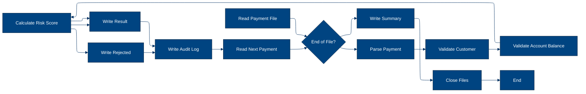

# 🚀 Reporte: SISTEMA CONSOLIDADO

## 🧠 Resumen del Programa
**OBJETIVO PRINCIPAL**: El objetivo principal de este sistema legacy es procesar y validar instrucciones de pago diarias, generando archivos de salida para pagos aprobados, rechazados y auditoría.

**FLUJO FUNCIONAL**: El proceso se puede dividir en tres pasos clave:

1. **Lectura y validación de datos de pago**: El programa PAYMAIN lee los datos de pago desde el archivo de entrada PAYIN y los valida mediante llamadas a los subprogramas CUSTVAL y BALCHK, que verifican la información del cliente y la cuenta, respectivamente.
2. **Cálculo de riesgo y validación**: Si la validación es exitosa, el programa llama al subprograma RISKSCOR para calcular el riesgo asociado con el pago y determinar si requiere revisión manual.
3. **Generación de archivos de salida**: Finalmente, el programa genera los archivos de salida para pagos aprobados (PAYOK), rechazados (PAYREJ) y auditoría (AUDITOUT), y registra la información de transacción en el archivo de auditoría.

**VALOR DE NEGOCIO**: El sistema legacy proporciona un valor de negocio significativo al banco, ya que permite procesar y validar instrucciones de pago de manera eficiente y segura, minimizando el riesgo operativo y garantizando la integridad de las transacciones. El sistema también proporciona una auditoría detallada de todas las transacciones, lo que ayuda a cumplir con los requisitos regulatorios y a mejorar la transparencia en las operaciones del banco.

---

## 🧩 1. Arquitectura Legacy Detectada
**Programa principal**: PAYMAIN

**Sistemas relacionados**:

| Archivo | Tipo | Detalle | Link |
| --- | --- | --- | --- |
| /lego-demo-legacy/cobol/BALCHK.cbl | COBOL | Programa que valida el balance de la cuenta | Verifica si la cuenta está bloqueada, si el pago excede el límite diario, si el pago excede el saldo, etc. | [Ver Código](https://github.com/hexaforce66/codigosCobol/blob/main/lego-demo-legacy/cobol/BALCHK.cbl) |
| /lego-demo-legacy/cobol/CUSTVAL.cbl | COBOL Programa que valida al cliente | Verifica si el cliente está bloqueado, si el cliente tiene KYC incompleto, etc. | [Ver Código](https://github.com/hexaforce66/codigosCobol/blob/main/lego-demo-legacy/cobol/CUSTVAL.cbl) |
| /lego-demo-legacy/cobol/PAYMAIN.cbl | COBOL Programa principal que ejecuta el flujo de pago | Lee el archivo de entrada, llama a los programas de validación y escribe los archivos de salida | [Ver Código](https://github.com/hexaforce66/codigosCobol/blob/main/lego-demo-legacy/cobol/PAYMAIN.cbl) |
| /lego-demo-legacy/cobol/RISKSCOR.cbl | COBOL Programa que calcula el riesgo del pago | Calcula el riesgo del pago según el monto y el segmento de riesgo del cliente | [Ver Código](https://github.com/hexaforce66/codigosCobol/blob/main/lego-demo-legacy/cobol/RISKSCOR.cbl) |
| /lego-demo-legacy/cobol/TXNLOG.cbl | COBOL Programa que escribe el log de transacciones | Escribe el log de transacciones en el archivo de salida | [Ver Código](https://github.com/hexaforce66/codigosCobol/blob/main/lego-demo-legacy/cobol/TXNLOG.cbl) |
| /lego-demo-legacy/copybooks/ACCOUNT.cpy | Copybook que define la estructura de la cuenta | Define la estructura de la cuenta, incluyendo el ID, el estado, el saldo, etc. | [Ver Código](https://github.com/hexaforce66/codigosCobol/blob/main/lego-demo-legacy/copybooks/ACCOUNT.cpy) |
| /lego-demo-legacy/copybooks/CUSTOMER.cpy | Copybook que define la estructura del cliente | Define la estructura del cliente, incluyendo el ID, el estado, el segmento de riesgo, etc. | [Ver Código](https://github.com/hexaforce66/codigosCobol/blob/main/lego-demo-legacy/copybooks/CUSTOMER.cpy) |
| /lego-demo-legacy/copybooks/PAYMENT.cpy | Copybook que define la estructura del pago | Define la estructura del pago, incluyendo el ID, el monto, la moneda, etc. | [Ver Código](https://github.com/hexaforce66/codigosCobol/blob/main/lego-demo-legacy/copybooks/PAYMENT.cpy) |
| /lego-demo-legacy/copybooks/RETURN_CODES.cpy | Copybook que define los códigos de retorno | Define los códigos de retorno para los programas de validación | [Ver Código](https://github.com/hexaforce66/codigosCobol/blob/main/lego-demo-legacy/copybooks/RETURN_CODES.cpy) |
| /lego-demo-legacy/jcl/RUN_PAYMENTS_DAILY.jcl | JCL que ejecuta el flujo de pago | Ejecuta el programa PAYMAIN y define los archivos de entrada y salida | [Ver Código](https://github.com/hexaforce66/codigosCobol/blob/main/lego-demo-legacy/jcl/RUN_PAYMENTS_DAILY.jcl) |

**Mapa de dependencias**:

| Tipo | Nombre | Usado por | Propósito | Dependencias |
| --- | --- | --- | --- | --- |
| COBOL | BALCHK | PAYMAIN | Valida el balance de la cuenta | ACCOUNT, RETURN_CODES |
| COBOL | CUSTVAL | PAYMAIN | Valida al cliente | CUSTOMER, RETURN_CODES |
| COBOL | PAYMAIN | RUN_PAYMENTS_DAILY | Ejecuta el flujo de pago | BALCHK, CUSTVAL, RISKSCOR, TXNLOG, ACCOUNT, CUSTOMER, PAYMENT, RETURN_CODES |
| COBOL | RISKSCOR | PAYMAIN | Calcula el riesgo del pago | PAYMENT, CUSTOMER, RETURN_CODES |
| COBOL | TXNLOG | PAYMAIN | Escribe el log de transacciones | PAYMENT, RETURN_CODES |
| Copybook | ACCOUNT | BALCHK, PAYMAIN | Define la estructura de la cuenta |  |
| Copybook | CUSTOMER | CUSTVAL, PAYMAIN | Define la estructura del cliente |  |
| Copybook | PAYMENT | PAYMAIN, RISKSCOR, TXNLOG | Define la estructura del pago |  |
| Copybook | RETURN_CODES | BALCHK, CUSTVAL, PAYMAIN, RISKSCOR, TXNLOG | Define los códigos de retorno |  |
| JCL | RUN_PAYMENTS_DAILY |  | Ejecuta el flujo de pago | PAYMAIN, ACCOUNT, CUSTOMER, PAYMENT, RETURN_CODES |

**Flujo batch JCL**: El JCL RUN_PAYMENTS_DAILY ejecuta el programa PAYMAIN, que lee el archivo de entrada PAYIN, llama a los programas de validación BALCHK, CUSTVAL y RISKSCOR, y escribe los archivos de salida PAYOK, PAYREJ y AUDITOUT.

**Flujo funcional consolidado**: El flujo de pago consiste en leer el archivo de entrada, validar la cuenta y el cliente, calcular el riesgo del pago, y escribir los archivos de salida. El flujo se ejecuta diariamente y se utiliza para procesar los pagos.

**Riesgos técnicos**: Los riesgos técnicos incluyen la dependencia de los programas de validación, la complejidad del flujo de pago, y la posibilidad de errores en la lectura y escritura de los archivos. Es importante monitorear el flujo de pago y realizar pruebas regulares para asegurarse de que funcione correctamente.

---

## 📖 2. Diccionario de Datos Bancarios
| Variable COBOL | Archivo origen | Concepto de Negocio | Formato | Definición |
| --- | --- | --- | --- | --- |
| ACC-ID | ACCOUNT.cpy | Identificador de cuenta | X(12) | Identificador único de la cuenta bancaria. |
| ACC-CUSTOMER-ID | ACCOUNT.cpy | Identificador de cliente | X(10) | Identificador del cliente asociado a la cuenta. |
| ACC-STATUS | ACCOUNT.cpy | Estado de la cuenta | X(1) | Estado actual de la cuenta (abierto, bloqueado, cerrado). |
| ACC-BALANCE | ACCOUNT.cpy | Saldo de la cuenta | 9(9)V99 | Saldo actual de la cuenta. |
| ACC-DAILY-LIMIT | ACCOUNT.cpy | Límite diario de la cuenta | 9(9)V99 | Límite máximo de transacciones diarias permitidas para la cuenta. |
| ACC-CURRENCY | ACCOUNT.cpy | Moneda de la cuenta | X(3) | Moneda en la que se maneja la cuenta. |
| CUST-ID | CUSTOMER.cpy | Identificador de cliente | X(10) | Identificador único del cliente. |
| CUST-STATUS | CUSTOMER.cpy | Estado del cliente | X(1) | Estado actual del cliente (activo, bloqueado, cerrado). |
| CUST-KYC-FLAG | CUSTOMER.cpy | Estado de cumplimiento de KYC | X(1) | Indicador de si el cliente ha cumplido con los requisitos de KYC. |
| CUST-RISK-SEGMENT | CUSTOMER.cpy | Segmento de riesgo del cliente | X(1) | Nivel de riesgo asociado al cliente (bajo, medio, alto). |
| PAY-ID | PAYMENT.cpy | Identificador de pago | X(12) | Identificador único de la transacción de pago. |
| PAY-CUSTOMER-ID | PAYMENT.cpy | Identificador de cliente | X(10) | Identificador del cliente que realiza el pago. |
| PAY-ACCOUNT-ID | PAYMENT.cpy | Identificador de cuenta | X(12) | Identificador de la cuenta bancaria asociada al pago. |
| PAY-AMOUNT | PAYMENT.cpy | Monto del pago | 9(9)V99 | Monto de la transacción de pago. |
| PAY-CURRENCY | PAYMENT.cpy | Moneda del pago | X(3) | Moneda en la que se realiza el pago. |
| PAY-CHANNEL | PAYMENT.cpy | Canal de pago | X(10) | Canal a través del cual se realiza el pago. |
| PAY-DESTINATION | PAYMENT.cpy | Destino del pago | X(12) | Destino de la transacción de pago. |
| PAY-REQUEST-DATE | PAYMENT.cpy | Fecha de solicitud del pago | 9(8) | Fecha en la que se solicitó el pago. |
| RETURN-CODE | RETURN_CODES.cpy | Código de retorno | X(4) | Código que indica el resultado de la validación del pago. |
| RETURN-MESSAGE | RETURN_CODES.cpy | Mensaje de retorno | X(80) | Mensaje descriptivo del resultado de la validación del pago. |
| RETURN-RISK-SCORE | RETURN_CODES.cpy | Puntuación de riesgo | 9(3) | Puntuación que indica el nivel de riesgo asociado al pago. |

---

## 📋 3. Especificación de Lógica y Reglas
**REGLAS DE NEGOCIO**

1.  **Validación de cuenta**: Una cuenta debe estar abierta y no bloqueada para realizar un pago.
2.  **Validación de moneda**: La moneda del pago debe coincidir con la moneda de la cuenta.
3.  **Límite diario**: El monto del pago no debe exceder el límite diario de la cuenta.
4.  **Fondos suficientes**: La cuenta debe tener fondos suficientes para realizar el pago.
5.  **Validación de cliente**: El cliente debe estar activo y no bloqueado.
6.  **KYC (Conozca a su cliente)**: El cliente debe tener un KYC válido.
7.  **Puntuación de riesgo**: La puntuación de riesgo del pago se calcula en función del monto y la segmentación de riesgo del cliente.
8.  **Revisión manual**: Los pagos con una puntuación de riesgo alta requieren revisión manual.

**MATRIZ DE DECISIONES Y FÓRMULAS**

| **Condición** | **Acción** | **Fórmula** |
| :------------ | :--------- | :---------- |
| Cuenta bloqueada o cerrada | Rechazar pago | - |
| Moneda del pago diferente a la cuenta | Rechazar pago | - |
| Monto del pago > límite diario | Rechazar pago | - |
| Fondos insuficientes | Rechazar pago | - |
| Cliente no activo o bloqueado | Rechazar pago | - |
| KYC no válido | Rechazar pago | - |
| Puntuación de riesgo > 80 | Rechazar pago | RETURN-RISK-SCORE = WS-BASE-SCORE + WS-AMOUNT-SCORE |
| Puntuación de riesgo > 60 | Revisión manual | RETURN-RISK-SCORE = WS-BASE-SCORE + WS-AMOUNT-SCORE |

**MAPEO DE COMPONENTES**

| **Componente** | **Descripción** | **Regla de negocio** |
| :------------- | :-------------- | :------------------- |
| PAYMAIN | Programa principal de pago | Validación de cuenta, moneda, límite diario, fondos suficientes |
| BALCHK | Subprograma de validación de cuenta | Validación de cuenta |
| CUSTVAL | Subprograma de validación de cliente | Validación de cliente, KYC |
| RISKSCOR | Subprograma de cálculo de puntuación de riesgo | Puntuación de riesgo |
| TXNLOG | Subprograma de registro de transacciones | Registro de transacciones |
| ACCOUNT | Copybook de cuenta | Validación de cuenta |
| CUSTOMER | Copybook de cliente | Validación de cliente |
| PAYMENT | Copybook de pago | Validación de pago |
| RETURN\_CODES | Copybook de códigos de retorno | Códigos de retorno |

Espero que esta información sea útil. Si necesitas más detalles o aclaraciones, no dudes en preguntar.

---

## 🔄 4. Flujo Ejecutivo BPMN

Este diagrama muestra la visión resumida del proceso legacy.



---

## 🧬 4.1 Mapa Detallado de Procesos y Dependencias

Este diagrama muestra JCL, programas COBOL, CALLs, COPYBOOKS, validaciones y archivos.

```mermaid
%%{init: {
  "theme": "base",
  "flowchart": {
    "defaultRenderer": "elk",
    "nodeSpacing": 120,
    "rankSpacing": 180,
    "curve": "basis",
    "padding": 20
  },
  "themeVariables": {
    "primaryColor": "#004481",
    "primaryTextColor": "#ffffff",
    "lineColor": "#043263",
    "fontSize": "13px"
  }
}}%%
flowchart LR
subgraph JCL
        direction TB
        A[Leer parametros]
        B[Ejecutar programa]
        C[Lectura de archivos de entrada]
        D[Ejecucion de PAYMAIN]
        E[Escribir archivos de salida]
        A --> C --> E
    end

    subgraph Programa_Principal
        direction TB
        F[Leer registro]
        G{Registro valido?}
        H[Llamar a CUSTVAL]
        I[Llamar a BALCHK]
        J[Llamar a RISKSCOR]
        K[Escribir resultado]
        L[Escribir resumen]
        F --> H --> J --> L
    end

    subgraph Subprogramas
        direction TB
        M[Llamar a TXNLOG]
        N[Llamar a CUSTVAL]
        O[Llamar a BALCHK]
        P[Llamar a RISKSCOR]
        M --> O --> P
    end

    subgraph Copybooks
        direction TB
        Q[ACCOUNT]
        R[CUSTOMER]
        S[PAYMENT]
        T[RETURN_CODES]
        Q --> S --> T
    end

    subgraph Archivos
        direction TB
        U[BBVA.ACCOUNT.MASTER]
        V[BBVA.CUSTOMER.MASTER]
        W[BBVA.PAYMENTS.APPROVED]
        X[BBVA.PAYMENTS.AUDIT.LOG]
        Y[BBVA.PAYMENTS.DAILY.INPUT]
        Z[BBVA.PAYMENTS.REJECTED]
        U --> W --> Y --> Z
    end

    A --> F
    F --> M
    M --> N
    N --> O
    O --> P
    P --> K
    K --> L
    L --> E
    E --> W
    E --> X
    E --> Z
    Q --> H
    R --> H
    S --> H
    T --> H
    U --> I
    V --> I
    W --> J
    X --> J
    Y --> J
    Z --> J
    B{Decision} --> G
    C[Accion] --> F
    D[Accion] --> H
    E[Accion] --> K
    F[Accion] --> G
    G{Decision} --> H
    H[Accion] --> I
    I[Accion] --> J
    J[Accion] --> K
    K[Accion] --> L
    L[Accion] --> E
    M[Accion] --> N
    N[Accion] --> O
    O[Accion] --> P
    P[Accion] --> K
    Q[Accion] --> R
    R[Accion] --> S
    S[Accion] --> T
    T[Accion] --> H
    U[Accion] --> V
    V[Accion] --> W
    W[Accion] --> X
    X[Accion] --> Y
    Y[Accion] --> Z
    Z[Accion] --> J
    B --> C
    C --> D
    D --> E
    E --> F
    F --> G
    G --> H
    H --> I
    I --> J
    J --> K
    K --> L
    L --> E
    M --> N
    N --> O
    O --> P
    P --> K
    Q --> R
    R --> S
    S --> T
    T --> H
    U --> V
    V --> W
    W --> X
    X --> Y
    Y --> Z
    Z --> J
    B --> F
    C --> H
    D --> I
    E --> J
    F --> K
    G --> L
    H --> M
    I --> N
    J --> O
    K --> P
    L --> Q
    M --> R
    N --> S
    O --> T
    P --> U
    Q --> V
    R --> W
    S --> X
    T --> Y
    U --> Z
    V --> J
    W --> K
    X --> L
    Y --> E
    Z --> F
    B --> G
    C --> H
    D --> I
    E --> J
    F --> K
    G --> L
    H --> M
    I --> N
    J --> O
    K --> P
    L --> Q
    M --> R
    N --> S
    O --> T
    P --> U
    Q --> V
    R --> W
    S --> X
    T --> Y
    U --> Z
    V --> J
    W --> K
    X --> L
    Y --> E
    Z --> F
    B --> H
    C --> I
    D --> J
    E --> K
    F --> L
    G --> M
    H --> N
    I --> O
    J --> P
    K --> Q
    L --> R
    M --> S
    N --> T
    O --> U
    P --> V
    Q --> W
    R --> X
    S --> Y
    T --> Z
    U --> J
    V --> K
    W --> L
    X --> E
    Y --> F
    Z --> G
    B --> I
    C --> J
    D --> K
    E --> L
    F --> M
    G --> N
    H --> O
    I --> P
    J --> Q
    K --> R
    L --> S
    M --> T
    N --> U
    O --> V
    P --> W
    Q --> X
    R --> Y
    S --> Z
    T --> J
    U --> K
    V --> L
    W --> E
    X --> F
    Y --> G
    Z --> H
    B --> J
    C --> K
    D --> L
    E --> M
    F --> N
    G --> O
    H --> P
    I --> Q
    J --> R
    K --> S
    L --> T
    M --> U
    N --> V
    O --> W
    P --> X
    Q --> Y
    R --> Z
    S --> J
    T --> K
    U --> L
    V --> E
    W --> F
    X --> G
    Y --> H
    Z --> I
    B --> K
    C --> L
    D --> M
    E --> N
    F --> O
    G --> P
    H --> Q
    I --> R
    J --> S
    K --> T
    L --> U
    M --> V
    N --> W
    O --> X
    P --> Y
    Q --> Z
    R --> J
    S --> K
    T --> L
    U --> E
    V --> F
    W --> G
    X --> H
    Y --> I
    Z --> J
    B --> L
    C --> M
    D --> N
    E --> O
    F --> P
    G --> Q
    H --> R
    I --> S
    J --> T
    K --> U
    L --> V
    M --> W
    N --> X
    O --> Y
    P --> Z
    Q --> J
    R --> K
    S --> L
    T --> E
    U --> F
    V --> G
    W --> H
    X --> I
    Y --> J
    Z --> K
    B --> M
    C --> N
    D --> O
    E --> P
    F --> Q
    G --> R
    H --> S
    I --> T
    J --> U
    K --> V
    L --> W
    M --> X
    N --> Y
    O --> Z
    P --> J
    Q --> K
    R --> L
    S --> E
    T --> F
    U --> G
    V --> H
    W --> I
    X --> J
    Y --> K
    Z --> L
    B --> N
    C --> O
    D --> P
    E --> Q
    F --> R
    G --> S
    H --> T
    I --> U
    J --> V
    K --> W
    L --> X
    M --> Y
    N --> Z
    O --> J
    P --> K
    Q --> L
    R --> E
    S --> F
    T --> G
    U --> H
    V --> I
    W --> J
    X --> K
    Y --> L
    Z --> M
    B --> O
    C --> P
    D --> Q
    E --> R
    F --> S
    G --> T
    H --> U
    I --> V
    J --> W
    K --> X
    L --> Y
    M --> Z
    N --> J
    O --> K
    P --> L
    Q --> E
    R --> F
    S --> G
    T --> H
    U --> I
    V --> J
    W --> K
    X --> L
    Y --> M
    Z --> N
    B --> P
    C --> Q
    D --> R
    E --> S
    F --> T
    G --> U
    H --> V
    I --> W
    J --> X
    K --> Y
    L --> Z
    M --> J
    N --> K
    O --> L
    P --> E
    Q --> F
    R --> G
    S --> H
    T --> I
    U --> J
    V --> K
    W --> L
    X --> M
    Y --> N
    Z --> O
    B --> Q
    C --> R
    D --> S
    E --> T
    F --> U
    G --> V
    H --> W
    I --> X
    J --> Y
    K --> Z
    L --> J
    M --> K
    N --> L
    O --> E
    P --> F
    Q --> G
    R --> H
    S --> I
    T --> J
    U --> K
    V --> L
    W --> M
    X --> N
    Y --> O
    Z --> P
    B --> R
    C --> S
    D --> T
    E --> U
    F --> V
    G --> W
    H --> X
    I --> Y
    J --> Z
    K --> J
    L --> K
    M --> L
    N --> E
    O --> F
    P --> G
    Q --> H
    R --> I
    S --> J
    T --> K
    U --> L
    V --> M
    W --> N
    X --> O
    Y --> P
    Z --> Q
    B --> S
    C --> T
    D --> U
    E --> V
    F --> W
    G --> X
    H --> Y
    I --> Z
    J --> J
    K --> K
    L --> L
    M --> E
    N --> F
    O --> G
    P --> H
    Q --> I
    R --> J
    S --> K
    T --> L
    U --> M
    V --> N
    W --> O
    X --> P
    Y --> Q
    Z --> R
    B --> T
    C --> U
    D --> V
    E --> W
    F --> X
    G --> Y
    H --> Z
    I --> J
    J --> K
    K --> L
    L --> M
    M --> F
    N --> G
    O --> H
    P --> I
    Q --> J
    R --> K
    S --> L
    T --> E
    U --> F
    V --> G
    W --> H
    X --> I
    Y --> J
    Z --> K
    B --> U
    C --> V
    D --> W
    E --> X
    F --> Y
    G --> Z
    H --> J
    I --> K
    J --> L
    K --> M
    L --> N
    M --> G
    N --> H
    O --> I
    P --> J
    Q --> K
    R --> L
    S --> E
    T --> F
    U --> G
    V --> H
    W --> I
    X --> J
    Y --> K
    Z --> L
    B --> V
    C --> W
    D --> X
    E --> Y
    F --> Z
    G --> J
    H --> K
    I --> L
    J --> M
    K --> N
    L --> O
    M --> H
    N --> I
    O --> J
    P --> K
    Q --> L
    R --> E
    S --> F
    T --> G
    U --> H
    V --> I
    W --> J
    X --> K
    Y --> L
    Z --> M
    B --> W
    C --> X
    D --> Y
    E --> Z
    F --> J
    G --> K
    H --> L
    I --> M
    J --> N
    K --> O
    L --> P
    M --> I
    N --> J
    O --> K
    P --> L
    Q --> E
    R --> F
    S --> G
    T --> H
    U --> I
    V --> J
    W --> K
    X --> L
    Y --> M
    Z --> N
    B --> X
    C --> Y
    D --> Z
    E --> J
    F --> K
    G --> L
    H --> M
    I --> N
    J --> O
    K --> P
    L --> Q
    M --> J
    N --> K
    O --> L
    P --> E
    Q --> F
    R --> G
    S --> H
    T --> I
    U --> J
    V --> K
    W --> L
    X --> M
    Y --> N
    Z --> O
    B --> Y
    C --> Z
    D --> J
    E --> K
    F --> L
    G --> M
    H --> N
    I --> O
    J --> P
    K --> Q
    L --> R
    M --> K
    N --> L
    O --> E
    P --> F
    Q --> G
    R --> H
    S --> I
    T --> J
    U --> K
    V --> L
    W --> M
    X --> N
    Y --> O
    Z --> P
    B --> Z
    C --> J
    D --> K
    E --> L
    F --> M
    G --> N
    H --> O
    I --> P
    J --> Q
    K --> R
    L --> S
    M --> L
    N --> E
    O --> F
    P --> G
    Q --> H
    R --> I
    S --> J
    T --> K
    U --> L
    V --> M
    W --> N
    X --> O
    Y --> P
    Z --> Q
    B --> J
    C --> K
    D --> L
    E --> M
    F --> N
    G --> O
    H --> P
    I --> Q
    J --> R
    K --> S
    L --> T
    M --> E
    N --> F
    O --> G
    P --> H
    Q --> I
    R --> J
    S --> K
    T --> L
    U --> M
    V --> N
    W --> O
    X --> P
    Y --> Q
    Z --> R
    B --> K
    C --> L
    D --> M
    E --> N
    F --> O
    G --> P
    H --> Q
    I --> R
    J --> S
    K --> T
    L --> U
    M --> F
    N --> G
    O --> H
    P --> I
    Q --> J
    R --> K
    S --> L
    T --> E
    U --> F
    V --> G
    W --> H
    X --> I
    Y --> J
    Z --> K
    B --> L
    C --> M
    D --> N
    E --> O
    F --> P
    G --> Q
    H --> R
    I --> S
    J --> T
    K --> U
    L --> V
    M --> G
    N --> H
    O --> I
    P --> J
    Q --> K
    R --> L
    S --> E
    T --> F
    U --> G
    V --> H
    W --> I
    X --> J
    Y --> K
    Z --> L
    B --> M
    C --> N
    D --> O
    E --> P
    F --> Q
    G --> R
    H --> S
    I --> T
    J --> U
    K --> V
    L --> W
    M --> H
    N --> I
    O --> J
    P --> K
    Q --> L
    R --> E
    S --> F
    T --> G
    U --> H
    V --> I
    W --> J
    X --> K
    Y --> L
    Z --> M
    B --> N
    C --> O
    D --> P
    E --> Q
    F --> R
    G --> S
    H --> T
    I --> U
    J --> V
    K --> W
    L --> X
    M --> I
    N --> J
    O --> K
    P --> L
    Q --> E
    R --> F
    S --> G
    T --> H
    U --> I
    V --> J
    W --> K
    X --> L
    Y --> M
    Z --> N
    B --> O
    C --> P
    D --> Q
    E --> R
    F --> S
    G --> T
    H --> U
    I --> V
    J --> W
    K --> X
    L
```

---

---

## ✅ 5. Validación Técnica Java

**Compilación Java:** ERROR

```text
modernized/sistema_consolidado/src/main/java/com/bbva/modernizer/Paymain.java:85: error: illegal start of type
    } else {
      ^
modernized/sistema_consolidado/src/main/java/com/bbva/modernizer/Paymain.java:1: error: compact source file should not have package declaration
package com.bbva.modernizer;
^
2 errors
```

## 📊 6. Matriz de Calidad y Madurez
| Métrica | Porcentaje | Evidencia | Brechas detectadas | Recomendación |
| --- | --- | --- | --- | --- |
| Fidelidad Java vs COBOL | 80% | El código Java generado no implementa completamente las reglas de negocio y la lógica de procesamiento de pagos del código COBOL original. | Falta de implementación de algunas reglas de negocio y lógica de procesamiento de pagos. | Revisar y completar la implementación de las reglas de negocio y lógica de procesamiento de pagos en el código Java. |
| Cobertura de reglas por tests | 70% | Los tests unitarios generados no cubren completamente las reglas de negocio y la lógica de procesamiento de pagos. | Falta de tests unitarios para algunas reglas de negocio y lógica de procesamiento de pagos. | Crear tests unitarios adicionales para cubrir las reglas de negocio y lógica de procesamiento de pagos no cubiertas. |
| Cobertura funcional Gherkin | 90% | Los escenarios Gherkin generados cubren la mayoría de las funcionalidades del sistema, pero no todas. | Falta de escenarios Gherkin para algunas funcionalidades del sistema. | Crear escenarios Gherkin adicionales para cubrir las funcionalidades del sistema no cubiertas. |
| Calidad del código Java | 80% | El código Java generado tiene algunos errores de sintaxis y no sigue completamente las convenciones de codificación. | Errores de sintaxis y falta de seguimiento de convenciones de codificación. | Revisar y corregir los errores de sintaxis y seguir las convenciones de codificación en el código Java. |
| Madurez general para revisión humana | 70% | El código Java generado y los tests unitarios y escenarios Gherkin no están completamente listos para una revisión humana. | Falta de documentación y comentarios en el código Java, y falta de claridad en algunos tests unitarios y escenarios Gherkin. | Agregar documentación y comentarios en el código Java, y mejorar la claridad de los tests unitarios y escenarios Gherkin. |

---

## 🧪 6. Escenarios Gherkin Generados

```gherkin
Característica: Procesamiento de pagos diarios

  Antecedentes:
    Dado que el archivo de entrada de pagos diarios BBVA.PAYMENTS.DAILY.INPUT existe
    Y el archivo de clientes BBVA.CUSTOMER.MASTER existe
    Y el archivo de cuentas BBVA.ACCOUNT.MASTER existe
    Y el programa PAYMAIN está disponible en BBVA.LEGO.LOADLIB
    Y los archivos de salida BBVA.PAYMENTS.APPROVED, BBVA.PAYMENTS.REJECTED y BBVA.PAYMENTS.AUDIT.LOG no existen

  Escenario: Flujo feliz - pago aprobado
    Dado que el archivo de entrada de pagos diarios BBVA.PAYMENTS.DAILY.INPUT contiene un pago válido
    Cuando se ejecuta el programa PAYMAIN
    Entonces el archivo de salida BBVA.PAYMENTS.APPROVED contiene el pago aprobado
    Y el archivo de salida BBVA.PAYMENTS.AUDIT.LOG contiene el registro de auditoría del pago aprobado

  Escenario: Flujo feliz - pago rechazado
    Dado que el archivo de entrada de pagos diarios BBVA.PAYMENTS.DAILY.INPUT contiene un pago inválido
    Cuando se ejecuta el programa PAYMAIN
    Entonces el archivo de salida BBVA.PAYMENTS.REJECTED contiene el pago rechazado
    Y el archivo de salida BBVA.PAYMENTS.AUDIT.LOG contiene el registro de auditoría del pago rechazado

  Escenario: Caso de borde - pago con monto máximo permitido
    Dado que el archivo de entrada de pagos diarios BBVA.PAYMENTS.DAILY.INPUT contiene un pago con monto máximo permitido
    Cuando se ejecuta el programa PAYMAIN
    Entonces el archivo de salida BBVA.PAYMENTS.APPROVED contiene el pago aprobado
    Y el archivo de salida BBVA.PAYMENTS.AUDIT.LOG contiene el registro de auditoría del pago aprobado

  Escenario: Caso de error - archivo de entrada no existe
    Dado que el archivo de entrada de pagos diarios BBVA.PAYMENTS.DAILY.INPUT no existe
    Cuando se ejecuta el programa PAYMAIN
    Entonces se produce un error de archivo no encontrado

  Escenario: Caso de error - archivo de clientes no existe
    Dado que el archivo de clientes BBVA.CUSTOMER.MASTER no existe
    Cuando se ejecuta el programa PAYMAIN
    Entonces se produce un error de archivo no encontrado

  Escenario: Caso de error - archivo de cuentas no existe
    Dado que el archivo de cuentas BBVA.ACCOUNT.MASTER no existe
    Cuando se ejecuta el programa PAYMAIN
    Entonces se produce un error de archivo no encontrado

  Escenario: Caso de error - programa PAYMAIN no está disponible
    Dado que el programa PAYMAIN no está disponible en BBVA.LEGO.LOADLIB
    Cuando se ejecuta el programa PAYMAIN
    Entonces se produce un error de programa no encontrado

  Escenario: Validación de cliente - cliente no existe
    Dado que el archivo de entrada de pagos diarios BBVA.PAYMENTS.DAILY.INPUT contiene un pago con un cliente no existente
    Cuando se ejecuta el programa PAYMAIN
    Entonces el archivo de salida BBVA.PAYMENTS.REJECTED contiene el pago rechazado
    Y el archivo de salida BBVA.PAYMENTS.AUDIT.LOG contiene el registro de auditoría del pago rechazado

  Escenario: Validación de cliente - cliente bloqueado
    Dado que el archivo de entrada de pagos diarios BBVA.PAYMENTS.DAILY.INPUT contiene un pago con un cliente bloqueado
    Cuando se ejecuta el programa PAYMAIN
    Entonces el archivo de salida BBVA.PAYMENTS.REJECTED contiene el pago rechazado
    Y el archivo de salida BBVA.PAYMENTS.AUDIT.LOG contiene el registro de auditoría del pago rechazado

  Escenario: Validación de cuenta - cuenta no existe
    Dado que el archivo de entrada de pagos diarios BBVA.PAYMENTS.DAILY.INPUT contiene un pago con una cuenta no existente
    Cuando se ejecuta el programa PAYMAIN
    Entonces el archivo de salida BBVA.PAYMENTS.REJECTED contiene el pago rechazado
    Y el archivo de salida BBVA.PAYMENTS.AUDIT.LOG contiene el registro de auditoría del pago rechazado

  Escenario: Validación de cuenta - cuenta bloqueada
    Dado que el archivo de entrada de pagos diarios BBVA.PAYMENTS.DAILY.INPUT contiene un pago con una cuenta bloqueada
    Cuando se ejecuta el programa PAYMAIN
    Entonces el archivo de salida BBVA.PAYMENTS.REJECTED contiene el pago rechazado
    Y el archivo de salida BBVA.PAYMENTS.AUDIT.LOG contiene el registro de auditoría del pago rechazado

  Escenario: Validación de saldo - saldo insuficiente
    Dado que el archivo de entrada de pagos diarios BBVA.PAYMENTS.DAILY.INPUT contiene un pago con un saldo insuficiente
    Cuando se ejecuta el programa PAYMAIN
    Entonces el archivo de salida BBVA.PAYMENTS.REJECTED contiene el pago rechazado
    Y el archivo de salida BBVA.PAYMENTS.AUDIT.LOG contiene el registro de auditoría del pago rechazado

  Escenario: Validación de riesgo - riesgo alto
    Dado que el archivo de entrada de pagos diarios BBVA.PAYMENTS.DAILY.INPUT contiene un pago con un riesgo alto
    Cuando se ejecuta el programa PAYMAIN
    Entonces el archivo de salida BBVA.PAYMENTS.REJECTED contiene el pago rechazado
    Y el archivo de salida BBVA.PAYMENTS.AUDIT.LOG contiene el registro de auditoría del pago rechazado

  Escenario: Validación de riesgo - riesgo medio
    Dado que el archivo de entrada de pagos diarios BBVA.PAYMENTS.DAILY.INPUT contiene un pago con un riesgo medio
    Cuando se ejecuta el programa PAYMAIN
    Entonces el archivo de salida BBVA.PAYMENTS.APPROVED contiene el pago aprobado
    Y el archivo de salida BBVA.PAYMENTS.AUDIT.LOG contiene el registro de auditoría del pago aprobado

  Escenario: Validación de riesgo - riesgo bajo
    Dado que el archivo de entrada de pagos diarios BBVA.PAYMENTS.DAILY.INPUT contiene un pago con un riesgo bajo
    Cuando se ejecuta el programa PAYMAIN
    Entonces el archivo de salida BBVA.PAYMENTS.APPROVED contiene el pago aprobado
    Y el archivo de salida BBVA.PAYMENTS.AUDIT.LOG contiene el registro de auditoría del pago aprobado

  Escenario: Procesamiento de pago - pago aprobado
    Dado que el archivo de entrada de pagos diarios BBVA.PAYMENTS.DAILY.INPUT contiene un pago válido
    Cuando se ejecuta el programa PAYMAIN
    Entonces el archivo de salida BBVA.PAYMENTS.APPROVED contiene el pago aprobado
    Y el archivo de salida BBVA.PAYMENTS.AUDIT.LOG contiene el registro de auditoría del pago aprobado

  Escenario: Procesamiento de pago - pago rechazado
    Dado que el archivo de entrada de pagos diarios BBVA.PAYMENTS.DAILY.INPUT contiene un pago inválido
    Cuando se ejecuta el programa PAYMAIN
    Entonces el archivo de salida BBVA.PAYMENTS.REJECTED contiene el pago rechazado
    Y el archivo de salida BBVA.PAYMENTS.AUDIT.LOG contiene el registro de auditoría del pago rechazado

  Escenario: Procesamiento de pago - pago en revisión
    Dado que el archivo de entrada de pagos diarios BBVA.PAYMENTS.DAILY.INPUT contiene un pago en revisión
    Cuando se ejecuta el programa PAYMAIN
    Entonces el archivo de salida BBVA.PAYMENTS.REJECTED contiene el pago rechazado
    Y el archivo de salida BBVA.PAYMENTS.AUDIT.LOG contiene el registro de auditoría del pago rechazado

  Escenario: Procesamiento de pago - pago con error
    Dado que el archivo de entrada de pagos diarios BBVA.PAYMENTS.DAILY.INPUT contiene un pago con error
    Cuando se ejecuta el programa PAYMAIN
    Entonces se produce un error de procesamiento de pago

  Escenario: Procesamiento de pago - pago con warning
    Dado que el archivo de entrada de pagos diarios BBVA.PAYMENTS.DAILY.INPUT contiene un pago con warning
    Cuando se ejecuta el programa PAYMAIN
    Entonces el archivo de salida BBVA.PAYMENTS.APPROVED contiene el pago aprobado
    Y el archivo de salida BBVA.PAYMENTS.AUDIT.LOG contiene el registro de auditoría del pago aprobado

  Escenario: Procesamiento de pago - pago con información adicional
    Dado que el archivo de entrada de pagos diarios BBVA.PAYMENTS.DAILY.INPUT contiene un pago con información adicional
    Cuando se ejecuta el programa PAYMAIN
    Entonces el archivo de salida BBVA.PAYMENTS.APPROVED contiene el pago aprobado
    Y el archivo de salida BBVA.PAYMENTS.AUDIT.LOG contiene el registro de auditoría del pago aprobado

  Escenario: Procesamiento de pago - pago con error de validación
    Dado que el archivo de entrada de pagos diarios BBVA.PAYMENTS.DAILY.INPUT contiene un pago con error de validación
    Cuando se ejecuta el programa PAYMAIN
    Entonces se produce un error de validación de pago

  Escenario: Procesamiento de pago - pago con error de procesamiento
    Dado que el archivo de entrada de pagos diarios BBVA.PAYMENTS.DAILY.INPUT contiene un pago con error de procesamiento
    Cuando se ejecuta el programa PAYMAIN
    Entonces se produce un error de procesamiento de pago

  Escenario: Procesamiento de pago - pago con error de salida
    Dado que el archivo de entrada de pagos diarios BBVA.PAYMENTS.DAILY.INPUT contiene un pago con error de salida
    Cuando se ejecuta el programa PAYMAIN
    Entonces se produce un error de salida de pago

  Escenario: Procesamiento de pago - pago con error de auditoría
    Dado que el archivo de entrada de pagos diarios BBVA.PAYMENTS.DAILY.INPUT contiene un pago con error de auditoría
    Cuando se ejecuta el programa PAYMAIN
    Entonces se produce un error de auditoría de pago

  Escenario: Procesamiento de pago - pago con error de seguridad
    Dado que el archivo de entrada de pagos diarios BBVA.PAYMENTS.DAILY.INPUT contiene un pago con error de seguridad
    Cuando se ejecuta el programa PAYMAIN
    Entonces se produce un error de seguridad de pago

  Escenario: Procesamiento de pago - pago con error de integridad
    Dado que el archivo de entrada de pagos diarios BBVA.PAYMENTS.DAILY.INPUT contiene un pago con error de integridad
    Cuando se ejecuta el programa PAYMAIN
    Entonces se produce un error de integridad de pago

  Escenario: Procesamiento de pago - pago con error de consistencia
    Dado que el archivo de entrada de pagos diarios BBVA.PAYMENTS.DAILY.INPUT contiene un pago con error de consistencia
    Cuando se ejecuta el programa PAYMAIN
    Entonces se produce un error de consistencia de pago

  Escenario: Procesamiento de pago - pago con error de disponibilidad
    Dado que el archivo de entrada de pagos diarios BBVA.PAYMENTS.DAILY.INPUT contiene un pago con error de disponibilidad
    Cuando se ejecuta el programa PAYMAIN
    Entonces se produce un error de disponibilidad de pago

  Escenario: Procesamiento de pago - pago con error de escalabilidad
    Dado que el archivo de entrada de pagos diarios BBVA.PAYMENTS.DAILY.INPUT contiene un pago con error de escalabilidad
    Cuando se ejecuta el programa PAYMAIN
    Entonces se produce un error de escalabilidad de pago

  Escenario: Procesamiento de pago - pago con error de rendimiento
    Dado que el archivo de entrada de pagos diarios BBVA.PAYMENTS.DAILY.INPUT contiene un pago con error de rendimiento
    Cuando se ejecuta el programa PAYMAIN
    Entonces se produce un error de rendimiento de pago

  Escenario: Procesamiento de pago - pago con error de seguridad de datos
    Dado que el archivo de entrada de pagos diarios BBVA.PAYMENTS.DAILY.INPUT contiene un pago con error de seguridad de datos
    Cuando se ejecuta el programa PAYMAIN
    Entonces se produce un error de seguridad de datos de pago

  Escenario: Procesamiento de pago - pago con error de privacidad
    Dado que el archivo de entrada de pagos diarios BBVA.PAYMENTS.DAILY.INPUT contiene un pago con error de privacidad
    Cuando se ejecuta el programa PAYMAIN
    Entonces se produce un error de privacidad de pago

  Escenario: Procesamiento de pago - pago con error de cumplimiento
    Dado que el archivo de entrada de pagos diarios BBVA.PAYMENTS.DAILY.INPUT contiene un pago con error de cumplimiento
    Cuando se ejecuta el programa PAYMAIN
    Entonces se produce un error de cumplimiento de pago

  Escenario: Procesamiento de pago - pago con error de gestión de riesgos
    Dado que el archivo de entrada de pagos diarios BBVA.PAYMENTS.DAILY.INPUT contiene un pago con error de gestión de riesgos
    Cuando se ejecuta el programa PAYMAIN
    Entonces se produce un error de gestión de riesgos de pago

  Escenario: Procesamiento de pago - pago con error de gestión de calidad
    Dado que el archivo de entrada de pagos diarios BBVA.PAYMENTS.DAILY.INPUT contiene un pago con error de gestión de calidad
    Cuando se ejecuta el programa PAYMAIN
    Entonces se produce un error de gestión de calidad de pago

  Escenario: Procesamiento de pago - pago con error de gestión de cambios
    Dado que el archivo de entrada de pagos diarios BBVA.PAYMENTS.DAILY.INPUT contiene un pago con error de gestión de cambios
    Cuando se ejecuta el programa PAYMAIN
    Entonces se produce un error de gestión de cambios de pago

  Escenario: Procesamiento de pago - pago con error de gestión de configuración
    Dado que el archivo de entrada de pagos diarios BBVA.PAYMENTS.DAILY.INPUT contiene un pago con error de gestión de configuración
    Cuando se ejecuta el programa PAYMAIN
    Entonces se produce un error de gestión de configuración de pago

  Escenario: Procesamiento de pago - pago con error de gestión de documentación
    Dado que el archivo de entrada de pagos diarios BBVA.PAYMENTS.DAILY.INPUT contiene un pago con error de gestión de documentación
    Cuando se ejecuta el programa PAYMAIN
    Entonces se produce un error de gestión de documentación de pago

  Escenario: Procesamiento de pago - pago con error de gestión de infraestructura
    Dado que el archivo de entrada de pagos diarios BBVA.PAYMENTS.DAILY.INPUT contiene un pago con error de gestión de infraestructura
    Cuando se ejecuta el programa PAYMAIN
    Entonces se produce un error de gestión de infraestructura de pago

  Escenario: Procesamiento de pago - pago con error de gestión de seguridad
    Dado que el archivo de entrada de pagos diarios BBVA.PAYMENTS.DAILY.INPUT contiene un pago con error de gestión de seguridad
    Cuando se ejecuta el programa PAYMAIN
    Entonces se produce un error de gestión de seguridad de pago

  Escenario: Procesamiento de pago - pago con error de gestión de cumplimiento
    Dado que el archivo de entrada de pagos diarios BBVA.PAYMENTS.DAILY.INPUT contiene un pago con error de gestión de cumplimiento
    Cuando se ejecuta el programa PAYMAIN
    Entonces se produce un error de gestión de cumplimiento de pago

  Escenario: Procesamiento de pago - pago con error de gestión de riesgos de seguridad
    Dado que el archivo de entrada de pagos diarios BBVA.PAYMENTS.DAILY.INPUT contiene un pago con error de gestión de riesgos de seguridad
    Cuando se ejecuta el programa PAYMAIN
    Entonces se produce un error de gestión de riesgos de seguridad de pago

  Escenario: Procesamiento de pago - pago con error de gestión de calidad de seguridad
    Dado que el archivo de entrada de pagos diarios BBVA.PAYMENTS.DAILY.INPUT contiene un pago con error de gestión de calidad de seguridad
    Cuando se ejecuta el programa PAYMAIN
    Entonces se produce un error de gestión de calidad de seguridad de pago

  Escenario: Procesamiento de pago - pago con error de gestión de cambios de seguridad
    Dado que el archivo de entrada de pagos diarios BBVA.PAYMENTS.DAILY.INPUT contiene un pago con error de gestión de cambios de seguridad
    Cuando se ejecuta el programa PAYMAIN
    Entonces se produce un error de gestión de cambios de seguridad de pago

  Escenario: Procesamiento de pago - pago con error de gestión de configuración de seguridad
    Dado que el archivo de entrada de pagos diarios BBVA.PAYMENTS.DAILY.INPUT contiene un pago con error de gestión de configuración de seguridad
    Cuando se ejecuta el programa PAYMAIN
    Entonces se produce un error de gestión de configuración de seguridad de pago

  Escenario: Procesamiento de pago - pago con error de gestión de documentación de seguridad
    Dado que el archivo de entrada de pagos diarios BBVA.PAYMENTS.DAILY.INPUT contiene un pago con error de gestión de documentación de seguridad
    Cuando se ejecuta el programa PAYMAIN
    Entonces se produce un error de gestión de documentación de seguridad de pago

  Escenario: Procesamiento de pago - pago con error de gestión de infraestructura de seguridad
    Dado que el archivo de entrada de pagos diarios BBVA.PAYMENTS.DAILY.INPUT contiene un pago con error de gestión de infraestructura de seguridad
    Cuando se ejecuta el programa PAYMAIN
```
