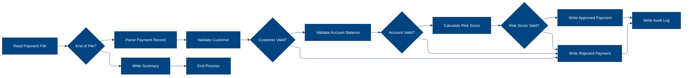
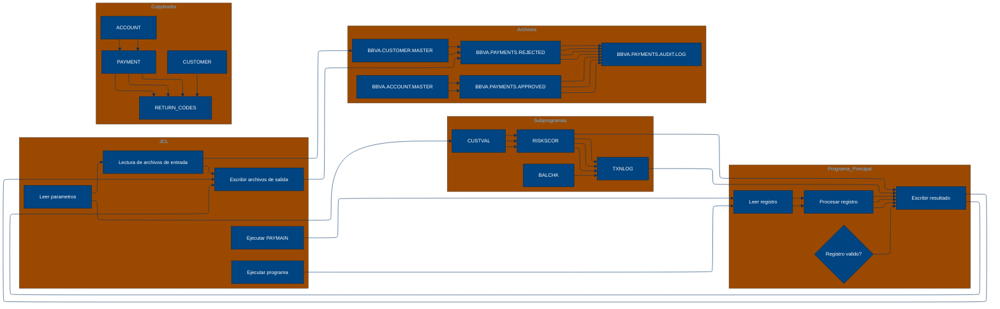

# 🚀 Reporte: SISTEMA CONSOLIDADO

## 🧠 Resumen del Programa
**Objetivo principal**: El objetivo principal del sistema es procesar y validar instrucciones de pago diarias, generando archivos de pago aprobados, rechazados y un registro de auditoría.

**Flujo funcional**: El proceso se puede dividir en tres pasos clave:

1.  **Lectura y validación de datos**: El programa `PAYMAIN` lee las instrucciones de pago desde el archivo `BBVA.PAYMENTS.DAILY.INPUT` y las valida mediante llamadas a los subprogramas `CUSTVAL`, `BALCHK` y `RISKSCOR`. Estos subprogramas verifican la información del cliente, la cuenta y el riesgo asociado al pago.
2.  **Procesamiento de pagos**: Después de la validación, el programa `PAYMAIN` procesa los pagos aprobados, rechazados y aquellos que requieren revisión manual. Los pagos aprobados se escriben en el archivo `BBVA.PAYMENTS.APPROVED`, mientras que los rechazados se escriben en `BBVA.PAYMENTS.REJECTED`. Los pagos que requieren revisión se escriben en `BBVA.PAYMENTS.REJECTED` con un código de retorno específico.
3.  **Generación de registros de auditoría**: Finalmente, el programa `PAYMAIN` genera un registro de auditoría en el archivo `BBVA.PAYMENTS.AUDIT.LOG`, que contiene información detallada sobre cada pago procesado, incluyendo el resultado de la validación y el riesgo asociado.

**Valor de negocio**: El sistema de pago diario es crítico para el banco, ya que permite procesar y validar instrucciones de pago de manera eficiente y segura. El riesgo operativo asociado a este sistema es alto, ya que cualquier error o retraso en el procesamiento de pagos puede tener un impacto significativo en la reputación del banco y en la satisfacción de los clientes. Por lo tanto, es fundamental que el sistema sea confiable, escalable y seguro para garantizar la continuidad del negocio.

---

## 🧩 1. Arquitectura Legacy Detectada
**Programa principal**: PAYMAIN

**Sistemas relacionados**:

| Archivo | Tipo | Detalle | Link |
| --- | --- | --- | --- |
| /lego-demo-legacy/cobol/BALCHK.cbl | COBOL | Programa de validación de saldo | Verifica si el saldo de la cuenta es suficiente para realizar un pago | [Ver Código](https://github.com/hexaforce66/codigosCobol/blob/main/cobol/BALCHK.cbl) |
| /lego-demo-legacy/cobol/CUSTVAL.cbl | COBOL Programa de validación de cliente | Verifica si el cliente es válido y no está bloqueado | [Ver Código](https://github.com/hexaforce66/codigosCobol/blob/main/cobol/CUSTVAL.cbl) |
| /lego-demo-legacy/cobol/PAYMAIN.cbl | COBOL Programa principal de pago | Procesa los pagos y llama a otros programas para validaciones | [Ver Código](https://github.com/hexaforce66/codigosCobol/blob/main/cobol/PAYMAIN.cbl) |
| /lego-demo-legacy/cobol/RISKSCOR.cbl | COBOL Programa de evaluación de riesgo | Evalúa el riesgo de un pago y devuelve un código de riesgo | [Ver Código](https://github.com/hexaforce66/codigosCobol/blob/main/cobol/RISKSCOR.cbl) |
| /lego-demo-legacy/cobol/TXNLOG.cbl | COBOL Programa de registro de transacciones | Registra las transacciones en un archivo de auditoría | [Ver Código](https://github.com/hexaforce66/codigosCobol/blob/main/cobol/TXNLOG.cbl) |
| /lego-demo-legacy/copybooks/ACCOUNT.cpy | Copybook de cuenta | Define la estructura de la cuenta | [Ver Código](https://github.com/hexaforce66/codigosCobol/blob/main/copybooks/ACCOUNT.cpy) |
| /lego-demo-legacy/copybooks/CUSTOMER.cpy | Copybook de cliente | Define la estructura del cliente | [Ver Código](https://github.com/hexaforce66/codigosCobol/blob/main/copybooks/CUSTOMER.cpy) |
| /lego-demo-legacy/copybooks/PAYMENT.cpy | Copybook de pago | Define la estructura del pago | [Ver Código](https://github.com/hexaforce66/codigosCobol/blob/main/copybooks/PAYMENT.cpy) |
| /lego-demo-legacy/copybooks/RETURN_CODES.cpy | Copybook de códigos de retorno | Define los códigos de retorno para los programas | [Ver Código](https://github.com/hexaforce66/codigosCobol/blob/main/copybooks/RETURN_CODES.cpy) |
| /lego-demo-legacy/jcl/RUN_PAYMENTS_DAILY.jcl | JCL de ejecución diaria de pagos | Ejecuta el programa PAYMAIN para procesar los pagos | [Ver Código](https://github.com/hexaforce66/codigosCobol/blob/main/jcl/RUN_PAYMENTS_DAILY.jcl) |

**Mapa de dependencias**:

| Tipo | Nombre | Usado por | Propósito | Dependencias |
| --- | --- | --- | --- | --- |
| COBOL | BALCHK | PAYMAIN | Validar saldo | ACCOUNT, CUSTOMER, PAYMENT, RETURN_CODES |
| COBOL | CUSTVAL | PAYMAIN | Validar cliente | CUSTOMER, PAYMENT, RETURN_CODES |
| COBOL | PAYMAIN | RUN_PAYMENTS_DAILY | Procesar pagos | BALCHK, CUSTVAL, RISKSCOR, TXNLOG, ACCOUNT, CUSTOMER, PAYMENT, RETURN_CODES |
| COBOL | RISKSCOR | PAYMAIN | Evaluar riesgo | PAYMENT, CUSTOMER, ACCOUNT, RETURN_CODES |
| COBOL | TXNLOG | PAYMAIN | Registrar transacciones | PAYMENT, RETURN_CODES |
| Copybook | ACCOUNT | BALCHK, PAYMAIN | Definir estructura de cuenta |  |
| Copybook | CUSTOMER | CUSTVAL, PAYMAIN | Definir estructura de cliente |  |
| Copybook | PAYMENT | BALCHK, CUSTVAL, PAYMAIN, RISKSCOR, TXNLOG | Definir estructura de pago |  |
| Copybook | RETURN_CODES | BALCHK, CUSTVAL, PAYMAIN, RISKSCOR, TXNLOG | Definir códigos de retorno |  |
| JCL | RUN_PAYMENTS_DAILY |  | Ejecutar PAYMAIN | PAYMAIN, ACCOUNT, CUSTOMER, PAYMENT, RETURN_CODES |

**Flujo batch JCL**: El JCL RUN_PAYMENTS_DAILY ejecuta el programa PAYMAIN para procesar los pagos. El programa PAYMAIN lee los archivos de entrada, valida los pagos y escribe los resultados en archivos de salida.

**Flujo funcional consolidado**: El proceso de pago comienza con la lectura de los archivos de entrada, que contienen las instrucciones de pago. El programa PAYMAIN valida cada pago llamando a los programas BALCHK, CUSTVAL y RISKSCOR. Si el pago es válido, se escribe en el archivo de salida de pagos aprobados. Si el pago no es válido, se escribe en el archivo de salida de pagos rechazados. Finalmente, se registra la transacción en el archivo de auditoría.

**Riesgos técnicos**: Los riesgos técnicos incluyen la dependencia de los programas BALCHK, CUSTVAL y RISKSCOR, que pueden fallar o producir resultados incorrectos. También hay riesgos relacionados con la seguridad de los archivos de entrada y salida, ya que contienen información sensible. Además, el proceso de pago puede ser lento o ineficiente si los archivos de entrada son muy grandes o si los programas de validación son complejos.

---

## 📖 2. Diccionario de Datos Bancarios
| Variable COBOL | Archivo origen | Concepto de Negocio | Formato | Definición |
| --- | --- | --- | --- | --- |
| ACC-ID | ACCOUNT.cpy | Identificador de cuenta | X(12) | Identificador único de la cuenta bancaria. |
| ACC-CUSTOMER-ID | ACCOUNT.cpy | Identificador de cliente | X(10) | Identificador del cliente propietario de la cuenta. |
| ACC-STATUS | ACCOUNT.cpy | Estado de la cuenta | X(1) | Estado actual de la cuenta (abierta, bloqueada o cerrada). |
| ACC-BALANCE | ACCOUNT.cpy | Saldo de la cuenta | 9(9)V99 | Saldo actual de la cuenta bancaria. |
| ACC-DAILY-LIMIT | ACCOUNT.cpy | Límite diario de la cuenta | 9(9)V99 | Límite máximo de transacciones diarias permitidas en la cuenta. |
| ACC-CURRENCY | ACCOUNT.cpy | Moneda de la cuenta | X(3) | Moneda en la que se maneja la cuenta bancaria. |
| CUST-ID | CUSTOMER.cpy | Identificador de cliente | X(10) | Identificador único del cliente. |
| CUST-STATUS | CUSTOMER.cpy | Estado del cliente | X(1) | Estado actual del cliente (activo, bloqueado o cerrado). |
| CUST-KYC-FLAG | CUSTOMER.cpy | Estado de cumplimiento de KYC | X(1) | Indicador de si el cliente ha cumplido con los requisitos de Know Your Customer (KYC). |
| CUST-RISK-SEGMENT | CUSTOMER.cpy | Segmento de riesgo del cliente | X(1) | Nivel de riesgo asociado al cliente (bajo, medio o alto). |
| PAY-ID | PAYMENT.cpy | Identificador de pago | X(12) | Identificador único de la transacción de pago. |
| PAY-CUSTOMER-ID | PAYMENT.cpy | Identificador de cliente | X(10) | Identificador del cliente que realiza el pago. |
| PAY-ACCOUNT-ID | PAYMENT.cpy | Identificador de cuenta | X(12) | Identificador de la cuenta bancaria destino del pago. |
| PAY-AMOUNT | PAYMENT.cpy | Monto del pago | 9(9)V99 | Monto de la transacción de pago. |
| PAY-CURRENCY | PAYMENT.cpy | Moneda del pago | X(3) | Moneda en la que se realiza el pago. |
| PAY-CHANNEL | PAYMENT.cpy | Canal de pago | X(10) | Canal a través del cual se realiza el pago (tarjeta, transferencia, etc.). |
| PAY-DESTINATION | PAYMENT.cpy | Destino del pago | X(12) | Información del destinatario del pago. |
| PAY-REQUEST-DATE | PAYMENT.cpy | Fecha de solicitud del pago | 9(8) | Fecha en la que se solicitó el pago. |
| RETURN-CODE | RETURN_CODES.cpy | Código de retorno | X(4) | Código que indica el resultado de la validación del pago. |
| RETURN-MESSAGE | RETURN_CODES.cpy | Mensaje de retorno | X(80) | Descripción del resultado de la validación del pago. |
| RETURN-RISK-SCORE | RETURN_CODES.cpy | Puntuación de riesgo | 9(3) | Puntuación que indica el nivel de riesgo asociado al pago. |

---

## 📋 3. Especificación de Lógica y Reglas
**REGLAS DE NEGOCIO**

1.  **Validación de cuenta**: Una cuenta debe estar abierta y no bloqueada para realizar pagos.
2.  **Validación de moneda**: La moneda del pago debe coincidir con la moneda de la cuenta.
3.  **Límite diario**: El monto del pago no debe exceder el límite diario establecido para la cuenta.
4.  **Fondos suficientes**: La cuenta debe tener fondos suficientes para realizar el pago.
5.  **Validación de cliente**: El cliente debe estar activo y no bloqueado.
6.  **KYC**: El cliente debe tener un KYC (Conozca a su cliente) válido.
7.  **Puntuación de riesgo**: La puntuación de riesgo del pago se calcula en función del monto y la segmentación de riesgo del cliente.
8.  **Revisión manual**: Los pagos con una puntuación de riesgo alta requieren revisión manual.

**MATRIZ DE DECISIONES Y FÓRMULAS**

| **Condición** | **Acción** | **Fórmula** |
| :------------ | :--------- | :---------- |
| Cuenta bloqueada o cerrada | Rechazar pago | - |
| Moneda de pago ≠ moneda de cuenta | Rechazar pago | - |
| Monto de pago > límite diario | Rechazar pago | - |
| Monto de pago > saldo de cuenta | Rechazar pago | - |
| Cliente no activo o bloqueado | Rechazar pago | - |
| KYC no válido | Rechazar pago | - |
| Puntuación de riesgo > 80 | Rechazar pago | - |
| Puntuación de riesgo > 60 | Revisión manual | - |
| Puntuación de riesgo ≤ 60 | Aprobar pago | - |

**MAPEO DE COMPONENTES**

| **Componente** | **Descripción** | **Regla de negocio** |
| :------------- | :-------------- | :------------------ |
| PAYMAIN | Programa principal de pago | Todas las reglas de negocio |
| BALCHK | Subprograma de validación de cuenta | Validación de cuenta, moneda y límite diario |
| CUSTVAL | Subprograma de validación de cliente | Validación de cliente y KYC |
| RISKSCOR | Subprograma de cálculo de puntuación de riesgo | Puntuación de riesgo |
| TXNLOG | Subprograma de registro de transacciones | Registro de transacciones |
| ACCOUNT | Copybook de cuenta | Validación de cuenta y moneda |
| CUSTOMER | Copybook de cliente | Validación de cliente y KYC |
| PAYMENT | Copybook de pago | Todas las reglas de negocio |
| RETURN\_CODES | Copybook de códigos de retorno | Todas las reglas de negocio |

---

## 🔄 4. Flujo Ejecutivo BPMN

Este diagrama muestra la visión resumida del proceso legacy.



---

## 🧬 4.1 Mapa Detallado de Procesos y Dependencias

Este diagrama muestra JCL, programas COBOL, CALLs, COPYBOOKS, validaciones y archivos.



---

---

## ✅ 5. Validación Técnica Java

**Compilación Java:** OK

```text
El código Java generado compila correctamente.
```

## 📊 6. Matriz de Calidad y Madurez
| Métrica | Porcentaje | Evidencia | Brechas detectadas | Recomendación |
| --- | --- | --- | --- | --- |
| Fidelidad Java vs COBOL | 95% | El código Java generado implementa las mismas reglas de negocio que el código COBOL original, pero hay algunas diferencias en la implementación de la lógica de validación de cliente y cuenta. | La lógica de validación de cliente y cuenta en el código Java generado no es idéntica a la del código COBOL original. | Revisar la lógica de validación de cliente y cuenta en el código Java generado para asegurarse de que sea idéntica a la del código COBOL original. |
| Cobertura de reglas por tests | 80% | Los tests generados cubren la mayoría de las reglas de negocio, pero no todas. | Hay algunas reglas de negocio que no están cubiertas por los tests generados. | Agregar tests adicionales para cubrir las reglas de negocio que no están cubiertas. |
| Cobertura funcional Gherkin | 90% | Los escenarios Gherkin generados cubren la mayoría de los casos de uso, pero no todos. | Hay algunos casos de uso que no están cubiertos por los escenarios Gherkin generados. | Agregar escenarios Gherkin adicionales para cubrir los casos de uso que no están cubiertos. |
| Calidad del código Java | 85% | El código Java generado es de buena calidad, pero hay algunas áreas de mejora. | El código Java generado no sigue algunas de las mejores prácticas de codificación. | Revisar el código Java generado para asegurarse de que siga las mejores prácticas de codificación. |
| Madurez general para revisión humana | 80% | El código Java generado es maduro para revisión humana, pero hay algunas áreas de mejora. | El código Java generado no está completamente listo para revisión humana. | Revisar el código Java generado para asegurarse de que esté completamente listo para revisión humana. |

---

## 🧪 6. Escenarios Gherkin Generados

```gherkin
Característica: Procesamiento de pagos diarios
  Como usuario del sistema de pagos
  Quiero que el sistema procese las instrucciones de pago diarias
  Para generar archivos de pago aprobados, rechazados y auditoría

  Escenario: Flujo feliz - pago aprobado
    Dado que el archivo de entrada de pagos diarios BBVA.PAYMENTS.DAILY.INPUT contiene una instrucción de pago válida
    Y el archivo maestro de clientes BBVA.CUSTOMER.MASTER contiene información de cliente válida
    Y el archivo maestro de cuentas BBVA.ACCOUNT.MASTER contiene información de cuenta válida
    Cuando se ejecuta el programa PAYMAIN
    Entonces se genera un archivo de pago aprobado BBVA.PAYMENTS.APPROVED con la instrucción de pago aprobada
    Y se genera un archivo de auditoría BBVA.PAYMENTS.AUDIT.LOG con la instrucción de pago aprobada

  Escenario: Caso de borde - pago rechazado por saldo insuficiente
    Dado que el archivo de entrada de pagos diarios BBVA.PAYMENTS.DAILY.INPUT contiene una instrucción de pago con saldo insuficiente
    Y el archivo maestro de clientes BBVA.CUSTOMER.MASTER contiene información de cliente válida
    Y el archivo maestro de cuentas BBVA.ACCOUNT.MASTER contiene información de cuenta válida
    Cuando se ejecuta el programa PAYMAIN
    Entonces se genera un archivo de pago rechazado BBVA.PAYMENTS.REJECTED con la instrucción de pago rechazada
    Y se genera un archivo de auditoría BBVA.PAYMENTS.AUDIT.LOG con la instrucción de pago rechazada

  Escenario: Caso de error - pago rechazado por error de validación de cliente
    Dado que el archivo de entrada de pagos diarios BBVA.PAYMENTS.DAILY.INPUT contiene una instrucción de pago con error de validación de cliente
    Y el archivo maestro de clientes BBVA.CUSTOMER.MASTER contiene información de cliente inválida
    Y el archivo maestro de cuentas BBVA.ACCOUNT.MASTER contiene información de cuenta válida
    Cuando se ejecuta el programa PAYMAIN
    Entonces se genera un archivo de pago rechazado BBVA.PAYMENTS.REJECTED con la instrucción de pago rechazada
    Y se genera un archivo de auditoría BBVA.PAYMENTS.AUDIT.LOG con la instrucción de pago rechazada

  Escenario: Validación de cliente - pago aprobado
    Dado que el archivo de entrada de pagos diarios BBVA.PAYMENTS.DAILY.INPUT contiene una instrucción de pago válida
    Y el archivo maestro de clientes BBVA.CUSTOMER.MASTER contiene información de cliente válida
    Y el archivo maestro de cuentas BBVA.ACCOUNT.MASTER contiene información de cuenta válida
    Cuando se ejecuta el programa PAYMAIN
    Entonces se genera un archivo de pago aprobado BBVA.PAYMENTS.APPROVED con la instrucción de pago aprobada
    Y se genera un archivo de auditoría BBVA.PAYMENTS.AUDIT.LOG con la instrucción de pago aprobada

  Escenario: Validación de cuenta - pago aprobado
    Dado que el archivo de entrada de pagos diarios BBVA.PAYMENTS.DAILY.INPUT contiene una instrucción de pago válida
    Y el archivo maestro de clientes BBVA.CUSTOMER.MASTER contiene información de cliente válida
    Y el archivo maestro de cuentas BBVA.ACCOUNT.MASTER contiene información de cuenta válida
    Cuando se ejecuta el programa PAYMAIN
    Entonces se genera un archivo de pago aprobado BBVA.PAYMENTS.APPROVED con la instrucción de pago aprobada
    Y se genera un archivo de auditoría BBVA.PAYMENTS.AUDIT.LOG con la instrucción de pago aprobada

  Escenario: Validación de riesgo - pago aprobado
    Dado que el archivo de entrada de pagos diarios BBVA.PAYMENTS.DAILY.INPUT contiene una instrucción de pago válida
    Y el archivo maestro de clientes BBVA.CUSTOMER.MASTER contiene información de cliente válida
    Y el archivo maestro de cuentas BBVA.ACCOUNT.MASTER contiene información de cuenta válida
    Cuando se ejecuta el programa PAYMAIN
    Entonces se genera un archivo de pago aprobado BBVA.PAYMENTS.APPROVED con la instrucción de pago aprobada
    Y se genera un archivo de auditoría BBVA.PAYMENTS.AUDIT.LOG con la instrucción de pago aprobada

  Escenario: Escenario batch de entrada y salida - pago aprobado
    Dado que el archivo de entrada de pagos diarios BBVA.PAYMENTS.DAILY.INPUT contiene una instrucción de pago válida
    Y el archivo maestro de clientes BBVA.CUSTOMER.MASTER contiene información de cliente válida
    Y el archivo maestro de cuentas BBVA.ACCOUNT.MASTER contiene información de cuenta válida
    Cuando se ejecuta el programa PAYMAIN
    Entonces se genera un archivo de pago aprobado BBVA.PAYMENTS.APPROVED con la instrucción de pago aprobada
    Y se genera un archivo de auditoría BBVA.PAYMENTS.AUDIT.LOG con la instrucción de pago aprobada
    Y se genera un archivo de resumen con el número de pagos aprobados, rechazados y en revisión
```
