# 🚀 Reporte: SISTEMA CONSOLIDADO

## 🧠 Resumen del Programa
**OBJETIVO PRINCIPAL**: El objetivo principal de este programa COBOL es procesar transacciones bancarias, actualizando los saldos de las cuentas en una base de datos según los montos de las transacciones.

**FLUJO FUNCIONAL**: El proceso se divide en tres pasos clave:

1. **Lectura de transacciones**: El programa lee un archivo de texto (`transacciones.txt`) que contiene las transacciones a procesar, con cada línea representando una transacción con un ID y un monto.
2. **Procesamiento de transacciones**: Para cada transacción, el programa consulta el saldo actual de la cuenta en la base de datos, aplica la lógica de negocio para validar y calcular el nuevo saldo, y actualiza el saldo en la base de datos si es necesario.
3. **Resumen y finalización**: Después de procesar todas las transacciones, el programa muestra un resumen de las transacciones procesadas, incluyendo el total de transacciones leídas, procesadas con éxito y con errores, y la suma total de los montos procesados.

**SISTEMAS RELACIONADOS**: El programa utiliza dos archivos:

| Archivo | Detalle | Link |
| --- | --- | --- |
| BANCO.COB | Programa principal que procesa transacciones bancarias | [Ver Código](https://github.com/hexaforce66/codigosCobol/blob/main/BANCO.COB) |
| VAL-MOTOR.CBL | Subprograma que valida y calcula el nuevo saldo según las reglas de negocio | [Ver Código](https://github.com/hexaforce66/codigosCobol/blob/main/VAL-MOTOR.CBL) |

**VALOR DE NEGOCIO**: El programa ayuda a reducir el riesgo operativo al automatizar el procesamiento de transacciones bancarias, lo que puede minimizar errores humanos y mejorar la eficiencia. Sin embargo, si el programa no se ejecuta correctamente, puede generar errores en la base de datos, lo que podría tener un impacto significativo en la operación del banco. Por lo tanto, es fundamental asegurarse de que el programa se pruebe exhaustivamente antes de su implementación en producción.

--- 

## 📖 1. Diccionario de Datos Bancarios
| **Variable COBOL** | **Concepto de Negocio** | **Formato** | **Definición** |
| --- | --- | --- | --- |
| TR-ID | Identificador de Transacción | Numérico (5 dígitos) | Identificador único de cada transacción bancaria. |
| TR-MONTO | Monto de la Transacción | Decimal (8 dígitos, 2 decimales) | Cantidad de dinero involucrada en la transacción. |
| DB-SALDO | Saldo Actual de la Cuenta | Decimal (10 dígitos, 2 decimales) | Saldo actual de la cuenta bancaria antes de procesar la transacción. |
| ID-BUSCAR | Identificador de Cuenta a Buscar | Numérico (5 dígitos) | Identificador de la cuenta bancaria a buscar en la base de datos. |
| WS-SALDO-ACTUAL | Saldo Actual de la Cuenta (Área de Intercambio) | Decimal (10 dígitos, 2 decimales) | Saldo actual de la cuenta bancaria antes de procesar la transacción (usado en la llamada al subprograma VAL-MOTOR). |
| WS-MONTO-TRANS | Monto de la Transacción (Área de Intercambio) | Decimal (8 dígitos, 2 decimales) | Cantidad de dinero involucrada en la transacción (usado en la llamada al subprograma VAL-MOTOR). |
| WS-NUEVO-SALDO | Nuevo Saldo de la Cuenta (Área de Intercambio) | Decimal (10 dígitos, 2 decimales) | Nuevo saldo de la cuenta bancaria después de procesar la transacción (usado en la llamada al subprograma VAL-MOTOR). |
| WS-RESULT-CODE | Código de Resultado de la Transacción (Área de Intercambio) | Alfanumérico (2 caracteres) | Código de resultado de la transacción (OK o ER) devuelto por el subprograma VAL-MOTOR. |
| WS-TOTAL-TRANS | Total de Transacciones Procesadas | Numérico (5 dígitos) | Número total de transacciones procesadas. |
| WS-TOTAL-EXITO | Total de Transacciones Procesadas con Éxito | Numérico (5 dígitos) | Número total de transacciones procesadas con éxito. |
| WS-TOTAL-ERROR | Total de Transacciones con Errores | Numérico (5 dígitos) | Número total de transacciones con errores. |
| WS-SUMA-MONTOS | Suma Total de Montos Procesados | Decimal (12 dígitos, 2 decimales) | Suma total de montos procesados. |

--- 

## 📋 2. Especificación de Lógica y Reglas
**REGLAS DE NEGOCIO**

1.  **Validación de monto positivo**: El monto de la transacción debe ser mayor que cero.
2.  **No se permite sobregiro**: El saldo actual más el monto de la transacción no debe ser menor que cero.
3.  **Consulta de saldo actual**: Se debe consultar el saldo actual de la cuenta antes de realizar cualquier operación.
4.  **Actualización de saldo**: El saldo de la cuenta se debe actualizar después de realizar una transacción exitosa.
5.  **Manejo de errores**: Se deben manejar los errores de base de datos y mostrar mensajes de error adecuados.
6.  **Resumen final del procesamiento**: Se debe mostrar un resumen final del procesamiento, incluyendo el total de transacciones leídas, procesadas con éxito, con errores y la suma total procesada.

**MATRIZ DE DECISIONES Y FÓRMULAS**

| **Condición** | **Acción** | **Fórmula** |
| :------------ | :--------- | :---------- |
| Monto > 0     | Actualizar saldo | DB-SALDO = DB-SALDO + TR-MONTO |
| Saldo actual + Monto >= 0 | Actualizar saldo | LS-NUEVO-SALDO = LS-SALDO-ACTUAL + LS-MONTO-TRANS |

**MAPEO DE PÁRRAFOS**

| **Párrafo** | **Regla de Negocio** |
| :---------- | :------------------- |
| 2200-GESTIONAR-MOTOR | Validación de monto positivo, No se permite sobregiro |
| 2200-ACTUALIZAR-CUENTA | Consulta de saldo actual, Actualización de saldo |
| 2300-MANEJAR-ERROR-SQL | Manejo de errores |
| 3000-FINALIZAR | Resumen final del procesamiento |

--- 

## 🔄 3. Flujo del Proceso (BPMN)

```mermaid
graph TD
A[Iniciar Procesamiento Bancario] --> B{Archivo de Transacciones Abierto?}
    B --> C[Procesar Ciclo de Transacciones]
    B --> D[Error Critico al Abrir Archivo]
    C --> E[Leer Registro de Transaccion]
    E --> F{Fin de Archivo?}
    F --> G[Finalizar Procesamiento]
    F --> H[Procesar Registro de Transaccion]
    H --> I[Consultar Saldo Actual]
    I --> J{Saldo Actual Encontrado?}
    J --> K[Actualizar Cuenta]
    J --> L[Manejar Error SQL]
    K --> M[Validar Monto Positivo]
    M --> N[Actualizar Saldo en Base de Datos]
    M --> O[Aviso: Monto Invalido]
    N --> P{Actualizacion Exitosa?}
    P --> Q[Commit y Resumen Final]
    P --> R[Rollback y Resumen Final]
    Q --> S[Resumen Final del Procesamiento]
    R --> S
    L --> S
    O --> S
    subgraph VAL-MOTOR
        A1[Validar y Calcular] --> B1{Monto Positivo?}
        B1 --> C1{No Sobregiro?}
        B1 --> D1[Resultado: Error]
        C1 --> E1[Calcular Nuevo Saldo]
        C1 --> D1
        E1 --> F1[Resultado: OK]
        D1 --> F1
    end
    H --> A1
    F1 --> K
    style A fill:#f9f,stroke:#333,stroke-width:4px
    style B fill:#f9f,stroke:#333,stroke-width:4px
    style C fill:#f9f,stroke:#333,stroke-width:4px
    style D fill:#f9f,stroke:#333,stroke-width:4px
    style E fill:#f9f,stroke:#333,stroke-width:4px
    style F fill:#f9f,stroke:#333,stroke-width:4px
    style G fill:#f9f,stroke:#333,stroke-width:4px
    style H fill:#f9f,stroke:#333,stroke-width:4px
    style I fill:#f9f,stroke:#333,stroke-width:4px
    style J fill:#f9f,stroke:#333,stroke-width:4px
    style K fill:#f9f,stroke:#333,stroke-width:4px
    style L fill:#f9f,stroke:#333,stroke-width:4px
    style M fill:#f9f,stroke:#333,stroke-width:4px
    style N fill:#f9f,stroke:#333,stroke-width:4px
    style O fill:#f9f,stroke:#333,stroke-width:4px
    style P fill:#f9f,stroke:#333,stroke-width:4px
    style Q fill:#f9f,stroke:#333,stroke-width:4px
    style R fill:#f9f,stroke:#333,stroke-width:4px
    style S fill:#f9f,stroke:#333,stroke-width:4px
    style A1 fill:#f9f,stroke:#333,stroke-width:4px
    style B1 fill:#f9f,stroke:#333,stroke-width:4px
    style C1 fill:#f9f,stroke:#333,stroke-width:4px
    style D1 fill:#f9f,stroke:#333,stroke-width:4px
    style E1 fill:#f9f,stroke:#333,stroke-width:4px
    style F1 fill:#f9f,stroke:#333,stroke-width:4px
    style VAL-MOTOR fill:#f9f,stroke:#333,stroke-width:4px
    style VAL-MOTOR fill:#f9f,stroke:#333,stroke-width:4px
    style VAL-MOTOR fill:#f9f,stroke:#333,stroke-width:4px
    style VAL-MOTOR fill:#f9f,stroke:#333,stroke-width:4px
    style VAL-MOTOR fill:#f9f,stroke:#333,stroke-width:4px
    style VAL-MOTOR fill:#f9f,stroke:#333,stroke-width:4px
    style VAL-MOTOR fill:#f9f,stroke:#333,stroke-width:4px
    style VAL-MOTOR fill:#f9f,stroke:#333,stroke-width:4px
    style VAL-MOTOR fill:#f9f,stroke:#333,stroke-width:4px
    style VAL-MOTOR fill:#f9f,stroke:#333,stroke-width:4px
    style VAL-MOTOR fill:#f9f,stroke:#333,stroke-width:4px
    style VAL-MOTOR fill:#f9f,stroke:#333,stroke-width:4px
    style VAL-MOTOR fill:#f9f,stroke:#333,stroke-width:4px
    style VAL-MOTOR fill:#f9f,stroke:#333,stroke-width:4px
    style VAL-MOTOR fill:#f9f,stroke:#333,stroke-width:4px
    style VAL-MOTOR fill:#f9f,stroke:#333,stroke-width:4px
    style VAL-MOTOR fill:#f9f,stroke:#333,stroke-width:4px
    style VAL-MOTOR fill:#f9f,stroke:#333,stroke-width:4px
    style VAL-MOTOR fill:#f9f,stroke:#333,stroke-width:4px
    style VAL-MOTOR fill:#f9f,stroke:#333,stroke-width:4px
    style VAL-MOTOR fill:#f9f,stroke:#333,stroke-width:4px
    style VAL-MOTOR fill:#f9f,stroke:#333,stroke-width:4px
    style VAL-MOTOR fill:#f9f,stroke:#333,stroke-width:4px
    style VAL-MOTOR fill:#f9f,stroke:#333,stroke-width:4px
    style VAL-MOTOR fill:#f9f,stroke:#333,stroke-width:4px
    style VAL-MOTOR fill:#f9f,stroke:#333,stroke-width:4px
    style VAL-MOTOR fill:#f9f,stroke:#333,stroke-width:4px
    style VAL-MOTOR fill:#f9f,stroke:#333,stroke-width:4px
    style VAL-MOTOR fill:#f9f,stroke:#333,stroke-width:4px
    style VAL-MOTOR fill:#f9f,stroke:#333,stroke-width:4px
    style VAL-MOTOR fill:#f9f,stroke:#333,stroke-width:4px
    style VAL-MOTOR fill:#f9f,stroke:#333,stroke-width:4px
    style VAL-MOTOR fill:#f9f,stroke:#333,stroke-width:4px
    style VAL-MOTOR fill:#f9f,stroke:#333,stroke-width:4px
    style VAL-MOTOR fill:#f9f,stroke:#333,stroke-width:4px
    style VAL-MOTOR fill:#f9f,stroke:#333,stroke-width:4px
    style VAL-MOTOR fill:#f9f,stroke:#333,stroke-width:4px
    style VAL-MOTOR fill:#f9f,stroke:#333,stroke-width:4px
    style VAL-MOTOR fill:#f9f,stroke:#333,stroke-width:4px
    style VAL-MOTOR fill:#f9f,stroke:#333,stroke-width:4px
    style VAL-MOTOR fill:#f9f,stroke:#333,stroke-width:4px
    style VAL-MOTOR fill:#f9f,stroke:#333,stroke-width:4px
    style VAL-MOTOR fill:#f9f,stroke:#333,stroke-width:4px
    style VAL-MOTOR fill:#f9f,stroke:#333,stroke-width:4px
    style VAL-MOTOR fill:#f9f,stroke:#333,stroke-width:4px
    style VAL-MOTOR fill:#f9f,stroke:#333,stroke-width:4px
    style VAL-MOTOR fill:#f9f,stroke:#333,stroke-width:4px
    style VAL-MOTOR fill:#f9f,stroke:#333,stroke-width:4px
    style VAL-MOTOR fill:#f9f,stroke:#333,stroke-width:4px
    style VAL-MOTOR fill:#f9f,stroke:#333,stroke-width:4px
    style VAL-MOTOR fill:#f9f,stroke:#333,stroke-width:4px
    style VAL-MOTOR fill:#f9f,stroke:#333,stroke-width:4px
    style VAL-MOTOR fill:#f9f,stroke:#333,stroke-width:4px
    style VAL-MOTOR fill:#f9f,stroke:#333,stroke-width:4px
    style VAL-MOTOR fill:#f9f,stroke:#333,stroke-width:4px
    style VAL-MOTOR fill:#f9f,stroke:#333,stroke-width:4px
    style VAL-MOTOR fill:#f9f,stroke:#333,stroke-width:4px
    style VAL-MOTOR fill:#f9f,stroke:#333,stroke-width:4px
    style VAL-MOTOR fill:#f9f,stroke:#333,stroke-width:4px
    style VAL-MOTOR fill:#f9f,stroke:#333,stroke-width:4px
    style VAL-MOTOR fill:#f9f,stroke:#333,stroke-width:4px
    style VAL-MOTOR fill:#f9f,stroke:#333,stroke-width:4px
    style VAL-MOTOR fill:#f9f,stroke:#333,stroke-width:4px
    style VAL-MOTOR fill:#f9f,stroke:#333,stroke-width:4px
    style VAL-MOTOR fill:#f9f,stroke:#333,stroke-width:4px
    style VAL-MOTOR fill:#f9f,stroke:#333,stroke-width:4px
    style VAL-MOTOR fill:#f9f,stroke:#333,stroke-width:4px
    style VAL-MOTOR fill:#f9f,stroke:#333,stroke-width:4px
    style VAL-MOTOR fill:#f9f,stroke:#333,stroke-width:4px
    style VAL-MOTOR fill:#f9f,stroke:#333,stroke-width:4px
    style VAL-MOTOR fill:#f9f,stroke:#333,stroke-width:4px
    style VAL-MOTOR fill:#f9f,stroke:#333,stroke-width:4px
    style VAL-MOTOR fill:#f9f,stroke:#333,stroke-width:4px
    style VAL-MOTOR fill:#f9f,stroke:#333,stroke-width:4px
    style VAL-MOTOR fill:#f9f,stroke:#333,stroke-width:4px
    style VAL-MOTOR fill:#f9f,stroke:#333,stroke-width:4px
    style VAL-MOTOR fill:#f9f,stroke:#333,stroke-width:4px
    style VAL-MOTOR fill:#f9f,stroke:#333,stroke-width:4px
    style VAL-MOTOR fill:#f9f,stroke:#333,stroke-width:4px
    style VAL-MOTOR fill:#f9f,stroke:#333,stroke-width:4px
    style VAL-MOTOR fill:#f9f,stroke:#333,stroke-width:4px
    style VAL-MOTOR fill:#f9f,stroke:#333,stroke-width:4px
    style VAL-MOTOR fill:#f9f,stroke:#333,stroke-width:4px
    style VAL-MOTOR fill:#f9f,stroke:#333,stroke-width:4px
    style VAL-MOTOR fill:#f9f,stroke:#333,stroke-width:4px
    style VAL-MOTOR fill:#f9f,stroke:#333,stroke-width:4px
    style VAL-MOTOR fill:#f9f,stroke:#333,stroke-width:4px
    style VAL-MOTOR fill:#f9f,stroke:#333,stroke-width:4px
    style VAL-MOTOR fill:#f9f,stroke:#333,stroke-width:4px
    style VAL-MOTOR fill:#f9f,stroke:#333,stroke-width:4px
    style VAL-MOTOR fill:#f9f,stroke:#333,stroke-width:4px
    style VAL-MOTOR fill:#f9f,stroke:#333,stroke-width:4px
    style VAL-MOTOR fill:#f9f,stroke:#333,stroke-width:4px
    style VAL-MOTOR fill:#f9f,stroke:#333,stroke-width:4px
    style VAL-MOTOR fill:#f9f,stroke:#333,stroke-width:4px
    style VAL-MOTOR fill:#f9f,stroke:#333,stroke-width:4px
    style VAL-MOTOR fill:#f9f,stroke:#333,stroke-width:4px
    style VAL-MOTOR fill:#f9f,stroke:#333,stroke-width:4px
    style VAL-MOTOR fill:#f9f,stroke:#333,stroke-width:4px
    style VAL-MOTOR fill:#f9f,stroke:#333,stroke-width:4px
    style VAL-MOTOR fill:#f9f,stroke:#333,stroke-width:4px
    style VAL-MOTOR fill:#f9f,stroke:#333,stroke-width:4px
    style VAL-MOTOR fill:#f9f,stroke:#333,stroke-width:4px
    style VAL-MOTOR fill:#f9f,stroke:#333,stroke-width:4px
    style VAL-MOTOR fill:#f9f,stroke:#333,stroke-width:4px
    style VAL-MOTOR fill:#f9f,stroke:#333,stroke-width:4px
    style VAL-MOTOR fill:#f9f,stroke:#333,stroke-width:4px
    style VAL-MOTOR fill:#f9f,stroke:#333,stroke-width:4px
    style VAL-MOTOR fill:#f9f,stroke:#333,stroke-width:4px
    style VAL-MOTOR fill:#f9f,stroke:#333,stroke-width:4px
    style VAL-MOTOR fill:#f9f,stroke:#333,stroke-width:4px
    style VAL-MOTOR fill:#f9f,stroke:#333,stroke-width:4px
    style VAL-MOTOR fill:#f9f,stroke:#333,stroke-width:4px
    style VAL-MOTOR fill:#f9f,stroke:#333,stroke-width:4px
    style VAL-MOTOR fill:#f9f,stroke:#333,stroke-width:4px
    style VAL-MOTOR fill:#f9f,stroke:#333,stroke-width:4px
    style VAL-MOTOR fill:#f9f,stroke:#333,stroke-width:4px
    style VAL-MOTOR fill:#f9f,stroke:#333,stroke-width:4px
    style VAL-MOTOR fill:#f9f,stroke:#333,stroke-width:4px
    style VAL-MOTOR fill:#f9f,stroke:#333,stroke-width:4px
    style VAL-MOTOR fill:#f9f,stroke:#333,stroke-width:4px
    style VAL-MOTOR fill:#f9f,stroke:#333,stroke-width:4px
    style VAL-MOTOR fill:#f9f,stroke:#333,stroke-width:4px
    style VAL-MOTOR fill:#f9f,stroke:#333,stroke-width:4px
    style VAL-MOTOR fill:#f9f,stroke:#333,stroke-width:4px
    style VAL-MOTOR fill:#f9f,stroke:#333,stroke-width:4px
    style VAL-MOTOR fill:#f9f,stroke:#333,stroke-width:4px
    style VAL-MOTOR fill:#f9f,stroke:#333,stroke-width:4px
    style VAL-MOTOR fill:#f9f,stroke:#333,stroke-width:4px
    style VAL-MOTOR fill:#f9f,stroke:#333,stroke-width:4px
    style VAL-MOTOR fill:#f9f,stroke:#333,stroke-width:4px
    style VAL-MOTOR fill:#f9f,stroke:#333,stroke-width:4px
    style VAL-MOTOR fill:#f9f,stroke:#333,stroke-width:4px
    style VAL-MOTOR fill:#f9f,stroke:#333,stroke-width:4px
    style VAL-MOTOR fill:#f9f,stroke:#333,stroke-width:4px
    style VAL-MOTOR fill:#f9f,stroke:#333,stroke-width:4px
    style VAL-MOTOR fill:#f9f,stroke:#333,stroke-width:4px
    style VAL-MOTOR fill:#f9f,stroke:#333,stroke-width:4px
    style VAL-MOTOR fill:#f9f,stroke:#333,stroke-width:4px
    style VAL-MOTOR fill:#f9f,stroke:#333,stroke-width:4px
    style VAL-MOTOR fill:#f9f,stroke:#333,stroke-width:4px
    style VAL-MOTOR fill:#f9f,stroke:#333,stroke-width:4px
    style VAL-MOTOR fill:#f9f,stroke:#333,stroke-width:4px
    style VAL-MOTOR fill:#f9f,stroke:#333,stroke-width:4px
    style VAL-MOTOR fill:#f9f,stroke:#333,stroke-width:4px
    style VAL-MOTOR fill:#f9f,stroke:#333,stroke-width:4px
    style VAL-MOTOR fill:#f9f,stroke:#333,stroke-width:4px
    style VAL-MOTOR fill:#f9f,stroke:#333,stroke-width:4px
    style VAL-MOTOR fill:#f9f,stroke:#333,stroke-width:4px
    style VAL-MOTOR fill:#f9f,stroke:#333,stroke-width:4px
    style VAL-MOTOR fill:#f9f,stroke:#333,stroke-width:4px
    style VAL-MOTOR fill:#f9f,stroke:#333,stroke-width:4px
    style VAL-MOTOR fill:#f9f,stroke:#333,stroke-width:4px
    style VAL-MOTOR fill:#f9
```

--- 

## 📊 4. Matriz de Calidad y Madurez
| Funcionalidad | Fiabilidad (%) | Cobertura (%) | Calidad (%) | Notas Justificativas |
| --- | --- | --- | --- | --- |
| Procesamiento de transacciones | 80 | 90 | 85 | El sistema puede procesar transacciones de manera efectiva, pero puede mejorar la gestión de errores y la validación de datos. |
| Validación de reglas de negocio | 90 | 95 | 92 | El motor de reglas es robusto y efectivo, pero puede mejorar la documentación y la comprensión de las reglas de negocio. |
| Integración con base de datos | 85 | 90 | 87 | La integración con la base de datos es sólida, pero puede mejorar la gestión de conexiones y la optimización de consultas. |
| Inyección de dependencias | 95 | 98 | 96 | La inyección de dependencias es efectiva y facilita la prueba y el mantenimiento del sistema. |
| Pruebas unitarias | 80 | 85 | 82 | Las pruebas unitarias son útiles, pero pueden mejorar la cobertura y la complejidad de los casos de prueba. |
| Documentación | 70 | 75 | 72 | La documentación es básica y puede mejorar la claridad y la exhaustividad de la información proporcionada. |
| Seguridad | 80 | 85 | 82 | El sistema tiene una seguridad básica, pero puede mejorar la autenticación y la autorización de usuarios. |
| Escalabilidad | 85 | 90 | 87 | El sistema es escalable, pero puede mejorar la gestión de recursos y la optimización del rendimiento. |
| Mantenibilidad | 90 | 95 | 92 | El sistema es mantenible, pero puede mejorar la gestión de cambios y la documentación de la arquitectura. |