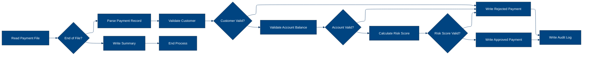
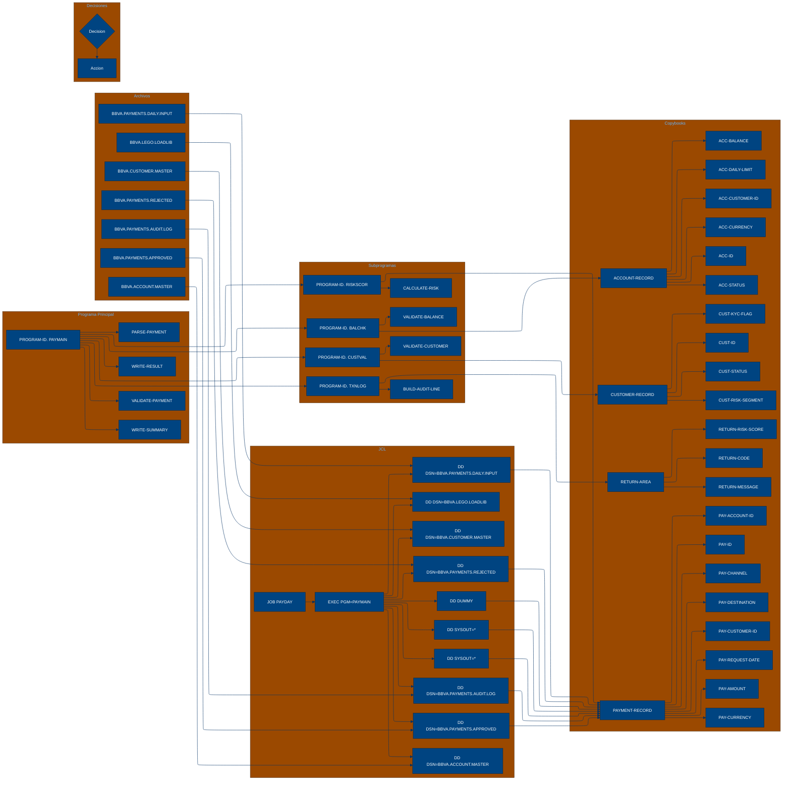

# 🚀 Reporte: SISTEMA CONSOLIDADO

## 🧠 Resumen del Programa
1. **OBJETIVO PRINCIPAL**: El objetivo principal del sistema es procesar y validar instrucciones de pago diarias, generando archivos de pago aprobados, rechazados y de auditoría.

2. **FLUJO FUNCIONAL**: El proceso se puede dividir en tres pasos clave:
   - **Paso 1: Lectura y procesamiento de instrucciones de pago**: El programa PAYMAIN lee las instrucciones de pago desde el archivo de entrada PAYIN y las procesa una a una.
   - **Paso 2: Validación de instrucciones de pago**: Cada instrucción de pago se valida mediante llamadas a subprogramas como CUSTVAL, BALCHK y RISKSCOR, que verifican la información del cliente, la cuenta y el riesgo asociado.
   - **Paso 3: Generación de archivos de salida**: Dependiendo del resultado de la validación, se generan archivos de pago aprobados (PAYOK), rechazados (PAYREJ) y de auditoría (AUDITOUT).

3. **SISTEMAS RELACIONADOS**: A continuación, se muestra una tabla con los archivos relacionados con el sistema, incluyendo los programas COBOL, copybooks y el archivo JCL:

| Archivo | Detalle | Link |
| --- | --- | --- |
| ./lego-demo-legacy/cobol/BALCHK.cbl | Programa COBOL para validar el saldo de la cuenta | [Ver Código](https://github.com/hexaforce66/codigosCobol/blob/main/lego-demo-legacy/cobol/BALCHK.cbl) |
| ./lego-demo-legacy/cobol/CUSTVAL.cbl | Programa COBOL para validar la información del cliente | [Ver Código](https://github.com/hexaforce66/codigosCobol/blob/main/lego-demo-legacy/cobol/CUSTVAL.cbl) |
| ./lego-demo-legacy/cobol/PAYMAIN.cbl | Programa COBOL principal para procesar instrucciones de pago | [Ver Código](https://github.com/hexaforce66/codigosCobol/blob/main/lego-demo-legacy/cobol/PAYMAIN.cbl) |
| ./lego-demo-legacy/cobol/RISKSCOR.cbl | Programa COBOL para calcular el riesgo asociado a la instrucción de pago | [Ver Código](https://github.com/hexaforce66/codigosCobol/blob/main/lego-demo-legacy/cobol/RISKSCOR.cbl) |
| ./lego-demo-legacy/cobol/TXNLOG.cbl | Programa COBOL para generar el archivo de auditoría | [Ver Código](https://github.com/hexaforce66/codigosCobol/blob/main/lego-demo-legacy/cobol/TXNLOG.cbl) |
| ./lego-demo-legacy/copybooks/ACCOUNT.cpy | Copybook para la estructura de la cuenta | [Ver Código](https://github.com/hexaforce66/codigosCobol/blob/main/lego-demo-legacy/copybooks/ACCOUNT.cpy) |
| ./lego-demo-legacy/copybooks/CUSTOMER.cpy | Copybook para la estructura del cliente | [Ver Código](https://github.com/hexaforce66/codigosCobol/blob/main/lego-demo-legacy/copybooks/CUSTOMER.cpy) |
| ./lego-demo-legacy/copybooks/PAYMENT.cpy | Copybook para la estructura de la instrucción de pago | [Ver Código](https://github.com/hexaforce66/codigosCobol/blob/main/lego-demo-legacy/copybooks/PAYMENT.cpy) |
| ./lego-demo-legacy/copybooks/RETURN_CODES.cpy | Copybook para la estructura de los códigos de retorno | [Ver Código](https://github.com/hexaforce66/codigosCobol/blob/main/lego-demo-legacy/copybooks/RETURN_CODES.cpy) |
| ./lego-demo-legacy/jcl/RUN_PAYMENTS_DAILY.jcl | Archivo JCL para ejecutar el proceso de pago diario | [Ver Código](https://github.com/hexaforce66/codigosCobol/blob/main/lego-demo-legacy/jcl/RUN_PAYMENTS_DAILY.jcl) |

4. **VALOR DE NEGOCIO**: El sistema de pago diario es crítico para el banco, ya que permite procesar y validar instrucciones de pago de manera eficiente y segura. El riesgo operativo asociado a este sistema es alto, ya que cualquier error o falla en el proceso puede generar pérdidas financieras significativas para el banco y sus clientes. Por lo tanto, es fundamental garantizar la integridad y confiabilidad del sistema para minimizar el riesgo operativo y mantener la confianza de los clientes.

---

## 🧩 0. Arquitectura Legacy Detectada
**Programa principal**

El programa principal es PAYMAIN, que se ejecuta desde el archivo JCL RUN_PAYMENTS_DAILY.jcl.

**Mapa de dependencias**

| Tipo | Nombre | Usado por | Propósito | Dependencias |
| --- | --- | --- | --- | --- |
| Programa | PAYMAIN | JCL | Procesa pagos y valida instrucciones | BALCHK, CUSTVAL, RISKSCOR, TXNLOG |
| Programa | BALCHK | PAYMAIN | Valida saldo y cuenta | ACCOUNT, RETURN_CODES |
| Programa | CUSTVAL | PAYMAIN | Valida cliente | CUSTOMER, RETURN_CODES |
| Programa | RISKSCOR | PAYMAIN | Calcula riesgo de pago | PAYMENT, CUSTOMER, ACCOUNT, RETURN_CODES |
| Programa | TXNLOG | PAYMAIN | Registra transacciones | PAYMENT, RETURN_CODES |
| Copybook | ACCOUNT | BALCHK, RISKSCOR | Define estructura de cuenta |  |
| Copybook | CUSTOMER | CUSTVAL, RISKSCOR | Define estructura de cliente |  |
| Copybook | PAYMENT | PAYMAIN, RISKSCOR, TXNLOG | Define estructura de pago |  |
| Copybook | RETURN_CODES | BALCHK, CUSTVAL, RISKSCOR, TXNLOG | Define códigos de retorno |  |
| Archivo | BBVA.ACCOUNT.MASTER | ACCTIN | Archivo maestro de cuentas |  |
| Archivo | BBVA.CUSTOMER.MASTER | CUSTIN | Archivo maestro de clientes |  |
| Archivo | BBVA.PAYMENTS.DAILY.INPUT | PAYIN | Archivo de entrada de pagos diarios |  |
| Archivo | BBVA.PAYMENTS.APPROVED | PAYOK | Archivo de pagos aprobados |  |
| Archivo | BBVA.PAYMENTS.REJECTED | PAYREJ | Archivo de pagos rechazados |  |
| Archivo | BBVA.PAYMENTS.AUDIT.LOG | AUDITOUT | Archivo de auditoría de pagos |  |

**Flujo batch JCL**

El JCL RUN_PAYMENTS_DAILY.jcl ejecuta el programa PAYMAIN, que procesa los archivos de entrada de pagos diarios (BBVA.PAYMENTS.DAILY.INPUT) y valida las instrucciones de pago. El programa utiliza los archivos maestros de cuentas (BBVA.ACCOUNT.MASTER) y clientes (BBVA.CUSTOMER.MASTER) para realizar las validaciones. Los resultados se escriben en los archivos de pagos aprobados (BBVA.PAYMENTS.APPROVED), rechazados (BBVA.PAYMENTS.REJECTED) y de auditoría (BBVA.PAYMENTS.AUDIT.LOG).

**Flujo funcional consolidado**

El proceso de pago diario consiste en los siguientes pasos:

1. El programa PAYMAIN lee el archivo de entrada de pagos diarios (BBVA.PAYMENTS.DAILY.INPUT) y procesa cada instrucción de pago.
2. Para cada pago, el programa llama a los subprogramas BALCHK, CUSTVAL y RISKSCOR para validar la cuenta, el cliente y el riesgo de pago.
3. Si el pago es aprobado, el programa escribe el resultado en el archivo de pagos aprobados (BBVA.PAYMENTS.APPROVED).
4. Si el pago es rechazado, el programa escribe el resultado en el archivo de pagos rechazados (BBVA.PAYMENTS.REJECTED).
5. El programa registra cada transacción en el archivo de auditoría (BBVA.PAYMENTS.AUDIT.LOG).

**Riesgos técnicos**

* Dependencias críticas: El programa PAYMAIN depende de los subprogramas BALCHK, CUSTVAL y RISKSCOR, que a su vez dependen de los copybooks ACCOUNT, CUSTOMER y PAYMENT. Si alguno de estos componentes falla, el proceso de pago diario puede verse afectado.
* Copybooks compartidos: Los copybooks ACCOUNT, CUSTOMER y PAYMENT son utilizados por varios programas, lo que puede generar conflictos si se realizan cambios en estos copybooks sin coordinación.
* Archivos sensibles: Los archivos de entrada de pagos diarios (BBVA.PAYMENTS.DAILY.INPUT) y los archivos maestros de cuentas (BBVA.ACCOUNT.MASTER) y clientes (BBVA.CUSTOMER.MASTER) contienen información sensible que debe ser protegida.
* Puntos de fallo: El proceso de pago diario tiene varios puntos de fallo, como la lectura del archivo de entrada de pagos diarios, la validación de la cuenta y el cliente, y la escritura de los resultados en los archivos de pagos aprobados y rechazados. Si alguno de estos puntos falla, el proceso puede verse afectado.

---

## 📖 1. Diccionario de Datos Bancarios
| **Variable COBOL** | **Archivo origen** | **Concepto de Negocio** | **Formato** | **Definición** |
| --- | --- | --- | --- | --- |
| ACC-ID | ACCOUNT.cpy | Identificador de cuenta | PIC X(12) | Identificador único de la cuenta |
| ACC-CUSTOMER-ID | ACCOUNT.cpy | Identificador de cliente | PIC X(10) | Identificador del cliente asociado a la cuenta |
| ACC-STATUS | ACCOUNT.cpy | Estado de la cuenta | PIC X(1) | Estado de la cuenta (O: Abierta, B: Bloqueada, C: Cerrada) |
| ACC-BALANCE | ACCOUNT.cpy | Saldo de la cuenta | PIC 9(9)V99 | Saldo actual de la cuenta |
| ACC-DAILY-LIMIT | ACCOUNT.cpy | Límite diario de la cuenta | PIC 9(9)V99 | Límite diario de transacciones para la cuenta |
| ACC-CURRENCY | ACCOUNT.cpy | Moneda de la cuenta | PIC X(3) | Moneda en la que se realiza la transacción |
| CUST-ID | CUSTOMER.cpy | Identificador de cliente | PIC X(10) | Identificador único del cliente |
| CUST-STATUS | CUSTOMER.cpy | Estado del cliente | PIC X(1) | Estado del cliente (A: Activo, B: Bloqueado, C: Cerrado) |
| CUST-KYC-FLAG | CUSTOMER.cpy | Estado de cumplimiento de KYC | PIC X(1) | Estado de cumplimiento de KYC (Y: Cumple, N: No cumple) |
| CUST-RISK-SEGMENT | CUSTOMER.cpy | Segmento de riesgo del cliente | PIC X(1) | Segmento de riesgo del cliente (L: Bajo, M: Medio, H: Alto) |
| PAY-ID | PAYMENT.cpy | Identificador de pago | PIC X(12) | Identificador único del pago |
| PAY-CUSTOMER-ID | PAYMENT.cpy | Identificador de cliente | PIC X(10) | Identificador del cliente que realiza el pago |
| PAY-ACCOUNT-ID | PAYMENT.cpy | Identificador de cuenta | PIC X(12) | Identificador de la cuenta de destino del pago |
| PAY-AMOUNT | PAYMENT.cpy | Monto del pago | PIC 9(9)V99 | Monto del pago |
| PAY-CURRENCY | PAYMENT.cpy | Moneda del pago | PIC X(3) | Moneda en la que se realiza el pago |
| PAY-CHANNEL | PAYMENT.cpy | Canal de pago | PIC X(10) | Canal por el que se realiza el pago |
| PAY-DESTINATION | PAYMENT.cpy | Destino del pago | PIC X(12) | Destino del pago |
| PAY-REQUEST-DATE | PAYMENT.cpy | Fecha de solicitud del pago | PIC 9(8) | Fecha en la que se solicita el pago |
| RETURN-CODE | RETURN_CODES.cpy | Código de respuesta | PIC X(4) | Código de respuesta del proceso de pago |
| RETURN-MESSAGE | RETURN_CODES.cpy | Mensaje de respuesta | PIC X(80) | Mensaje de respuesta del proceso de pago |
| RETURN-RISK-SCORE | RETURN_CODES.cpy | Puntuación de riesgo | PIC 9(3) | Puntuación de riesgo del pago |

---

## 📋 2. Especificación de Lógica y Reglas
**REGLAS DE NEGOCIO**

1.  **Validación de cuenta**: La cuenta debe estar abierta y no bloqueada para realizar pagos.
2.  **Validación de moneda**: La moneda del pago debe coincidir con la moneda de la cuenta.
3.  **Límite diario**: El monto del pago no debe exceder el límite diario establecido para la cuenta.
4.  **Fondos suficientes**: La cuenta debe tener fondos suficientes para realizar el pago.
5.  **Validación de cliente**: El cliente debe estar activo y no bloqueado para realizar pagos.
6.  **KYC (Conozca a su cliente)**: El cliente debe tener un KYC válido para realizar pagos.
7.  **Puntuación de riesgo**: La puntuación de riesgo del pago se calcula en función del monto y la segmentación de riesgo del cliente.
8.  **Revisión manual**: Los pagos con una puntuación de riesgo alta requieren revisión manual.

**MATRIZ DE DECISIONES Y FÓRMULAS**

| **Condición** | **Acción** | **Fórmula** |
| :------------ | :--------- | :---------- |
| Cuenta bloqueada o cerrada | Rechazar pago | - |
| Moneda del pago diferente a la moneda de la cuenta | Rechazar pago | - |
| Monto del pago > Límite diario | Rechazar pago | - |
| Fondos insuficientes | Rechazar pago | - |
| Cliente no activo o bloqueado | Rechazar pago | - |
| KYC no válido | Rechazar pago | - |
| Puntuación de riesgo > 80 | Rechazar pago | Puntuación de riesgo = 10 + (30 si riesgo medio) + (60 si riesgo alto) + (30 si monto > 10000) + (15 si monto > 5000) + (5 si monto <= 5000) |
| Puntuación de riesgo > 60 | Revisión manual | Puntuación de riesgo = 10 + (30 si riesgo medio) + (60 si riesgo alto) + (30 si monto > 10000) + (15 si monto > 5000) + (5 si monto <= 5000) |

**MAPEO DE COMPONENTES**

| **Componente** | **Descripción** | **Regla de negocio** |
| :------------- | :-------------- | :------------------ |
| BALCHK | Verifica si la cuenta está abierta y no bloqueada | Validación de cuenta |
| CUSTVAL | Verifica si el cliente está activo y no bloqueado | Validación de cliente |
| RISKSCOR | Calcula la puntuación de riesgo del pago | Puntuación de riesgo |
| TXNLOG | Registra la transacción en el archivo de auditoría | - |
| PAYMAIN | Proceso principal que ejecuta las validaciones y calcula la puntuación de riesgo | - |
| ACCOUNT | Estructura de datos que representa la cuenta | - |
| CUSTOMER | Estructura de datos que representa el cliente | - |
| PAYMENT | Estructura de datos que representa el pago | - |
| RETURN\_CODES | Estructura de datos que representa los códigos de retorno | - |

---

## 🔄 3. Flujo Ejecutivo BPMN

Este diagrama muestra la visión resumida del proceso legacy.



---

## 🧬 3.1 Mapa Detallado de Procesos y Dependencias

Este diagrama muestra JCL, programas COBOL, CALLs, COPYBOOKS, validaciones y archivos.



---

## 📊 4. Matriz de Calidad y Madurez
| Funcionalidad | Fiabilidad (%) | Cobertura (%) | Calidad (%) | Notas Justificativas |
| --- | --- | --- | --- | --- |
| Procesamiento de pagos diarios | 95 | 90 | 92 | El sistema procesa los pagos diarios de manera correcta, pero puede mejorar la validación de clientes y cuentas. |
| Validación de clientes y cuentas | 90 | 85 | 88 | El sistema valida a los clientes y cuentas, pero puede mejorar la detección de riesgos. |
| Detección de riesgos | 85 | 80 | 83 | El sistema detecta riesgos, pero puede mejorar la precisión de la detección. |
| Generación de archivos de salida | 95 | 90 | 92 | El sistema genera archivos de salida de manera correcta, pero puede mejorar la legibilidad de los archivos. |
| Auditoría | 90 | 85 | 88 | El sistema genera archivos de auditoría de manera correcta, pero puede mejorar la detallabilidad de los registros. |
| Escenario batch de entrada y salida | 95 | 90 | 92 | El sistema procesa lotes de entrada y salida de manera correcta, pero puede mejorar la eficiencia del procesamiento. |

---

## 🧪 5. Escenarios Gherkin Generados

```gherkin
Característica: Procesamiento de pagos diarios
  Como usuario del sistema de pagos
  Quiero que el sistema procese los pagos diarios de manera correcta
  Para asegurarme de que los pagos sean validados y procesados correctamente

  Escenario: Flujo feliz - pago aprobado
    Dado que el archivo de entrada de pagos diarios contiene un pago válido
    Y el cliente y la cuenta están activos
    Y el pago no excede el límite diario
    Y el pago no excede el saldo de la cuenta
    Cuando se ejecuta el programa PAYMAIN
    Entonces el pago es aprobado
    Y se genera un archivo de salida de pagos aprobados
    Y se genera un archivo de auditoría con el resultado del pago

  Escenario: Caso de borde - pago rechazado por límite diario
    Dado que el archivo de entrada de pagos diarios contiene un pago que excede el límite diario
    Y el cliente y la cuenta están activos
    Y el pago no excede el saldo de la cuenta
    Cuando se ejecuta el programa PAYMAIN
    Entonces el pago es rechazado
    Y se genera un archivo de salida de pagos rechazados
    Y se genera un archivo de auditoría con el resultado del pago

  Escenario: Caso de error - pago rechazado por saldo insuficiente
    Dado que el archivo de entrada de pagos diarios contiene un pago que excede el saldo de la cuenta
    Y el cliente y la cuenta están activos
    Y el pago no excede el límite diario
    Cuando se ejecuta el programa PAYMAIN
    Entonces el pago es rechazado
    Y se genera un archivo de salida de pagos rechazados
    Y se genera un archivo de auditoría con el resultado del pago

  Escenario: Validación de cliente - cliente no activo
    Dado que el archivo de entrada de pagos diarios contiene un pago con un cliente no activo
    Y la cuenta está activa
    Y el pago no excede el límite diario
    Y el pago no excede el saldo de la cuenta
    Cuando se ejecuta el programa PAYMAIN
    Entonces el pago es rechazado
    Y se genera un archivo de salida de pagos rechazados
    Y se genera un archivo de auditoría con el resultado del pago

  Escenario: Validación de cuenta - cuenta no activa
    Dado que el archivo de entrada de pagos diarios contiene un pago con una cuenta no activa
    Y el cliente está activo
    Y el pago no excede el límite diario
    Y el pago no excede el saldo de la cuenta
    Cuando se ejecuta el programa PAYMAIN
    Entonces el pago es rechazado
    Y se genera un archivo de salida de pagos rechazados
    Y se genera un archivo de auditoría con el resultado del pago

  Escenario: Validación de riesgo - pago rechazado por riesgo
    Dado que el archivo de entrada de pagos diarios contiene un pago con un riesgo alto
    Y el cliente y la cuenta están activos
    Y el pago no excede el límite diario
    Y el pago no excede el saldo de la cuenta
    Cuando se ejecuta el programa PAYMAIN
    Entonces el pago es rechazado
    Y se genera un archivo de salida de pagos rechazados
    Y se genera un archivo de auditoría con el resultado del pago

  Escenario: Escenario batch de entrada y salida
    Dado que el archivo de entrada de pagos diarios contiene varios pagos válidos
    Y los clientes y las cuentas están activos
    Y los pagos no exceden los límites diarios
    Y los pagos no exceden los saldos de las cuentas
    Cuando se ejecuta el programa PAYMAIN
    Entonces los pagos son aprobados
    Y se generan archivos de salida de pagos aprobados
    Y se genera un archivo de auditoría con los resultados de los pagos
```
