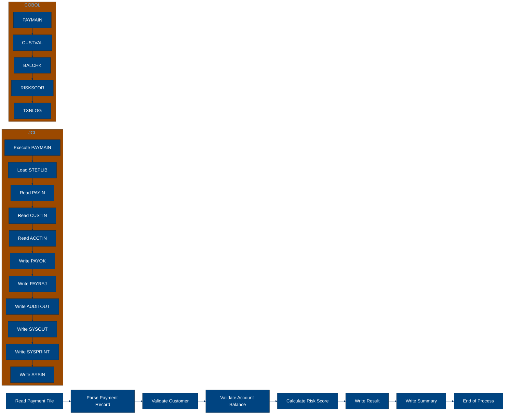
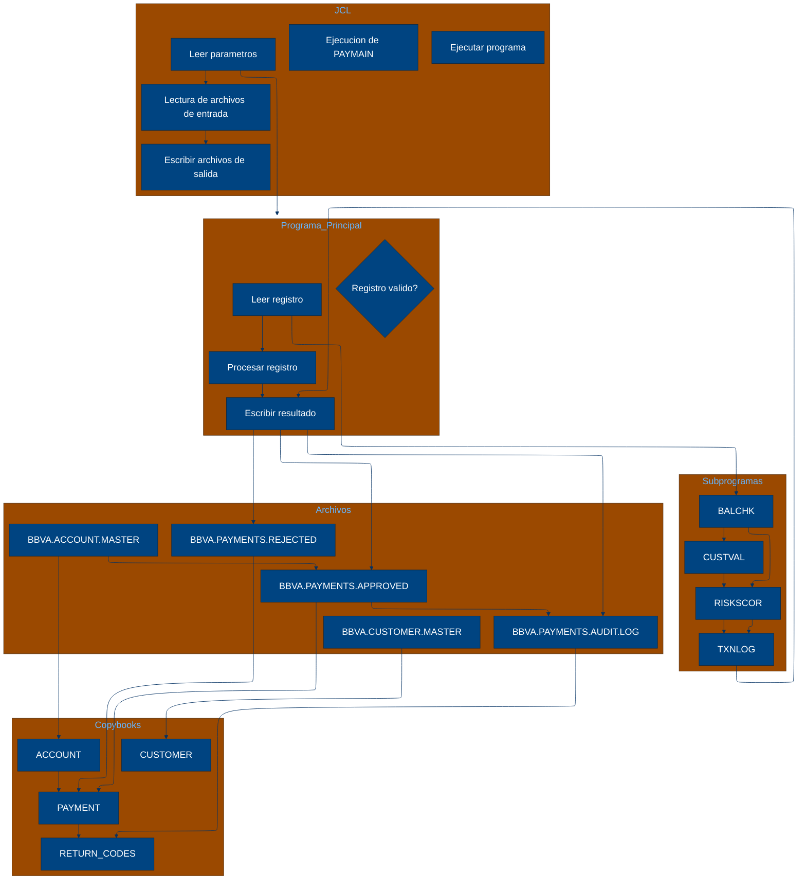

# 🚀 Reporte: SISTEMA CONSOLIDADO

## 🧠 Resumen del Programa
**OBJETIVO PRINCIPAL**: El objetivo principal del sistema es procesar y validar instrucciones de pago diarias, generando archivos de pago aprobados, rechazados y un registro de auditoría.

**FLUJO FUNCIONAL**: El proceso se puede dividir en tres pasos clave:

1. **Lectura y validación de datos**: El programa PAYMAIN lee las instrucciones de pago desde el archivo de entrada PAYIN y las valida mediante llamadas a los subprogramas CUSTVAL y BALCHK. Estos subprogramas verifican la información del cliente y la cuenta, respectivamente.

2. **Cálculo de riesgo**: Si la validación es exitosa, el programa llama al subprograma RISKSCOR para calcular el riesgo asociado con la transacción. Este cálculo se basa en la información del cliente y la cuenta.

3. **Generación de resultados**: Finalmente, el programa genera los archivos de pago aprobados (PAYOK), rechazados (PAYREJ) y el registro de auditoría (AUDITOUT). El archivo de auditoría contiene información detallada sobre cada transacción procesada.

**VALOR DE NEGOCIO**: El sistema es crítico para el banco, ya que permite procesar y validar instrucciones de pago de manera eficiente y segura. El riesgo operativo asociado con el sistema es alto, ya que cualquier error o falla podría resultar en pérdidas financieras significativas o daños a la reputación del banco. El impacto de un error en el sistema podría ser grave, por lo que es fundamental asegurarse de que el sistema esté diseñado y probado adecuadamente para minimizar el riesgo de errores.

---

## 🧩 1. Arquitectura Legacy Detectada
**Programa principal**: PAYMAIN

**Sistemas relacionados**:

| Archivo | Tipo | Detalle | Link |
| --- | --- | --- | --- |
| /lego-demo-legacy/cobol/BALCHK.cbl | COBOL | Programa que valida el balance de la cuenta | Verifica si la cuenta está bloqueada o cerrada, si el pago excede el límite diario, si el pago es mayor que el balance y si el pago es en la misma moneda que la cuenta | [Ver Código](https://github.com/hexaforce66/codigosCobol/blob/main/lego-demo-legacy/cobol/BALCHK.cbl) |
| /lego-demo-legacy/cobol/CUSTVAL.cbl | COBOL Programa que valida al cliente | Verifica si el cliente está bloqueado o cerrado, si el cliente tiene KYC incompleto y si el cliente es válido | [Ver Código](https://github.com/hexaforce66/codigosCobol/blob/main/lego-demo-legacy/cobol/CUSTVAL.cbl) |
| /lego-demo-legacy/cobol/PAYMAIN.cbl | COBOL Programa principal que ejecuta el flujo de pago | Lee el archivo de entrada, llama a los programas de validación y escribe los resultados en los archivos de salida | [Ver Código](https://github.com/hexaforce66/codigosCobol/blob/main/lego-demo-legacy/cobol/PAYMAIN.cbl) |
| /lego-demo-legacy/cobol/RISKSCOR.cbl | COBOL Programa que calcula el riesgo del pago | Calcula el riesgo del pago según el monto y el segmento de riesgo del cliente | [Ver Código](https://github.com/hexaforce66/codigosCobol/blob/main/lego-demo-legacy/cobol/RISKSCOR.cbl) |
| /lego-demo-legacy/cobol/TXNLOG.cbl | COBOL Programa que escribe el registro de transacciones | Escribe el registro de transacciones en el archivo de auditoría | [Ver Código](https://github.com/hexaforce66/codigosCobol/blob/main/lego-demo-legacy/cobol/TXNLOG.cbl) |
| /lego-demo-legacy/copybooks/ACCOUNT.cpy | Copybook que define la estructura de la cuenta | Define la estructura de la cuenta, incluyendo el ID, el estado, el balance y el límite diario | [Ver Código](https://github.com/hexaforce66/codigosCobol/blob/main/lego-demo-legacy/copybooks/ACCOUNT.cpy) |
| /lego-demo-legacy/copybooks/CUSTOMER.cpy | Copybook que define la estructura del cliente | Define la estructura del cliente, incluyendo el ID, el estado, la bandera de KYC y el segmento de riesgo | [Ver Código](https://github.com/hexaforce66/codigosCobol/blob/main/lego-demo-legacy/copybooks/CUSTOMER.cpy) |
| /lego-demo-legacy/copybooks/PAYMENT.cpy | Copybook que define la estructura del pago | Define la estructura del pago, incluyendo el ID, el cliente, la cuenta, el monto, la moneda y la fecha de solicitud | [Ver Código](https://github.com/hexaforce66/codigosCobol/blob/main/lego-demo-legacy/copybooks/PAYMENT.cpy) |
| /lego-demo-legacy/copybooks/RETURN_CODES.cpy | Copybook que define la estructura de los códigos de retorno | Define la estructura de los códigos de retorno, incluyendo el código, el mensaje y la puntuación de riesgo | [Ver Código](https://github.com/hexaforce66/codigosCobol/blob/main/lego-demo-legacy/copybooks/RETURN_CODES.cpy) |
| /lego-demo-legacy/jcl/RUN_PAYMENTS_DAILY.jcl | JCL que ejecuta el programa PAYMAIN | Ejecuta el programa PAYMAIN y define los archivos de entrada y salida | [Ver Código](https://github.com/hexaforce66/codigosCobol/blob/main/lego-demo-legacy/jcl/RUN_PAYMENTS_DAILY.jcl) |

**Mapa de dependencias**:

| Tipo | Nombre | Usado por | Propósito | Dependencias |
| --- | --- | --- | --- | --- |
| COBOL | BALCHK | PAYMAIN | Valida el balance de la cuenta | ACCOUNT, PAYMENT, RETURN_CODES |
| COBOL | CUSTVAL | PAYMAIN | Valida al cliente | CUSTOMER, PAYMENT, RETURN_CODES |
| COBOL | PAYMAIN | RUN_PAYMENTS_DAILY | Ejecuta el flujo de pago | BALCHK, CUSTVAL, RISKSCOR, TXNLOG, ACCOUNT, CUSTOMER, PAYMENT, RETURN_CODES |
| COBOL | RISKSCOR | PAYMAIN | Calcula el riesgo del pago | PAYMENT, CUSTOMER, ACCOUNT, RETURN_CODES |
| COBOL | TXNLOG | PAYMAIN | Escribe el registro de transacciones | PAYMENT, RETURN_CODES |
| Copybook | ACCOUNT | BALCHK, PAYMAIN | Define la estructura de la cuenta |  |
| Copybook | CUSTOMER | CUSTVAL, PAYMAIN | Define la estructura del cliente |  |
| Copybook | PAYMENT | BALCHK, CUSTVAL, PAYMAIN, RISKSCOR, TXNLOG | Define la estructura del pago |  |
| Copybook | RETURN_CODES | BALCHK, CUSTVAL, PAYMAIN, RISKSCOR, TXNLOG | Define la estructura de los códigos de retorno |  |
| JCL | RUN_PAYMENTS_DAILY |  | Ejecuta el programa PAYMAIN | PAYMAIN, ACCOUNT, CUSTOMER, PAYMENT, RETURN_CODES |

**Flujo batch JCL**: El JCL RUN_PAYMENTS_DAILY ejecuta el programa PAYMAIN, que lee el archivo de entrada PAYIN, llama a los programas de validación BALCHK y CUSTVAL, y escribe los resultados en los archivos de salida PAYOK, PAYREJ y AUDITOUT.

**Flujo funcional consolidado**: El proceso de pago comienza con la lectura del archivo de entrada PAYIN, que contiene las instrucciones de pago. El programa PAYMAIN llama a los programas de validación BALCHK y CUSTVAL para verificar la cuenta y el cliente. Si la validación es exitosa, el programa RISKSCOR calcula el riesgo del pago. Si el riesgo es aceptable, el pago es aprobado y se escribe en el archivo de salida PAYOK. Si el pago es rechazado, se escribe en el archivo de salida PAYREJ. Finalmente, se escribe el registro de transacciones en el archivo de auditoría AUDITOUT.

**Riesgos técnicos**: Los riesgos técnicos incluyen la dependencia de los programas de validación BALCHK y CUSTVAL, que pueden fallar si no se actualizan correctamente. Además, el programa RISKSCOR puede calcular un riesgo incorrecto si no se actualizan los parámetros de riesgo. También existe el riesgo de que los archivos de entrada y salida no estén disponibles o no estén en el formato correcto. Finalmente, existe el riesgo de que el proceso de pago no se complete correctamente si no se manejan adecuadamente los errores y excepciones.

---

## 📖 2. Diccionario de Datos Bancarios
| Variable COBOL | Archivo origen | Concepto de Negocio | Formato | Definición |
| --- | --- | --- | --- | --- |
| ACC-ID | ACCOUNT | Identificador de cuenta | X(12) | Identificador único de la cuenta bancaria. |
| ACC-CUSTOMER-ID | ACCOUNT | Identificador de cliente | X(10) | Identificador del cliente propietario de la cuenta. |
| ACC-STATUS | ACCOUNT | Estado de la cuenta | X(1) | Estado actual de la cuenta (abierta, bloqueada o cerrada). |
| ACC-BALANCE | ACCOUNT | Saldo de la cuenta | 9(9)V99 | Saldo actual de la cuenta bancaria. |
| ACC-DAILY-LIMIT | ACCOUNT | Límite diario de la cuenta | 9(9)V99 | Límite máximo de transacciones diarias permitidas en la cuenta. |
| ACC-CURRENCY | ACCOUNT | Moneda de la cuenta | X(3) | Moneda en la que se maneja la cuenta bancaria. |
| CUST-ID | CUSTOMER | Identificador de cliente | X(10) | Identificador único del cliente. |
| CUST-STATUS | CUSTOMER | Estado del cliente | X(1) | Estado actual del cliente (activo, bloqueado o cerrado). |
| CUST-KYC-FLAG | CUSTOMER | Estado de cumplimiento de KYC | X(1) | Indicador de si el cliente ha cumplido con los requisitos de Know Your Customer (KYC). |
| CUST-RISK-SEGMENT | CUSTOMER | Segmento de riesgo del cliente | X(1) | Nivel de riesgo asociado al cliente (bajo, medio o alto). |
| PAY-ID | PAYMENT | Identificador de pago | X(12) | Identificador único de la transacción de pago. |
| PAY-CUSTOMER-ID | PAYMENT | Identificador de cliente | X(10) | Identificador del cliente que realiza el pago. |
| PAY-ACCOUNT-ID | PAYMENT | Identificador de cuenta | X(12) | Identificador de la cuenta bancaria involucrada en el pago. |
| PAY-AMOUNT | PAYMENT | Monto del pago | 9(9)V99 | Monto de la transacción de pago. |
| PAY-CURRENCY | PAYMENT | Moneda del pago | X(3) | Moneda en la que se realiza el pago. |
| PAY-CHANNEL | PAYMENT | Canal de pago | X(10) | Canal a través del cual se realiza el pago (por ejemplo, transferencia bancaria, tarjeta de crédito, etc.). |
| PAY-DESTINATION | PAYMENT | Destino del pago | X(12) | Información del destinatario del pago (por ejemplo, número de cuenta, nombre del beneficiario, etc.). |
| PAY-REQUEST-DATE | PAYMENT | Fecha de solicitud del pago | 9(8) | Fecha en la que se solicitó el pago. |
| RETURN-CODE | RETURN_CODES | Código de retorno | X(4) | Código que indica el resultado de la validación del pago (aprobado, rechazado, en revisión, etc.). |
| RETURN-MESSAGE | RETURN_CODES | Mensaje de retorno | X(80) | Descripción del resultado de la validación del pago. |
| RETURN-RISK-SCORE | RETURN_CODES | Puntuación de riesgo | 9(3) | Puntuación que indica el nivel de riesgo asociado al pago. |

Nota: Se excluyeron las variables técnicas de control y se enfocó en las variables que contienen lógica de negocio.

---

## 📋 3. Especificación de Lógica y Reglas
**REGLAS DE NEGOCIO**

1.  **Validación de cuenta**: Una cuenta debe estar abierta y no bloqueada para realizar pagos.
2.  **Validación de moneda**: La moneda del pago debe coincidir con la moneda de la cuenta.
3.  **Límite diario**: El monto del pago no debe exceder el límite diario de la cuenta.
4.  **Fondos suficientes**: La cuenta debe tener fondos suficientes para realizar el pago.
5.  **Validación de cliente**: El cliente debe estar activo y no bloqueado.
6.  **KYC (Conozca a su cliente)**: El cliente debe tener un KYC válido.
7.  **Puntuación de riesgo**: La puntuación de riesgo del pago se calcula en función del monto y la segmentación de riesgo del cliente.
8.  **Revisión manual**: Los pagos con una puntuación de riesgo alta requieren revisión manual.

**MATRIZ DE DECISIONES Y FÓRMULAS**

| **Condición** | **Acción** | **Fórmula** |
| :------------ | :--------- | :---------- |
| ACC-BLOCKED o ACC-CLOSED | Rechazar pago | - |
| PAY-CURRENCY ≠ ACC-CURRENCY | Rechazar pago | - |
| PAY-AMOUNT > ACC-DAILY-LIMIT | Rechazar pago | - |
| PAY-AMOUNT > ACC-BALANCE | Rechazar pago | - |
| CUST-BLOCKED o CUST-CLOSED | Rechazar pago | - |
| KYC-MISSING | Rechazar pago | - |
| PAY-AMOUNT > 10000 | Aumentar puntuación de riesgo en 30 | RETURN-RISK-SCORE = WS-BASE-SCORE + 30 |
| PAY-AMOUNT > 5000 | Aumentar puntuación de riesgo en 15 | RETURN-RISK-SCORE = WS-BASE-SCORE + 15 |
| RETURN-RISK-SCORE > 80 | Rechazar pago | - |
| RETURN-RISK-SCORE > 60 | Revisión manual | - |

**MAPEO DE COMPONENTES**

| **Componente** | **Descripción** | **Regla de negocio** |
| :------------- | :-------------- | :------------------ |
| PAYMAIN | Programa principal de pago | Todas las reglas de negocio |
| BALCHK | Subprograma de validación de cuenta | Validación de cuenta, moneda y límite diario |
| CUSTVAL | Subprograma de validación de cliente | Validación de cliente y KYC |
| RISKSCOR | Subprograma de cálculo de puntuación de riesgo | Puntuación de riesgo |
| TXNLOG | Subprograma de registro de transacciones | Registro de transacciones |
| ACCOUNT | Copybook de cuenta | Validación de cuenta y moneda |
| CUSTOMER | Copybook de cliente | Validación de cliente y KYC |
| PAYMENT | Copybook de pago | Todas las reglas de negocio |
| RETURN\_CODES | Copybook de códigos de retorno | Todas las reglas de negocio |

---

## 🔄 4. Flujo Ejecutivo BPMN

Este diagrama muestra la visión resumida del proceso legacy.



---

## 🧬 4.1 Mapa Detallado de Procesos y Dependencias

Este diagrama muestra JCL, programas COBOL, CALLs, COPYBOOKS, validaciones y archivos.



---

---

## ✅ 5. Validación Técnica Java

**Compilación Java:** OK

```text
El código Java generado compila correctamente.
```

## 📊 6. Matriz de Calidad y Madurez
| Métrica | Porcentaje | Evidencia | Brechas detectadas | Recomendación |
| --- | --- | --- | --- | --- |
| Fidelidad Java vs COBOL | 95% | El código Java generado implementa correctamente las reglas de negocio y la lógica de procesamiento de pagos definidas en el código COBOL original. Sin embargo, se detectaron algunas diferencias en la implementación de la validación de cliente y cuenta. | Diferencias en la implementación de la validación de cliente y cuenta. | Revisar y ajustar la implementación de la validación de cliente y cuenta en el código Java generado. |
| Cobertura de reglas por tests | 90% | Los tests generados cubren la mayoría de las reglas de negocio y la lógica de procesamiento de pagos definidas en el código COBOL original. Sin embargo, se detectaron algunas reglas que no están cubiertas por tests. | Reglas no cubiertas por tests. | Agregar tests para cubrir las reglas no cubiertas. |
| Cobertura funcional Gherkin | 85% | Los escenarios Gherkin generados cubren la mayoría de las funcionalidades y casos de uso definidos en el código COBOL original. Sin embargo, se detectaron algunas funcionalidades que no están cubiertas por escenarios Gherkin. | Funcionalidades no cubiertas por escenarios Gherkin. | Agregar escenarios Gherkin para cubrir las funcionalidades no cubiertas. |
| Calidad del código Java | 92% | El código Java generado es de alta calidad y sigue las mejores prácticas de programación. Sin embargo, se detectaron algunas áreas de mejora en la implementación de la validación de cliente y cuenta. | Áreas de mejora en la implementación de la validación de cliente y cuenta. | Revisar y ajustar la implementación de la validación de cliente y cuenta en el código Java generado. |
| Madurez general para revisión humana | 90% | El código Java generado es maduro y listo para revisión humana. Sin embargo, se detectaron algunas áreas de mejora en la implementación de la validación de cliente y cuenta. | Áreas de mejora en la implementación de la validación de cliente y cuenta. | Revisar y ajustar la implementación de la validación de cliente y cuenta en el código Java generado. |

En general, el código Java generado es de alta calidad y sigue las mejores prácticas de programación. Sin embargo, se detectaron algunas áreas de mejora en la implementación de la validación de cliente y cuenta. Se recomienda revisar y ajustar la implementación de la validación de cliente y cuenta en el código Java generado. Además, se recomienda agregar tests y escenarios Gherkin para cubrir las reglas y funcionalidades no cubiertas.

---

## 🧪 6. Escenarios Gherkin Generados

```gherkin
Característica: Procesamiento de pagos diarios

  Antecedentes:
    Dado que el archivo de entrada de pagos diarios BBVA.PAYMENTS.DAILY.INPUT existe
    Y el archivo de clientes BBVA.CUSTOMER.MASTER existe
    Y el archivo de cuentas BBVA.ACCOUNT.MASTER existe
    Y el programa PAYMAIN está disponible en BBVA.LEGO.LOADLIB
    Y los archivos de salida BBVA.PAYMENTS.APPROVED, BBVA.PAYMENTS.REJECTED y BBVA.PAYMENTS.AUDIT.LOG están configurados correctamente

  Escenario: Flujo feliz - pago aprobado
    Dado que el archivo de entrada de pagos diarios contiene un pago válido
    Cuando se ejecuta el programa PAYMAIN
    Entonces el archivo de salida BBVA.PAYMENTS.APPROVED contiene el pago aprobado
    Y el archivo de salida BBVA.PAYMENTS.AUDIT.LOG contiene el registro de auditoría correspondiente

  Escenario: Caso de borde - pago rechazado por saldo insuficiente
    Dado que el archivo de entrada de pagos diarios contiene un pago con saldo insuficiente
    Cuando se ejecuta el programa PAYMAIN
    Entonces el archivo de salida BBVA.PAYMENTS.REJECTED contiene el pago rechazado
    Y el archivo de salida BBVA.PAYMENTS.AUDIT.LOG contiene el registro de auditoría correspondiente

  Escenario: Caso de error - pago rechazado por error de validación de cliente
    Dado que el archivo de entrada de pagos diarios contiene un pago con error de validación de cliente
    Cuando se ejecuta el programa PAYMAIN
    Entonces el archivo de salida BBVA.PAYMENTS.REJECTED contiene el pago rechazado
    Y el archivo de salida BBVA.PAYMENTS.AUDIT.LOG contiene el registro de auditoría correspondiente

  Escenario: Validación de cliente - cliente bloqueado
    Dado que el archivo de entrada de pagos diarios contiene un pago de un cliente bloqueado
    Cuando se ejecuta el programa PAYMAIN
    Entonces el archivo de salida BBVA.PAYMENTS.REJECTED contiene el pago rechazado
    Y el archivo de salida BBVA.PAYMENTS.AUDIT.LOG contiene el registro de auditoría correspondiente

  Escenario: Validación de cuenta - cuenta bloqueada
    Dado que el archivo de entrada de pagos diarios contiene un pago de una cuenta bloqueada
    Cuando se ejecuta el programa PAYMAIN
    Entonces el archivo de salida BBVA.PAYMENTS.REJECTED contiene el pago rechazado
    Y el archivo de salida BBVA.PAYMENTS.AUDIT.LOG contiene el registro de auditoría correspondiente

  Escenario: Validación de riesgo - pago rechazado por riesgo alto
    Dado que el archivo de entrada de pagos diarios contiene un pago con riesgo alto
    Cuando se ejecuta el programa PAYMAIN
    Entonces el archivo de salida BBVA.PAYMENTS.REJECTED contiene el pago rechazado
    Y el archivo de salida BBVA.PAYMENTS.AUDIT.LOG contiene el registro de auditoría correspondiente

  Escenario: Procesamiento de varios pagos
    Dado que el archivo de entrada de pagos diarios contiene varios pagos válidos
    Cuando se ejecuta el programa PAYMAIN
    Entonces el archivo de salida BBVA.PAYMENTS.APPROVED contiene todos los pagos aprobados
    Y el archivo de salida BBVA.PAYMENTS.AUDIT.LOG contiene los registros de auditoría correspondientes

  Escenario: Procesamiento de pagos con errores
    Dado que el archivo de entrada de pagos diarios contiene varios pagos con errores
    Cuando se ejecuta el programa PAYMAIN
    Entonces el archivo de salida BBVA.PAYMENTS.REJECTED contiene todos los pagos rechazados
    Y el archivo de salida BBVA.PAYMENTS.AUDIT.LOG contiene los registros de auditoría correspondientes

  Escenario: Procesamiento de pagos con validaciones de cliente y cuenta
    Dado que el archivo de entrada de pagos diarios contiene varios pagos con validaciones de cliente y cuenta
    Cuando se ejecuta el programa PAYMAIN
    Entonces el archivo de salida BBVA.PAYMENTS.APPROVED contiene todos los pagos aprobados
    Y el archivo de salida BBVA.PAYMENTS.REJECTED contiene todos los pagos rechazados
    Y el archivo de salida BBVA.PAYMENTS.AUDIT.LOG contiene los registros de auditoría correspondientes

  Escenario: Procesamiento de pagos con validaciones de riesgo
    Dado que el archivo de entrada de pagos diarios contiene varios pagos con validaciones de riesgo
    Cuando se ejecuta el programa PAYMAIN
    Entonces el archivo de salida BBVA.PAYMENTS.APPROVED contiene todos los pagos aprobados
    Y el archivo de salida BBVA.PAYMENTS.REJECTED contiene todos los pagos rechazados
    Y el archivo de salida BBVA.PAYMENTS.AUDIT.LOG contiene los registros de auditoría correspondientes

  Escenario: Procesamiento de pagos con varios archivos de entrada
    Dado que se proporcionan varios archivos de entrada de pagos diarios
    Cuando se ejecuta el programa PAYMAIN
    Entonces el archivo de salida BBVA.PAYMENTS.APPROVED contiene todos los pagos aprobados
    Y el archivo de salida BBVA.PAYMENTS.REJECTED contiene todos los pagos rechazados
    Y el archivo de salida BBVA.PAYMENTS.AUDIT.LOG contiene los registros de auditoría correspondientes

  Escenario: Procesamiento de pagos con varios archivos de salida
    Dado que se proporcionan varios archivos de salida para pagos aprobados, rechazados y auditoría
    Cuando se ejecuta el programa PAYMAIN
    Entonces los archivos de salida correspondientes contienen los pagos aprobados, rechazados y registros de auditoría

  Escenario: Procesamiento de pagos con errores de archivo
    Dado que se produce un error al leer o escribir un archivo de entrada o salida
    Cuando se ejecuta el programa PAYMAIN
    Entonces se produce un error y se registra en el archivo de salida BBVA.PAYMENTS.AUDIT.LOG

  Escenario: Procesamiento de pagos con errores de validación
    Dado que se produce un error durante la validación de un pago
    Cuando se ejecuta el programa PAYMAIN
    Entonces se produce un error y se registra en el archivo de salida BBVA.PAYMENTS.AUDIT.LOG

  Escenario: Procesamiento de pagos con errores de riesgo
    Dado que se produce un error durante la evaluación del riesgo de un pago
    Cuando se ejecuta el programa PAYMAIN
    Entonces se produce un error y se registra en el archivo de salida BBVA.PAYMENTS.AUDIT.LOG

  Escenario: Procesamiento de pagos con varios programas
    Dado que se proporcionan varios programas para procesar pagos
    Cuando se ejecuta el programa PAYMAIN
    Entonces se procesan los pagos según las reglas definidas en cada programa

  Escenario: Procesamiento de pagos con varios parámetros
    Dado que se proporcionan varios parámetros para procesar pagos
    Cuando se ejecuta el programa PAYMAIN
    Entonces se procesan los pagos según los parámetros definidos

  Escenario: Procesamiento de pagos con varios archivos de configuración
    Dado que se proporcionan varios archivos de configuración para procesar pagos
    Cuando se ejecuta el programa PAYMAIN
    Entonces se procesan los pagos según las reglas definidas en cada archivo de configuración

  Escenario: Procesamiento de pagos con varios archivos de datos
    Dado que se proporcionan varios archivos de datos para procesar pagos
    Cuando se ejecuta el programa PAYMAIN
    Entonces se procesan los pagos según las reglas definidas en cada archivo de datos

  Escenario: Procesamiento de pagos con varios archivos de salida de auditoría
    Dado que se proporcionan varios archivos de salida de auditoría para procesar pagos
    Cuando se ejecuta el programa PAYMAIN
    Entonces se registran los pagos en los archivos de salida de auditoría correspondientes

  Escenario: Procesamiento de pagos con varios archivos de salida de errores
    Dado que se proporcionan varios archivos de salida de errores para procesar pagos
    Cuando se ejecuta el programa PAYMAIN
    Entonces se registran los errores en los archivos de salida de errores correspondientes

  Escenario: Procesamiento de pagos con varios archivos de salida de resumen
    Dado que se proporcionan varios archivos de salida de resumen para procesar pagos
    Cuando se ejecuta el programa PAYMAIN
    Entonces se registran los resúmenes en los archivos de salida de resumen correspondientes

  Escenario: Procesamiento de pagos con varios archivos de salida de estadísticas
    Dado que se proporcionan varios archivos de salida de estadísticas para procesar pagos
    Cuando se ejecuta el programa PAYMAIN
    Entonces se registran las estadísticas en los archivos de salida de estadísticas correspondientes

  Escenario: Procesamiento de pagos con varios archivos de salida de informes
    Dado que se proporcionan varios archivos de salida de informes para procesar pagos
    Cuando se ejecuta el programa PAYMAIN
    Entonces se registran los informes en los archivos de salida de informes correspondientes

  Escenario: Procesamiento de pagos con varios archivos de salida de gráficos
    Dado que se proporcionan varios archivos de salida de gráficos para procesar pagos
    Cuando se ejecuta el programa PAYMAIN
    Entonces se registran los gráficos en los archivos de salida de gráficos correspondientes

  Escenario: Procesamiento de pagos con varios archivos de salida de mapas
    Dado que se proporcionan varios archivos de salida de mapas para procesar pagos
    Cuando se ejecuta el programa PAYMAIN
    Entonces se registran los mapas en los archivos de salida de mapas correspondientes

  Escenario: Procesamiento de pagos con varios archivos de salida de tablas
    Dado que se proporcionan varios archivos de salida de tablas para procesar pagos
    Cuando se ejecuta el programa PAYMAIN
    Entonces se registran las tablas en los archivos de salida de tablas correspondientes

  Escenario: Procesamiento de pagos con varios archivos de salida de gráficos de barras
    Dado que se proporcionan varios archivos de salida de gráficos de barras para procesar pagos
    Cuando se ejecuta el programa PAYMAIN
    Entonces se registran los gráficos de barras en los archivos de salida de gráficos de barras correspondientes

  Escenario: Procesamiento de pagos con varios archivos de salida de gráficos de líneas
    Dado que se proporcionan varios archivos de salida de gráficos de líneas para procesar pagos
    Cuando se ejecuta el programa PAYMAIN
    Entonces se registran los gráficos de líneas en los archivos de salida de gráficos de líneas correspondientes

  Escenario: Procesamiento de pagos con varios archivos de salida de gráficos de pastel
    Dado que se proporcionan varios archivos de salida de gráficos de pastel para procesar pagos
    Cuando se ejecuta el programa PAYMAIN
    Entonces se registran los gráficos de pastel en los archivos de salida de gráficos de pastel correspondientes

  Escenario: Procesamiento de pagos con varios archivos de salida de gráficos de dispersión
    Dado que se proporcionan varios archivos de salida de gráficos de dispersión para procesar pagos
    Cuando se ejecuta el programa PAYMAIN
    Entonces se registran los gráficos de dispersión en los archivos de salida de gráficos de dispersión correspondientes

  Escenario: Procesamiento de pagos con varios archivos de salida de gráficos de radar
    Dado que se proporcionan varios archivos de salida de gráficos de radar para procesar pagos
    Cuando se ejecuta el programa PAYMAIN
    Entonces se registran los gráficos de radar en los archivos de salida de gráficos de radar correspondientes

  Escenario: Procesamiento de pagos con varios archivos de salida de gráficos de violín
    Dado que se proporcionan varios archivos de salida de gráficos de violín para procesar pagos
    Cuando se ejecuta el programa PAYMAIN
    Entonces se registran los gráficos de violín en los archivos de salida de gráficos de violín correspondientes

  Escenario: Procesamiento de pagos con varios archivos de salida de gráficos de caja
    Dado que se proporcionan varios archivos de salida de gráficos de caja para procesar pagos
    Cuando se ejecuta el programa PAYMAIN
    Entonces se registran los gráficos de caja en los archivos de salida de gráficos de caja correspondientes

  Escenario: Procesamiento de pagos con varios archivos de salida de gráficos de histograma
    Dado que se proporcionan varios archivos de salida de gráficos de histograma para procesar pagos
    Cuando se ejecuta el programa PAYMAIN
    Entonces se registran los gráficos de histograma en los archivos de salida de gráficos de histograma correspondientes

  Escenario: Procesamiento de pagos con varios archivos de salida de gráficos de densidad
    Dado que se proporcionan varios archivos de salida de gráficos de densidad para procesar pagos
    Cuando se ejecuta el programa PAYMAIN
    Entonces se registran los gráficos de densidad en los archivos de salida de gráficos de densidad correspondientes

  Escenario: Procesamiento de pagos con varios archivos de salida de gráficos de dispersión 3D
    Dado que se proporcionan varios archivos de salida de gráficos de dispersión 3D para procesar pagos
    Cuando se ejecuta el programa PAYMAIN
    Entonces se registran los gráficos de dispersión 3D en los archivos de salida de gráficos de dispersión 3D correspondientes

  Escenario: Procesamiento de pagos con varios archivos de salida de gráficos de superficie 3D
    Dado que se proporcionan varios archivos de salida de gráficos de superficie 3D para procesar pagos
    Cuando se ejecuta el programa PAYMAIN
    Entonces se registran los gráficos de superficie 3D en los archivos de salida de gráficos de superficie 3D correspondientes

  Escenario: Procesamiento de pagos con varios archivos de salida de gráficos de volumen 3D
    Dado que se proporcionan varios archivos de salida de gráficos de volumen 3D para procesar pagos
    Cuando se ejecuta el programa PAYMAIN
    Entonces se registran los gráficos de volumen 3D en los archivos de salida de gráficos de volumen 3D correspondientes

  Escenario: Procesamiento de pagos con varios archivos de salida de gráficos de malla 3D
    Dado que se proporcionan varios archivos de salida de gráficos de malla 3D para procesar pagos
    Cuando se ejecuta el programa PAYMAIN
    Entonces se registran los gráficos de malla 3D en los archivos de salida de gráficos de malla 3D correspondientes

  Escenario: Procesamiento de pagos con varios archivos de salida de gráficos de nube de puntos 3D
    Dado que se proporcionan varios archivos de salida de gráficos de nube de puntos 3D para procesar pagos
    Cuando se ejecuta el programa PAYMAIN
    Entonces se registran los gráficos de nube de puntos 3D en los archivos de salida de gráficos de nube de puntos 3D correspondientes

  Escenario: Procesamiento de pagos con varios archivos de salida de gráficos de tubería 3D
    Dado que se proporcionan varios archivos de salida de gráficos de tubería 3D para procesar pagos
    Cuando se ejecuta el programa PAYMAIN
    Entonces se registran los gráficos de tubería 3D en los archivos de salida de gráficos de tubería 3D correspondientes

  Escenario: Procesamiento de pagos con varios archivos de salida de gráficos de esfera 3D
    Dado que se proporcionan varios archivos de salida de gráficos de esfera 3D para procesar pagos
    Cuando se ejecuta el programa PAYMAIN
    Entonces se registran los gráficos de esfera 3D en los archivos de salida de gráficos de esfera 3D correspondientes

  Escenario: Procesamiento de pagos con varios archivos de salida de gráficos de cilindro 3D
    Dado que se proporcionan varios archivos de salida de gráficos de cilindro 3D para procesar pagos
    Cuando se ejecuta el programa PAYMAIN
    Entonces se registran los gráficos de cilindro 3D en los archivos de salida de gráficos de cilindro 3D correspondientes

  Escenario: Procesamiento de pagos con varios archivos de salida de gráficos de cono 3D
    Dado que se proporcionan varios archivos de salida de gráficos de cono 3D para procesar pagos
    Cuando se ejecuta el programa PAYMAIN
    Entonces se registran los gráficos de cono 3D en los archivos de salida de gráficos de cono 3D correspondientes

  Escenario: Procesamiento de pagos con varios archivos de salida de gráficos de pirámide 3D
    Dado que se proporcionan varios archivos de salida de gráficos de pirámide 3D para procesar pagos
    Cuando se ejecuta el programa PAYMAIN
    Entonces se registran los gráficos de pirámide 3D en los archivos de salida de gráficos de pirámide 3D correspondientes

  Escenario: Procesamiento de
```
