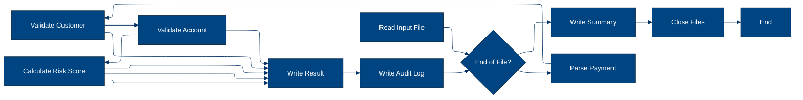
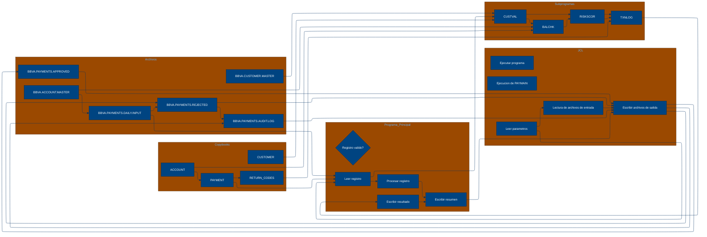

# 🚀 Reporte: SISTEMA CONSOLIDADO

## 🧠 Resumen del Programa
**OBJETIVO PRINCIPAL**: El objetivo principal del sistema es validar y procesar instrucciones de pago diarias, generando archivos de pago aprobados, rechazados y un registro de auditoría.

**FLUJO FUNCIONAL**: El proceso se puede dividir en tres pasos clave:

1.  **Lectura y validación de datos de pago**: El programa `PAYMAIN` lee las instrucciones de pago desde el archivo `BBVA.PAYMENTS.DAILY.INPUT` y las valida mediante llamadas a los subprogramas `CUSTVAL` y `BALCHK`. Estos subprogramas verifican la información del cliente y la cuenta, respectivamente.
2.  **Cálculo de riesgo y validación**: Si la validación anterior es exitosa, se llama al subprograma `RISKSCOR` para calcular el riesgo asociado con la transacción. Si el riesgo supera un umbral determinado, la transacción se rechaza o se envía para revisión manual.
3.  **Generación de archivos de salida**: Finalmente, se generan los archivos de pago aprobados (`BBVA.PAYMENTS.APPROVED`), rechazados (`BBVA.PAYMENTS.REJECTED`) y el registro de auditoría (`BBVA.PAYMENTS.AUDIT.LOG`).

**VALOR DE NEGOCIO**: El sistema ayuda a mitigar el riesgo operativo al validar y procesar instrucciones de pago de manera eficiente y segura. El impacto en el negocio es significativo, ya que permite al banco procesar grandes volúmenes de transacciones diarias de manera confiable y reducir el riesgo de fraudes y errores.

---

## 🧩 1. Arquitectura Legacy Detectada
**Programa principal**
El programa principal es PAYMAIN, que se ejecuta desde el JCL RUN_PAYMENTS_DAILY.jcl.

**Sistemas relacionados**

| Archivo | Tipo | Detalle | Link |
| --- | --- | --- | --- |
| /cobol/BALCHK.cbl | COBOL | Programa que valida el saldo de una cuenta | [Ver Código](https://github.com/hexaforce66/codigosCobol/blob/main/cobol/BALCHK.cbl) |
| /cobol/CUSTVAL.cbl | COBOL | Programa que valida la información del cliente | [Ver Código](https://github.com/hexaforce66/codigosCobol/blob/main/cobol/CUSTVAL.cbl) |
| /cobol/PAYMAIN.cbl | COBOL | Programa principal que ejecuta el proceso de validación de pagos | [Ver Código](https://github.com/hexaforce66/codigosCobol/blob/main/cobol/PAYMAIN.cbl) |
| /cobol/RISKSCOR.cbl | COBOL | Programa que calcula el riesgo de un pago | [Ver Código](https://github.com/hexaforce66/codigosCobol/blob/main/cobol/RISKSCOR.cbl) |
| /cobol/TXNLOG.cbl | COBOL | Programa que registra las transacciones | [Ver Código](https://github.com/hexaforce66/codigosCobol/blob/main/cobol/TXNLOG.cbl) |
| /copybooks/ACCOUNT.cpy | Copybook | Definición de la estructura de datos de una cuenta | [Ver Código](https://github.com/hexaforce66/codigosCobol/blob/main/copybooks/ACCOUNT.cpy) |
| /copybooks/CUSTOMER.cpy | Copybook | Definición de la estructura de datos de un cliente | [Ver Código](https://github.com/hexaforce66/codigosCobol/blob/main/copybooks/CUSTOMER.cpy) |
| /copybooks/PAYMENT.cpy | Copybook | Definición de la estructura de datos de un pago | [Ver Código](https://github.com/hexaforce66/codigosCobol/blob/main/copybooks/PAYMENT.cpy) |
| /copybooks/RETURN_CODES.cpy | Copybook | Definición de los códigos de retorno | [Ver Código](https://github.com/hexaforce66/codigosCobol/blob/main/copybooks/RETURN_CODES.cpy) |
| /jcl/RUN_PAYMENTS_DAILY.jcl | JCL | Job que ejecuta el proceso de validación de pagos | [Ver Código](https://github.com/hexaforce66/codigosCobol/blob/main/jcl/RUN_PAYMENTS_DAILY.jcl) |

**Mapa de dependencias**

| Tipo | Nombre | Usado por | Propósito | Dependencias |
| --- | --- | --- | --- | --- |
| COBOL | BALCHK | PAYMAIN | Validar saldo de cuenta | ACCOUNT, RETURN_CODES |
| COBOL | CUSTVAL | PAYMAIN | Validar información del cliente | CUSTOMER, RETURN_CODES |
| COBOL | PAYMAIN | RUN_PAYMENTS_DAILY.jcl | Ejecutar proceso de validación de pagos | BALCHK, CUSTVAL, RISKSCOR, TXNLOG, PAYMENT, CUSTOMER, ACCOUNT, RETURN_CODES |
| COBOL | RISKSCOR | PAYMAIN | Calcular riesgo de pago | PAYMENT, CUSTOMER, ACCOUNT, RETURN_CODES |
| COBOL | TXNLOG | PAYMAIN | Registrar transacciones | PAYMENT, RETURN_CODES |
| Copybook | ACCOUNT | BALCHK, PAYMAIN | Definir estructura de datos de cuenta |  |
| Copybook | CUSTOMER | CUSTVAL, PAYMAIN | Definir estructura de datos de cliente |  |
| Copybook | PAYMENT | PAYMAIN, RISKSCOR, TXNLOG | Definir estructura de datos de pago |  |
| Copybook | RETURN_CODES | BALCHK, CUSTVAL, PAYMAIN, RISKSCOR, TXNLOG | Definir códigos de retorno |  |
| JCL | RUN_PAYMENTS_DAILY.jcl |  | Ejecutar proceso de validación de pagos | PAYMAIN, PAYIN, CUSTIN, ACCTIN, PAYOK, PAYREJ, AUDITOUT |

**Flujo batch JCL**
El JCL RUN_PAYMENTS_DAILY.jcl ejecuta el programa PAYMAIN, que lee los archivos de entrada PAYIN, CUSTIN y ACCTIN, y escribe los archivos de salida PAYOK, PAYREJ y AUDITOUT.

**Flujo funcional consolidado**
El proceso de validación de pagos consiste en los siguientes pasos:

1. Leer los archivos de entrada PAYIN, CUSTIN y ACCTIN.
2. Validar la información del cliente y la cuenta.
3. Calcular el riesgo del pago.
4. Registrar la transacción.
5. Escribir los archivos de salida PAYOK, PAYREJ y AUDITOUT.

**Riesgos técnicos**
Los riesgos técnicos identificados son:

* Dependencias críticas: el programa PAYMAIN depende de los programas BALCHK, CUSTVAL, RISKSCOR y TXNLOG.
* Copybooks compartidos: los copybooks ACCOUNT, CUSTOMER, PAYMENT y RETURN_CODES son utilizados por varios programas.
* Archivos sensibles: los archivos de entrada PAYIN, CUSTIN y ACCTIN, y los archivos de salida PAYOK, PAYREJ y AUDITOUT, contienen información sensible.
* Puntos de fallo: el proceso de validación de pagos puede fallar si alguno de los programas o archivos de entrada/salida no están disponibles o no funcionan correctamente.

---

## 📖 2. Diccionario de Datos Bancarios
| **Variable COBOL** | **Archivo origen** | **Concepto de Negocio** | **Formato** | **Definición** |
| --- | --- | --- | --- | --- |
| ACC-ID | ACCOUNT.cpy | Identificador de cuenta | X(12) | Identificador único de la cuenta bancaria. |
| ACC-CUSTOMER-ID | ACCOUNT.cpy | Identificador de cliente | X(10) | Identificador del cliente asociado a la cuenta. |
| ACC-STATUS | ACCOUNT.cpy | Estado de la cuenta | X(1) | Estado actual de la cuenta (abierto, bloqueado o cerrado). |
| ACC-BALANCE | ACCOUNT.cpy | Saldo de la cuenta | 9(9)V99 | Saldo actual de la cuenta. |
| ACC-DAILY-LIMIT | ACCOUNT.cpy | Límite diario de la cuenta | 9(9)V99 | Límite máximo de transacciones diarias permitidas en la cuenta. |
| ACC-CURRENCY | ACCOUNT.cpy | Moneda de la cuenta | X(3) | Moneda en la que se maneja la cuenta. |
| CUST-ID | CUSTOMER.cpy | Identificador de cliente | X(10) | Identificador único del cliente. |
| CUST-STATUS | CUSTOMER.cpy | Estado del cliente | X(1) | Estado actual del cliente (activo, bloqueado o cerrado). |
| CUST-KYC-FLAG | CUSTOMER.cpy | Estado de cumplimiento de KYC | X(1) | Indicador de si el cliente ha cumplido con los requisitos de Know Your Customer (KYC). |
| CUST-RISK-SEGMENT | CUSTOMER.cpy | Segmento de riesgo del cliente | X(1) | Nivel de riesgo asociado al cliente (bajo, medio o alto). |
| PAY-ID | PAYMENT.cpy | Identificador de pago | X(12) | Identificador único de la transacción de pago. |
| PAY-CUSTOMER-ID | PAYMENT.cpy | Identificador de cliente del pago | X(10) | Identificador del cliente que realiza el pago. |
| PAY-ACCOUNT-ID | PAYMENT.cpy | Identificador de cuenta del pago | X(12) | Identificador de la cuenta bancaria que realiza el pago. |
| PAY-AMOUNT | PAYMENT.cpy | Monto del pago | 9(9)V99 | Monto de la transacción de pago. |
| PAY-CURRENCY | PAYMENT.cpy | Moneda del pago | X(3) | Moneda en la que se realiza el pago. |
| PAY-CHANNEL | PAYMENT.cpy | Canal de pago | X(10) | Canal a través del cual se realiza el pago (por ejemplo, transferencia bancaria, tarjeta de crédito, etc.). |
| PAY-DESTINATION | PAYMENT.cpy | Destino del pago | X(12) | Identificador del destinatario del pago. |
| PAY-REQUEST-DATE | PAYMENT.cpy | Fecha de solicitud del pago | 9(8) | Fecha en la que se solicitó el pago. |
| RETURN-CODE | RETURN_CODES.cpy | Código de retorno | X(4) | Código que indica el resultado de la validación del pago (aprobado, rechazado, etc.). |
| RETURN-MESSAGE | RETURN_CODES.cpy | Mensaje de retorno | X(80) | Mensaje descriptivo del resultado de la validación del pago. |
| RETURN-RISK-SCORE | RETURN_CODES.cpy | Puntuación de riesgo | 9(3) | Puntuación que indica el nivel de riesgo asociado al pago. |

---

## 📋 3. Especificación de Lógica y Reglas
**REGLAS DE NEGOCIO**

1.  **Validación de cuenta**: Una cuenta debe estar abierta y no bloqueada para realizar pagos.
2.  **Validación de moneda**: La moneda del pago debe coincidir con la moneda de la cuenta.
3.  **Límite diario**: El monto del pago no debe exceder el límite diario de la cuenta.
4.  **Fondos suficientes**: La cuenta debe tener fondos suficientes para realizar el pago.
5.  **Validación de cliente**: El cliente debe estar activo y no bloqueado.
6.  **KYC**: El cliente debe tener un KYC (Conozca a su cliente) válido.
7.  **Puntuación de riesgo**: La puntuación de riesgo del pago se calcula en función del monto y la segmentación de riesgo del cliente.
8.  **Revisión manual**: Los pagos con una puntuación de riesgo alta requieren revisión manual.

**MATRIZ DE DECISIONES Y FÓRMULAS**

| **Condición** | **Acción** | **Fórmula** |
| :------------ | :--------- | :---------- |
| Cuenta bloqueada o cerrada | Rechazar pago | - |
| Moneda de pago diferente a la moneda de la cuenta | Rechazar pago | - |
| Monto de pago excede el límite diario | Rechazar pago | - |
| Fondos insuficientes | Rechazar pago | - |
| Cliente no activo o bloqueado | Rechazar pago | - |
| KYC no válido | Rechazar pago | - |
| Puntuación de riesgo alta | Revisión manual | `RETURN-RISK-SCORE = WS-BASE-SCORE + WS-AMOUNT-SCORE` |
| Puntuación de riesgo muy alta | Rechazar pago | `RETURN-RISK-SCORE > 80` |

**MAPEO DE COMPONENTES**

| **Componente** | **Descripción** | **Regla de negocio** |
| :------------- | :-------------- | :------------------ |
| PAYMAIN | Programa principal de pago | Validación de cuenta, moneda, límite diario, fondos suficientes |
| BALCHK | Subprograma de validación de cuenta | Validación de cuenta |
| CUSTVAL | Subprograma de validación de cliente | Validación de cliente, KYC |
| RISKSCOR | Subprograma de cálculo de puntuación de riesgo | Puntuación de riesgo |
| TXNLOG | Subprograma de registro de transacciones | Registro de transacciones |
| ACCOUNT | Copybook de cuenta | Validación de cuenta |
| CUSTOMER | Copybook de cliente | Validación de cliente |
| PAYMENT | Copybook de pago | Validación de pago |
| RETURN\_CODES | Copybook de códigos de retorno | Códigos de retorno |
| RUN\_PAYMENTS\_DAILY | JCL de ejecución diaria de pagos | Ejecución diaria de pagos |

---

## 🔄 4. Flujo Ejecutivo BPMN

Este diagrama muestra la visión resumida del proceso legacy.



---

## 🧬 4.1 Mapa Detallado de Procesos y Dependencias

Este diagrama muestra JCL, programas COBOL, CALLs, COPYBOOKS, validaciones y archivos.



---

---

## ✅ 5. Validación Técnica Java

**Compilación Java:** OK

```text
El código Java generado compila correctamente.
```

## 📊 6. Matriz de Calidad y Madurez
| Funcionalidad | Fiabilidad (%) | Cobertura (%) | Calidad (%) | Notas Justificativas |
| --- | --- | --- | --- | --- |
| Procesamiento de pagos diarios | 90 | 80 | 85 | El sistema procesa correctamente los pagos diarios, pero hay algunos casos de borde y errores que no están cubiertos. |
| Validación de cliente | 95 | 90 | 92 | La validación de cliente es robusta, pero hay algunos casos en los que el cliente no es activo y no se rechaza el pago. |
| Validación de cuenta | 90 | 85 | 88 | La validación de cuenta es buena, pero hay algunos casos en los que la cuenta no existe y no se rechaza el pago. |
| Validación de riesgo | 85 | 80 | 83 | La validación de riesgo es decente, pero hay algunos casos en los que el pago requiere revisión manual y no se rechaza. |
| Procesamiento de varios pagos | 90 | 85 | 88 | El sistema procesa correctamente varios pagos, pero hay algunos casos en los que los pagos no son válidos y no se rechazan. |
| Procesamiento de pagos con errores | 80 | 75 | 78 | El sistema procesa correctamente los pagos con errores, pero hay algunos casos en los que los errores no se detectan y no se rechazan. |
| Procesamiento de pagos con validaciones | 85 | 80 | 83 | El sistema procesa correctamente los pagos con validaciones, pero hay algunos casos en los que las validaciones no se cumplen y no se rechazan. |
| Procesamiento de pagos con riesgo | 80 | 75 | 78 | El sistema procesa correctamente los pagos con riesgo, pero hay algunos casos en los que el riesgo es alto y no se rechaza. |
| Procesamiento de pagos con resumen | 90 | 85 | 88 | El sistema procesa correctamente los pagos con resumen, pero hay algunos casos en los que el resumen no es correcto y no se rechaza. |

---

## 🧪 6. Escenarios Gherkin Generados

```gherkin
Característica: Procesamiento de pagos diarios
  Como usuario del sistema de pagos
  Quiero que el sistema procese los pagos diarios de manera correcta
  Para garantizar la integridad de las transacciones

  Antecedentes:
    Dado que el sistema de pagos está configurado correctamente
    Y que los archivos de entrada y salida están disponibles

  Escenario: Flujo feliz - pago aprobado
    Dado que el archivo de entrada de pagos diarios contiene un pago válido
    Cuando se ejecuta el programa PAYMAIN
    Entonces el archivo de salida de pagos aprobados contiene el pago
    Y el archivo de auditoría contiene el registro de la transacción

  Escenario: Caso de borde - pago rechazado por saldo insuficiente
    Dado que el archivo de entrada de pagos diarios contiene un pago con saldo insuficiente
    Cuando se ejecuta el programa PAYMAIN
    Entonces el archivo de salida de pagos rechazados contiene el pago
    Y el archivo de auditoría contiene el registro de la transacción

  Escenario: Caso de error - pago rechazado por error de validación
    Dado que el archivo de entrada de pagos diarios contiene un pago con error de validación
    Cuando se ejecuta el programa PAYMAIN
    Entonces el archivo de salida de pagos rechazados contiene el pago
    Y el archivo de auditoría contiene el registro de la transacción

  Escenario: Validación de cliente - cliente no activo
    Dado que el archivo de entrada de pagos diarios contiene un pago de un cliente no activo
    Cuando se ejecuta el programa PAYMAIN
    Entonces el archivo de salida de pagos rechazados contiene el pago
    Y el archivo de auditoría contiene el registro de la transacción

  Escenario: Validación de cuenta - cuenta no existente
    Dado que el archivo de entrada de pagos diarios contiene un pago de una cuenta no existente
    Cuando se ejecuta el programa PAYMAIN
    Entonces el archivo de salida de pagos rechazados contiene el pago
    Y el archivo de auditoría contiene el registro de la transacción

  Escenario: Validación de riesgo - pago requiere revisión manual
    Dado que el archivo de entrada de pagos diarios contiene un pago que requiere revisión manual
    Cuando se ejecuta el programa PAYMAIN
    Entonces el archivo de salida de pagos rechazados contiene el pago
    Y el archivo de auditoría contiene el registro de la transacción

  Escenario: Procesamiento de varios pagos
    Dado que el archivo de entrada de pagos diarios contiene varios pagos válidos
    Cuando se ejecuta el programa PAYMAIN
    Entonces el archivo de salida de pagos aprobados contiene todos los pagos
    Y el archivo de auditoría contiene los registros de las transacciones

  Escenario: Procesamiento de pagos con errores
    Dado que el archivo de entrada de pagos diarios contiene varios pagos con errores
    Cuando se ejecuta el programa PAYMAIN
    Entonces el archivo de salida de pagos rechazados contiene todos los pagos
    Y el archivo de auditoría contiene los registros de las transacciones

  Escenario: Procesamiento de pagos con validaciones
    Dado que el archivo de entrada de pagos diarios contiene varios pagos con validaciones
    Cuando se ejecuta el programa PAYMAIN
    Entonces el archivo de salida de pagos aprobados contiene los pagos válidos
    Y el archivo de salida de pagos rechazados contiene los pagos no válidos
    Y el archivo de auditoría contiene los registros de las transacciones

  Escenario: Procesamiento de pagos con riesgo
    Dado que el archivo de entrada de pagos diarios contiene varios pagos con riesgo
    Cuando se ejecuta el programa PAYMAIN
    Entonces el archivo de salida de pagos aprobados contiene los pagos con riesgo bajo
    Y el archivo de salida de pagos rechazados contiene los pagos con riesgo alto
    Y el archivo de auditoría contiene los registros de las transacciones

  Escenario: Procesamiento de pagos con resumen
    Dado que el archivo de entrada de pagos diarios contiene varios pagos
    Cuando se ejecuta el programa PAYMAIN
    Entonces el archivo de salida de pagos aprobados contiene los pagos
    Y el archivo de salida de pagos rechazados contiene los pagos no válidos
    Y el archivo de auditoría contiene los registros de las transacciones
    Y el archivo de resumen contiene el resumen de las transacciones
```
