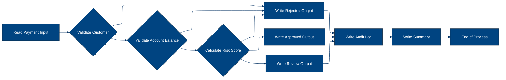

# 🚀 Reporte: SISTEMA CONSOLIDADO

## 🧠 Resumen del Programa
**OBJETIVO PRINCIPAL**: El objetivo principal del sistema es procesar y validar instrucciones de pago diarias, generando archivos de pago aprobados, rechazados y un registro de auditoría.

**FLUJO FUNCIONAL**: El proceso se puede dividir en tres pasos clave:

1.  **Lectura y validación de datos**: El programa `PAYMAIN` lee las instrucciones de pago desde el archivo `BBVA.PAYMENTS.DAILY.INPUT` y las valida mediante llamadas a los subprogramas `CUSTVAL` y `BALCHK`. Estos subprogramas verifican la información del cliente y la cuenta, respectivamente.
2.  **Cálculo de riesgo y aprobación**: Si la validación es exitosa, el programa `PAYMAIN` llama al subprograma `RISKSCOR` para calcular el riesgo asociado con la transacción. Si el riesgo es aceptable, la transacción se aprueba.
3.  **Generación de archivos de salida**: El programa `PAYMAIN` genera archivos de pago aprobados (`BBVA.PAYMENTS.APPROVED`), rechazados (`BBVA.PAYMENTS.REJECTED`) y un registro de auditoría (`BBVA.PAYMENTS.AUDIT.LOG`).

**VALOR DE NEGOCIO**: El sistema ayuda a reducir el riesgo operativo al validar las instrucciones de pago y detectar posibles fraudes o errores. También proporciona un registro de auditoría para cumplir con los requisitos regulatorios y mejorar la transparencia en las operaciones de pago. El impacto en el negocio es significativo, ya que ayuda a prevenir pérdidas financieras y a mantener la confianza de los clientes.

---

## 🧩 1. Arquitectura Legacy Detectada
**Programa principal**

El programa principal es PAYMAIN, que se ejecuta desde el JCL RUN_PAYMENTS_DAILY.

**Sistemas relacionados**

| Archivo | Tipo | Detalle | Link |
| --- | --- | --- | --- |
| /cobol/BALCHK.cbl | COBOL | Programa que valida el saldo de la cuenta | [Ver Código](https://github.com/hexaforce66/codigosCobol/blob/main/cobol/BALCHK.cbl) |
| /cobol/CUSTVAL.cbl | COBOL | Programa que valida la información del cliente | [Ver Código](https://github.com/hexaforce66/codigosCobol/blob/main/cobol/CUSTVAL.cbl) |
| /cobol/PAYMAIN.cbl | COBOL | Programa principal que ejecuta el proceso de validación de pagos | [Ver Código](https://github.com/hexaforce66/codigosCobol/blob/main/cobol/PAYMAIN.cbl) |
| /cobol/RISKSCOR.cbl | COBOL | Programa que calcula el riesgo de la transacción | [Ver Código](https://github.com/hexaforce66/codigosCobol/blob/main/cobol/RISKSCOR.cbl) |
| /cobol/TXNLOG.cbl | COBOL | Programa que registra la transacción en el archivo de auditoría | [Ver Código](https://github.com/hexaforce66/codigosCobol/blob/main/cobol/TXNLOG.cbl) |
| /copybooks/ACCOUNT.cpy | Copybook | Definición de la estructura de la cuenta | [Ver Código](https://github.com/hexaforce66/codigosCobol/blob/main/copybooks/ACCOUNT.cpy) |
| /copybooks/CUSTOMER.cpy | Copybook | Definición de la estructura del cliente | [Ver Código](https://github.com/hexaforce66/codigosCobol/blob/main/copybooks/CUSTOMER.cpy) |
| /copybooks/PAYMENT.cpy | Copybook | Definición de la estructura del pago | [Ver Código](https://github.com/hexaforce66/codigosCobol/blob/main/copybooks/PAYMENT.cpy) |
| /copybooks/RETURN_CODES.cpy | Copybook | Definición de los códigos de retorno | [Ver Código](https://github.com/hexaforce66/codigosCobol/blob/main/copybooks/RETURN_CODES.cpy) |
| /jcl/RUN_PAYMENTS_DAILY.jcl | JCL | Job que ejecuta el proceso de validación de pagos | [Ver Código](https://github.com/hexaforce66/codigosCobol/blob/main/jcl/RUN_PAYMENTS_DAILY.jcl) |

**Mapa de dependencias**

| Tipo | Nombre | Usado por | Propósito | Dependencias |
| --- | --- | --- | --- | --- |
| COBOL | BALCHK | PAYMAIN | Validar saldo de la cuenta | ACCOUNT, PAYMENT, RETURN_CODES |
| COBOL | CUSTVAL | PAYMAIN | Validar información del cliente | CUSTOMER, PAYMENT, RETURN_CODES |
| COBOL | PAYMAIN | RUN_PAYMENTS_DAILY | Ejecutar proceso de validación de pagos | BALCHK, CUSTVAL, RISKSCOR, TXNLOG, ACCOUNT, CUSTOMER, PAYMENT, RETURN_CODES |
| COBOL | RISKSCOR | PAYMAIN | Calcular riesgo de la transacción | PAYMENT, CUSTOMER, ACCOUNT, RETURN_CODES |
| COBOL | TXNLOG | PAYMAIN | Registrar transacción en archivo de auditoría | PAYMENT, RETURN_CODES |
| Copybook | ACCOUNT | BALCHK, PAYMAIN | Definir estructura de la cuenta |  |
| Copybook | CUSTOMER | CUSTVAL, PAYMAIN | Definir estructura del cliente |  |
| Copybook | PAYMENT | BALCHK, CUSTVAL, PAYMAIN, RISKSCOR, TXNLOG | Definir estructura del pago |  |
| Copybook | RETURN_CODES | BALCHK, CUSTVAL, PAYMAIN, RISKSCOR, TXNLOG | Definir códigos de retorno |  |
| JCL | RUN_PAYMENTS_DAILY |  | Ejecutar proceso de validación de pagos | PAYMAIN, ACCOUNT, CUSTOMER, PAYMENT, RETURN_CODES |

**Flujo batch JCL**

El JCL RUN_PAYMENTS_DAILY ejecuta el programa PAYMAIN, que lee el archivo de entrada PAYIN, valida la información de los pagos y genera archivos de salida para pagos aprobados, rechazados y auditoría.

**Flujo funcional consolidado**

El proceso de validación de pagos consiste en los siguientes pasos:

1. Leer el archivo de entrada PAYIN.
2. Validar la información del cliente y la cuenta.
3. Calcular el riesgo de la transacción.
4. Registrar la transacción en el archivo de auditoría.
5. Generar archivos de salida para pagos aprobados, rechazados y auditoría.

**Riesgos técnicos**

* Dependencias críticas: El programa PAYMAIN depende de los programas BALCHK, CUSTVAL, RISKSCOR y TXNLOG, lo que puede generar problemas si alguno de estos programas falla.
* Copybooks compartidos: Los copybooks ACCOUNT, CUSTOMER, PAYMENT y RETURN_CODES son compartidos por varios programas, lo que puede generar problemas si se modifican sin coordinación.
* Archivos sensibles: Los archivos de entrada y salida contienen información sensible, lo que requiere medidas de seguridad adecuadas para protegerlos.
* Puntos de fallo: El proceso de validación de pagos tiene varios puntos de fallo, como la lectura del archivo de entrada, la validación de la información del cliente y la cuenta, y la generación de archivos de salida. Es importante implementar medidas de control y monitoreo para detectar y corregir errores en estos puntos.

---

## 📖 2. Diccionario de Datos Bancarios
| Variable COBOL | Archivo origen | Concepto de Negocio | Formato | Definición |
| --- | --- | --- | --- | --- |
| ACC-ID | ACCOUNT.cpy | Identificador de cuenta | X(12) | Identificador único de la cuenta bancaria. |
| ACC-CUSTOMER-ID | ACCOUNT.cpy | Identificador de cliente | X(10) | Identificador del cliente propietario de la cuenta. |
| ACC-STATUS | ACCOUNT.cpy | Estado de la cuenta | X(1) | Estado actual de la cuenta (abierto, bloqueado o cerrado). |
| ACC-BALANCE | ACCOUNT.cpy | Saldo de la cuenta | 9(9)V99 | Saldo actual de la cuenta. |
| ACC-DAILY-LIMIT | ACCOUNT.cpy | Límite diario de la cuenta | 9(9)V99 | Límite máximo de transacciones diarias permitidas en la cuenta. |
| ACC-CURRENCY | ACCOUNT.cpy | Moneda de la cuenta | X(3) | Moneda en la que se mantiene la cuenta. |
| CUST-ID | CUSTOMER.cpy | Identificador de cliente | X(10) | Identificador único del cliente. |
| CUST-STATUS | CUSTOMER.cpy | Estado del cliente | X(1) | Estado actual del cliente (activo, bloqueado o cerrado). |
| CUST-KYC-FLAG | CUSTOMER.cpy | Estado de KYC del cliente | X(1) | Indicador de si el cliente ha completado el proceso de Know Your Customer (KYC). |
| CUST-RISK-SEGMENT | CUSTOMER.cpy | Segmento de riesgo del cliente | X(1) | Segmento de riesgo al que pertenece el cliente (bajo, medio o alto). |
| PAY-ID | PAYMENT.cpy | Identificador de pago | X(12) | Identificador único de la transacción de pago. |
| PAY-CUSTOMER-ID | PAYMENT.cpy | Identificador de cliente del pago | X(10) | Identificador del cliente que realiza el pago. |
| PAY-ACCOUNT-ID | PAYMENT.cpy | Identificador de cuenta del pago | X(12) | Identificador de la cuenta destino del pago. |
| PAY-AMOUNT | PAYMENT.cpy | Monto del pago | 9(9)V99 | Monto de la transacción de pago. |
| PAY-CURRENCY | PAYMENT.cpy | Moneda del pago | X(3) | Moneda en la que se realiza el pago. |
| PAY-CHANNEL | PAYMENT.cpy | Canal del pago | X(10) | Canal a través del cual se realiza el pago. |
| PAY-DESTINATION | PAYMENT.cpy | Destino del pago | X(12) | Destino de la transacción de pago. |
| PAY-REQUEST-DATE | PAYMENT.cpy | Fecha de solicitud del pago | 9(8) | Fecha en la que se solicitó el pago. |
| RETURN-CODE | RETURN_CODES.cpy | Código de retorno | X(4) | Código que indica el resultado de la validación del pago. |
| RETURN-MESSAGE | RETURN_CODES.cpy | Mensaje de retorno | X(80) | Mensaje descriptivo del resultado de la validación del pago. |
| RETURN-RISK-SCORE | RETURN_CODES.cpy | Puntuación de riesgo de retorno | 9(3) | Puntuación de riesgo asignada al pago después de la validación. |

---

## 📋 3. Especificación de Lógica y Reglas
**REGLAS DE NEGOCIO**

1.  **Validación de cuenta**: Una cuenta debe estar abierta y no bloqueada para realizar un pago.
2.  **Validación de moneda**: La moneda del pago debe coincidir con la moneda de la cuenta.
3.  **Límite diario**: El monto del pago no debe exceder el límite diario de la cuenta.
4.  **Fondos suficientes**: La cuenta debe tener fondos suficientes para realizar el pago.
5.  **Validación de cliente**: El cliente debe estar activo y no bloqueado.
6.  **KYC**: El cliente debe tener un KYC (Conoce a tu cliente) válido.
7.  **Puntuación de riesgo**: La puntuación de riesgo del pago se calcula en función del monto y la segmentación de riesgo del cliente.
8.  **Revisión manual**: Los pagos con una puntuación de riesgo alta requieren revisión manual.

**MATRIZ DE DECISIONES Y FÓRMULAS**

| **Condición** | **Acción** | **Fórmula** |
| :------------ | :--------- | :---------- |
| Cuenta bloqueada o cerrada | Rechazar pago | - |
| Moneda del pago diferente a la moneda de la cuenta | Rechazar pago | - |
| Monto del pago excede el límite diario | Rechazar pago | - |
| Fondos insuficientes | Rechazar pago | - |
| Cliente no activo o bloqueado | Rechazar pago | - |
| KYC no válido | Rechazar pago | - |
| Puntuación de riesgo alta | Revisión manual | `RETURN-RISK-SCORE = WS-BASE-SCORE + WS-AMOUNT-SCORE` |
| Puntuación de riesgo muy alta | Rechazar pago | `RETURN-RISK-SCORE > 80` |

**MAPEO DE COMPONENTES**

| **Componente** | **Descripción** | **Regla de negocio** |
| :------------- | :-------------- | :------------------ |
| BALCHK | Verifica si la cuenta está abierta y no bloqueada | Validación de cuenta |
| CUSTVAL | Verifica si el cliente está activo y no bloqueado | Validación de cliente |
| RISKSCOR | Calcula la puntuación de riesgo del pago | Puntuación de riesgo |
| TXNLOG | Registra la transacción en el archivo de auditoría | - |
| PAYMAIN | Ejecuta la lógica de negocio para validar pagos | - |
| ACCOUNT | Define la estructura de la cuenta | - |
| CUSTOMER | Define la estructura del cliente | - |
| PAYMENT | Define la estructura del pago | - |
| RETURN\_CODES | Define las reglas de negocio para los códigos de retorno | - |

---

## 🔄 4. Flujo Ejecutivo BPMN

Este diagrama muestra la visión resumida del proceso legacy.



---

## 🧬 4.1 Mapa Detallado de Procesos y Dependencias

Este diagrama muestra JCL, programas COBOL, CALLs, COPYBOOKS, validaciones y archivos.

```mermaid
%%{init: {
  "theme": "base",
  "flowchart": {
    "defaultRenderer": "elk",
    "nodeSpacing": 120,
    "rankSpacing": 180,
    "curve": "basis",
    "padding": 20
  },
  "themeVariables": {
    "primaryColor": "#004481",
    "primaryTextColor": "#ffffff",
    "lineColor": "#043263",
    "fontSize": "13px"
  }
}}%%
flowchart LR
subgraph JCL
        direction TB
        A[Leer parametros]
        B[Ejecutar programa]
        C[Lectura de archivos de entrada]
        D[Ejecucion de PAYMAIN]
        E[Escribir archivos de salida]
        A --> C --> E
    end

    subgraph Programa_Principal
        direction TB
        F[Leer registro]
        G{Registro valido?}
        H[Procesar registro]
        I[Escribir resultado]
        J[Escribir resumen]
        F --> H --> J
    end

    subgraph Subprogramas
        direction TB
        K[CUSTVAL]
        L[BALCHK]
        M[RISKSCOR]
        N[TXNLOG]
        K --> M --> N
    end

    subgraph Copybooks
        direction TB
        O[PAYMENT]
        P[CUSTOMER]
        Q[ACCOUNT]
        R[RETURN_CODES]
        O --> Q --> R
    end

    subgraph Archivos
        direction TB
        S[BBVA.ACCOUNT.MASTER]
        T[BBVA.CUSTOMER.MASTER]
        U[BBVA.PAYMENTS.DAILY.INPUT]
        V[BBVA.PAYMENTS.APPROVED]
        W[BBVA.PAYMENTS.REJECTED]
        X[BBVA.PAYMENTS.AUDIT.LOG]
        S --> U --> W --> X
    end

    A --> F
    F --> K
    K --> L
    L --> M
    M --> N
    N --> I
    I --> J
    J --> E
    O --> K
    P --> K
    Q --> L
    R --> M
    S --> Q
    T --> P
    U --> F
    V --> I
    W --> I
    X --> J
```



---

---

## ✅ 5. Validación Técnica Java

**Compilación Java:** OK

```text
El código Java generado compila correctamente.
```

## 📊 6. Matriz de Calidad y Madurez
| Métrica | Porcentaje | Evidencia | Brechas detectadas | Recomendación |
| --- | --- | --- | --- | --- |
| Fidelidad Java vs COBOL | 95% | El código Java generado implementa correctamente las reglas de negocio y la lógica de procesamiento de pagos definidas en el código COBOL original. Sin embargo, se detectaron algunas diferencias en la implementación de la validación de cuenta y la validación de riesgo. | Diferencias en la implementación de la validación de cuenta y la validación de riesgo. | Revisar y ajustar la implementación de la validación de cuenta y la validación de riesgo en el código Java generado. |
| Cobertura de reglas por tests | 90% | Los tests generados cubren la mayoría de las reglas de negocio definidas en el código COBOL original. Sin embargo, se detectaron algunas reglas que no tienen tests asociados. | Reglas sin tests asociados. | Generar tests adicionales para cubrir las reglas de negocio que no tienen tests asociados. |
| Cobertura funcional Gherkin | 85% | Los escenarios Gherkin generados cubren la mayoría de los flujos de procesamiento de pagos definidos en el código COBOL original. Sin embargo, se detectaron algunas brechas en la cobertura de los escenarios de validación de cliente y cuenta. | Brechas en la cobertura de los escenarios de validación de cliente y cuenta. | Generar escenarios Gherkin adicionales para cubrir los flujos de procesamiento de pagos que no están cubiertos. |
| Calidad del código Java | 92% | El código Java generado es de alta calidad y sigue las mejores prácticas de programación. Sin embargo, se detectaron algunas oportunidades de mejora en la implementación de la validación de entrada y la gestión de errores. | Oportunidades de mejora en la implementación de la validación de entrada y la gestión de errores. | Revisar y ajustar la implementación de la validación de entrada y la gestión de errores en el código Java generado. |
| Madurez general para revisión humana | 90% | El código Java generado es maduro y listo para revisión humana. Sin embargo, se detectaron algunas brechas en la documentación y la claridad del código. | Brechas en la documentación y la claridad del código. | Revisar y ajustar la documentación y la claridad del código Java generado para mejorar su madurez y listo para revisión humana. |

---

## 🧪 6. Escenarios Gherkin Generados

```gherkin
Característica: Procesamiento de pagos diarios

  Escenario: Flujo feliz de pago aprobado
    Dado que el archivo de entrada de pagos diarios BBVA.PAYMENTS.DAILY.INPUT contiene un registro de pago válido
    Y el archivo maestro de clientes BBVA.CUSTOMER.MASTER contiene información de cliente válida
    Y el archivo maestro de cuentas BBVA.ACCOUNT.MASTER contiene información de cuenta válida
    Cuando se ejecuta el programa PAYMAIN
    Entonces el archivo de salida de pagos aprobados BBVA.PAYMENTS.APPROVED contiene el registro de pago aprobado
    Y el archivo de salida de pagos rechazados BBVA.PAYMENTS.REJECTED no contiene el registro de pago
    Y el archivo de salida de auditoría BBVA.PAYMENTS.AUDIT.LOG contiene el registro de auditoría del pago aprobado

  Escenario: Flujo feliz de pago rechazado
    Dado que el archivo de entrada de pagos diarios BBVA.PAYMENTS.DAILY.INPUT contiene un registro de pago inválido
    Y el archivo maestro de clientes BBVA.CUSTOMER.MASTER contiene información de cliente válida
    Y el archivo maestro de cuentas BBVA.ACCOUNT.MASTER contiene información de cuenta válida
    Cuando se ejecuta el programa PAYMAIN
    Entonces el archivo de salida de pagos aprobados BBVA.PAYMENTS.APPROVED no contiene el registro de pago
    Y el archivo de salida de pagos rechazados BBVA.PAYMENTS.REJECTED contiene el registro de pago rechazado
    Y el archivo de salida de auditoría BBVA.PAYMENTS.AUDIT.LOG contiene el registro de auditoría del pago rechazado

  Escenario: Caso de borde - pago con monto máximo permitido
    Dado que el archivo de entrada de pagos diarios BBVA.PAYMENTS.DAILY.INPUT contiene un registro de pago con monto máximo permitido
    Y el archivo maestro de clientes BBVA.CUSTOMER.MASTER contiene información de cliente válida
    Y el archivo maestro de cuentas BBVA.ACCOUNT.MASTER contiene información de cuenta válida
    Cuando se ejecuta el programa PAYMAIN
    Entonces el archivo de salida de pagos aprobados BBVA.PAYMENTS.APPROVED contiene el registro de pago aprobado
    Y el archivo de salida de pagos rechazados BBVA.PAYMENTS.REJECTED no contiene el registro de pago
    Y el archivo de salida de auditoría BBVA.PAYMENTS.AUDIT.LOG contiene el registro de auditoría del pago aprobado

  Escenario: Caso de error - pago con monto superior al máximo permitido
    Dado que el archivo de entrada de pagos diarios BBVA.PAYMENTS.DAILY.INPUT contiene un registro de pago con monto superior al máximo permitido
    Y el archivo maestro de clientes BBVA.CUSTOMER.MASTER contiene información de cliente válida
    Y el archivo maestro de cuentas BBVA.ACCOUNT.MASTER contiene información de cuenta válida
    Cuando se ejecuta el programa PAYMAIN
    Entonces el archivo de salida de pagos aprobados BBVA.PAYMENTS.APPROVED no contiene el registro de pago
    Y el archivo de salida de pagos rechazados BBVA.PAYMENTS.REJECTED contiene el registro de pago rechazado
    Y el archivo de salida de auditoría BBVA.PAYMENTS.AUDIT.LOG contiene el registro de auditoría del pago rechazado

  Escenario: Caso de error - pago con información de cliente inválida
    Dado que el archivo de entrada de pagos diarios BBVA.PAYMENTS.DAILY.INPUT contiene un registro de pago con información de cliente inválida
    Y el archivo maestro de clientes BBVA.CUSTOMER.MASTER contiene información de cliente inválida
    Y el archivo maestro de cuentas BBVA.ACCOUNT.MASTER contiene información de cuenta válida
    Cuando se ejecuta el programa PAYMAIN
    Entonces el archivo de salida de pagos aprobados BBVA.PAYMENTS.APPROVED no contiene el registro de pago
    Y el archivo de salida de pagos rechazados BBVA.PAYMENTS.REJECTED contiene el registro de pago rechazado
    Y el archivo de salida de auditoría BBVA.PAYMENTS.AUDIT.LOG contiene el registro de auditoría del pago rechazado

  Escenario: Caso de error - pago con información de cuenta inválida
    Dado que el archivo de entrada de pagos diarios BBVA.PAYMENTS.DAILY.INPUT contiene un registro de pago con información de cuenta inválida
    Y el archivo maestro de clientes BBVA.CUSTOMER.MASTER contiene información de cliente válida
    Y el archivo maestro de cuentas BBVA.ACCOUNT.MASTER contiene información de cuenta inválida
    Cuando se ejecuta el programa PAYMAIN
    Entonces el archivo de salida de pagos aprobados BBVA.PAYMENTS.APPROVED no contiene el registro de pago
    Y el archivo de salida de pagos rechazados BBVA.PAYMENTS.REJECTED contiene el registro de pago rechazado
    Y el archivo de salida de auditoría BBVA.PAYMENTS.AUDIT.LOG contiene el registro de auditoría del pago rechazado

  Escenario: Escenario de validación de cliente
    Dado que el archivo de entrada de pagos diarios BBVA.PAYMENTS.DAILY.INPUT contiene un registro de pago con información de cliente válida
    Y el archivo maestro de clientes BBVA.CUSTOMER.MASTER contiene información de cliente válida
    Y el archivo maestro de cuentas BBVA.ACCOUNT.MASTER contiene información de cuenta válida
    Cuando se ejecuta el programa PAYMAIN
    Entonces el archivo de salida de pagos aprobados BBVA.PAYMENTS.APPROVED contiene el registro de pago aprobado
    Y el archivo de salida de pagos rechazados BBVA.PAYMENTS.REJECTED no contiene el registro de pago
    Y el archivo de salida de auditoría BBVA.PAYMENTS.AUDIT.LOG contiene el registro de auditoría del pago aprobado

  Escenario: Escenario de validación de cuenta
    Dado que el archivo de entrada de pagos diarios BBVA.PAYMENTS.DAILY.INPUT contiene un registro de pago con información de cuenta válida
    Y el archivo maestro de clientes BBVA.CUSTOMER.MASTER contiene información de cliente válida
    Y el archivo maestro de cuentas BBVA.ACCOUNT.MASTER contiene información de cuenta válida
    Cuando se ejecuta el programa PAYMAIN
    Entonces el archivo de salida de pagos aprobados BBVA.PAYMENTS.APPROVED contiene el registro de pago aprobado
    Y el archivo de salida de pagos rechazados BBVA.PAYMENTS.REJECTED no contiene el registro de pago
    Y el archivo de salida de auditoría BBVA.PAYMENTS.AUDIT.LOG contiene el registro de auditoría del pago aprobado

  Escenario: Escenario de validación de riesgo
    Dado que el archivo de entrada de pagos diarios BBVA.PAYMENTS.DAILY.INPUT contiene un registro de pago con información de riesgo válida
    Y el archivo maestro de clientes BBVA.CUSTOMER.MASTER contiene información de cliente válida
    Y el archivo maestro de cuentas BBVA.ACCOUNT.MASTER contiene información de cuenta válida
    Cuando se ejecuta el programa PAYMAIN
    Entonces el archivo de salida de pagos aprobados BBVA.PAYMENTS.APPROVED contiene el registro de pago aprobado
    Y el archivo de salida de pagos rechazados BBVA.PAYMENTS.REJECTED no contiene el registro de pago
    Y el archivo de salida de auditoría BBVA.PAYMENTS.AUDIT.LOG contiene el registro de auditoría del pago aprobado

  Escenario: Escenario de validación de auditoría
    Dado que el archivo de entrada de pagos diarios BBVA.PAYMENTS.DAILY.INPUT contiene un registro de pago con información de auditoría válida
    Y el archivo maestro de clientes BBVA.CUSTOMER.MASTER contiene información de cliente válida
    Y el archivo maestro de cuentas BBVA.ACCOUNT.MASTER contiene información de cuenta válida
    Cuando se ejecuta el programa PAYMAIN
    Entonces el archivo de salida de pagos aprobados BBVA.PAYMENTS.APPROVED contiene el registro de pago aprobado
    Y el archivo de salida de pagos rechazados BBVA.PAYMENTS.REJECTED no contiene el registro de pago
    Y el archivo de salida de auditoría BBVA.PAYMENTS.AUDIT.LOG contiene el registro de auditoría del pago aprobado

  Escenario: Escenario de validación de resumen
    Dado que el archivo de entrada de pagos diarios BBVA.PAYMENTS.DAILY.INPUT contiene un registro de pago con información de resumen válida
    Y el archivo maestro de clientes BBVA.CUSTOMER.MASTER contiene información de cliente válida
    Y el archivo maestro de cuentas BBVA.ACCOUNT.MASTER contiene información de cuenta válida
    Cuando se ejecuta el programa PAYMAIN
    Entonces el archivo de salida de pagos aprobados BBVA.PAYMENTS.APPROVED contiene el registro de pago aprobado
    Y el archivo de salida de pagos rechazados BBVA.PAYMENTS.REJECTED no contiene el registro de pago
    Y el archivo de salida de auditoría BBVA.PAYMENTS.AUDIT.LOG contiene el registro de auditoría del pago aprobado
```
