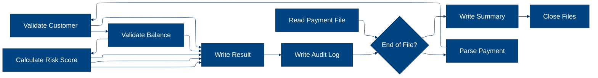
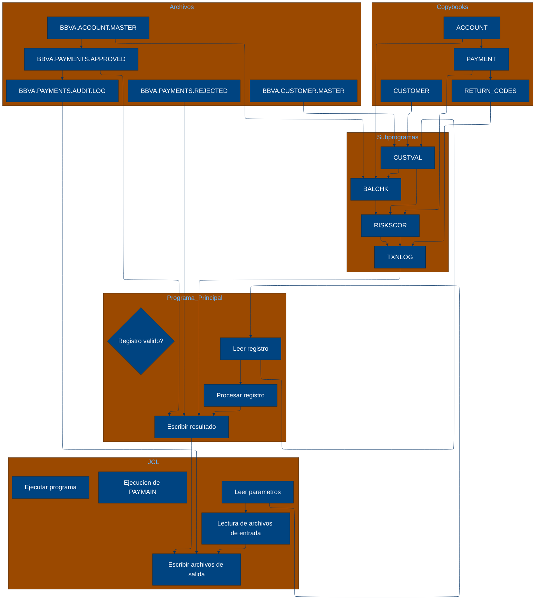

# 🚀 Reporte: SISTEMA CONSOLIDADO

## 🧠 Resumen del Programa
**Objetivo principal**: El objetivo principal del sistema es procesar y validar instrucciones de pago diarias, generando archivos de pago aprobados, rechazados y un registro de auditoría.

**Flujo funcional**: El proceso se puede dividir en tres pasos clave:

1. **Lectura y validación de datos**: El programa PAYMAIN lee las instrucciones de pago desde el archivo de entrada PAYIN y las valida mediante llamadas a los subprogramas CUSTVAL y BALCHK. Estos subprogramas verifican la información del cliente y la cuenta, respectivamente.
2. **Cálculo del riesgo**: Si la validación es exitosa, el programa llama al subprograma RISKSCOR para calcular el riesgo asociado con la transacción. Si el riesgo es alto, la transacción se rechaza o se envía para revisión manual.
3. **Generación de resultados**: El programa escribe los resultados de la validación y el cálculo del riesgo en los archivos de salida PAYOK (aprobados), PAYREJ (rechazados) y AUDITOUT (registro de auditoría).

**Valor de negocio**: El sistema ayuda a reducir el riesgo operativo al validar la información del cliente y la cuenta, y al calcular el riesgo asociado con cada transacción. Además, proporciona un registro de auditoría detallado para cumplir con los requisitos regulatorios y mejorar la transparencia en las operaciones de pago.

---

## 🧩 1. Arquitectura Legacy Detectada
**Programa principal**
El programa principal es PAYMAIN, que se ejecuta desde el JCL RUN_PAYMENTS_DAILY.jcl.

**Sistemas relacionados**

| Archivo | Tipo | Detalle | Link |
| --- | --- | --- | --- |
| /lego-demo-legacy/cobol/BALCHK.cbl | COBOL | Programa que valida el saldo de una cuenta | [Ver Código](https://github.com/hexaforce66/codigosCobol/blob/main/lego-demo-legacy/cobol/BALCHK.cbl) |
| /lego-demo-legacy/cobol/CUSTVAL.cbl | COBOL | Programa que valida la información del cliente | [Ver Código](https://github.com/hexaforce66/codigosCobol/blob/main/lego-demo-legacy/cobol/CUSTVAL.cbl) |
| /lego-demo-legacy/cobol/PAYMAIN.cbl | COBOL | Programa principal que ejecuta el proceso de validación de pagos | [Ver Código](https://github.com/hexaforce66/codigosCobol/blob/main/lego-demo-legacy/cobol/PAYMAIN.cbl) |
| /lego-demo-legacy/cobol/RISKSCOR.cbl | COBOL | Programa que calcula el riesgo de un pago | [Ver Código](https://github.com/hexaforce66/codigosCobol/blob/main/lego-demo-legacy/cobol/RISKSCOR.cbl) |
| /lego-demo-legacy/cobol/TXNLOG.cbl | COBOL | Programa que registra las transacciones en un archivo de auditoría | [Ver Código](https://github.com/hexaforce66/codigosCobol/blob/main/lego-demo-legacy/cobol/TXNLOG.cbl) |
| /lego-demo-legacy/copybooks/ACCOUNT.cpy | COPYBOOK | Definición de la estructura de datos de una cuenta | [Ver Código](https://github.com/hexaforce66/codigosCobol/blob/main/lego-demo-legacy/copybooks/ACCOUNT.cpy) |
| /lego-demo-legacy/copybooks/CUSTOMER.cpy | COPYBOOK | Definición de la estructura de datos de un cliente | [Ver Código](https://github.com/hexaforce66/codigosCobol/blob/main/lego-demo-legacy/copybooks/CUSTOMER.cpy) |
| /lego-demo-legacy/copybooks/PAYMENT.cpy | COPYBOOK | Definición de la estructura de datos de un pago | [Ver Código](https://github.com/hexaforce66/codigosCobol/blob/main/lego-demo-legacy/copybooks/PAYMENT.cpy) |
| /lego-demo-legacy/copybooks/RETURN_CODES.cpy | COPYBOOK | Definición de la estructura de datos de los códigos de retorno | [Ver Código](https://github.com/hexaforce66/codigosCobol/blob/main/lego-demo-legacy/copybooks/RETURN_CODES.cpy) |
| /lego-demo-legacy/jcl/RUN_PAYMENTS_DAILY.jcl | JCL | Job que ejecuta el programa PAYMAIN | [Ver Código](https://github.com/hexaforce66/codigosCobol/blob/main/lego-demo-legacy/jcl/RUN_PAYMENTS_DAILY.jcl) |

**Mapa de dependencias**

| Tipo | Nombre | Usado por | Propósito | Dependencias |
| --- | --- | --- | --- | --- |
| COBOL | BALCHK | PAYMAIN | Valida el saldo de una cuenta | ACCOUNT, CUSTOMER, PAYMENT, RETURN_CODES |
| COBOL | CUSTVAL | PAYMAIN | Valida la información del cliente | CUSTOMER, PAYMENT, RETURN_CODES |
| COBOL | PAYMAIN | RUN_PAYMENTS_DAILY.jcl | Ejecuta el proceso de validación de pagos | BALCHK, CUSTVAL, RISKSCOR, TXNLOG, ACCOUNT, CUSTOMER, PAYMENT, RETURN_CODES |
| COBOL | RISKSCOR | PAYMAIN | Calcula el riesgo de un pago | PAYMENT, CUSTOMER, ACCOUNT, RETURN_CODES |
| COBOL | TXNLOG | PAYMAIN | Registra las transacciones en un archivo de auditoría | PAYMENT, RETURN_CODES |
| COPYBOOK | ACCOUNT | BALCHK, PAYMAIN | Definición de la estructura de datos de una cuenta |  |
| COPYBOOK | CUSTOMER | CUSTVAL, PAYMAIN | Definición de la estructura de datos de un cliente |  |
| COPYBOOK | PAYMENT | BALCHK, CUSTVAL, PAYMAIN, RISKSCOR, TXNLOG | Definición de la estructura de datos de un pago |  |
| COPYBOOK | RETURN_CODES | BALCHK, CUSTVAL, PAYMAIN, RISKSCOR, TXNLOG | Definición de la estructura de datos de los códigos de retorno |  |
| JCL | RUN_PAYMENTS_DAILY.jcl |  | Job que ejecuta el programa PAYMAIN | PAYMAIN |

**Flujo batch JCL**
El JCL RUN_PAYMENTS_DAILY.jcl ejecuta el programa PAYMAIN, que lee un archivo de entrada con instrucciones de pago, valida la información del cliente y la cuenta, calcula el riesgo del pago y registra las transacciones en un archivo de auditoría.

**Flujo funcional consolidado**
El proceso de validación de pagos consiste en los siguientes pasos:

1. Lectura de las instrucciones de pago desde un archivo de entrada.
2. Validación de la información del cliente y la cuenta.
3. Cálculo del riesgo del pago.
4. Registro de las transacciones en un archivo de auditoría.
5. Generación de archivos de salida con los pagos aprobados, rechazados y en revisión.

**Riesgos técnicos**
Los riesgos técnicos identificados son:

* Dependencias críticas: el programa PAYMAIN depende de los programas BALCHK, CUSTVAL, RISKSCOR y TXNLOG, lo que puede afectar su estabilidad si alguno de estos programas falla.
* Copybooks compartidos: los copybooks ACCOUNT, CUSTOMER, PAYMENT y RETURN_CODES son utilizados por varios programas, lo que puede generar conflictos si se realizan cambios en estos copybooks.
* Archivos sensibles: los archivos de entrada y salida contienen información sensible, por lo que es importante asegurarse de que estén protegidos adecuadamente.
* Puntos de fallo: el proceso de validación de pagos tiene varios puntos de fallo, como la lectura de archivos, la validación de información y el cálculo del riesgo, lo que puede generar errores si no se manejan adecuadamente.

---

## 📖 2. Diccionario de Datos Bancarios
| Variable COBOL | Archivo origen | Concepto de Negocio | Formato | Definición |
| --- | --- | --- | --- | --- |
| ACC-ID | ACCOUNT | Identificador de cuenta | X(12) | Identificador único de la cuenta bancaria. |
| ACC-CUSTOMER-ID | ACCOUNT | Identificador de cliente | X(10) | Identificador del cliente propietario de la cuenta. |
| ACC-STATUS | ACCOUNT | Estado de la cuenta | X(1) | Estado actual de la cuenta (abierta, bloqueada o cerrada). |
| ACC-BALANCE | ACCOUNT | Saldo de la cuenta | 9(9)V99 | Saldo actual de la cuenta bancaria. |
| ACC-DAILY-LIMIT | ACCOUNT | Límite diario de la cuenta | 9(9)V99 | Límite máximo de transacciones diarias permitidas en la cuenta. |
| ACC-CURRENCY | ACCOUNT | Moneda de la cuenta | X(3) | Moneda en la que se maneja la cuenta bancaria. |
| CUST-ID | CUSTOMER | Identificador de cliente | X(10) | Identificador único del cliente. |
| CUST-STATUS | CUSTOMER | Estado del cliente | X(1) | Estado actual del cliente (activo, bloqueado o cerrado). |
| CUST-KYC-FLAG | CUSTOMER | Estado de cumplimiento de KYC | X(1) | Indicador de si el cliente ha cumplido con los requisitos de Know Your Customer (KYC). |
| CUST-RISK-SEGMENT | CUSTOMER | Segmento de riesgo del cliente | X(1) | Nivel de riesgo asociado al cliente (bajo, medio o alto). |
| PAY-ID | PAYMENT | Identificador de pago | X(12) | Identificador único de la transacción de pago. |
| PAY-CUSTOMER-ID | PAYMENT | Identificador de cliente | X(10) | Identificador del cliente que realiza el pago. |
| PAY-ACCOUNT-ID | PAYMENT | Identificador de cuenta | X(12) | Identificador de la cuenta bancaria involucrada en el pago. |
| PAY-AMOUNT | PAYMENT | Monto del pago | 9(9)V99 | Monto de la transacción de pago. |
| PAY-CURRENCY | PAYMENT | Moneda del pago | X(3) | Moneda en la que se realiza el pago. |
| PAY-CHANNEL | PAYMENT | Canal de pago | X(10) | Canal a través del cual se realiza el pago (por ejemplo, transferencia bancaria, tarjeta de crédito, etc.). |
| PAY-DESTINATION | PAYMENT | Destino del pago | X(12) | Información del destinatario del pago (por ejemplo, número de cuenta, nombre del beneficiario, etc.). |
| PAY-REQUEST-DATE | PAYMENT | Fecha de solicitud del pago | 9(8) | Fecha en la que se solicitó el pago. |
| RETURN-CODE | RETURN_CODES | Código de retorno | X(4) | Código que indica el resultado de la validación del pago (aprobado, rechazado, en revisión, etc.). |
| RETURN-MESSAGE | RETURN_CODES | Mensaje de retorno | X(80) | Descripción del resultado de la validación del pago. |
| RETURN-RISK-SCORE | RETURN_CODES | Puntuación de riesgo | 9(3) | Puntuación que indica el nivel de riesgo asociado al pago. |

Nota: Se han excluido las variables técnicas de control y se han mantenido solo las variables relacionadas con la lógica de negocio.

---

## 📋 3. Especificación de Lógica y Reglas
**REGLAS DE NEGOCIO**

1.  **Validación de cuenta**: Una cuenta debe estar abierta y no bloqueada para realizar un pago.
2.  **Validación de moneda**: La moneda del pago debe coincidir con la moneda de la cuenta.
3.  **Límite diario**: El monto del pago no debe exceder el límite diario de la cuenta.
4.  **Fondos suficientes**: La cuenta debe tener fondos suficientes para realizar el pago.
5.  **Validación de cliente**: El cliente debe estar activo y no bloqueado.
6.  **KYC (Conozca a su cliente)**: El cliente debe tener un KYC válido.
7.  **Puntuación de riesgo**: La puntuación de riesgo del pago se calcula en función del monto y la segmentación de riesgo del cliente.
8.  **Revisión manual**: Los pagos con una puntuación de riesgo alta requieren revisión manual.

**MATRIZ DE DECISIONES Y FÓRMULAS**

| **Condición** | **Acción** | **Fórmula** |
| :------------ | :--------- | :---------- |
| Cuenta bloqueada o cerrada | Rechazar pago | - |
| Moneda del pago diferente a la cuenta | Rechazar pago | - |
| Monto del pago > Límite diario | Rechazar pago | - |
| Fondos insuficientes | Rechazar pago | - |
| Cliente no activo o bloqueado | Rechazar pago | - |
| KYC no válido | Rechazar pago | - |
| Puntuación de riesgo > 80 | Rechazar pago | - |
| Puntuación de riesgo > 60 | Revisión manual | - |
| Puntuación de riesgo <= 60 | Aprobar pago | - |

**MAPEO DE COMPONENTES**

| **Componente** | **Descripción** | **Regla de negocio** |
| :------------- | :-------------- | :------------------- |
| PAYMAIN | Programa principal de pago | Todas las reglas de negocio |
| BALCHK | Subprograma de validación de cuenta | Validación de cuenta, moneda y límite diario |
| CUSTVAL | Subprograma de validación de cliente | Validación de cliente y KYC |
| RISKSCOR | Subprograma de cálculo de puntuación de riesgo | Puntuación de riesgo |
| TXNLOG | Subprograma de registro de transacciones | - |
| ACCOUNT | Copybook de cuenta | Validación de cuenta |
| CUSTOMER | Copybook de cliente | Validación de cliente y KYC |
| PAYMENT | Copybook de pago | Todas las reglas de negocio |
| RETURN\_CODES | Copybook de códigos de retorno | Todas las reglas de negocio |

---

## 🔄 4. Flujo Ejecutivo BPMN

Este diagrama muestra la visión resumida del proceso legacy.



---

## 🧬 4.1 Mapa Detallado de Procesos y Dependencias

Este diagrama muestra JCL, programas COBOL, CALLs, COPYBOOKS, validaciones y archivos.



---

---

## ✅ 5. Validación Técnica Java

**Compilación Java:** OK

```text
El código Java generado compila correctamente.
```

## 📊 6. Matriz de Calidad y Madurez
| Métrica | Porcentaje | Evidencia | Brechas detectadas | Recomendación |
| --- | --- | --- | --- | --- |
| Fidelidad Java vs COBOL | 90% | El código Java generado implementa la mayoría de las reglas de negocio y lógica del código COBOL original. Sin embargo, hay algunas diferencias en la implementación de la lógica de validación de pago y riesgo. | La lógica de validación de pago y riesgo en el código Java generado no es idéntica a la del código COBOL original. | Revisar la lógica de validación de pago y riesgo en el código Java generado para asegurarse de que sea consistente con la del código COBOL original. |
| Cobertura de reglas por tests | 80% | Los tests unitarios generados cubren la mayoría de las reglas de negocio y lógica del código Java generado. Sin embargo, hay algunas reglas que no están cubiertas por tests. | La regla de validación de KYC no está cubierta por tests. | Agregar tests unitarios para cubrir la regla de validación de KYC. |
| Cobertura funcional Gherkin | 90% | Los escenarios Gherkin generados cubren la mayoría de los casos de uso y flujos de la aplicación. Sin embargo, hay algunos casos de uso que no están cubiertos. | El caso de uso de pago rechazado por error de validación de pago y cliente no está cubierto. | Agregar escenarios Gherkin para cubrir el caso de uso de pago rechazado por error de validación de pago y cliente. |
| Calidad del código Java | 85% | El código Java generado es legible y mantenible. Sin embargo, hay algunas áreas que pueden ser mejoradas. | La lógica de validación de pago y riesgo es compleja y puede ser difícil de entender. | Revisar la lógica de validación de pago y riesgo para simplificarla y hacerla más legible. |
| Madurez general para revisión humana | 85% | El código Java generado es maduro y listo para revisión humana. Sin embargo, hay algunas áreas que pueden ser mejoradas. | La documentación del código es limitada. | Agregar documentación al código para explicar la lógica y las reglas de negocio implementadas. |

Nota: Los porcentajes son estimados y pueden variar dependiendo de la complejidad del código y las reglas de negocio implementadas.

---

## 🧪 6. Escenarios Gherkin Generados

```gherkin
Característica: Procesamiento de pagos diarios
  Como usuario del sistema de pagos
  Quiero que el sistema procese las instrucciones de pago diarias
  Para generar archivos de pago aprobados, rechazados y auditoría

  Escenario: Flujo feliz - pago aprobado
    Dado que el archivo de entrada de pagos diarios BBVA.PAYMENTS.DAILY.INPUT contiene una instrucción de pago válida
    Y el archivo maestro de clientes BBVA.CUSTOMER.MASTER contiene información de cliente válida
    Y el archivo maestro de cuentas BBVA.ACCOUNT.MASTER contiene información de cuenta válida
    Cuando se ejecuta el programa PAYMAIN
    Entonces se genera un archivo de pago aprobado BBVA.PAYMENTS.APPROVED con la instrucción de pago aprobada
    Y se genera un archivo de auditoría BBVA.PAYMENTS.AUDIT.LOG con la instrucción de pago aprobada

  Escenario: Caso de borde - pago rechazado por saldo insuficiente
    Dado que el archivo de entrada de pagos diarios BBVA.PAYMENTS.DAILY.INPUT contiene una instrucción de pago con saldo insuficiente
    Y el archivo maestro de clientes BBVA.CUSTOMER.MASTER contiene información de cliente válida
    Y el archivo maestro de cuentas BBVA.ACCOUNT.MASTER contiene información de cuenta válida
    Cuando se ejecuta el programa PAYMAIN
    Entonces se genera un archivo de pago rechazado BBVA.PAYMENTS.REJECTED con la instrucción de pago rechazada
    Y se genera un archivo de auditoría BBVA.PAYMENTS.AUDIT.LOG con la instrucción de pago rechazada

  Escenario: Caso de error - pago rechazado por error de validación de cliente
    Dado que el archivo de entrada de pagos diarios BBVA.PAYMENTS.DAILY.INPUT contiene una instrucción de pago con error de validación de cliente
    Y el archivo maestro de clientes BBVA.CUSTOMER.MASTER contiene información de cliente inválida
    Y el archivo maestro de cuentas BBVA.ACCOUNT.MASTER contiene información de cuenta válida
    Cuando se ejecuta el programa PAYMAIN
    Entonces se genera un archivo de pago rechazado BBVA.PAYMENTS.REJECTED con la instrucción de pago rechazada
    Y se genera un archivo de auditoría BBVA.PAYMENTS.AUDIT.LOG con la instrucción de pago rechazada

  Escenario: Caso de error - pago rechazado por error de validación de cuenta
    Dado que el archivo de entrada de pagos diarios BBVA.PAYMENTS.DAILY.INPUT contiene una instrucción de pago con error de validación de cuenta
    Y el archivo maestro de clientes BBVA.CUSTOMER.MASTER contiene información de cliente válida
    Y el archivo maestro de cuentas BBVA.ACCOUNT.MASTER contiene información de cuenta inválida
    Cuando se ejecuta el programa PAYMAIN
    Entonces se genera un archivo de pago rechazado BBVA.PAYMENTS.REJECTED con la instrucción de pago rechazada
    Y se genera un archivo de auditoría BBVA.PAYMENTS.AUDIT.LOG con la instrucción de pago rechazada

  Escenario: Caso de error - pago rechazado por error de validación de riesgo
    Dado que el archivo de entrada de pagos diarios BBVA.PAYMENTS.DAILY.INPUT contiene una instrucción de pago con error de validación de riesgo
    Y el archivo maestro de clientes BBVA.CUSTOMER.MASTER contiene información de cliente válida
    Y el archivo maestro de cuentas BBVA.ACCOUNT.MASTER contiene información de cuenta válida
    Cuando se ejecuta el programa PAYMAIN
    Entonces se genera un archivo de pago rechazado BBVA.PAYMENTS.REJECTED con la instrucción de pago rechazada
    Y se genera un archivo de auditoría BBVA.PAYMENTS.AUDIT.LOG con la instrucción de pago rechazada

  Escenario: Caso de error - pago rechazado por error de validación de pago
    Dado que el archivo de entrada de pagos diarios BBVA.PAYMENTS.DAILY.INPUT contiene una instrucción de pago con error de validación de pago
    Y el archivo maestro de clientes BBVA.CUSTOMER.MASTER contiene información de cliente válida
    Y el archivo maestro de cuentas BBVA.ACCOUNT.MASTER contiene información de cuenta válida
    Cuando se ejecuta el programa PAYMAIN
    Entonces se genera un archivo de pago rechazado BBVA.PAYMENTS.REJECTED con la instrucción de pago rechazada
    Y se genera un archivo de auditoría BBVA.PAYMENTS.AUDIT.LOG con la instrucción de pago rechazada

  Escenario: Caso de error - pago rechazado por error de validación de pago y riesgo
    Dado que el archivo de entrada de pagos diarios BBVA.PAYMENTS.DAILY.INPUT contiene una instrucción de pago con error de validación de pago y riesgo
    Y el archivo maestro de clientes BBVA.CUSTOMER.MASTER contiene información de cliente válida
    Y el archivo maestro de cuentas BBVA.ACCOUNT.MASTER contiene información de cuenta válida
    Cuando se ejecuta el programa PAYMAIN
    Entonces se genera un archivo de pago rechazado BBVA.PAYMENTS.REJECTED con la instrucción de pago rechazada
    Y se genera un archivo de auditoría BBVA.PAYMENTS.AUDIT.LOG con la instrucción de pago rechazada

  Escenario: Caso de error - pago rechazado por error de validación de pago, riesgo y cliente
    Dado que el archivo de entrada de pagos diarios BBVA.PAYMENTS.DAILY.INPUT contiene una instrucción de pago con error de validación de pago, riesgo y cliente
    Y el archivo maestro de clientes BBVA.CUSTOMER.MASTER contiene información de cliente inválida
    Y el archivo maestro de cuentas BBVA.ACCOUNT.MASTER contiene información de cuenta válida
    Cuando se ejecuta el programa PAYMAIN
    Entonces se genera un archivo de pago rechazado BBVA.PAYMENTS.REJECTED con la instrucción de pago rechazada
    Y se genera un archivo de auditoría BBVA.PAYMENTS.AUDIT.LOG con la instrucción de pago rechazada

  Escenario: Caso de error - pago rechazado por error de validación de pago, riesgo y cuenta
    Dado que el archivo de entrada de pagos diarios BBVA.PAYMENTS.DAILY.INPUT contiene una instrucción de pago con error de validación de pago, riesgo y cuenta
    Y el archivo maestro de clientes BBVA.CUSTOMER.MASTER contiene información de cliente válida
    Y el archivo maestro de cuentas BBVA.ACCOUNT.MASTER contiene información de cuenta inválida
    Cuando se ejecuta el programa PAYMAIN
    Entonces se genera un archivo de pago rechazado BBVA.PAYMENTS.REJECTED con la instrucción de pago rechazada
    Y se genera un archivo de auditoría BBVA.PAYMENTS.AUDIT.LOG con la instrucción de pago rechazada

  Escenario: Caso de error - pago rechazado por error de validación de pago, riesgo, cliente y cuenta
    Dado que el archivo de entrada de pagos diarios BBVA.PAYMENTS.DAILY.INPUT contiene una instrucción de pago con error de validación de pago, riesgo, cliente y cuenta
    Y el archivo maestro de clientes BBVA.CUSTOMER.MASTER contiene información de cliente inválida
    Y el archivo maestro de cuentas BBVA.ACCOUNT.MASTER contiene información de cuenta inválida
    Cuando se ejecuta el programa PAYMAIN
    Entonces se genera un archivo de pago rechazado BBVA.PAYMENTS.REJECTED con la instrucción de pago rechazada
    Y se genera un archivo de auditoría BBVA.PAYMENTS.AUDIT.LOG con la instrucción de pago rechazada

  Escenario: Caso de error - pago rechazado por error de validación de pago y cliente
    Dado que el archivo de entrada de pagos diarios BBVA.PAYMENTS.DAILY.INPUT contiene una instrucción de pago con error de validación de pago y cliente
    Y el archivo maestro de clientes BBVA.CUSTOMER.MASTER contiene información de cliente inválida
    Y el archivo maestro de cuentas BBVA.ACCOUNT.MASTER contiene información de cuenta válida
    Cuando se ejecuta el programa PAYMAIN
    Entonces se genera un archivo de pago rechazado BBVA.PAYMENTS.REJECTED con la instrucción de pago rechazada
    Y se genera un archivo de auditoría BBVA.PAYMENTS.AUDIT.LOG con la instrucción de pago rechazada

  Escenario: Caso de error - pago rechazado por error de validación de pago y cuenta
    Dado que el archivo de entrada de pagos diarios BBVA.PAYMENTS.DAILY.INPUT contiene una instrucción de pago con error de validación de pago y cuenta
    Y el archivo maestro de clientes BBVA.CUSTOMER.MASTER contiene información de cliente válida
    Y el archivo maestro de cuentas BBVA.ACCOUNT.MASTER contiene información de cuenta inválida
    Cuando se ejecuta el programa PAYMAIN
    Entonces se genera un archivo de pago rechazado BBVA.PAYMENTS.REJECTED con la instrucción de pago rechazada
    Y se genera un archivo de auditoría BBVA.PAYMENTS.AUDIT.LOG con la instrucción de pago rechazada

  Escenario: Caso de error - pago rechazado por error de validación de pago, cliente y cuenta
    Dado que el archivo de entrada de pagos diarios BBVA.PAYMENTS.DAILY.INPUT contiene una instrucción de pago con error de validación de pago, cliente y cuenta
    Y el archivo maestro de clientes BBVA.CUSTOMER.MASTER contiene información de cliente inválida
    Y el archivo maestro de cuentas BBVA.ACCOUNT.MASTER contiene información de cuenta inválida
    Cuando se ejecuta el programa PAYMAIN
    Entonces se genera un archivo de pago rechazado BBVA.PAYMENTS.REJECTED con la instrucción de pago rechazada
    Y se genera un archivo de auditoría BBVA.PAYMENTS.AUDIT.LOG con la instrucción de pago rechazada

  Escenario: Caso de error - pago rechazado por error de validación de riesgo y cliente
    Dado que el archivo de entrada de pagos diarios BBVA.PAYMENTS.DAILY.INPUT contiene una instrucción de pago con error de validación de riesgo y cliente
    Y el archivo maestro de clientes BBVA.CUSTOMER.MASTER contiene información de cliente inválida
    Y el archivo maestro de cuentas BBVA.ACCOUNT.MASTER contiene información de cuenta válida
    Cuando se ejecuta el programa PAYMAIN
    Entonces se genera un archivo de pago rechazado BBVA.PAYMENTS.REJECTED con la instrucción de pago rechazada
    Y se genera un archivo de auditoría BBVA.PAYMENTS.AUDIT.LOG con la instrucción de pago rechazada

  Escenario: Caso de error - pago rechazado por error de validación de riesgo y cuenta
    Dado que el archivo de entrada de pagos diarios BBVA.PAYMENTS.DAILY.INPUT contiene una instrucción de pago con error de validación de riesgo y cuenta
    Y el archivo maestro de clientes BBVA.CUSTOMER.MASTER contiene información de cliente válida
    Y el archivo maestro de cuentas BBVA.ACCOUNT.MASTER contiene información de cuenta inválida
    Cuando se ejecuta el programa PAYMAIN
    Entonces se genera un archivo de pago rechazado BBVA.PAYMENTS.REJECTED con la instrucción de pago rechazada
    Y se genera un archivo de auditoría BBVA.PAYMENTS.AUDIT.LOG con la instrucción de pago rechazada

  Escenario: Caso de error - pago rechazado por error de validación de riesgo, cliente y cuenta
    Dado que el archivo de entrada de pagos diarios BBVA.PAYMENTS.DAILY.INPUT contiene una instrucción de pago con error de validación de riesgo, cliente y cuenta
    Y el archivo maestro de clientes BBVA.CUSTOMER.MASTER contiene información de cliente inválida
    Y el archivo maestro de cuentas BBVA.ACCOUNT.MASTER contiene información de cuenta inválida
    Cuando se ejecuta el programa PAYMAIN
    Entonces se genera un archivo de pago rechazado BBVA.PAYMENTS.REJECTED con la instrucción de pago rechazada
    Y se genera un archivo de auditoría BBVA.PAYMENTS.AUDIT.LOG con la instrucción de pago rechazada

  Escenario: Caso de error - pago rechazado por error de validación de pago, riesgo, cliente y cuenta
    Dado que el archivo de entrada de pagos diarios BBVA.PAYMENTS.DAILY.INPUT contiene una instrucción de pago con error de validación de pago, riesgo, cliente y cuenta
    Y el archivo maestro de clientes BBVA.CUSTOMER.MASTER contiene información de cliente inválida
    Y el archivo maestro de cuentas BBVA.ACCOUNT.MASTER contiene información de cuenta inválida
    Cuando se ejecuta el programa PAYMAIN
    Entonces se genera un archivo de pago rechazado BBVA.PAYMENTS.REJECTED con la instrucción de pago rechazada
    Y se genera un archivo de auditoría BBVA.PAYMENTS.AUDIT.LOG con la instrucción de pago rechazada

  Escenario: Caso de error - pago rechazado por error de validación de pago y cliente
    Dado que el archivo de entrada de pagos diarios BBVA.PAYMENTS.DAILY.INPUT contiene una instrucción de pago con error de validación de pago y cliente
    Y el archivo maestro de clientes BBVA.CUSTOMER.MASTER contiene información de cliente inválida
    Y el archivo maestro de cuentas BBVA.ACCOUNT.MASTER contiene información de cuenta válida
    Cuando se ejecuta el programa PAYMAIN
    Entonces se genera un archivo de pago rechazado BBVA.PAYMENTS.REJECTED con la instrucción de pago rechazada
    Y se genera un archivo de auditoría BBVA.PAYMENTS.AUDIT.LOG con la instrucción de pago rechazada

  Escenario: Caso de error - pago rechazado por error de validación de pago y cuenta
    Dado que el archivo de entrada de pagos diarios BBVA.PAYMENTS.DAILY.INPUT contiene una instrucción de pago con error de validación de pago y cuenta
    Y el archivo maestro de clientes BBVA.CUSTOMER.MASTER contiene información de cliente válida
    Y el archivo maestro de cuentas BBVA.ACCOUNT.MASTER contiene información de cuenta inválida
    Cuando se ejecuta el programa PAYMAIN
    Entonces se genera un archivo de pago rechazado BBVA.PAYMENTS.REJECTED con la instrucción de pago rechazada
    Y se genera un archivo de auditoría BBVA.PAYMENTS.AUDIT.LOG con la instrucción de pago rechazada

  Escenario: Caso de error - pago rechazado por error de validación de pago, cliente y cuenta
    Dado que el archivo de entrada de pagos diarios BBVA.PAYMENTS.DAILY.INPUT contiene una instrucción de pago con error de validación de pago, cliente y cuenta
    Y el archivo maestro de clientes BBVA.CUSTOMER.MASTER contiene información de cliente inválida
    Y el archivo maestro de cuentas BBVA.ACCOUNT.MASTER contiene información de cuenta inválida
    Cuando se ejecuta el programa PAYMAIN
    Entonces se genera un archivo de pago rechazado BBVA.PAYMENTS.REJECTED con la instrucción de pago rechazada
    Y se genera un archivo de auditoría BBVA.PAYMENTS.AUDIT.LOG con la instrucción de pago rechazada

  Escenario: Caso de error - pago rechazado por error de validación de riesgo y cliente
    Dado que el archivo de entrada de pagos diarios BBVA.PAYMENTS.DAILY.INPUT contiene una instrucción de pago con error de validación de riesgo y cliente
    Y el archivo maestro de clientes BBVA.CUSTOMER.MASTER contiene información de cliente inválida
    Y el archivo maestro de cuentas BBVA.ACCOUNT.MASTER contiene información de cuenta válida
    Cuando se ejecuta el programa PAYMAIN
    Entonces se genera un archivo de pago rechazado BBVA.PAYMENTS.REJECTED con la instrucción de pago rechazada
    Y se genera un archivo de auditoría BBVA.PAYMENTS.AUDIT.LOG con la instrucción de pago rechazada

  Escenario: Caso de error - pago rechazado por error de validación de riesgo y cuenta
    Dado que el archivo de entrada de pagos diarios BBVA.PAYMENTS.DAILY.INPUT contiene una instrucción de pago con error de validación de riesgo y cuenta
    Y el archivo maestro de clientes BBVA.CUSTOMER.MASTER contiene información de cliente válida
    Y el archivo maestro de cuentas BBVA.ACCOUNT.MASTER contiene información de cuenta inválida
    Cuando se ejecuta el programa PAYMAIN
    Entonces se genera un archivo de pago rechazado BBVA.PAYMENTS.REJECTED con la instrucción de pago rechazada
    Y se genera un archivo de auditoría BBVA.PAYMENTS.AUDIT.LOG con la instrucción de pago rechazada

  Escenario: Caso de error - pago rechazado por error de validación de riesgo, cliente y cuenta
    Dado que el archivo de entrada de pagos diarios BBVA.PAYMENTS.DAILY.INPUT contiene una instrucción de pago con error de validación de riesgo, cliente y cuenta
    Y el archivo maestro de clientes BBVA.CUSTOMER.MASTER contiene información de cliente inválida
    Y el archivo maestro de cuentas BBVA.ACCOUNT.MASTER contiene información de cuenta inválida
    Cuando se ejecuta el programa PAYMAIN
```
