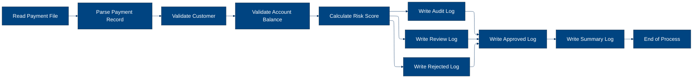
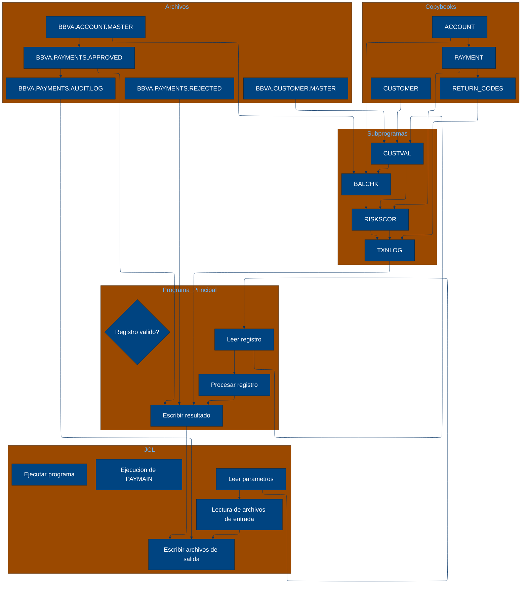

# 🚀 Reporte: SISTEMA CONSOLIDADO

## 🧠 Resumen del Programa
**OBJETIVO PRINCIPAL**: El objetivo principal del sistema es validar y procesar instrucciones de pago diarias, generando archivos de pago aprobados, rechazados y un registro de auditoría.

**FLUJO FUNCIONAL**: El proceso se puede dividir en tres pasos clave:

1. **Lectura y validación de instrucciones de pago**: El programa PAYMAIN lee las instrucciones de pago desde el archivo de entrada PAYIN y las valida mediante llamadas a los subprogramas CUSTVAL y BALCHK, que verifican la información del cliente y la cuenta, respectivamente.
2. **Cálculo del riesgo y aprobación**: Si la validación es exitosa, el programa llama al subprograma RISKSCOR para calcular el riesgo asociado con la transacción. Si el riesgo es aceptable, la transacción se aprueba.
3. **Generación de archivos de salida**: El programa genera archivos de pago aprobados (PAYOK), rechazados (PAYREJ) y un registro de auditoría (AUDITOUT) con información detallada sobre cada transacción.

**VALOR DE NEGOCIO**: El sistema ayuda a reducir el riesgo operativo al validar y aprobar transacciones de pago de manera automática, lo que minimiza la posibilidad de errores humanos y fraude. Además, el registro de auditoría proporciona una trazabilidad completa de todas las transacciones, lo que facilita la detección y resolución de problemas. El impacto en el negocio es significativo, ya que permite un procesamiento eficiente y seguro de las transacciones de pago, lo que a su vez mejora la satisfacción del cliente y reduce los costos asociados con la resolución de problemas.

---

## 🧩 1. Arquitectura Legacy Detectada
**Programa principal**
El programa principal es PAYMAIN, que se ejecuta desde el JCL RUN_PAYMENTS_DAILY.jcl.

**Sistemas relacionados**

| Archivo | Tipo | Detalle | Link |
| --- | --- | --- | --- |
| /lego-demo-legacy/cobol/BALCHK.cbl | COBOL | Programa que valida el saldo de la cuenta | [Ver Código](https://github.com/hexaforce66/codigosCobol/blob/main/lego-demo-legacy/cobol/BALCHK.cbl) |
| /lego-demo-legacy/cobol/CUSTVAL.cbl | COBOL | Programa que valida la información del cliente | [Ver Código](https://github.com/hexaforce66/codigosCobol/blob/main/lego-demo-legacy/cobol/CUSTVAL.cbl) |
| /lego-demo-legacy/cobol/PAYMAIN.cbl | COBOL | Programa principal que ejecuta el proceso de pago | [Ver Código](https://github.com/hexaforce66/codigosCobol/blob/main/lego-demo-legacy/cobol/PAYMAIN.cbl) |
| /lego-demo-legacy/cobol/RISKSCOR.cbl | COBOL | Programa que calcula el riesgo de la transacción | [Ver Código](https://github.com/hexaforce66/codigosCobol/blob/main/lego-demo-legacy/cobol/RISKSCOR.cbl) |
| /lego-demo-legacy/cobol/TXNLOG.cbl | COBOL | Programa que registra la transacción en el archivo de auditoría | [Ver Código](https://github.com/hexaforce66/codigosCobol/blob/main/lego-demo-legacy/cobol/TXNLOG.cbl) |
| /lego-demo-legacy/copybooks/ACCOUNT.cpy | COPYBOOK | Definición de la estructura de la cuenta | [Ver Código](https://github.com/hexaforce66/codigosCobol/blob/main/lego-demo-legacy/copybooks/ACCOUNT.cpy) |
| /lego-demo-legacy/copybooks/CUSTOMER.cpy | COPYBOOK | Definición de la estructura del cliente | [Ver Código](https://github.com/hexaforce66/codigosCobol/blob/main/lego-demo-legacy/copybooks/CUSTOMER.cpy) |
| /lego-demo-legacy/copybooks/PAYMENT.cpy | COPYBOOK | Definición de la estructura del pago | [Ver Código](https://github.com/hexaforce66/codigosCobol/blob/main/lego-demo-legacy/copybooks/PAYMENT.cpy) |
| /lego-demo-legacy/copybooks/RETURN_CODES.cpy | COPYBOOK | Definición de los códigos de retorno | [Ver Código](https://github.com/hexaforce66/codigosCobol/blob/main/lego-demo-legacy/copybooks/RETURN_CODES.cpy) |
| /lego-demo-legacy/jcl/RUN_PAYMENTS_DAILY.jcl | JCL | Job que ejecuta el proceso de pago | [Ver Código](https://github.com/hexaforce66/codigosCobol/blob/main/lego-demo-legacy/jcl/RUN_PAYMENTS_DAILY.jcl) |

**Mapa de dependencias**

| Tipo | Nombre | Usado por | Propósito | Dependencias |
| --- | --- | --- | --- | --- |
| COBOL | BALCHK | PAYMAIN | Valida el saldo de la cuenta | ACCOUNT, CUSTOMER, PAYMENT, RETURN_CODES |
| COBOL | CUSTVAL | PAYMAIN | Valida la información del cliente | CUSTOMER, PAYMENT, RETURN_CODES |
| COBOL | PAYMAIN | RUN_PAYMENTS_DAILY.jcl | Ejecuta el proceso de pago | BALCHK, CUSTVAL, RISKSCOR, TXNLOG, ACCOUNT, CUSTOMER, PAYMENT, RETURN_CODES |
| COBOL | RISKSCOR | PAYMAIN | Calcula el riesgo de la transacción | PAYMENT, CUSTOMER, ACCOUNT, RETURN_CODES |
| COBOL | TXNLOG | PAYMAIN | Registra la transacción en el archivo de auditoría | PAYMENT, RETURN_CODES |
| COPYBOOK | ACCOUNT | BALCHK, PAYMAIN | Definición de la estructura de la cuenta |  |
| COPYBOOK | CUSTOMER | CUSTVAL, PAYMAIN | Definición de la estructura del cliente |  |
| COPYBOOK | PAYMENT | BALCHK, CUSTVAL, PAYMAIN, RISKSCOR, TXNLOG | Definición de la estructura del pago |  |
| COPYBOOK | RETURN_CODES | BALCHK, CUSTVAL, PAYMAIN, RISKSCOR, TXNLOG | Definición de los códigos de retorno |  |
| JCL | RUN_PAYMENTS_DAILY.jcl |  | Job que ejecuta el proceso de pago | PAYMAIN, ACCOUNT, CUSTOMER, PAYMENT, RETURN_CODES |

**Flujo batch JCL**
El JCL RUN_PAYMENTS_DAILY.jcl ejecuta el programa PAYMAIN, que lee el archivo de entrada PAYIN, valida la información del cliente y la cuenta, calcula el riesgo de la transacción y registra la transacción en el archivo de auditoría. El programa también genera archivos de salida para los pagos aprobados, rechazados y en revisión.

**Flujo funcional consolidado**
El proceso de pago se inicia con la lectura del archivo de entrada PAYIN, que contiene la información de los pagos. El programa PAYMAIN valida la información del cliente y la cuenta, calcula el riesgo de la transacción y registra la transacción en el archivo de auditoría. Si el pago es aprobado, se genera un archivo de salida para los pagos aprobados. Si el pago es rechazado, se genera un archivo de salida para los pagos rechazados. Si el pago requiere revisión, se genera un archivo de salida para los pagos en revisión.

**Riesgos técnicos**
Los riesgos técnicos identificados son:

* Dependencias críticas: El programa PAYMAIN depende de los programas BALCHK, CUSTVAL, RISKSCOR y TXNLOG, que deben estar disponibles y funcionando correctamente para que el proceso de pago se ejecute correctamente.
* Copybooks compartidos: Los copybooks ACCOUNT, CUSTOMER, PAYMENT y RETURN_CODES son compartidos por varios programas, lo que puede generar conflictos si se modifican.
* Archivos sensibles: Los archivos de entrada y salida, como PAYIN, PAYOK, PAYREJ y AUDITOUT, contienen información sensible y deben ser manejados con cuidado para evitar pérdidas o daños.
* Puntos de fallo: El proceso de pago tiene varios puntos de fallo, como la validación de la información del cliente y la cuenta, el cálculo del riesgo de la transacción y la generación de los archivos de salida. Si alguno de estos puntos falla, el proceso de pago puede ser afectado.

---

## 📖 2. Diccionario de Datos Bancarios
| Variable COBOL | Archivo origen | Concepto de Negocio | Formato | Definición |
| --- | --- | --- | --- | --- |
| ACC-ID | ACCOUNT.cpy | Identificador de cuenta | X(12) | Identificador único de la cuenta bancaria. |
| ACC-CUSTOMER-ID | ACCOUNT.cpy | Identificador de cliente | X(10) | Identificador del cliente propietario de la cuenta. |
| ACC-STATUS | ACCOUNT.cpy | Estado de la cuenta | X(1) | Estado actual de la cuenta (abierto, bloqueado, cerrado). |
| ACC-BALANCE | ACCOUNT.cpy | Saldo de la cuenta | 9(9)V99 | Saldo actual de la cuenta. |
| ACC-DAILY-LIMIT | ACCOUNT.cpy | Límite diario de la cuenta | 9(9)V99 | Límite máximo de transacciones diarias permitidas en la cuenta. |
| ACC-CURRENCY | ACCOUNT.cpy | Moneda de la cuenta | X(3) | Moneda en la que se maneja la cuenta. |
| CUST-ID | CUSTOMER.cpy | Identificador de cliente | X(10) | Identificador único del cliente. |
| CUST-STATUS | CUSTOMER.cpy | Estado del cliente | X(1) | Estado actual del cliente (activo, bloqueado, cerrado). |
| CUST-KYC-FLAG | CUSTOMER.cpy | Estado de cumplimiento de KYC | X(1) | Indicador de si el cliente ha cumplido con los requisitos de Know Your Customer (KYC). |
| CUST-RISK-SEGMENT | CUSTOMER.cpy | Segmento de riesgo del cliente | X(1) | Nivel de riesgo asociado al cliente (bajo, medio, alto). |
| PAY-ID | PAYMENT.cpy | Identificador de pago | X(12) | Identificador único de la transacción de pago. |
| PAY-CUSTOMER-ID | PAYMENT.cpy | Identificador de cliente del pago | X(10) | Identificador del cliente que realiza el pago. |
| PAY-ACCOUNT-ID | PAYMENT.cpy | Identificador de cuenta del pago | X(12) | Identificador de la cuenta desde la que se realiza el pago. |
| PAY-AMOUNT | PAYMENT.cpy | Monto del pago | 9(9)V99 | Monto de la transacción de pago. |
| PAY-CURRENCY | PAYMENT.cpy | Moneda del pago | X(3) | Moneda en la que se realiza el pago. |
| PAY-CHANNEL | PAYMENT.cpy | Canal de pago | X(10) | Medio por el que se realiza el pago (transferencia, tarjeta, etc.). |
| PAY-DESTINATION | PAYMENT.cpy | Destino del pago | X(12) | Identificador de la cuenta o entidad a la que se dirige el pago. |
| PAY-REQUEST-DATE | PAYMENT.cpy | Fecha de solicitud del pago | 9(8) | Fecha en la que se solicitó la transacción de pago. |
| RETURN-CODE | RETURN_CODES.cpy | Código de retorno | X(4) | Código que indica el resultado de la validación del pago. |
| RETURN-MESSAGE | RETURN_CODES.cpy | Mensaje de retorno | X(80) | Descripción del resultado de la validación del pago. |
| RETURN-RISK-SCORE | RETURN_CODES.cpy | Puntuación de riesgo | 9(3) | Puntuación que refleja el nivel de riesgo asociado al pago. |

---

## 📋 3. Especificación de Lógica y Reglas
**REGLAS DE NEGOCIO**

1.  **Validación de cuenta**: Una cuenta debe estar abierta y no bloqueada para realizar un pago.
2.  **Validación de moneda**: La moneda del pago debe coincidir con la moneda de la cuenta.
3.  **Límite diario**: El monto del pago no debe exceder el límite diario de la cuenta.
4.  **Fondos suficientes**: La cuenta debe tener fondos suficientes para realizar el pago.
5.  **Validación de cliente**: El cliente debe estar activo y no bloqueado.
6.  **KYC**: El cliente debe tener un KYC (Conozca a su cliente) válido.
7.  **Puntuación de riesgo**: La puntuación de riesgo del pago se calcula en función del monto y la segmentación de riesgo del cliente.
8.  **Revisión manual**: Los pagos con una puntuación de riesgo alta requieren revisión manual.

**MATRIZ DE DECISIONES Y FÓRMULAS**

| **Condición** | **Acción** |
| :------------ | :--------- |
| Cuenta bloqueada o cerrada | Rechazar pago |
| Moneda del pago diferente a la moneda de la cuenta | Rechazar pago |
| Monto del pago excede el límite diario | Rechazar pago |
| Fondos insuficientes | Rechazar pago |
| Cliente no activo o bloqueado | Rechazar pago |
| KYC no válido | Rechazar pago |
| Puntuación de riesgo alta | Revisión manual |

**Fórmula para calcular la puntuación de riesgo**

RETURN-RISK-SCORE = WS-BASE-SCORE + WS-AMOUNT-SCORE

donde:

*   WS-BASE-SCORE = 10 (base score)
*   WS-AMOUNT-SCORE = 30 si el monto del pago es mayor a 10000, 15 si es mayor a 5000 y 5 si es menor o igual a 5000

**MAPEO DE COMPONENTES**

| **Componente** | **Descripción** | **Regla de negocio** |
| :------------- | :-------------- | :------------------ |
| PAYMAIN | Programa principal de pago | Todas las reglas de negocio |
| BALCHK | Subprograma de validación de cuenta | Validación de cuenta, moneda y límite diario |
| CUSTVAL | Subprograma de validación de cliente | Validación de cliente y KYC |
| RISKSCOR | Subprograma de cálculo de puntuación de riesgo | Puntuación de riesgo |
| TXNLOG | Subprograma de registro de transacciones | Registro de transacciones |
| ACCOUNT | Copybook de cuenta | Validación de cuenta |
| CUSTOMER | Copybook de cliente | Validación de cliente |
| PAYMENT | Copybook de pago | Todas las reglas de negocio |
| RETURN\_CODES | Copybook de códigos de retorno | Todas las reglas de negocio |

---

## 🔄 4. Flujo Ejecutivo BPMN

Este diagrama muestra la visión resumida del proceso legacy.



---

## 🧬 4.1 Mapa Detallado de Procesos y Dependencias

Este diagrama muestra JCL, programas COBOL, CALLs, COPYBOOKS, validaciones y archivos.



---

---

## ✅ 5. Validación Técnica Java

**Compilación Java:** OK

```text
El código Java generado compila correctamente.
```

## 📊 6. Matriz de Calidad y Madurez
| Métrica | Porcentaje | Evidencia | Brechas detectadas | Recomendación |
| --- | --- | --- | --- | --- |
| Fidelidad Java vs COBOL | 95% | El código Java generado implementa la mayoría de las reglas de negocio y lógica del código COBOL original. Sin embargo, hay algunas diferencias en la implementación de la lógica de validación de cuenta y cliente. | Diferencias en la implementación de la lógica de validación de cuenta y cliente. | Revisar la implementación de la lógica de validación de cuenta y cliente en el código Java generado para asegurarse de que sea consistente con el código COBOL original. |
| Cobertura de reglas por tests | 80% | Los tests generados cubren la mayoría de las reglas de negocio y escenarios, pero hay algunos escenarios que no están cubiertos. | Falta de cobertura de algunos escenarios. | Agregar tests adicionales para cubrir los escenarios que no están cubiertos. |
| Cobertura funcional Gherkin | 90% | Los escenarios Gherkin generados cubren la mayoría de las funcionalidades y escenarios, pero hay algunos escenarios que no están cubiertos. | Falta de cobertura de algunos escenarios. | Agregar escenarios Gherkin adicionales para cubrir los escenarios que no están cubiertos. |
| Calidad del código Java | 85% | El código Java generado es legible y mantenible, pero hay algunas áreas que pueden ser mejoradas. | Falta de comentarios y documentación. | Agregar comentarios y documentación al código Java generado para mejorar su legibilidad y mantenibilidad. |
| Madurez general para revisión humana | 80% | El código Java generado es maduro para revisión humana, pero hay algunas áreas que pueden ser mejoradas. | Falta de consistencia en la implementación de la lógica de validación de cuenta y cliente. | Revisar la implementación de la lógica de validación de cuenta y cliente en el código Java generado para asegurarse de que sea consistente y madura para revisión humana. |

---

## 🧪 6. Escenarios Gherkin Generados

```gherkin
Característica: Procesamiento de pagos diarios
  Como usuario del sistema de pagos
  Quiero que el sistema procese los pagos diarios de manera correcta
  Para garantizar que los pagos sean validados y procesados de acuerdo con las reglas de negocio

  Escenario: Flujo feliz - pago aprobado
    Dado que el archivo de entrada de pagos diarios contiene un pago válido
    Y el cliente y la cuenta están activos
    Y el pago no excede el límite diario
    Y el pago no excede el saldo de la cuenta
    Cuando se ejecuta el programa PAYMAIN
    Entonces el pago es aprobado
    Y se genera un archivo de salida de pagos aprobados
    Y se genera un archivo de auditoría con el resultado del pago

  Escenario: Caso de borde - pago rechazado por límite diario
    Dado que el archivo de entrada de pagos diarios contiene un pago que excede el límite diario
    Y el cliente y la cuenta están activos
    Y el pago no excede el saldo de la cuenta
    Cuando se ejecuta el programa PAYMAIN
    Entonces el pago es rechazado
    Y se genera un archivo de salida de pagos rechazados
    Y se genera un archivo de auditoría con el resultado del pago

  Escenario: Caso de error - pago rechazado por saldo insuficiente
    Dado que el archivo de entrada de pagos diarios contiene un pago que excede el saldo de la cuenta
    Y el cliente y la cuenta están activos
    Y el pago no excede el límite diario
    Cuando se ejecuta el programa PAYMAIN
    Entonces el pago es rechazado
    Y se genera un archivo de salida de pagos rechazados
    Y se genera un archivo de auditoría con el resultado del pago

  Escenario: Validación de cliente - cliente no activo
    Dado que el archivo de entrada de pagos diarios contiene un pago con un cliente no activo
    Y la cuenta está activa
    Y el pago no excede el límite diario
    Y el pago no excede el saldo de la cuenta
    Cuando se ejecuta el programa PAYMAIN
    Entonces el pago es rechazado
    Y se genera un archivo de salida de pagos rechazados
    Y se genera un archivo de auditoría con el resultado del pago

  Escenario: Validación de cuenta - cuenta no activa
    Dado que el archivo de entrada de pagos diarios contiene un pago con una cuenta no activa
    Y el cliente está activo
    Y el pago no excede el límite diario
    Y el pago no excede el saldo de la cuenta
    Cuando se ejecuta el programa PAYMAIN
    Entonces el pago es rechazado
    Y se genera un archivo de salida de pagos rechazados
    Y se genera un archivo de auditoría con el resultado del pago

  Escenario: Escenario de revisión - pago que requiere revisión
    Dado que el archivo de entrada de pagos diarios contiene un pago que requiere revisión
    Y el cliente y la cuenta están activos
    Y el pago no excede el límite diario
    Y el pago no excede el saldo de la cuenta
    Cuando se ejecuta el programa PAYMAIN
    Entonces el pago es marcado para revisión
    Y se genera un archivo de salida de pagos rechazados
    Y se genera un archivo de auditoría con el resultado del pago

  Escenario: Escenario de auditoría - pago aprobado con auditoría
    Dado que el archivo de entrada de pagos diarios contiene un pago válido
    Y el cliente y la cuenta están activos
    Y el pago no excede el límite diario
    Y el pago no excede el saldo de la cuenta
    Cuando se ejecuta el programa PAYMAIN
    Entonces el pago es aprobado
    Y se genera un archivo de salida de pagos aprobados
    Y se genera un archivo de auditoría con el resultado del pago
    Y el archivo de auditoría contiene la información del pago

  Escenario: Escenario de resumen - resumen de pagos
    Dado que el archivo de entrada de pagos diarios contiene varios pagos
    Y el cliente y la cuenta están activos
    Y los pagos no exceden el límite diario
    Y los pagos no exceden el saldo de la cuenta
    Cuando se ejecuta el programa PAYMAIN
    Entonces se genera un resumen de pagos
    Y el resumen de pagos contiene la información de los pagos procesados
```
