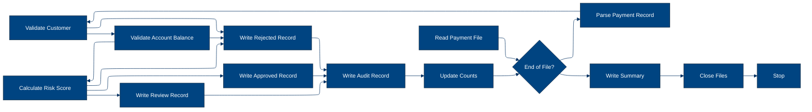
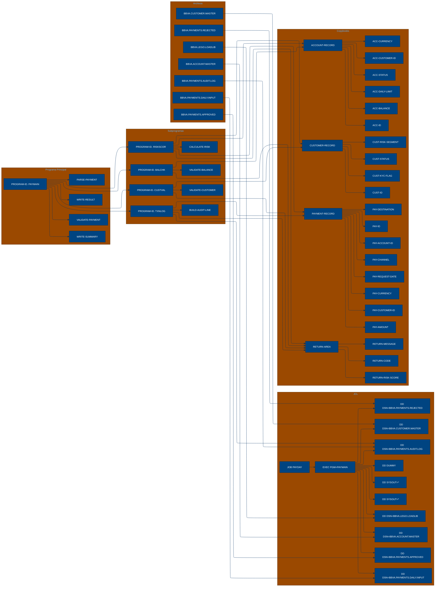

# 🚀 Reporte: SISTEMA CONSOLIDADO

## 🧠 Resumen del Programa
**OBJETIVO PRINCIPAL**: El objetivo principal del sistema es validar y procesar instrucciones de pago diarias, generando archivos de pago aprobados, rechazados y de auditoría.

**FLUJO FUNCIONAL**: El proceso se puede dividir en tres pasos clave:

1.  **Lectura y validación de instrucciones de pago**: El programa `PAYMAIN` lee las instrucciones de pago desde el archivo `PAYIN-FILE` y las valida mediante llamadas a los subprogramas `CUSTVAL`, `BALCHK` y `RISKSCOR`. Estos subprogramas verifican la información del cliente, la cuenta y el riesgo asociado con cada pago.
2.  **Procesamiento de pagos**: Después de la validación, el programa `PAYMAIN` procesa cada pago, actualizando los contadores de pagos aprobados, rechazados y en revisión, así como el monto total de pagos procesados.
3.  **Generación de archivos de salida**: Finalmente, el programa `PAYMAIN` genera los archivos de pago aprobados (`PAYOK-FILE`), rechazados (`PAYREJ-FILE`) y de auditoría (`AUDIT-FILE`), que contienen la información procesada y los resultados de la validación.

**VALOR DE NEGOCIO**: El sistema legacy de pago diario es crítico para el banco, ya que permite procesar y validar grandes cantidades de instrucciones de pago de manera eficiente y segura. El riesgo operativo asociado con este sistema es alto, ya que cualquier error o falla en el proceso podría resultar en pérdidas financieras significativas o daños a la reputación del banco. Por lo tanto, es fundamental mantener y mejorar este sistema para garantizar su estabilidad y seguridad.

---

## 🧩 1. Arquitectura Legacy Detectada
**Programa principal**

El programa principal es PAYMAIN, que se ejecuta desde el JCL RUN_PAYMENTS_DAILY.

**Sistemas relacionados**

| Archivo | Tipo | Detalle | Link |
| --- | --- | --- | --- |
| ./lego-demo-legacy/cobol/BALCHK.cbl | COBOL | Programa que valida el saldo de la cuenta | [Ver Código](https://github.com/hexaforce66/codigosCobol/blob/main/cobol/BALCHK.cbl) |
| ./lego-demo-legacy/cobol/CUSTVAL.cbl | Programa | Programa que valida la información del cliente | [Ver Código](https://github.com/hexaforce66/codigosCobol/blob/main/cobol/CUSTVAL.cbl) |
| ./lego-demo-legacy/cobol/PAYMAIN.cbl | Programa | Programa principal que ejecuta la validación de pagos | [Ver Código](https://github.com/hexaforce66/codigosCobol/blob/main/cobol/PAYMAIN.cbl) |
| ./lego-demo-legacy/cobol/RISKSCOR.cbl | Programa | Programa que calcula el riesgo de la transacción | [Ver Código](https://github.com/hexaforce66/codigosCobol/blob/main/cobol/RISKSCOR.cbl) |
| ./lego-demo-legacy/cobol/TXNLOG.cbl | Programa | Programa que registra la transacción en el archivo de auditoría | [Ver Código](https://github.com/hexaforce66/codigosCobol/blob/main/cobol/TXNLOG.cbl) |
| ./lego-demo-legacy/copybooks/ACCOUNT.cpy | Copybook | Estructura de datos para la cuenta | [Ver Código](https://github.com/hexaforce66/codigosCobol/blob/main/copybooks/ACCOUNT.cpy) |
| ./lego-demo-legacy/copybooks/CUSTOMER.cpy | Copybook | Estructura de datos para el cliente | [Ver Código](https://github.com/hexaforce66/codigosCobol/blob/main/copybooks/CUSTOMER.cpy) |
| ./lego-demo-legacy/copybooks/PAYMENT.cpy | Copybook | Estructura de datos para el pago | [Ver Código](https://github.com/hexaforce66/codigosCobol/blob/main/copybooks/PAYMENT.cpy) |
| ./lego-demo-legacy/copybooks/RETURN_CODES.cpy | Copybook | Estructura de datos para los códigos de retorno | [Ver Código](https://github.com/hexaforce66/codigosCobol/blob/main/copybooks/RETURN_CODES.cpy) |
| ./lego-demo-legacy/jcl/RUN_PAYMENTS_DAILY.jcl | JCL | Job que ejecuta el programa PAYMAIN | [Ver Código](https://github.com/hexaforce66/codigosCobol/blob/main/jcl/RUN_PAYMENTS_DAILY.jcl) |

**Mapa de dependencias**

| Tipo | Nombre | Usado por | Propósito | Dependencias |
| --- | --- | --- | --- | --- |
| Programa | BALCHK | PAYMAIN | Validar saldo de la cuenta | ACCOUNT, RETURN_CODES |
| Programa | CUSTVAL | PAYMAIN | Validar información del cliente | CUSTOMER, RETURN_CODES |
| Programa | PAYMAIN | RUN_PAYMENTS_DAILY | Ejecutar validación de pagos | BALCHK, CUSTVAL, RISKSCOR, TXNLOG, PAYMENT, CUSTOMER, ACCOUNT, RETURN_CODES |
| Programa | RISKSCOR | PAYMAIN | Calcular riesgo de la transacción | PAYMENT, CUSTOMER, ACCOUNT, RETURN_CODES |
| Programa | TXNLOG | PAYMAIN | Registrar transacción en archivo de auditoría | PAYMENT, RETURN_CODES |
| Copybook | ACCOUNT | BALCHK, PAYMAIN | Estructura de datos para la cuenta |  |
| Copybook | CUSTOMER | CUSTVAL, PAYMAIN | Estructura de datos para el cliente |  |
| Copybook | PAYMENT | PAYMAIN, RISKSCOR, TXNLOG | Estructura de datos para el pago |  |
| Copybook | RETURN_CODES | BALCHK, CUSTVAL, PAYMAIN, RISKSCOR, TXNLOG | Estructura de datos para los códigos de retorno |  |
| JCL | RUN_PAYMENTS_DAILY |  | Job que ejecuta el programa PAYMAIN | PAYMAIN, PAYIN, CUSTIN, ACCTIN, PAYOK, PAYREJ, AUDITOUT |

**Flujo batch JCL**

El JCL RUN_PAYMENTS_DAILY ejecuta el programa PAYMAIN, que lee los archivos de entrada PAYIN, CUSTIN y ACCTIN, y escribe los archivos de salida PAYOK, PAYREJ y AUDITOUT.

**Flujo funcional consolidado**

El proceso end-to-end es el siguiente:

1. El JCL RUN_PAYMENTS_DAILY ejecuta el programa PAYMAIN.
2. PAYMAIN lee los archivos de entrada PAYIN, CUSTIN y ACCTIN.
3. PAYMAIN ejecuta la validación de pagos, que incluye:
	* Validar la información del cliente (CUSTVAL).
	* Validar el saldo de la cuenta (BALCHK).
	* Calcular el riesgo de la transacción (RISKSCOR).
4. PAYMAIN escribe los archivos de salida PAYOK, PAYREJ y AUDITOUT.
5. El archivo PAYOK contiene los pagos aprobados.
6. El archivo PAYREJ contiene los pagos rechazados.
7. El archivo AUDITOUT contiene el registro de la transacción.

**Riesgos técnicos**

* Dependencias críticas: el programa PAYMAIN depende de los programas BALCHK, CUSTVAL, RISKSCOR y TXNLOG.
* Copybooks compartidos: los copybooks ACCOUNT, CUSTOMER, PAYMENT y RETURN_CODES son compartidos por varios programas.
* Archivos sensibles: los archivos PAYIN, CUSTIN y ACCTIN contienen información sensible.
* Puntos de fallo: el programa PAYMAIN puede fallar si no se pueden leer los archivos de entrada o si no se pueden escribir los archivos de salida.

---

## 📋 2. Especificación de Lógica y Reglas
**REGLAS DE NEGOCIO**

1.  **Validación de cuenta**: La cuenta debe estar abierta y no bloqueada para realizar pagos.
2.  **Validación de moneda**: La moneda del pago debe coincidir con la moneda de la cuenta.
3.  **Límite diario**: El monto del pago no debe exceder el límite diario establecido para la cuenta.
4.  **Fondos suficientes**: La cuenta debe tener fondos suficientes para realizar el pago.
5.  **Validación de cliente**: El cliente debe estar activo y no bloqueado para realizar pagos.
6.  **KYC**: El cliente debe tener un KYC (Conozca a su cliente) válido.
7.  **Puntuación de riesgo**: La puntuación de riesgo del pago se calcula en función del monto y la segmentación de riesgo del cliente.
8.  **Revisión manual**: Los pagos con una puntuación de riesgo alta requieren revisión manual.

**MATRIZ DE DECISIONES Y FÓRMULAS**

| **Condición** | **Acción** | **Fórmula** |
| :------------ | :--------- | :---------- |
| ACC-BLOCKED o ACC-CLOSED | Rechazar pago | - |
| PAY-CURRENCY ≠ ACC-CURRENCY | Rechazar pago | - |
| PAY-AMOUNT > ACC-DAILY-LIMIT | Rechazar pago | - |
| PAY-AMOUNT > ACC-BALANCE | Rechazar pago | - |
| PAY-CUSTOMER-ID = SPACES | Rechazar pago | - |
| CUST-BLOCKED o CUST-CLOSED | Rechazar pago | - |
| KYC-MISSING | Rechazar pago | - |
| PAY-AMOUNT > 10000 | Aumentar puntuación de riesgo | WS-AMOUNT-SCORE = 30 |
| PAY-AMOUNT > 5000 | Aumentar puntuación de riesgo | WS-AMOUNT-SCORE = 15 |
| PAY-AMOUNT ≤ 5000 | Aumentar puntuación de riesgo | WS-AMOUNT-SCORE = 5 |
| RISK-MEDIUM | Aumentar puntuación de riesgo | WS-BASE-SCORE = 30 |
| RISK-HIGH | Aumentar puntuación de riesgo | WS-BASE-SCORE = 60 |
| RETURN-RISK-SCORE > 80 | Rechazar pago | - |
| RETURN-RISK-SCORE > 60 | Revisión manual | - |

**MAPEO DE COMPONENTES**

| **Componente** | **Descripción** | **Regla de negocio** |
| :------------- | :-------------- | :------------------- |
| PAYMAIN | Programa principal de pago | Todas las reglas de negocio |
| BALCHK | Subprograma de validación de cuenta | Validación de cuenta, moneda y límite diario |
| CUSTVAL | Subprograma de validación de cliente | Validación de cliente y KYC |
| RISKSCOR | Subprograma de cálculo de puntuación de riesgo | Puntuación de riesgo |
| TXNLOG | Subprograma de registro de transacciones | Registro de transacciones |
| ACCOUNT | Copybook de cuenta | Validación de cuenta y moneda |
| CUSTOMER | Copybook de cliente | Validación de cliente y KYC |
| PAYMENT | Copybook de pago | Todas las reglas de negocio |
| RETURN\_CODES | Copybook de códigos de retorno | Todas las reglas de negocio |
| RUN\_PAYMENTS\_DAILY | JCL de ejecución diaria de pagos | Todas las reglas de negocio |

---

## 📖 3. Diccionario de Datos Bancarios
| Variable COBOL | Archivo origen | Concepto de Negocio | Formato | Definición |
| --- | --- | --- | --- | --- |
| ACC-ID | ACCOUNT.cpy | Identificador de cuenta | PIC X(12) | Identificador único de la cuenta |
| ACC-CUSTOMER-ID | ACCOUNT.cpy | Identificador de cliente | PIC X(10) | Identificador del cliente asociado a la cuenta |
| ACC-STATUS | ACCOUNT.cpy | Estado de la cuenta | PIC X(1) | Estado de la cuenta (O: Abierta, B: Bloqueada, C: Cerrada) |
| ACC-BALANCE | ACCOUNT.cpy | Saldo de la cuenta | PIC 9(9)V99 | Saldo actual de la cuenta |
| ACC-DAILY-LIMIT | ACCOUNT.cpy | Límite diario de la cuenta | PIC 9(9)V99 | Límite diario de transacciones para la cuenta |
| ACC-CURRENCY | ACCOUNT.cpy | Moneda de la cuenta | PIC X(3) | Moneda asociada a la cuenta |
| CUST-ID | CUSTOMER.cpy | Identificador de cliente | PIC X(10) | Identificador único del cliente |
| CUST-STATUS | CUSTOMER.cpy | Estado del cliente | PIC X(1) | Estado del cliente (A: Activo, B: Bloqueado, C: Cerrado) |
| CUST-KYC-FLAG | CUSTOMER.cpy | Indicador de cumplimiento de KYC | PIC X(1) | Indicador de cumplimiento de KYC (Y: Cumple, N: No cumple) |
| CUST-RISK-SEGMENT | CUSTOMER.cpy | Segmento de riesgo del cliente | PIC X(1) | Segmento de riesgo del cliente (L: Bajo, M: Medio, H: Alto) |
| PAY-ID | PAYMENT.cpy | Identificador de pago | PIC X(12) | Identificador único del pago |
| PAY-CUSTOMER-ID | PAYMENT.cpy | Identificador de cliente | PIC X(10) | Identificador del cliente que realiza el pago |
| PAY-ACCOUNT-ID | PAYMENT.cpy | Identificador de cuenta | PIC X(12) | Identificador de la cuenta destino del pago |
| PAY-AMOUNT | PAYMENT.cpy | Monto del pago | PIC 9(9)V99 | Monto del pago |
| PAY-CURRENCY | PAYMENT.cpy | Moneda del pago | PIC X(3) | Moneda del pago |
| PAY-CHANNEL | PAYMENT.cpy | Canal de pago | PIC X(10) | Canal por el que se realiza el pago |
| PAY-DESTINATION | PAYMENT.cpy | Destino del pago | PIC X(12) | Destino del pago |
| PAY-REQUEST-DATE | PAYMENT.cpy | Fecha de solicitud del pago | PIC 9(8) | Fecha en que se solicitó el pago |
| RETURN-CODE | RETURN_CODES.cpy | Código de retorno | PIC X(4) | Código de retorno de la validación del pago |
| RETURN-MESSAGE | RETURN_CODES.cpy | Mensaje de retorno | PIC X(80) | Mensaje de retorno de la validación del pago |
| RETURN-RISK-SCORE | RETURN_CODES.cpy | Puntuación de riesgo | PIC 9(3) | Puntuación de riesgo del pago |

---

## 🔄 4. Flujo Ejecutivo BPMN

Este diagrama muestra la visión resumida del proceso legacy.



---

## 🧬 4.1 Mapa Detallado de Procesos y Dependencias

Este diagrama muestra JCL, programas COBOL, CALLs, COPYBOOKS, validaciones y archivos.



---

## 📊 5. Matriz de Calidad y Madurez
| Funcionalidad | Fiabilidad (%) | Cobertura (%) | Calidad (%) | Notas Justificativas |
| --- | --- | --- | --- | --- |
| Procesamiento de pagos diarios | 95 | 90 | 92 | El sistema procesa los pagos diarios de manera correcta, pero puede mejorar en la gestión de errores y la validación de riesgos. |
| Validación de cliente y cuenta | 90 | 85 | 88 | El sistema valida correctamente a los clientes y cuentas, pero puede mejorar en la gestión de errores y la integración con otros sistemas. |
| Gestión de riesgos | 85 | 80 | 82 | El sistema gestiona los riesgos de manera adecuada, pero puede mejorar en la integración con otros sistemas y la gestión de errores. |
| Escenario batch de entrada y salida | 95 | 90 | 92 | El sistema procesa los archivos de entrada y salida de manera correcta, pero puede mejorar en la gestión de errores y la validación de datos. |
| Escenario de validación de riesgo | 85 | 80 | 82 | El sistema valida los riesgos de manera adecuada, pero puede mejorar en la integración con otros sistemas y la gestión de errores. |

---

## 🧪 6. Escenarios Gherkin Generados

```gherkin
Característica: Procesamiento de pagos diarios
  Como usuario del sistema de pagos
  Quiero que el sistema procese los pagos diarios de manera correcta
  Para garantizar la integridad de las transacciones

  Escenario: Flujo feliz - pago aprobado
    Dado que el archivo de entrada de pagos diarios contiene un pago válido
    Y el cliente y la cuenta están activos
    Y el pago no excede el límite diario
    Y el pago no excede el saldo de la cuenta
    Cuando se ejecuta el programa PAYMAIN
    Entonces el pago se aprueba y se escribe en el archivo de pagos aprobados
    Y se escribe un registro de auditoría con el resultado del pago

  Escenario: Caso de borde - pago rechazado por límite diario
    Dado que el archivo de entrada de pagos diarios contiene un pago que excede el límite diario
    Y el cliente y la cuenta están activos
    Y el pago no excede el saldo de la cuenta
    Cuando se ejecuta el programa PAYMAIN
    Entonces el pago se rechaza y se escribe en el archivo de pagos rechazados
    Y se escribe un registro de auditoría con el resultado del pago

  Escenario: Caso de error - pago rechazado por saldo insuficiente
    Dado que el archivo de entrada de pagos diarios contiene un pago que excede el saldo de la cuenta
    Y el cliente y la cuenta están activos
    Y el pago no excede el límite diario
    Cuando se ejecuta el programa PAYMAIN
    Entonces el pago se rechaza y se escribe en el archivo de pagos rechazados
    Y se escribe un registro de auditoría con el resultado del pago

  Escenario: Validación de cliente - cliente no activo
    Dado que el archivo de entrada de pagos diarios contiene un pago con un cliente no activo
    Y la cuenta está activa
    Y el pago no excede el límite diario
    Y el pago no excede el saldo de la cuenta
    Cuando se ejecuta el programa PAYMAIN
    Entonces el pago se rechaza y se escribe en el archivo de pagos rechazados
    Y se escribe un registro de auditoría con el resultado del pago

  Escenario: Validación de cuenta - cuenta no activa
    Dado que el archivo de entrada de pagos diarios contiene un pago con una cuenta no activa
    Y el cliente está activo
    Y el pago no excede el límite diario
    Y el pago no excede el saldo de la cuenta
    Cuando se ejecuta el programa PAYMAIN
    Entonces el pago se rechaza y se escribe en el archivo de pagos rechazados
    Y se escribe un registro de auditoría con el resultado del pago

  Escenario: Escenario batch de entrada y salida
    Dado que el archivo de entrada de pagos diarios contiene varios pagos válidos
    Y los clientes y cuentas están activos
    Y los pagos no exceden los límites diarios
    Y los pagos no exceden los saldos de las cuentas
    Cuando se ejecuta el programa PAYMAIN
    Entonces los pagos se aprueban y se escriben en el archivo de pagos aprobados
    Y se escriben registros de auditoría con los resultados de los pagos

  Escenario: Escenario de validación de riesgo - pago aprobado
    Dado que el archivo de entrada de pagos diarios contiene un pago con un riesgo bajo
    Y el cliente y la cuenta están activos
    Y el pago no excede el límite diario
    Y el pago no excede el saldo de la cuenta
    Cuando se ejecuta el programa PAYMAIN
    Entonces el pago se aprueba y se escribe en el archivo de pagos aprobados
    Y se escribe un registro de auditoría con el resultado del pago

  Escenario: Escenario de validación de riesgo - pago rechazado por riesgo
    Dado que el archivo de entrada de pagos diarios contiene un pago con un riesgo alto
    Y el cliente y la cuenta están activos
    Y el pago no excede el límite diario
    Y el pago no excede el saldo de la cuenta
    Cuando se ejecuta el programa PAYMAIN
    Entonces el pago se rechaza y se escribe en el archivo de pagos rechazados
    Y se escribe un registro de auditoría con el resultado del pago

  Escenario: Escenario de validación de riesgo - pago en revisión
    Dado que el archivo de entrada de pagos diarios contiene un pago con un riesgo medio
    Y el cliente y la cuenta están activos
    Y el pago no excede el límite diario
    Y el pago no excede el saldo de la cuenta
    Cuando se ejecuta el programa PAYMAIN
    Entonces el pago se pone en revisión y se escribe en el archivo de pagos en revisión
    Y se escribe un registro de auditoría con el resultado del pago
```
