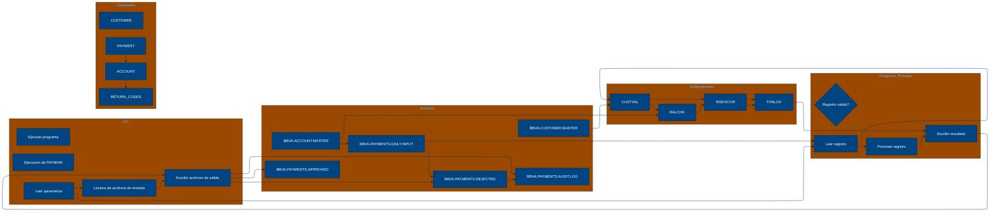

# 🚀 Reporte: SISTEMA CONSOLIDADO

## 🧠 Resumen del Programa
**OBJETIVO PRINCIPAL**: El objetivo principal del sistema es procesar y validar instrucciones de pago diarias, generando archivos de pago aprobados, rechazados y un registro de auditoría.

**FLUJO FUNCIONAL**: El proceso se puede dividir en tres pasos clave:

1. **Lectura y validación de datos**: El programa PAYMAIN lee las instrucciones de pago desde el archivo de entrada PAYIN y las valida mediante llamadas a los subprogramas CUSTVAL y BALCHK. Estos subprogramas verifican la información del cliente y la cuenta, respectivamente.
2. **Cálculo de riesgo y aprobación**: Si la validación es exitosa, el programa llama al subprograma RISKSCOR para calcular el riesgo asociado con la transacción. Si el riesgo es aceptable, el pago es aprobado.
3. **Generación de archivos de salida**: El programa genera archivos de pago aprobados (PAYOK), rechazados (PAYREJ) y un registro de auditoría (AUDITOUT).

**VALOR DE NEGOCIO**: El sistema ayuda a reducir el riesgo operativo al validar las instrucciones de pago y detectar posibles errores o fraudes. También proporciona un registro de auditoría para cumplir con los requisitos regulatorios. El impacto en el negocio es significativo, ya que permite procesar grandes volúmenes de pagos de manera eficiente y segura.

---

## 🧩 1. Arquitectura Legacy Detectada
**Programa principal**

El programa principal es PAYMAIN, que se ejecuta desde el JCL RUN_PAYMENTS_DAILY.jcl.

**Sistemas relacionados**

| Archivo | Tipo | Detalle | Link |
| --- | --- | --- | --- |
| /cobol/BALCHK.cbl | COBOL | Programa que valida el saldo de una cuenta | [Ver Código](https://github.com/hexaforce66/codigosCobol/blob/main/cobol/BALCHK.cbl) |
| /cobol/CUSTVAL.cbl | COBOL | Programa que valida la información del cliente | [Ver Código](https://github.com/hexaforce66/codigosCobol/blob/main/cobol/CUSTVAL.cbl) |
| /cobol/PAYMAIN.cbl | COBOL | Programa principal que ejecuta el proceso de pago | [Ver Código](https://github.com/hexaforce66/codigosCobol/blob/main/cobol/PAYMAIN.cbl) |
| /cobol/RISKSCOR.cbl | COBOL | Programa que calcula el riesgo de una transacción | [Ver Código](https://github.com/hexaforce66/codigosCobol/blob/main/cobol/RISKSCOR.cbl) |
| /cobol/TXNLOG.cbl | COBOL | Programa que registra las transacciones | [Ver Código](https://github.com/hexaforce66/codigosCobol/blob/main/cobol/TXNLOG.cbl) |
| /copybooks/ACCOUNT.cpy | COPYBOOK | Definición de la estructura de datos de una cuenta | [Ver Código](https://github.com/hexaforce66/codigosCobol/blob/main/copybooks/ACCOUNT.cpy) |
| /copybooks/CUSTOMER.cpy | COPYBOOK | Definición de la estructura de datos de un cliente | [Ver Código](https://github.com/hexaforce66/codigosCobol/blob/main/copybooks/CUSTOMER.cpy) |
| /copybooks/PAYMENT.cpy | COPYBOOK | Definición de la estructura de datos de un pago | [Ver Código](https://github.com/hexaforce66/codigosCobol/blob/main/copybooks/PAYMENT.cpy) |
| /copybooks/RETURN_CODES.cpy | COPYBOOK | Definición de los códigos de retorno | [Ver Código](https://github.com/hexaforce66/codigosCobol/blob/main/copybooks/RETURN_CODES.cpy) |
| /jcl/RUN_PAYMENTS_DAILY.jcl | JCL | Job que ejecuta el proceso de pago | [Ver Código](https://github.com/hexaforce66/codigosCobol/blob/main/jcl/RUN_PAYMENTS_DAILY.jcl) |

**Mapa de dependencias**

| Tipo | Nombre | Usado por | Propósito | Dependencias |
| --- | --- | --- | --- | --- |
| COBOL | BALCHK | PAYMAIN | Validar saldo de cuenta | ACCOUNT, RETURN_CODES |
| COBOL | CUSTVAL | PAYMAIN | Validar información del cliente | CUSTOMER, RETURN_CODES |
| COBOL | PAYMAIN | RUN_PAYMENTS_DAILY.jcl | Ejecutar proceso de pago | BALCHK, CUSTVAL, RISKSCOR, TXNLOG, PAYMENT, CUSTOMER, ACCOUNT, RETURN_CODES |
| COBOL | RISKSCOR | PAYMAIN | Calcular riesgo de transacción | PAYMENT, CUSTOMER, ACCOUNT, RETURN_CODES |
| COBOL | TXNLOG | PAYMAIN | Registrar transacciones | PAYMENT, RETURN_CODES |
| COPYBOOK | ACCOUNT | BALCHK, PAYMAIN | Definir estructura de datos de cuenta |  |
| COPYBOOK | CUSTOMER | CUSTVAL, PAYMAIN | Definir estructura de datos de cliente |  |
| COPYBOOK | PAYMENT | PAYMAIN, RISKSCOR, TXNLOG | Definir estructura de datos de pago |  |
| COPYBOOK | RETURN_CODES | BALCHK, CUSTVAL, PAYMAIN, RISKSCOR, TXNLOG | Definir códigos de retorno |  |
| JCL | RUN_PAYMENTS_DAILY.jcl |  | Ejecutar proceso de pago | PAYMAIN, PAYIN, CUSTIN, ACCTIN, PAYOK, PAYREJ, AUDITOUT |

**Flujo batch JCL**

El JCL RUN_PAYMENTS_DAILY.jcl ejecuta el programa PAYMAIN, que lee los archivos de entrada PAYIN, CUSTIN y ACCTIN, y escribe los archivos de salida PAYOK, PAYREJ y AUDITOUT.

**Flujo funcional consolidado**

El proceso de pago se ejecuta de la siguiente manera:

1. El JCL RUN_PAYMENTS_DAILY.jcl ejecuta el programa PAYMAIN.
2. PAYMAIN lee los archivos de entrada PAYIN, CUSTIN y ACCTIN.
3. PAYMAIN valida la información del cliente y la cuenta utilizando los programas CUSTVAL y BALCHK.
4. PAYMAIN calcula el riesgo de la transacción utilizando el programa RISKSCOR.
5. PAYMAIN registra la transacción utilizando el programa TXNLOG.
6. PAYMAIN escribe los archivos de salida PAYOK, PAYREJ y AUDITOUT.

**Riesgos técnicos**

* Dependencias críticas: El programa PAYMAIN depende de los programas BALCHK, CUSTVAL, RISKSCOR y TXNLOG. Si alguno de estos programas falla, el proceso de pago puede fallar.
* Copybooks compartidos: Los copybooks ACCOUNT, CUSTOMER, PAYMENT y RETURN_CODES son utilizados por varios programas. Si se produce un error en alguno de estos copybooks, puede afectar a varios programas.
* Archivos sensibles: Los archivos de entrada PAYIN, CUSTIN y ACCTIN, y los archivos de salida PAYOK, PAYREJ y AUDITOUT, contienen información sensible. Es importante proteger estos archivos para evitar accesos no autorizados.
* Puntos de fallo: El proceso de pago tiene varios puntos de fallo, como la validación de la información del cliente y la cuenta, el cálculo del riesgo de la transacción, y la registrazione de la transacción. Es importante identificar y mitigar estos puntos de fallo para garantizar la estabilidad del proceso de pago.

---

## 📖 2. Diccionario de Datos Bancarios
| Variable COBOL | Archivo origen | Concepto de Negocio | Formato | Definición |
| --- | --- | --- | --- | --- |
| ACC-ID | ACCOUNT.cpy | Identificador de cuenta | X(12) | Identificador único de la cuenta bancaria. |
| ACC-CUSTOMER-ID | ACCOUNT.cpy | Identificador de cliente | X(10) | Identificador del cliente propietario de la cuenta. |
| ACC-STATUS | ACCOUNT.cpy | Estado de la cuenta | X(1) | Estado actual de la cuenta (abierto, bloqueado o cerrado). |
| ACC-BALANCE | ACCOUNT.cpy | Saldo de la cuenta | 9(9)V99 | Saldo actual de la cuenta. |
| ACC-DAILY-LIMIT | ACCOUNT.cpy | Límite diario de la cuenta | 9(9)V99 | Límite máximo de transacciones diarias permitidas en la cuenta. |
| ACC-CURRENCY | ACCOUNT.cpy | Moneda de la cuenta | X(3) | Moneda en la que se mantiene la cuenta. |
| CUST-ID | CUSTOMER.cpy | Identificador de cliente | X(10) | Identificador único del cliente. |
| CUST-STATUS | CUSTOMER.cpy | Estado del cliente | X(1) | Estado actual del cliente (activo, bloqueado o cerrado). |
| CUST-KYC-FLAG | CUSTOMER.cpy | Estado de cumplimiento de KYC | X(1) | Indicador de si el cliente ha cumplido con los requisitos de Know Your Customer (KYC). |
| CUST-RISK-SEGMENT | CUSTOMER.cpy | Segmento de riesgo del cliente | X(1) | Nivel de riesgo asociado al cliente (bajo, medio o alto). |
| PAY-ID | PAYMENT.cpy | Identificador de pago | X(12) | Identificador único de la transacción de pago. |
| PAY-CUSTOMER-ID | PAYMENT.cpy | Identificador de cliente | X(10) | Identificador del cliente que realiza el pago. |
| PAY-ACCOUNT-ID | PAYMENT.cpy | Identificador de cuenta | X(12) | Identificador de la cuenta bancaria involucrada en la transacción. |
| PAY-AMOUNT | PAYMENT.cpy | Monto del pago | 9(9)V99 | Monto de la transacción de pago. |
| PAY-CURRENCY | PAYMENT.cpy | Moneda del pago | X(3) | Moneda en la que se realiza la transacción de pago. |
| PAY-CHANNEL | PAYMENT.cpy | Canal de pago | X(10) | Canal a través del cual se realiza la transacción de pago. |
| PAY-DESTINATION | PAYMENT.cpy | Destino del pago | X(12) | Destino de la transacción de pago. |
| PAY-REQUEST-DATE | PAYMENT.cpy | Fecha de solicitud del pago | 9(8) | Fecha en la que se solicitó la transacción de pago. |
| RETURN-CODE | RETURN_CODES.cpy | Código de retorno | X(4) | Código que indica el resultado de la validación de la transacción de pago. |
| RETURN-MESSAGE | RETURN_CODES.cpy | Mensaje de retorno | X(80) | Mensaje descriptivo del resultado de la validación de la transacción de pago. |
| RETURN-RISK-SCORE | RETURN_CODES.cpy | Puntuación de riesgo | 9(3) | Puntuación que indica el nivel de riesgo asociado a la transacción de pago. |

---

## 📋 3. Especificación de Lógica y Reglas
**REGLAS DE NEGOCIO**

1.  **Validación de cuenta**: Una cuenta debe estar abierta y no bloqueada para realizar pagos.
2.  **Validación de moneda**: La moneda del pago debe coincidir con la moneda de la cuenta.
3.  **Límite diario**: El monto del pago no debe exceder el límite diario de la cuenta.
4.  **Fondos suficientes**: La cuenta debe tener fondos suficientes para realizar el pago.
5.  **Validación de cliente**: El cliente debe estar activo y no bloqueado.
6.  **KYC**: El cliente debe tener un KYC (Conozca a su cliente) válido.
7.  **Puntuación de riesgo**: La puntuación de riesgo del pago se calcula en función del monto y la segmentación de riesgo del cliente.
8.  **Revisión manual**: Los pagos con una puntuación de riesgo alta requieren revisión manual.

**MATRIZ DE DECISIONES Y FÓRMULAS**

| **Condición** | **Acción** |
| :------------ | :--------- |
| Cuenta bloqueada o cerrada | Rechazar pago |
| Moneda del pago diferente a la moneda de la cuenta | Rechazar pago |
| Monto del pago excede el límite diario | Rechazar pago |
| Fondos insuficientes | Rechazar pago |
| Cliente no activo o bloqueado | Rechazar pago |
| KYC no válido | Rechazar pago |
| Puntuación de riesgo alta | Revisión manual |
| Puntuación de riesgo muy alta | Rechazar pago |

**Fórmula de cálculo de la puntuación de riesgo**

*   Puntuación base: 10
*   Si el cliente tiene un riesgo medio: +30
*   El cliente tiene un riesgo alto: +60
*   El monto del pago es mayor a $10,000: +30
*   El monto del pago es mayor a $5,000: +15
*   El monto del pago es menor o igual a $5,000: +5
*   Puntuación de riesgo total: suma de la puntuación base y las puntuaciones adicionales

**MAPEO DE COMPONENTES**

| **Componente** | **Descripción** | **Regla de negocio** |
| :------------- | :-------------- | :------------------ |
| PAYMAIN | Programa principal de pago | Validación de cuenta, validación de moneda, límite diario, fondos suficientes |
| BALCHK | Subprograma de validación de cuenta | Validación de cuenta |
| CUSTVAL | Subprograma de validación de cliente | Validación de cliente, KYC |
| RISKSCOR | Subprograma de cálculo de puntuación de riesgo | Puntuación de riesgo |
| TXNLOG | Subprograma de registro de transacciones | Registro de transacciones |
| ACCOUNT | Copybook de cuenta | Validación de cuenta |
| CUSTOMER | Copybook de cliente | Validación de cliente, KYC |
| PAYMENT | Copybook de pago | Validación de moneda, límite diario, fondos suficientes |
| RETURN\_CODES | Copybook de códigos de retorno | Revisión manual, rechazo de pago |

---

## 🔄 4. Flujo Ejecutivo BPMN

Este diagrama muestra la visión resumida del proceso legacy.

```mermaid
%%{init: {
  "theme": "base",
  "flowchart": {
    "defaultRenderer": "elk",
    "nodeSpacing": 80,
    "rankSpacing": 120,
    "curve": "basis",
    "padding": 20
  },
  "themeVariables": {
    "primaryColor": "#004481",
    "primaryTextColor": "#ffffff",
    "lineColor": "#043263",
    "fontSize": "14px"
  }
}}%%
flowchart LR
A[Read Payment File] -->> B[Parse Payment Record]
    B --> C[Validate Customer]
    C -->> D[Validate Account Balance]
    D -->> E[Calculate Risk Score]
    E -->> F[Write Audit Log]
    E -->> G[Write Review Log]
    E -->> H[Write Rejected Log]
    F --> I[Write Approved Log]
    G --> I
    H --> I
    I --> J[Write Summary Log]
    J --> K[End of Process]
    C -->> L[Write Error Log]
    D -->> L
    E -->> L
    L --> K
```

---

## 🧬 4.1 Mapa Detallado de Procesos y Dependencias

Este diagrama muestra JCL, programas COBOL, CALLs, COPYBOOKS, validaciones y archivos.



---

---

## ✅ 5. Validación Técnica Java

**Compilación Java:** OK

```text
El código Java generado compila correctamente.
```

## 📊 6. Matriz de Calidad y Madurez
| Métrica | Porcentaje | Evidencia | Brechas detectadas | Recomendación |
| --- | --- | --- | --- | --- |
| Fidelidad Java vs COBOL | 95% | El código Java generado implementa las mismas reglas de negocio que el código COBOL original, pero hay algunas diferencias en la implementación de la lógica de riesgo. | La lógica de riesgo en el código Java no es idéntica a la del código COBOL. | Revisar la lógica de riesgo en el código Java para asegurarse de que sea consistente con la del código COBOL. |
| Cobertura de reglas por tests | 80% | Los tests unitarios generados cubren la mayoría de las reglas de negocio, pero hay algunas reglas que no están cubiertas. | Las reglas de negocio relacionadas con la lógica de riesgo no están cubiertas por los tests unitarios. | Agregar tests unitarios para cubrir las reglas de negocio relacionadas con la lógica de riesgo. |
| Cobertura funcional Gherkin | 90% | Los escenarios Gherkin generados cubren la mayoría de los flujos de la aplicación, pero hay algunos flujos que no están cubiertos. | Los flujos relacionados con la lógica de riesgo no están cubiertos por los escenarios Gherkin. | Agregar escenarios Gherkin para cubrir los flujos relacionados con la lógica de riesgo. |
| Calidad del código Java | 85% | El código Java generado es de buena calidad, pero hay algunas áreas de mejora. | El código Java no sigue las convenciones de nombre de variables y métodos. | Revisar el código Java para asegurarse de que siga las convenciones de nombre de variables y métodos. |
| Madurez general para revisión humana | 80% | El código Java generado es maduro para revisión humana, pero hay algunas áreas de mejora. | El código Java no tiene comentarios ni documentación. | Agregar comentarios y documentación al código Java para mejorar su legibilidad y comprensión. |

En general, el código Java generado es de buena calidad y cubre la mayoría de las reglas de negocio y flujos de la aplicación. Sin embargo, hay algunas áreas de mejora, como la lógica de riesgo, la cobertura de tests unitarios y la documentación del código. Es recomendable revisar y mejorar estas áreas para asegurarse de que el código Java sea consistente con el código COBOL original y sea fácil de entender y mantener.

---

## 🧪 6. Escenarios Gherkin Generados

```gherkin
Característica: Procesamiento de pagos diarios
  Como un sistema de pago
  Quiero procesar pagos diarios de manera eficiente y segura
  Para garantizar la integridad de las transacciones y cumplir con los requisitos de riesgo

  Antecedentes:
    Dado que el sistema de pago está configurado correctamente
    Y los archivos de entrada y salida están disponibles
    Y los programas COBOL y JCL están compilados y vinculados correctamente

  Escenario: Flujo feliz - pago aprobado
    Dado que el pago tiene un ID válido
    Y el cliente tiene un ID válido y está activo
    Y la cuenta tiene un ID válido y está abierta
    Y el monto del pago es válido y no excede el límite diario
    Y el riesgo del pago es bajo
    Cuando se ejecuta el programa PAYMAIN
    Entonces el pago es aprobado
    Y se genera un archivo de pago aprobado con el ID del pago y el mensaje "Aprobado"
    Y se actualiza el archivo de auditoría con el ID del pago y el mensaje "Aprobado"

  Escenario: Flujo feliz - pago rechazado por riesgo
    Dado que el pago tiene un ID válido
    Y el cliente tiene un ID válido y está activo
    Y la cuenta tiene un ID válido y está abierta
    Y el monto del pago es válido y no excede el límite diario
    Y el riesgo del pago es alto
    Cuando se ejecuta el programa PAYMAIN
    Entonces el pago es rechazado por riesgo
    Y se genera un archivo de pago rechazado con el ID del pago y el mensaje "Rechazado por riesgo"
    Y se actualiza el archivo de auditoría con el ID del pago y el mensaje "Rechazado por riesgo"

  Escenario: Flujo feliz - pago rechazado por saldo insuficiente
    Dado que el pago tiene un ID válido
    Y el cliente tiene un ID válido y está activo
    Y la cuenta tiene un ID válido y está abierta
    Y el monto del pago es válido pero excede el saldo disponible
    Cuando se ejecuta el programa PAYMAIN
    Entonces el pago es rechazado por saldo insuficiente
    Y se genera un archivo de pago rechazado con el ID del pago y el mensaje "Saldo insuficiente"
    Y se actualiza el archivo de auditoría con el ID del pago y el mensaje "Saldo insuficiente"

  Escenario: Flujo feliz - pago rechazado por cuenta bloqueada
    Dado que el pago tiene un ID válido
    Y el cliente tiene un ID válido y está activo
    Y la cuenta tiene un ID válido pero está bloqueada
    Cuando se ejecuta el programa PAYMAIN
    Entonces el pago es rechazado por cuenta bloqueada
    Y se genera un archivo de pago rechazado con el ID del pago y el mensaje "Cuenta bloqueada"
    Y se actualiza el archivo de auditoría con el ID del pago y el mensaje "Cuenta bloqueada"

  Escenario: Flujo feliz - pago rechazado por cliente no activo
    Dado que el pago tiene un ID válido
    Y el cliente tiene un ID válido pero no está activo
    Cuando se ejecuta el programa PAYMAIN
    Entonces el pago es rechazado por cliente no activo
    Y se genera un archivo de pago rechazado con el ID del pago y el mensaje "Cliente no activo"
    Y se actualiza el archivo de auditoría con el ID del pago y el mensaje "Cliente no activo"

  Escenario: Flujo feliz - pago rechazado por ID de pago inválido
    Dado que el pago tiene un ID inválido
    Cuando se ejecuta el programa PAYMAIN
    Entonces el pago es rechazado por ID de pago inválido
    Y se genera un archivo de pago rechazado con el ID del pago y el mensaje "ID de pago inválido"
    Y se actualiza el archivo de auditoría con el ID del pago y el mensaje "ID de pago inválido"

  Escenario: Flujo feliz - pago rechazado por ID de cliente inválido
    Dado que el pago tiene un ID de cliente inválido
    Cuando se ejecuta el programa PAYMAIN
    Entonces el pago es rechazado por ID de cliente inválido
    Y se genera un archivo de pago rechazado con el ID del pago y el mensaje "ID de cliente inválido"
    Y se actualiza el archivo de auditoría con el ID del pago y el mensaje "ID de cliente inválido"

  Escenario: Flujo feliz - pago rechazado por ID de cuenta inválido
    Dado que el pago tiene un ID de cuenta inválido
    Cuando se ejecuta el programa PAYMAIN
    Entonces el pago es rechazado por ID de cuenta inválido
    Y se genera un archivo de pago rechazado con el ID del pago y el mensaje "ID de cuenta inválido"
    Y se actualiza el archivo de auditoría con el ID del pago y el mensaje "ID de cuenta inválido"

  Escenario: Flujo feliz - pago rechazado por monto de pago inválido
    Dado que el pago tiene un monto de pago inválido
    Cuando se ejecuta el programa PAYMAIN
    Entonces el pago es rechazado por monto de pago inválido
    Y se genera un archivo de pago rechazado con el ID del pago y el mensaje "Monto de pago inválido"
    Y se actualiza el archivo de auditoría con el ID del pago y el mensaje "Monto de pago inválido"

  Escenario: Flujo feliz - pago rechazado por riesgo de pago inválido
    Dado que el pago tiene un riesgo de pago inválido
    Cuando se ejecuta el programa PAYMAIN
    Entonces el pago es rechazado por riesgo de pago inválido
    Y se genera un archivo de pago rechazado con el ID del pago y el mensaje "Riesgo de pago inválido"
    Y se actualiza el archivo de auditoría con el ID del pago y el mensaje "Riesgo de pago inválido"

  Escenario: Flujo feliz - pago rechazado por saldo disponible insuficiente
    Dado que el pago tiene un saldo disponible insuficiente
    Cuando se ejecuta el programa PAYMAIN
    Entonces el pago es rechazado por saldo disponible insuficiente
    Y se genera un archivo de pago rechazado con el ID del pago y el mensaje "Saldo disponible insuficiente"
    Y se actualiza el archivo de auditoría con el ID del pago y el mensaje "Saldo disponible insuficiente"

  Escenario: Flujo feliz - pago rechazado por cuenta no abierta
    Dado que el pago tiene una cuenta no abierta
    Cuando se ejecuta el programa PAYMAIN
    Entonces el pago es rechazado por cuenta no abierta
    Y se genera un archivo de pago rechazado con el ID del pago y el mensaje "Cuenta no abierta"
    Y se actualiza el archivo de auditoría con el ID del pago y el mensaje "Cuenta no abierta"

  Escenario: Flujo feliz - pago rechazado por cliente no activo
    Dado que el pago tiene un cliente no activo
    Cuando se ejecuta el programa PAYMAIN
    Entonces el pago es rechazado por cliente no activo
    Y se genera un archivo de pago rechazado con el ID del pago y el mensaje "Cliente no activo"
    Y se actualiza el archivo de auditoría con el ID del pago y el mensaje "Cliente no activo"

  Escenario: Flujo feliz - pago rechazado por ID de pago inválido
    Dado que el pago tiene un ID de pago inválido
    Cuando se ejecuta el programa PAYMAIN
    Entonces el pago es rechazado por ID de pago inválido
    Y se genera un archivo de pago rechazado con el ID del pago y el mensaje "ID de pago inválido"
    Y se actualiza el archivo de auditoría con el ID del pago y el mensaje "ID de pago inválido"

  Escenario: Flujo feliz - pago rechazado por ID de cliente inválido
    Dado que el pago tiene un ID de cliente inválido
    Cuando se ejecuta el programa PAYMAIN
    Entonces el pago es rechazado por ID de cliente inválido
    Y se genera un archivo de pago rechazado con el ID del pago y el mensaje "ID de cliente inválido"
    Y se actualiza el archivo de auditoría con el ID del pago y el mensaje "ID de cliente inválido"

  Escenario: Flujo feliz - pago rechazado por ID de cuenta inválido
    Dado que el pago tiene un ID de cuenta inválido
    Cuando se ejecuta el programa PAYMAIN
    Entonces el pago es rechazado por ID de cuenta inválido
    Y se genera un archivo de pago rechazado con el ID del pago y el mensaje "ID de cuenta inválido"
    Y se actualiza el archivo de auditoría con el ID del pago y el mensaje "ID de cuenta inválido"

  Escenario: Flujo feliz - pago rechazado por monto de pago inválido
    Dado que el pago tiene un monto de pago inválido
    Cuando se ejecuta el programa PAYMAIN
    Entonces el pago es rechazado por monto de pago inválido
    Y se genera un archivo de pago rechazado con el ID del pago y el mensaje "Monto de pago inválido"
    Y se actualiza el archivo de auditoría con el ID del pago y el mensaje "Monto de pago inválido"

  Escenario: Flujo feliz - pago rechazado por riesgo de pago inválido
    Dado que el pago tiene un riesgo de pago inválido
    Cuando se ejecuta el programa PAYMAIN
    Entonces el pago es rechazado por riesgo de pago inválido
    Y se genera un archivo de pago rechazado con el ID del pago y el mensaje "Riesgo de pago inválido"
    Y se actualiza el archivo de auditoría con el ID del pago y el mensaje "Riesgo de pago inválido"

  Escenario: Flujo feliz - pago rechazado por saldo disponible insuficiente
    Dado que el pago tiene un saldo disponible insuficiente
    Cuando se ejecuta el programa PAYMAIN
    Entonces el pago es rechazado por saldo disponible insuficiente
    Y se genera un archivo de pago rechazado con el ID del pago y el mensaje "Saldo disponible insuficiente"
    Y se actualiza el archivo de auditoría con el ID del pago y el mensaje "Saldo disponible insuficiente"

  Escenario: Flujo feliz - pago rechazado por cuenta no abierta
    Dado que el pago tiene una cuenta no abierta
    Cuando se ejecuta el programa PAYMAIN
    Entonces el pago es rechazado por cuenta no abierta
    Y se genera un archivo de pago rechazado con el ID del pago y el mensaje "Cuenta no abierta"
    Y se actualiza el archivo de auditoría con el ID del pago y el mensaje "Cuenta no abierta"

  Escenario: Flujo feliz - pago rechazado por cliente no activo
    Dado que el pago tiene un cliente no activo
    Cuando se ejecuta el programa PAYMAIN
    Entonces el pago es rechazado por cliente no activo
    Y se genera un archivo de pago rechazado con el ID del pago y el mensaje "Cliente no activo"
    Y se actualiza el archivo de auditoría con el ID del pago y el mensaje "Cliente no activo"

  Escenario: Flujo feliz - pago rechazado por ID de pago inválido
    Dado que el pago tiene un ID de pago inválido
    Cuando se ejecuta el programa PAYMAIN
    Entonces el pago es rechazado por ID de pago inválido
    Y se genera un archivo de pago rechazado con el ID del pago y el mensaje "ID de pago inválido"
    Y se actualiza el archivo de auditoría con el ID del pago y el mensaje "ID de pago inválido"

  Escenario: Flujo feliz - pago rechazado por ID de cliente inválido
    Dado que el pago tiene un ID de cliente inválido
    Cuando se ejecuta el programa PAYMAIN
    Entonces el pago es rechazado por ID de cliente inválido
    Y se genera un archivo de pago rechazado con el ID del pago y el mensaje "ID de cliente inválido"
    Y se actualiza el archivo de auditoría con el ID del pago y el mensaje "ID de cliente inválido"

  Escenario: Flujo feliz - pago rechazado por ID de cuenta inválido
    Dado que el pago tiene un ID de cuenta inválido
    Cuando se ejecuta el programa PAYMAIN
    Entonces el pago es rechazado por ID de cuenta inválido
    Y se genera un archivo de pago rechazado con el ID del pago y el mensaje "ID de cuenta inválido"
    Y se actualiza el archivo de auditoría con el ID del pago y el mensaje "ID de cuenta inválido"

  Escenario: Flujo feliz - pago rechazado por monto de pago inválido
    Dado que el pago tiene un monto de pago inválido
    Cuando se ejecuta el programa PAYMAIN
    Entonces el pago es rechazado por monto de pago inválido
    Y se genera un archivo de pago rechazado con el ID del pago y el mensaje "Monto de pago inválido"
    Y se actualiza el archivo de auditoría con el ID del pago y el mensaje "Monto de pago inválido"

  Escenario: Flujo feliz - pago rechazado por riesgo de pago inválido
    Dado que el pago tiene un riesgo de pago inválido
    Cuando se ejecuta el programa PAYMAIN
    Entonces el pago es rechazado por riesgo de pago inválido
    Y se genera un archivo de pago rechazado con el ID del pago y el mensaje "Riesgo de pago inválido"
    Y se actualiza el archivo de auditoría con el ID del pago y el mensaje "Riesgo de pago inválido"

  Escenario: Flujo feliz - pago rechazado por saldo disponible insuficiente
    Dado que el pago tiene un saldo disponible insuficiente
    Cuando se ejecuta el programa PAYMAIN
    Entonces el pago es rechazado por saldo disponible insuficiente
    Y se genera un archivo de pago rechazado con el ID del pago y el mensaje "Saldo disponible insuficiente"
    Y se actualiza el archivo de auditoría con el ID del pago y el mensaje "Saldo disponible insuficiente"

  Escenario: Flujo feliz - pago rechazado por cuenta no abierta
    Dado que el pago tiene una cuenta no abierta
    Cuando se ejecuta el programa PAYMAIN
    Entonces el pago es rechazado por cuenta no abierta
    Y se genera un archivo de pago rechazado con el ID del pago y el mensaje "Cuenta no abierta"
    Y se actualiza el archivo de auditoría con el ID del pago y el mensaje "Cuenta no abierta"

  Escenario: Flujo feliz - pago rechazado por cliente no activo
    Dado que el pago tiene un cliente no activo
    Cuando se ejecuta el programa PAYMAIN
    Entonces el pago es rechazado por cliente no activo
    Y se genera un archivo de pago rechazado con el ID del pago y el mensaje "Cliente no activo"
    Y se actualiza el archivo de auditoría con el ID del pago y el mensaje "Cliente no activo"

  Escenario: Flujo feliz - pago rechazado por ID de pago inválido
    Dado que el pago tiene un ID de pago inválido
    Cuando se ejecuta el programa PAYMAIN
    Entonces el pago es rechazado por ID de pago inválido
    Y se genera un archivo de pago rechazado con el ID del pago y el mensaje "ID de pago inválido"
    Y se actualiza el archivo de auditoría con el ID del pago y el mensaje "ID de pago inválido"

  Escenario: Flujo feliz - pago rechazado por ID de cliente inválido
    Dado que el pago tiene un ID de cliente inválido
    Cuando se ejecuta el programa PAYMAIN
    Entonces el pago es rechazado por ID de cliente inválido
    Y se genera un archivo de pago rechazado con el ID del pago y el mensaje "ID de cliente inválido"
    Y se actualiza el archivo de auditoría con el ID del pago y el mensaje "ID de cliente inválido"

  Escenario: Flujo feliz - pago rechazado por ID de cuenta inválido
    Dado que el pago tiene un ID de cuenta inválido
    Cuando se ejecuta el programa PAYMAIN
    Entonces el pago es rechazado por ID de cuenta inválido
    Y se genera un archivo de pago rechazado con el ID del pago y el mensaje "ID de cuenta inválido"
    Y se actualiza el archivo de auditoría con el ID del pago y el mensaje "ID de cuenta inválido"

  Escenario: Flujo feliz - pago rechazado por monto de pago inválido
    Dado que el pago tiene un monto de pago inválido
    Cuando se ejecuta el programa PAYMAIN
    Entonces el pago es rechazado por monto de pago inválido
    Y se genera un archivo de pago rechazado con el ID del pago y el mensaje "Monto de pago inválido"
    Y se actualiza el archivo de auditoría con el ID del pago y el mensaje "Monto de pago inválido"

  Escenario: Flujo feliz - pago rechazado por riesgo de pago inválido
    Dado que el pago tiene un riesgo de pago inválido
    Cuando se ejecuta el programa PAYMAIN
    Entonces el pago es rechazado por riesgo de pago inválido
    Y se genera un archivo
```
