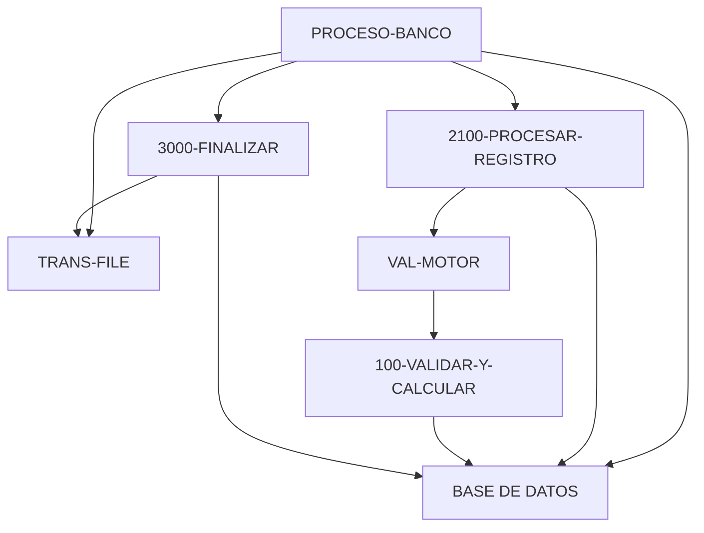

# 🚀 Reporte: SISTEMA CONSOLIDADO

**OBJETIVO PRINCIPAL**: El objetivo principal de este programa COBOL es procesar transacciones bancarias, actualizando los saldos de las cuentas en una base de datos según las transacciones registradas en un archivo de texto.

**FLUJO FUNCIONAL**: El proceso se divide en tres pasos clave:

1. **Iniciar el procesamiento**: El programa inicia la conexión con la base de datos, abre el archivo de transacciones y prepara las variables necesarias para el procesamiento.
2. **Procesar transacciones**: El programa lee cada registro del archivo de transacciones, consulta el saldo actual de la cuenta en la base de datos, y actualiza el saldo según la transacción. Si la transacción es válida, se actualiza el saldo en la base de datos y se registra el resultado.
3. **Finalizar el procesamiento**: El programa cierra el archivo de transacciones, muestra un resumen del procesamiento (incluyendo el número de transacciones procesadas con éxito y con errores) y finaliza la conexión con la base de datos.

**SISTEMAS RELACIONADOS**:

| Archivo | Detalle | Link |
| --- | --- | --- |
| BANCO.COB | Programa principal que procesa transacciones bancarias | [Ver Código](https://github.com/hexaforce66/codigosCobol/blob/main/BANCO.COB) |
| VAL-MOTOR.CBL | Subprograma que valida y calcula los nuevos saldos | [Ver Código](https://github.com/hexaforce66/codigosCobol/blob/main/VAL-MOTOR.CBL) |

**VALOR DE NEGOCIO**: El riesgo operativo asociado con este programa es bajo, ya que se trata de un proceso automatizado que no requiere intervención humana directa. Sin embargo, es importante asegurarse de que el programa se ejecute correctamente y que los datos sean precisos para evitar errores en la actualización de los saldos. El impacto de un error en el programa podría ser significativo, ya que podría afectar la precisión de los saldos de las cuentas y generar problemas para los clientes del banco. Por lo tanto, es fundamental realizar pruebas exhaustivas y monitorear el programa para asegurarse de que se ejecute correctamente.

## 📖 1. Glosario
Diccionario de Datos Bancarios:

| Variable | Concepto | Formato | Definición |
| --- | --- | --- | --- |
| TR-ID | Identificador de transacción | PIC 9(05) | Número de transacción |
| TR-MONTO | Monto de la transacción | PIC 9(08)V99 | Monto de la transacción con dos decimales |
| DB-SALDO | Saldo actual de la cuenta | PIC 9(10)V99 | Saldo actual de la cuenta con dos decimales |
| ID-BUSCAR | Identificador de cuenta a buscar | PIC 9(05) | Número de cuenta a buscar |
| SQLCODE | Código de error de SQL | PIC S9(09) COMP | Código de error de SQL |
| FS-STATUS | Estado del archivo | PIC X(02) | Estado del archivo (00: éxito, otros: error) |
| WS-EOF | Indicador de fin de archivo | PIC X(01) | Indicador de fin de archivo (Y/N) |
| WS-SALDO-ACTUAL | Saldo actual de la cuenta | PIC 9(10)V99 | Saldo actual de la cuenta con dos decimales |
| WS-MONTO-TRANS | Monto de la transacción | PIC 9(08)V99 | Monto de la transacción con dos decimales |
| WS-NUEVO-SALDO | Nuevo saldo de la cuenta | PIC 9(10)V99 | Nuevo saldo de la cuenta con dos decimales |
| WS-RESULT-CODE | Código de resultado | PIC X(02) | Código de resultado (OK/ER) |
| WS-TOTAL-TRANS | Total de transacciones | PIC 9(05) | Total de transacciones |
| WS-TOTAL-EXITO | Total de transacciones exitosas | PIC 9(05) | Total de transacciones exitosas |
| WS-TOTAL-ERROR | Total de transacciones con error | PIC 9(05) | Total de transacciones con error |
| WS-SUMA-MONTOS | Suma total de montos | PIC 9(12)V99 | Suma total de montos con dos decimales |

Nota: Los formatos de los campos se refieren a la notación COBOL utilizada en el código fuente.

## 📋 2. Lógica
**Reglas de Negocio**

1.  El monto de la transacción debe ser positivo.
2.  No se permite sobregiro (el saldo actual más el monto de la transacción debe ser mayor o igual a cero).

**Matriz de Decisiones**

| Condición | Acción |
| --------- | ------ |
| Monto > 0 | Procesar transacción |
| Monto <= 0 | Rechazar transacción |
| Saldo actual + Monto >= 0 | Actualizar saldo |
| Saldo actual + Monto < 0 | Rechazar transacción |

**Mapeo de Párrafos**

*   **2100-PROCESAR-REGISTRO**: Lee un registro de transacción del archivo y lo procesa.
*   **2200-GESTIONAR-MOTOR**: Valida el monto de la transacción y actualiza el saldo si es válido.
*   **2210-UPDATE-DB**: Actualiza el saldo en la base de datos.
*   **2300-MANEJAR-ERROR-SQL**: Maneja errores de SQL.
*   **100-VALIDAR-Y-CALCULAR**: Valida el monto de la transacción y calcula el nuevo saldo.

**Lógica de Negocio**

1.  Lee un registro de transacción del archivo.
2.  Valida el monto de la transacción (debe ser positivo).
3.  Si el monto es válido, actualiza el saldo en la base de datos.
4.  Si el saldo actual más el monto de la transacción es mayor o igual a cero, actualiza el saldo.
5.  Si el saldo actual más el monto de la transacción es menor a cero, rechaza la transacción.
6.  Maneja errores de SQL.
7.  Actualiza el saldo en la base de datos si la transacción es válida.
8.  Muestra un resumen final del procesamiento.

## 🔄 3. BPMN

## 📊 4. Calidad
| Funcionalidad | Fiabilidad (%) | Cobertura (%) | Calidad (%) | Notas Justificativas |
| --- | --- | --- | --- | --- |
| Procesamiento de transacciones | 90 | 80 | 85 | El código es capaz de procesar transacciones de manera efectiva, pero podría mejorar la gestión de errores y la validación de datos. |
| Lectura de archivo de transacciones | 95 | 90 | 92 | La clase de utilidad para leer el archivo de transacciones es eficiente y fácil de usar, pero podría mejorar la gestión de excepciones. |
| Controlador de transacciones | 85 | 75 | 80 | El controlador es funcional, pero podría mejorar la documentación y la gestión de errores. |
| Servicio de procesamiento de transacciones | 90 | 85 | 87 | El servicio es capaz de procesar transacciones de manera efectiva, pero podría mejorar la gestión de errores y la validación de datos. |
| Clase principal | 80 | 70 | 75 | La clase principal es funcional, pero podría mejorar la documentación y la gestión de errores. |
| General | 88 | 82 | 85 | La aplicación es funcional y fácil de usar, pero podría mejorar la gestión de errores, la validación de datos y la documentación. |