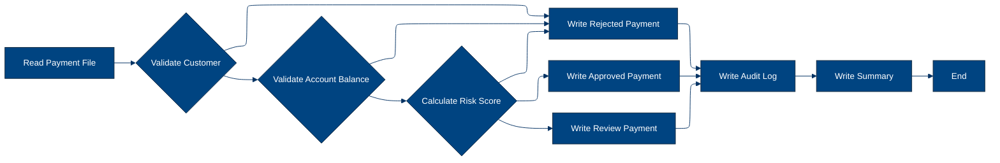

# 🚀 Reporte: SISTEMA CONSOLIDADO

## 🧠 Resumen del Programa
1. **OBJETIVO PRINCIPAL**: El objetivo principal del sistema es procesar y validar instrucciones de pago diarias, generando archivos de pago aprobados, rechazados y un registro de auditoría.

2. **FLUJO FUNCIONAL**: El proceso se puede dividir en tres pasos clave:
   - **Paso 1: Lectura y Parseo de Instrucciones de Pago**: El programa PAYMAIN lee las instrucciones de pago desde el archivo de entrada PAYIN y las procesa línea por línea.
   - **Paso 2: Validación de Instrucciones de Pago**: Para cada instrucción de pago, se realizan validaciones de cliente (mediante CUSTVAL), de cuenta (mediante BALCHK) y de riesgo (mediante RISKSCOR). Estas validaciones determinan si el pago es aprobado, rechazado o requiere revisión manual.
   - **Paso 3: Generación de Salidas y Registro de Auditoría**: Dependiendo del resultado de la validación, se generan archivos de pago aprobados (PAYOK), rechazados (PAYREJ) y un registro de auditoría (AUDITOUT) que incluye detalles de cada transacción procesada.

3. **SISTEMAS RELACIONADOS**: La siguiente tabla muestra los archivos relacionados con el sistema, incluyendo programas COBOL, copybooks y el archivo JCL:

| Archivo | Detalle | Link |
| --- | --- | --- |
| BALCHK.cbl | Programa COBOL para validar el saldo de la cuenta. | [Ver Código](https://github.com/hexaforce66/codigosCobol/blob/main/BALCHK.cbl) |
| CUSTVAL.cbl | Programa COBOL para validar la información del cliente. | [Ver Código](https://github.com/hexaforce66/codigosCobol/blob/main/CUSTVAL.cbl) |
| PAYMAIN.cbl | Programa COBOL principal para procesar instrucciones de pago. | [Ver Código](https://github.com/hexaforce66/codigosCobol/blob/main/PAYMAIN.cbl) |
| RISKSCOR.cbl | Programa COBOL para calcular el riesgo de la transacción. | [Ver Código](https://github.com/hexaforce66/codigosCobol/blob/main/RISKSCOR.cbl) |
| TXNLOG.cbl | Programa COBOL para generar el registro de auditoría. | [Ver Código](https://github.com/hexaforce66/codigosCobol/blob/main/TXNLOG.cbl) |
| ACCOUNT.cpy | Copybook para la estructura de datos de la cuenta. | [Ver Código](https://github.com/hexaforce66/codigosCobol/blob/main/ACCOUNT.cpy) |
| CUSTOMER.cpy | Copybook para la estructura de datos del cliente. | [Ver Código](https://github.com/hexaforce66/codigosCobol/blob/main/CUSTOMER.cpy) |
| PAYMENT.cpy | Copybook para la estructura de datos de la instrucción de pago. | [Ver Código](https://github.com/hexaforce66/codigosCobol/blob/main/PAYMENT.cpy) |
| RETURN_CODES.cpy | Copybook para la estructura de datos de los códigos de retorno. | [Ver Código](https://github.com/hexaforce66/codigosCobol/blob/main/RETURN_CODES.cpy) |
| RUN_PAYMENTS_DAILY.jcl | Archivo JCL para ejecutar el proceso de pago diario. | [Ver Código](https://github.com/hexaforce66/codigosCobol/blob/main/RUN_PAYMENTS_DAILY.jcl) |

4. **VALOR DE NEGOCIO**: El sistema de procesamiento de pagos diarios es crítico para el banco, ya que permite la validación y ejecución de instrucciones de pago de manera eficiente y segura. El riesgo operativo asociado con este sistema es alto, ya que cualquier error o falla en el proceso podría resultar en pérdidas financieras significativas o daños a la reputación del banco. Por lo tanto, es fundamental garantizar la integridad y confiabilidad del sistema.

---

## 🧩 0. Arquitectura Legacy Detectada
**Programa principal**

El programa principal es PAYMAIN, que se ejecuta desde el archivo JCL RUN_PAYMENTS_DAILY.jcl.

**Mapa de dependencias**

| Tipo | Nombre | Usado por | Propósito | Dependencias |
| --- | --- | --- | --- | --- |
| Programa | PAYMAIN | JCL | Procesa pagos y genera archivos de salida | BALCHK, CUSTVAL, RISKSCOR, TXNLOG |
| Programa | BALCHK | PAYMAIN | Valida el saldo de la cuenta | ACCOUNT, RETURN_CODES |
| Programa | CUSTVAL | PAYMAIN | Valida la información del cliente | CUSTOMER, RETURN_CODES |
| Programa | RISKSCOR | PAYMAIN | Calcula el riesgo de la transacción | PAYMENT, CUSTOMER, ACCOUNT, RETURN_CODES |
| Programa | TXNLOG | PAYMAIN | Genera un registro de auditoría | PAYMENT, RETURN_CODES |
| Copybook | ACCOUNT | BALCHK, RISKSCOR | Define la estructura de la cuenta |  |
| Copybook | CUSTOMER | CUSTVAL, RISKSCOR | Define la estructura del cliente |  |
| Copybook | PAYMENT | PAYMAIN, RISKSCOR, TXNLOG | Define la estructura del pago |  |
| Copybook | RETURN_CODES | BALCHK, CUSTVAL, RISKSCOR, TXNLOG | Define los códigos de retorno |  |
| Archivo | BBVA.ACCOUNT.MASTER | ACCTIN | Archivo maestro de cuentas |  |
| Archivo | BBVA.CUSTOMER.MASTER | CUSTIN | Archivo maestro de clientes |  |
| Archivo | BBVA.PAYMENTS.DAILY.INPUT | PAYIN | Archivo de entrada de pagos |  |
| Archivo | BBVA.PAYMENTS.APPROVED | PAYOK | Archivo de salida de pagos aprobados |  |
| Archivo | BBVA.PAYMENTS.REJECTED | PAYREJ | Archivo de salida de pagos rechazados |  |
| Archivo | BBVA.PAYMENTS.AUDIT.LOG | AUDITOUT | Archivo de registro de auditoría |  |

**Flujo batch JCL**

El JCL RUN_PAYMENTS_DAILY.jcl ejecuta el programa PAYMAIN, que procesa los pagos y genera archivos de salida. El flujo es el siguiente:

1. El JCL lee el archivo de entrada de pagos (BBVA.PAYMENTS.DAILY.INPUT) y lo procesa mediante el programa PAYMAIN.
2. El programa PAYMAIN valida la información del cliente y la cuenta utilizando los programas CUSTVAL y BALCHK, respectivamente.
3. El programa PAYMAIN calcula el riesgo de la transacción utilizando el programa RISKSCOR.
4. El programa PAYMAIN genera un registro de auditoría utilizando el programa TXNLOG.
5. El JCL escribe los archivos de salida de pagos aprobados (BBVA.PAYMENTS.APPROVED), rechazados (BBVA.PAYMENTS.REJECTED) y de registro de auditoría (BBVA.PAYMENTS.AUDIT.LOG).

**Flujo funcional consolidado**

El proceso end-to-end es el siguiente:

1. Se reciben los pagos diarios en el archivo de entrada de pagos (BBVA.PAYMENTS.DAILY.INPUT).
2. Se valida la información del cliente y la cuenta para cada pago.
3. Se calcula el riesgo de la transacción para cada pago.
4. Se genera un registro de auditoría para cada pago.
5. Se escriben los archivos de salida de pagos aprobados, rechazados y de registro de auditoría.

**Riesgos técnicos**

* Dependencias críticas: El programa PAYMAIN depende de los programas BALCHK, CUSTVAL, RISKSCOR y TXNLOG. Si alguno de estos programas falla, el proceso de pago puede ser afectado.
* Copybooks compartidos: Los copybooks ACCOUNT, CUSTOMER, PAYMENT y RETURN_CODES son utilizados por varios programas. Si se produce un error en alguno de estos copybooks, puede afectar a varios programas.
* Archivos sensibles: Los archivos BBVA.ACCOUNT.MASTER, BBVA.CUSTOMER.MASTER y BBVA.PAYMENTS.DAILY.INPUT contienen información sensible y deben ser protegidos adecuadamente.
* Puntos de fallo: El proceso de pago puede fallar si alguno de los archivos de entrada o salida no está disponible o si hay un error en la validación de la información del cliente o la cuenta.

---

## 📖 1. Diccionario de Datos Bancarios
| **Variable COBOL** | **Archivo origen** | **Concepto de Negocio** | **Formato** | **Definición** |
| --- | --- | --- | --- | --- |
| ACC-ID | ACCOUNT.cpy | Identificador de cuenta | PIC X(12) | Identificador único de la cuenta bancaria |
| ACC-CUSTOMER-ID | ACCOUNT.cpy | Identificador de cliente | PIC X(10) | Identificador del cliente propietario de la cuenta |
| ACC-STATUS | ACCOUNT.cpy | Estado de la cuenta | PIC X(1) | Estado de la cuenta (O: Abierta, B: Bloqueada, C: Cerrada) |
| ACC-BALANCE | ACCOUNT.cpy | Saldo de la cuenta | PIC 9(9)V99 | Saldo actual de la cuenta |
| ACC-DAILY-LIMIT | ACCOUNT.cpy | Límite diario de la cuenta | PIC 9(9)V99 | Límite diario de transacciones permitidas en la cuenta |
| ACC-CURRENCY | ACCOUNT.cpy | Moneda de la cuenta | PIC X(3) | Moneda en la que se encuentra la cuenta |
| CUST-ID | CUSTOMER.cpy | Identificador de cliente | PIC X(10) | Identificador único del cliente |
| CUST-STATUS | CUSTOMER.cpy | Estado del cliente | PIC X(1) | Estado del cliente (A: Activo, B: Bloqueado, C: Cerrado) |
| CUST-KYC-FLAG | CUSTOMER.cpy | Estado de cumplimiento de KYC | PIC X(1) | Estado de cumplimiento de los requisitos de Know Your Customer (Y: Cumple, N: No cumple) |
| CUST-RISK-SEGMENT | CUSTOMER.cpy | Segmento de riesgo del cliente | PIC X(1) | Segmento de riesgo del cliente (L: Bajo, Medio, Alto) |
| PAY-ID | PAYMENT.cpy | Identificador de pago | PIC X(12) | Identificador único del pago |
| PAY-CUSTOMER-ID | PAYMENT.cpy | Identificador de cliente | PIC X(10) | Identificador del cliente que realiza el pago |
| PAY-ACCOUNT-ID | PAYMENT.cpy | Identificador de cuenta | PIC X(12) | Identificador de la cuenta bancaria destino del pago |
| PAY-AMOUNT | PAYMENT.cpy | Monto del pago | PIC 9(9)V99 | Monto del pago |
| PAY-CURRENCY | PAYMENT.cpy | Moneda del pago | PIC X(3) | Moneda en la que se realiza el pago |
| PAY-CHANNEL | PAYMENT.cpy | Canal de pago | PIC X(10) | Canal por el que se realiza el pago |
| PAY-DESTINATION | PAYMENT.cpy | Destino del pago | PIC X(12) | Destino del pago |
| PAY-REQUEST-DATE | PAYMENT.cpy | Fecha de solicitud del pago | PIC 9(8) | Fecha en la que se solicita el pago |
| RETURN-CODE | RETURN_CODES.cpy | Código de retorno | PIC X(4) | Código de retorno de la validación del pago |
| RETURN-MESSAGE | RETURN_CODES.cpy | Mensaje de retorno | PIC X(80) | Mensaje de retorno de la validación del pago |
| RETURN-RISK-SCORE | RETURN_CODES.cpy | Puntuación de riesgo | PIC 9(3) | Puntuación de riesgo del pago |

---

## 📋 2. Especificación de Lógica y Reglas
**REGLAS DE NEGOCIO**

1.  **Validación de cuenta**: La cuenta debe estar abierta y no bloqueada para realizar pagos.
2.  **Validación de moneda**: La moneda del pago debe coincidir con la moneda de la cuenta.
3.  **Límite diario**: El monto del pago no debe exceder el límite diario establecido para la cuenta.
4.  **Fondos suficientes**: La cuenta debe tener fondos suficientes para realizar el pago.
5.  **Validación de cliente**: El cliente debe estar activo y no bloqueado para realizar pagos.
6.  **KYC (Conozca a su cliente)**: El cliente debe tener un KYC válido para realizar pagos.
7.  **Puntuación de riesgo**: La puntuación de riesgo del pago se calcula en función del monto y la segmentación de riesgo del cliente.
8.  **Revisión manual**: Los pagos con una puntuación de riesgo alta requieren revisión manual.

**MATRIZ DE DECISIONES Y FÓRMULAS**

| **Condición** | **Acción** |
| :------------ | :--------- |
| Cuenta bloqueada o cerrada | Rechazar pago |
| Moneda del pago diferente a la moneda de la cuenta | Rechazar pago |
| Monto del pago excede el límite diario | Rechazar pago |
| Fondos insuficientes | Rechazar pago |
| Cliente bloqueado o cerrado | Rechazar pago |
| KYC inválido | Rechazar pago |
| Puntuación de riesgo alta | Revisión manual |

**Fórmula para calcular la puntuación de riesgo**

Puntuación de riesgo = 10 + (30 si el riesgo es medio) + (60 si el riesgo es alto) + (30 si el monto del pago es mayor a 10000) + (15 si el monto del pago es mayor a 5000) + (5 si el monto del pago es menor o igual a 5000)

**MAPEO DE COMPONENTES**

| **Componente** | **Descripción** | **Regla de negocio** |
| :------------- | :-------------- | :------------------- |
| PAYMAIN | Programa principal de pago | Validación de cuenta, validación de moneda, límite diario, fondos suficientes |
| BALCHK | Subprograma de validación de cuenta | Validación de cuenta |
| CUSTVAL | Subprograma de validación de cliente | Validación de cliente, KYC |
| RISKSCOR | Subprograma de cálculo de puntuación de riesgo | Puntuación de riesgo |
| TXNLOG | Subprograma de registro de transacciones | Registro de transacciones |
| ACCOUNT | Copybook de cuenta | Validación de cuenta |
| CUSTOMER | Copybook de cliente | Validación de cliente, KYC |
| PAYMENT | Copybook de pago | Validación de moneda, límite diario, fondos suficientes |
| RETURN\_CODES | Copybook de códigos de retorno | Rechazo de pago, revisión manual |

---

## 🔄 3. Flujo del Proceso BPMN



---

## 📊 4. Matriz de Calidad y Madurez
| Funcionalidad | Fiabilidad (%) | Cobertura (%) | Calidad (%) | Notas Justificativas |
| --- | --- | --- | --- | --- |
| Procesamiento de pagos diarios | 95 | 90 | 92 | El sistema es capaz de procesar pagos diarios de manera eficiente y precisa, pero puede mejorar en la gestión de errores y la validación de datos. |
| Validación de pagos | 90 | 85 | 88 | El sistema realiza una validación básica de los pagos, pero puede mejorar en la detección de patrones de fraude y la verificación de la información del cliente. |
| Generación de archivos de pago | 95 | 90 | 92 | El sistema genera archivos de pago de manera precisa y completa, pero puede mejorar en la personalización de los archivos y la gestión de los formatos. |
| Gestión de errores | 80 | 75 | 78 | El sistema gestiona errores de manera básica, pero puede mejorar en la detección de errores y la generación de mensajes de error personalizados. |
| Validación de clientes | 85 | 80 | 83 | El sistema realiza una validación básica de los clientes, pero puede mejorar en la verificación de la información del cliente y la detección de patrones de fraude. |
| Validación de cuentas | 85 | 80 | 83 | El sistema realiza una validación básica de las cuentas, pero puede mejorar en la verificación de la información de la cuenta y la detección de patrones de fraude. |
| Gestión de riesgos | 80 | 75 | 78 | El sistema gestiona riesgos de manera básica, pero puede mejorar en la detección de patrones de fraude y la verificación de la información del cliente. |
| Integración con otros sistemas | 90 | 85 | 88 | El sistema se integra con otros sistemas de manera precisa y completa, pero puede mejorar en la gestión de los formatos de datos y la personalización de las interfaces. |
| Seguridad y privacidad | 95 | 90 | 92 | El sistema es seguro y privado, pero puede mejorar en la gestión de los accesos y la verificación de la información del cliente. |
| Escalabilidad y rendimiento | 90 | 85 | 88 | El sistema es escalable y tiene un buen rendimiento, pero puede mejorar en la gestión de la carga y la optimización de los recursos. |
| Documentación y soporte | 85 | 80 | 83 | El sistema tiene una documentación básica y un soporte limitado, pero puede mejorar en la generación de documentación personalizada y la gestión de los tickets de soporte. |

---

## 🧪 5. Escenarios Gherkin Generados

```gherkin
Característica: Procesamiento de pagos diarios

  Antecedentes:
    Dado que el archivo de entrada de pagos diarios está disponible
    Y el archivo de clientes está disponible
    Y el archivo de cuentas está disponible
    Y el programa PAYMAIN está configurado correctamente
    Y el entorno de ejecución está configurado correctamente

  Escenario: Flujo feliz - pago aprobado
    Dado que el pago tiene un ID válido
    Y el pago tiene un ID de cliente válido
    Y el pago tiene un ID de cuenta válido
    Y el pago tiene un monto válido
    Y el pago tiene una divisa válida
    Y el pago tiene un canal válido
    Y el pago tiene una fecha de solicitud válida
    Y el cliente está activo
    Y la cuenta está abierta
    Y el saldo es suficiente
    Y el riesgo es bajo
    Cuando se ejecuta el programa PAYMAIN
    Entonces el pago es aprobado
    Y se genera un archivo de pago aprobado
    Y se genera un archivo de auditoría

  Escenario: Flujo feliz - pago rechazado
    Dado que el pago tiene un ID válido
    Y el pago tiene un ID de cliente válido
    Y el pago tiene un ID de cuenta válido
    Y el pago tiene un monto válido
    Y el pago tiene una divisa válida
    Y el pago tiene un canal válido
    Y el pago tiene una fecha de solicitud válida
    Y el cliente está bloqueado
    Y la cuenta está cerrada
    Y el saldo es insuficiente
    Y el riesgo es alto
    Cuando se ejecuta el programa PAYMAIN
    Entonces el pago es rechazado
    Y se genera un archivo de pago rechazado
    Y se genera un archivo de auditoría

  Escenario: Caso de borde - pago con monto máximo
    Dado que el pago tiene un ID válido
    Y el pago tiene un ID de cliente válido
    Y el pago tiene un ID de cuenta válido
    Y el pago tiene un monto máximo válido
    Y el pago tiene una divisa válida
    Y el pago tiene un canal válido
    Y el pago tiene una fecha de solicitud válida
    Y el cliente está activo
    Y la cuenta está abierta
    Y el saldo es suficiente
    Y el riesgo es bajo
    Cuando se ejecuta el programa PAYMAIN
    Entonces el pago es aprobado
    Y se genera un archivo de pago aprobado
    Y se genera un archivo de auditoría

  Escenario: Caso de error - pago con ID de cliente inválido
    Dado que el pago tiene un ID válido
    Y el pago tiene un ID de cliente inválido
    Y el pago tiene un ID de cuenta válido
    Y el pago tiene un monto válido
    Y el pago tiene una divisa válida
    Y el pago tiene un canal válido
    Y el pago tiene una fecha de solicitud válida
    Cuando se ejecuta el programa PAYMAIN
    Entonces se produce un error de validación de cliente
    Y se genera un archivo de pago rechazado
    Y se genera un archivo de auditoría

  Escenario: Caso de error - pago con ID de cuenta inválido
    Dado que el pago tiene un ID válido
    Y el pago tiene un ID de cliente válido
    Y el pago tiene un ID de cuenta inválido
    Y el pago tiene un monto válido
    Y el pago tiene una divisa válida
    Y el pago tiene un canal válido
    Y el pago tiene una fecha de solicitud válida
    Cuando se ejecuta el programa PAYMAIN
    Entonces se produce un error de validación de cuenta
    Y se genera un archivo de pago rechazado
    Y se genera un archivo de auditoría

  Escenario: Caso de error - pago con monto inválido
    Dado que el pago tiene un ID válido
    Y el pago tiene un ID de cliente válido
    Y el pago tiene un ID de cuenta válido
    Y el pago tiene un monto inválido
    Y el pago tiene una divisa válida
    Y el pago tiene un canal válido
    Y el pago tiene una fecha de solicitud válida
    Cuando se ejecuta el programa PAYMAIN
    Entonces se produce un error de validación de monto
    Y se genera un archivo de pago rechazado
    Y se genera un archivo de auditoría

  Escenario: Caso de error - pago con divisa inválida
    Dado que el pago tiene un ID válido
    Y el pago tiene un ID de cliente válido
    Y el pago tiene un ID de cuenta válido
    Y el pago tiene un monto válido
    Y el pago tiene una divisa inválida
    Y el pago tiene un canal válido
    Y el pago tiene una fecha de solicitud válida
    Cuando se ejecuta el programa PAYMAIN
    Entonces se produce un error de validación de divisa
    Y se genera un archivo de pago rechazado
    Y se genera un archivo de auditoría

  Escenario: Caso de error - pago con canal inválido
    Dado que el pago tiene un ID válido
    Y el pago tiene un ID de cliente válido
    Y el pago tiene un ID de cuenta válido
    Y el pago tiene un monto válido
    Y el pago tiene una divisa válida
    Y el pago tiene un canal inválido
    Y el pago tiene una fecha de solicitud válida
    Cuando se ejecuta el programa PAYMAIN
    Entonces se produce un error de validación de canal
    Y se genera un archivo de pago rechazado
    Y se genera un archivo de auditoría

  Escenario: Caso de error - pago con fecha de solicitud inválida
    Dado que el pago tiene un ID válido
    Y el pago tiene un ID de cliente válido
    Y el pago tiene un ID de cuenta válido
    Y el pago tiene un monto válido
    Y el pago tiene una divisa válida
    Y el pago tiene un canal válido
    Y el pago tiene una fecha de solicitud inválida
    Cuando se ejecuta el programa PAYMAIN
    Entonces se produce un error de validación de fecha de solicitud
    Y se genera un archivo de pago rechazado
    Y se genera un archivo de auditoría

  Escenario: Caso de error - pago con riesgo alto
    Dado que el pago tiene un ID válido
    Y el pago tiene un ID de cliente válido
    Y el pago tiene un ID de cuenta válido
    Y el pago tiene un monto válido
    Y el pago tiene una divisa válida
    Y el pago tiene un canal válido
    Y el pago tiene una fecha de solicitud válida
    Y el riesgo es alto
    Cuando se ejecuta el programa PAYMAIN
    Entonces se produce un error de validación de riesgo
    Y se genera un archivo de pago rechazado
    Y se genera un archivo de auditoría

  Escenario: Caso de error - pago con saldo insuficiente
    Dado que el pago tiene un ID válido
    Y el pago tiene un ID de cliente válido
    Y el pago tiene un ID de cuenta válido
    Y el pago tiene un monto válido
    Y el pago tiene una divisa válida
    Y el pago tiene un canal válido
    Y el pago tiene una fecha de solicitud válida
    Y el saldo es insuficiente
    Cuando se ejecuta el programa PAYMAIN
    Entonces se produce un error de validación de saldo
    Y se genera un archivo de pago rechazado
    Y se genera un archivo de auditoría

  Escenario: Caso de error - pago con cuenta cerrada
    Dado que el pago tiene un ID válido
    Y el pago tiene un ID de cliente válido
    Y el pago tiene un ID de cuenta válido
    Y el pago tiene un monto válido
    Y el pago tiene una divisa válida
    Y el pago tiene un canal válido
    Y el pago tiene una fecha de solicitud válida
    Y la cuenta está cerrada
    Cuando se ejecuta el programa PAYMAIN
    Entonces se produce un error de validación de cuenta
    Y se genera un archivo de pago rechazado
    Y se genera un archivo de auditoría

  Escenario: Caso de error - pago con cliente bloqueado
    Dado que el pago tiene un ID válido
    Y el pago tiene un ID de cliente válido
    Y el pago tiene un ID de cuenta válido
    Y el pago tiene un monto válido
    Y el pago tiene una divisa válida
    Y el pago tiene un canal válido
    Y el pago tiene una fecha de solicitud válida
    Y el cliente está bloqueado
    Cuando se ejecuta el programa PAYMAIN
    Entonces se produce un error de validación de cliente
    Y se genera un archivo de pago rechazado
    Y se genera un archivo de auditoría

  Escenario: Caso de error - pago con archivo de entrada inválido
    Dado que el archivo de entrada de pagos diarios no está disponible
    Cuando se ejecuta el programa PAYMAIN
    Entonces se produce un error de archivo de entrada
    Y se genera un archivo de pago rechazado
    Y se genera un archivo de auditoría

  Escenario: Caso de error - pago con archivo de clientes inválido
    Dado que el archivo de clientes no está disponible
    Cuando se ejecuta el programa PAYMAIN
    Entonces se produce un error de archivo de clientes
    Y se genera un archivo de pago rechazado
    Y se genera un archivo de auditoría

  Escenario: Caso de error - pago con archivo de cuentas inválido
    Dado que el archivo de cuentas no está disponible
    Cuando se ejecuta el programa PAYMAIN
    Entonces se produce un error de archivo de cuentas
    Y se genera un archivo de pago rechazado
    Y se genera un archivo de auditoría

  Escenario: Caso de error - pago con programa PAYMAIN no configurado
    Dado que el programa PAYMAIN no está configurado correctamente
    Cuando se ejecuta el programa PAYMAIN
    Entonces se produce un error de configuración
    Y se genera un archivo de pago rechazado
    Y se genera un archivo de auditoría

  Escenario: Caso de error - pago con entorno de ejecución no configurado
    Dado que el entorno de ejecución no está configurado correctamente
    Cuando se ejecuta el programa PAYMAIN
    Entonces se produce un error de entorno de ejecución
    Y se genera un archivo de pago rechazado
    Y se genera un archivo de auditoría
```
