# 🚀 Reporte: SISTEMA CONSOLIDADO

## 🧠 Resumen del Programa
**OBJETIVO PRINCIPAL**: El objetivo principal de este programa COBOL es procesar transacciones bancarias de manera segura y eficiente, garantizando la integridad de los datos y la consistencia de las operaciones.

**FLUJO FUNCIONAL**: El proceso se divide en tres pasos clave:

1.  **Consulta de Saldo**: Se consulta el saldo actual de la cuenta en la base de datos mediante el programa `DB-CONSULT`.
2.  **Validación de Motor de Reglas**: Se valida la transacción mediante el programa `VAL-MOTOR`, que verifica si el monto de la transacción es válido y calcula el nuevo saldo.
3.  **Persistencia de Actualización**: Si la transacción es válida, se actualiza el saldo en la base de datos mediante el programa `DB-UPDATE`. Si la transacción no es válida, se registra un error mediante el programa `LOG-ERROR`.

**SISTEMAS RELACIONADOS**: A continuación, se muestra una tabla con los archivos relacionados con este programa COBOL:

| Archivo | Detalle | Link |
| --- | --- | --- |
| DB-CONSULT.CBL | Consulta de saldo en la base de datos | [Ver Código](https://github.com/hexaforce66/codigosCobol/blob/main/DB-CONSULT.CBL) |
| DB-UPDATE.CBL | Actualización de saldo en la base de datos | [Ver Código](https://github.com/hexaforce66/codigosCobol/blob/main/DB-UPDATE.CBL) |
| LOG-ERROR.CBL | Registro de errores bancarios | [Ver Código](https://github.com/hexaforce66/codigosCobol/blob/main/LOG-ERROR.CBL) |
| PROCESO-BANCO.CBL | Proceso principal de transacciones bancarias | [Ver Código](https://github.com/hexaforce66/codigosCobol/blob/main/PROCESO-BANCO.CBL) |
| VAL-MOTOR.CBL | Validación de motor de reglas | [Ver Código](https://github.com/hexaforce66/codigosCobol/blob/main/VAL-MOTOR.CBL) |

**VALOR DE NEGOCIO**: El riesgo operativo asociado con este programa COBOL es bajo, ya que se han implementado controles para garantizar la integridad de los datos y la consistencia de las operaciones. Sin embargo, es importante destacar que cualquier error en la implementación o en la configuración del programa podría tener un impacto significativo en la operación del banco. Por lo tanto, es fundamental realizar pruebas exhaustivas y monitorear constantemente el programa para garantizar su correcto funcionamiento.

--- 

## 📖 1. Diccionario de Datos Bancarios
| **Variable COBOL** | **Concepto de Negocio** | **Formato** | **Definición** |
| --- | --- | --- | --- |
| LK-ID | Identificador de Cuenta | Numérico (5) | Identificador único de la cuenta bancaria. |
| LK-SALDO | Saldo Actual | Decimal (10,2) | Saldo actual de la cuenta bancaria. |
| LK-NUEVO-SALDO | Nuevo Saldo | Decimal (10,2) | Nuevo saldo de la cuenta bancaria después de una transacción. |
| LK-ERROR-CODE | Código de Error | Alfanumérico (2) | Código de error que indica el motivo de la transacción rechazada. |
| TR-ID | Identificador de Transacción | Numérico (5) | Identificador único de la transacción. |
| TR-MONTO | Monto de la Transacción | Decimal (8,2) | Monto de la transacción. |
| WS-SALDO-ACTUAL | Saldo Actual | Decimal (10,2) | Saldo actual de la cuenta bancaria en el área de intercambio. |
| WS-MONTO-TRANS | Monto de la Transacción | Decimal (8,2) | Monto de la transacción en el área de intercambio. |
| WS-NUEVO-SALDO | Nuevo Saldo | Decimal (10,2) | Nuevo saldo de la cuenta bancaria después de una transacción en el área de intercambio. |
| WS-RESULT-CODE | Código de Resultado | Alfanumérico (2) | Código de resultado que indica si la transacción fue exitosa o no. |
| LK-SALDO-ACT | Saldo Actual | Decimal (10,2) | Saldo actual de la cuenta bancaria en el área de intercambio del motor de reglas. |
| LK-MONTO-TRA | Monto de la Transacción | Decimal (8,2) | Monto de la transacción en el área de intercambio del motor de reglas. |
| LK-NUEVO-SAL | Nuevo Saldo | Decimal (10,2) | Nuevo saldo de la cuenta bancaria después de una transacción en el área de intercambio del motor de reglas. |
| LK-CODE | Código de Resultado | Alfanumérico (2) | Código de resultado que indica si la transacción fue exitosa o no en el motor de reglas. |

--- 

## 📋 2. Especificación de Lógica y Reglas
**REGLAS DE NEGOCIO**

1.  **Validación de Monto de Transacción**: El monto de la transacción debe ser mayor a cero.
2.  **Actualización de Saldo**: El saldo se actualiza sumando el monto de la transacción al saldo actual.
3.  **Registro de Errores**: Si la transacción no es válida, se registra un error con el código 'ER'.
4.  **Consulta de Saldo**: Se consulta el saldo actual de la cuenta antes de procesar la transacción.
5.  **Persistencia de Actualización**: La actualización del saldo se persiste en la base de datos.

**MATRIZ DE DECISIONES Y FÓRMULAS**

| **Condición** | **Acción** | **Fórmula** |
| :------------ | :--------- | :---------- |
| Monto de transacción > 0 | Actualizar saldo | LK-NUEVO-SAL = LK-SALDO-ACT + LK-MONTO-TRA |
| Monto de transacción <= 0 | Registrar error | LK-CODE = 'ER' |

**MAPEO DE PÁRRAFOS**

| **Párrafo** | **Regla de Negocio** |
| :---------- | :------------------- |
| 2000-PROCESAR | Validación de Monto de Transacción, Actualización de Saldo, Registro de Errores, Consulta de Saldo, Persistencia de Actualización |
| VAL-MOTOR | Validación de Monto de Transacción, Actualización de Saldo, Registro de Errores |
| DB-CONSULT | Consulta de Saldo |
| DB-UPDATE | Persistencia de Actualización |
| LOG-ERROR | Registro de Errores |

--- 

## 🔄 3. Flujo del Proceso (BPMN)

```mermaid
%%{init: {'theme': 'base', 'themeVariables': { 'primaryColor': '#004481', 'primaryTextColor': '#fff', 'lineColor': '#043263'}}}%%
graph TD
subgraph PROCESO-BANCO
        A[Leer Transacciones] --> B{Fin de Archivo?}
        B --> C[Procesar Transaccion]
        B --> D[Cerrar Archivo]
        C --> E[Consulta de Saldo en DB]
        E --> F[Validacion de Motor de Reglas]
        F --> G{Resultado de Validacion}
        G --> H[Persistencia de Actualizacion]
        G --> I[Log de Errores Bancarios]
        H --> J[Actualizar Saldo]
        I --> K[Registrar Error]
        D --> L[Salir del Programa]
    end

    subgraph DB-CONSULT
        M[Consulta de Saldo en DB] --> N[Obtener Saldo]
    end

    subgraph VAL-MOTOR
        O[Validacion de Motor de Reglas] --> P[Evaluar Transaccion]
        P --> Q{Resultado de Validacion}
        Q --> R[Actualizar Saldo]
        Q --> S[Registrar Error]
    end

    subgraph DB-UPDATE
        T[Persistencia de Actualizacion] --> U[Actualizar Saldo]
    end

    subgraph LOG-ERROR
        V[Log de Errores Bancarios] --> W[Registrar Error]
    end
```

--- 

## 📊 4. Matriz de Calidad y Madurez
| Funcionalidad | Fiabilidad (%) | Cobertura (%) | Calidad (%) | Notas Justificativas |
| --- | --- | --- | --- | --- |
| ProcesoBancarioOrquestador | 90 | 80 | 85 | La funcionalidad principal del orquestador se encuentra bien implementada, pero hay algunas áreas de mejora en cuanto a la gestión de errores y la inyección de dependencias. |
| MotorReglas | 95 | 90 | 92 | El motor de reglas se encuentra bien implementado, pero hay algunas oportunidades de mejora en cuanto a la complejidad ciclomática y la cobertura de pruebas. |
| ConsultaSaldo | 80 | 70 | 75 | La consulta de saldo se encuentra bien implementada, pero hay algunas áreas de mejora en cuanto a la gestión de errores y la inyección de dependencias. |
| ActualizacionSaldo | 85 | 80 | 82 | La actualización de saldo se encuentra bien implementada, pero hay algunas oportunidades de mejora en cuanto a la complejidad ciclomática y la cobertura de pruebas. |
| LogErrores | 70 | 60 | 65 | El log de errores se encuentra bien implementado, pero hay algunas áreas de mejora en cuanto a la gestión de errores y la inyección de dependencias. |
| ResultadoTransaccion | 90 | 85 | 87 | El resultado de transacción se encuentra bien implementado, pero hay algunas oportunidades de mejora en cuanto a la complejidad ciclomática y cobertura de pruebas. |
| Configuración de Spring Boot | 95 | 90 | 92 | La configuración de Spring Boot se encuentra bien implementada, pero hay algunas oportunidades de mejora en cuanto a la complejidad ciclomática y la cobertura de pruebas. |
| Ejemplo de uso | 80 | 70 | 75 | El ejemplo de uso se encuentra bien implementado, pero hay algunas áreas de mejora en cuanto a la gestión de errores y la inyección de dependencias. |