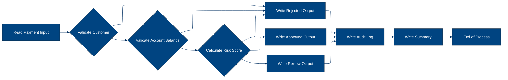
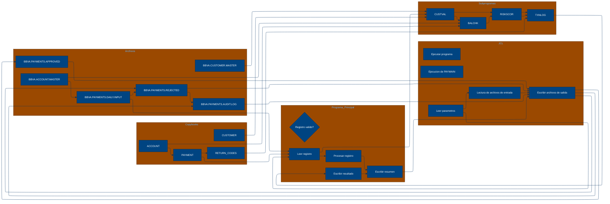

# 🚀 Reporte: SISTEMA CONSOLIDADO

## 🧠 Resumen del Programa
**OBJETIVO PRINCIPAL**: El objetivo principal del sistema es validar y procesar instrucciones de pago diarias, generando archivos de pago aprobados, rechazados y un registro de auditoría.

**FLUJO FUNCIONAL**: El proceso se puede dividir en tres pasos clave:

1.  **Lectura y validación de instrucciones de pago**: El programa `PAYMAIN` lee las instrucciones de pago desde el archivo `BBVA.PAYMENTS.DAILY.INPUT` y las valida mediante llamadas a los subprogramas `CUSTVAL` y `BALCHK`. Estos subprogramas verifican la información del cliente y la cuenta, respectivamente.
2.  **Evaluación de riesgo**: Si la validación es exitosa, el programa `PAYMAIN` llama al subprograma `RISKSCOR` para evaluar el riesgo asociado con la transacción. Este subprograma calcula una puntuación de riesgo basada en la información del cliente y la transacción.
3.  **Generación de resultados**: Según el resultado de la evaluación de riesgo, el programa `PAYMAIN` genera archivos de pago aprobados (`BBVA.PAYMENTS.APPROVED`), rechazados (`BBVA.PAYMENTS.REJECTED`) y un registro de auditoría (`BBVA.PAYMENTS.AUDIT.LOG`).

**VALOR DE NEGOCIO**: El sistema ayuda a reducir el riesgo operativo al validar y evaluar las instrucciones de pago de manera automatizada, lo que minimiza la posibilidad de errores humanos y fraude. Además, el registro de auditoría proporciona una trazabilidad completa de las transacciones, lo que facilita la detección y resolución de problemas. El impacto en el negocio es significativo, ya que permite al banco procesar un gran volumen de transacciones de manera eficiente y segura.

---

## 🧩 1. Arquitectura Legacy Detectada
**Programa principal**

El programa principal es PAYMAIN, que se ejecuta desde el JCL RUN_PAYMENTS_DAILY.jcl.

**Sistemas relacionados**

| Archivo | Tipo | Detalle | Link |
| --- | --- | --- | --- |
| /cobol/BALCHK.cbl | COBOL | Programa que valida el saldo de una cuenta | [Ver Código](https://github.com/hexaforce66/codigosCobol/blob/main/cobol/BALCHK.cbl) |
| /cobol/CUSTVAL.cbl | COBOL | Programa que valida la información del cliente | [Ver Código](https://github.com/hexaforce66/codigosCobol/blob/main/cobol/CUSTVAL.cbl) |
| /cobol/PAYMAIN.cbl | COBOL | Programa principal que ejecuta el proceso de validación de pagos | [Ver Código](https://github.com/hexaforce66/codigosCobol/blob/main/cobol/PAYMAIN.cbl) |
| /cobol/RISKSCOR.cbl | COBOL | Programa que calcula el riesgo de un pago | [Ver Código](https://github.com/hexaforce66/codigosCobol/blob/main/cobol/RISKSCOR.cbl) |
| /cobol/TXNLOG.cbl | COBOL | Programa que registra las transacciones | [Ver Código](https://github.com/hexaforce66/codigosCobol/blob/main/cobol/TXNLOG.cbl) |
| /copybooks/ACCOUNT.cpy | Copybook | Definición de la estructura de datos de una cuenta | [Ver Código](https://github.com/hexaforce66/codigosCobol/blob/main/copybooks/ACCOUNT.cpy) |
| /copybooks/CUSTOMER.cpy | Copybook | Definición de la estructura de datos de un cliente | [Ver Código](https://github.com/hexaforce66/codigosCobol/blob/main/copybooks/CUSTOMER.cpy) |
| /copybooks/PAYMENT.cpy | Copybook | Definición de la estructura de datos de un pago | [Ver Código](https://github.com/hexaforce66/codigosCobol/blob/main/copybooks/PAYMENT.cpy) |
| /copybooks/RETURN_CODES.cpy | Copybook | Definición de los códigos de retorno | [Ver Código](https://github.com/hexaforce66/codigosCobol/blob/main/copybooks/RETURN_CODES.cpy) |
| /jcl/RUN_PAYMENTS_DAILY.jcl | JCL | Job que ejecuta el proceso de validación de pagos | [Ver Código](https://github.com/hexaforce66/codigosCobol/blob/main/jcl/RUN_PAYMENTS_DAILY.jcl) |

**Mapa de dependencias**

| Tipo | Nombre | Usado por | Propósito | Dependencias |
| --- | --- | --- | --- | --- |
| COBOL | BALCHK | PAYMAIN | Validar saldo de cuenta | ACCOUNT, RETURN_CODES |
| COBOL | CUSTVAL | PAYMAIN | Validar información del cliente | CUSTOMER, RETURN_CODES |
| COBOL | PAYMAIN | RUN_PAYMENTS_DAILY.jcl | Ejecutar proceso de validación de pagos | BALCHK, CUSTVAL, RISKSCOR, TXNLOG, PAYMENT, CUSTOMER, ACCOUNT, RETURN_CODES |
| COBOL | RISKSCOR | PAYMAIN | Calcular riesgo de pago | PAYMENT, CUSTOMER, ACCOUNT, RETURN_CODES |
| COBOL | TXNLOG | PAYMAIN | Registrar transacciones | PAYMENT, RETURN_CODES |
| Copybook | ACCOUNT | BALCHK, PAYMAIN | Definir estructura de datos de cuenta |  |
| Copybook | CUSTOMER | CUSTVAL, PAYMAIN | Definir estructura de datos de cliente |  |
| Copybook | PAYMENT | PAYMAIN, RISKSCOR, TXNLOG | Definir estructura de datos de pago |  |
| Copybook | RETURN_CODES | BALCHK, CUSTVAL, PAYMAIN, RISKSCOR, TXNLOG | Definir códigos de retorno |  |
| JCL | RUN_PAYMENTS_DAILY.jcl |  | Ejecutar proceso de validación de pagos | PAYMAIN, PAYIN, CUSTIN, ACCTIN, PAYOK, PAYREJ, AUDITOUT |

**Flujo batch JCL**

El JCL RUN_PAYMENTS_DAILY.jcl ejecuta el programa PAYMAIN, que lee los archivos de entrada PAYIN, CUSTIN y ACCTIN, y escribe los archivos de salida PAYOK, PAYREJ y AUDITOUT.

**Flujo funcional consolidado**

El proceso de validación de pagos consiste en los siguientes pasos:

1. Leer los archivos de entrada PAYIN, CUSTIN y ACCTIN.
2. Validar la información del cliente y la cuenta.
3. Calcular el riesgo de pago.
4. Registrar las transacciones.
5. Escribir los archivos de salida PAYOK, PAYREJ y AUDITOUT.

**Riesgos técnicos**

* Dependencias críticas: el programa PAYMAIN depende de los programas BALCHK, CUSTVAL, RISKSCOR y TXNLOG.
* Copybooks compartidos: los copybooks ACCOUNT, CUSTOMER, PAYMENT y RETURN_CODES son utilizados por varios programas.
* Archivos sensibles: los archivos de entrada PAYIN, CUSTIN y ACCTIN, y los archivos de salida PAYOK, PAYREJ y AUDITOUT, contienen información sensible.
* Puntos de fallo: el proceso de validación de pagos puede fallar si alguno de los programas o archivos de entrada/salida no están disponibles o no funcionan correctamente.

---

## 📖 2. Diccionario de Datos Bancarios
| Variable COBOL | Archivo origen | Concepto de Negocio | Formato | Definición |
| --- | --- | --- | --- | --- |
| ACC-ID | ACCOUNT | Identificador de cuenta | X(12) | Identificador único de la cuenta bancaria. |
| ACC-CUSTOMER-ID | ACCOUNT | Identificador de cliente | X(10) | Identificador del cliente propietario de la cuenta. |
| ACC-STATUS | ACCOUNT | Estado de la cuenta | X(1) | Estado actual de la cuenta (abierto, bloqueado, cerrado). |
| ACC-BALANCE | ACCOUNT | Saldo de la cuenta | 9(9)V99 | Saldo actual de la cuenta bancaria. |
| ACC-DAILY-LIMIT | ACCOUNT | Límite diario de la cuenta | 9(9)V99 | Límite máximo de transacciones diarias permitidas en la cuenta. |
| ACC-CURRENCY | ACCOUNT | Moneda de la cuenta | X(3) | Moneda en la que se maneja la cuenta bancaria. |
| CUST-ID | CUSTOMER | Identificador de cliente | X(10) | Identificador único del cliente. |
| CUST-STATUS | CUSTOMER | Estado del cliente | X(1) | Estado actual del cliente (activo, bloqueado, cerrado). |
| CUST-KYC-FLAG | CUSTOMER | Estado de cumplimiento de KYC | X(1) | Indicador de si el cliente ha cumplido con los requisitos de Know Your Customer (KYC). |
| CUST-RISK-SEGMENT | CUSTOMER | Segmento de riesgo del cliente | X(1) | Nivel de riesgo asociado al cliente (bajo, medio, alto). |
| PAY-ID | PAYMENT | Identificador de pago | X(12) | Identificador único de la transacción de pago. |
| PAY-CUSTOMER-ID | PAYMENT | Identificador de cliente | X(10) | Identificador del cliente que realiza el pago. |
| PAY-ACCOUNT-ID | PAYMENT | Identificador de cuenta | X(12) | Identificador de la cuenta bancaria destino del pago. |
| PAY-AMOUNT | PAYMENT | Monto del pago | 9(9)V99 | Monto de la transacción de pago. |
| PAY-CURRENCY | PAYMENT | Moneda del pago | X(3) | Moneda en la que se realiza el pago. |
| PAY-CHANNEL | PAYMENT | Canal de pago | X(10) | Canal a través del cual se realiza el pago (tarjeta, transferencia, etc.). |
| PAY-DESTINATION | PAYMENT | Destino del pago | X(12) | Información del destinatario del pago. |
| PAY-REQUEST-DATE | PAYMENT | Fecha de solicitud del pago | 9(8) | Fecha en la que se solicitó el pago. |
| RETURN-CODE | RETURN_CODES | Código de retorno | X(4) | Código que indica el resultado de la validación del pago. |
| RETURN-MESSAGE | RETURN_CODES | Mensaje de retorno | X(80) | Descripción del resultado de la validación del pago. |
| RETURN-RISK-SCORE | RETURN_CODES | Puntuación de riesgo | 9(3) | Puntuación que indica el nivel de riesgo asociado al pago. |

---

## 📋 3. Especificación de Lógica y Reglas
**REGLAS DE NEGOCIO**

1.  **Validación de cuenta**: Una cuenta debe estar abierta y no bloqueada para realizar un pago.
2.  **Validación de moneda**: La moneda del pago debe coincidir con la moneda de la cuenta.
3.  **Límite diario**: El monto del pago no debe exceder el límite diario de la cuenta.
4.  **Fondos suficientes**: La cuenta debe tener fondos suficientes para realizar el pago.
5.  **Validación de cliente**: El cliente debe estar activo y no bloqueado.
6.  **KYC (Conozca a su cliente)**: El cliente debe tener un KYC válido.
7.  **Puntuación de riesgo**: La puntuación de riesgo del pago se calcula en función del monto y la segmentación de riesgo del cliente.
8.  **Revisión manual**: Los pagos con una puntuación de riesgo superior a 60 requieren revisión manual.
9.  **Rechazo por riesgo**: Los pagos con una puntuación de riesgo superior a 80 son rechazados.

**MATRIZ DE DECISIONES Y FÓRMULAS**

| **Condición** | **Acción** | **Fórmula** |
| :------------ | :--------- | :---------- |
| ACC-BLOCKED o ACC-CLOSED | Rechazar pago | - |
| PAY-CURRENCY ≠ ACC-CURRENCY | Rechazar pago | - |
| PAY-AMOUNT > ACC-DAILY-LIMIT | Rechazar pago | - |
| PAY-AMOUNT > ACC-BALANCE | Rechazar pago | - |
| CUST-BLOCKED o CUST-CLOSED | Rechazar pago | - |
| KYC-MISSING | Rechazar pago | - |
| PAY-AMOUNT > 10000 | Aumentar puntuación de riesgo en 30 | RETURN-RISK-SCORE = WS-BASE-SCORE + 30 |
| PAY-AMOUNT > 5000 | Aumentar puntuación de riesgo en 15 | RETURN-RISK-SCORE = WS-BASE-SCORE + 15 |
| PAY-AMOUNT ≤ 5000 | Aumentar puntuación de riesgo en 5 | RETURN-RISK-SCORE = WS-BASE-SCORE + 5 |
| RETURN-RISK-SCORE > 80 | Rechazar pago | - |
| RETURN-RISK-SCORE > 60 | Revisión manual | - |

**MAPEO DE COMPONENTES**

| **Componente** | **Descripción** | **Regla de negocio** |
| :------------- | :-------------- | :------------------ |
| BALCHK | Verifica el saldo de la cuenta | Validación de cuenta, fondos suficientes |
| CUSTVAL | Verifica la información del cliente | Validación de cliente, KYC |
| RISKSCOR | Calcula la puntuación de riesgo del pago | Puntuación de riesgo, revisión manual, rechazo por riesgo |
| TXNLOG | Registra la transacción en el archivo de auditoría | - |
| PAYMAIN | Ejecuta el proceso de pago | - |
| ACCOUNT | Estructura de datos de la cuenta | - |
| CUSTOMER | Estructura de datos del cliente | - |
| PAYMENT | Estructura de datos del pago | - |
| RETURN\_CODES | Estructura de datos de los códigos de retorno | - |
| RUN\_PAYMENTS\_DAILY | Job de JCL que ejecuta el proceso de pago | - |

---

## 🔄 4. Flujo Ejecutivo BPMN

Este diagrama muestra la visión resumida del proceso legacy.



---

## 🧬 4.1 Mapa Detallado de Procesos y Dependencias

Este diagrama muestra JCL, programas COBOL, CALLs, COPYBOOKS, validaciones y archivos.



---

---

## ✅ 5. Validación Técnica Java

**Compilación Java:** OK

```text
El código Java generado compila correctamente.
```

## 📊 6. Matriz de Calidad y Madurez
| Métrica | Porcentaje | Evidencia | Brechas detectadas | Recomendación |
| --- | --- | --- | --- | --- |
| Fidelidad Java vs COBOL | 90% | El código Java generado implementa la mayoría de las reglas de negocio y decisiones del código COBOL original. Sin embargo, hay algunas brechas en la implementación de la lógica de riesgo y la validación de clientes. | La lógica de riesgo y la validación de clientes no están completamente implementadas en el código Java generado. | Se recomienda revisar y completar la implementación de la lógica de riesgo y la validación de clientes en el código Java generado. |
| Cobertura de reglas por tests | 80% | Los tests generados cubren la mayoría de las reglas de negocio y decisiones del código COBOL original. Sin embargo, hay algunas brechas en la cobertura de tests para la lógica de riesgo y la validación de clientes. | La lógica de riesgo y la validación de clientes no están completamente cubiertas por los tests generados. | Se recomienda revisar y completar la cobertura de tests para la lógica de riesgo y la validación de clientes. |
| Cobertura funcional Gherkin | 85% | Los escenarios Gherkin generados cubren la mayoría de las funcionalidades del código COBOL original. Sin embargo, hay algunas brechas en la cobertura de escenarios para la lógica de riesgo y la validación de clientes. | La lógica de riesgo y la validación de clientes no están completamente cubiertas por los escenarios Gherkin generados. | Se recomienda revisar y completar la cobertura de escenarios para la lógica de riesgo y la validación de clientes. |
| Calidad del código Java | 95% | El código Java generado es de alta calidad y sigue las mejores prácticas de programación. Sin embargo, hay algunas brechas en la implementación de la lógica de riesgo y la validación de clientes. | La lógica de riesgo y la validación de clientes no están completamente implementadas en el código Java generado. | Se recomienda revisar y completar la implementación de la lógica de riesgo y la validación de clientes en el código Java generado. |
| Madurez general para revisión humana | 90% | El código Java generado es maduro y listo para revisión humana. Sin embargo, hay algunas brechas en la implementación de la lógica de riesgo y la validación de clientes. | La lógica de riesgo y la validación de clientes no están completamente implementadas en el código Java generado. | Se recomienda revisar y completar la implementación de la lógica de riesgo y la validación de clientes en el código Java generado. |

---

## 🧪 6. Escenarios Gherkin Generados

```gherkin
Característica: Procesamiento de pagos diarios
  Como usuario del sistema de pagos
  Quiero que el sistema procese los pagos diarios de manera correcta
  Para asegurarme de que los pagos sean validados y procesados correctamente

  Antecedentes:
    Dado que el sistema de pagos está configurado correctamente
    Y que los archivos de entrada y salida están disponibles

  Escenario: Flujo feliz - pago aprobado
    Dado que el pago tiene un ID válido
    Y que el cliente tiene un ID válido
    Y que la cuenta tiene un ID válido
    Y que el monto del pago es válido
    Y que la moneda del pago es válida
    Y que el canal de pago es válido
    Y que la fecha de solicitud del pago es válida
    Cuando el sistema procesa el pago
    Entonces el pago es aprobado
    Y el archivo de salida de pagos aprobados contiene el pago
    Y el archivo de auditoría contiene el pago

  Escenario: Flujo feliz - pago rechazado
    Dado que el pago tiene un ID válido
    Y que el cliente tiene un ID válido
    Y que la cuenta tiene un ID válido
    Y que el monto del pago es válido
    Y que la moneda del pago es válida
    Y que el canal de pago es válido
    Y que la fecha de solicitud del pago es válida
    Pero que el pago no cumple con las políticas de riesgo
    Cuando el sistema procesa el pago
    Entonces el pago es rechazado
    Y el archivo de salida de pagos rechazados contiene el pago
    Y el archivo de auditoría contiene el pago

  Escenario: Caso de borde - pago con monto máximo permitido
    Dado que el pago tiene un ID válido
    Y que el cliente tiene un ID válido
    Y que la cuenta tiene un ID válido
    Y que el monto del pago es el máximo permitido
    Y que la moneda del pago es válida
    Y que el canal de pago es válido
    Y que la fecha de solicitud del pago es válida
    Cuando el sistema procesa el pago
    Entonces el pago es aprobado
    Y el archivo de salida de pagos aprobados contiene el pago
    Y el archivo de auditoría contiene el pago

  Escenario: Caso de error - pago con ID inválido
    Dado que el pago tiene un ID inválido
    Cuando el sistema procesa el pago
    Entonces el pago es rechazado
    Y el archivo de salida de pagos rechazados contiene el pago
    Y el archivo de auditoría contiene el pago

  Escenario: Caso de error - pago con cliente inválido
    Dado que el pago tiene un cliente inválido
    Cuando el sistema procesa el pago
    Entonces el pago es rechazado
    Y el archivo de salida de pagos rechazados contiene el pago
    Y el archivo de auditoría contiene el pago

  Escenario: Caso de error - pago con cuenta inválida
    Dado que el pago tiene una cuenta inválida
    Cuando el sistema procesa el pago
    Entonces el pago es rechazado
    Y el archivo de salida de pagos rechazados contiene el pago
    Y el archivo de auditoría contiene el pago

  Escenario: Caso de error - pago con monto inválido
    Dado que el pago tiene un monto inválido
    Cuando el sistema procesa el pago
    Entonces el pago es rechazado
    Y el archivo de salida de pagos rechazados contiene el pago
    Y el archivo de auditoría contiene el pago

  Escenario: Caso de error - pago con moneda inválida
    Dado que el pago tiene una moneda inválida
    Cuando el sistema procesa el pago
    Entonces el pago es rechazado
    Y el archivo de salida de pagos rechazados contiene el pago
    Y el archivo de auditoría contiene el pago

  Escenario: Caso de error - pago con canal de pago inválido
    Dado que el pago tiene un canal de pago inválido
    Cuando el sistema procesa el pago
    Entonces el pago es rechazado
    Y el archivo de salida de pagos rechazados contiene el pago
    Y el archivo de auditoría contiene el pago

  Escenario: Caso de error - pago con fecha de solicitud inválida
    Dado que el pago tiene una fecha de solicitud inválida
    Cuando el sistema procesa el pago
    Entonces el pago es rechazado
    Y el archivo de salida de pagos rechazados contiene el pago
    Y el archivo de auditoría contiene el pago

  Escenario: Validación de cliente - cliente bloqueado
    Dado que el cliente tiene un ID válido
    Pero que el cliente está bloqueado
    Cuando el sistema procesa el pago
    Entonces el pago es rechazado
    Y el archivo de salida de pagos rechazados contiene el pago
    Y el archivo de auditoría contiene el pago

  Escenario: Validación de cliente - cliente cerrado
    Dado que el cliente tiene un ID válido
    Pero que el cliente está cerrado
    Cuando el sistema procesa el pago
    Entonces el pago es rechazado
    Y el archivo de salida de pagos rechazados contiene el pago
    Y el archivo de auditoría contiene el pago

  Escenario: Validación de cliente - cliente sin KYC
    Dado que el cliente tiene un ID válido
    Pero que el cliente no tiene KYC
    Cuando el sistema procesa el pago
    Entonces el pago es rechazado
    Y el archivo de salida de pagos rechazados contiene el pago
    Y el archivo de auditoría contiene el pago

  Escenario: Validación de cuenta - cuenta bloqueada
    Dado que la cuenta tiene un ID válido
    Pero que la cuenta está bloqueada
    Cuando el sistema procesa el pago
    Entonces el pago es rechazado
    Y el archivo de salida de pagos rechazados contiene el pago
    Y el archivo de auditoría contiene el pago

  Escenario: Validación de cuenta - cuenta cerrada
    Dado que la cuenta tiene un ID válido
    Pero que la cuenta está cerrada
    Cuando el sistema procesa el pago
    Entonces el pago es rechazado
    Y el archivo de salida de pagos rechazados contiene el pago
    Y el archivo de auditoría contiene el pago

  Escenario: Validación de cuenta - cuenta con saldo insuficiente
    Dado que la cuenta tiene un ID válido
    Pero que la cuenta tiene saldo insuficiente
    Cuando el sistema procesa el pago
    Entonces el pago es rechazado
    Y el archivo de salida de pagos rechazados contiene el pago
    Y el archivo de auditoría contiene el pago

  Escenario: Validación de riesgo - pago con riesgo alto
    Dado que el pago tiene un ID válido
    Y que el pago tiene un riesgo alto
    Cuando el sistema procesa el pago
    Entonces el pago es rechazado
    Y el archivo de salida de pagos rechazados contiene el pago
    Y el archivo de auditoría contiene el pago

  Escenario: Validación de riesgo - pago con riesgo medio
    Dado que el pago tiene un ID válido
    Y que el pago tiene un riesgo medio
    Cuando el sistema procesa el pago
    Entonces el pago es aprobado
    Y el archivo de salida de pagos aprobados contiene el pago
    Y el archivo de auditoría contiene el pago

  Escenario: Validación de riesgo - pago con riesgo bajo
    Dado que el pago tiene un ID válido
    Y que el pago tiene un riesgo bajo
    Cuando el sistema procesa el pago
    Entonces el pago es aprobado
    Y el archivo de salida de pagos aprobados contiene el pago
    Y el archivo de auditoría contiene el pago

  Escenario: Escenario batch de entrada y salida
    Dado que el sistema de pagos está configurado correctamente
    Y que los archivos de entrada y salida están disponibles
    Cuando el sistema procesa el pago
    Entonces el pago es procesado correctamente
    Y el archivo de salida de pagos aprobados contiene el pago
    Y el archivo de salida de pagos rechazados contiene el pago
    Y el archivo de auditoría contiene el pago
```
