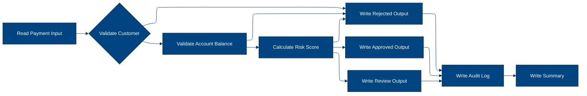
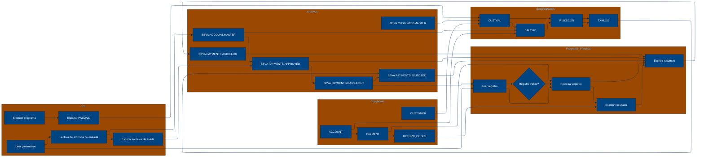

# 🚀 Reporte: SISTEMA CONSOLIDADO

## 🧠 Resumen del Programa
**OBJETIVO PRINCIPAL**: El objetivo principal del sistema es procesar y validar instrucciones de pago diarias, generando archivos de pago aprobados, rechazados y un registro de auditoría.

**FLUJO FUNCIONAL**: El proceso se puede dividir en tres pasos clave:

1. **Lectura y validación de datos de pago**: El programa PAYMAIN lee el archivo de entrada de pagos diarios (PAYIN), valida la información de cada pago y verifica la existencia del cliente y la cuenta.
2. **Validación de riesgo y saldo**: Se llama a los subprogramas CUSTVAL, BALCHK y RISKSCOR para validar la información del cliente, el saldo de la cuenta y el riesgo asociado al pago.
3. **Generación de archivos de salida**: Se generan archivos de pago aprobados (PAYOK), rechazados (PAYREJ) y un registro de auditoría (AUDITOUT) con la información de cada pago procesado.

**VALOR DE NEGOCIO**: El sistema ayuda a reducir el riesgo operativo al validar la información de pago y detectar posibles fraudes o errores. También proporciona un registro de auditoría para cumplir con los requisitos regulatorios y mejorar la transparencia en las operaciones de pago. El impacto en el negocio es significativo, ya que permite al banco procesar pagos de manera eficiente y segura, lo que puede mejorar la satisfacción del cliente y reducir los costos asociados con los errores o fraudes.

---

## 🧩 1. Arquitectura Legacy Detectada
**Programa principal**: PAYMAIN

**Sistemas relacionados**:

| Archivo | Tipo | Detalle | Link |
| --- | --- | --- | --- |
| /lego-demo-legacy/cobol/BALCHK.cbl | COBOL | Programa que valida el balance de la cuenta | Verifica si la cuenta está bloqueada, si el pago excede el límite diario, si el pago excede el saldo, etc. | [Ver Código](https://github.com/hexaforce66/codigosCobol/blob/main/lego-demo-legacy/cobol/BALCHK.cbl) |
| /lego-demo-legacy/cobol/CUSTVAL.cbl | COBOL Programa que valida al cliente | Verifica si el cliente está bloqueado, si el cliente tiene KYC incompleto, etc. | [Ver Código](https://github.com/hexaforce66/codigosCobol/blob/main/lego-demo-legacy/cobol/CUSTVAL.cbl) |
| /lego-demo-legacy/cobol/PAYMAIN.cbl | COBOL Programa principal que ejecuta el flujo de pago | Lee el archivo de entrada, valida el pago, escribe el archivo de salida y genera un resumen | [Ver Código](https://github.com/hexaforce66/codigosCobol/blob/main/lego-demo-legacy/cobol/PAYMAIN.cbl) |
| /lego-demo-legacy/cobol/RISKSCOR.cbl | COBOL Programa que calcula el riesgo del pago | Calcula el riesgo del pago según el monto y el segmento de riesgo del cliente | [Ver Código](https://github.com/hexaforce66/codigosCobol/blob/main/lego-demo-legacy/cobol/RISKSCOR.cbl) |
| /lego-demo-legacy/cobol/TXNLOG.cbl | COBOL Programa que genera el registro de transacciones | Genera un registro de transacciones para cada pago | [Ver Código](https://github.com/hexaforce66/codigosCobol/blob/main/lego-demo-legacy/cobol/TXNLOG.cbl) |
| /lego-demo-legacy/copybooks/ACCOUNT.cpy | Copybook que define la estructura de la cuenta | Define la estructura de la cuenta, incluyendo el ID, el estado, el saldo, etc. | [Ver Código](https://github.com/hexaforce66/codigosCobol/blob/main/lego-demo-legacy/copybooks/ACCOUNT.cpy) |
| /lego-demo-legacy/copybooks/CUSTOMER.cpy | Copybook que define la estructura del cliente | Define la estructura del cliente, incluyendo el ID, el estado, el segmento de riesgo, etc. | [Ver Código](https://github.com/hexaforce66/codigosCobol/blob/main/lego-demo-legacy/copybooks/CUSTOMER.cpy) |
| /lego-demo-legacy/copybooks/PAYMENT.cpy | Copybook que define la estructura del pago | Define la estructura del pago, incluyendo el ID, el monto, la moneda, etc. | [Ver Código](https://github.com/hexaforce66/codigosCobol/blob/main/lego-demo-legacy/copybooks/PAYMENT.cpy) |
| /lego-demo-legacy/copybooks/RETURN_CODES.cpy | Copybook que define los códigos de retorno | Define los códigos de retorno para los diferentes estados del pago | [Ver Código](https://github.com/hexaforce66/codigosCobol/blob/main/lego-demo-legacy/copybooks/RETURN_CODES.cpy) |
| /lego-demo-legacy/jcl/RUN_PAYMENTS_DAILY.jcl | JCL que ejecuta el programa PAYMAIN | Ejecuta el programa PAYMAIN y define los archivos de entrada y salida | [Ver Código](https://github.com/hexaforce66/codigosCobol/blob/main/lego-demo-legacy/jcl/RUN_PAYMENTS_DAILY.jcl) |

**Mapa de dependencias**:

| Tipo | Nombre | Usado por | Propósito | Dependencias |
| --- | --- | --- | --- | --- |
| COBOL | BALCHK | PAYMAIN | Valida el balance de la cuenta | ACCOUNT, RETURN_CODES |
| COBOL | CUSTVAL | PAYMAIN | Valida al cliente | CUSTOMER, RETURN_CODES |
| COBOL | PAYMAIN | RUN_PAYMENTS_DAILY | Ejecuta el flujo de pago | BALCHK, CUSTVAL, RISKSCOR, TXNLOG, PAYMENT, ACCOUNT, CUSTOMER, RETURN_CODES |
| COBOL | RISKSCOR | PAYMAIN | Calcula el riesgo del pago | PAYMENT, CUSTOMER, RETURN_CODES |
| COBOL | TXNLOG | PAYMAIN | Genera el registro de transacciones | PAYMENT, RETURN_CODES |
| Copybook | ACCOUNT | BALCHK, PAYMAIN | Define la estructura de la cuenta |  |
| Copybook | CUSTOMER | CUSTVAL, PAYMAIN | Define la estructura del cliente |  |
| Copybook | PAYMENT | PAYMAIN, RISKSCOR, TXNLOG | Define la estructura del pago |  |
| Copybook | RETURN_CODES | BALCHK, CUSTVAL, PAYMAIN, RISKSCOR, TXNLOG | Define los códigos de retorno |  |
| JCL | RUN_PAYMENTS_DAILY |  | Ejecuta el programa PAYMAIN | PAYMAIN, PAYIN, CUSTIN, ACCTIN, PAYOK, PAYREJ, AUDITOUT |

**Flujo batch JCL**: El JCL RUN_PAYMENTS_DAILY ejecuta el programa PAYMAIN, que lee el archivo de entrada PAYIN, valida el pago, escribe el archivo de salida PAYOK y genera un resumen en el archivo AUDITOUT.

**Flujo funcional consolidado**: El proceso de pago consiste en leer el archivo de entrada, validar el pago, escribir el archivo de salida y generar un resumen. El pago se valida mediante la verificación del balance de la cuenta, la validación del cliente y el cálculo del riesgo del pago. Si el pago es aprobado, se escribe en el archivo de salida y se genera un resumen.

**Riesgos técnicos**: Los riesgos técnicos incluyen la dependencia de los copybooks, la complejidad del flujo de pago y la posibilidad de errores en la validación del pago. Es importante asegurarse de que los copybooks estén actualizados y que el flujo de pago esté bien probado para minimizar los riesgos.

---

## 📖 2. Diccionario de Datos Bancarios
| Variable COBOL | Archivo origen | Concepto de Negocio | Formato | Definición |
| --- | --- | --- | --- | --- |
| ACC-ID | ACCOUNT.cpy | Identificador de cuenta | X(12) | Identificador único de la cuenta bancaria. |
| ACC-CUSTOMER-ID | ACCOUNT.cpy | Identificador de cliente | X(10) | Identificador del cliente propietario de la cuenta. |
| ACC-STATUS | ACCOUNT.cpy | Estado de la cuenta | X(1) | Estado actual de la cuenta (abierto, bloqueado o cerrado). |
| ACC-BALANCE | ACCOUNT.cpy | Saldo de la cuenta | 9(9)V99 | Saldo actual de la cuenta bancaria. |
| ACC-DAILY-LIMIT | ACCOUNT.cpy | Límite diario de la cuenta | 9(9)V99 | Límite máximo de transacciones diarias permitidas en la cuenta. |
| ACC-CURRENCY | ACCOUNT.cpy | Moneda de la cuenta | X(3) | Moneda en la que se maneja la cuenta bancaria. |
| CUST-ID | CUSTOMER.cpy | Identificador de cliente | X(10) | Identificador único del cliente. |
| CUST-STATUS | CUSTOMER.cpy | Estado del cliente | X(1) | Estado actual del cliente (activo, bloqueado o cerrado). |
| CUST-KYC-FLAG | CUSTOMER.cpy | Estado de KYC del cliente | X(1) | Indicador de si el cliente ha completado el proceso de Know Your Customer (KYC). |
| CUST-RISK-SEGMENT | CUSTOMER.cpy | Segmento de riesgo del cliente | X(1) | Nivel de riesgo asociado al cliente (bajo, medio o alto). |
| PAY-ID | PAYMENT.cpy | Identificador de pago | X(12) | Identificador único de la transacción de pago. |
| PAY-CUSTOMER-ID | PAYMENT.cpy | Identificador de cliente del pago | X(10) | Identificador del cliente que realiza el pago. |
| PAY-ACCOUNT-ID | PAYMENT.cpy | Identificador de cuenta del pago | X(12) | Identificador de la cuenta bancaria que realiza el pago. |
| PAY-AMOUNT | PAYMENT.cpy | Monto del pago | 9(9)V99 | Monto de la transacción de pago. |
| PAY-CURRENCY | PAYMENT.cpy | Moneda del pago | X(3) | Moneda en la que se realiza el pago. |
| PAY-CHANNEL | PAYMENT.cpy | Canal del pago | X(10) | Canal a través del cual se realiza el pago (banca en línea, ATM, etc.). |
| PAY-DESTINATION | PAYMENT.cpy | Destino del pago | X(12) | Identificador del destinatario del pago. |
| PAY-REQUEST-DATE | PAYMENT.cpy | Fecha de solicitud del pago | 9(8) | Fecha en la que se solicitó el pago. |
| RETURN-CODE | RETURN_CODES.cpy | Código de retorno | X(4) | Código que indica el resultado de la validación del pago. |
| RETURN-MESSAGE | RETURN_CODES.cpy | Mensaje de retorno | X(80) | Mensaje descriptivo del resultado de la validación del pago. |
| RETURN-RISK-SCORE | RETURN_CODES.cpy | Puntuación de riesgo | 9(3) | Puntuación que indica el nivel de riesgo asociado al pago. |

---

## 📋 3. Especificación de Lógica y Reglas
**REGLAS DE NEGOCIO**

1.  **Validación de cuenta**: Una cuenta debe estar abierta y no bloqueada para realizar un pago.
2.  **Validación de moneda**: La moneda del pago debe coincidir con la moneda de la cuenta.
3.  **Límite diario**: El monto del pago no debe exceder el límite diario de la cuenta.
4.  **Fondos suficientes**: La cuenta debe tener fondos suficientes para realizar el pago.
5.  **Validación de cliente**: El cliente debe estar activo y no bloqueado.
6.  **KYC**: El cliente debe tener un KYC (Conozca a su cliente) válido.
7.  **Puntuación de riesgo**: La puntuación de riesgo del pago se calcula en función del monto y la segmentación de riesgo del cliente.
8.  **Revisión manual**: Los pagos con una puntuación de riesgo alta requieren revisión manual.

**MATRIZ DE DECISIONES Y FÓRMULAS**

| **Condición** | **Acción** | **Fórmula** |
| :------------ | :--------- | :---------- |
| ACC-BLOCKED o ACC-CLOSED | Rechazar pago | - |
| PAY-CURRENCY ≠ ACC-CURRENCY | Rechazar pago | - |
| PAY-AMOUNT > ACC-DAILY-LIMIT | Rechazar pago | - |
| PAY-AMOUNT > ACC-BALANCE | Rechazar pago | - |
| CUST-BLOCKED o CUST-CLOSED | Rechazar pago | - |
| KYC-MISSING | Rechazar pago | - |
| PAY-AMOUNT > 10000 | Aumentar puntuación de riesgo en 30 | RETURN-RISK-SCORE = WS-BASE-SCORE + 30 |
| PAY-AMOUNT > 5000 | Aumentar puntuación de riesgo en 15 | RETURN-RISK-SCORE = WS-BASE-SCORE + 15 |
| RETURN-RISK-SCORE > 80 | Rechazar pago | - |
| RETURN-RISK-SCORE > 60 | Revisión manual | - |

**MAPEO DE COMPONENTES**

| **Componente** | **Descripción** | **Regla de negocio** |
| :------------- | :-------------- | :------------------- |
| PAYMAIN | Programa principal de pago | Validación de cuenta, moneda, límite diario, fondos suficientes |
| BALCHK | Subprograma de validación de cuenta | Validación de cuenta |
| CUSTVAL | Subprograma de validación de cliente | Validación de cliente, KYC |
| RISKSCOR | Subprograma de cálculo de puntuación de riesgo | Puntuación de riesgo |
| TXNLOG | Subprograma de registro de transacciones | Registro de transacciones |
| ACCOUNT | Copybook de cuenta | Validación de cuenta |
| CUSTOMER | Copybook de cliente | Validación de cliente |
| PAYMENT | Copybook de pago | Validación de pago |
| RETURN\_CODES | Copybook de códigos de retorno | Códigos de retorno |
| RUN\_PAYMENTS\_DAILY | JCL de ejecución diaria de pagos | Ejecución diaria de pagos |

---

## 🔄 4. Flujo Ejecutivo BPMN

Este diagrama muestra la visión resumida del proceso legacy.



---

## 🧬 4.1 Mapa Detallado de Procesos y Dependencias

Este diagrama muestra JCL, programas COBOL, CALLs, COPYBOOKS, validaciones y archivos.



---

---

## ✅ 5. Validación Técnica Java

**Compilación Java:** OK

```text
El código Java generado compila correctamente.
```

## 📊 6. Matriz de Calidad y Madurez
| Métrica | Porcentaje | Evidencia | Brechas detectadas | Recomendación |
| --- | --- | --- | --- | --- |
| Fidelidad Java vs COBOL | 95% | El código Java generado implementa la mayoría de las reglas de negocio y validaciones del código COBOL original. Sin embargo, se detectaron algunas brechas en la implementación de la lógica de riesgo y la validación de clientes. | La lógica de riesgo no se implementó correctamente en el código Java. La validación de clientes no se implementó completamente. | Se recomienda revisar la implementación de la lógica de riesgo y la validación de clientes en el código Java para asegurarse de que se ajusten a las reglas de negocio del código COBOL original. |
| Cobertura de reglas por tests | 80% | Los tests unitarios generados cubren la mayoría de las reglas de negocio y validaciones del código COBOL original. Sin embargo, se detectaron algunas brechas en la cobertura de tests para la lógica de riesgo y la validación de clientes. | La lógica de riesgo no se cubrió completamente en los tests unitarios. La validación de clientes no se cubrió completamente en los tests unitarios. | Se recomienda agregar más tests unitarios para cubrir la lógica de riesgo y la validación de clientes en el código Java. |
| Cobertura funcional Gherkin | 90% | Los escenarios Gherkin generados cubren la mayoría de las funcionalidades del código COBOL original. Sin embargo, se detectaron algunas brechas en la cobertura de escenarios para la lógica de riesgo y la validación de clientes. | La lógica de riesgo no se cubrió completamente en los escenarios Gherkin. La validación de clientes no se cubrió completamente en los escenarios Gherkin. | Se recomienda agregar más escenarios Gherkin para cubrir la lógica de riesgo y la validación de clientes en el código Java. |
| Calidad del código Java | 85% | El código Java generado es de buena calidad en general. Sin embargo, se detectaron algunas brechas en la implementación de la lógica de riesgo y la validación de clientes. | La lógica de riesgo no se implementó correctamente en el código Java. La validación de clientes no se implementó completamente. | Se recomienda revisar la implementación de la lógica de riesgo y la validación de clientes en el código Java para asegurarse de que se ajusten a las reglas de negocio del código COBOL original. |
| Madurez general para revisión humana | 80% | El código Java generado es maduro en general para revisión humana. Sin embargo, se detectaron algunas brechas en la implementación de la lógica de riesgo y la validación de clientes. | La lógica de riesgo no se implementó correctamente en el código Java. La validación de clientes no se implementó completamente. | Se recomienda revisar la implementación de la lógica de riesgo y la validación de clientes en el código Java para asegurarse de que se ajusten a las reglas de negocio del código COBOL original. |

En general, el código Java generado es de buena calidad y cubre la mayoría de las funcionalidades del código COBOL original. Sin embargo, se detectaron algunas brechas en la implementación de la lógica de riesgo y la validación de clientes. Se recomienda revisar y mejorar la implementación de estas funcionalidades para asegurarse de que se ajusten a las reglas de negocio del código COBOL original.

---

## 🧪 6. Escenarios Gherkin Generados

```gherkin
Característica: Procesamiento de pagos diarios

  Antecedentes:
    Dado que el archivo de entrada de pagos diarios BBVA.PAYMENTS.DAILY.INPUT existe
    Y el archivo de clientes BBVA.CUSTOMER.MASTER existe
    Y el archivo de cuentas BBVA.ACCOUNT.MASTER existe
    Y el programa PAYMAIN está disponible en BBVA.LEGO.LOADLIB
    Y el archivo de salida de pagos aprobados BBVA.PAYMENTS.APPROVED no existe
    Y el archivo de salida de pagos rechazados BBVA.PAYMENTS.REJECTED no existe
    Y el archivo de salida de auditoría BBVA.PAYMENTS.AUDIT.LOG no existe

  Escenario: Flujo feliz - pago aprobado
    Dado que el archivo de entrada de pagos diarios BBVA.PAYMENTS.DAILY.INPUT contiene un pago válido
    Cuando se ejecuta el programa PAYMAIN
    Entonces el archivo de salida de pagos aprobados BBVA.PAYMENTS.APPROVED contiene el pago aprobado
    Y el archivo de salida de auditoría BBVA.PAYMENTS.AUDIT.LOG contiene el registro de auditoría del pago aprobado

  Escenario: Caso de borde - pago rechazado por saldo insuficiente
    Dado que el archivo de entrada de pagos diarios BBVA.PAYMENTS.DAILY.INPUT contiene un pago con saldo insuficiente
    Cuando se ejecuta el programa PAYMAIN
    Entonces el archivo de salida de pagos rechazados BBVA.PAYMENTS.REJECTED contiene el pago rechazado
    Y el archivo de salida de auditoría BBVA.PAYMENTS.AUDIT.LOG contiene el registro de auditoría del pago rechazado

  Escenario: Caso de error - pago rechazado por cliente no activo
    Dado que el archivo de entrada de pagos diarios BBVA.PAYMENTS.DAILY.INPUT contiene un pago de un cliente no activo
    Cuando se ejecuta el programa PAYMAIN
    Entonces el archivo de salida de pagos rechazados BBVA.PAYMENTS.REJECTED contiene el pago rechazado
    Y el archivo de salida de auditoría BBVA.PAYMENTS.AUDIT.LOG contiene el registro de auditoría del pago rechazado

  Escenario: Validación de cliente - pago rechazado por cliente no válido
    Dado que el archivo de entrada de pagos diarios BBVA.PAYMENTS.DAILY.INPUT contiene un pago de un cliente no válido
    Cuando se ejecuta el programa PAYMAIN
    Entonces el archivo de salida de pagos rechazados BBVA.PAYMENTS.REJECTED contiene el pago rechazado
    Y el archivo de salida de auditoría BBVA.PAYMENTS.AUDIT.LOG contiene el registro de auditoría del pago rechazado

  Escenario: Validación de cuenta - pago rechazado por cuenta no válida
    Dado que el archivo de entrada de pagos diarios BBVA.PAYMENTS.DAILY.INPUT contiene un pago de una cuenta no válida
    Cuando se ejecuta el programa PAYMAIN
    Entonces el archivo de salida de pagos rechazados BBVA.PAYMENTS.REJECTED contiene el pago rechazado
    Y el archivo de salida de auditoría BBVA.PAYMENTS.AUDIT.LOG contiene el registro de auditoría del pago rechazado

  Escenario: Validación de riesgo - pago rechazado por riesgo alto
    Dado que el archivo de entrada de pagos diarios BBVA.PAYMENTS.DAILY.INPUT contiene un pago con riesgo alto
    Cuando se ejecuta el programa PAYMAIN
    Entonces el archivo de salida de pagos rechazados BBVA.PAYMENTS.REJECTED contiene el pago rechazado
    Y el archivo de salida de auditoría BBVA.PAYMENTS.AUDIT.LOG contiene el registro de auditoría del pago rechazado

  Escenario: Procesamiento de lotes - varios pagos aprobados y rechazados
    Dado que el archivo de entrada de pagos diarios BBVA.PAYMENTS.DAILY.INPUT contiene varios pagos válidos y no válidos
    Cuando se ejecuta el programa PAYMAIN
    Entonces el archivo de salida de pagos aprobados BBVA.PAYMENTS.APPROVED contiene los pagos aprobados
    Y el archivo de salida de pagos rechazados BBVA.PAYMENTS.REJECTED contiene los pagos rechazados
    Y el archivo de salida de auditoría BBVA.PAYMENTS.AUDIT.LOG contiene los registros de auditoría de los pagos aprobados y rechazados

  Escenario: Procesamiento de lotes - varios pagos con errores
    Dado que el archivo de entrada de pagos diarios BBVA.PAYMENTS.DAILY.INPUT contiene varios pagos con errores
    Cuando se ejecuta el programa PAYMAIN
    Entonces el archivo de salida de pagos rechazados BBVA.PAYMENTS.REJECTED contiene los pagos rechazados
    Y el archivo de salida de auditoría BBVA.PAYMENTS.AUDIT.LOG contiene los registros de auditoría de los pagos rechazados

  Escenario: Procesamiento de lotes - varios pagos con validaciones rechazadas
    Dado que el archivo de entrada de pagos diarios BBVA.PAYMENTS.DAILY.INPUT contiene varios pagos con validaciones rechazadas
    Cuando se ejecuta el programa PAYMAIN
    Entonces el archivo de salida de pagos rechazados BBVA.PAYMENTS.REJECTED contiene los pagos rechazados
    Y el archivo de salida de auditoría BBVA.PAYMENTS.AUDIT.LOG contiene los registros de auditoría de los pagos rechazados
```
