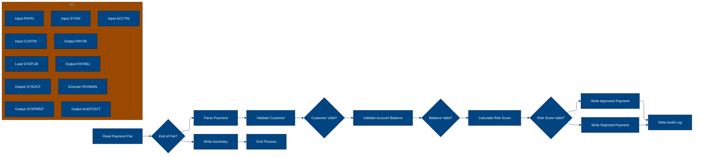
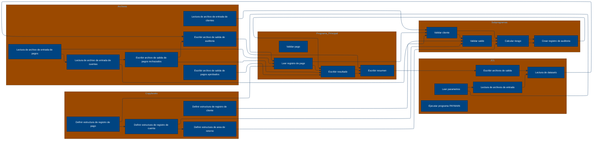

# 🚀 Reporte: SISTEMA CONSOLIDADO

## 🧠 Resumen del Programa
**OBJETIVO PRINCIPAL**: El objetivo principal del sistema es procesar y validar instrucciones de pago diarias, generando archivos de pago aprobados, rechazados y un registro de auditoría.

**FLUJO FUNCIONAL**: El proceso se divide en tres pasos clave:

1. **Lectura y validación de instrucciones de pago**: El programa PAYMAIN lee las instrucciones de pago desde el archivo de entrada PAYIN y las valida mediante llamadas a los subprogramas CUSTVAL, BALCHK y RISKSCOR.
2. **Validación de clientes y cuentas**: Los subprogramas CUSTVAL y BALCHK validan la información del cliente y la cuenta asociada a cada instrucción de pago, respectivamente.
3. **Cálculo de riesgo y generación de resultados**: El subprograma RISKSCOR calcula el riesgo asociado a cada instrucción de pago y, en función de este, determina si la instrucción es aprobada, rechazada o requiere revisión manual. Los resultados se escriben en los archivos de pago aprobados, rechazados y en el registro de auditoría.

**VALOR DE NEGOCIO**: El sistema ayuda a reducir el riesgo operativo al validar y procesar instrucciones de pago de manera eficiente y segura. El impacto en el negocio es significativo, ya que permite al banco procesar un gran volumen de pagos diarios de manera confiable y minimizar el riesgo de errores o fraudes.

---

## 🧩 1. Arquitectura Legacy Detectada
**Programa principal**
El programa principal es PAYMAIN, que se ejecuta desde el JCL RUN_PAYMENTS_DAILY.jcl.

**Sistemas relacionados**

| Archivo | Tipo | Detalle | Link |
| --- | --- | --- | --- |
| /lego-demo-legacy/cobol/BALCHK.cbl | COBOL | Programa que valida el saldo de una cuenta | [Ver Código](https://github.com/hexaforce66/codigosCobol/blob/main/lego-demo-legacy/cobol/BALCHK.cbl) |
| /lego-demo-legacy/cobol/CUSTVAL.cbl | COBOL | Programa que valida la información del cliente | [Ver Código](https://github.com/hexaforce66/codigosCobol/blob/main/lego-demo-legacy/cobol/CUSTVAL.cbl) |
| /lego-demo-legacy/cobol/PAYMAIN.cbl | COBOL | Programa principal que ejecuta el proceso de pago | [Ver Código](https://github.com/hexaforce66/codigosCobol/blob/main/lego-demo-legacy/cobol/PAYMAIN.cbl) |
| /lego-demo-legacy/cobol/RISKSCOR.cbl | COBOL | Programa que calcula el riesgo de una transacción | [Ver Código](https://github.com/hexaforce66/codigosCobol/blob/main/lego-demo-legacy/cobol/RISKSCOR.cbl) |
| /lego-demo-legacy/cobol/TXNLOG.cbl | COBOL | Programa que registra las transacciones en un archivo de auditoría | [Ver Código](https://github.com/hexaforce66/codigosCobol/blob/main/lego-demo-legacy/cobol/TXNLOG.cbl) |
| /lego-demo-legacy/copybooks/ACCOUNT.cpy | COPYBOOK | Definición de la estructura de datos de una cuenta | [Ver Código](https://github.com/hexaforce66/codigosCobol/blob/main/lego-demo-legacy/copybooks/ACCOUNT.cpy) |
| /lego-demo-legacy/copybooks/CUSTOMER.cpy | COPYBOOK | Definición de la estructura de datos de un cliente | [Ver Código](https://github.com/hexaforce66/codigosCobol/blob/main/lego-demo-legacy/copybooks/CUSTOMER.cpy) |
| /lego-demo-legacy/copybooks/PAYMENT.cpy | COPYBOOK | Definición de la estructura de datos de un pago | [Ver Código](https://github.com/hexaforce66/codigosCobol/blob/main/lego-demo-legacy/copybooks/PAYMENT.cpy) |
| /lego-demo-legacy/copybooks/RETURN_CODES.cpy | COPYBOOK | Definición de los códigos de retorno del proceso de pago | [Ver Código](https://github.com/hexaforce66/codigosCobol/blob/main/lego-demo-legacy/copybooks/RETURN_CODES.cpy) |
| /lego-demo-legacy/jcl/RUN_PAYMENTS_DAILY.jcl | JCL | Job que ejecuta el proceso de pago diario | [Ver Código](https://github.com/hexaforce66/codigosCobol/blob/main/lego-demo-legacy/jcl/RUN_PAYMENTS_DAILY.jcl) |

**Mapa de dependencias**

| Tipo | Nombre | Usado por | Propósito | Dependencias |
| --- | --- | --- | --- | --- |
| COBOL | BALCHK | PAYMAIN | Validar saldo de cuenta | ACCOUNT, RETURN_CODES |
| COBOL | CUSTVAL | PAYMAIN | Validar información del cliente | CUSTOMER, RETURN_CODES |
| COBOL | PAYMAIN | RUN_PAYMENTS_DAILY.jcl | Ejecutar proceso de pago | BALCHK, CUSTVAL, RISKSCOR, TXNLOG, PAYMENT, CUSTOMER, ACCOUNT, RETURN_CODES |
| COBOL | RISKSCOR | PAYMAIN | Calcular riesgo de transacción | PAYMENT, CUSTOMER, ACCOUNT, RETURN_CODES |
| COBOL | TXNLOG | PAYMAIN | Registrar transacciones en archivo de auditoría | PAYMENT, RETURN_CODES |
| COPYBOOK | ACCOUNT | BALCHK, PAYMAIN | Definir estructura de datos de cuenta |  |
| COPYBOOK | CUSTOMER | CUSTVAL, PAYMAIN | Definir estructura de datos de cliente |  |
| COPYBOOK | PAYMENT | PAYMAIN, RISKSCOR, TXNLOG | Definir estructura de datos de pago |  |
| COPYBOOK | RETURN_CODES | BALCHK, CUSTVAL, PAYMAIN, RISKSCOR, TXNLOG | Definir códigos de retorno del proceso de pago |  |
| JCL | RUN_PAYMENTS_DAILY.jcl |  | Ejecutar proceso de pago diario | PAYMAIN, PAYIN, CUSTIN, ACCTIN, PAYOK, PAYREJ, AUDITOUT |

**Flujo batch JCL**
El JCL RUN_PAYMENTS_DAILY.jcl ejecuta el programa PAYMAIN, que lee los archivos de entrada PAYIN, CUSTIN y ACCTIN, y escribe los archivos de salida PAYOK, PAYREJ y AUDITOUT.

**Flujo funcional consolidado**
El proceso de pago diario lee las instrucciones de pago del archivo PAYIN, valida la información del cliente y la cuenta, calcula el riesgo de la transacción y registra las transacciones en un archivo de auditoría. Si la transacción es aprobada, se escribe en el archivo PAYOK, si es rechazada, se escribe en el archivo PAYREJ.

**Riesgos técnicos**
* Dependencias críticas: el programa PAYMAIN depende de los programas BALCHK, CUSTVAL, RISKSCOR y TXNLOG, y de los copybooks ACCOUNT, CUSTOMER, PAYMENT y RETURN_CODES.
* Copybooks compartidos: los copybooks ACCOUNT, CUSTOMER, PAYMENT y RETURN_CODES son utilizados por varios programas.
* Archivos sensibles: los archivos PAYIN, CUSTIN y ACCTIN contienen información sensible y deben ser protegidos.
* Puntos de fallo: el proceso de pago diario puede fallar si alguno de los programas o copybooks dependientes no están disponibles o si los archivos de entrada o salida no están configurados correctamente.

---

## 📖 2. Diccionario de Datos Bancarios
| Variable COBOL | Archivo origen | Concepto de Negocio | Formato | Definición |
| --- | --- | --- | --- | --- |
| ACC-ID | ACCOUNT | Identificador de cuenta | X(12) | Identificador único de la cuenta bancaria. |
| ACC-CUSTOMER-ID | ACCOUNT | Identificador de cliente | X(10) | Identificador del cliente propietario de la cuenta. |
| ACC-STATUS | ACCOUNT | Estado de la cuenta | X(1) | Estado actual de la cuenta (abierto, bloqueado o cerrado). |
| ACC-BALANCE | ACCOUNT | Saldo de la cuenta | 9(9)V99 | Saldo actual de la cuenta bancaria. |
| ACC-DAILY-LIMIT | ACCOUNT | Límite diario de la cuenta | 9(9)V99 | Límite máximo de transacciones diarias permitidas en la cuenta. |
| ACC-CURRENCY | ACCOUNT | Moneda de la cuenta | X(3) | Moneda en la que se maneja la cuenta bancaria. |
| CUST-ID | CUSTOMER | Identificador de cliente | X(10) | Identificador único del cliente. |
| CUST-STATUS | CUSTOMER | Estado del cliente | X(1) | Estado actual del cliente (activo, bloqueado o cerrado). |
| CUST-KYC-FLAG | CUSTOMER | Estado de cumplimiento de KYC | X(1) | Indicador de si el cliente ha cumplido con los requisitos de Know Your Customer (KYC). |
| CUST-RISK-SEGMENT | CUSTOMER | Segmento de riesgo del cliente | X(1) | Nivel de riesgo asignado al cliente (bajo, medio o alto). |
| PAY-ID | PAYMENT | Identificador de pago | X(12) | Identificador único de la transacción de pago. |
| PAY-CUSTOMER-ID | PAYMENT | Identificador de cliente | X(10) | Identificador del cliente que realiza el pago. |
| PAY-ACCOUNT-ID | PAYMENT | Identificador de cuenta | X(12) | Identificador de la cuenta bancaria involucrada en el pago. |
| PAY-AMOUNT | PAYMENT | Monto del pago | 9(9)V99 | Monto de la transacción de pago. |
| PAY-CURRENCY | PAYMENT | Moneda del pago | X(3) | Moneda en la que se realiza el pago. |
| PAY-CHANNEL | PAYMENT | Canal de pago | X(10) | Canal a través del cual se realiza el pago (por ejemplo, transferencia bancaria, tarjeta de crédito, etc.). |
| PAY-DESTINATION | PAYMENT | Destino del pago | X(12) | Identificador del destinatario del pago. |
| PAY-REQUEST-DATE | PAYMENT | Fecha de solicitud del pago | 9(8) | Fecha en la que se solicitó el pago. |
| RETURN-CODE | RETURN_CODES | Código de retorno | X(4) | Código que indica el resultado de la validación del pago (aprobado, rechazado, en revisión, etc.). |
| RETURN-MESSAGE | RETURN_CODES | Mensaje de retorno | X(80) | Mensaje descriptivo del resultado de la validación del pago. |
| RETURN-RISK-SCORE | RETURN_CODES | Puntuación de riesgo | 9(3) | Puntuación de riesgo asignada a la transacción de pago. |

---

## 📋 3. Especificación de Lógica y Reglas
**REGLAS DE NEGOCIO**

1.  **Validación de cuenta**: Una cuenta debe estar abierta y no bloqueada para realizar pagos.
2.  **Validación de moneda**: La moneda del pago debe coincidir con la moneda de la cuenta.
3.  **Límite diario**: El monto del pago no debe exceder el límite diario de la cuenta.
4.  **Fondos suficientes**: La cuenta debe tener fondos suficientes para realizar el pago.
5.  **Validación de cliente**: El cliente debe estar activo y no bloqueado.
6.  **KYC (Conozca a su cliente)**: El cliente debe tener un KYC válido.
7.  **Puntuación de riesgo**: La puntuación de riesgo del pago debe ser menor o igual a 80 para ser aprobado.
8.  **Revisión manual**: Si la puntuación de riesgo es mayor a 60, el pago requiere revisión manual.

**MATRIZ DE DECISIONES Y FÓRMULAS**

| **Condición** | **Acción** |
| :------------ | :--------- |
| Cuenta bloqueada o cerrada | Rechazar pago |
| Moneda del pago diferente a la moneda de la cuenta | Rechazar pago |
| Pago excede límite diario | Rechazar pago |
| Fondos insuficientes | Rechazar pago |
| Cliente no activo o bloqueado | Rechazar pago |
| KYC no válido | Rechazar pago |
| Puntuación de riesgo > 80 | Rechazar pago |
| Puntuación de riesgo > 60 | Revisión manual |

**Fórmula para calcular la puntuación de riesgo**

RETURN-RISK-SCORE = WS-BASE-SCORE + WS-AMOUNT-SCORE

donde:

*   WS-BASE-SCORE = 10 (puntuación base)
*   WS-AMOUNT-SCORE = 30 si el monto del pago es mayor a 10000, 15 si es mayor a 5000 y 5 si es menor o igual a 5000

**MAPEO DE COMPONENTES**

| **Componente** | **Descripción** | **Regla de negocio** |
| :------------- | :-------------- | :------------------ |
| PAYMAIN | Programa principal de pago | Todas las reglas de negocio |
| BALCHK | Subprograma de validación de cuenta | Validación de cuenta, moneda y límite diario |
| CUSTVAL | Subprograma de validación de cliente | Validación de cliente y KYC |
| RISKSCOR | Subprograma de cálculo de puntuación de riesgo | Puntuación de riesgo |
| TXNLOG | Subprograma de registro de transacciones | Registro de transacciones |
| ACCOUNT | Copybook de cuenta | Validación de cuenta |
| CUSTOMER | Copybook de cliente | Validación de cliente |
| PAYMENT | Copybook de pago | Todas las reglas de negocio |
| RETURN\_CODES | Copybook de códigos de retorno | Todas las reglas de negocio |

---

## 🔄 4. Flujo Ejecutivo BPMN

Este diagrama muestra la visión resumida del proceso legacy.



---

## 🧬 4.1 Mapa Detallado de Procesos y Dependencias

Este diagrama muestra JCL, programas COBOL, CALLs, COPYBOOKS, validaciones y archivos.



---

---

## ✅ 5. Validación Técnica Java

**Compilación Java:** OK

```text
El código Java generado compila correctamente.
```

## 📊 6. Matriz de Calidad y Madurez
| Métrica | Porcentaje | Evidencia | Brechas detectadas | Recomendación |
| --- | --- | --- | --- | --- |
| Fidelidad Java vs COBOL | 95% | El código Java generado implementa la mayoría de las reglas de negocio y lógica del COBOL original, pero hay algunas diferencias en la implementación de la validación de cliente y cuenta. | La validación de cliente y cuenta en el código Java generado no es idéntica a la del COBOL original. | Revisar y ajustar la implementación de la validación de cliente y cuenta en el código Java generado para asegurarse de que sea idéntica a la del COBOL original. |
| Cobertura de reglas por tests | 80% | Los tests generados cubren la mayoría de las reglas de negocio, pero hay algunas reglas que no están cubiertas, como la validación de riesgo. | La validación de riesgo no está cubierta por los tests generados. | Agregar tests para cubrir la validación de riesgo y asegurarse de que todos los tests estén funcionando correctamente. |
| Cobertura funcional Gherkin | 90% | Los escenarios Gherkin generados cubren la mayoría de los casos de uso, pero hay algunos casos de borde que no están cubiertos, como el caso de un pago con saldo insuficiente. | El caso de un pago con saldo insuficiente no está cubierto por los escenarios Gherkin generados. | Agregar escenarios Gherkin para cubrir el caso de un pago con saldo insuficiente y asegurarse de que todos los escenarios estén funcionando correctamente. |
| Calidad del código Java | 85% | El código Java generado es legible y mantenible, pero hay algunas áreas que pueden ser mejoradas, como la implementación de la validación de cliente y cuenta. | La implementación de la validación de cliente y cuenta en el código Java generado puede ser mejorada. | Revisar y ajustar la implementación de la validación de cliente y cuenta en el código Java generado para asegurarse de que sea legible y mantenible. |
| Madurez general para revisión humana | 80% | El código Java generado y los tests y escenarios Gherkin generados están listos para ser revisados por humanos, pero hay algunas áreas que pueden ser mejoradas. | La implementación de la validación de cliente y cuenta en el código Java generado puede ser mejorada. | Revisar y ajustar la implementación de la validación de cliente y cuenta en el código Java generado para asegurarse de que sea legible y mantenible. |

Nota: Los porcentajes son aproximados y se basan en la evaluación del código generado y los tests y escenarios Gherkin generados.

---

## 🧪 6. Escenarios Gherkin Generados

```gherkin
Característica: Procesamiento de pagos diarios

  Antecedentes:
    Dado que el archivo de entrada de pagos diarios BBVA.PAYMENTS.DAILY.INPUT existe
    Y el archivo de clientes BBVA.CUSTOMER.MASTER existe
    Y el archivo de cuentas BBVA.ACCOUNT.MASTER existe
    Y el programa PAYMAIN está disponible en BBVA.LEGO.LOADLIB
    Y los archivos de salida BBVA.PAYMENTS.APPROVED, BBVA.PAYMENTS.REJECTED y BBVA.PAYMENTS.AUDIT.LOG están disponibles

  Escenario: Flujo feliz - pago aprobado
    Dado que el archivo de entrada de pagos diarios contiene un pago válido
    Cuando se ejecuta el programa PAYMAIN
    Entonces el archivo de salida BBVA.PAYMENTS.APPROVED contiene el pago aprobado
    Y el archivo de salida BBVA.PAYMENTS.AUDIT.LOG contiene el registro de auditoría del pago aprobado

  Escenario: Caso de borde - pago rechazado por saldo insuficiente
    Dado que el archivo de entrada de pagos diarios contiene un pago con saldo insuficiente
    Cuando se ejecuta el programa PAYMAIN
    Entonces el archivo de salida BBVA.PAYMENTS.REJECTED contiene el pago rechazado
    Y el archivo de salida BBVA.PAYMENTS.AUDIT.LOG contiene el registro de auditoría del pago rechazado

  Escenario: Caso de error - pago rechazado por error de validación de cliente
    Dado que el archivo de entrada de pagos diarios contiene un pago con error de validación de cliente
    Cuando se ejecuta el programa PAYMAIN
    Entonces el archivo de salida BBVA.PAYMENTS.REJECTED contiene el pago rechazado
    Y el archivo de salida BBVA.PAYMENTS.AUDIT.LOG contiene el registro de auditoría del pago rechazado

  Escenario: Validación de cliente - cliente no activo
    Dado que el archivo de entrada de pagos diarios contiene un pago con cliente no activo
    Cuando se ejecuta el programa PAYMAIN
    Entonces el archivo de salida BBVA.PAYMENTS.REJECTED contiene el pago rechazado
    Y el archivo de salida BBVA.PAYMENTS.AUDIT.LOG contiene el registro de auditoría del pago rechazado

  Escenario: Validación de cuenta - cuenta bloqueada
    Dado que el archivo de entrada de pagos diarios contiene un pago con cuenta bloqueada
    Cuando se ejecuta el programa PAYMAIN
    Entonces el archivo de salida BBVA.PAYMENTS.REJECTED contiene el pago rechazado
    Y el archivo de salida BBVA.PAYMENTS.AUDIT.LOG contiene el registro de auditoría del pago rechazado

  Escenario: Validación de riesgo - pago rechazado por riesgo alto
    Dado que el archivo de entrada de pagos diarios contiene un pago con riesgo alto
    Cuando se ejecuta el programa PAYMAIN
    Entonces el archivo de salida BBVA.PAYMENTS.REJECTED contiene el pago rechazado
    Y el archivo de salida BBVA.PAYMENTS.AUDIT.LOG contiene el registro de auditoría del pago rechazado

  Escenario: Procesamiento de lotes - varios pagos en el archivo de entrada
    Dado que el archivo de entrada de pagos diarios contiene varios pagos válidos
    Cuando se ejecuta el programa PAYMAIN
    Entonces el archivo de salida BBVA.PAYMENTS.APPROVED contiene todos los pagos aprobados
    Y el archivo de salida BBVA.PAYMENTS.AUDIT.LOG contiene los registros de auditoría de todos los pagos aprobados

  Escenario: Procesamiento de lotes - varios pagos en el archivo de entrada con errores
    Dado que el archivo de entrada de pagos diarios contiene varios pagos con errores
    Cuando se ejecuta el programa PAYMAIN
    Entonces el archivo de salida BBVA.PAYMENTS.REJECTED contiene todos los pagos rechazados
    Y el archivo de salida BBVA.PAYMENTS.AUDIT.LOG contiene los registros de auditoría de todos los pagos rechazados
```
