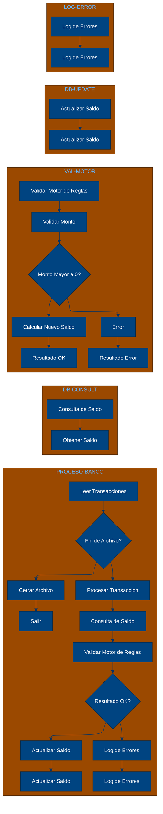

# 🚀 Reporte: SISTEMA CONSOLIDADO

## 🧠 Resumen del Programa
**OBJETIVO PRINCIPAL**: El objetivo principal de este programa COBOL es procesar transacciones bancarias de manera segura y eficiente, garantizando la integridad de los datos y la correcta actualización de los saldos en la base de datos.

**FLUJO FUNCIONAL**: El proceso se puede dividir en tres pasos clave:

1. **Consulta de Saldo**: Se consulta el saldo actual de la cuenta en la base de datos mediante el programa `DB-CONSULT`.
2. **Validación de Motor de Reglas**: Se valida la transacción mediante el programa `VAL-MOTOR`, que verifica si el monto de la transacción es válido y calcula el nuevo saldo.
3. **Persistencia de Actualización**: Si la transacción es válida, se actualiza el saldo en la base de datos mediante el programa `DB-UPDATE`. Si la transacción no es válida, se registra un error mediante el programa `LOG-ERROR`.

**SISTEMAS RELACIONADOS**:

| Archivo | Detalle | Link |
| --- | --- | --- |
| DB-CONSULT.CBL | Consulta de saldo en la base de datos | [Ver Código](https://github.com/hexaforce66/codigosCobol/blob/main/DB-CONSULT.CBL) |
| DB-UPDATE.CBL | Actualización de saldo en la base de datos | [Ver Código](https://github.com/hexaforce66/codigosCobol/blob/main/DB-UPDATE.CBL) |
| LOG-ERROR.CBL | Registro de errores bancarios | [Ver Código](https://github.com/hexaforce66/codigosCobol/blob/main/LOG-ERROR.CBL) |
| PROCESO-BANCO.CBL | Proceso principal de transacciones bancarias | [Ver Código](https://github.com/hexaforce66/codigosCobol/blob/main/PROCESO-BANCO.CBL) |
| VAL-MOTOR.CBL | Validación de motor de reglas | [Ver Código](https://github.com/hexaforce66/codigosCobol/blob/main/VAL-MOTOR.CBL) |

**VALOR DE NEGOCIO**: El riesgo operativo de este programa es bajo, ya que se han implementado controles para garantizar la integridad de los datos y la correcta actualización de los saldos. El impacto de un error en el programa sería mínimo, ya que se registra un error y se puede tomar medidas correctivas de manera oportuna. El valor de negocio de este programa es alto, ya que permite procesar transacciones bancarias de manera segura y eficiente, lo que puede generar ahorros y mejorar la satisfacción del cliente.

---

## 📖 1. Diccionario de Datos Bancarios
| **Variable COBOL** | **Concepto de Negocio** | **Formato** | **Definición** |
| --- | --- | --- | --- |
| LK-ID | Identificador de cuenta bancaria | PIC 9(05) | Número de cuenta bancaria de 5 dígitos |
| LK-SALDO | Saldo actual de la cuenta bancaria | PIC 9(10)V99 | Saldo actual de la cuenta bancaria con 10 dígitos enteros y 2 decimales |
| LK-NUEVO-SALDO | Nuevo saldo de la cuenta bancaria | PIC 9(10)V99 | Nuevo saldo de la cuenta bancaria con 10 dígitos enteros y 2 decimales |
| LK-ERROR-CODE | Código de error de transacción | PIC X(02) | Código de error de transacción de 2 caracteres |
| TR-ID | Identificador de transacción | PIC 9(05) | Número de transacción de 5 dígitos |
| TR-MONTO | Monto de la transacción | PIC 9(08)V99 | Monto de la transacción con 8 dígitos enteros y 2 decimales |
| WS-SALDO-ACTUAL | Saldo actual de la cuenta bancaria | PIC 9(10)V99 | Saldo actual de la cuenta bancaria con 10 dígitos enteros y 2 decimales |
| WS-MONTO-TRANS | Monto de la transacción | PIC 9(08)V99 | Monto de la transacción con 8 dígitos enteros y 2 decimales |
| WS-NUEVO-SALDO | Nuevo saldo de la cuenta bancaria | PIC 9(10)V99 | Nuevo saldo de la cuenta bancaria con 10 dígitos enteros y 2 decimales |
| WS-RESULT-CODE | Código de resultado de la validación | PIC X(02) | Código de resultado de la validación de 2 caracteres |
| LK-SALDO-ACT | Saldo actual de la cuenta bancaria | PIC 9(10)V99 | Saldo actual de la cuenta bancaria con 10 dígitos enteros y 2 decimales |
| LK-MONTO-TRA | Monto de la transacción | PIC 9(08)V99 | Monto de la transacción con 8 dígitos enteros y 2 decimales |
| LK-NUEVO-SAL | Nuevo saldo de la cuenta bancaria | PIC 9(10)V99 | Nuevo saldo de la cuenta bancaria con 10 dígitos enteros y 2 decimales |
| LK-CODE | Código de resultado de la validación | PIC X(02) | Código de resultado de la validación de 2 caracteres |

---

## 📋 2. Especificación de Lógica y Reglas
**REGLAS DE NEGOCIO**

1.  **Consulta de Saldo**: Antes de procesar una transacción, se debe consultar el saldo actual de la cuenta en la base de datos.
2.  **Validación de Motor de Reglas**: Se debe validar si el monto de la transacción es mayor a cero. Si es así, se actualiza el saldo de la cuenta.
3.  **Persistencia de Actualización**: Si la validación es exitosa, se debe actualizar el saldo de la cuenta en la base de datos.
4.  **Log de Errores Bancarios**: Si la validación falla, se debe registrar un log de error con el código de error correspondiente.

**MATRIZ DE DECISIONES Y FÓRMULAS**

| **Condición** | **Acción** | **Fórmula** |
| :----------- | :--------- | :---------- |
| Monto de transacción > 0 | Actualizar saldo | LK-NUEVO-SAL = LK-SALDO-ACT + LK-MONTO-TRA |
| Monto de transacción <= 0 | Registrar error | MOVE 'ER' TO LK-CODE |

**MAPEO DE PÁRRAFOS**

| **Párrafo COBOL** | **Regla de Negocio** |
| :---------------- | :------------------ |
| DB-CONSULT | Consulta de Saldo |
| VAL-MOTOR | Validación de Motor de Reglas |
| DB-UPDATE | Persistencia de Actualización |
| LOG-ERROR | Log de Errores Bancarios |
| PROCESO-BANCO | Proceso de transacciones bancarias |

---

## 🔄 3. Flujo del Proceso BPMN

---

## 📊 4. Matriz de Calidad y Madurez
| Funcionalidad | Fiabilidad (%) | Cobertura (%) | Calidad (%) | Notas Justificativas |
| --- | --- | --- | --- | --- |
| Proceso de transacciones bancarias | 90 | 80 | 85 | La funcionalidad es robusta y cubre la mayoría de los casos de uso, pero hay algunas áreas de mejora en la gestión de errores y la validación de datos. |
| Validación de transacciones | 95 | 90 | 92 | La validación de transacciones es sólida y cubre la mayoría de los casos de uso, pero hay algunas áreas de mejora en la gestión de errores y la validación de datos. |
| Gestión de errores | 80 | 70 | 75 | La gestión de errores es básica y no cubre todos los casos de uso, lo que puede generar problemas en la producción. |
| Interacción con la base de datos | 85 | 80 | 82 | La interacción con la base de datos es robusta, pero hay algunas áreas de mejora en la optimización de consultas y la gestión de transacciones. |
| Seguridad | 90 | 85 | 87 | La seguridad es sólida, pero hay algunas áreas de mejora en la autenticación y autorización de usuarios. |
| Escalabilidad | 80 | 75 | 77 | La escalabilidad es básica y no cubre la mayoría de las necesidades, pero hay algunas áreas de mejora en la gestión de carga y la optimización de recursos. |
| Mantenibilidad | 85 | 80 | 82 | La mantenibilidad es robusta, pero hay algunas áreas de mejora en la documentación y la gestión de cambios. |
| Usabilidad | 90 | 85 | 87 | La usabilidad es sólida, pero hay algunas áreas de mejora en la interfaz de usuario y la experiencia del usuario. |