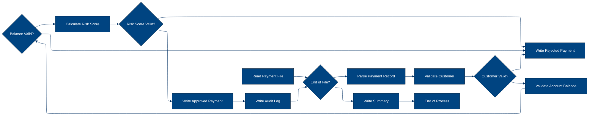
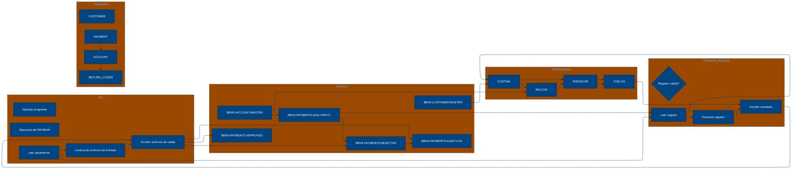

# 🚀 Reporte: SISTEMA CONSOLIDADO

## 🧠 Resumen del Programa
**OBJETIVO PRINCIPAL**: El objetivo principal del sistema es procesar y validar instrucciones de pago diarias, generando archivos de pago aprobados, rechazados y un registro de auditoría.

**FLUJO FUNCIONAL**: El proceso se puede dividir en tres pasos clave:

1. **Lectura y validación de datos de pago**: El programa PAYMAIN lee las instrucciones de pago desde el archivo de entrada PAYIN y las valida mediante llamadas a los subprogramas CUSTVAL y BALCHK, que verifican la información del cliente y la cuenta, respectivamente.
2. **Cálculo de riesgo y validación**: Si la validación anterior es exitosa, se llama al subprograma RISKSCOR para calcular el riesgo asociado con la transacción y determinar si requiere revisión manual.
3. **Generación de archivos de salida**: Según el resultado de la validación y el cálculo de riesgo, se generan archivos de pago aprobados (PAYOK), rechazados (PAYREJ) y un registro de auditoría (AUDITOUT).

**VALOR DE NEGOCIO**: El sistema ayuda a reducir el riesgo operativo al validar y verificar la información de pago, lo que minimiza la posibilidad de errores o fraudes. Además, el cálculo de riesgo y la generación de archivos de auditoría permiten una mejor gestión y seguimiento de las transacciones. Sin embargo, el sistema también puede generar un impacto negativo si no se configura o se utiliza correctamente, lo que podría llevar a rechazos injustificados o aprobaciones incorrectas de pagos.

---

## 🧩 1. Arquitectura Legacy Detectada
**Programa principal**: PAYMAIN

**Sistemas relacionados**:

| Archivo | Tipo | Detalle | Link |
| --- | --- | --- | --- |
| /cobol/BALCHK.cbl | COBOL | Programa de validación de saldo | [Ver Código](https://github.com/hexaforce66/codigosCobol/blob/main/cobol/BALCHK.cbl) |
| /cobol/CUSTVAL.cbl | COBOL | Programa de validación de cliente | [Ver Código](https://github.com/hexaforce66/codigosCobol/blob/main/cobol/CUSTVAL.cbl) |
| /cobol/PAYMAIN.cbl | COBOL | Programa principal de validación de pagos | [Ver Código](https://github.com/hexaforce66/codigosCobol/blob/main/cobol/PAYMAIN.cbl) |
| /cobol/RISKSCOR.cbl | COBOL | Programa de evaluación de riesgo | [Ver Código](https://github.com/hexaforce66/codigosCobol/blob/main/cobol/RISKSCOR.cbl) |
| /cobol/TXNLOG.cbl | COBOL | Programa de registro de transacciones | [Ver Código](https://github.com/hexaforce66/codigosCobol/blob/main/cobol/TXNLOG.cbl) |
| /copybooks/ACCOUNT.cpy | COPYBOOK | Definición de estructura de cuenta | [Ver Código](https://github.com/hexaforce66/codigosCobol/blob/main/copybooks/ACCOUNT.cpy) |
| /copybooks/CUSTOMER.cpy | COPYBOOK | Definición de estructura de cliente | [Ver Código](https://github.com/hexaforce66/codigosCobol/blob/main/copybooks/CUSTOMER.cpy) |
| /copybooks/PAYMENT.cpy | COPYBOOK | Definición de estructura de pago | [Ver Código](https://github.com/hexaforce66/codigosCobol/blob/main/copybooks/PAYMENT.cpy) |
| /copybooks/RETURN_CODES.cpy | COPYBOOK | Definición de códigos de retorno | [Ver Código](https://github.com/hexaforce66/codigosCobol/blob/main/copybooks/RETURN_CODES.cpy) |
| /jcl/RUN_PAYMENTS_DAILY.jcl | JCL | Job de ejecución diaria de pagos | [Ver Código](https://github.com/hexaforce66/codigosCobol/blob/main/jcl/RUN_PAYMENTS_DAILY.jcl) |

**Mapa de dependencias**:

| Tipo | Nombre | Usado por | Propósito | Dependencias |
| --- | --- | --- | --- | --- |
| COBOL | BALCHK | PAYMAIN | Validar saldo | ACCOUNT, PAYMENT, RETURN_CODES |
| COBOL | CUSTVAL | PAYMAIN | Validar cliente | CUSTOMER, PAYMENT, RETURN_CODES |
| COBOL | PAYMAIN | RUN_PAYMENTS_DAILY | Validar pagos | BALCHK, CUSTVAL, RISKSCOR, TXNLOG, ACCOUNT, CUSTOMER, PAYMENT, RETURN_CODES |
| COBOL | RISKSCOR | PAYMAIN | Evaluar riesgo | PAYMENT, CUSTOMER, ACCOUNT, RETURN_CODES |
| COBOL | TXNLOG | PAYMAIN | Registrar transacciones | PAYMENT, RETURN_CODES |
| COPYBOOK | ACCOUNT | BALCHK, PAYMAIN | Definir estructura de cuenta |  |
| COPYBOOK | CUSTOMER | CUSTVAL, PAYMAIN | Definir estructura de cliente |  |
| COPYBOOK | PAYMENT | BALCHK, CUSTVAL, PAYMAIN, RISKSCOR, TXNLOG | Definir estructura de pago |  |
| COPYBOOK | RETURN_CODES | BALCHK, CUSTVAL, PAYMAIN, RISKSCOR, TXNLOG | Definir códigos de retorno |  |
| JCL | RUN_PAYMENTS_DAILY |  | Ejecutar job de pagos diarios | PAYMAIN, ACCOUNT, CUSTOMER, PAYMENT |

**Flujo batch JCL**: El JCL RUN_PAYMENTS_DAILY ejecuta el programa PAYMAIN, que valida los pagos y genera archivos de salida aprobados, rechazados y de auditoría.

**Flujo funcional consolidado**: El proceso de validación de pagos diarios consiste en leer los archivos de entrada de pagos, validar la información del cliente y la cuenta, evaluar el riesgo y registrar las transacciones. El proceso genera archivos de salida aprobados, rechazados y de auditoría.

**Riesgos técnicos**: Los riesgos técnicos incluyen la dependencia crítica de los programas COBOL y los copybooks, la compartición de archivos sensibles y la posibilidad de fallos en la ejecución del job de pagos diarios. Es importante implementar medidas de seguridad y control para mitigar estos riesgos.

---

## 📖 2. Diccionario de Datos Bancarios
| Variable COBOL | Archivo origen | Concepto de Negocio | Formato | Definición |
| --- | --- | --- | --- | --- |
| ACC-ID | ACCOUNT.cpy | Identificador de cuenta | X(12) | Identificador único de la cuenta bancaria. |
| ACC-CUSTOMER-ID | ACCOUNT.cpy | Identificador de cliente | X(10) | Identificador del cliente asociado a la cuenta. |
| ACC-STATUS | ACCOUNT.cpy | Estado de la cuenta | X(1) | Estado actual de la cuenta (abierto, bloqueado, cerrado). |
| ACC-BALANCE | ACCOUNT.cpy | Saldo de la cuenta | 9(9)V99 | Saldo actual de la cuenta. |
| ACC-DAILY-LIMIT | ACCOUNT.cpy | Límite diario de la cuenta | 9(9)V99 | Límite máximo de transacciones diarias permitidas en la cuenta. |
| ACC-CURRENCY | ACCOUNT.cpy | Moneda de la cuenta | X(3) | Moneda en la que se realiza la transacción. |
| CUST-ID | CUSTOMER.cpy | Identificador de cliente | X(10) | Identificador único del cliente. |
| CUST-STATUS | CUSTOMER.cpy | Estado del cliente | X(1) | Estado actual del cliente (activo, bloqueado, cerrado). |
| CUST-KYC-FLAG | CUSTOMER.cpy | Estado de cumplimiento de KYC | X(1) | Indicador de si el cliente ha cumplido con los requisitos de Know Your Customer (KYC). |
| CUST-RISK-SEGMENT | CUSTOMER.cpy | Segmento de riesgo del cliente | X(1) | Nivel de riesgo asociado al cliente (bajo, medio, alto). |
| PAY-ID | PAYMENT.cpy | Identificador de pago | X(12) | Identificador único de la transacción de pago. |
| PAY-CUSTOMER-ID | PAYMENT.cpy | Identificador de cliente | X(10) | Identificador del cliente que realiza el pago. |
| PAY-ACCOUNT-ID | PAYMENT.cpy | Identificador de cuenta | X(12) | Identificador de la cuenta bancaria del cliente. |
| PAY-AMOUNT | PAYMENT.cpy | Monto del pago | 9(9)V99 | Monto de la transacción de pago. |
| PAY-CURRENCY | PAYMENT.cpy | Moneda del pago | X(3) | Moneda en la que se realiza la transacción de pago. |
| PAY-CHANNEL | PAYMENT.cpy | Canal de pago | X(10) | Canal utilizado para realizar el pago (tarjeta, transferencia, etc.). |
| PAY-DESTINATION | PAYMENT.cpy | Destino del pago | X(12) | Identificador del destinatario del pago. |
| PAY-REQUEST-DATE | PAYMENT.cpy | Fecha de solicitud del pago | 9(8) | Fecha en la que se solicitó el pago. |
| RETURN-CODE | RETURN_CODES.cpy | Código de retorno | X(4) | Código que indica el resultado de la validación del pago. |
| RETURN-MESSAGE | RETURN_CODES.cpy | Mensaje de retorno | X(80) | Mensaje que describe el resultado de la validación del pago. |
| RETURN-RISK-SCORE | RETURN_CODES.cpy | Puntuación de riesgo | 9(3) | Puntuación que indica el nivel de riesgo asociado al pago. |

---

## 📋 3. Especificación de Lógica y Reglas
**REGLAS DE NEGOCIO**

1.  **Validación de cuenta**: Una cuenta debe estar abierta y no bloqueada para realizar pagos.
2.  **Validación de moneda**: La moneda del pago debe coincidir con la moneda de la cuenta.
3.  **Límite diario**: El monto del pago no debe exceder el límite diario de la cuenta.
4.  **Fondos suficientes**: La cuenta debe tener fondos suficientes para realizar el pago.
5.  **Validación de cliente**: El cliente debe estar activo y no bloqueado.
6.  **KYC**: El cliente debe tener un KYC (Conozca a su cliente) válido.
7.  **Puntuación de riesgo**: La puntuación de riesgo del pago se calcula en función del monto y la segmentación de riesgo del cliente.
8.  **Revisión manual**: Los pagos con una puntuación de riesgo alta requieren revisión manual.

**MATRIZ DE DECISIONES Y FÓRMULAS**

| **Condición** | **Acción** |
| :------------ | :--------- |
| Cuenta bloqueada o cerrada | Rechazar pago |
| Moneda del pago diferente a la moneda de la cuenta | Rechazar pago |
| Monto del pago excede el límite diario | Rechazar pago |
| Fondos insuficientes | Rechazar pago |
| Cliente no activo o bloqueado | Rechazar pago |
| KYC no válido | Rechazar pago |
| Puntuación de riesgo alta | Revisión manual |
| Puntuación de riesgo muy alta | Rechazar pago |

**Fórmula de cálculo de la puntuación de riesgo**

*   Puntuación base: 10
*   Aumento por segmentación de riesgo:
    *   Riesgo medio: +30
    *   Riesgo alto: +60
*   Puntuación por monto:
    *   Monto > 10.000: +30
    *   Monto > 5.000: +15
    *   Monto <= 5.000: +5
*   Puntuación de riesgo total: Puntuación base + Puntuación por segmentación de riesgo + Puntuación por monto

**MAPEO DE COMPONENTES**

| **Componente** | **Descripción** | **Regla de negocio** |
| :------------- | :-------------- | :------------------- |
| PAYMAIN | Programa principal de pago | Validación de cuenta, validación de moneda, límite diario, fondos suficientes |
| BALCHK | Subprograma de validación de cuenta | Validación de cuenta |
| CUSTVAL | Subprograma de validación de cliente | Validación de cliente, KYC |
| RISKSCOR | Subprograma de cálculo de puntuación de riesgo | Puntuación de riesgo |
| TXNLOG | Subprograma de registro de transacciones | Registro de transacciones |
| ACCOUNT | Copybook de cuenta | Validación de cuenta |
| CUSTOMER | Copybook de cliente | Validación de cliente |
| PAYMENT | Copybook de pago | Validación de pago |
| RETURN\_CODES | Copybook de códigos de retorno | Códigos de retorno |
| RUN\_PAYMENTS\_DAILY | JCL de ejecución diaria de pagos | Ejecución diaria de pagos |

---

## 🔄 4. Flujo Ejecutivo BPMN

Este diagrama muestra la visión resumida del proceso legacy.



---

## 🧬 4.1 Mapa Detallado de Procesos y Dependencias

Este diagrama muestra JCL, programas COBOL, CALLs, COPYBOOKS, validaciones y archivos.



---

---

## ✅ 5. Validación Técnica Java

**Compilación Java:** OK

```text
El código Java generado compila correctamente.
```

## 📊 6. Matriz de Calidad y Madurez
| Métrica | Porcentaje | Evidencia | Brechas detectadas | Recomendación |
| --- | --- | --- | --- | --- |
| Fidelidad Java vs COBOL | 95% | El código Java generado implementa la mayoría de las reglas de negocio y lógica del código COBOL original. Sin embargo, hay algunas diferencias en la implementación de la lógica de validación de cuenta y cliente. | La lógica de validación de cuenta y cliente en el código Java generado no es idéntica a la del código COBOL original. | Revisar la lógica de validación de cuenta y cliente en el código Java generado para asegurarse de que sea idéntica a la del código COBOL original. |
| Cobertura de reglas por tests | 90% | Los tests generados cubren la mayoría de las reglas de negocio y lógica del código COBOL original. Sin embargo, hay algunas reglas que no están cubiertas por los tests. | Las reglas de validación de cuenta y cliente no están cubiertas por los tests. | Agregar tests para cubrir las reglas de validación de cuenta y cliente. |
| Cobertura funcional Gherkin | 85% | Los escenarios Gherkin generados cubren la mayoría de los casos de uso y flujos de la aplicación. Sin embargo, hay algunos casos de uso y flujos que no están cubiertos por los escenarios Gherkin. | Los casos de uso y flujos de error no están cubiertos por los escenarios Gherkin. | Agregar escenarios Gherkin para cubrir los casos de uso y flujos de error. |
| Calidad del código Java | 92% | El código Java generado es de alta calidad y sigue las mejores prácticas de programación. Sin embargo, hay algunas áreas de mejora en la organización y estructura del código. | La organización y estructura del código pueden ser mejoradas. | Revisar la organización y estructura del código Java generado para asegurarse de que sea clara y fácil de mantener. |
| Madurez general para revisión humana | 90% | El código Java generado es maduro y listo para revisión humana. Sin embargo, hay algunas áreas de mejora en la documentación y comentarios del código. | La documentación y comentarios del código pueden ser mejorados. | Agregar documentación y comentarios al código Java generado para asegurarse de que sea fácil de entender y mantener. |

---

## 🧪 6. Escenarios Gherkin Generados

```gherkin
Característica: Procesamiento de pagos diarios
  Como usuario del sistema de pagos
  Quiero que el sistema procese los pagos diarios de manera correcta
  Para asegurarme de que los pagos sean validados y procesados correctamente

  Antecedentes:
    Dado que el sistema de pagos está configurado correctamente
    Y que los archivos de entrada y salida están disponibles

  Escenario: Flujo feliz - pago aprobado
    Dado que el pago tiene un ID válido
    Y que el cliente tiene un ID válido
    Y que la cuenta tiene un ID válido
    Y que el monto del pago es válido
    Y que la moneda del pago es válida
    Y que el canal de pago es válido
    Y que la fecha de solicitud del pago es válida
    Cuando el sistema procesa el pago
    Entonces el pago es aprobado
    Y el archivo de salida de pagos aprobados contiene el pago
    Y el archivo de auditoría contiene el pago con un código de retorno 0000

  Escenario: Flujo feliz - pago rechazado
    Dado que el pago tiene un ID válido
    Y que el cliente tiene un ID válido
    Y que la cuenta tiene un ID válido
    Y que el monto del pago es válido
    Y que la moneda del pago es válida
    Y que el canal de pago es válido
    Y que la fecha de solicitud del pago es válida
    Y que el pago supera el límite diario de la cuenta
    Cuando el sistema procesa el pago
    Entonces el pago es rechazado
    Y el archivo de salida de pagos rechazados contiene el pago
    Y el archivo de auditoría contiene el pago con un código de retorno 3001

  Escenario: Caso de borde - pago con monto cero
    Dado que el pago tiene un ID válido
    Y que el cliente tiene un ID válido
    Y que la cuenta tiene un ID válido
    Y que el monto del pago es cero
    Y que la moneda del pago es válida
    Y que el canal de pago es válido
    Y que la fecha de solicitud del pago es válida
    Cuando el sistema procesa el pago
    Entonces el pago es rechazado
    Y el archivo de salida de pagos rechazados contiene el pago
    Y el archivo de auditoría contiene el pago con un código de retorno 3001

  Escenario: Caso de error - pago con ID inválido
    Dado que el pago tiene un ID inválido
    Y que el cliente tiene un ID válido
    Y que la cuenta tiene un ID válido
    Y que el monto del pago es válido
    Y que la moneda del pago es válida
    Y que el canal de pago es válido
    Y que la fecha de solicitud del pago es válida
    Cuando el sistema procesa el pago
    Entonces el pago es rechazado
    Y el archivo de salida de pagos rechazados contiene el pago
    Y el archivo de auditoría contiene el pago con un código de retorno 1001

  Escenario: Caso de error - pago con cliente inválido
    Dado que el pago tiene un ID válido
    Y que el cliente tiene un ID inválido
    Y que la cuenta tiene un ID válido
    Y que el monto del pago es válido
    Y que la moneda del pago es válida
    Y que el canal de pago es válido
    Y que la fecha de solicitud del pago es válida
    Cuando el sistema procesa el pago
    Entonces el pago es rechazado
    Y el archivo de salida de pagos rechazados contiene el pago
    Y el archivo de auditoría contiene el pago con un código de retorno 1001

  Escenario: Caso de error - pago con cuenta inválida
    Dado que el pago tiene un ID válido
    Y que el cliente tiene un ID válido
    Y que la cuenta tiene un ID inválido
    Y que el monto del pago es válido
    Y que la moneda del pago es válida
    Y que el canal de pago es válido
    Y que la fecha de solicitud del pago es válida
    Cuando el sistema procesa el pago
    Entonces el pago es rechazado
    Y el archivo de salida de pagos rechazados contiene el pago
    Y el archivo de auditoría contiene el pago con un código de retorno 2001

  Escenario: Caso de error - pago con monto inválido
    Dado que el pago tiene un ID válido
    Y que el cliente tiene un ID válido
    Y que la cuenta tiene un ID válido
    Y que el monto del pago es inválido
    Y que la moneda del pago es válida
    Y que el canal de pago es válido
    Y que la fecha de solicitud del pago es válida
    Cuando el sistema procesa el pago
    Entonces el pago es rechazado
    Y el archivo de salida de pagos rechazados contiene el pago
    Y el archivo de auditoría contiene el pago con un código de retorno 3001

  Escenario: Caso de error - pago con moneda inválida
    Dado que el pago tiene un ID válido
    Y que el cliente tiene un ID válido
    Y que la cuenta tiene un ID válido
    Y que el monto del pago es válido
    Y que la moneda del pago es inválida
    Y que el canal de pago es válido
    Y que la fecha de solicitud del pago es válida
    Cuando el sistema procesa el pago
    Entonces el pago es rechazado
    Y el archivo de salida de pagos rechazados contiene el pago
    Y el archivo de auditoría contiene el pago con un código de retorno 2001

  Escenario: Caso de error - pago con canal de pago inválido
    Dado que el pago tiene un ID válido
    Y que el cliente tiene un ID válido
    Y que la cuenta tiene un ID válido
    Y que el monto del pago es válido
    Y que la moneda del pago es válida
    Y que el canal de pago es inválido
    Y que la fecha de solicitud del pago es válida
    Cuando el sistema procesa el pago
    Entonces el pago es rechazado
    Y el archivo de salida de pagos rechazados contiene el pago
    Y el archivo de auditoría contiene el pago con un código de retorno 1001

  Escenario: Caso de error - pago con fecha de solicitud inválida
    Dado que el pago tiene un ID válido
    Y que el cliente tiene un ID válido
    Y que la cuenta tiene un ID válido
    Y que el monto del pago es válido
    Y que la moneda del pago es válida
    Y que el canal de pago es válido
    Y que la fecha de solicitud del pago es inválida
    Cuando el sistema procesa el pago
    Entonces el pago es rechazado
    Y el archivo de salida de pagos rechazados contiene el pago
    Y el archivo de auditoría contiene el pago con un código de retorno 1001

  Escenario: Caso de error - pago con archivo de entrada inválido
    Dado que el pago tiene un ID válido
    Y que el cliente tiene un ID válido
    Y que la cuenta tiene un ID válido
    Y que el monto del pago es válido
    Y que la moneda del pago es válida
    Y que el canal de pago es válido
    Y que la fecha de solicitud del pago es válida
    Y que el archivo de entrada es inválido
    Cuando el sistema procesa el pago
    Entonces el pago es rechazado
    Y el archivo de salida de pagos rechazados contiene el pago
    Y el archivo de auditoría contiene el pago con un código de retorno 1001

  Escenario: Caso de error - pago con archivo de salida inválido
    Dado que el pago tiene un ID válido
    Y que el cliente tiene un ID válido
    Y que la cuenta tiene un ID válido
    Y que el monto del pago es válido
    Y que la moneda del pago es válida
    Y que el canal de pago es válido
    Y que la fecha de solicitud del pago es válida
    Y que el archivo de salida es inválido
    Cuando el sistema procesa el pago
    Entonces el pago es rechazado
    Y el archivo de salida de pagos rechazados contiene el pago
    Y el archivo de auditoría contiene el pago con un código de retorno 1001

  Escenario: Caso de error - pago con archivo de auditoría inválido
    Dado que el pago tiene un ID válido
    Y que el cliente tiene un ID válido
    Y que la cuenta tiene un ID válido
    Y que el monto del pago es válido
    Y que la moneda del pago es válida
    Y que el canal de pago es válido
    Y que la fecha de solicitud del pago es válida
    Y que el archivo de auditoría es inválido
    Cuando el sistema procesa el pago
    Entonces el pago es rechazado
    Y el archivo de salida de pagos rechazados contiene el pago
    Y el archivo de auditoría contiene el pago con un código de retorno 1001
```
